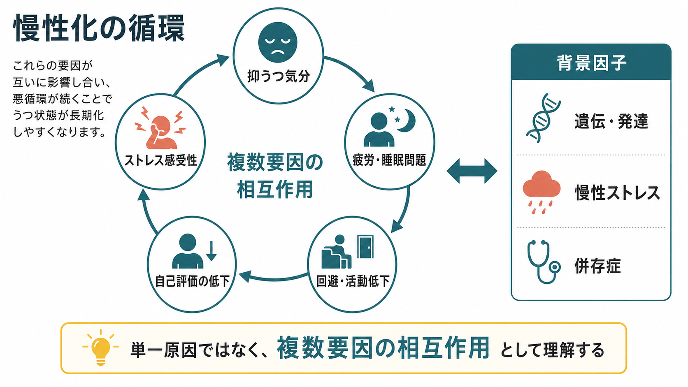
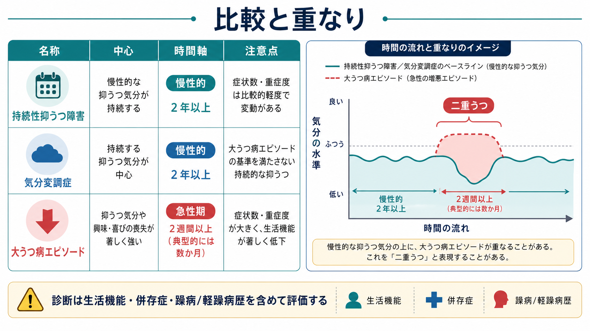

# 持続性抑うつ障害とは何か

## 要点

- 持続性抑うつ障害は、慢性的な[[抑うつ気分とは何か|抑うつ気分]]が長く続く状態を、時間経過に注目して捉える診断概念である。
- DSM-5以降の持続性抑うつ障害は、従来の気分変調症だけでなく、慢性大うつ病や、大うつ病エピソードが十分に寛解しない経過も含む広い概念として導入された[1][2]。
- ICD-11では「持続性抑うつ障害」という名称よりも、気分変調症（dysthymic disorder）が分類名として残っており、慢性的な低い気分を中心に定義される[3]。
- 重要なのは「軽い抑うつ」ではなく、「長く続くことで生活機能・対人関係・自己評価をじわじわ損なう抑うつ」と理解することである[2]。

## この記事で答える問い

1. 持続性抑うつ障害は、気分変調症や大うつ病とどう違うのか。
2. なぜ慢性的な[[気分とは何か|気分]]の落ち込みは見逃されやすいのか。
3. 研究・臨床では、どのような評価軸と支援方針が重要になるのか。

## まず結論

持続性抑うつ障害は、「症状が強いか弱いか」だけでなく、「抑うつ状態がどれくらい続き、どれくらい回復しないか」に注目する概念である。成人では、抑うつ気分がほとんど一日中、そうでない日より多く、少なくとも2年以上続くことが中核になる。小児・青年では1年以上が目安とされ、抑うつ気分のかわりに持続的な易怒性として現れることもある[1]。

従来の気分変調症は、比較的軽いが慢性的な抑うつを指すことが多かった。一方、DSM-5以降の持続性抑うつ障害は、気分変調症、慢性大うつ病、十分に回復しない反復性うつ病などをまとめる上位概念として扱われる[2]。そのため、同じ「持続性抑うつ障害」でも、症状数、重症度、発症年齢、大うつ病エピソードの重なり、[[不安とは何か|不安]]や物質使用などの併存によって臨床像はかなり異なる。

## 背景

抑うつは、ある時点の症状だけを見ると「落ち込んでいる」「意欲が出ない」「眠れない」といった横断面の問題に見える。しかし臨床上は、時間軸が非常に重要である。2週間以上のまとまった大うつ病エピソードとして急に悪化する場合もあれば、低い気分が年単位で続き、その上により深いエピソードが重なる場合もある。

慢性うつ病研究では、うつ病性障害の一部が慢性経過をとり、エピソード性の大うつ病よりも機能障害が大きくなる場合があると指摘されてきた[2]。気分変調症は、本人にも周囲にも「性格」「悲観的な人」「元気がないだけ」と見なされやすく、治療につながるまで時間がかかりやすい。ここに、持続性抑うつ障害を独立して学ぶ意義がある。

## 基本概念

### DSM-5系の持続性抑うつ障害

DSM-5系の持続性抑うつ障害では、成人で2年以上、小児・青年で1年以上の慢性的な抑うつ気分が中核である。これに、食欲低下または過食、[[不眠とは何か|不眠]]または過眠、低エネルギーまたは疲労、自己評価の低下、集中困難または決断困難、絶望感のうち複数が伴う[1]。

さらに、経過中に2か月を超えて症状が消える期間がないこと、躁病・軽躁病エピソードがないこと、物質や身体疾患、精神病性障害だけでは説明できないこと、生活・社会・職業などの機能に臨床的な苦痛または障害があることが評価される[1]。このため、[[躁状態とは何か|躁状態]]や[[軽躁状態とは何か|軽躁状態]]の既往、甲状腺機能異常などの身体疾患、薬物・アルコールなどの影響、[[物質使用歴はどのように聞くべきか|物質使用歴]]を確認することが重要になる。

### 気分変調症との関係

ICD-11では、気分変調症は「2年以上続く持続的な抑うつ気分」を中心に定義され、最初の2年間に抑うつエピソードの診断要件を満たす2週間の期間がないこと、躁病・混合・軽躁病エピソードの既往がないことが重視される[3]。つまりICD-11の気分変調症は、DSM-5系の持続性抑うつ障害の中でも「慢性的だが、初期には大うつ病エピソードの閾値を満たさない低い気分」に近い。

一方、DSM-5系の持続性抑うつ障害は、気分変調症を含みつつ、慢性大うつ病や「二重うつ」と呼ばれる重なりも表現できる。二重うつとは、慢性的な低い気分の上に、より重い大うつ病エピソードが重なる経過を指す臨床的な言い方である[1][2]。

## 仕組み

持続性抑うつ障害に単一の原因があるわけではない。研究レビューでは、遺伝的脆弱性、発達歴、幼少期逆境、慢性ストレス、対人関係の困難、神経症傾向、不安の高さ、社会的孤立、身体疾患や物質使用などが、慢性化のリスクや維持因子として議論されている[1][2]。

神経生物学的には、セロトニン系、ストレス応答、睡眠、炎症、前頭前野・帯状皮質・扁桃体・海馬などが候補として挙げられてきたが、持続性抑うつ障害に特異的で再現性の高いバイオマーカーは確立していない[1][2]。したがって、「この脳部位が壊れているから起こる」と単純化するより、気分、睡眠、疲労、回避、自己評価、対人ストレスが相互に影響し、長い時間をかけて悪循環を作ると理解する方が臨床的に有用である。

たとえば、低い気分が続くと活動量が落ち、達成感や報酬経験が減る。活動低下は[[快感消失とは何か|快感消失]]や[[意欲低下とは何か|意欲低下]]を強め、自己評価の低下や将来への絶望感につながる。睡眠の乱れや疲労が重なると、対人場面や仕事・学業への参加がさらに難しくなる。こうした循環は、症状が激烈でなくても、年単位では大きな機能障害を生む。

## 図解

上の2枚は、この記事で使う図解である。1枚目は慢性化の循環を、2枚目は持続性抑うつ障害・気分変調症・大うつ病エピソードの重なりを示している。

### 図解案：概念地図

画像生成では、概念地図の候補に別テーマの語が混入したため、本文には挿入しない。必要なら次のプロンプトで再生成する。

> 「持続性抑うつ障害とは何か」という日本語インフォグラフィック。中央に「持続性抑うつ障害」、周囲に「慢性的な抑うつ気分」「成人では2年以上」「気分変調症との関係」「大うつ病エピソードとの重なり」「生活機能への影響」「鑑別と併存」を配置する。白背景、ティールとネイビー中心、医療教育向け、診断指示ではなく概念整理。日本語テキストは正確に、ロゴ・透かしなし。

## 臨床・研究との接続

臨床では、まず時間軸を丁寧に確認する。いつから気分が低いのか、完全に楽だった期間はどれくらいあるのか、途中で2週間以上の明確な大うつ病エピソードがあったのか、[[希死念慮とは何か|希死念慮]]や自傷・自殺企図があるのかを、生活史とともに整理する。[[精神科診断面接で尺度をどう使うか|尺度]]は症状の重症度や変化を追う補助にはなるが、診断は面接、経過、機能障害、併存症、除外診断を合わせて判断する[1][4]。

治療・支援では、心理療法、薬物療法、両者の併用、社会・職業的支援を、本人の希望、重症度、併存症、これまでの治療反応に応じて検討する。NICEは、慢性抑うつ症状に対して、慢性化を維持する回避、反すう、対人困難に焦点を当てた認知行動療法、SSRI・SNRI・三環系抗うつ薬、心理療法と薬物療法の併用などを選択肢として挙げている[4]。ネットワークメタ解析でも、複数の抗うつ薬、心理療法、併用療法に一定の有効性が示されているが、研究間の対象者や診断概念は均一ではない[5]。

小児・青年では、持続的な易怒性、学業低下、身体愁訴、不安、家族・学校環境との相互作用が前景化することがある。小児青年期のガイドラインは、大うつ病と持続性抑うつ障害を含め、発達段階、家族、学校、リスク評価を組み込んだ包括的評価を重視している[6]。

## よくある誤解

**誤解1：持続性抑うつ障害は軽いうつ病である。**  
横断面では症状が軽く見える場合があるが、長く続くため生活機能への累積的影響は大きい。研究レビューでは、慢性うつ病はエピソード性うつ病よりも障害が重い場合があるとされる[2]。

**誤解2：性格の問題なので治療対象ではない。**  
長年続くため本人や周囲が「もともとの性格」と解釈しやすいが、診断では経過、症状、機能障害、併存症を評価する。気分変調症は見逃されやすく、重いエピソードが重なって初めて気づかれることもある[2]。

**誤解3：検査で原因を確定できる。**  
現在、持続性抑うつ障害を単独で確定する血液検査や画像検査はない。身体疾患や物質の影響を除外するための検査は重要だが、診断の中心は臨床面接と経過評価である[1]。

**誤解4：薬か心理療法のどちらかだけで考えればよい。**  
慢性抑うつでは、症状だけでなく回避、反すう、対人困難、生活リズム、職業・学業、孤立などが維持因子になる。したがって、薬物療法・心理療法・生活支援・社会的支援を組み合わせて考える視点が重要である[4][5]。

## 関連ノート

- [[抑うつ気分とは何か]]
- [[気分とは何か]]
- [[快感消失とは何か]]
- [[意欲低下とは何か]]
- [[不眠とは何か]]
- [[希死念慮とは何か]]
- [[躁状態とは何か]]
- [[軽躁状態とは何か]]
- [[精神科診断における除外診断とは何か]]
- [[精神科治療計画はどのように立てるのか]]

MOC更新候補: [[MOC｜精神医学]], [[MOC｜症候学]], [[MOC｜臨床実践・治療]]

今後の作成候補: 「大うつ病エピソードとは何か」「気分変調症とは何か」「慢性うつ病とは何か」「二重うつとは何か」

## 理解チェック

1. 持続性抑うつ障害で「2年以上」という時間軸が重要になるのはなぜか。
2. 気分変調症とDSM-5系の持続性抑うつ障害は、どの点で重なり、どの点で範囲が異なるか。
3. 慢性的な抑うつ気分を評価するとき、躁病・軽躁病歴や物質使用歴を確認する理由は何か。
4. 慢性化の維持因子として、回避、反すう、対人困難、睡眠問題はどのように関係しうるか。

## 参考文献

[1] Patel RK, Aslam SP, Rose GM. Persistent Depressive Disorder. *StatPearls*. Last update: 2024-08-11. https://www.ncbi.nlm.nih.gov/books/NBK541052/

[2] Schramm E, Klein DN, Elsaesser M, Furukawa TA, Domschke K. Review of dysthymia and persistent depressive disorder: history, correlates, and clinical implications. *The Lancet Psychiatry*. 2020;7(9):801-812. https://doi.org/10.1016/S2215-0366(20)30099-7

[3] World Health Organization. ICD-11 for Mortality and Morbidity Statistics, Dysthymic disorder 6A72. https://icd.who.int/browse/latest-release/mms/en#810797047

[4] National Institute for Health and Care Excellence. Depression in adults: treatment and management. NICE guideline NG222. Published 2022-06-29; reviewed 2026-01-30. https://www.nice.org.uk/guidance/ng222

[5] Kriston L, von Wolff A, Westphal A, Hölzel LP, Härter M. Efficacy and acceptability of acute treatments for persistent depressive disorder: a network meta-analysis. *Depression and Anxiety*. 2014;31(8):621-630. https://doi.org/10.1002/da.22236

[6] Walter HJ, Abright AR, Bukstein OG, Diamond J, Keable H, Ripperger-Suhler J, Rockhill C. Clinical Practice Guideline for the Assessment and Treatment of Children and Adolescents With Major and Persistent Depressive Disorders. *Journal of the American Academy of Child & Adolescent Psychiatry*. 2023;62(5):479-502. https://doi.org/10.1016/j.jaac.2022.10.001
