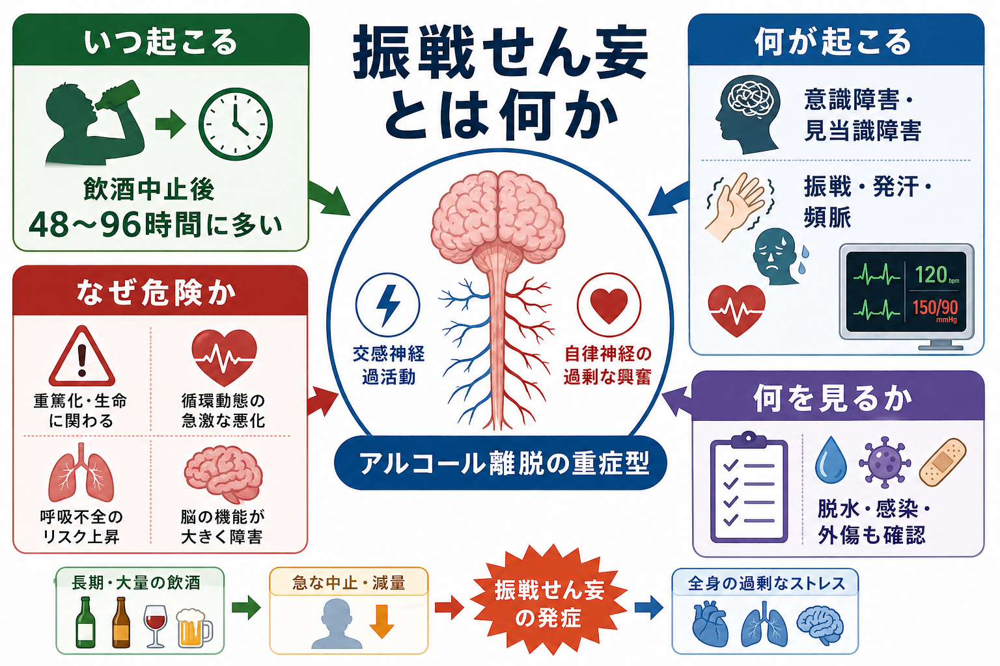
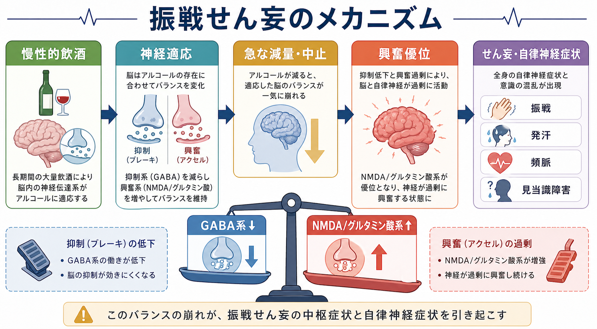
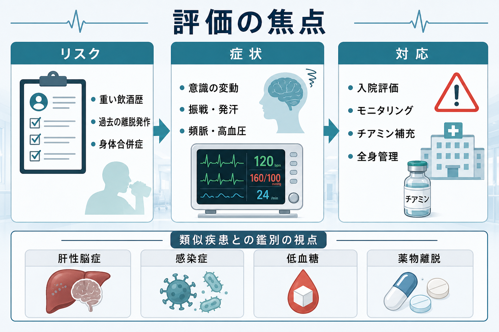

# 振戦せん妄とは何か

## 要点

- 振戦せん妄は、慢性的・大量の飲酒を急に減らしたり中止したりした後に起こりうる、[[離脱症状とは何か|アルコール離脱]]の重症型である。
- 中核は「振戦」だけではなく、[[せん妄とは何か|せん妄]]、すなわち注意・覚醒・見当識の変動を伴う[[意識障害とは何か|意識障害]]である。
- 自律神経過活動として発汗、頻脈、高血圧、発熱、振戦、焦燥が目立ち、幻視・幻聴・錯覚を伴うこともある[1][2]。
- 機序としては、慢性的飲酒に適応した脳で、[[GABAは脳で何をしているのか|GABA]]系の抑制低下と[[グルタミン酸は脳で何をしているのか|NMDA/グルタミン酸]]系の相対的過活動が前景化する[2][3]。
- 医療的には、けいれん、脱水、感染、外傷、肝性脳症、低血糖、ウェルニッケ脳症などを同時に評価する必要がある[4][5]。

## この記事で答える問い

1. 振戦せん妄は、通常のアルコール離脱や幻覚症と何が違うのか。
2. なぜ飲酒をやめた後に、むしろ脳と自律神経が過剰に興奮するのか。
3. 臨床では、どのような赤旗と鑑別を見落とさないべきか。

## まず結論

振戦せん妄は、「手が震える状態」ではなく、「アルコール離脱を背景に、脳全体の覚醒・注意・自律神経制御が崩れる状態」と捉えると理解しやすい。名称には tremens、つまり振戦が入るが、臨床的に重要なのは[[覚醒と意識内容は何が違うのか|覚醒水準]]や注意の変動、見当識障害、幻覚・錯覚、自律神経症状の組み合わせである[1][2]。

典型的には、長期大量飲酒のある人が飲酒を急に減らした後、数日以内に発症する。多くの離脱症状は数時間から 1 日程度で始まるが、振戦せん妄はしばしば 48〜72 時間以降に目立ち、3〜8 日の幅で起こりうるとされる[2][4]。したがって「昨夜から酒を飲んでいないが、今日はまだ軽い不眠と振戦だけ」という時点でも、既往歴や身体合併症によっては重症化リスクを見積もる必要がある。

## 背景

アルコールは急性には中枢神経を抑制する物質である。しかし、脳は慢性的なアルコール曝露に対して適応する。抑制系の働きは相対的に弱まり、興奮系の働きは相対的に強まる方向へ調整される。その状態でアルコールが急に抜けると、抑制の支えが外れ、興奮系と[[自律神経ネットワークは内臓状態をどう制御するのか|自律神経]]の過活動が前景化する[2][3]。

このため、振戦せん妄は精神症状だけで完結しない。意識障害、幻覚、焦燥に加えて、発汗、頻脈、高血圧、発熱、脱水、電解質異常、けいれんなどが絡み、内科・救急・精神科の境界に位置する病態になる。NICE は、急性アルコール離脱で離脱けいれんや振戦せん妄を起こしている、または高リスクと評価される人では、医学的管理下の離脱治療のため入院を推奨している[5]。

## 基本概念

### アルコール離脱のなかの位置づけ

アルコール離脱は、長期または大量の飲酒の後に飲酒量が急に減ることで生じる身体・精神症状のまとまりである。軽症では不眠、不安、悪心、手指振戦、発汗などが中心になる。重症化すると、けいれん、強い自律神経症状、せん妄が問題になる[2][4]。

振戦せん妄はこの重症側に位置する。NCBI MedGen/MeSH では、慢性飲酒の中止または減量によって誘発される急性器質性精神障害として整理され、混乱、妄想、鮮明な幻覚、振戦、焦燥、不眠、自律神経過活動を特徴とする[1]。

### せん妄と幻覚症の違い

アルコール離脱では幻覚が出ることがあるが、幻覚があるだけで振戦せん妄とは限らない。アルコール幻覚症では、幻聴や幻視が目立っても、意識の清明さや見当識が比較的保たれることがある。一方、振戦せん妄では注意・覚醒・見当識が変動し、会話のまとまりや状況理解が崩れやすい[2][4]。そのため、[[幻覚とは何か|幻覚]]の有無だけでなく、注意を保てるか、日時・場所・状況を把握しているか、日内変動があるかを見る。

### リスクを高める条件

リスク評価では、最後の飲酒からの時間、飲酒量と期間、過去の離脱けいれんや振戦せん妄、身体合併症、併用薬・他物質使用、栄養状態、感染や外傷を確認する[4][5]。とくに過去の複雑な離脱、すなわちけいれんやせん妄を伴う離脱は、現在のエピソードでも重症化リスクを高める[2][4]。この評価は[[物質使用歴はどのように聞くべきか|物質使用歴]]の聴取と身体診察を組み合わせて行う。

## 仕組み

### 抑制と興奮のバランスが崩れる

アルコールは急性には GABA 作動性の抑制を強め、グルタミン酸作動性の興奮を弱める方向に働く。慢性飲酒では、脳がこの状態に適応し、GABA 系の機能低下と NMDA/グルタミン酸系の上方調整が起こると説明される[2][3]。

飲酒を急に中止すると、アルコールによる抑制的な支えが消える。しかし、慢性的適応として強まっていた興奮系はすぐには戻らない。その結果、神経活動が興奮優位となり、振戦、不眠、焦燥、けいれん、自律神経過活動、せん妄につながる[3][4]。

### 自律神経症状は「精神的な緊張」だけではない

発汗、頻脈、高血圧、発熱、瞳孔散大などは、単なる不安反応ではなく、離脱に伴う中枢神経と自律神経の過活動として理解する必要がある[1][4]。ここを不安やパニックだけとして扱うと、脱水、感染、低酸素、電解質異常、けいれんリスクを見落としやすい。

### キンドリングという考え方

反復する離脱エピソードは、神経系の過敏化を通じて次回以降の離脱を重くする可能性がある。この「キンドリング」は、振戦せん妄や離脱けいれんの背景を説明する仮説としてしばしば言及される[4]。臨床的には、過去の離脱歴を「以前も大丈夫だったか」ではなく、「以前に震え、けいれん、混乱、入院があったか」と具体的に尋ねる意味がある。

## 図解

3 枚の図は、概念、機序、評価の焦点を分けている。

1. 1 枚目は、振戦せん妄をアルコール離脱の重症型として位置づける概念地図である。
2. 2 枚目は、GABA 系低下と NMDA/グルタミン酸系過活動による興奮優位を示す。
3. 3 枚目は、リスク、症状、対応、鑑別を臨床評価の流れとして整理する。

## 臨床・研究との接続

### 評価では「離脱」だけで説明しない

振戦せん妄が疑われても、すべてをアルコール離脱で説明してはいけない。せん妄は多因子性であり、感染、脱水、低血糖、低ナトリウム血症、肝性脳症、頭部外傷、薬物中毒・薬物離脱、ウェルニッケ脳症が併存しうる[4][5]。[[器質性精神病とは何か|器質性精神病]]や[[物質誘発性精神病とは何か|物質誘発性精神病]]との境界を考える際も、時間経過、意識水準、身体所見、検査所見を統合する必要がある。

### 治療研究では重症化予防が中心課題になる

薬物療法に関する古典的メタ分析では、ベンゾジアゼピン系薬はアルコール離脱の重症度、けいれん、せん妄の発生を減らす方向のエビデンスが示された[6]。Cochrane Review でも、ベンゾジアゼピン系薬はプラセボと比べて離脱けいれんに対する保護的効果が示される一方、試験の異質性により安全性や他アウトカムの結論には限界があるとされる[7]。この記事は教育・研究目的の概説であり、個別の薬剤選択や用量調整は施設プロトコルと専門的判断に依存する。

### チアミンは離脱症状そのものではなく合併症予防の文脈で重要

慢性的飲酒では栄養障害が併存しやすく、ウェルニッケ脳症を見逃すと重篤な後遺症につながる。NICE は、栄養不良リスク、非代償性肝疾患、急性離脱、医学的管理下の離脱治療などではチアミン投与を推奨している[5]。振戦せん妄の議論では、せん妄の鑑別としてウェルニッケ脳症を常に脇に置く必要がある。

## よくある誤解

### 「振戦が強いほど振戦せん妄である」

振戦は重要な徴候だが、診断の中心はせん妄である。手の震えが強くても意識・注意が保たれていれば、重い離脱ではあっても振戦せん妄とは限らない。逆に、振戦が目立たなくても見当識障害や注意の変動があれば、重症のせん妄として評価する。

### 「幻覚があるから統合失調症である」

アルコール離脱では幻覚や錯覚が出ることがある。鑑別では、急性の時間経過、飲酒中止との関係、自律神経症状、意識変動、身体合併症を確認する。一次性精神病との鑑別は重要だが、急性離脱の文脈ではせん妄を先に見落とさない姿勢が必要である[2][4]。

### 「落ち着かせればよい」

振戦せん妄は行動上の混乱だけでなく、全身状態の危機である。脱水、電解質異常、感染、外傷、低酸素、栄養障害を見ながら、呼吸・循環・体温・意識を継続的に評価する必要がある[4][5]。

## 関連ノート

- [[せん妄とは何か]]
- [[意識障害とは何か]]
- [[離脱症状とは何か]]
- [[物質使用歴はどのように聞くべきか]]
- [[GABAは脳で何をしているのか]]
- [[グルタミン酸は脳で何をしているのか]]
- [[自律神経ネットワークは内臓状態をどう制御するのか]]
- [[幻覚とは何か]]
- [[物質誘発性精神病とは何か]]
- [[依存症は報酬学習の病態としてどう理解できるのか]]

## 理解チェック

1. 振戦せん妄で「振戦」よりも診断上重要な意識・注意の特徴は何か。
2. 慢性的飲酒後の急な中止で、GABA 系と NMDA/グルタミン酸系はどのようにバランスを崩すか。
3. アルコール離脱せん妄を疑うとき、同時に除外・評価すべき身体疾患や合併症を 3 つ挙げよ。
4. アルコール幻覚症と振戦せん妄を区別するうえで、見当識や注意の評価がなぜ重要か。

## 関連ノート候補

- アルコール使用障害とは何か
- アルコール離脱とは何か
- ウェルニッケ脳症とは何か
- 肝性脳症とは何か
- CIWA-Arとは何か

## MOC更新候補

- `content/00_MOC/MOC｜精神医学.md`
- `content/00_MOC/MOC｜臨床実践.md`
- `content/00_MOC/MOC｜神経伝達物質.md`

## 未解決問題

- 振戦せん妄の発症予測を、飲酒歴、過去の離脱歴、バイタルサイン、検査値からどこまで精密化できるか。
- 高齢者、肝疾患、認知症、複数物質使用がある場合に、標準的な評価尺度をどこまで一般化できるか。
- 離脱管理後に、[[依存症は報酬学習の病態としてどう理解できるのか|依存症の再発予防]]と身体合併症管理をどのように継続的支援へ接続するか。

## 参考文献

[1] National Center for Biotechnology Information. Alcohol Withdrawal Delirium. *MeSH Browser*. https://www.ncbi.nlm.nih.gov/mesh/D000430

[2] Canver BR, Newman RK, Gomez AE. Alcohol Withdrawal Syndrome. *StatPearls*. Last update 2024-02-14. https://www.ncbi.nlm.nih.gov/sites/books/NBK441882/

[3] Schuckit MA. Recognition and management of withdrawal delirium (delirium tremens). *New England Journal of Medicine*. 2014;371(22):2109-2113. https://doi.org/10.1056/NEJMra1407298

[4] Grover S, Ghosh A. Delirium Tremens: Assessment and Management. *Journal of Clinical and Experimental Hepatology*. 2018;8(4):460-470. https://doi.org/10.1016/j.jceh.2018.04.012

[5] National Institute for Health and Care Excellence. Alcohol-use disorders: diagnosis and management of physical complications. Clinical guideline CG100. Published 2010; updated 2017. https://www.nice.org.uk/guidance/CG100/chapter/1-Recommendations

[6] Mayo-Smith MF. Pharmacological Management of Alcohol Withdrawal: A Meta-analysis and Evidence-Based Practice Guideline. *JAMA*. 1997;278(2):144-151. https://doi.org/10.1001/jama.1997.03550020076042

[7] Amato L, Minozzi S, Vecchi S, Davoli M. Benzodiazepines for alcohol withdrawal. *Cochrane Database of Systematic Reviews*. 2022;3:CD005063. https://doi.org/10.1002/14651858.CD005063.pub3

[8] American Society of Addiction Medicine. *The ASAM Clinical Practice Guideline on Alcohol Withdrawal Management*. 2020. https://www.asam.org/quality-care/clinical-guidelines/alcohol-withdrawal-management-guideline
