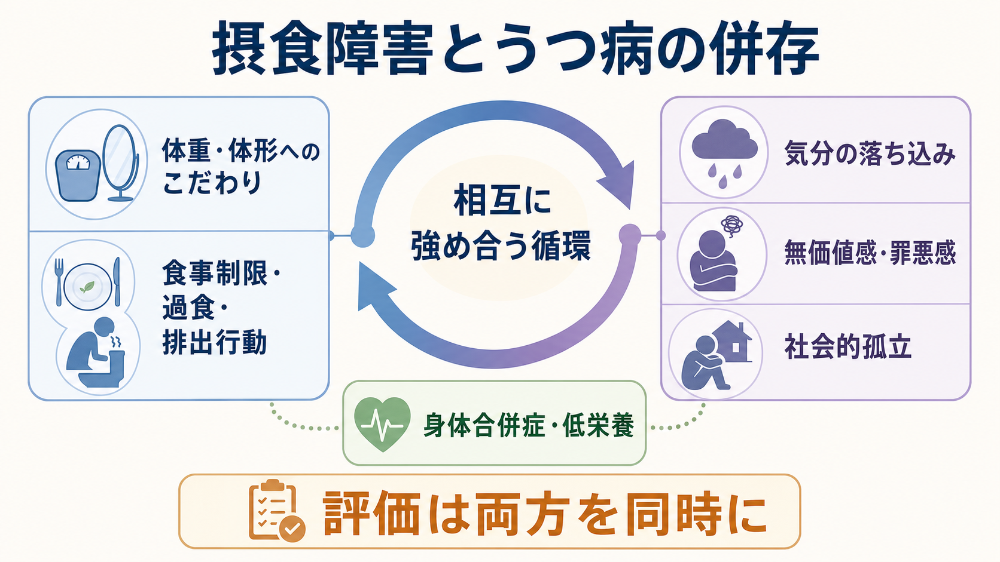
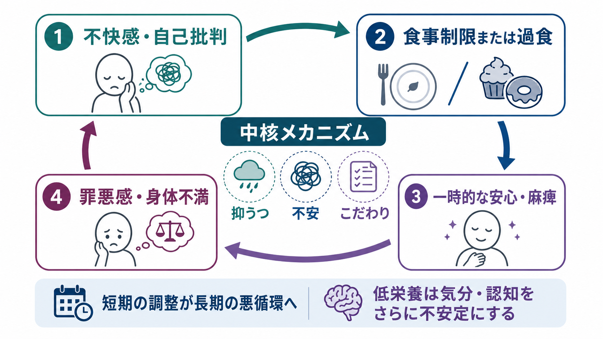
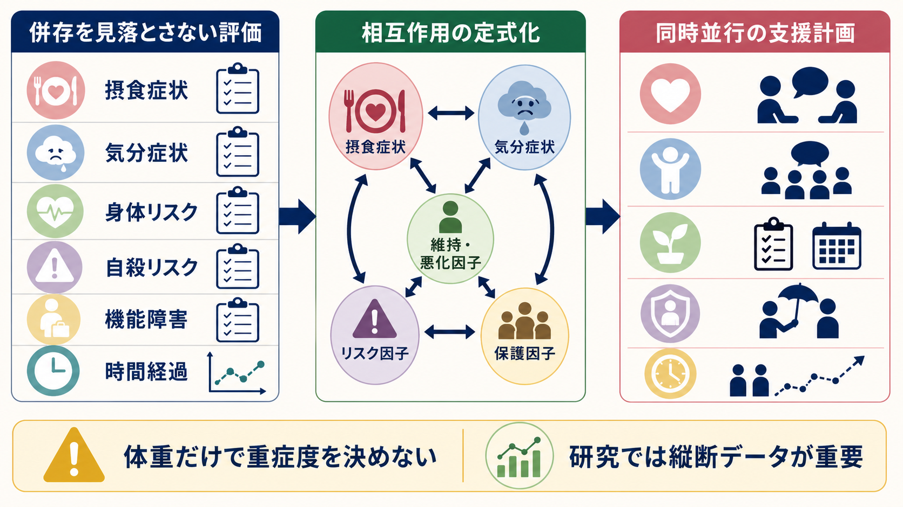

# 摂食障害とうつ病はどう併存するのか

## 要点

- [[摂食障害群とは何か|摂食障害]]とうつ病の併存は、「食べられない人が落ち込む」「気分が悪いから食べすぎる」という単純な一方向因果ではなく、体重・体形へのこだわり、食事制限・過食・排出行動、低栄養、罪悪感、社会的孤立が相互に強め合う状態として理解する。
- 診療ガイドラインでは、摂食障害の初期評価で、食行動・体重変化・代償行動だけでなく、併存する身体疾患、うつ病、不安、自傷・自殺リスク、強迫症状、物質使用を同時に確認することが重視される[1][2]。
- 神経性やせ症、神経性過食症、過食性障害では併存パターンが異なる。低体重や低栄養が目立たない場合でも、抑うつ、羞恥、機能障害、自殺リスクは見落とせない[2][3]。
- この記事は教育・研究目的の整理であり、個別診断や治療指示ではない。実際の評価や支援は、身体リスクと精神症状の両方を扱える専門職につなげて考える必要がある。

## この記事で答える問い

1. 摂食障害とうつ病は、どれくらい一緒に起こりやすいのか。
2. 体重・体形へのこだわりと気分症状は、どのように悪循環を作るのか。
3. 低栄養、過食、排出行動、罪悪感、社会的孤立は、併存をどう維持するのか。
4. 臨床・研究では、体重だけに還元せず何を評価すべきか。

## まず結論

摂食障害とうつ病の併存は、同じ人に二つの診断名が偶然並ぶだけではない。多くの場合、食行動の乱れと気分症状は同じ循環の中で結びつく。体重・体形への過大評価は自己価値を狭め、食事制限や過食、排出行動を「不安や自己批判を短期的に下げる手段」にしやすい。ところが、その短期的な安心は、身体不調、低栄養、認知の硬さ、罪悪感、孤立を通じて、長期的には抑うつを深めることがある[6]。

そのため評価では、摂食症状とうつ症状を別々に数えるだけでは不十分である。NICE は、摂食障害が疑われる人では身体健康、低栄養や排出行動の影響、うつ病・不安・自傷・強迫症状、物質使用、救急対応や自殺リスクの必要性を評価するよう勧めている[2]。APA のガイドラインも、初期評価で食行動、体重歴、代償行動、家族歴、併存する身体・精神疾患を確認することを重視する[1]。

## 背景

疫学研究では、摂食障害は比較的まれに見えても、心理社会的機能障害と併存精神疾患を伴いやすい。米国 National Comorbidity Survey Replication を用いた研究では、神経性やせ症、神経性過食症、過食性障害はいずれも他の DSM-IV 精神疾患との併存が有意に多く、役割機能障害や治療未受診の問題も示された[3]。

特に[[過食性障害とは何か|過食性障害]]では、DSM-5 以降に独立した診断カテゴリーとして扱われるようになり、うつ病や不安症などの精神疾患との併存が注目されている。成人 BED の系統的レビュー・メタ解析は、BED が心理的・身体的健康の低下、主要うつ病などの精神疾患、対人・社会的機能障害、肥満や代謝疾患と関連することを整理している[4]。2024 年の BED 併存に関する系統的レビューも、BED が単独で存在するだけでなく、他の精神疾患と組み合わさって全体の疾病負荷を高めることを示している[5]。

ただし、「うつ病が摂食障害を起こす」「摂食障害がうつ病を起こす」と一方向に決めるのは粗い。発症順序は人によって異なり、同じ人の中でも、思春期の体形不満、慢性ストレス、完璧主義、対人困難、報酬系の変化、身体合併症が時間とともに絡み合う。ここでは、診断名よりも「何が何を維持しているか」に注目する。

## 基本概念

### 摂食障害側の中核

[[神経性やせ症とは何か|神経性やせ症]]や[[神経性過食症とは何か|神経性過食症]]では、自己評価が体重・体形・食事コントロールに過度に依存しやすい。Fairburn らのトランス診断的認知行動モデルでは、この「体形・体重の過大評価」が食事制限、身体確認、回避、過食、排出行動を維持する中心的機構として位置づけられる[6]。

過食性障害では、必ずしも体重・体形へのこだわりが診断の中心条件ではないが、過食後の嫌悪感、抑うつ、罪悪感は診断基準にも関係する重要な臨床情報である[4]。したがって、摂食障害とうつ病の併存を考えるときは、体重だけでなく、食行動の機能、食後の感情、自己評価、回避、社会的文脈を見る必要がある。

### うつ病側の中核

[[大うつ病性障害とは何か|大うつ病性障害]]では、抑うつ気分、興味・喜びの低下、睡眠・食欲・体重変化、疲労、集中困難、罪悪感、希死念慮などがまとまって生活機能を下げる。摂食障害と併存すると、食欲低下や体重変化がうつ病由来なのか、食事制限・過食・排出行動の一部なのかが見えにくくなる。

たとえば「食べられない」は、抑うつによる食欲低下でも、体重増加恐怖による制限でも、身体感覚への嫌悪や回避でも起こりうる。「食べすぎる」は、非定型うつ病の食欲増加でも、過食エピソードでも、ストレス対処としての食行動でも起こりうる。だからこそ、[[食欲と体重変化から何がわかるのか|食欲と体重変化]]は、症状の量だけでなく、意味と文脈を含めて評価する。

## 仕組み

### 1. 体重・体形へのこだわりが自己評価を狭める

体重・体形・食事のコントロールが自己価値の中心になると、生活の他の領域から得られる肯定感が弱まりやすい。失敗感や自己批判は、食事制限や過度な運動を「取り戻す行動」として強める。一方で、制限に失敗したと感じたときには、過食、排出行動、罪悪感、抑うつが起こりやすくなる[6]。

### 2. 制限と過食は気分調整として働くことがある

食事制限は、不安や自己批判を一時的に下げることがある。過食も、つらい感情を一時的に鈍らせる、または空虚感を埋める行動として機能することがある。しかし、その後に身体不快、羞恥、罪悪感、さらなる制限が続くと、抑うつ症状は強まりやすい。短期の調整が、長期の悪循環に変わる。

### 3. 低栄養と身体合併症が気分・認知を不安定にする

低体重、急速な体重減少、電解質異常、睡眠障害、脱水、内分泌変化は、集中困難、易疲労感、情動不安定、意欲低下を強める。NICE は、摂食障害の治療要否を BMI や罹病期間のような単一指標だけで決めないよう注意している[2]。これは、標準体重でも重い過食・排出行動、強い抑うつ、自傷・自殺リスク、身体合併症がありうるからである。

### 4. 社会的孤立が両方を維持する

食事場面の回避、体形への恥、対人不安、家族や友人との摩擦は、社会的孤立を強める。孤立は抑うつを悪化させ、抑うつは外出・食事・相談をさらに難しくする。[[不安症群とは何か|不安症]]や[[強迫症とは何か|強迫症状]]が併存すると、食事ルールや身体確認がさらに硬くなることもある。

## 図解

| 図 | 見るポイント |
|---|---|
| 図1 | 摂食障害とうつ病の併存を、体重・体形へのこだわり、食行動、気分症状、低栄養、社会的孤立の相互作用として見る。 |
| 図2 | 不快感や自己批判から、制限・過食、一時的な安心、罪悪感・身体不満へ進む悪循環を整理する。 |
| 図3 | 臨床・研究では、摂食症状、気分症状、身体リスク、自殺リスク、機能障害、時間経過を同時に評価する。 |

## 臨床・研究との接続

### 臨床評価では「両方を同時に」見る

摂食障害が疑われるとき、うつ症状の有無だけを聞くのでは不十分である。抑うつ、興味低下、疲労、罪悪感、希死念慮が、食行動とどの時間順序で結びつくかを確認する必要がある。逆に、うつ病の評価で食欲・体重変化が目立つ場合には、食事制限、過食、排出行動、過度な運動、体形確認、食事場面の回避を確認する。

自傷・自殺リスクは特に重要である。2026 年の摂食障害死亡リスクに関する系統的レビュー・メタ解析では、摂食障害全体で一般人口より全死亡リスクが高く、特に神経性やせ症で高かった。さらに、自殺関連死亡リスクも高く、気分障害を含む精神疾患併存は死亡リスク上昇と関連していた[7]。これは、[[気分障害における自殺リスクとは何か|気分障害における自殺リスク]]を、摂食障害の文脈でも独立して評価すべきことを示す。

### 支援では体重だけを目標にしない

低体重や医学的危険がある場合、身体安全の確保は優先される。しかし、体重だけが改善しても、体形へのこだわり、食事恐怖、過食・排出行動、抑うつ、孤立が残ることがある。NICE は、摂食障害の心理療法で栄養、認知再構成、気分調整、社会的技能、身体イメージ、自尊感情、再発予防などを扱うことを含めている[2]。

これは、[[報酬系の異常はうつ病をどう説明するのか|報酬系の異常とうつ病]]や[[摂食障害は脳の報酬系や身体感覚とどう関わるのか|摂食障害と報酬系・身体感覚]]の研究とも接続する。食べること、身体感覚、安心、罪悪感、社会的評価は、報酬・回避・内受容感覚・認知制御の複数の水準で絡む。したがって、研究では横断的な症状相関だけでなく、縦断データ、日誌法、経験サンプリング、身体指標、神経認知課題を組み合わせることが重要になる。

## よくある誤解

### 誤解1: 摂食障害が良くなれば、うつ病も自動的に消える

食行動の改善が気分を改善することはあるが、うつ病が独立して続くこともある。特に長期の抑うつ、希死念慮、トラウマ、物質使用、対人困難がある場合、摂食症状だけに注目すると支援が不足する。

### 誤解2: うつ病を治せば、摂食障害も自動的に消える

抑うつが軽くなっても、体形・体重の過大評価、食事ルール、身体確認、過食・排出行動が残ることがある。摂食障害には、それ自体の維持機構がある[6]。

### 誤解3: 低体重でなければ重症ではない

低体重は重要なリスク指標だが、唯一の重症度指標ではない。標準体重や高体重でも、過食、排出行動、電解質異常、強い抑うつ、自傷・自殺リスク、機能障害が重いことがある[2][4]。

### 誤解4: 併存は本人の意志の弱さを示す

併存は意志の弱さではなく、感情調整、自己評価、身体状態、対人環境、報酬・回避学習が絡む臨床現象である。責める説明は、羞恥と孤立を強め、援助希求を妨げる。

## 関連ノート

- [[摂食障害群とは何か]]
- [[神経性やせ症とは何か]]
- [[神経性過食症とは何か]]
- [[過食性障害とは何か]]
- [[大うつ病性障害とは何か]]
- [[うつ病とは何か]]
- [[食欲と体重変化から何がわかるのか]]
- [[気分障害における自殺リスクとは何か]]
- [[摂食障害は脳の報酬系や身体感覚とどう関わるのか]]
- [[報酬系の異常はうつ病をどう説明するのか]]

## MOC更新候補

- `content/00_MOC/MOC・精神医学.md`
- `content/00_MOC/MOC・摂食障害.md`
- `content/00_MOC/MOC・気分障害.md`

## 理解チェック

1. 摂食障害とうつ病の併存を、一方向因果ではなく相互作用として見る理由は何か。
2. 体重・体形へのこだわりは、自己評価と気分症状にどう影響するか。
3. 食事制限や過食が「短期的には気分調整、長期的には悪循環」になりうるのはなぜか。
4. 低体重でない人でも評価すべき身体・精神リスクには何があるか。
5. 臨床研究で、横断データだけでなく縦断データが重要になる理由は何か。

## 参考文献

[1] Crone, C., Fochtmann, L. J., Attia, E., et al. (2023). The American Psychiatric Association Practice Guideline for the Treatment of Patients With Eating Disorders. *American Journal of Psychiatry, 180*(2), 167-171. https://doi.org/10.1176/appi.ajp.23180001

[2] National Institute for Health and Care Excellence. (2020). *Eating disorders: recognition and treatment* (NICE guideline NG69). https://www.nice.org.uk/guidance/ng69

[3] Hudson, J. I., Hiripi, E., Pope, H. G. Jr., & Kessler, R. C. (2007). The prevalence and correlates of eating disorders in the National Comorbidity Survey Replication. *Biological Psychiatry, 61*(3), 348-358. https://doi.org/10.1016/j.biopsych.2006.03.040

[4] Brownley, K. A., Berkman, N. D., Peat, C. M., et al. (2016). Binge-Eating Disorder in Adults: A Systematic Review and Meta-analysis. *Annals of Internal Medicine, 165*(6), 409-420. https://doi.org/10.7326/M15-2455

[5] Kowalewska, E., Bzowska, M., Engel, J., & Lew-Starowicz, M. (2024). Comorbidity of binge eating disorder and other psychiatric disorders: a systematic review. *BMC Psychiatry, 24*, 556. https://doi.org/10.1186/s12888-024-05943-5

[6] Fairburn, C. G., Cooper, Z., & Shafran, R. (2003). Cognitive behaviour therapy for eating disorders: a transdiagnostic theory and treatment. *Behaviour Research and Therapy, 41*(5), 509-528. https://doi.org/10.1016/S0005-7967(02)00088-8

[7] Semchishen, S. N., Højlund, M., Lemaire, D., et al. (2026). All-cause and cause-specific mortality risk in individuals with eating disorders: systematic review and meta-analysis of relative risk and aggravating or attenuating factors. *World Psychiatry, 25*(1), 125-140. https://doi.org/10.1002/wps.70014

## 未解決問題

- うつ症状が先行する場合、体形不満・食事制限・過食のどの要素が摂食障害への移行を予測するのか。
- 摂食障害が先行する場合、低栄養、社会的孤立、自己批判、報酬感受性のどれが抑うつの持続に強く関わるのか。
- 日誌法や経験サンプリングで測った日内変動を、診断横断的な治療計画にどう組み込めるのか。
- 体重スティグマ、ジェンダー、文化的な身体規範、SNS 環境は、併存と援助希求にどう影響するのか。

