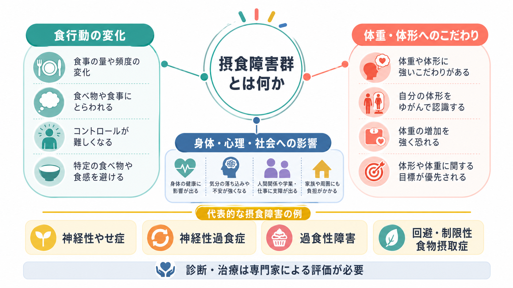
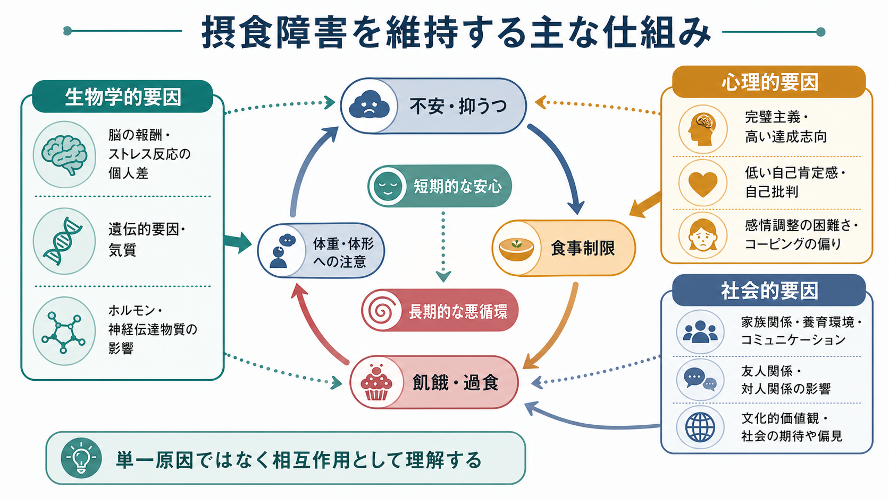

# 摂食障害群とは何か

## 要点

- 摂食障害群は、食べる量・頻度・方法の変化、体重や体形への強いこだわり、または食物摂取の回避・制限が、身体健康や心理社会的機能を損なう疾患群である[1][2]。
- 代表的には、神経性やせ症、神経性過食症、過食性障害、回避・制限性食物摂取症、異食症、反すう・吐き戻し症が含まれる[1][2]。
- 摂食障害は「やせたい気持ち」だけでは説明できない。生物学的脆弱性、飢餓や過食に伴う身体変化、情動調整、対人関係、文化的価値、体重スティグマが相互作用する[4][7]。
- 医療・心理・栄養・家族支援を組み合わせた評価が重要であり、この記事は教育・研究目的の概説であって、個別診断や治療指示ではない。

## この記事で答える問い

1. 摂食障害群は、どのような疾患をまとめた概念なのか。
2. 神経性やせ症、神経性過食症、過食性障害、ARFID は何が違うのか。
3. 摂食障害は、どのような悪循環で維持されやすいのか。
4. 臨床・研究では、体重だけでなく何を評価する必要があるのか。

## まず結論

摂食障害群とは、食行動の乱れそのものだけでなく、身体像、自己評価、情動調整、身体合併症、対人関係、生活機能を含む疾患群である。DSM-5-TR と ICD-11 は、ともに「feeding and eating disorders」を分類枠として扱い、神経性やせ症、神経性過食症、過食性障害、ARFID、異食症、反すう・吐き戻し症などを整理している[1][2]。

ただし、診断名は入口にすぎない。臨床的には、低体重の有無、過食の有無、代償行為の有無、体重・体形へのこだわり、栄養状態、電解質異常、自殺リスク、併存する[[不安とは何か|不安]]や[[抑うつ気分とは何か|抑うつ]]、家族・学校・職場での機能を同時に見る必要がある[3][5]。

## 背景

摂食障害は、身体と心を分けて理解しにくい疾患群である。食事制限や嘔吐、下剤乱用、過度な運動は心理的な安心を一時的にもたらすことがある一方、飢餓、脱水、電解質異常、心血管リスク、消化器症状、骨密度低下、月経・内分泌の変化などを通じて身体状態を悪化させる[3][5]。身体状態の悪化は、集中困難、易刺激性、不安、抑うつ、食物への注意の偏りを強め、さらに食行動を固定化することがある。

疫学的にも、摂食障害はまれな例外ではない。NIMH は、米国成人で過食性障害の生涯有病率を 2.8%、神経性過食症を 1.0%、神経性やせ症を 0.6% と報告している[3]。数値は国、年齢、性別、評価方法で変わるが、どの研究でも「女性だけ」「若年者だけ」「低体重だけ」の問題として片づけることはできない。

## 基本概念

### 摂食障害群に含まれる主な疾患

| 疾患 | 中心となる特徴 | 体重・体形へのこだわり | 評価上の注意 |
|---|---|---|---|
| 神経性やせ症 | 摂取制限などにより著しい低体重が生じ、体重増加への強い恐れや体重・体形の過大評価を伴う | 多くの場合中心的 | 低体重の医学的リスク、自殺リスク、本人の病識の乏しさを評価する[1][5] |
| 神経性過食症 | 反復する過食と、嘔吐・下剤乱用・絶食・過度な運動などの代償行為 | 中心的 | 体重が標準範囲でも重い電解質異常や歯牙・消化器合併症がありうる[1][3] |
| 過食性障害 | 制御困難を伴う過食が反復し、著しい苦痛を伴うが、規則的な代償行為はない | ある場合もない場合もある | 体重だけで判断せず、苦痛、秘密性、生活機能、身体合併症を見る[1][6] |
| 回避・制限性食物摂取症 | 感覚過敏、食への関心の低さ、窒息・嘔吐など嫌な結果への恐怖により摂取が制限される | 中心ではない | 体重・体形へのこだわりが主因ではない点が神経性やせ症と異なる[2] |
| 異食症・反すう症 | 非栄養物質の摂取、または食物の反復的な吐き戻し | 通常中心ではない | 発達、文化、身体疾患、栄養・消化器リスクを分けて評価する[2] |

ここで重要なのは、「摂食行動」と「体重・体形へのこだわり」が常に同じ強さで現れるわけではないことである。神経性やせ症や神経性過食症では、自己評価が体重・体形に強く偏ることが多い。一方、ARFID では食物の感覚特性、食べることへの恐怖、食への関心の低さが中心であり、体重や体形を変えたい意図が中心ではない[2]。

### 症候として見る視点

診断名に入る前に、[[精神症候学とは何か|精神症候学]]の視点で、何が起きているかを記述する必要がある。たとえば[[過食とは何か|過食]]は、「たくさん食べた」という量の問題だけでなく、短時間性、制御困難感、反復性、苦痛、秘密性、代償行為の有無で意味が変わる。食事制限も、カロリー制限、食材の回避、食事時間の儀式化、家族との食卓回避、運動や補償行為との組み合わせによってリスクが違う。

## 仕組み

摂食障害を単一原因で説明するのは難しい。遺伝・気質、脳の報酬系と抑制制御、消化管・内分泌・代謝、完璧主義や低い自己評価、感情調整の困難、対人関係、文化的な体形規範、いじめや体重スティグマが重なり、発症と維持に関わる[4][5][7]。この見方は、疾患を「本人の意志の弱さ」に還元しないためにも重要である。

維持機構としてよく使われるのが、認知行動療法のトランス診断的モデルである。このモデルでは、体重・体形・食事への過大な評価が中核にあり、食事制限、過食、代償行為、体型確認、回避が悪循環をつくる。さらに、臨床的完璧主義、低い自己評価、気分不耐性、対人困難が加わると、症状が変化しにくくなる[7]。

この悪循環は、[[摂食障害は脳の報酬系や身体感覚とどう関わるのか|摂食障害と報酬系・身体感覚]]とも接続する。食物手がかり、空腹、満腹感、身体内部感覚、報酬予測、不安の軽減、自己効力感が絡み合うため、同じ「食べない」「食べすぎる」行動でも、人によって機能が異なる。

## 図解

| 図 | 役割 |
|---|---|
| 図1 | 摂食障害群を、食行動の変化、体重・体形へのこだわり、身体・心理・社会への影響から概観する。 |
| 図2 | 生物学的・心理的・社会的要因が、不安、食事制限、飢餓・過食、短期的安心、長期的悪循環を通じて症状を維持する流れを示す。 |

## 臨床・研究との接続

臨床評価では、診断名だけでなく安全性を優先して確認する。低体重、急速な体重減少、徐脈、低血圧、失神、低体温、電解質異常、脱水、嘔吐・下剤乱用、糖尿病治療との関係、自傷・自殺リスクは、早期に医学的評価が必要な領域である[3][5]。これは体重が低い人だけの問題ではない。神経性過食症や過食性障害でも、身体合併症や強い苦痛が見落とされることがある。

治療研究では、疾患別の介入とトランス診断的介入の両方が使われる。NICE は、神経性やせ症、神経性過食症、過食性障害について、年齢や重症度に応じた心理療法、身体モニタリング、栄養面の支援、家族・支援者との協働を推奨している[8]。ただし、治療選択は診断名だけで自動的に決まるものではなく、身体リスク、発達段階、併存症、本人の希望、利用可能な支援を踏まえて調整される。

研究上は、食行動を一つの尺度だけで代表させないことが重要である。面接、質問紙、食事記録、身体測定、血液検査、経験サンプリング、神経画像、計算論的モデルは、それぞれ異なる層を測る。[[生物心理社会モデルとは何か|生物心理社会モデル]]の観点では、脳、身体、認知、感情、家庭、学校・職場、文化的規範を別々に測りながら、どの水準がどの症状と結びつくかを検討する必要がある。

## よくある誤解

### 誤解1：摂食障害は「やせたい人」の病気である

体重・体形へのこだわりは多くの摂食障害で重要だが、すべてではない。ARFID のように、食物の感覚特性、食への関心の低さ、窒息や嘔吐への恐怖が中心で、体重・体形へのこだわりが主因ではない疾患もある[2]。

### 誤解2：体重が低くなければ重症ではない

体重は重要な指標だが、重症度を一つで決めるものではない。標準体重でも、反復する嘔吐や下剤乱用による電解質異常、過食に伴う強い苦痛、抑うつ、自殺リスク、学校・職場機能の低下がありうる[3][5]。

### 誤解3：本人が食べれば解決する

食べることは回復に重要だが、症状は単純な選択ではない。食事制限は不安を一時的に下げる、過食は苦痛な感情を一時的に変える、代償行為は罪悪感を減らす、といった短期的機能をもつことがある。治療では、その短期的機能を理解したうえで、身体安全、食事の規則性、情動調整、対人支援を組み合わせていく[7][8]。

### 誤解4：摂食障害は女性だけの病気である

女性に多く報告される疾患はあるが、男性、ノンバイナリーの人、子ども、高齢者、さまざまな体型・文化背景の人にも起こる。男性では筋肉量や体脂肪へのこだわり、過度な運動、サプリメント使用など、典型像と異なる形で現れることもある。典型的なイメージに合わないからといって、評価対象から外してはならない[4]。

## 関連ノート

- [[過食とは何か]]
- [[摂食障害は脳の報酬系や身体感覚とどう関わるのか]]
- [[DSMとICDは何が違うのか]]
- [[生物心理社会モデルとは何か]]
- [[精神症候学とは何か]]
- [[不安とは何か]]
- [[抑うつ気分とは何か]]

## MOC更新候補

- `content/00_MOC/MOC｜精神医学.md`
- `content/00_MOC/MOC｜症候学.md`
- `content/00_MOC/MOC｜神経科学と精神疾患.md`

## 理解チェック

1. 神経性やせ症、神経性過食症、過食性障害、ARFID を区別するとき、どの特徴を見るか。
2. 「体重が標準範囲なら重症ではない」という理解には、どのような問題があるか。
3. 摂食障害を維持する悪循環には、食事制限、過食、代償行為、不安、自己評価がどう関わるか。
4. 摂食障害を[[生物心理社会モデルとは何か|生物心理社会モデル]]で見ると、どの水準の情報が必要になるか。
5. 研究で「食行動」を測るとき、面接、質問紙、食事記録、身体指標はそれぞれ何を測り、何を測れないか。

## 参考文献

[1] American Psychiatric Association. (2022). *Diagnostic and Statistical Manual of Mental Disorders, Fifth Edition, Text Revision (DSM-5-TR)*. American Psychiatric Association Publishing. https://doi.org/10.1176/appi.books.9780890425787

[2] World Health Organization. (2026). *ICD-11 for Mortality and Morbidity Statistics: Feeding or eating disorders*. https://icd.who.int/browse/releases/mms/en

[3] National Institute of Mental Health. (2026). *Eating Disorders*. https://www.nimh.nih.gov/health/statistics/eating-disorders

[4] Treasure, J., Duarte, T. A., & Schmidt, U. (2020). Eating disorders. *The Lancet, 395*(10227), 899-911. https://doi.org/10.1016/S0140-6736(20)30059-3

[5] Treasure, J., Zipfel, S., Micali, N., et al. (2015). Anorexia nervosa. *Nature Reviews Disease Primers, 1*, 15074. https://doi.org/10.1038/nrdp.2015.74

[6] Giel, K. E., Bulik, C. M., Fernandez-Aranda, F., et al. (2022). Binge eating disorder. *Nature Reviews Disease Primers, 8*, 16. https://doi.org/10.1038/s41572-022-00344-y

[7] Fairburn, C. G., Cooper, Z., & Shafran, R. (2003). Cognitive behaviour therapy for eating disorders: a transdiagnostic theory and treatment. *Behaviour Research and Therapy, 41*(5), 509-528. https://doi.org/10.1016/S0005-7967(02)00088-8

[8] National Institute for Health and Care Excellence. (2020). *Eating disorders: recognition and treatment* (NICE guideline NG69). https://www.nice.org.uk/guidance/ng69

## 未解決問題

- 摂食障害の発症前リスクを、体重・体形へのこだわり、食行動、気質、身体内部感覚、社会環境からどこまで早期に予測できるか。
- ARFID、神経性やせ症、過食性障害を横断する「制限」「回避」「報酬」「不安」の次元を、診断分類とどう接続するか。
- 体重スティグマ、ジェンダー規範、SNS環境、食物環境の変化が、援助希求と治療反応にどのように影響するか。
- 神経画像や計算論的モデルの知見を、個別診断ではなく治療計画や再発予防にどう活かせるか。

## 更新ログ

- 2026-04-28: 初版作成。摂食障害群の分類、基本概念、維持機構、臨床・研究との接続、図解2点を追加。
