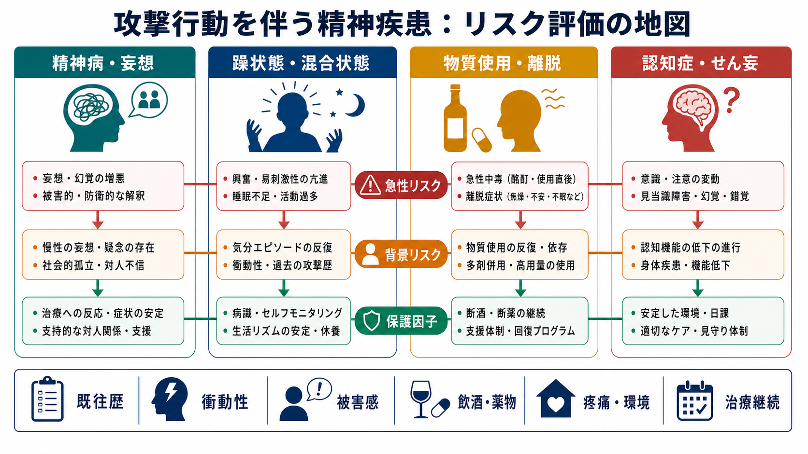
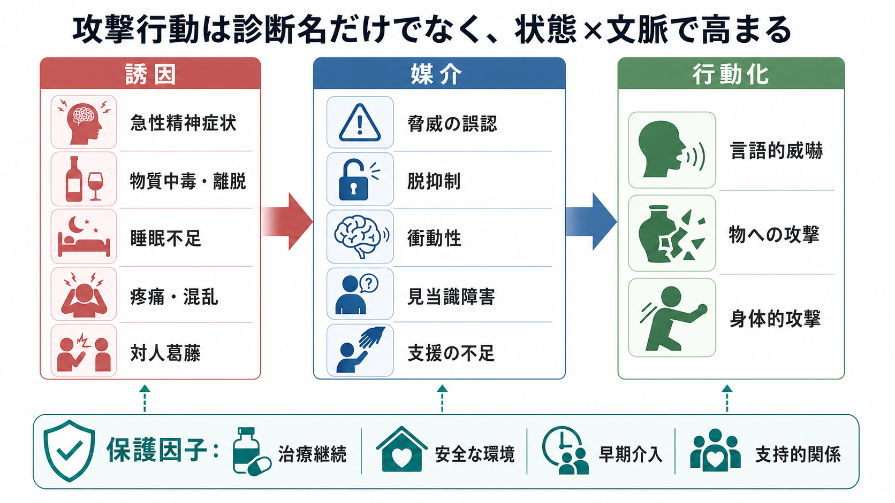
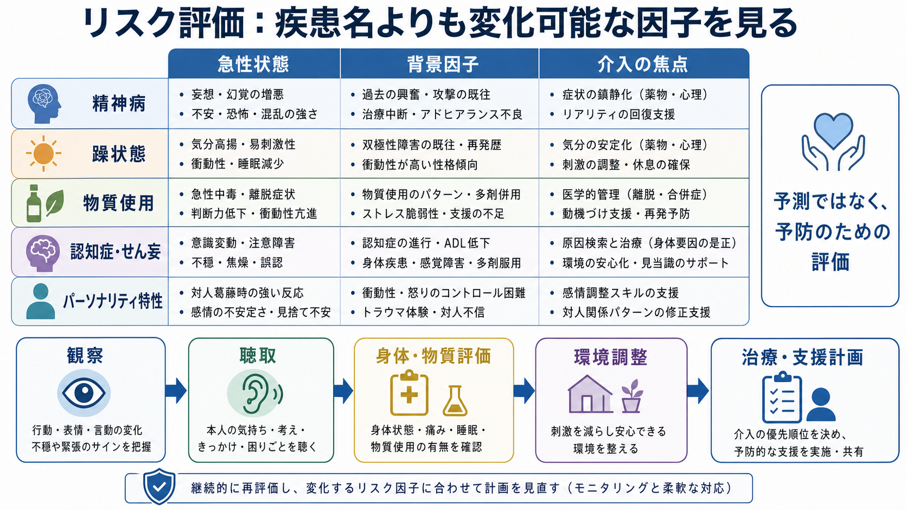

# 攻撃行動を伴う精神疾患には何があるのか

## 要点

- 攻撃行動は「診断名そのもの」よりも、急性症状、物質使用、過去の暴力、脱抑制、被害感、睡眠不足、痛み、環境ストレス、支援不足が重なったときに問題化しやすい。
- 関連しやすい状態には、[[統合失調症とは何か|統合失調症]]などの精神病性障害、[[躁病エピソードとは何か|躁病エピソード]]・混合状態、[[物質使用障害とは何か|物質使用障害]]、[[認知症とは何か|認知症]]・せん妄、一部のパーソナリティ特性、[[間欠爆発症とは何か|間欠爆発症]]、[[素行症とは何か|素行症]]などがある。
- ただし、多くの精神疾患患者は暴力的ではない。スティグマを避けるには、絶対リスク、併存症、状況因子、保護因子を分けて考える必要がある。
- 臨床では「予測して当てる」よりも、「変えられるリスクを見つけて予防する」ことが中心になる。

## この記事で答える問い

この記事では、攻撃行動を伴うことがある精神疾患・精神状態を、危険視のためではなく、リスク評価と予防的支援のために整理する。ここでいう攻撃行動には、言語的威嚇、物への攻撃、対人暴力、家庭内・医療現場・地域での切迫した攻撃性が含まれる。個別の診断や治療指示ではなく、教育・研究目的の概説である。

## まず結論

攻撃行動と関連して臨床的に重要なのは、次の5群である。

| 群 | 代表例 | リスク評価で見る点 |
|---|---|---|
| 精神病性障害 | [[統合失調症とは何か]]、[[妄想性障害とは何か]]、[[物質誘発性精神病とは何か]] | 被害妄想、命令性幻聴、恐怖、現実検討、治療中断、物質使用 |
| 気分エピソード | [[躁病エピソードとは何か]]、混合状態、精神病性うつ病 | 易刺激性、誇大性、睡眠減少、焦燥、衝動性、自殺・他害念慮 |
| 物質関連 | [[アルコール使用障害とは何か]]、[[覚醒剤使用障害とは何か]]、[[大麻使用障害とは何か]]、離脱 | 急性中毒、離脱、脱抑制、被害感、多剤使用、再使用リスク |
| 神経認知・身体要因 | [[認知症とは何か]]、[[前頭側頭型認知症とは何か]]、[[レビー小体型認知症とは何か]]、[[振戦せん妄とは何か]] | 見当識障害、痛み、感染、睡眠障害、環境変化、介護負担 |
| 衝動制御・対人パターン | [[間欠爆発症とは何か]]、[[反社会性パーソナリティ障害とは何か]]、[[境界性パーソナリティ障害とは何か]]、[[素行症とは何か]] | 怒りの制御、衝動性、対人葛藤、トラウマ、過去の攻撃、支援関係 |

NICEの暴力・攻撃性管理ガイドラインは、過去の攻撃エピソード、文化的誤解を避けた客観的評価、本人・家族との協働、症状・感情・文脈・予防策の整理を重視している[1]。APAの成人精神科評価ガイドラインも、攻撃的・精神病的観念、過去の攻撃行動、法的・懲戒上の結果、暴力曝露、神経認知症状、衝動性、銃器など手段へのアクセスを評価項目に含める[2]。

## 背景

精神疾患と暴力の関係は、二つの誤解に挟まれやすい。一方では「精神疾患があれば危険」と過度に一般化され、他方では「精神疾患と攻撃行動は無関係」と単純化される。どちらも臨床的には不十分である。

近年のレビューでは、多くの精神疾患で相対リスクは上昇しうるが、絶対リスクは疾患群によって大きく異なり、物質使用、パーソナリティ障害、統合失調症スペクトラムで高くなりやすいと整理されている[3]。したがって、診断名だけで判断するのではなく、リスクを「急性リスク」「背景リスク」「保護因子」に分ける必要がある。

## 基本概念

### 攻撃行動と暴力は同じではない

攻撃行動は、怒鳴る、脅す、物を壊す、身体的に攻撃するなどの広い行動を指す。暴力はそのうち、他者への身体的・性的危害や重大な威嚇を含む狭い概念として扱われることが多い。臨床では、初期の言語的威嚇や物への攻撃も、身体的攻撃の前段階として重要なサインになりうる。

### 急性リスクと背景リスク

急性リスクは、数時間から数日の単位で変化する。例として、急性精神病症状、酩酊、離脱、睡眠欠如、疼痛、せん妄、対人葛藤、治療中断がある。背景リスクは、過去の暴力、若年発症の反社会的行動、物質使用の反復、トラウマ、社会的孤立、経済・住居問題など、より長期に続く因子である。

### 保護因子

保護因子は、リスクを下げる条件である。治療継続、本人の病識、家族・支援者との協働、安全な環境、睡眠と疼痛の管理、物質使用への介入、危機時の連絡先、退避できる場所、早期介入計画などが含まれる。リスク評価は、危険因子の列挙だけでなく、保護因子を強める計画まで含めて初めて実用的になる。

## 仕組み

攻撃行動は、単一の疾患メカニズムから直線的に出るのではない。多くの場合、次のような経路が重なる。

1. 脅威の誤認  
   被害妄想、幻聴、せん妄、認知症の見当識障害では、相手の意図や状況を脅威として解釈しやすくなる。

2. 脱抑制  
   アルコール、薬物、前頭側頭型認知症、躁状態、睡眠不足は、行動抑制や結果予測を弱める。

3. 衝動性と情動調整困難  
   怒り、焦燥、恐怖、羞恥、見捨てられ不安が急速に高まり、言語的威嚇や物への攻撃として表出する。

4. 文脈の圧力  
   混雑、騒音、拘束感、強い対人葛藤、介護者の疲弊、医療・福祉への不信が、急性症状を行動化に近づける。

## 疾患・状態別にみる

### 精神病性障害

[[統合失調症とは何か|統合失調症]]や他の精神病性障害では、被害妄想、命令性幻聴、強い恐怖、興奮、治療中断が重なると攻撃行動のリスクが上がる。統合失調症と暴力に関するメタ解析では、精神病のみのリスク上昇よりも、物質使用の併存がリスクを大きく押し上げることが示された[4]。したがって、精神病症状の評価と同時に、アルコール・薬物、服薬中断、睡眠、生活環境を確認する必要がある。

重要なのは、妄想の内容を単に「奇異」と見るのではなく、本人がどの程度切迫した脅威として体験しているかを見ることである。被害感が強く、特定の相手を「防衛すべき対象」として名指しし、手段へのアクセスがある場合は、診断名よりもその切迫性が問題になる。

### 躁状態・混合状態

[[躁病エピソードとは何か|躁病エピソード]]では、気分高揚だけでなく、易刺激性、睡眠欲求の減少、活動性亢進、誇大性、判断低下が目立つことがある。双極性障害のスウェーデン全国登録研究と系統的レビューでは、暴力犯罪リスクは一般人口より高かったが、その上昇は主に物質使用併存例に集中していた[5]。

混合状態では、抑うつ気分、焦燥、怒り、希死念慮、衝動性が同時に出ることがあり、自己への攻撃と他者への攻撃を分けて評価しにくい。ここでは、睡眠、活動量、焦燥、物質使用、金銭・対人トラブル、家族への威嚇の有無を短い時間幅で追う。

### 物質使用・中毒・離脱

[[物質使用障害とは何か|物質使用障害]]は、攻撃行動のリスク評価で最も見落とせない領域である。薬物使用障害と暴力に関する系統的レビューでは、薬物カテゴリーごとのリスク推定には幅があるが、多剤使用や使用障害は暴力アウトカムと関連していた[6]。アルコールについては、急性摂取と慢性的使用のどちらも、脱抑制、注意の狭窄、脅威解釈の偏りを通じて攻撃性を高めうる[7]。

臨床的には、[[アルコール使用障害とは何か|アルコール使用障害]]、[[アルコール離脱とは何か|アルコール離脱]]、[[覚醒剤使用障害とは何か|覚醒剤使用障害]]、[[大麻使用障害とは何か|大麻使用障害]]、鎮静薬・睡眠薬の乱用や離脱を確認する。特に、急性中毒、離脱せん妄、覚醒剤精神病、酩酊下の対人葛藤、断薬直後の不眠は急性リスクになりやすい。

### 認知症・せん妄・神経認知障害

[[認知症とは何か|認知症]]やせん妄では、攻撃行動は「怒りっぽい性格」ではなく、混乱、恐怖、痛み、感覚障害、睡眠障害、環境変化、介助への抵抗として現れることがある。国際老年精神医学会の認知障害におけるアジテーション定義では、情動的苦痛を伴い、過活動、言語的攻撃、身体的攻撃として現れ、他の精神疾患・身体疾患・物質関連要因だけでは説明できない行動群として整理されている[8]。

[[前頭側頭型認知症とは何か|前頭側頭型認知症]]では脱抑制や社会的判断の低下、[[レビー小体型認知症とは何か|レビー小体型認知症]]では幻視や認知変動、[[血管性認知症とは何か|血管性認知症]]では遂行機能障害が行動化に関わることがある。せん妄では、感染、脱水、薬剤、疼痛、低酸素、睡眠障害などの身体要因を優先して探す。

### パーソナリティ特性・衝動制御・発達期の行動症

[[反社会性パーソナリティ障害とは何か|反社会性パーソナリティ障害]]、[[境界性パーソナリティ障害とは何か|境界性パーソナリティ障害]]、[[間欠爆発症とは何か|間欠爆発症]]、[[反抗挑発症とは何か|反抗挑発症]]、[[素行症とは何か|素行症]]では、対人葛藤、怒り、衝動性、拒絶への反応、報復的思考、反復する規範逸脱が問題になることがある。

ただし、人格や診断名を固定的な危険ラベルとして使うと、介入可能な要因を見落とす。評価では、過去の暴力、頻度、標的、誘因、武器や手段へのアクセス、物質使用、家庭内暴力、トラウマ、治療関係、危機時の退避行動を具体的に確認する。

## 図解

## 臨床・研究との接続

### 評価は「疾患名」からではなく「状態」から始める

初回評価では、診断名を急いで確定するよりも、現在の切迫性を先に見る。具体的には、現在の攻撃念慮、標的、計画、手段へのアクセス、過去の暴力、物質使用、精神病症状、躁状態、せん妄・身体疾患、支援者の安全を確認する[1][2]。

### 予防計画に落とし込む

リスク評価は記録して終わりではない。急性症状には治療導入や安全確保、物質使用には離脱・再使用予防、認知症・せん妄には環境調整と身体要因の是正、対人葛藤には距離の取り方と連絡計画、家族リスクには情報共有と避難計画が必要になる。

### 研究では絶対リスクと併存症を分ける

暴力研究では、相対リスクだけを見ると疾患のスティグマを強めやすい。絶対リスク、追跡期間、アウトカム定義、司法記録か自己報告か、併存物質使用、過去の暴力、社会的剥奪、家族因子を区別して読む必要がある[3][4]。

## よくある誤解

### 誤解1: 精神疾患がある人は危険である

これは誤りである。多くの人は攻撃行動を示さず、むしろ暴力被害やスティグマのリスクにさらされる。臨床的に重要なのは、疾患名で人を危険視することではなく、変化可能な急性因子を把握することである。

### 誤解2: 暴力リスクは専門家なら正確に予測できる

個人レベルの予測には限界がある。リスク評価は「当てる」ためではなく、予防可能な因子を見つけ、本人・周囲の安全と尊厳を守るために行う。

### 誤解3: 攻撃性を聞くと危険になる

APAのガイドラインは、攻撃的・殺人的観念、過去の攻撃、衝動性、手段へのアクセスを評価することを推奨しており、こうした質問自体が攻撃性を高める根拠はないと説明している[2]。むしろ、聞かないことで切迫した危険や支援ニーズを見落とす可能性がある。

### 誤解4: 認知症の攻撃行動は性格の問題である

認知症やせん妄では、痛み、恐怖、見当識障害、幻視、環境変化、介助方法が行動化に関わる。本人を責めるよりも、身体要因、環境刺激、コミュニケーション、介護者支援を調整する方が実践的である。

## 関連ノート

- [[統合失調症とは何か]]
- [[統合失調症の陽性症状とは何か]]
- [[妄想性障害とは何か]]
- [[双極性障害とは何か]]
- [[躁病エピソードとは何か]]
- [[混合性特徴とは何か]]
- [[物質使用障害とは何か]]
- [[アルコール使用障害とは何か]]
- [[物質誘発性精神病とは何か]]
- [[認知症とは何か]]
- [[前頭側頭型認知症とは何か]]
- [[レビー小体型認知症とは何か]]
- [[間欠爆発症とは何か]]
- [[反社会性パーソナリティ障害とは何か]]
- [[境界性パーソナリティ障害とは何か]]

## MOC更新候補

- `content/00_MOC/` 配下の精神医学系MOCに、本記事を「リスク評価」「精神科救急」「疾患横断的症候」のいずれかの小項目として追加する。
- 並列生成ジョブとの競合を避けるため、本記事ではMOC本体は更新しない。

## 理解チェック

1. 攻撃行動の評価で、診断名だけを見ると何を見落としやすいか。
2. 精神病性障害で攻撃リスクを上げうる併存要因は何か。
3. 躁状態と混合状態では、どのような急性変化を確認する必要があるか。
4. 認知症・せん妄に伴う攻撃行動で、身体要因や環境要因を確認する理由は何か。
5. リスク評価を「予測」ではなく「予防」のために使うとはどういう意味か。

## 未解決問題

- 診断横断的な攻撃行動リスクを、スティグマを増やさずに地域支援へ接続する評価枠組みはまだ十分に標準化されていない。
- 司法記録、医療記録、自己報告、家族報告で「暴力」の定義が異なるため、研究結果の比較には限界がある。
- 文化差、貧困、被害経験、家族内暴力、医療アクセスの格差を、個人の疾患リスクとどう分けて評価するかは継続課題である。

## 参考文献

[1] National Institute for Health and Care Excellence. (2015). *Violence and aggression: short-term management in mental health, health and community settings* (NICE Guideline NG10). Published May 28, 2015; last reviewed July 11, 2024. https://www.nice.org.uk/guidance/ng10

[2] Silverman, J. J., Galanter, M., Jackson-Triche, M., Jacobs, D. G., Lomax, J. W., Riba, M. B., Tong, L. D., Watkins, K. E., Fochtmann, L. J., Rhoads, R. S., Yager, J., & American Psychiatric Association. (2015). The American Psychiatric Association practice guidelines for the psychiatric evaluation of adults. *American Journal of Psychiatry, 172*(8), 798-802. https://doi.org/10.1176/appi.ajp.2015.1720501

[3] Whiting, D., Gulati, G., Geddes, J. R., & Fazel, S. (2021). Violence and mental disorders: a structured review of associations by individual diagnoses, risk factors, and risk assessment. *The Lancet Psychiatry, 8*(2), 150-161. https://doi.org/10.1016/S2215-0366(20)30262-5

[4] Fazel, S., Gulati, G., Linsell, L., Geddes, J. R., & Grann, M. (2009). Schizophrenia and violence: systematic review and meta-analysis. *PLoS Medicine, 6*(8), e1000120. https://doi.org/10.1371/journal.pmed.1000120

[5] Fazel, S., Lichtenstein, P., Grann, M., Goodwin, G. M., & Långström, N. (2010). Bipolar disorder and violent crime: new evidence from population-based longitudinal studies and systematic review. *Archives of General Psychiatry, 67*(9), 931-938. https://doi.org/10.1001/archgenpsychiatry.2010.97

[6] Zhong, S., Yu, R., & Fazel, S. (2020). Drug use disorders and violence: associations with individual drug categories. *Epidemiologic Reviews, 42*(1), 103-116. https://doi.org/10.1093/epirev/mxaa006

[7] Heinz, A. J., Beck, A., Meyer-Lindenberg, A., Sterzer, P., & Heinz, A. (2011). Cognitive and neurobiological mechanisms of alcohol-related aggression. *Nature Reviews Neuroscience, 12*, 400-413. https://doi.org/10.1038/nrn3042

[8] Cummings, J., Mintzer, J., Brodaty, H., Sano, M., Banerjee, S., Devanand, D. P., Gauthier, S., Howard, R., Lanctôt, K., Lyketsos, C. G., Peskind, E., Porsteinsson, A. P., Reich, E., Sampaio, C., Steffens, D., Wortmann, M., & Zhong, K. (2015). Agitation in cognitive disorders: International Psychogeriatric Association provisional consensus clinical and research definition. *International Psychogeriatrics, 27*(1), 7-17. https://doi.org/10.1017/S1041610214001963

## 更新ログ

- 2026-04-28: 初版作成。攻撃行動を伴いうる疾患・状態を、リスク評価と予防の観点から整理し、画像3点を追加。
