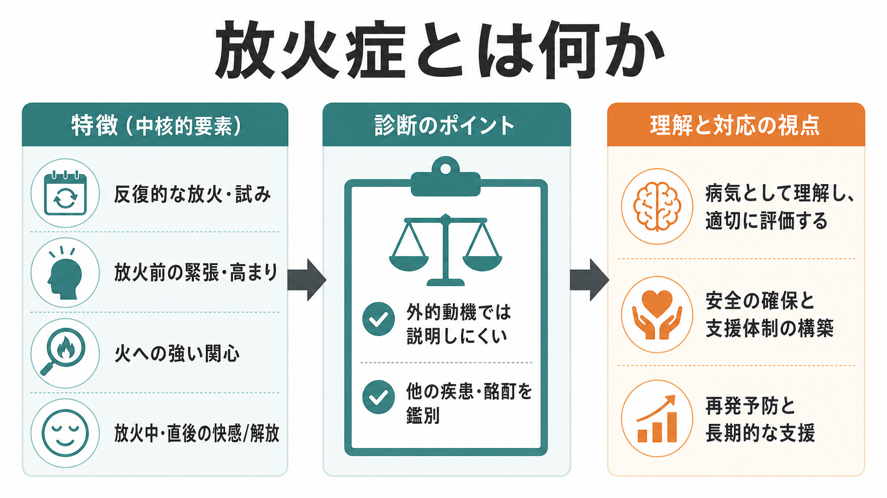
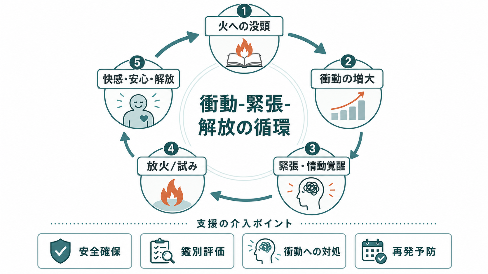

# 放火症とは何か

## 要点

- 放火症 pyromania は、反復的・意図的な放火または放火の試み、放火前の緊張や情動的高まり、火や火災への強い関心、放火中または直後の快感・満足・解放感を特徴とする診断概念である[1][2]。
- 重要なのは、すべての放火行動が放火症ではないことである。金銭的利益、復讐、政治的抗議、犯罪隠蔽、妄想・幻覚、酩酊、躁状態、[[統合失調症とは何か]]、[[双極I型障害とは何か]]、行為症、反社会的行動などで説明される場合は、放火症とは区別して評価する[1][3][4]。
- 放火症はDSM-5-TRでは破壊的・衝動制御・素行症群に含まれ、ICD-11でも衝動制御症群の一つとして「Pyromania」が置かれている[1][2]。
- 研究数は少なく、一般人口での有病率は確定していない。放火者・司法精神医学対象者の中でも、厳密な放火症に該当する人は少数とされる[3][4][7]。
- 臨床では、診断名の確認よりも、まず安全確保、再発リスク、併存する[[物質使用障害とは何か]]・気分症・精神病症状・発達特性・パーソナリティ特性、生活環境を評価することが重要である[3][4][8]。

## この記事で答える問い

1. 放火症とはどのような診断概念か。
2. 放火、放火罪、放火症はどう違うのか。
3. 火への関心や危険な行動は、どのような仕組みで反復されうるのか。
4. 臨床・研究・司法精神医学では何を評価する必要があるのか。

## まず結論

放火症とは、「火が好き」「怒って火をつけた」「犯罪として放火した」という広い表現ではなく、火をつける衝動を抑えにくく、放火前に緊張や情動的高まりがあり、放火中または直後に快感・満足・安心・解放を感じる反復的なパターンを指す狭い診断概念である[1][2]。

したがって、放火症の評価では、行為の危険性を軽く見るのではなく、むしろ「なぜその行為が起きたのか」を慎重に分ける必要がある。放火は、人命・住居・公共安全に直結する重大な行動であり、臨床的理解は責任の免除や行為の正当化ではない。教育・研究目的では、診断分類、衝動制御、併存症、安全管理、司法精神医学を接続して理解するのが実用的である[3][4]。

## 背景

火への関心そのものは、子どもの好奇心、文化的儀式、職業上の火の使用、キャンプや調理などにも見られる。問題になるのは、火をつける行動が反復し、本人や他者に危険を及ぼし、心理的緊張の解放や快感と結びつき、外的な目的だけでは説明しにくい場合である[1][4]。

司法精神医学では、「firesetting」「arson」「pyromania」を区別することが特に重要である。firesetting は火をつける行動一般、arson は管轄法により定義される犯罪、pyromania は精神医学的診断である。これらは重なることがあるが同義ではない[4]。たとえば、保険金目的や証拠隠滅のための放火は放火罪に該当しうるが、放火症の心理的パターンとは限らない。一方、放火症の人が常に法的な放火罪に該当するとも限らない。

疫学的には、米国の全国調査で意図的放火行動の生涯経験は約1.0%と報告され、アルコール使用障害、大麻使用障害、行為症、反社会性パーソナリティ特性、強迫性パーソナリティ特性などとの関連が示された[6]。ただし、この研究は「意図的放火行動」を扱っており、厳密な放火症の有病率を示すものではない。放火行動と放火症を混同しないことが、解釈上の第一歩である。

## 基本概念

### 診断分類での位置づけ

DSM-5-TRでは、放火症は破壊的・衝動制御・素行症群に含まれる。中心になるのは、意図的・反復的な放火、放火前の緊張、火や火災状況への強い関心、放火中または放火後の快感・満足・解放、そして外的動機や他の精神疾患でよりよく説明されないことである[1]。

ICD-11でも「Pyromania」は衝動制御症群に置かれ、放火への強い衝動を制御しにくいこと、放火前の緊張や覚醒、放火後の満足・解放、反復性、そして行為による害や生活上の障害が重視される[2]。この意味で、放火症は[[ギャンブル障害とは何か]]や[[物質使用障害とは何か]]と同じではないが、「衝動」「渇望」「反復」「短期的報酬」「長期的損害」という観点では比較して理解できる。

### 放火症と鑑別されるもの

放火症を考える前に、少なくとも次の可能性を検討する。

| 鑑別対象 | 典型的に確認する点 |
|---|---|
| 金銭・復讐・抗議・隠蔽 | 保険金、報復、脅迫、政治的主張、証拠隠滅などの外的目的 |
| 酩酊・物質使用 | アルコール、薬物、離脱、衝動性の増悪、記憶の欠落 |
| 精神病症状 | 命令性幻聴、妄想、被害的確信、現実検討の障害 |
| 躁状態 | 睡眠欲求低下、多弁、誇大的気分、活動性亢進、危険行動 |
| 行為症・反社会的行動 | 反復的な規則違反、攻撃性、窃盗、破壊、他者の権利侵害 |
| 認知機能・発達特性 | 危険理解、実行機能、学習歴、環境調整の不足 |
| [[強迫症とは何か]] | 火をつけたい快感というより、侵入思考への不安中和や確認行為が中心か |

鑑別は、本人の言語化だけに依存しない。火災の状況、直前のストレス、準備性、対象、周囲の安全配慮、通報行動、過去の類似行動、併存症、法的・社会的文脈を合わせて見る必要がある[3][4]。

## 仕組み

### 衝動-緊張-解放の循環

放火症の中核は、火そのものへの関心と、衝動が高まってから行動に移り、短期的に快感や解放が得られる循環として理解しやすい[1][2][8]。

この循環では、火への没頭、想像、過去の記憶、消防活動や火災現場への関心などが注意を占有しやすくなる。衝動が高まると、身体的緊張、焦燥、不安、興奮が強まり、放火や放火の試みが「解放の手段」として選ばれやすくなる。放火後に安心感や快感が生じると、その短期的報酬が次の衝動を強める可能性がある[1][8]。

ただし、これは単純な「快感を求めるだけ」のモデルではない。併存する抑うつ、不安、怒り、孤立、物質使用、発達歴、トラウマ、司法的文脈が行動の意味を変える。放火症の人が全員同じメカニズムを持つわけではなく、研究上も神経生物学的知見は限定的である[5][8]。

### 衝動制御と報酬学習

衝動制御症群に共通する特徴として、望ましくない結果があっても行動を繰り返すこと、行動直前の渇望や衝動、行動中の快感、行動後の後悔や損害が挙げられる[8]。この構図は、[[抜毛症とは何か]]や[[皮膚むしり症とは何か]]のような反復行動、また[[ギャンブル障害とは何か]]のような行動嗜癖と比較すると理解しやすい。

ただし放火症では、行為の社会的危険性が非常に大きい。したがって、臨床的には「衝動の理解」と「危険の管理」を分けて考えず、同時に扱う必要がある。衝動を理解することは、火へのアクセス管理、危険場面の回避、代替行動、家族・支援者との安全計画、併存症治療につなげるための作業仮説である。

## 図解

| 図 | 読み方 |
|---|---|
| 図1 | 放火症を、反復的放火、緊張、火への関心、快感・解放、鑑別評価のまとまりとして見る。 |
| 図2 | 火への没頭から衝動増大、緊張、放火・試み、解放感へ進む循環と、介入点を確認する。 |

3枚目の図を追加する場合は、放火行動・放火罪・放火症を比較する表、または臨床評価から安全計画までのフロー図が有用である。今回は生成済み画像が2枚で要件を満たすため、存在しない画像リンクは挿入しない。

## 臨床・研究との接続

### 評価で見ること

放火症が疑われる場合、評価の焦点は診断名だけではない。まず、人命・住居・公共施設への差し迫った危険、火器・可燃物へのアクセス、単独行動の時間帯、過去の放火歴、通報歴、反復性、意図、放火前後の感情、併存症、家族や支援者の監督可能性を確認する[3][4]。

併存症は特に重要である。Grant と Kim の小規模臨床研究では、DSM-IV生涯放火症の21例で、気分障害や他の衝動制御症の併存が多く、18例が放火衝動を報告した[5]。この研究は症例数が少なく、一般化には注意が必要だが、放火症を孤立した単一問題として扱わず、広い精神医学的評価につなげる必要性を示している。

### 治療・支援の考え方

放火症そのものに対する標準化された治療研究は限られており、確立した単一の薬物療法があるとは言いにくい[3][8]。実践的には、次の要素を組み合わせることが多い。

| 支援の焦点 | 内容 |
|---|---|
| 安全確保 | 火器・可燃物へのアクセス制限、危険場面の同定、家族・支援者との安全計画 |
| 併存症治療 | 物質使用、気分症、不安症、精神病症状、睡眠、発達特性の評価と治療 |
| 衝動対処 | 衝動の早期サイン、遅延、代替行動、刺激統制、問題解決訓練 |
| 認知行動的介入 | 火への期待、快感、緊張解放、結果予測、再発場面の再構成 |
| 社会的支援 | 生活環境、孤立、職業・学業、家族負担、司法・福祉との連携 |

ここでの記述は教育・研究目的であり、個別の診断や治療指示ではない。実際に放火衝動や危険な行動がある場合は、地域の救急・消防・精神科救急・司法福祉機関を含めた安全確保が優先される。

### 司法精神医学との接続

放火行動は刑事・民事の文脈で扱われることが多い。司法精神医学の評価では、放火症の有無だけでなく、責任能力、再犯リスク、治療可能性、監督条件、退院・保釈・保護観察の条件などが問題になる[4]。文献では、放火者は不均一な集団であり、人格障害、精神病、知的障害、アルコール問題などが重なることも多いと報告されている[7]。

このため、「放火したから放火症」と短絡することも、「放火症だから責任がない」と短絡することもできない。臨床評価、法的評価、公共安全評価は、それぞれ目的と基準が異なる。

## よくある誤解

### 誤解1: 火が好きなら放火症である

火への関心、消防への関心、火災ニュースへの注目だけでは放火症とは言えない。診断上は、反復的な放火または放火の試み、緊張と解放、外的動機や他疾患との鑑別が必要である[1][2]。

### 誤解2: 放火した人の多くは放火症である

厳密には逆で、放火症は放火者の中でも少数とされる。放火行動は、物質使用、反社会的行動、精神病症状、怒り、利益目的、生活環境など多くの要因で起こりうる[3][4][7]。

### 誤解3: 診断名がつけば危険性は低くなる

診断名は行動の理解に役立つが、安全リスクを消すものではない。放火は被害が大きく、本人の意図よりも結果が重大になりうる。評価では、本人の苦痛と公共安全の両方を扱う必要がある[4]。

### 誤解4: 放火症は意思の弱さだけで説明できる

衝動制御、報酬学習、情動調整、併存症、生活環境が関与しうるため、単純な道徳的説明では不十分である[3][8]。一方で、臨床的理解は行為の免責や正当化ではなく、再発を防ぐための具体的な評価と支援に結びつける必要がある。

## 関連ノート

- [[強迫症とは何か]]: 火に関する侵入思考や確認行為との鑑別に関係する。
- [[物質使用障害とは何か]]: 酩酊、離脱、衝動性、再発リスク評価に関係する。
- [[ギャンブル障害とは何か]]: 衝動、報酬、反復行動、生活上の損害という観点で比較できる。
- [[統合失調症とは何か]]: 妄想・幻覚に基づく危険行動との鑑別に関係する。
- [[双極I型障害とは何か]]: 躁状態での危険行動との鑑別に関係する。
- [[抜毛症とは何か]] / [[皮膚むしり症とは何か]]: 反復行動と衝動制御の比較対象になる。

関連ノート候補:

- 衝動制御症群とは何か
- 行為症とは何か
- 反社会性パーソナリティ症とは何か
- 司法精神医学とは何か
- 放火行動のリスク評価とは何か

MOC更新候補:

- `content/00_MOC/` 配下の精神医学・疾患群・司法精神医学関連MOCに追加候補。ただし本ジョブでは並列実行時の競合を避けるため、MOC本体は更新しない。

## 理解チェック

1. 放火行動、放火罪、放火症はそれぞれ何を指すか。
2. 放火症を診断する前に、どのような外的動機や精神疾患を鑑別する必要があるか。
3. 放火前の緊張と放火後の解放感は、反復行動をどのように強めうるか。
4. 臨床評価で、診断名よりも先に確認すべき安全上の情報は何か。

## 未解決問題

- 放火症の一般人口における有病率は十分に確定していない。
- 放火症に特化した標準化治療、薬物療法、再発予測モデルの研究は限られている。
- 放火行動の多様性が大きく、司法サンプル・臨床サンプル・地域サンプルの知見を単純に統合しにくい。
- 火への関心、衝動性、快感、怒り、併存症、社会的環境がどのように相互作用するかは、今後の研究課題である。

## 参考文献

[1] American Psychiatric Association. (2022). *Diagnostic and Statistical Manual of Mental Disorders, Fifth Edition, Text Revision (DSM-5-TR).* American Psychiatric Association Publishing. https://doi.org/10.1176/appi.books.9780890425787

[2] World Health Organization. (2025). *ICD-11 for Mortality and Morbidity Statistics: 6C70 Pyromania.* https://icd.who.int/browse/2025-01/mms/en#1532500290

[3] Fariba, K. A., & Gokarakonda, S. B. (2023). *Impulse Control Disorders.* StatPearls. NCBI Bookshelf. https://www.ncbi.nlm.nih.gov/books/NBK562279/

[4] Burton, P. R. S., McNiel, D. E., & Binder, R. L. (2012). Firesetting, arson, pyromania, and the forensic mental health expert. *Journal of the American Academy of Psychiatry and the Law, 40*(3), 355-365. https://jaapl.org/content/40/3/355

[5] Grant, J. E., & Kim, S. W. (2007). Clinical characteristics and psychiatric comorbidity of pyromania. *Journal of Clinical Psychiatry, 68*(11), 1717-1722. https://doi.org/10.4088/JCP.v68n1111

[6] Blanco, C., Alegria, A. A., Petry, N. M., Grant, J. E., Simpson, H. B., Liu, S.-M., & Hasin, D. (2010). Prevalence and correlates of fire-setting in the United States: Results from the National Epidemiological Survey on Alcohol and Related Conditions. *Comprehensive Psychiatry, 51*(3), 217-223. https://doi.org/10.1016/j.comppsych.2009.06.002

[7] Lindberg, N., Holi, M. M., Tani, P., & Virkkunen, M. (2005). Looking for pyromania: Characteristics of a consecutive sample of Finnish male criminals with histories of recidivist fire-setting between 1973 and 1993. *BMC Psychiatry, 5*, 47. https://doi.org/10.1186/1471-244X-5-47

[8] Schreiber, L., Odlaug, B. L., & Grant, J. E. (2011). Impulse control disorders: Updated review of clinical characteristics and pharmacological management. *Frontiers in Psychiatry, 2*, 1. https://doi.org/10.3389/fpsyt.2011.00001
