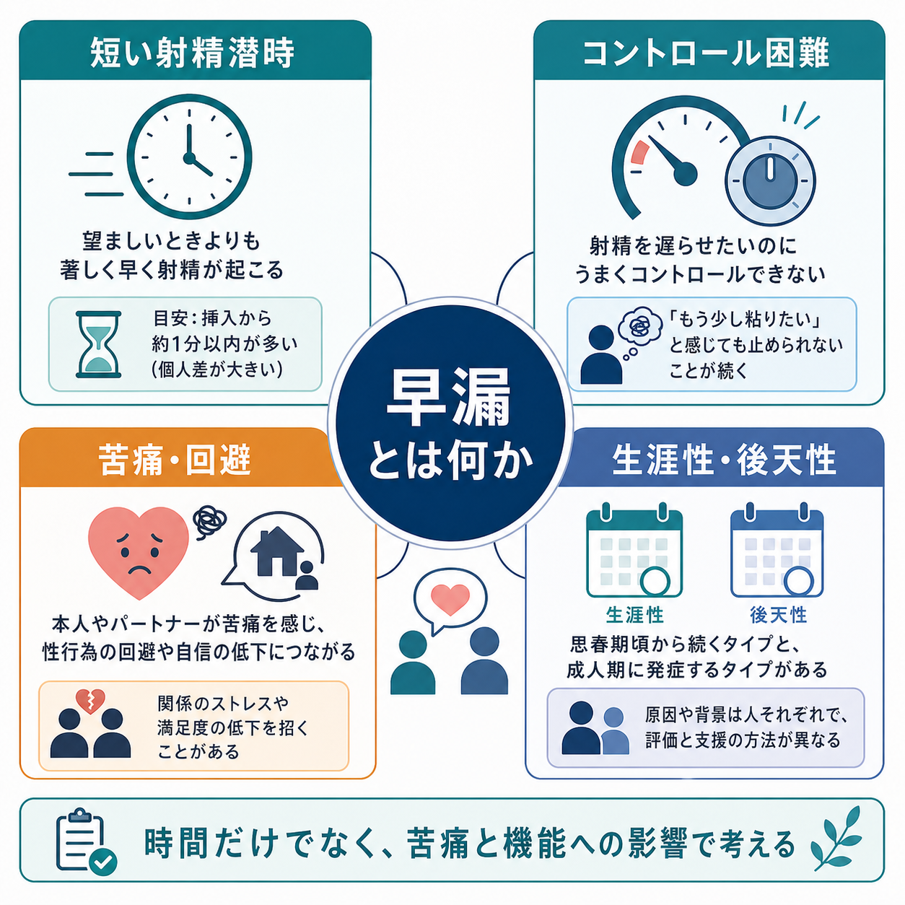
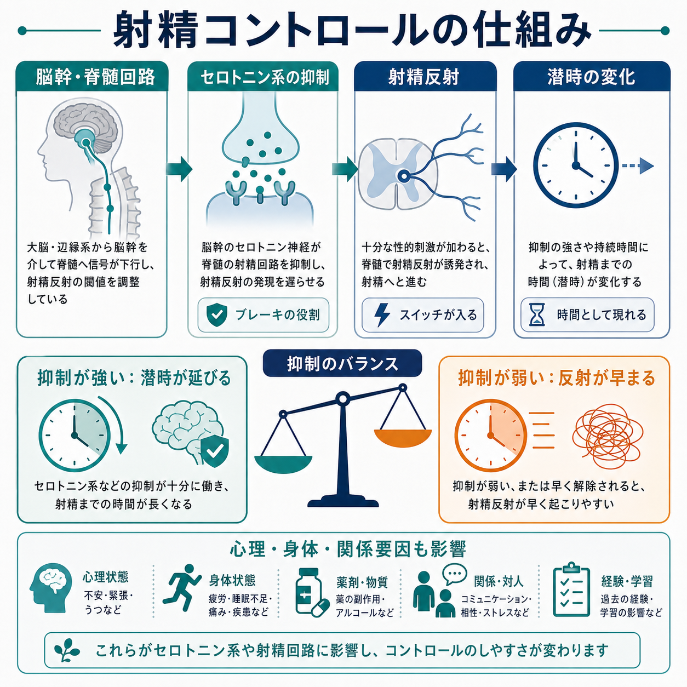
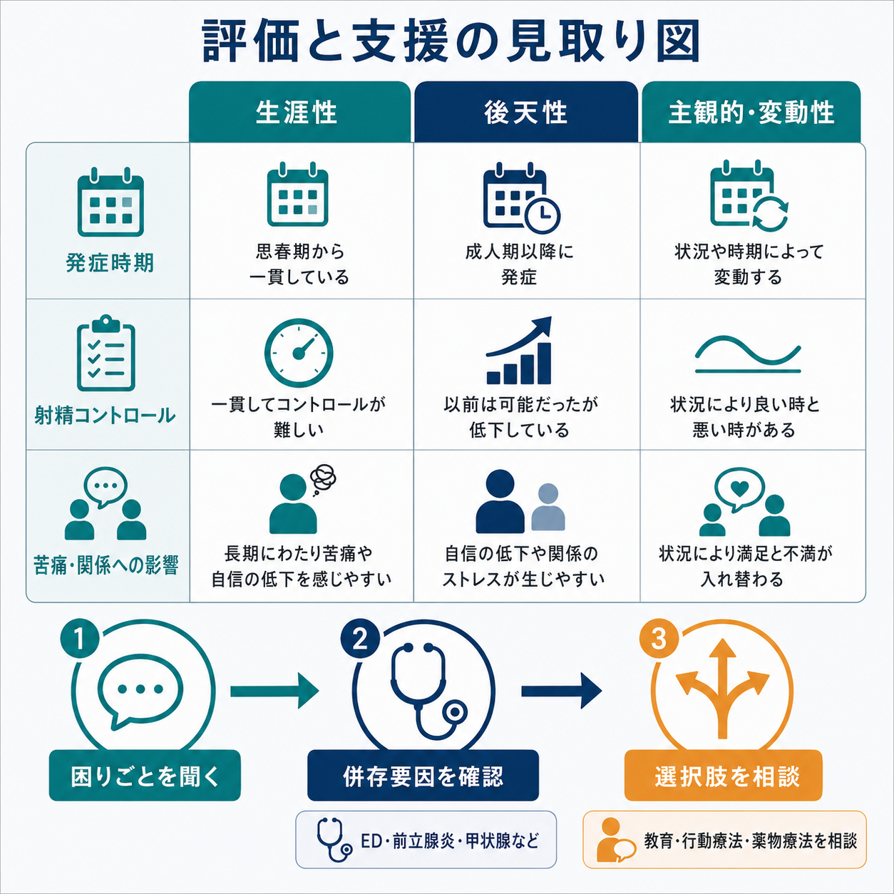

# 早漏とは何か

## 要点

- 早漏とは、望むより早く射精が起こり、射精を遅らせにくく、そのことが本人またはパートナーに苦痛や関係上の困難をもたらす状態である。時間の短さだけでなく、コントロール困難と苦痛をあわせて考える[1][2][3]。
- 生涯性早漏は性活動の初期から一貫してみられる型、後天性早漏は以前より明らかに射精潜時が短くなった型として整理される[1][2][4]。
- ICD-11 では “Male early ejaculation” として、短い潜時、知覚されたコントロールの乏しさ、数か月以上の持続、臨床的に有意な苦痛を中核に置く[3]。
- 仕組みは単一原因ではなく、脳幹・脊髄の射精反射、セロトニン系による抑制、勃起機能、前立腺炎や甲状腺機能亢進などの身体要因、[[不安症群とは何か|不安]]や関係要因が重なって理解される[4][5][6]。
- 本稿は教育・研究目的の概説であり、個別の診断や治療指示ではない。困りごとが強い場合は、泌尿器科、性機能に詳しい医療者、心理職に相談する対象になる。

## この記事で答える問い

1. 早漏は「射精が早いこと」だけで定義できるのか。
2. 生涯性、後天性、変動性、主観的早漏はどう違うのか。
3. 射精コントロールにはどのような神経生理と心理社会的要因が関わるのか。
4. 臨床や研究では、どのような評価軸で早漏を扱うのか。

## まず結論

早漏は、単なる「時間の短さ」ではなく、短い射精潜時、射精を遅らせにくい感覚、本人またはパートナーの苦痛・不満・回避、生活や関係への影響がまとまって問題になる[[性機能障害群とは何か|性機能障害]]である[1][2][3]。AUA/SMSNA ガイドラインは、生涯性早漏を「性活動の開始以来、挿入を伴う性行為の開始からおおむね2分以内に射精し、コントロール困難と苦痛を伴う状態」とし、後天性早漏を「以前の性経験と比べて射精潜時が著しく短くなり、同じくコントロール困難と苦痛を伴う状態」と整理している[1]。

このため評価では、「何分か」だけでなく、「以前からか、途中からか」「どの場面で起こるか」「どれほど苦痛か」「勃起困難、痛み、炎症、薬剤、アルコール、甲状腺機能、抑うつや不安、関係上の緊張が関わるか」を確認する[1][4]。

## 背景

射精は、性的興奮、射精前のプラトー、射精、オルガズム、解消という反応の流れの中で起こる。早漏では、この流れが圧縮され、十分なプラトーを保てないまま射精反射が立ち上がると説明されることがある[6]。ただし、早漏の原因を「意志が弱い」「経験が足りない」「性格の問題」と決めつけるのは不正確である。

疫学研究では、自己申告上の「早漏で困っている」割合は高く報告される一方、厳密な診断基準を満たす臨床的早漏はそれより少ない。AUA/SMSNA は、臨床的定義では5%未満という推定に触れつつ、自己申告レベルでは30%を超える報告もあるとして、定義の違いが有病率を大きく左右することを強調している[1][4]。

## 基本概念

### 3つの中核軸

早漏を理解する中核軸は、次の3つである。

| 軸 | 見ること | なぜ重要か |
|---|---|---|
| 射精潜時 | 刺激や挿入から射精までの時間 | 研究や診断で客観化しやすいが、単独では不十分 |
| 射精コントロール | 射精を遅らせたいときに遅らせられるか | 本人の困りごとに直結しやすい |
| 苦痛・影響 | 本人、パートナー、関係、回避行動への影響 | 障害として扱うかどうかの臨床的判断に関わる |

ISSM の統一定義では、生涯性早漏では膣挿入前または約1分以内にほぼ常に射精が起こること、後天性早漏では以前より臨床的に有意で苦痛を伴う潜時短縮があること、さらに射精を遅らせにくいことと否定的な個人的結果を含める[2]。一方、AUA/SMSNA は臨床実装上、生涯性早漏の時間目安を約2分以内としている[1]。この違いは、早漏が「秒数だけで機械的に切る診断」ではなく、定義、対象集団、測定方法に依存する領域であることを示している。

### 分類

| 型 | 概要 | 評価の焦点 |
|---|---|---|
| 生涯性早漏 | 性活動の初期から一貫して短い潜時とコントロール困難がある | 発症時期、持続性、本人の苦痛 |
| 後天性早漏 | 以前は問題がなかったが、後に潜時が著しく短くなる | 勃起障害、前立腺炎、甲状腺機能亢進、薬剤、ストレス |
| 自然変動性早漏 | 状況や時期により早くなるが、持続的障害とは限らない | 正常変動との区別、過度な病理化の回避 |
| 主観的早漏 | 潜時は極端に短くないが、本人が強いコントロール喪失を感じる | 性的不安、期待、関係要因、情報の誤解 |

ICD-11 は “Male early ejaculation” を、生涯性・後天性、全般性・状況性に下位分類する[3]。この分類は、研究上の群分けだけでなく、支援の焦点を絞るためにも役立つ。

## 仕組み

射精は、脳、脊髄、末梢神経、自律神経、骨盤底筋、前立腺・精嚢などの協調によって起こる。生理学的には、精液成分が後部尿道に集まる emission、尿道外へ押し出される expulsion、主観的快感としての orgasm が関連する[4]。

### セロトニン系と抑制

早漏研究で最もよく扱われる神経伝達物質の一つがセロトニンである。脳幹から脊髄へ下行するセロトニン系は、射精反射に対しておおむね抑制的に働くと考えられている[5][7]。動物研究と薬理学研究では、5-HT1B や 5-HT2C 受容体の活性化は射精潜時を延ばし、5-HT1A 自己受容体の活性化はセロトニン放出を減らして潜時を短くする方向に働く可能性が示されている[5]。

ただし、これは「セロトニン不足だけが原因」という意味ではない。早漏の病態生理は未解明な点が多く、心理的条件づけ、性的興奮の立ち上がり、感覚過敏、勃起不安、関係ストレス、身体疾患などが重なって射精反射の閾値やコントロール感に影響する[5][6][7]。

### 身体要因と心理社会的要因

後天性早漏では、とくに併存要因の確認が重要である。[[性機能障害群とは何か|勃起機能の問題]]があると、勃起を失う前に急いで射精しようとするパターンが生じることがある。前立腺炎、尿道炎、甲状腺機能亢進、薬剤、アルコール、睡眠不足、[[うつ病とは何か|抑うつ]]、[[不安症群とは何か|不安]]、関係上の緊張も評価対象になる[1][4]。この意味で、早漏は泌尿器科的問題と心理社会的問題の境界にある。

## 図解

図の要点は、早漏の評価を「発症時期」「射精コントロール」「苦痛・関係への影響」「併存要因」の4方向から見ることである。時間だけを測ると、自然な変動や主観的不安まで病理化しやすい。逆に苦痛だけを見ると、身体要因や薬剤、甲状腺機能、前立腺炎、勃起機能の問題を見落としやすい[1][4]。

## 臨床・研究との接続

臨床では、まず安全に話せる場を作り、本人がどの言葉で困りごとを表現しているかを確認する。質問は、平均的な潜時、頻度、発症時期、突然か徐々にか、自慰や特定のパートナーでも起こるか、勃起機能、痛み、薬剤、飲酒、関係への影響、回避行動、既に試した対処などを含む[1][4]。

治療・支援としては、心理教育、ストップ・スタート法などの行動的技法、パートナーとのコミュニケーション支援、性的不安への心理療法、局所麻酔薬、SSRI系薬剤などが研究されてきた[1][6][8]。ただし、薬物療法の適応、禁忌、相互作用、地域ごとの承認状況は医療者が個別に判断する領域である。この記事では具体的な服薬指示は扱わない。

研究では、IELT（intravaginal ejaculatory latency time）、患者報告アウトカム、苦痛尺度、射精コントロール感、パートナー満足度などが使われる。近年のレビューは、単一の治療法だけでなく、身体・心理・関係要因を組み合わせて評価する必要を強調している[6][7][8]。

## よくある誤解

### 誤解1: 何分以下なら必ず早漏である

時間は重要な手がかりだが、診断は時間だけで決まらない。短い潜時に加えて、コントロール困難、苦痛、持続性、状況、併存要因を確認する[1][2][3]。

### 誤解2: 早漏は精神力や性格の問題である

早漏には神経生理、性的学習、身体疾患、薬剤、心理社会的ストレスが関与しうる。本人の責任や道徳性の問題として扱うと、相談の遅れや羞恥を強める。

### 誤解3: パートナーの満足だけが診断基準である

歴史的にはパートナーの満足を基準にした定義もあったが、現在の定義では本人のコントロール感、潜時、苦痛、関係への影響を統合して評価する[1][2]。

### 誤解4: すべて薬で解決する

薬物療法が役立つ場合はあるが、後天性早漏では勃起障害、炎症、甲状腺機能亢進、薬剤、アルコール、睡眠、関係要因の評価が重要である[1][4]。心理教育や行動療法、パートナーとの相談が中心になる場合もある。

## 関連ノート

- [[性機能障害群とは何か]]
- [[女性オルガズム障害とは何か]]
- [[性交疼痛症とは何か]]
- [[性別違和とは何か]]
- [[不安症群とは何か]]
- [[うつ病とは何か]]
- [[物質使用障害とは何か]]
- [[内分泌疾患に伴う精神症状とは何か]]

### 関連ノート候補

- 射精障害とは何か
- 勃起障害とは何か
- 性的パフォーマンス不安とは何か
- セロトニンと性機能とは何か
- 性機能障害の臨床評価とは何か

### MOC更新候補

- `content/00_MOC/` 配下の精神医学、性機能障害、臨床評価に関する MOC に追加候補。
- 並列ジョブとの衝突を避けるため、本稿では MOC 本体は更新しない。

## 理解チェック

1. 早漏を時間だけで定義すると、どのような見落としが起こるか。
2. 生涯性早漏と後天性早漏では、評価で重視する点はどう違うか。
3. セロトニン系の抑制は、射精潜時にどのように関わると考えられているか。
4. 後天性早漏で、勃起機能、前立腺炎、甲状腺機能、薬剤、関係要因を確認する理由は何か。
5. 早漏を「本人の意志の弱さ」とみなす説明には、どのような臨床上の問題があるか。

## 未解決問題

- 早漏の病態生理は、セロトニン系だけでは説明しきれず、遺伝、感覚処理、性的学習、関係要因の相互作用は十分に解明されていない。
- 研究の多くは異性愛・膣挿入を前提にした IELT を中心にしており、多様な性行動や性的指向にそのまま一般化できるかには注意が必要である[1]。
- 薬物療法、心理療法、行動療法、パートナー支援の最適な組み合わせや長期効果については、さらに質の高い比較研究が必要である[6][8]。

## 参考文献

[1] Shindel AW, Althof SE, Carrier S, et al. Disorders of Ejaculation: An AUA/SMSNA Guideline. *The Journal of Urology*. 2022. https://doi.org/10.1097/JU.0000000000002392 / https://www.auanet.org/guidelines-and-quality/guidelines/disorders-of-ejaculation

[2] Serefoglu EC, McMahon CG, Waldinger MD, et al. An Evidence-Based Unified Definition of Lifelong and Acquired Premature Ejaculation: Report of the Second International Society for Sexual Medicine Ad Hoc Committee for the Definition of Premature Ejaculation. *The Journal of Sexual Medicine*. 2014;11(6):1423-1441. https://doi.org/10.1111/jsm.12524

[3] World Health Organization. ICD-11 MMS: HA03.0 Male early ejaculation. https://icd.who.int/browse/latest-release/mms/en#361151087 （参照補助: https://www.findacode.com/icd-11/code-361151087.html）

[4] Jannini EA, et al. Premature Ejaculation. *StatPearls*. NCBI Bookshelf. Updated 2023. https://www.ncbi.nlm.nih.gov/sites/books/NBK546701/

[5] Hyun JS. Pathophysiology of premature ejaculation and serotonin. *Translational Andrology and Urology*. 2014;3(Suppl 1):AB54. https://pmc.ncbi.nlm.nih.gov/articles/PMC4708361/

[6] Cooper K, Martyn-St James M, Kaltenthaler E, et al. Premature Ejaculation: Aetiology and Treatment Strategies. *Medical Sciences*. 2019;7(9):95. https://pmc.ncbi.nlm.nih.gov/articles/PMC6915345/

[7] Saitz TR, Serefoglu EC. Premature ejaculation - current concepts in the management: A narrative review. *International Journal of Impotence Research*. 2021. https://pmc.ncbi.nlm.nih.gov/articles/PMC7851481/

[8] European Association of Urology. EAU Guidelines on Sexual and Reproductive Health. 2026. https://uroweb.org/guidelines/sexual-and-reproductive-health/summary-of-changes
