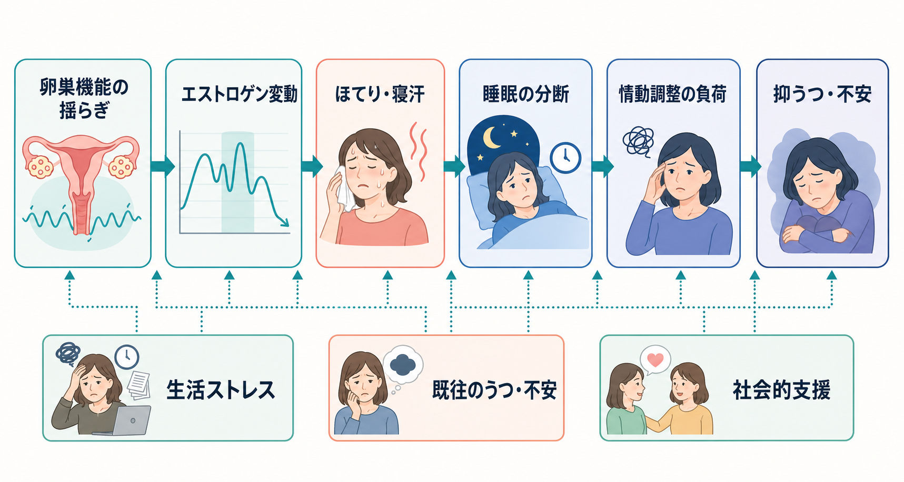
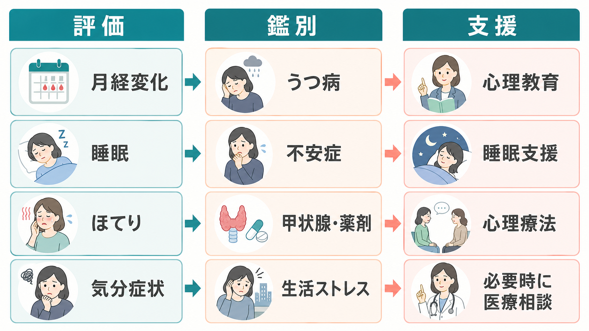

# 更年期関連精神症状とは何か

## 要点

- 更年期関連精神症状は、閉経移行期から閉経後早期にみられる抑うつ、不安、いらだち、睡眠障害、集中困難などを、ホルモン変動・身体症状・生活史の交差として理解するための臨床的な整理である。
- 「更年期だから気分が不安定になる」と単純化するのではなく、月経周期の変化、ほてり・寝汗、睡眠の分断、既往の[[うつ病とは何か]]や[[不安症群とは何か]]、介護・仕事・家族役割などを同時に評価する必要がある[1][2][3]。
- 閉経移行期は抑うつ症状のリスクが上がりやすい時期だが、すべての人が精神症状を経験するわけではない。診断名ではなく、脆弱性が高まる「時期」と多因子モデルとして扱うのが実用的である[3][4]。
- 医療・精神医学的には、気分症状の重症度、希死念慮、機能障害、睡眠障害、身体疾患、薬剤、甲状腺機能などを確認し、必要に応じて婦人科・精神科・睡眠医療をつなぐ[2][5]。

## この記事で答える問い

1. 更年期関連精神症状は、通常の気分の揺れや[[うつ病とは何か]]と何が違うのか。
2. ホルモン変動、ほてり・寝汗、[[不眠障害とは何か]]、心理社会的変化はどのように関係するのか。
3. 臨床・研究では、何を評価し、どのような誤解を避けるべきか。

## まず結論

更年期関連精神症状は、「エストロゲン低下だけで起きる精神症状」ではない。閉経移行期には卵巣機能が揺らぎ、エストラジオールやFSHが大きく変動し、ほてり・寝汗などの血管運動症状、睡眠の分断、疲労、痛み、生活ストレスが重なりやすい[1][6]。この状態で、過去のうつ病・不安症、月経前の気分変動、周産期の気分症状、慢性疾患、介護や職場負荷が加わると、抑うつ・不安・いらだちが前景化しやすくなる[2][3]。

したがって、評価の焦点は「更年期かどうか」だけではない。いつから、何が、どの程度、生活機能に影響しているのかを時間軸で見ることが重要である。教育・研究目的の整理としては、閉経移行期を「身体・睡眠・情動・社会的役割が同時に再調整される時期」と捉えると理解しやすい。

## 背景

更年期は、日本語ではしばしば「閉経前後の体調不良」と広く呼ばれるが、研究上はより細かい段階に分けられる。STRAW+10では、成人女性の生殖加齢を生殖期、閉経移行期、閉経後に区分し、最終月経を中心に月経周期の変動や無月経期間を用いて段階化する[1]。重要なのは、STRAW+10が症状だけで段階を決める分類ではなく、主に月経出血パターンと内分泌変化で時期を整理する枠組みだという点である。

閉経移行期の精神症状は、公衆衛生上も臨床上も見落とされやすい。抑うつ症状は「年齢のせい」「性格の問題」「家庭や仕事の問題」と解釈され、逆にすべてが「ホルモンのせい」と説明されることもある。どちらも不十分である。NICEの更年期ガイドラインは、更年期症状の同定と管理において、血管運動症状、睡眠、気分、生活への影響を含めた情報提供と個別化を重視しており、2026年4月15日の更新ではHRT中の不正出血に関する推奨も改訂されている[5]。

## 基本概念

### 更年期関連精神症状

ここでいう更年期関連精神症状とは、閉経移行期から閉経後早期に、月経変化や更年期症状と時間的に重なって出現・悪化する精神症状の総称である。代表的には、抑うつ気分、興味・喜びの低下、不安、いらだち、情緒不安定、集中困難、疲労感、睡眠障害が含まれる[2][3]。

ただし、これはDSMやICDの独立した診断名ではない。大うつ病エピソード、[[不安症群とは何か]]、[[不眠障害とは何か]]、身体疾患に伴う精神症状、薬剤性の症状などを区別しながら、閉経移行期という発症・増悪の文脈を評価するための概念である。

### 閉経移行期とリスクの窓

2018年の周閉経期うつ病ガイドラインは、周閉経期を抑うつ症状や大うつ病エピソードが生じやすい「脆弱性の窓」と位置づけている[2]。メタ解析でも、閉経前と比べて周閉経期には抑うつ症状のリスクが高いことが示されている[3][4]。一方で、すべての研究で大うつ病診断のリスク上昇が明確に一致するわけではなく、質問紙で測られる抑うつ症状、臨床診断、身体症状の混入を分けて読む必要がある[3]。

## 仕組み

### 1. ホルモン変動と神経調整

閉経移行期では、エストロゲンが単調に下がるというより、周期ごとの変動幅が大きくなる。エストロゲンはセロトニン、ノルアドレナリン、ドパミン、GABA、グルタミン酸系、HPA軸、体温調節、睡眠覚醒リズムに関係するため、急な変動に対する神経系の適応が気分や不安の変化として現れる可能性がある[2][6]。

ここで重要なのは、血中ホルモン値だけで症状を説明しきれないことである。同じホルモン変動でも、既往の気分障害、ストレス負荷、睡眠不足、痛み、社会的支援によって症状の出方は変わる。

### 2. ほてり・寝汗と睡眠の分断

更年期症状の中でも、ほてり・寝汗などの血管運動症状は睡眠を分断しやすい。睡眠レビューでは、更年期移行期に主観的睡眠障害が増え、夜間覚醒が中心的な訴えになりやすいこと、血管運動症状が睡眠の質低下と関連することが整理されている[6]。睡眠が分断されると、感情調整、注意、記憶、痛みへの耐性が低下し、抑うつ・不安を増幅しうる。

この経路は、[[不眠障害とは何か]]と重なる。更年期の睡眠障害は、ほてり・寝汗だけでなく、睡眠時無呼吸、むずむず脚症候群、薬剤、アルコール、介護による中断、勤務時間、スマートフォン使用なども評価対象になる。

### 3. 心理社会的変化

更年期は、身体の変化だけでなく、人生の役割変化が重なりやすい時期でもある。子どもの独立、親の介護、職場責任、パートナー関係、慢性疾患、喪失体験、経済的不安などが同時に起きることがある。これらは単なる「背景」ではなく、睡眠や身体症状と相互作用して気分症状を維持する。

たとえば、夜間の寝汗で睡眠が短くなり、日中の疲労で仕事効率が落ち、自己評価が低下し、さらに不安で眠れなくなる、という循環が生じる。この循環を断つには、ホルモン、睡眠、生活負荷、認知・行動パターンを分けて評価する必要がある。

## 図解

上の図は、卵巣機能の揺らぎから血管運動症状、睡眠の分断、情動調整の負荷、抑うつ・不安へ至る代表的経路を示している。ただし、これは一方向の決定論ではなく、生活ストレス、既往歴、社会的支援が各段階に影響する多因子モデルである。

2枚目は、臨床・研究で見るべき評価軸をまとめたものである。月経変化、睡眠、ほてり、気分症状を同時に把握し、[[うつ病とは何か]]、[[不安症群とは何か]]、甲状腺疾患、薬剤、生活ストレスを鑑別に入れる。支援は心理教育、睡眠支援、心理療法、必要時の医療相談を組み合わせる。

追加図解案: 「更年期関連精神症状」を中央に置き、周囲に「ホルモン変動」「睡眠障害」「ほてり・寝汗」「心理社会的変化」「抑うつ・不安」「評価と支援」を配置する概念地図。矢印は一方向ではなく相互作用として描き、「単一原因ではなく多因子モデル」と注記する。

## 臨床・研究との接続

臨床評価では、第一に重症度と安全性を確認する。希死念慮、自傷リスク、著しい食欲低下、精神病症状、躁状態、重度の機能障害があれば、一般的な更年期不調として扱わず、精神科的評価を優先する。過去の[[うつ病とは何か]]、双極性障害、産後うつ、月経前不快気分障害、トラウマ、物質使用、家族歴も重要である[2]。

第二に、身体・婦人科的評価と睡眠評価を行う。月経変化、最終月経、ほてり・寝汗、腟・泌尿生殖器症状、疼痛、甲状腺疾患、貧血、薬剤、アルコール、睡眠時無呼吸、むずむず脚症候群を確認する。NAMSのホルモン療法声明は、血管運動症状に対してホルモン療法が有効な選択肢である一方、年齢、閉経からの年数、禁忌、本人の価値観に基づく個別化と定期的再評価を強調している[7]。これは個別治療指示ではなく、支援を組み合わせる際の研究・臨床上の前提である。

第三に、心理社会的支援を組み込む。症状日誌、睡眠日誌、生活負荷の棚卸し、職場調整、家族との情報共有、心理療法、運動、睡眠衛生、必要時の薬物療法を、本人の困りごとに合わせて選ぶ。周閉経期うつ病ガイドラインは、抗うつ薬、ホルモン療法、心理療法、運動などを症状とリスクに応じて検討する枠組みを示している[2]。

研究では、閉経段階、年齢、既往歴、血管運動症状、睡眠、身体疾患、社会的要因を分離して測定することが重要である。抑うつ尺度には睡眠・疲労・食欲など身体症状が含まれるため、閉経症状そのものが抑うつ得点を押し上げる可能性がある[3]。したがって、診断面接、症状尺度、生理指標、縦断データを組み合わせる設計が望ましい。

## よくある誤解

### 誤解1: 更年期の精神症状はホルモンだけで説明できる

ホルモン変動は重要だが、単独原因ではない。睡眠、血管運動症状、既往歴、ストレス、支援環境が重なって症状が現れる。ホルモン値が「正常」でも困りごとが消えるわけではなく、逆にホルモン変化があるからといって全員が抑うつになるわけでもない。

### 誤解2: 更年期だから治療しなくてよい

更年期に関連していても、生活機能を損なう抑うつ・不安・不眠は評価と支援の対象である。特に希死念慮、強い絶望感、仕事や家事の著しい障害、睡眠不足の長期化がある場合は、早めに医療相談が必要になる。

### 誤解3: うつ病と更年期症状は完全に別物である

両者は別概念だが、重なりうる。大うつ病エピソードとしての診断基準を満たす場合もあれば、ほてり・寝汗と睡眠障害が中心で、二次的に気分が落ちている場合もある。鑑別とは「どちらか一方に決める」ことではなく、支援につながる層を分ける作業である。

## 関連ノート

- [[うつ病とは何か]]
- [[不安症群とは何か]]
- [[全般不安症とは何か]]
- [[パニック症とは何か]]
- [[不眠障害とは何か]]
- [[むずむず脚症候群とは何か]]

今後の作成候補:

- 閉経移行期とは何か
- 血管運動症状とは何か
- 月経前不快気分障害とは何か
- 甲状腺機能異常に伴う精神症状とは何か
- 女性のライフステージとうつ病リスク

MOC更新候補:

- `content/00_MOC/` 配下の精神医学、睡眠医学、女性の健康・内分泌に関するMOCへ追加候補。並列ジョブとの競合を避けるため、本記事ではMOC本体は更新しない。

## 理解チェック

1. 更年期関連精神症状を、独立した診断名としてではなく多因子モデルとして扱う理由は何か。
2. ほてり・寝汗と抑うつ・不安の間に、睡眠の分断がどのように介在しうるか。
3. 「更年期だから仕方ない」と「全部ホルモンのせい」の両方が不十分な理由は何か。
4. 臨床評価で、気分症状以外に確認すべき身体・睡眠・生活要因を3つ挙げる。

## 参考文献

[1] Harlow SD, Gass M, Hall JE, et al. Executive summary of the Stages of Reproductive Aging Workshop +10: addressing the unfinished agenda of staging reproductive aging. *Menopause*. 2012;19(4):387-395. https://doi.org/10.1097/gme.0b013e31824d8f40

[2] Maki PM, Kornstein SG, Joffe H, et al. Guidelines for the evaluation and treatment of perimenopausal depression: summary and recommendations. *Menopause*. 2018;25(10):1069-1085. https://doi.org/10.1097/GME.0000000000001174

[3] de Kruif M, Spijker AT, Molendijk ML. Depression during the perimenopause: A meta-analysis. *Journal of Affective Disorders*. 2016;206:174-180. https://doi.org/10.1016/j.jad.2016.07.040

[4] Badawy Y, Spector A, Li Z, Desai R. The risk of depression in the menopausal stages: A systematic review and meta-analysis. *Journal of Affective Disorders*. 2024;357:126-133. https://doi.org/10.1016/j.jad.2024.04.041

[5] National Institute for Health and Care Excellence. *Menopause: identification and management*. NICE Guideline NG23. Last updated 15 April 2026. https://www.nice.org.uk/guidance/ng23

[6] Baker FC, de Zambotti M, Colrain IM, Bei B. Sleep problems during the menopausal transition: prevalence, impact, and management challenges. *Nature and Science of Sleep*. 2018;10:73-95. https://doi.org/10.2147/NSS.S125807

[7] The 2022 Hormone Therapy Position Statement of The North American Menopause Society Advisory Panel. The 2022 hormone therapy position statement of The North American Menopause Society. *Menopause*. 2022;29(7):767-794. https://doi.org/10.1097/GME.0000000000002028
