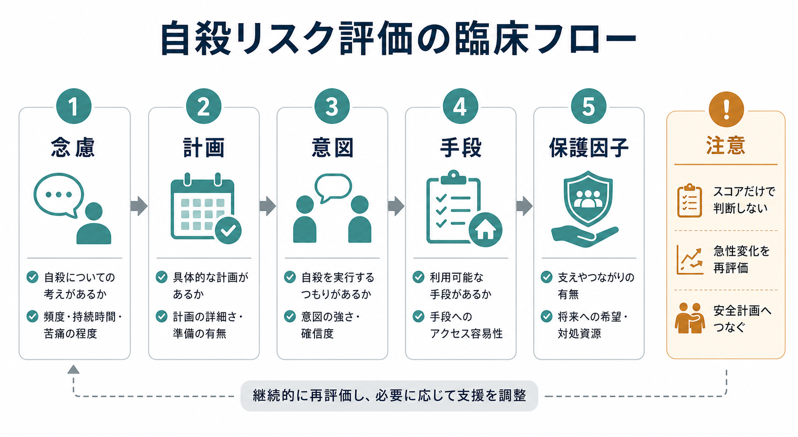
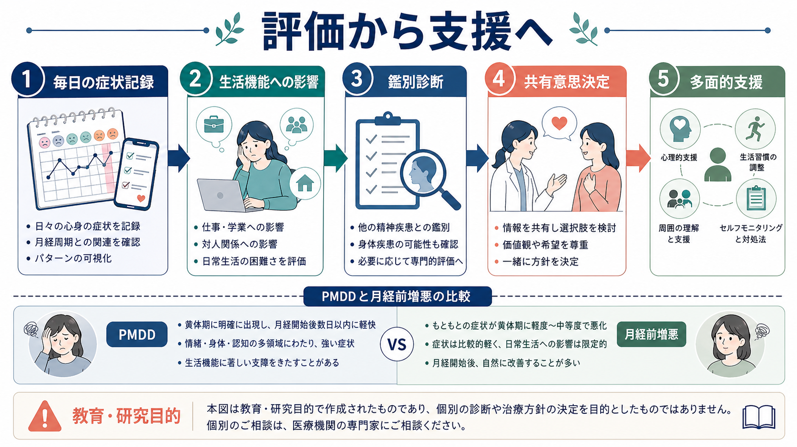
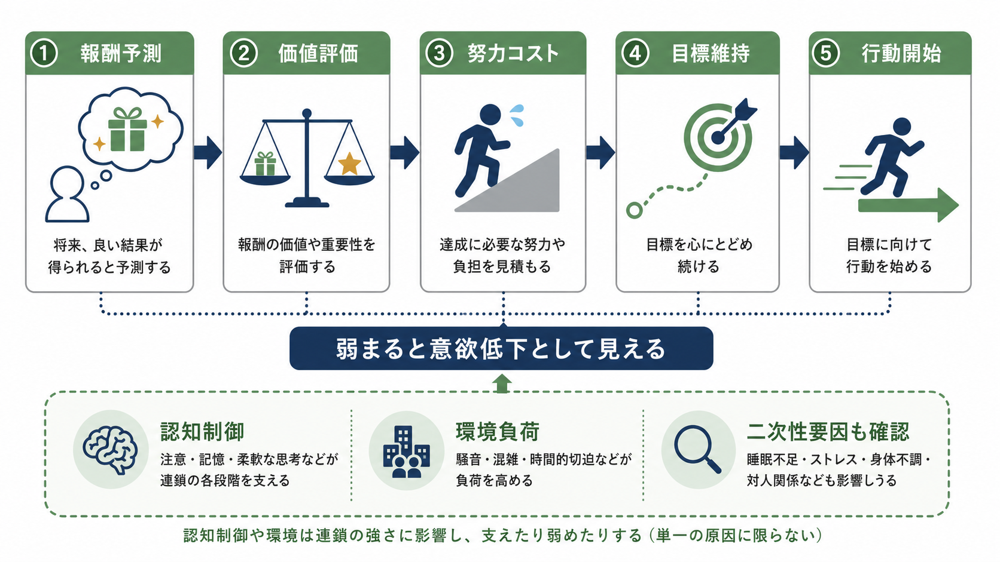

# 月経前不快気分障害とは何か

## 要点

- 月経前不快気分障害（premenstrual dysphoric disorder: PMDD）は、月経前に反復して出現し、月経開始後に軽快する気分症状と生活機能障害を中心とする状態である。DSM-5 では抑うつ障害群に位置づけられる[1]。
- 重要なのは「月経前に不調がある」だけではなく、症状が周期性をもち、少なくとも一つの中核気分症状を含み、仕事・学業・対人関係・家庭生活を明らかに損なうことである[1][2]。
- PMDD は単純な「ホルモン過剰」や「性格の問題」では説明しにくい。研究上は、通常範囲の卵巣ホルモン変動、とくにプロゲステロン代謝産物アロプレグナノロンと GABA-A 受容体の相互作用への感受性が重視される[4][5]。
- 評価では、少なくとも 2 周期の前向きな毎日記録が重要である。[[うつ病とは何か]]、[[双極性障害とは何か]]、不安症、物質・薬剤、甲状腺疾患、月経前増悪との鑑別も必要になる[1][2]。
- 治療・支援は教育、症状記録、生活調整、心理療法、SSRI、排卵抑制を含むホルモン治療などを、重症度・希望・併存症・副作用リスクに応じて組み合わせる[2][3][7]。本記事は教育・研究目的の整理であり、個別診断や治療指示ではない。

## この記事で答える問い

1. PMDD は PMS や「月経前の気分の落ち込み」と何が違うのか。
2. なぜ月経周期に同期して気分症状が出るのか。
3. ホルモン変動、神経ステロイド、[[GABAは脳で何をしているのか|GABA]]、[[セロトニンは気分だけに関わるのか|セロトニン]]はどのように関係するのか。
4. 臨床では何を記録し、何と鑑別し、どのような支援につなげるのか。

## まず結論

PMDD は「月経前だから誰にでもある不調」の延長ではなく、周期性をもつ気分障害として理解すると見通しがよい。典型的には排卵後の黄体期に、抑うつ気分、不安、情動不安定性、易怒性のいずれかを含む症状が強まり、月経開始後数日以内に軽快し、月経後 1 週間には最小または消失する[1]。この時間的パターンが、通常の気分障害や持続的なストレス反応と区別する手がかりになる。

一方で、PMDD は「女性ホルモンの値が異常だから起こる」と単純化しないほうがよい。卵巣機能を抑制すると症状が軽快し、エストラジオールやプロゲステロンを再投与すると PMDD 群で症状が再出現しやすいことから、通常範囲のホルモン変動に対する中枢神経系の感受性が鍵だと考えられている[4]。その中心候補が、プロゲステロン代謝産物アロプレグナノロン、GABA-A 受容体、ストレス応答、セロトニン系の相互作用である[5]。

## 背景

月経前症状は珍しくないが、PMDD では症状の強さと生活障害が前景に出る。PMS は身体症状、気分症状、行動変化を含む広い概念であり、PMDD はそのなかでも気分症状と機能障害が重い群として扱われる[2][3]。DSM-5 上は、PMDD は抑うつ障害群の一つであり、診断には周期性、症状数、中核気分症状、機能障害、他疾患による説明ではないこと、前向き記録による確認が求められる[1]。

この位置づけは、二つの実践的意味をもつ。第一に、PMDD は「気分の問題」と「婦人科的な周期現象」のどちらか一方に閉じない。精神医学、産婦人科、プライマリケア、心理支援の接点にある。第二に、評価では症状の有無だけでなく、周期内のいつ悪化し、いつ軽快するかを記録する必要がある。[[性機能や月経歴はなぜ精神科で重要なのか]]と合わせて読むと、月経歴を精神科評価に含める理由が理解しやすい。

## 基本概念

### 中核症状

PMDD では、多くの月経周期で月経開始前の最終週に症状が出現し、月経開始後数日以内に改善し、月経後 1 週間には最小または消失する。症状は 5 つ以上必要で、そのうち少なくとも 1 つは、情動不安定性、易怒性・怒り、抑うつ気分、強い不安・緊張のいずれかである[1]。

追加症状としては、興味の低下、集中困難、疲労感、食欲変化、睡眠変化、圧倒される感覚、乳房痛・頭痛・関節痛・筋肉痛・膨満感などの身体症状が含まれる[1]。ただし、症状リストを満たすだけでは不十分で、対人関係、仕事、学業、家庭生活などに明確な支障があることが重要である。

### PMS、PMDD、月経前増悪

PMS は月経前に出る心身症状の広い臨床概念であり、PMDD は気分症状と機能障害がより明確な診断単位である。もう一つ重要なのが、月経前増悪である。これは、もともとある[[うつ病とは何か|うつ病]]、[[双極性障害とは何か|双極性障害]]、不安症、PTSD、摂食症、疼痛疾患などが月経前に悪化するパターンを指す[3]。

PMDD と月経前増悪は混同されやすい。PMDD では月経後の症状が最小化する周期性が目立つのに対し、月経前増悪では基礎疾患の症状が周期を通じて残り、月経前にさらに強まる。治療方針も異なるため、記憶に頼るよりも毎日の記録で判定するほうが安全である。

### 診断名の意味

「不快気分障害」という名前は、単なる不快感ではなく、抑うつ、不安、情動不安定性、易怒性が生活を損なう水準で反復することを示している。[[DSMとICDは何が違うのか]]で整理されるように、診断分類は研究・臨床コミュニケーションのための道具であり、本人の苦痛を単純なラベルに還元するものではない。

## 仕組み

### 排卵後の変動に対する感受性

PMDD の機序で最も重要なのは、ホルモン値の「高すぎる・低すぎる」ではなく、排卵後に生じる変動への感受性である。卵巣機能を抑制すると症状が軽快し、エストラジオールやプロゲステロンを再導入すると PMDD 群で症状が再燃しやすいという古典的研究は、この見方の根拠になっている[4]。

このことは、本人の症状が「気のせい」だという意味ではない。むしろ、同じホルモン変動でも、脳内の受容体、神経ステロイド応答、ストレス系、遺伝子発現調節が異なれば、情動調節への影響が変わりうることを示している[5][6]。

### アロプレグナノロンと GABA-A 受容体

プロゲステロンは黄体期に増加し、その一部はアロプレグナノロンへ代謝される。アロプレグナノロンは GABA-A 受容体の陽性アロステリック調節因子であり、通常は抑制性神経伝達を強め、不安や覚醒を下げる方向に働くと考えられる[5]。しかし PMDD では、このアロプレグナノロンと GABA-A 受容体の相互作用が周期内でうまく調整されず、情動不安定性、不安、易怒性、ストレス過敏性として現れる可能性がある[5]。

ここでのポイントは、GABA が単に「足りない」のではなく、神経ステロイドの上昇・低下に応じて GABA-A 受容体のサブユニット構成や感受性が変化する点である。したがって PMDD は、神経伝達物質の一方向の不足モデルよりも、周期的な可塑性と感受性のモデルで捉えるほうが自然である。

### セロトニン系と急速な薬理反応

SSRI は PMDD/PMS の症状をプラセボよりも改善することが、ランダム化比較試験を統合したレビューで示されている[7]。PMDD では SSRI が連日投与だけでなく黄体期投与でも有効な場合があり、一般的なうつ病治療よりも早い反応が観察されることがある[7]。この点は、PMDD におけるセロトニン系が「長期的な抗うつ効果」だけでなく、神経ステロイドや情動調節回路との相互作用を通じて働く可能性を示す。

ただし、「PMDD はセロトニン不足である」と断定するのは粗い。SSRI の有効性は重要な臨床的根拠だが、病態全体は GABA-A 受容体、アロプレグナノロン、ストレス応答、遺伝子発現、個人の生活文脈を含む多層モデルとして扱う必要がある[5][6]。

### ストレス応答と情動回路

PMDD では黄体期にストレス感受性が高まりやすいとされ、[[HPA軸は精神疾患にどう関わるのか|HPA軸]]や自律神経反応、驚愕反応、扁桃体を含む情動回路が研究対象になっている[5]。周期的な神経ステロイド変動が抑制性制御を変え、ストレス刺激への反応を増幅すれば、普段なら処理できる対人摩擦、仕事負荷、睡眠不足が、月経前には大きな苦痛として経験されうる。

この見方は、PMDD を「本人の耐性の低さ」ではなく、「周期的に調整余地が狭くなる状態」として理解する助けになる。[[扁桃体過活動は不安症やPTSDにどう関わるのか]]と接続すると、情動刺激への反応性がどのように症状として現れるかを考えやすい。

### 遺伝子発現応答

PMDD では、卵巣ステロイドへの細胞応答の違いを示す研究もある。リンパ芽球様細胞を用いた研究では、ESC/E(Z) 複合体関連遺伝子の発現調節が PMDD 群と対照群で異なることが報告された[6]。これは、PMDD が単なる主観的訴えではなく、ホルモン変動に対する細胞レベルの応答差と関連しうることを示す。

もちろん、この研究だけで臨床診断に使えるバイオマーカーが確立したわけではない。現時点では、PMDD の診断は症状経過と生活障害、前向き記録、鑑別診断に基づく。分子研究は、病態の生物学的理解を深めるための手がかりとして位置づけるのが妥当である。

## 図解

上の 2 枚は、PMDD を「周期性をもつ生活障害」と「ホルモン変動への感受性」という二つの視点から整理したものである。3 枚目は、臨床・研究で何を確認し、どこへつなげるかを示す。

## 臨床・研究との接続

### 評価の入口

臨床では、症状名をすぐに確定するよりも、まず時系列を明確にする。日々の気分、易怒性、不安、睡眠、食欲、身体症状、生活機能、月経開始日を同じ表に記録すると、黄体期に悪化し月経後に軽快するかが見えやすい。DSM-5 では、少なくとも 2 つの症状周期で前向き記録により確認することが求められる[1]。

評価では、希死念慮や自傷リスクも見落とさない。月経前に絶望感や衝動性が強まる場合は、[[自殺リスク評価では何を聞くべきか]]のような構造化されたリスク評価が必要になる。これは PMDD だから特別視するというより、周期性のある危険期を安全計画に組み込むという考え方である。

### 鑑別診断

鑑別では、うつ病、双極性障害、不安症、PTSD、パーソナリティ関連の困難、摂食症、物質・薬剤、甲状腺疾患、貧血、疼痛疾患、婦人科疾患を確認する。とくに双極性障害では、抗うつ薬の扱いが変わるため、躁・軽躁エピソードの既往を確認する必要がある。PMDD と併存症は排他的ではないが、月経前増悪か PMDD かを分けることで支援の焦点が変わる[3]。

### 支援と治療

ACOG の診療ガイドラインは、SSRI、ホルモン療法、心理的介入、補完的介入、運動・栄養、教育・セルフヘルプ、必要例での外科的介入を含む多面的な選択肢を整理している[2]。ISPMD の合意文書も、中枢神経系に働く治療と排卵を抑制する治療という二つの大きな軸を示している[3]。

SSRI はエビデンスが比較的強い選択肢であり、連日投与と黄体期投与の両方が検討される[7]。一方、ホルモン治療や GnRH アゴニストなどは、効果だけでなく副作用、骨量、避妊希望、妊娠希望、既往歴を含めた判断が必要である。個別の薬剤選択は、[[薬物療法は神経回路にどう作用するのか]]で扱うような薬理作用だけでなく、本人の生活史、価値観、リスクを含めて決める。

心理的支援では、症状を「本人の欠点」と見なさず、周期に応じた予測、予定調整、対人摩擦の予防、睡眠・刺激量の調整、危機時の連絡先、自己批判への距離の取り方を扱う。認知行動療法的な介入は、PMDD そのものの生物学的基盤を否定するものではなく、周期的に狭くなる調整余地のなかで損失を減らす実践として位置づけられる。

### 研究上の課題

研究では、前向き症状記録、ホルモン操作、神経ステロイド測定、GABA-A 受容体、脳画像、遺伝子発現、ストレス応答、治療反応を統合する方向に進んでいる[5][6]。課題は、PMDD と月経前増悪の混在、サンプルサイズ、文化差、性別多様性、併存症、長期アウトカムの不足である。研究知見を臨床に使うときは、単一のバイオマーカーで説明しすぎない姿勢が必要になる。

## よくある誤解

### 「PMDD は PMS の少し重い版にすぎない」

連続性はあるが、PMDD では気分症状と生活機能障害が診断上の中心になる。月経前の違和感や軽い不調があるだけでは PMDD とはいえない[1]。

### 「ホルモン値を測れば診断できる」

現時点で、PMDD を確定する単一の血液検査や画像検査はない。通常範囲のホルモン変動への感受性が重視されるため、診断には周期的な症状記録と鑑別が必要である[1][4]。

### 「性格や我慢の問題である」

PMDD では卵巣ステロイドへの感受性、GABA-A 受容体、神経ステロイド、ストレス応答、細胞レベルのホルモン応答差が研究されている[5][6]。本人の努力不足として扱うと、評価と支援の機会を失う。

### 「抗うつ薬だけが正解である」

SSRI は有効性を示す根拠があるが、すべての人に同じ形で合うわけではない[7]。症状記録、心理教育、生活調整、心理療法、ホルモン療法、併存症治療を含め、個別化された多面的支援が必要になる[2][3]。

## 関連ノート

- [[DSMとICDは何が違うのか]]
- [[性機能や月経歴はなぜ精神科で重要なのか]]
- [[うつ病とは何か]]
- [[双極性障害とは何か]]
- [[GABAは脳で何をしているのか]]
- [[セロトニンは気分だけに関わるのか]]
- [[HPA軸は精神疾患にどう関わるのか]]
- [[扁桃体過活動は不安症やPTSDにどう関わるのか]]
- [[自殺リスク評価では何を聞くべきか]]
- [[薬物療法は神経回路にどう作用するのか]]

## 理解チェック

1. PMDD の評価で、症状の強さだけでなく「いつ出て、いつ軽快するか」を記録する理由は何か。
2. PMDD と月経前増悪はどのように違うか。
3. 「ホルモン値の異常」ではなく「ホルモン変動への感受性」と考えると、どのような説明がしやすくなるか。
4. アロプレグナノロンと GABA-A 受容体は、PMDD の情動症状とどのように関係しうるか。
5. 支援を考えるとき、薬物療法以外にどのような情報や環境調整が必要になるか。

## 参考文献

[1] National Center for Biotechnology Information. *Diagnostic Criteria for Premenstrual Dysphoric Disorder (PMDD)*, Endotext. https://www.ncbi.nlm.nih.gov/books/NBK279045/table/premenstrual-syndrom.table1diag/

[2] American College of Obstetricians and Gynecologists. (2023). *Management of Premenstrual Disorders: Clinical Practice Guideline No. 7*. https://www.acog.org/clinical/clinical-guidance/clinical-practice-guideline/articles/2023/12/management-of-premenstrual-disorders

[3] Nevatte, T., O'Brien, P. M. S., Bäckström, T., Brown, C., Dennerstein, L., Endicott, J., Epperson, C. N., Eriksson, E., Freeman, E. W., Halbreich, U., Ismail, K., Panay, N., Pearlstein, T., Rapkin, A., Reid, R., Rubinow, D., Schmidt, P., Steiner, M., Studd, J., Sundström-Poromaa, I., & Yonkers, K. (2013). ISPMD consensus on the management of premenstrual disorders. *Archives of Women's Mental Health, 16*(4), 279-291. https://doi.org/10.1007/s00737-013-0346-y

[4] Schmidt, P. J., Nieman, L. K., Danaceau, M. A., Adams, L. F., & Rubinow, D. R. (1998). Differential behavioral effects of gonadal steroids in women with and in those without premenstrual syndrome. *The New England Journal of Medicine, 338*(4), 209-216. https://doi.org/10.1056/NEJM199801223380401

[5] Hantsoo, L., & Epperson, C. N. (2020). Allopregnanolone in premenstrual dysphoric disorder (PMDD): Evidence for dysregulated sensitivity to GABA-A receptor modulating neuroactive steroids across the menstrual cycle. *Neurobiology of Stress, 12*, 100213. https://doi.org/10.1016/j.ynstr.2020.100213

[6] Dubey, N., Hoffman, J. F., Schuebel, K., Yuan, Q., Martinez, P. E., Nieman, L. K., Rubinow, D. R., Schmidt, P. J., & Goldman, D. (2017). The ESC/E(Z) complex, an effector of response to ovarian steroids, manifests an intrinsic difference in cells from women with premenstrual dysphoric disorder. *Molecular Psychiatry, 22*(8), 1172-1184. https://doi.org/10.1038/mp.2016.229

[7] Marjoribanks, J., Brown, J., O'Brien, P. M. S., & Wyatt, K. (2013). Selective serotonin reuptake inhibitors for premenstrual syndrome. *Cochrane Database of Systematic Reviews, 2013*(6), CD001396. https://doi.org/10.1002/14651858.CD001396.pub3

## 未解決問題

- PMDD と月経前増悪を、日常臨床でどこまで精密に分けられるか。
- アロプレグナノロン、GABA-A 受容体、セロトニン系、ストレス応答を結ぶ個人差を、どの測定で再現性高く捉えられるか。
- 青年期、周産期、更年期移行期、トランスジェンダー・ノンバイナリーの月経経験を含む集団で、評価と支援をどう調整するか。
- SSRI、ホルモン療法、心理療法、生活調整のどの組み合わせが、どの人に最も有効かを予測できるか。

## MOC更新候補

- `content/00_MOC/` 配下の精神医学、気分障害、女性のメンタルヘルス、臨床評価関連 MOC に `[[月経前不快気分障害とは何か]]` を追加する候補。
- 並列ジョブとの競合を避けるため、本タスクでは MOC ファイル本体は更新しない。
