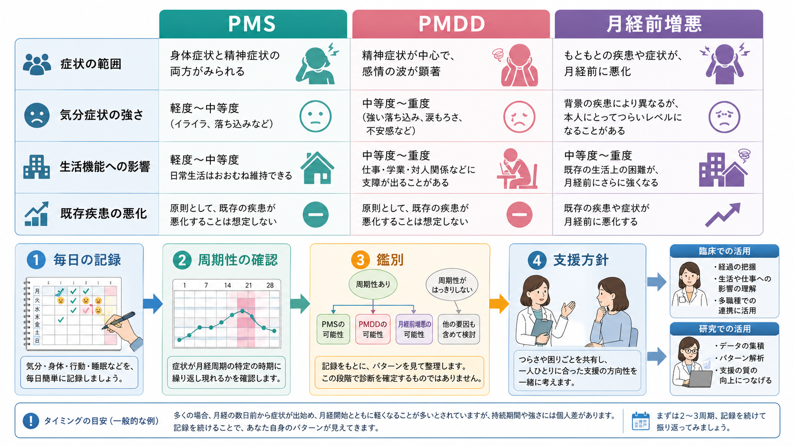
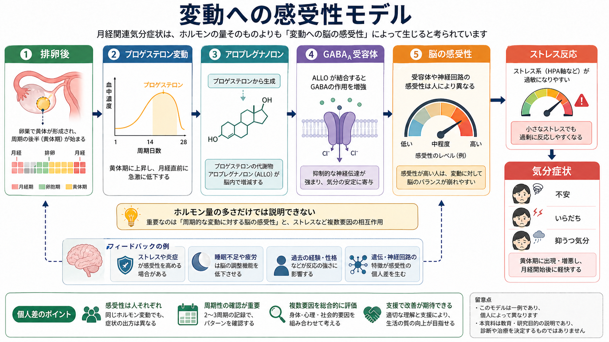

# 月経関連気分症状とは何か

## 要点

- 月経関連気分症状とは、月経周期の特定の時期、とくに排卵後から月経開始前後にかけて、気分の落ち込み、不安、いらだち、情動の揺れが周期的に強まる状態を指す。
- 重要なのは「症状の種類」だけでなく、「いつ出るか」「月経開始後に軽くなるか」「生活機能にどれほど影響するか」である[1][2]。
- PMDD（月経前不快気分障害）は、月経前症状のうち気分症状と生活機能障害が特に強い病態で、DSM-5 では抑うつ障害群に位置づけられる[2]。
- うつ病や不安症などの既存症状が月経前に悪化する場合は、PMDDそのものではなく「月経前増悪」として整理する必要がある[3][4]。
- 現在の有力な説明は、ホルモン量が単純に多い・少ないというより、周期的なエストロゲン、プロゲステロン、アロプレグナノロン変動に対する脳の感受性が高い、または調整しにくいというモデルである[5][6]。

## この記事で答える問い

1. 月経関連気分症状は、通常の気分の波やPMSとどう違うのか。
2. PMDD、PMS、月経前増悪はどう区別されるのか。
3. なぜ月経周期が気分、不安、いらだちに影響しうるのか。
4. 臨床や研究では、何を記録し、何と鑑別する必要があるのか。

## まず結論

月経関連気分症状は、「月経前に少し気分が揺れる」という一枚岩の現象ではない。PMSの一部として身体症状と一緒に現れることもあれば、PMDDのように気分症状が中心となって仕事、学業、対人関係を大きく妨げることもある。また、[[うつ病とは何か|うつ病]]、[[不安症群とは何か|不安症]]、[[双極性障害とは何か|双極性障害]]などの症状が月経前に強まる「月経前増悪」も別に考える必要がある[2][4]。

したがって、臨床的に最初に見るべきなのは、気分症状の内容そのものよりも、日々の症状が月経周期とどのように同期しているかである。少なくとも2周期程度の前向きな毎日の記録は、PMDD、PMS、月経前増悪、非周期性の気分障害を見分けるための中核的な情報になる[2][3]。

## 背景

月経前症状は、身体症状、情動症状、行動症状が組み合わさって現れる。軽い乳房の張り、腹部膨満、眠気、食欲変化、いらだち程度で生活機能が保たれている場合もあるが、一部では対人関係、仕事、学業、家庭内役割、自己評価に明確な支障が出る[1][2]。

RCOGのガイドラインは、PMSでは抑うつ、不安、いらだち、自信低下、気分変動などの心理症状と、膨満感や乳房痛などの身体症状があり、症状の強い人では誤診や不適切な治療選択が問題になると述べている[7]。ACOGの臨床実践ガイドラインも、月経前障害をPMSとPMDDを含むスペクトラムとして扱い、診断、病態、治療選択をエビデンスに基づいて整理している[1]。

## 基本概念

### PMS

PMS（月経前症候群）は、月経前に心理症状または身体症状が反復し、日常生活に一定の影響を与える状態である。症状は多様で、気分症状だけでなく、乳房の張り、腹部膨満、頭痛、疲労、睡眠や食欲の変化なども含まれる[2][7]。

### PMDD

PMDD（月経前不快気分障害）は、PMSの重症型というだけでなく、気分症状が中心にある周期性の気分障害として理解される。DSM-5で重視される中核症状は、著しい抑うつ気分、不安・緊張、情動の不安定さ、怒り・いらだちであり、これらのうち少なくとも1つを含む複数症状が、月経前に現れ、月経開始後に軽快し、生活機能を大きく妨げる[2]。

ただし、PMDDの診断は「月経前につらい」という自己報告だけで確定するものではない。DSM-5では、症状が他の精神疾患の単なる悪化ではないこと、かつ少なくとも2つの症候性月経周期にわたる前向きな毎日評価で確認することが求められる[2]。

### 月経前増悪

月経前増悪は、もともと存在する心理・身体・医学的な疾患や症状が、月経前に明らかに悪化する状態である。ISPMDの分類では、典型的な排卵周期に伴う「中核的な月経前障害」と、より複雑な「変異型」の一つとして月経前増悪が区別される[3][4]。

この区別は実用的である。たとえば、月経前だけでなく月経後や卵胞期にも抑うつ気分が続く場合、中心には[[うつ病とは何か|うつ病]]や[[不安抑うつ混合状態とは何か|不安抑うつ混合状態]]があり、月経前にその症状が増幅されている可能性がある。逆に、症状が月経前に集中し、月経後に明確な無症状または軽症の期間があるなら、PMDDやPMSの可能性が高くなる。

## 仕組み

### ホルモン量そのものより「変動への感受性」

PMDDや強い月経前症状では、卵巣ホルモンの分泌パターンが単純に異常というより、正常範囲の周期的変動に対する中枢神経系の感受性が高い、または適応が難しいという見方が支持されている[2][5]。

排卵後の黄体期にはプロゲステロンが上昇し、その代謝物であるアロプレグナノロンも変動する。アロプレグナノロンは [[GABAは脳で何をしているのか|GABA]]$_A$ 受容体を調節する神経ステロイドであり、通常は抑制性神経伝達やストレス反応の調整に関わる[5][6]。PMDDでは、このアロプレグナノロンと GABA$_A$ 受容体の相互作用への感受性が周期内で乱れ、情動不安定、不安、いらだち、抑うつ気分が出やすくなるという仮説がある[5][6]。

### ストレス反応との接続

PMDDでは、黄体期に主観的・生理的なストレス感受性が高まる可能性も指摘されている[5]。ここには、性ステロイド系と [[HPA軸は精神疾患にどう関わるのか|HPA軸]]、GABA系、セロトニン系の相互作用が関係すると考えられる。ただし、単一の神経伝達物質や単一ホルモンで説明できる病態ではない。

## 図解

上の1枚目は、PMS、PMDD、月経前増悪を比較し、毎日の記録から周期性の確認、鑑別、支援方針へ進む流れを示している。2枚目は、排卵後のプロゲステロン変動、アロプレグナノロン、GABA$_A$受容体、脳の感受性、ストレス反応をつなげた「変動への感受性モデル」である。

図は概念整理のためのものであり、個人の診断や治療選択を直接決めるものではない。実際には、症状の周期性、重症度、持続期間、既存疾患、睡眠、ストレス、身体疾患、薬剤・物質使用、生活機能への影響を合わせて評価する。

## 臨床・研究との接続

臨床では、月経関連気分症状を「女性ホルモンのせい」と一括りにせず、少なくとも次の4点を分ける必要がある。

1. 症状が月経前に集中し、月経開始後に軽快するか。
2. 気分症状が中心か、身体症状が中心か、混合しているか。
3. 仕事、学業、対人関係、家庭内役割にどれほど支障があるか。
4. 既存の精神疾患や身体疾患が、月経前に悪化しているだけではないか。

研究では、DRSP（Daily Record of Severity of Problems）のような毎日の症状評価、周期相の同定、ホルモン測定、ストレス反応、GABA系やセロトニン系の指標を組み合わせることで、PMDDを「気分症状の周期性」と「脳の感受性」の両面から理解しようとしている[2][5][8]。

治療や支援については、ACOGやISPMDが、薬物療法、ホルモン療法、心理的支援、運動・栄養、セルフモニタリングなどを含む多面的な選択肢を整理している[1][4]。ただし、このノートは教育・研究目的の概説であり、個別の診断や治療指示ではない。強い希死念慮、自傷の危険、著しい生活機能低下がある場合は、月経周期との関連にかかわらず、速やかな専門的評価が優先される。

## よくある誤解

### 「月経前なら誰でも同じ」

月経前の軽い不快感と、生活機能を損なうPMDDは同じではない。月経関連気分症状は連続体として理解できるが、重症度と機能障害を見落とすと、本人の困難が過小評価される。

### 「ホルモン値が異常ならPMDD」

PMDDは、通常の検査でホルモン値が単純に異常だから起きる、という病態ではない。むしろ、周期的変動に対する脳の感受性や神経ステロイド応答が重要な説明候補である[5][6]。

### 「PMDDとうつ病は完全に別」

PMDDは周期性が中核だが、[[うつ病とは何か|うつ病]]や[[双極性障害とうつ病はどう鑑別するのか|双極性障害とうつ病の鑑別]]と無関係ではない。月経前増悪や併存を見落とすと、周期性のある症状をPMDDだけで説明しすぎる危険がある[2][3]。

## 関連ノート

- [[GABAは脳で何をしているのか]]
- [[HPA軸は精神疾患にどう関わるのか]]
- [[うつ病とは何か]]
- [[不安症群とは何か]]
- [[双極性障害とは何か]]
- [[DSMとICDは何が違うのか]]

## 理解チェック

1. PMS、PMDD、月経前増悪を区別するとき、症状の内容以外にどの情報が重要か。
2. PMDDの診断で、2周期程度の毎日記録が重視されるのはなぜか。
3. 「ホルモン量の異常」ではなく「変動への感受性」と考えると、PMDDの理解はどう変わるか。
4. 月経前に抑うつや不安が強まる人を評価するとき、どのような既存疾患や併存を考える必要があるか。

## 関連ノート候補・MOC更新候補

- MOC更新候補: `content/00_MOC/` 配下の精神医学、気分障害、女性のメンタルヘルス、精神科診断に関するMOC。
- 今後の作成候補: 「PMDDとは何か」「月経前増悪とは何か」「DRSPとは何か」「周産期・生殖精神医学とは何か」。

## 未解決問題

- PMDDにおけるアロプレグナノロン-GABA$_A$受容体感受性の変化が、個人差、発達歴、ストレス曝露、遺伝的要因とどう相互作用するかは十分に解明されていない。
- 月経前増悪を、PMDDや非周期性の気分障害から日常診療で効率よく区別するための実装研究が必要である。
- 思春期、トランスジェンダー、月経抑制中、周産期、更年期移行期など、多様な背景での評価枠組みはさらに整備が必要である。

## 参考文献

[1] American College of Obstetricians and Gynecologists. (2023). *Management of Premenstrual Disorders: ACOG Clinical Practice Guideline No. 7*. Obstetrics & Gynecology, 142(6), 1516-1533. https://doi.org/10.1097/AOG.0000000000005426

[2] Mishra, S., Elliott, H., & Marwaha, R. (2023). *Premenstrual Dysphoric Disorder*. StatPearls. NCBI Bookshelf. https://www.ncbi.nlm.nih.gov/books/NBK532307/

[3] O'Brien, P. M. S., Bäckström, T., Brown, C., et al. (2011). Towards a consensus on diagnostic criteria, measurement and trial design of the premenstrual disorders: The ISPMD Montreal consensus. *Archives of Women's Mental Health*, 14(1), 13-21. https://doi.org/10.1007/s00737-010-0201-3

[4] Nevatte, T., O'Brien, P. M. S., Bäckström, T., et al. (2013). ISPMD consensus on the management of premenstrual disorders. *Archives of Women's Mental Health*, 16(4), 279-291. https://doi.org/10.1007/s00737-013-0346-y

[5] Hantsoo, L., & Epperson, C. N. (2020). Allopregnanolone in premenstrual dysphoric disorder (PMDD): Evidence for dysregulated sensitivity to GABA-A receptor modulating neuroactive steroids across the menstrual cycle. *Neurobiology of Stress*, 12, 100213. https://doi.org/10.1016/j.ynstr.2020.100213

[6] Gao, Q., Sun, W., Wang, Y.-R., et al. (2023). Role of allopregnanolone-mediated γ-aminobutyric acid A receptor sensitivity in the pathogenesis of premenstrual dysphoric disorder: Toward precise targets for translational medicine and drug development. *Frontiers in Psychiatry*, 14, 1140796. https://doi.org/10.3389/fpsyt.2023.1140796

[7] Royal College of Obstetricians and Gynaecologists. (2017). *Management of Premenstrual Syndrome: Green-top Guideline No. 48*. https://www.rcog.org.uk/guidance/browse-all-guidance/green-top-guidelines/premenstrual-syndrome-management-green-top-guideline-no-48/

[8] Eisenlohr-Moul, T. A. (2019). Premenstrual disorders: A primer and research agenda for psychologists. *Clinical Psychology: Science and Practice*, 26(4), e12296. https://pmc.ncbi.nlm.nih.gov/articles/PMC7193982/
