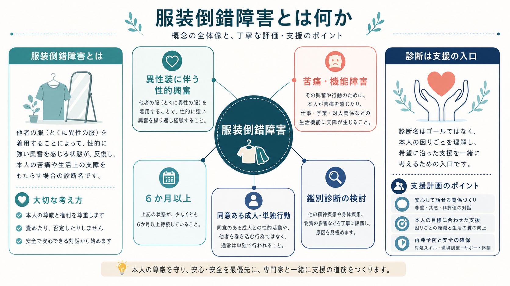
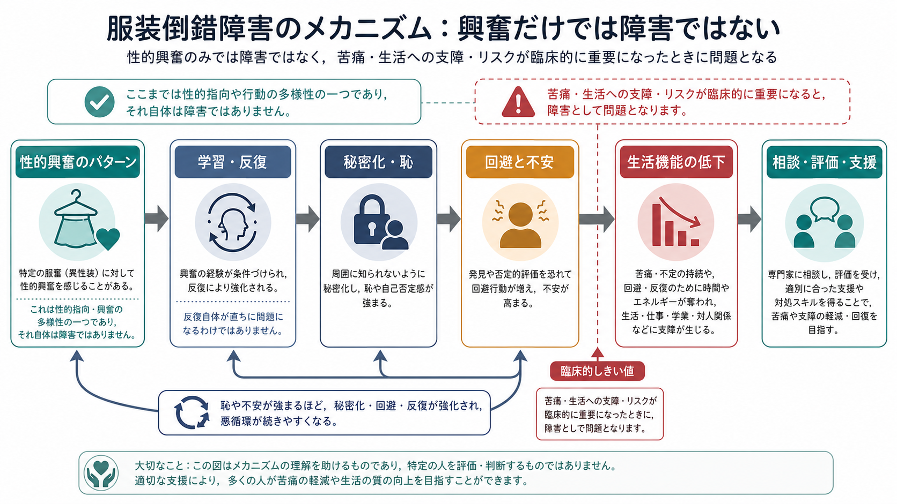
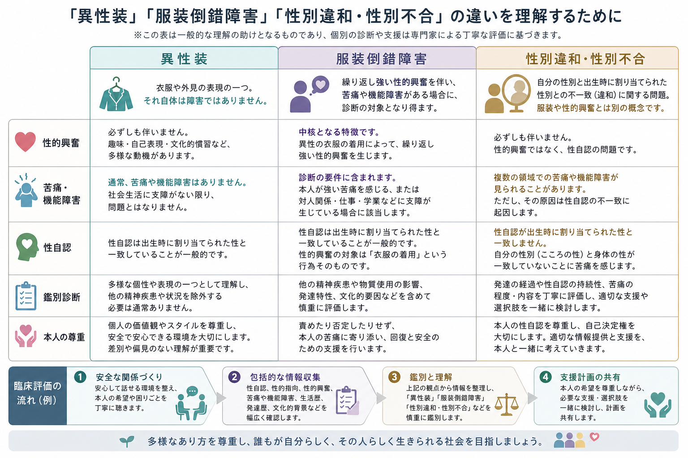

# 服装倒錯障害とは何か

## 要点

- 服装倒錯障害は、異性装に伴う反復的で強い性的興奮が、本人の強い苦痛や社会・職業・対人機能の障害をもたらす場合に問題になる概念である[1][4]。
- 異性装、ジェンダー表現、性的嗜好そのものは精神疾患ではない。診断上の焦点は「服装」ではなく、性的興奮のパターンが苦痛・機能障害・安全上の問題と結びつくかどうかである[1][2][3]。
- DSM-5-TR では「服装倒錯障害」として扱われるが、ICD-11 では独立した診断名ではなく、必要な場合に「同意ある成人または単独行動に関わるパラフィリア症」の範囲で評価される[2][3][4]。
- [[性別違和とは何か|性別違和]]や性別不合は、性自認と出生時に割り当てられた性との不一致に関わる概念であり、性的興奮としての異性装とは区別して考える[6]。
- 支援では、恥や秘密化を強めるのではなく、安全、同意、生活機能、併存症、本人の価値観を確認しながら、[[心理教育とは何か|心理教育]]、心理療法、必要に応じた薬物療法を検討する[4][8]。

## この記事で答える問い

1. 服装倒錯障害は、異性装やジェンダー表現と何が違うのか。
2. DSM-5-TR と ICD-11 では、どのように位置づけられるのか。
3. 苦痛や機能障害は、どのような経路で強まるのか。
4. 臨床では、何を鑑別し、どのように支援へつなげるのか。

## まず結論

服装倒錯障害は、「異性装をする人」を病気とみなす診断ではない。問題になるのは、異性装に伴う性的興奮が長期に反復し、それ自体が本人に強い苦痛をもたらす、または対人関係・仕事・学業・生活上の機能を損なう場合である[1][4]。DSM-5-TR では、少なくとも 6 か月以上続く反復的で強い性的興奮と、臨床的に重要な苦痛または機能障害が中心条件になる[1][4]。

ICD-11 は、ICD-10 の「フェティシズム」「フェティシズム的服装倒錯」「サドマゾヒズム」を個別診断として残すのではなく、同意ある成人同士または単独行動に関わる非典型的性的興奮については、本人の著しい苦痛が社会的拒絶への恐れだけでは説明できない場合、または直接的な傷害・死亡リスクがある場合に限って臨床的分類の対象にする方向へ整理した[2][3]。これは、非典型的な性的関心そのものを精神疾患化しないための重要な変更である。

## 背景

「服装倒錯」という言葉は、歴史的には異性装、性的興奮、ジェンダー表現、道徳的評価が混ざりやすい用語として使われてきた。現在の精神医学では、まず同意・安全・苦痛・機能障害を分けて考える。これは[[DSMとICDは何が違うのか|DSM と ICD]] 全体の使い方にも関わる。診断分類は、個人の価値や人格を評価するものではなく、支援の必要性、評価の焦点、研究・記録の共通語を整えるための道具である。

DSM-5-TR のパラフィリア症群では、性的興奮のパターンそのものと、臨床的障害としての「パラフィリア症」を区別する。つまり、ある性的関心が非典型的であっても、それだけでは障害とはいえない。苦痛、機能障害、同意不能な相手への行為、または他者被害のリスクがあるかどうかが、臨床的評価の中心になる[1][3]。

## 基本概念

### 異性装と服装倒錯障害

異性装は、衣服、外見、身体表現、遊び、文化的実践、自己表現、性的興奮など、複数の動機で生じうる。多くの場合、それ自体は障害ではない[4]。服装倒錯障害という診断概念が問題にするのは、異性装に伴う性的興奮が反復的で強く、しかも本人の苦痛や生活上の支障と結びつく場合である[1][4]。

### パラフィリアとパラフィリア症

パラフィリアは、非典型的な対象・状況・行為に向かう強く持続的な性的関心を指す。パラフィリア症は、それが本人の著しい苦痛、機能障害、同意不能な相手への行為、または直接的な安全上のリスクと結びつく場合に使われる臨床概念である[1][2][3]。この区別は、性的多様性を不必要に病理化しないために重要である。

### DSM-5-TR と ICD-11 の違い

DSM-5-TR では「服装倒錯障害」という診断名が残っており、6 か月以上の反復的で強い性的興奮、臨床的に重要な苦痛または機能障害、フェティシズムや自己を女性として想像する興奮の指定などが整理される[1][4]。一方、ICD-11 では「服装倒錯障害」という独立診断ではなく、同意ある成人または単独行動に関わるパラフィリア症の一般カテゴリーで扱う[2][3]。この違いは、分類体系の目的と文化的・公衆衛生的配慮の差を反映している[7]。

## 仕組み

服装倒錯障害の「仕組み」は、単一の原因で説明できるものではない。臨床的には、性的興奮の学習、反復、秘密化、羞恥、不安、回避、対人関係の葛藤が相互に強め合う循環として理解すると見通しがよい。

たとえば、異性装に伴う性的興奮がある人が、その関心を「絶対にあってはならないもの」と感じると、強い羞恥や自己嫌悪が起こることがある。その苦痛を減らすために衣服を捨てたり、性的関心を完全に抑え込もうとしたりするが、興奮や衝動が再び高まると、再購入や秘密の反復につながることがある。臨床解説では、このような「処分と再蓄積」の循環が記述されることがある[4]。

ただし、この循環は「異性装が悪い」ことを意味しない。むしろ、秘密化、恥、対人葛藤、生活上の支障がどこで増幅しているかを見つけるための[[ケースフォーミュレーションとは何か|ケースフォーミュレーション]]である。評価では、本人が何に困っているのか、どの場面で機能障害があるのか、同意や安全が守られているか、うつ、不安、強迫症状、物質使用、性別違和が併存していないかを確認する。

## 図解

上の比較で大切なのは、異性装、服装倒錯障害、性別違和・性別不合を同じものとして扱わないことだ。異性装は表現や行動の一つであり、性的興奮を伴うことも伴わないこともある。服装倒錯障害は、性的興奮のパターンと苦痛・機能障害の組み合わせで評価される。性別違和・性別不合は、性自認と出生時に割り当てられた性の不一致に関わる概念であり、WHO は ICD-11 で性別不合を精神疾患章から「性の健康に関連する状態」へ移した[6]。

## 臨床・研究との接続

臨床で最初に確認すべきことは、本人が何を「問題」と感じているかである。本人が異性装そのものに困っているのか、パートナーや家族との葛藤に困っているのか、性的衝動の制御困難に困っているのか、性自認の不一致に困っているのかで、評価と支援は大きく変わる。[[精神科面接とは何か|精神科面接]]では、本人の言葉を尊重しながら、苦痛、機能障害、同意、安全、併存症、発達歴、文化的背景を確認する。

疫学的には、一般人口での「異性装に伴う性的興奮」の経験はまれだがゼロではない。スウェーデンの一般人口調査では、少なくとも一度の経験として男性 2.8%、女性 0.4% が報告した[5]。ただし、この研究は「経験」の調査であり、服装倒錯障害の有病率をそのまま示すものではない。診断には苦痛または機能障害の評価が必要である。

治療・支援は、診断名だけで決めない。社会的支援や支援グループ、心理教育、心理療法が役立つ場合があり、併存するうつ、不安、強迫症状、物質使用、性別違和があれば、それぞれに応じて評価する[4][8]。薬物療法は一律に使うものではない。パラフィリア症への薬物療法ガイドラインでは、重症度、衝動の強さ、他者被害リスク、併存症、本人の同意と治療目標に応じて、SSRI やホルモン療法などの位置づけが議論されるが、これは専門的評価を前提とする[8]。

## よくある誤解

### 誤解1: 異性装はすべて精神疾患である

異性装そのものは精神疾患ではない。臨床的に問題になるのは、性的興奮のパターンが本人の著しい苦痛や生活機能の障害と結びつく場合である[1][4]。

### 誤解2: 服装倒錯障害は性別違和と同じである

同じではない。性別違和・性別不合は性自認と割り当てられた性の不一致に関わる。服装倒錯障害は、異性装に伴う性的興奮と苦痛・機能障害に焦点を置く[1][6]。

### 誤解3: 苦痛があれば必ず診断される

ICD-11 では、同意ある成人または単独行動に関わる非典型的性的興奮について、社会的拒絶や偏見への恐れだけに由来する苦痛を、直ちにパラフィリア症とはしない考え方が強調される[2][3]。本人の苦痛を軽視するのではなく、苦痛の由来を丁寧に見分ける必要がある。

### 誤解4: 診断名がつけば治療法は自動的に決まる

診断名は入口にすぎない。実際の支援では、[[鑑別診断とは何か|鑑別診断]]、併存症、生活機能、本人の希望、安全、同意、パートナー関係を含めて個別に考える。

## 関連ノート

- [[DSMとICDは何が違うのか]]
- [[性別違和とは何か]]
- [[性機能障害群とは何か]]
- [[性機能や月経歴はなぜ精神科で重要なのか]]
- [[精神科診断は何のためにあるのか]]
- [[精神科面接とは何か]]
- [[鑑別診断とは何か]]
- [[ケースフォーミュレーションとは何か]]
- [[心理教育とは何か]]
- [[生物心理社会モデルとは何か]]

## MOC更新候補

- `content/00_MOC/MOC｜総論・診断・面接.md`
- 今後の統合ジョブで、「性関連障害」「パラフィリア症群」「性別違和・性の健康」などの小見出しを作る場合に追加候補とする。

## 理解チェック

1. 異性装そのものと服装倒錯障害を分ける基準は何か。
2. DSM-5-TR と ICD-11 で、服装倒錯障害の扱いはどう違うか。
3. ICD-11 が「社会的拒絶への恐れだけによる苦痛」を慎重に扱うのはなぜか。
4. 性別違和・性別不合と服装倒錯障害を鑑別するとき、何を確認する必要があるか。
5. 支援計画を立てるとき、診断名以外にどの情報が必要か。

## 未解決問題

- 服装倒錯障害に特化した有病率、自然経過、治療反応の研究は限られている。
- 文化的スティグマと臨床的苦痛を、どのように区別して評価するかは実践上の難題である。
- 性的興奮、性自認、ジェンダー表現、対人関係、併存症が重なる事例では、分類名よりも個別の定式化が重要になる。
- 支援グループ、心理療法、薬物療法のどの組み合わせがどの人に有効かについて、質の高い比較研究が不足している。

## 参考文献

[1] American Psychiatric Association. (2022). *Diagnostic and Statistical Manual of Mental Disorders, Fifth Edition, Text Revision (DSM-5-TR).* American Psychiatric Association Publishing. https://doi.org/10.1176/appi.books.9780890425787

[2] World Health Organization. (2024). *Clinical descriptions and diagnostic requirements for ICD-11 mental, behavioural and neurodevelopmental disorders.* World Health Organization. https://www.who.int/publications/i/item/9789240077263

[3] Krueger, R. B., Reed, G. M., First, M. B., Marais, A., Kismodi, E., & Briken, P. (2017). Proposals for paraphilic disorders in the International Classification of Diseases and Related Health Problems, Eleventh Revision (ICD-11). *Archives of Sexual Behavior, 46*, 1529-1545. https://doi.org/10.1007/s10508-017-0944-2

[4] Brown, G. R. (Reviewed/Revised 2025; Modified 2026). Transvestic disorder. *Merck Manual Professional Edition.* https://www.merckmanuals.com/professional/psychiatric-disorders/paraphilias-and-paraphilic-disorders/transvestic-disorder

[5] Långström, N., & Zucker, K. J. (2005). Transvestic fetishism in the general population: Prevalence and correlates. *Journal of Sex & Marital Therapy, 31*(2), 87-95. https://doi.org/10.1080/00926230590477934

[6] World Health Organization. (n.d.). Gender incongruence and transgender health in the ICD. https://www.who.int/standards/classifications/frequently-asked-questions/gender-incongruence-and-transgender-health-in-the-icd

[7] Reed, G. M., First, M. B., Kogan, C. S., Hyman, S. E., Gureje, O., Gaebel, W., et al. (2019). Innovations and changes in the ICD-11 classification of mental, behavioural and neurodevelopmental disorders. *World Psychiatry, 18*(1), 3-19. https://doi.org/10.1002/wps.20611

[8] Thibaut, F., Cosyns, P., Fedoroff, J. P., Briken, P., Goethals, K., Bradford, J. M. W., & WFSBP Task Force on Paraphilias. (2020). The World Federation of Societies of Biological Psychiatry (WFSBP) 2020 guidelines for the pharmacological treatment of paraphilic disorders. *The World Journal of Biological Psychiatry, 21*(6), 412-490. https://doi.org/10.1080/15622975.2020.1744723
