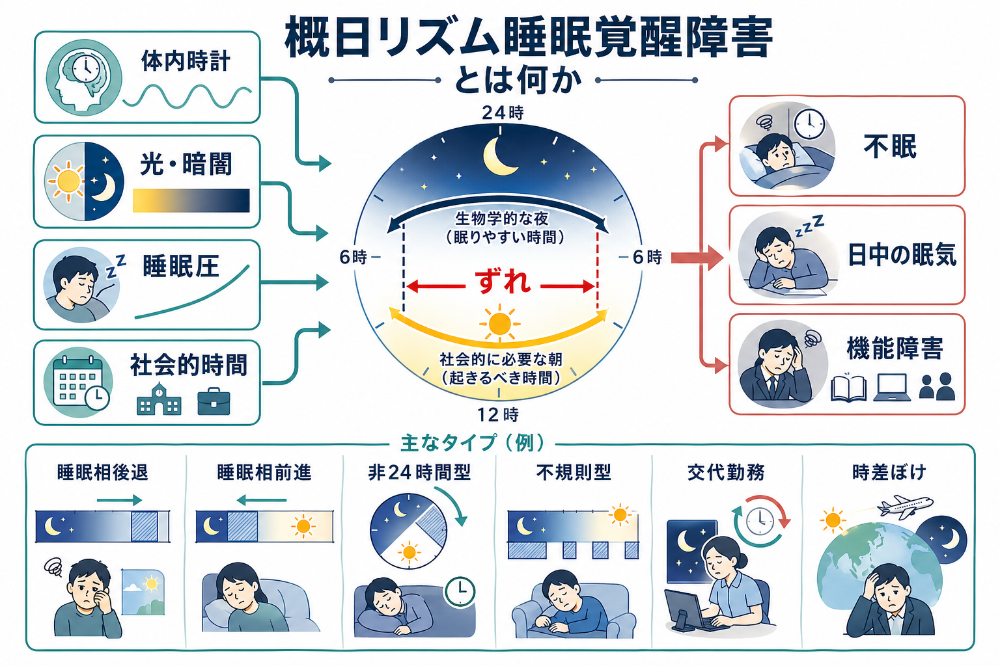
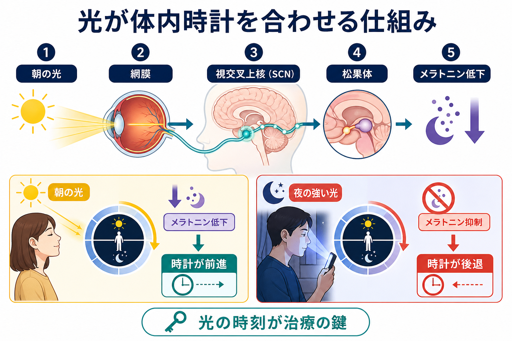
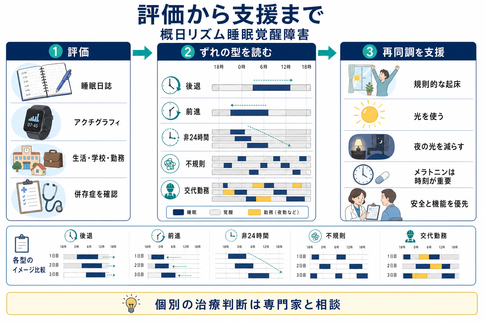

# 概日リズム睡眠覚醒障害とは何か

## 要点

- 概日リズム睡眠覚醒障害は、睡眠そのものの質だけでなく、「眠るべき時刻」と「体内時計が眠りやすくしている時刻」がずれることで生じる睡眠・覚醒の障害である[1][2]。
- 典型的には、不眠、起床困難、日中の眠気、疲労、学校・仕事・家庭生活の機能低下として現れる[1][2]。
- 中核には、視交叉上核（SCN）を中心とする概日時計、光による同調、メラトニン分泌、睡眠圧、社会的時間の相互作用がある[3][4]。
- 評価では、本人の訴えだけでなく、睡眠日誌、勤務・通学予定、休日の睡眠、アクチグラフィ、必要に応じたメラトニンリズムなどを合わせて見る[5][6]。
- 支援の基本は、睡眠薬で「眠らせる」ことではなく、光、暗さ、起床時刻、活動、食事、勤務・学校調整を使って、体内時計と生活時間を再同調させることである[3][6]。

## この記事で答える問い

1. 概日リズム睡眠覚醒障害は、通常の不眠や寝不足と何が違うのか。
2. なぜ光の時刻、夜のスマートフォン、交代勤務、時差移動が睡眠を崩すのか。
3. 睡眠相後退、睡眠相前進、非24時間型、不規則型、交代勤務型、時差ぼけ型はどう違うのか。
4. 臨床・研究では、どのような情報を集め、どのように支援方針を考えるのか。

## まず結論

概日リズム睡眠覚醒障害は、「眠れない病気」というより、「体が夜だと思っている時間」と「社会が起きることを求める時間」がかみ合わない病態である。たとえば睡眠相後退型では、本人の主観では夜遅くまで覚醒しているのが自然で、朝に起きることが非常に難しい。しかし、休日や長期休暇などで本人の自然な時刻に眠れると、睡眠の長さや質は比較的保たれることがある[2][7]。この点が、単純な入眠困難や睡眠不足と重要に異なる。

したがって、臨床的には「早く寝なさい」という助言だけでは不十分である。朝の光、夜の光、起床時刻、学校・勤務時刻、昼寝、カフェイン、身体活動、併存する[[うつ病とは何か]]や[[季節性うつ病とは何か]]、せん妄・認知症に近い睡眠覚醒の断片化などを含めて、生活全体の時間構造を見る必要がある[3][5][6]。

## 背景

ヒトの睡眠は、少なくとも二つの大きな力で調整されている。一つは、起きている時間が長くなるほど眠気が強まる「睡眠圧」である。もう一つは、約24時間周期で眠りやすさ・覚醒しやすさを変える「概日リズム」である[4]。睡眠圧だけを見れば、長く起きていれば眠れるはずだが、実際には夜勤明けの昼間や、時差ぼけの現地夜間では、眠いのに眠れない、眠ったのに回復しない、起きるべき時刻に強い眠気が残ることがある。これは概日時計の影響が重なるためである。

概日時計は、光、食事、運動、社会的接触、勤務・通学の時刻などの「時刻手がかり」によって毎日調整される。なかでも光は最も強い同調因子であり、網膜から視交叉上核へ伝わる光情報が、松果体のメラトニン分泌や体温リズムを含む全身の時間秩序に影響する[4]。朝の光は多くの場合、体内時計を早める方向に働き、夜の強い光は体内時計を遅らせる方向に働く。この性質のため、夜間の明るい照明や画面光は、入眠を遅らせるだけでなく、翌日の起床困難を強めることがある[3][4]。

ICD-11 では、概日リズム睡眠覚醒障害は睡眠覚醒障害の一群として位置づけられ、睡眠日誌と可能ならアクチグラフィを用いて、具体的な睡眠覚醒スケジュールの乱れを把握することが推奨されている[1]。つまり、診断の焦点は「何時間眠ったか」だけでなく、「どの時刻に眠り、どの時刻に起き、それが本人の生活要求とどれほどずれているか」にある。

## 基本概念

### 体内時計と社会的時間

体内時計は、個人の生物学的な夜と昼をつくる。一方、社会的時間は、学校、仕事、家庭役割、公共交通、医療・介護の予定などによって決まる。両者が近ければ、本人は自然な眠気に沿って眠り、比較的少ない努力で起きられる。両者が離れると、眠るべき時刻に眠気が来ない、起きるべき時刻が生物学的な夜に重なる、日中に強い眠気が残る、という問題が起こる。

この「ずれ」は、本人の怠惰や意志の弱さではない。もちろん生活習慣は影響するが、問題の中心は、睡眠圧、光環境、概日時計、社会的制約の組み合わせである。したがって、評価では本人を責めるよりも、「どの時刻に何が起きているか」を見える化することが重要になる。

### 主なタイプ

概日リズム睡眠覚醒障害には、いくつかの代表的な型がある[1][2][6]。

| 型 | 睡眠覚醒の特徴 | 臨床的に見える困りごと |
|---|---|---|
| 睡眠相後退型 | 主睡眠が望ましい時刻より遅い | 入眠困難、朝の起床困難、遅刻、日中の眠気 |
| 睡眠相前進型 | 主睡眠が望ましい時刻より早い | 夕方から眠い、早朝に目が覚める |
| 非24時間型 | 睡眠時刻が毎日少しずつずれる | 不眠と日中眠気が周期的に変動する |
| 不規則睡眠覚醒型 | まとまった主睡眠がなく、睡眠が24時間に散らばる | 夜間不眠、昼寝の増加、介護・生活リズムの困難 |
| 交代勤務型 | 勤務が通常の夜間睡眠と重なる | 夜勤中の眠気、昼間睡眠の短縮、事故リスク |
| 時差ぼけ型 | 時差移動後に内的時刻と現地時刻がずれる | 眠気、疲労、消化器症状、日中機能低下 |

睡眠相後退型は、特に思春期・若年成人で重要である。本人は「夜型」と表現されやすいが、学校や仕事の時刻に合わせようとすると慢性的な睡眠不足になり、集中困難、気分の不安定さ、欠席・遅刻につながることがある[2][7]。一方、睡眠相前進型は高齢者で問題になりやすく、[[うつ病とは何か]]における早朝覚醒と混同されることがある。

## 仕組み

### 視交叉上核と光同調

視交叉上核は、視床下部にある中枢時計である。網膜の光情報は視交叉上核に伝わり、そこから松果体を含む複数の経路を介して、メラトニン、体温、覚醒度、ホルモン分泌、末梢臓器のリズムを調整する[4]。暗くなるとメラトニンが上がり、体は夜の準備に入る。逆に、夜に強い光を浴びるとメラトニンが抑制され、体内時計が遅れる方向に働きやすい。

光の効果は「強さ」だけでなく「時刻」によって変わる。朝の光は多くの人で睡眠相を前進させ、夜の光は後退させる。このため治療・支援で光を使う場合、単に「明るくする」だけではなく、どの時刻に光を浴び、どの時刻に光を避けるかが重要になる[3][6]。

### 睡眠圧との相互作用

睡眠圧は、起きている時間に応じて増える。しかし、概日リズムが覚醒を強く支えている時刻には、睡眠圧があっても眠りにくい。逆に、生物学的な夜の後半に社会的起床時刻が来ると、睡眠圧は下がりきらず、概日リズムも覚醒を十分に支えないため、強い起床困難が生じる。

この相互作用を理解すると、睡眠相後退型の悪循環が見えやすい。朝に起きられないため登校・出勤が遅れ、昼まで眠る。すると朝の光を浴びる機会が減り、夜の覚醒がさらに強まる。夜に画面光を浴び、翌朝また起きられない。この循環が続くと、単なる「夜ふかし」から、機能障害を伴う睡眠覚醒障害へ移行しうる。

### 神経疾患・精神疾患との接点

不規則睡眠覚醒型は、認知症、脳損傷、発達上の困難、施設生活、日中活動の乏しさ、光曝露の少なさなどと関連しやすい[2][6]。[[せん妄とは何か]]でも睡眠覚醒リズムの破綻は重要であり、昼夜逆転や夜間不穏を単なる行動問題として扱うと、背景にある光環境、痛み、薬剤、感染、認知機能、介護環境を見落とすことがある。

また、うつ病や双極性障害では、睡眠・概日リズムの乱れが症状の一部にも誘因にもなりうる。季節性の気分変動では光環境が重要であり、[[季節性うつ病とは何か]]とも接続して理解できる。ここで重要なのは、概日リズムの乱れを「精神症状の結果」とだけ見ないことである。睡眠覚醒リズムは、気分、注意、意欲、身体活動、社会参加を支える基盤でもある。

## 図解

次の図は、評価から支援までの基本的な流れをまとめたものである。実際の臨床判断では、年齢、併存疾患、服薬、学校・勤務条件、事故リスク、家族・介護者の負担、本人の希望を組み合わせて考える。

## 臨床・研究との接続

### 評価

評価では、まず睡眠日誌を使って、就床時刻、入眠時刻、中途覚醒、起床時刻、昼寝、カフェイン、アルコール、勤務・通学、休日の睡眠を記録する。アクチグラフィは、腕時計型の機器などで活動量から睡眠覚醒パターンを推定し、数日から数週間の長期パターンを客観化する方法である。AASM のガイドラインは、概日リズム睡眠覚醒障害の評価においてアクチグラフィが有用になりうることを示している[5]。

ただし、アクチグラフィは「睡眠覚醒パターン」を見る道具であり、体内時計の位相そのものを直接測る道具ではない。研究や専門的評価では、薄暗い環境でのメラトニン分泌開始時刻、深部体温リズム、コルチゾールなどが参照されることがある[4][6]。臨床では、これらを常に測定するわけではないが、「行動上の睡眠時刻」と「生物学的な夜」が一致しているとは限らない、という理解が重要である。

### 支援

支援の中心は、再同調である。睡眠相後退型では、一定の起床時刻、朝の光、夜の強い光を減らすこと、就床前の刺激を減らすこと、必要に応じたメラトニン関連介入が検討される[3][6][7]。ただし、メラトニンは「眠剤」として単純に遅い時刻に飲むものではなく、体内時計への作用は投与時刻に強く依存する。したがって、個別の使用判断は専門家と相談すべきである[3]。

非24時間型では、全盲者で光情報が視交叉上核に届かないことが重要な機序になる。完全な光覚を欠く人では、内因性周期が24時間より長い場合、睡眠時刻が毎日遅れていくことがある。メラトニンやメラトニン受容体作動薬による同調が検討され、タシメルテオンの試験も報告されている[8]。ただし、薬物療法の適応、利用可能性、副作用、費用、併存疾患は国や個人によって異なるため、記事レベルで一般化しすぎないほうがよい。

交代勤務型では、個人の努力だけでなく、勤務設計、安全管理、仮眠、照明、通勤時の事故リスク、家庭生活への影響が問題になる。ここでは医学的支援と産業保健が接続する。単に「慣れればよい」と扱うと、慢性的睡眠不足、注意低下、事故、気分不調を見落とす。

## よくある誤解

### 「夜型の性格」にすぎない

夜型傾向は連続的な個人差として存在する。しかし、概日リズム睡眠覚醒障害と呼ぶには、本人の望む生活や社会的役割に対して、持続的な不眠・眠気・機能障害が生じていることが重要である[1][2]。性格評価ではなく、時間生物学と生活機能の問題として見る必要がある。

### 「眠れないなら睡眠薬でよい」

睡眠薬が必要な場面はありうるが、概日リズムのずれ自体を修正するとは限らない。夜の体内時計がまだ昼を示している時刻に無理に眠らせても、翌朝の起床困難やリズムの遅れが残ることがある。光、暗さ、時刻、活動、社会的調整を含めた方針が重要である[3][6]。

### 「休日に寝だめすれば回復する」

休日の長い睡眠は、平日の睡眠不足を一時的に補うことがある。しかし、休日に昼まで眠ると、朝の光を逃し、体内時計がさらに遅れる場合がある。月曜朝の起床困難は、単なる怠けではなく、平日と休日の時刻差がつくる「社会的時差ぼけ」として理解できる。

### 「朝の光は誰にでも同じように効く」

光の効果は、浴びる時刻、強さ、持続時間、個人の概日位相、年齢、眼疾患、気分症状、服薬などで変わる。とくに双極性障害など光や睡眠変化に敏感な状態では、過度な光曝露や睡眠短縮が気分変動と関係する可能性もあるため、一般論を個別治療指示として使うべきではない。

## 関連ノート

- [[うつ病とは何か]]
- [[季節性うつ病とは何か]]
- [[せん妄とは何か]]
- [[HPA軸は精神疾患にどう関わるのか]]
- [[精神状態診察MSEとは何か]]

MOC更新候補:

- `content/00_MOC/` 配下の精神医学・睡眠医学・神経科学関連 MOC に本記事を追加する。
- 「睡眠」「体内時計」「メラトニン」「光療法」「交代勤務」「時差ぼけ」に関する未作成ノートを、今後の作成候補として整理する。

## 理解チェック

1. 概日リズム睡眠覚醒障害では、睡眠時間だけでなく何の「ずれ」を見る必要があるか。
2. 睡眠相後退型が、単なる入眠困難と異なる点は何か。
3. 朝の光と夜の強い光は、体内時計にどのように異なる影響を与えうるか。
4. アクチグラフィで分かることと、分からないことは何か。
5. 交代勤務型を個人の生活習慣だけの問題として扱うと、何を見落とすか。

## 未解決問題

- 個人ごとの光感受性、遺伝的クロノタイプ、精神疾患併存を踏まえた最適な介入時刻の推定は、まだ研究上の課題が多い。
- メラトニン関連介入、光療法、認知行動療法、学校・勤務調整をどの順序で組み合わせるべきかは、年齢層と病型によって検討が必要である。
- スマートフォン、LED照明、リモートワーク、夜型社会が長期的に概日リズム障害をどう変えるかは、今後も重要な公衆衛生上の課題である。

## 参考文献

[1] World Health Organization. *ICD-11: Circadian rhythm sleep-wake disorders*. https://icd.who.int/browse/2025-01/mms/en#1359329403

[2] American Academy of Sleep Medicine. *Sleep Education: Delayed Sleep-Wake Phase*. Reviewed 2020. https://sleepeducation.org/sleep-disorders/delayed-sleep-wake-phase/

[3] Auger RR, Burgess HJ, Emens JS, Deriy LV, Thomas SM, Sharkey KM. Clinical Practice Guideline for the Treatment of Intrinsic Circadian Rhythm Sleep-Wake Disorders: An Update for 2015. *Journal of Clinical Sleep Medicine*. 2015;11(10):1199-1236. https://doi.org/10.5664/jcsm.5100

[4] Reddy S, Reddy V, Sharma S. *Physiology, Circadian Rhythm*. StatPearls. Updated 2023. https://www.ncbi.nlm.nih.gov/books/NBK519507/

[5] Smith MT, McCrae CS, Cheung J, et al. Use of Actigraphy for the Evaluation of Sleep Disorders and Circadian Rhythm Sleep-Wake Disorders: An American Academy of Sleep Medicine Clinical Practice Guideline. *Journal of Clinical Sleep Medicine*. 2018;14(7):1231-1237. https://doi.org/10.5664/jcsm.7228

[6] Steele TA, St Louis EK, Videnovic A, Auger RR. Circadian Rhythm Sleep-Wake Disorders: a Contemporary Review of Neurobiology, Treatment, and Dysregulation in Neurodegenerative Disease. *Neurotherapeutics*. 2021;18(1):53-74. https://doi.org/10.1007/s13311-021-01031-8

[7] Nesbitt AD. Delayed sleep-wake phase disorder. *Journal of Thoracic Disease*. 2018;10(Suppl 1):S103-S111. https://doi.org/10.21037/jtd.2018.01.11

[8] Quera Salva MA, Hartley S, Léger D, Dauvilliers Y. Non-24-Hour Sleep-Wake Rhythm Disorder in the Totally Blind: Diagnosis and Management. *Frontiers in Neurology*. 2017;8:686. https://doi.org/10.3389/fneur.2017.00686
