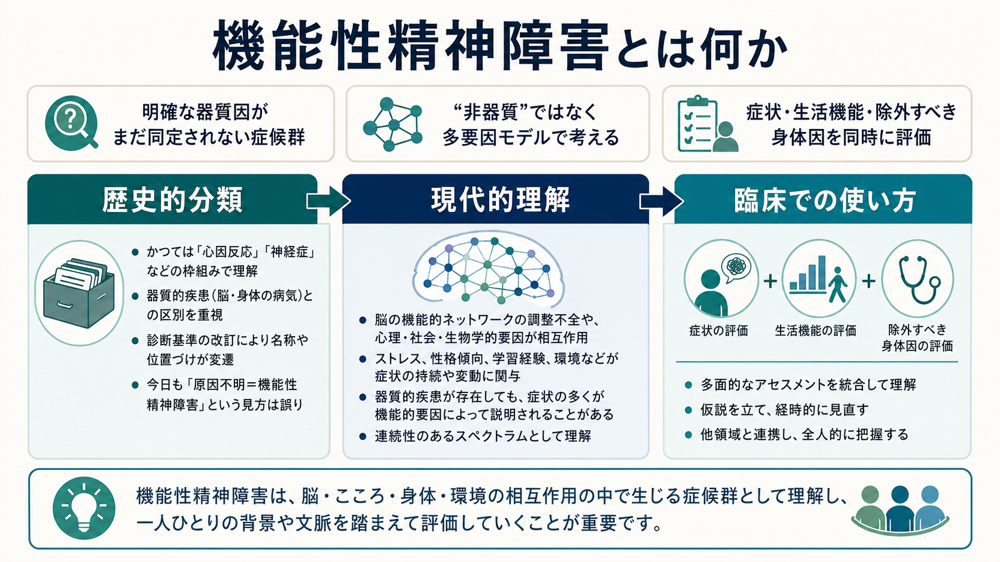
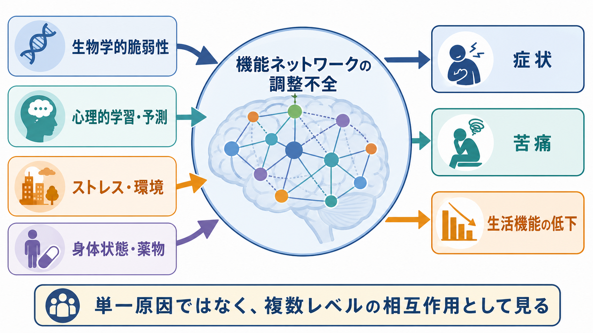
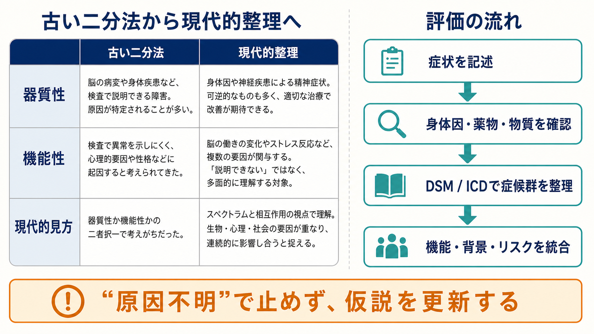

# 機能性精神障害とは何か

## 要点

- **機能性精神障害**とは、歴史的には「明確な脳病変・身体疾患・物質作用などの器質因で十分に説明できない精神障害」を指す便宜的な分類語である。
- ただし現代の精神医学では、「機能性 = 心の問題だけ」「器質性 = 本物の病気」という二分法は維持しにくい。
- [[統合失調症とは何か]]、[[双極性障害とは何か]]、[[大うつ病性障害とは何か]]、[[不安症群とは何か]]などは、しばしば機能性精神障害の代表例として扱われてきたが、いずれも生物・心理・社会的要因が複雑に関わる。
- 臨床では、機能性という語を診断名の代わりに使うよりも、症候群、除外すべき身体因、生活機能、リスク、時間経過を明示して考える方が安全である。

## この記事で答える問い

この記事では、「機能性精神障害」という古典的な分類語を、現代の診断分類・脳科学・臨床実践の観点から読み替える。中心となる問いは次の 4 つである。

1. 「機能性」と「器質性」は、もともと何を区別しようとしていたのか。
2. なぜこの二分法は現代では不十分なのか。
3. それでも臨床でこの語が残るとすれば、どのように注意して使うべきか。
4. 研究では、機能性精神障害をどのような多層モデルとして扱えるのか。

## まず結論

機能性精神障害は、厳密な自然分類というより、**「現時点で同定できる器質因だけでは説明しきれない精神症候群をどう扱うか」という臨床上の整理概念**である。古くは、脳腫瘍、てんかん、感染、内分泌疾患、薬物・物質などによる精神症状を「器質性」とし、それ以外の精神病、気分障害、不安症などを「機能性」と呼ぶ使い方があった。

しかし、現代の [[DSMとICDは何が違うのか|DSM / ICD]] は、精神障害を単に「器質性か機能性か」で分類しているわけではない。DSM-5-TR の精神障害概念は、認知・情動調節・行動の臨床的に重要な障害が、心理学的・生物学的・発達的過程の機能不全を反映するという定義に近い[1]。ICD-11 CDDR も、世界中の臨床で精神・行動・神経発達障害を同定するための記述的診断要件として整備されている[2]。

したがって、現代的には「機能性精神障害」を、**検査で何も見つからないから軽い、想像上の、本人の意思で起きている状態**と読むべきではない。むしろ、症状が実在し、苦痛や生活機能の低下を伴い、複数レベルの要因が相互作用する状態として理解する必要がある[3][4]。

## 背景

### 古典的な器質性／機能性の区別

器質性／機能性の区別は、症状・徴候・症候群を「診断可能な生物学的変化で説明できるもの」と「それでは説明できないもの」に分けようとする発想である[3]。精神医学では、せん妄、認知症、脳損傷、内分泌疾患、薬剤、物質などに伴う精神症状を器質性の側に置き、統合失調症や気分障害などを機能性の側に置く語法が広く使われてきた。

この区別には実用的な意義もあった。たとえば、急性発症の意識障害、認知変動、神経徴候、薬物使用、身体疾患の増悪があれば、[[せん妄と認知症はどう違うのか|せん妄]]、[[自己免疫性脳炎に伴う精神症状とは何か|自己免疫性脳炎]]、[[物質誘発性精神病とは何か|物質誘発性精神病]]などを検討する必要がある。こうした身体因の見落としを避けるための警戒語として、「器質性を除外する」という言い方は今も臨床的に意味を持つ。

### しかし、二分法は粗すぎる

問題は、この区別がしばしば「器質性なら身体、機能性なら心」という単純な二分法に変わってしまう点である。Bell らは、機能性／器質性の語が文脈によって異なる意味で使われ、疾患をゼロサム的に「どちらか一方の原因」に振り分ける発想を促しやすいと論じている[3]。Kendler も、精神疾患の原因を有機的ハードウェアか機能的ソフトウェアかに分ける二分法を批判し、遺伝、神経、発達、心理、社会文化的要因が斑状に関与する経験的多元主義を提案している[5]。

この批判は、機能性精神障害を「器質因がない疾患」として固定するのではなく、**今ある検査・分類・知識では単一の明確な器質因に還元できない症候群**として扱う必要を示している。

## 基本概念

### 「機能性」は診断名ではなく、説明水準の語である

機能性精神障害という語は、DSM-5-TR や ICD-11 の標準診断名そのものではない。むしろ、精神症状を説明する際に、構造病変・感染・腫瘍・代謝異常・薬物作用などの特定可能な身体因で十分に説明できるか、それとも神経機能、認知、情動、学習、発達、対人環境などの相互作用として理解する必要があるかを示す説明水準の語である。

たとえば、幻覚妄想状態は [[統合失調症とは何か|統合失調症]] でも、[[双極I型障害とは何か|双極I型障害]] の躁病でも、[[薬剤性精神病とは何か|薬剤性精神病]] でも、[[抗NMDA受容体脳炎とは何か|抗NMDA受容体脳炎]] でも生じうる。症状だけを見て「機能性」と決めるのではなく、発症様式、意識・認知、神経症状、身体所見、薬剤・物質、年齢、経過を合わせて評価する。

### 「原因不明」と同義ではない

機能性という語は、ときに「原因不明」と混同される。しかし現代的には、機能性とは「原因がない」ではなく、**原因を単一の病変に還元しにくい**という意味に近い。神経回路の可塑性、予測処理、ストレス反応、睡眠、炎症、ホルモン、薬物、発達歴、学習、対人文脈などが、症状の出現や持続に寄与しうる。

これは、[[身体症状症は脳の予測処理で説明できるのか|身体症状症の予測処理モデル]] や [[脳ネットワークの破綻は精神疾患をどう説明するのか|脳ネットワークモデル]] とも接続する。精神症状は「脳だけ」でも「心理だけ」でもなく、身体・脳・環境・意味づけの循環の中で変化する。

## 仕組み

### 多層の相互作用として考える

機能性精神障害を現代的に理解するなら、少なくとも次の層を分けて考えるとよい。

| 層 | 見るもの | 例 |
|---|---|---|
| 生物学的層 | 遺伝、神経発達、神経伝達、炎症、内分泌、睡眠、薬物 | 気分調節の脆弱性、ストレス反応、物質使用 |
| 認知・情動層 | 注意、予測、記憶、脅威評価、報酬学習 | 不安、抑うつ、幻覚妄想の意味づけ |
| 行動層 | 回避、活動低下、睡眠覚醒、対人行動 | 不登校、引きこもり、受診行動 |
| 社会文脈層 | 家族、学校、職場、文化、スティグマ、制度 | 支援資源、孤立、診断名の受け止め |
| 臨床安全層 | 除外すべき身体疾患、急性リスク、薬剤・物質 | せん妄、自殺リスク、悪性症候群 |

この見方では、機能性精神障害は「器質因がない箱」ではなく、複数レベルの情報を統合して、現在もっとも妥当な臨床仮説を置くための作業概念になる。

### 研究分類との接続

研究では、診断名を越えて症状や機能を次元的に扱う枠組みが重要になっている。NIMH の RDoC は、DSM や ICD を置き換える診断マニュアルではなく、観察可能な行動と神経生物学的測定を組み合わせて精神病理を研究する枠組みである[6]。RDoC は、遺伝子、分子、細胞、回路、生理、行動、自己報告など複数の分析単位を接続し、診断横断的な機能次元を扱う[6]。

この方向性は、機能性精神障害を「非器質性」と呼んで終わるのではなく、恐怖、報酬、認知制御、社会過程、覚醒・睡眠、感覚運動などの機能システムの変調として研究する発想に近い。関連して、[[RDoCは精神疾患研究をどう変えたのか]] も参照できる。

## 図解

### 古い二分法から現代的整理へ

| 観点 | 古い二分法 | 現代的整理 |
|---|---|---|
| 器質性 | 脳病変や身体疾患がある | 身体因・神経疾患・薬物・物質を具体的に同定する |
| 機能性 | 検査で異常がない、心理的とみなす | 多層の機能変化として仮説化する |
| 診断 | 器質性か機能性かを分ける | DSM / ICD の症候群、身体因、リスク、生活機能を統合する |
| 臨床姿勢 | 原因不明なら説明が止まる | 仮説を置き、経過と追加情報で更新する |

## 臨床・研究との接続

### 臨床では「除外」と「説明」を分ける

臨床で重要なのは、「身体因を確認すること」と「患者の症状をどう説明するか」を混同しないことである。身体疾患、薬剤、物質、神経疾患を確認する作業は必要だが、検査で明確な器質因が見つからないことだけで、症状の実在性や苦痛を低く見積もってはいけない。

機能性神経症状症の領域では、近年、診断は単なる除外診断ではなく、陽性徴候に基づく rule-in 診断として理解されるようになっている[7]。また、機能性神経症状は詐病や意図的な偽装とは異なることが強調されている[8]。精神医学全般でも同じく、「機能性」という語を使う場合は、本人の責任や意思で症状が生じているという含意を避ける必要がある。

### 記述的診断と個別化された定式化を併用する

DSM / ICD は共通言語として有用だが、診断名だけでは原因、予後、治療反応、支援ニーズを十分に説明できない。たとえば [[大うつ病性障害とは何か|大うつ病性障害]] という診断名の中にも、メランコリー、季節性、身体疾患、薬剤、喪失、発達特性、慢性ストレスなど多様な背景がありうる。

そのため、実践では次の 2 段階が必要になる。

1. **記述的診断**: DSM / ICD に沿って、現在の症候群を整理する。
2. **臨床的定式化**: 発症要因、持続要因、防御因子、生活機能、リスク、本人の意味づけを統合する。

機能性精神障害という語は、この 2 段階のうち後者を促すために使うなら有益だが、診断名の曖昧な置き換えとして使うと、かえって見落としやスティグマを生みやすい。

## よくある誤解

### 誤解 1: 機能性は「本当の病気ではない」という意味である

これは誤りである。機能性という語は、症状が虚偽であることを意味しない。苦痛、障害、生活機能の低下があれば、臨床的に重要な問題として扱う必要がある。FND の議論でも、機能性症状と詐病・偽装は区別される[8]。

### 誤解 2: 器質性が見つかれば機能性要因は関係なくなる

これも誤りである。身体疾患や脳疾患があっても、症状の程度、回復、生活機能、受療行動には、睡眠、ストレス、学習、注意、対人関係、社会資源が関わる。逆に、機能性と呼ばれてきた精神障害にも、生物学的脆弱性や神経回路の変化が関わりうる。

### 誤解 3: 機能性精神障害は検査で何も出ない障害である

「現時点の通常検査で特定の器質因が確認できない」ことと、「研究上の生物学的差異がない」ことは同じではない。精神疾患研究では、バイオマーカー、神経画像、計算論的モデル、縦断データを用いて、診断横断的な機能変化を調べる方向が進んでいる[6]。

### 誤解 4: 機能性という語を使えば鑑別診断は終わる

むしろ逆である。機能性という語を使う場合ほど、急性の身体因、薬剤・物質、意識障害、神経徴候、認知変動、年齢不相応な発症、急速な悪化、自殺・他害リスクを確認する必要がある。特に [[器質性精神病とは何か]]、[[中毒性精神障害とは何か]]、[[身体疾患による気分障害とは何か]] との鑑別は重要である。

## 関連ノート

- [[DSMとICDは何が違うのか]]
- [[器質性精神病とは何か]]
- [[中毒性精神障害とは何か]]
- [[物質誘発性精神病とは何か]]
- [[身体疾患による気分障害とは何か]]
- [[神経認知障害群とは何か]]
- [[せん妄と認知症はどう違うのか]]
- [[身体症状症とは何か]]
- [[変換症とは何か]]
- [[RDoCは精神疾患研究をどう変えたのか]]
- [[脳ネットワークの破綻は精神疾患をどう説明するのか]]

## MOC更新候補

- `content/00_MOC/` 配下の精神医学・診断分類・精神病理関連 MOC に追加候補。
- 並列ジョブとの衝突を避けるため、本記事では MOC 本体は更新していない。

## 理解チェック

1. 機能性精神障害を「非器質性だから心因性」と言い切ると、どのような問題が起こるか。
2. 器質性／機能性の二分法が、身体因の見落とし防止に役立つ場面はどこか。
3. DSM / ICD の記述的診断と、個別化された臨床的定式化はどう違うか。
4. RDoC のような診断横断的研究枠組みは、機能性精神障害の理解をどう変えるか。

## 未解決問題

- 機能性／器質性という語を、臨床コミュニケーションでどこまで残すべきか。
- 患者にスティグマを与えず、かつ身体因の確認を怠らない説明語彙をどう設計するか。
- 診断横断的な神経・計算論的指標が、実際の臨床判断にどの程度役立つか。
- 精神障害の多要因モデルを、診断、支援、予後予測にどう接続するか。

## 参考文献

[1] Petretto, D. R., & Masala, C. (2025). Definitions of “Mental Disorder” from DSM-III to DSM-5. *Behavioral Sciences*, 15(6), 830. https://doi.org/10.3390/bs15060830

[2] World Health Organization. (2024). *Clinical descriptions and diagnostic requirements for ICD-11 mental, behavioural and neurodevelopmental disorders*. World Health Organization. https://www.who.int/publications/i/item/9789240077263

[3] Bell, V., Wilkinson, S., Greco, M., Hendrie, C., Mills, B., & Deeley, Q. (2020). What is the functional/organic distinction actually doing in psychiatry and neurology? *Wellcome Open Research*, 5, 138. https://doi.org/10.12688/wellcomeopenres.16022.1

[4] Chesterfield, A., Greco, M., Mills, B., Wilkinson, S., Hendrie, C., Deeley, Q., & Bell, V. (2024). The meaning and role of the functional-organic distinction: a study of clinicians in psychiatry and neurology services. *Medical Humanities*, 50(1), 170-178. https://doi.org/10.1136/medhum-2023-012667

[5] Kendler, K. S. (2012). The dappled nature of causes of psychiatric illness: replacing the organic-functional/hardware-software dichotomy with empirically based pluralism. *Molecular Psychiatry*, 17, 377-388. https://doi.org/10.1038/mp.2011.182

[6] National Institute of Mental Health. (n.d.). Research Domain Criteria (RDoC). https://www.nimh.nih.gov/research/research-funded-by-nimh/rdoc

[7] Aybek, S., & Perez, D. L. (2022). Diagnosis and management of functional neurological disorder. *BMJ*, 376, o64. https://doi.org/10.1136/bmj.o64

[8] Edwards, M. J., Yogarajah, M., & Stone, J. (2023). Why functional neurological disorder is not feigning or malingering. *Nature Reviews Neurology*, 19, 246-256. https://doi.org/10.1038/s41582-022-00765-z
