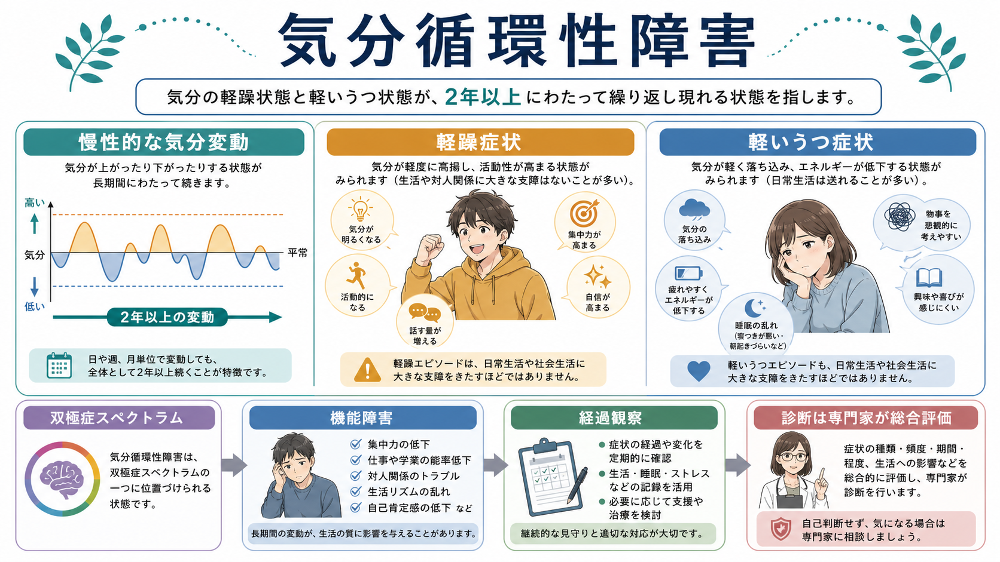
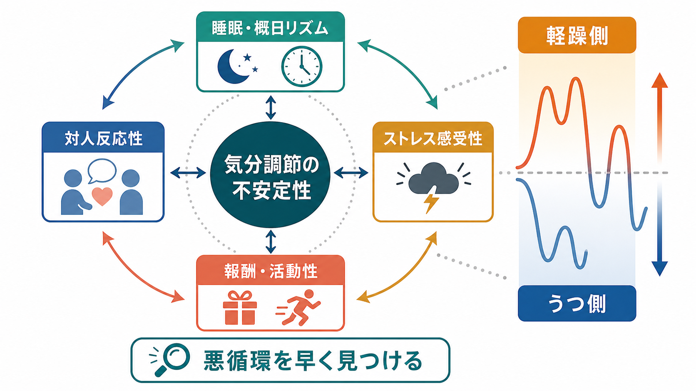
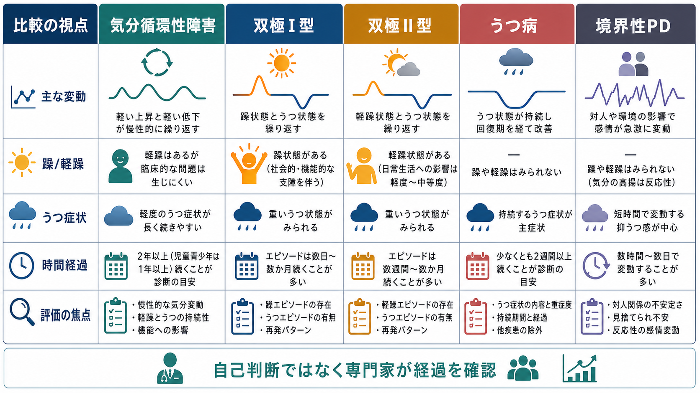

# 気分循環性障害とは何か

## 要点

- 気分循環性障害は、軽躁症状と軽いうつ症状が、どちらも完全な軽躁エピソード・大うつ病エピソードの診断閾値には届かないまま、長期に反復する[[双極性障害とは何か|双極スペクトラム]]の病態である[1][2]。
- DSM-5-TR に基づく説明では、成人では少なくとも2年以上、症状が期間の半分以上に存在し、症状のない期間が2か月を超えないことが中核になる[1][3]。
- 「症状が軽い」という意味ではなく、気分・睡眠・活動性・対人反応性が慢性的に揺れるため、学業、仕事、対人関係、物質使用、自傷・自殺リスクに影響することがある[3][4]。
- 鑑別では、[[双極II型障害とは何か]]、[[うつ病とは何か]]、[[持続性抑うつ障害とは何か]]、[[気分不安定性とは何か]]、[[統合失調型パーソナリティ障害とは何か|パーソナリティ障害]]、ADHD、物質・身体疾患による気分変化を、時間経過と機能障害から評価する[3][6]。
- 治療・支援は、心理教育、気分と睡眠の記録、生活リズムの安定化、対人ストレスの扱い、必要時の専門的薬物療法を組み合わせる。この記事は教育・研究目的の整理であり、個別診断や治療指示ではない[5][6]。

## この記事で答える問い

1. 気分循環性障害は、普通の気分の波や[[抑うつ気分とは何か|抑うつ気分]]と何が違うのか。
2. なぜ「軽躁」と「軽いうつ」が慢性的に反復すると臨床的に重要なのか。
3. [[双極I型障害とは何か]]、[[双極II型障害とは何か]]、うつ病、パーソナリティ障害とどう区別するのか。
4. 研究と臨床では、どのように評価し、どのような限界を意識すべきか。

## まず結論

気分循環性障害は、「気分屋」や「性格の問題」というより、長い時間軸で見た気分調節の不安定性として理解すると分かりやすい。上がる側では、活動性、話しやすさ、自信、睡眠欲求の低下、衝動性が目立つことがある。下がる側では、疲労感、興味の低下、自己評価の低下、眠りの乱れ、引きこもりが目立つことがある。しかし、どちらも典型的な躁病・軽躁エピソードや大うつ病エピソードの基準を満たすほど明確ではない[1][3]。

重要なのは、単発の「調子のよい日」「落ち込む日」ではなく、数年単位で反復し、生活機能や対人関係に累積的な影響を与える点である。したがって評価では、診察時の一点だけでなく、[[精神科診察で睡眠をどう評価するか|睡眠]]、活動量、対人トラブル、浪費、物質使用、希死念慮、家族歴、薬剤・身体疾患を時系列で確認する必要がある[3][6]。

## 背景

気分循環性障害は DSM では双極および関連障害群に含まれ、ICD-11 でも気分障害の中の Cyclothymic disorder として位置づけられる[1][2]。歴史的には、診断カテゴリとしての気分循環性障害、気分循環気質、情動反応性の高いパーソナリティ特性が重なって論じられてきた。そのため、研究でも臨床でも「どこまでを疾患として扱うか」が難しい[4][7]。

レビュー研究は、気分循環性障害が臨床では見逃されやすく、研究対象としても双極I型・II型障害ほど十分に扱われてこなかったことを指摘している[4]。一方で、閾値未満の双極症状は若年者にもみられ、寛解、持続、双極性障害への移行など複数の経過をとりうるため、単純に「軽い病態」として片づけることはできない[4]。

## 基本概念

### 診断上の中核

気分循環性障害では、多数の軽躁症状の時期と、多数の抑うつ症状の時期がある。ただし、軽躁症状は軽躁エピソードの完全な基準を満たさず、抑うつ症状も大うつ病エピソードの完全な基準を満たさない[1][3]。成人では2年以上、児童・青年では1年以上の持続が目安になる[1]。

もう一つの要点は、症状の「量」だけでなく「経過」である。症状は期間の半分以上に存在し、症状のない期間が長く続きすぎない。つまり、診察室で一度「軽い」と見えたとしても、長期の日誌や家族・周囲からの情報では、睡眠、活動、対人関係、学校・仕事の安定性に反復的な乱れが見えることがある[1][6]。

### 普通の気分変動との違い

誰にでも気分の波はある。気分循環性障害で問題になるのは、波が慢性的で、本人の価値観や生活設計と衝突し、機能障害を生むことである。上がる時期には「よく働ける」「話が進む」と感じられる一方、予定を詰め込みすぎる、睡眠を削る、対人距離が近くなる、浪費やリスク行動が増えることがある。下がる時期には、その反動として疲労、自己否定、回避、関係の断絶が起こりやすい[3][5]。

したがって、評価の焦点は「今日はうつか軽躁か」だけではない。気分・睡眠・活動・対人反応がどの周期で変わり、その変化がどの程度、生活上の損失や危険につながっているかを見る。

## 仕組み

気分循環性障害の仕組みは、単一の脳部位や神経伝達物質で説明できるほど単純ではない。現在は、双極スペクトラム全体に関わる遺伝的脆弱性、情動調節ネットワーク、報酬感受性、睡眠・概日リズム、ストレス反応、環境要因が重なって、気分の上昇側と低下側の揺れを強めると考えるのが妥当である[3][8]。

この見方では、気分の波は「原因」ではなく、複数の調節系がずれた結果として現れる。睡眠が短くなると活動性が上がり、活動性が上がると予定や対人刺激が増え、刺激が増えるとさらに眠れなくなる。反対に、疲労や対人失敗が続くと活動が減り、報酬経験が減り、自己評価が下がり、抑うつ側へ傾く。このようなフィードバックが、軽躁側とうつ側を行き来する揺れとして見える。

## 図解

1枚目の図は、気分循環性障害を「2年以上続く慢性的な気分変動」「軽躁症状」「軽いうつ症状」「生活機能への影響」という軸で整理している。ポイントは、軽躁・うつの症状が診断閾値未満でも、長期に反復すれば臨床的な意味をもつことである。

2枚目の図は、睡眠・概日リズム、報酬・活動性、ストレス感受性、対人反応性が相互に影響し、気分調節の不安定性を強めるモデルを示している。これは確定した単一メカニズムではなく、臨床的に経過を観察するための作業モデルである。

3枚目の図は、関連疾患との比較である。実際の診断では、表だけで機械的に決めるのではなく、発症時期、持続期間、エピソード性、機能障害、家族歴、物質・身体疾患の影響、本人と周囲の観察を統合する[6]。

## 臨床・研究との接続

### 評価

評価では、[[MSEで気分と感情をどう区別するか|精神状態診察]]だけでなく、縦断的な情報を集める。具体的には、気分、睡眠時間、起床時刻、活動量、対人イベント、飲酒・薬物、月経周期、服薬、仕事や学業の変化を記録する。NICE の双極性障害ガイドラインも、疑い例では過活動・脱抑制の既往、家族歴、生活機能、併存症、物質使用、身体疾患を含めた包括的評価を推奨している[6]。

また、抑うつを主訴に受診した人では、過去の活動性上昇や睡眠欲求低下が見逃されやすい。[[精神科診断面接で尺度をどう使うか|尺度]]や質問票は補助にはなるが、診断そのものを置き換えるものではない。本人が「元気だっただけ」と捉える時期も、周囲から見ると過活動、浪費、怒りっぽさ、リスク行動として見えていることがある。

### 鑑別

[[双極II型障害とは何か]]との違いは、明確な軽躁エピソードと大うつ病エピソードがあるかどうかである。うつ病との違いは、上がる側の症状が反復しているかどうかである。[[持続性抑うつ障害とは何か]]とは、慢性的な抑うつが中心か、上がる側と下がる側の両方が反復するかで区別する。パーソナリティ障害とは、対人関係に反応した急激な感情変動だけでなく、睡眠・活動・気分の周期性があるかを見る[3][4]。

さらに、甲状腺機能異常、神経疾患、ステロイドなどの薬剤、アルコールや刺激薬などの物質、ADHD、適応障害、複雑なトラウマ反応も検討する必要がある[3][6]。[[精神科診断における除外診断とは何か|除外診断]]は、気分循環性障害を否定するためだけでなく、支援の標的を誤らないために行う。

### 支援と治療

支援の第一歩は、本人と周囲が気分の波を道徳的欠点ではなく、観察可能なパターンとして共有することである。心理教育、睡眠・活動リズムの安定化、ストレスサインの早期発見、対人関係の調整、危機時の連絡計画は、日常生活に接続しやすい[5][6]。

薬物療法については、気分安定薬などが検討されることがあるが、気分循環性障害のみを対象にした大規模で確立的なエビデンスは限られる[5]。また、抗うつ薬は双極スペクトラムでは気分の切り替わりや急速交代を悪化させうるため、専門的評価なしに単純なうつ病として扱うことには注意が必要である[1][5]。

### 研究上の論点

研究上は、診断カテゴリとしての気分循環性障害と、気分循環気質・情動不安定性をどう分けるかが大きな論点である[4][7]。また、若年期の閾値未満症状が、どの人で寛解し、どの人で双極I型・II型障害へ進展し、どの人で対人機能や物質使用の問題として持続するのかは、まだ十分に確立していない[4]。

## よくある誤解

### 「軽いから放っておいてよい」

軽躁症状や抑うつ症状が診断閾値未満でも、慢性的に続くと生活機能への影響は大きくなりうる。とくに睡眠不足、浪費、対人衝突、物質使用、[[希死念慮とは何か|希死念慮]]がある場合は、早めの専門的評価が重要である。

### 「性格の問題であって疾患ではない」

気質やパーソナリティ特性と重なる部分はある。しかし、診断で見るのは性格の良し悪しではなく、気分・活動性・睡眠・機能障害の長期経過である。性格という言葉だけで片づけると、睡眠調整、心理教育、家族支援、危機対応などの介入可能な要素が見えにくくなる。

### 「躁状態がないなら双極スペクトラムとは関係ない」

気分循環性障害では、完全な躁エピソードはない。しかし、軽躁症状とうつ症状の慢性的反復という点で、DSM でも双極および関連障害群に位置づけられる[1]。抑うつ症状だけを見て単極性うつ病として扱うと、上がる側の症状や治療リスクを見落とすことがある。

## 関連ノート

- [[双極性障害とは何か]]
- [[双極I型障害とは何か]]
- [[双極II型障害とは何か]]
- [[うつ病とは何か]]
- [[持続性抑うつ障害とは何か]]
- [[気分不安定性とは何か]]
- [[気分とは何か]]
- [[抑うつ気分とは何か]]
- [[睡眠障害とは何か]]
- [[精神科診断面接で尺度をどう使うか]]
- [[精神科診断における除外診断とは何か]]
- [[気分障害における自殺リスクとは何か]]

## 理解チェック

1. 気分循環性障害で「症状が軽い」ことと「影響が小さい」ことは、なぜ同じではないのか。
2. うつ病として受診した人に、過去の過活動や睡眠欲求低下を確認する理由は何か。
3. 双極II型障害、持続性抑うつ障害、パーソナリティ障害と鑑別するとき、横断面の症状だけでなく時間経過を見る必要があるのはなぜか。
4. 気分日誌や睡眠記録は、診断の代替ではなく、どのような意味で臨床評価を助けるのか。

## 関連ノート候補・MOC更新候補

- MOC更新候補: `content/00_MOC/` 配下の精神医学・気分障害・双極スペクトラム関連MOCに、本記事へのリンクを追加する。
- 今後の作成候補: `気分循環気質とは何か`、`双極スペクトラムとは何か`、`軽躁症状とは何か`、`気分日誌を臨床でどう使うか`。

## 未解決問題

- 気分循環性障害と気分循環気質を、臨床的有用性を保ちながらどこで区別するべきか。
- 若年期の閾値未満双極症状から、寛解、持続、双極I型・II型障害への移行を予測する因子は何か。
- 睡眠・概日リズム、報酬感受性、対人ストレスへの介入を、どの患者にどの順序で組み合わせると最も有効か。

## 参考文献

[1] MSD Manual Professional Edition. Cyclothymic Disorder. Reviewed/Revised Oct 2023, Modified Jul 2025. https://www.msdmanuals.com/professional/psychiatric-disorders/mood-disorders/cyclothymic-disorder

[2] World Health Organization. ICD-11 for Mortality and Morbidity Statistics, Cyclothymic disorder, code 6A62. https://icd.who.int/browse/2025-01/mms/en#1427638883

[3] Bielecki, J. E., & Gupta, V. (2023). Cyclothymic Disorder. *StatPearls*. NCBI Bookshelf. https://www.ncbi.nlm.nih.gov/books/NBK557877/

[4] Van Meter, A. R., Youngstrom, E. A., & Findling, R. L. (2012). Cyclothymic disorder: A critical review. *Clinical Psychology Review, 32*(4), 229-243. https://doi.org/10.1016/j.cpr.2012.02.001

[5] Perugi, G., Hantouche, E., & Vannucchi, G. (2017). Diagnosis and treatment of cyclothymia: The "primacy" of temperament. *Current Neuropharmacology, 15*(3), 372-379. https://doi.org/10.2174/1570159X14666160616120157

[6] National Institute for Health and Care Excellence. (2025). *Bipolar disorder: assessment and management* (NICE Clinical Guideline CG185). https://www.nice.org.uk/guidance/cg185/

[7] Perugi, G., Hantouche, E., Vannucchi, G., & Pinto, O. (2015). Cyclothymia reloaded: A reappraisal of the most misconceived affective disorder. *Journal of Affective Disorders, 183*, 119-133. https://doi.org/10.1016/j.jad.2015.05.004

[8] Scaini, G., Valvassori, S. S., Diaz, A. P., et al. (2020). Neurobiology of bipolar disorders: A review of genetic components, signaling pathways, biochemical changes, and neuroimaging findings. *Brazilian Journal of Psychiatry, 42*(5), 536-551. https://doi.org/10.1590/1516-4446-2019-0732
