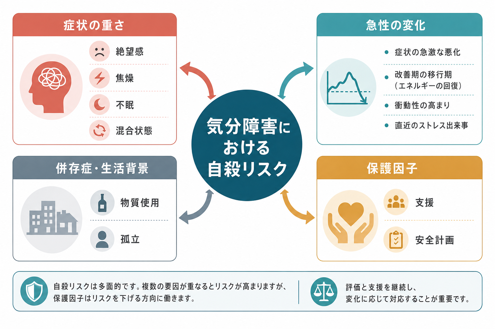
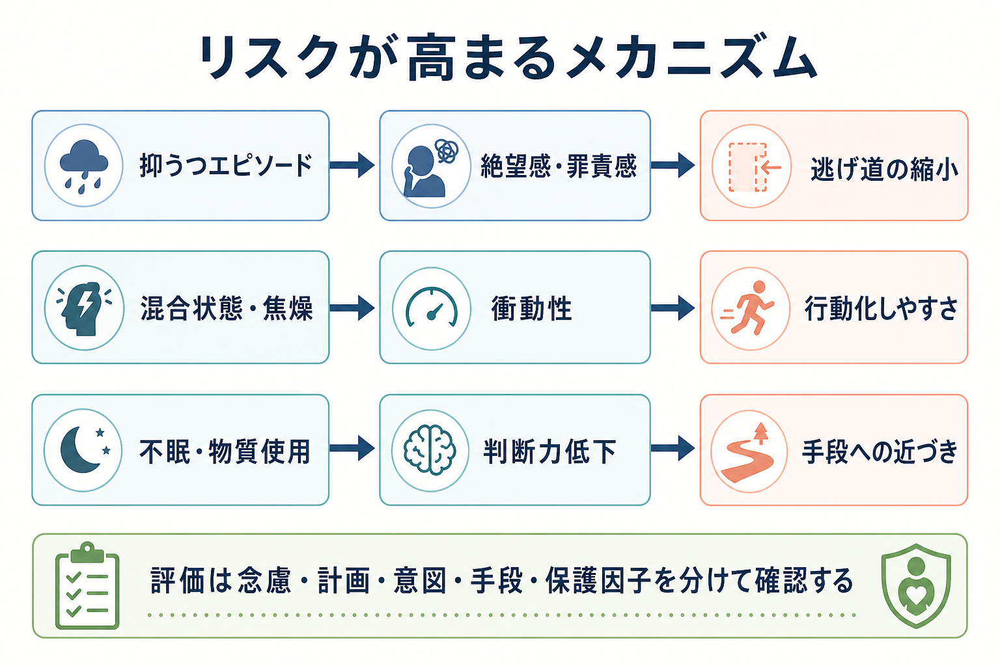

# 気分障害における自殺リスクとは何か

## 要点

- 気分障害における自殺リスクは、診断名だけで決まる固定属性ではなく、抑うつ、混合状態、焦燥、不眠、物質使用、過去の自殺企図、孤立、手段へのアクセス、保護因子が重なって変動する臨床的状態である。
- [[うつ病とは何か|うつ病]]では、絶望感、罪責感、無価値感、精神病症状、重症不眠、治療開始・変更直後の焦燥などが重要になる。NICE は、うつ病の人には自殺念慮と意図を直接尋ね、リスクがある場合は支援、治療、安全確保を具体化するよう推奨している[1]。
- 双極性障害では、抑うつエピソードだけでなく、抑うつと躁的活性化が同時に存在する混合状態、急速な病相変化、衝動性、物質使用、併存不安がリスクを押し上げる[2][4][5]。
- 評価は「念慮があるか」だけでなく、計画、意図、手段、過去の企図、急性変化、保護因子、支援資源を分けて確認する。C-SSRS のような構造化尺度は役立つが、臨床面接を置き換えるものではない[6]。
- NICE は、自殺や自傷の将来予測、退院可否、治療提供の判断を、リスク尺度や「低・中・高」の全体分類だけで決めないよう明確に勧告している[7]。

## この記事で答える問い

1. 気分障害では、なぜ自殺リスクが高まりやすいのか。
2. うつ病と双極性障害では、どのリスク要因に注意するべきか。
3. 面接では何を分けて確認し、尺度をどう位置づけるべきか。
4. 評価結果をどのように安全計画、治療、フォローアップへつなげるか。

## まず結論

気分障害における自殺リスクは、「気分が落ち込んでいるから危険」という単純な図式では捉えられない。臨床的には、本人がどれほど苦痛と絶望を感じているか、考えがどれほど具体的な計画に近づいているか、衝動性や焦燥が高まっているか、手段に近づきやすいか、孤立しているか、支援につながれるかを、時間軸に沿って評価する必要がある[1][6][7]。

特に重要なのは、診断名をリスクのラベルにしないことである。[[希死念慮とは何か|希死念慮]]があっても、計画や意図が曖昧で、保護因子が機能し、支援にすぐつながれる場合と、希死念慮の表明は少なくても、混合状態、強い焦燥、不眠、過去の重篤な企図、手段アクセスが重なる場合では、必要な対応が異なる。したがって評価の目的は「予言」ではなく、いま修正できる危険因子と使える保護因子を見つけ、安全を支える行動計画へ変換することである[7][8]。

## 背景

自殺は公衆衛生上の重要課題であり、気分障害はその中核的な臨床背景の一つである。大うつ病性障害では、自殺念慮、計画、企図が非うつ病群より多いことがメタ解析で示されている[3]。双極性障害でも死亡リスクは全体として高く、特に自殺による標準化死亡比が一般人口より大きく上昇することが報告されている[4]。

ただし、これらの数字は「この診断なら必ず危険」という意味ではない。リスクは、病相、重症度、併存症、生活状況、支援資源、治療への接続によって大きく変化する。[[自殺リスク評価では何を聞くべきか]]で扱う一般原則と同じく、気分障害でもリスク評価は一回のチェックリストではなく、面接、観察、家族・支援者からの情報、治療経過を統合したリスク・フォーミュレーションとして行う。

## 基本概念

### 希死念慮・自殺念慮・自殺企図

希死念慮は「消えたい」「目が覚めなければよい」といった死への願望を含む広い概念である。自殺念慮は、自分で命を絶つことを考える状態を指し、受動的なものから、方法や時期を伴う能動的なものまで幅がある。自殺企図は、死ぬ意図を伴う、または少なくとも死の可能性を意識した行動である。[[自殺念慮と自殺企図は何が違うのか]]、[[自傷と自殺企図はどう違うのか]]と区別して読むと理解しやすい。

### 長期リスクと急性リスク

長期リスクは、過去の自殺企図、家族歴、気分障害の反復、物質使用、慢性疼痛、社会的孤立、トラウマ歴など、比較的ゆっくり変わる背景要因である。急性リスクは、直近の病状悪化、強い不眠、焦燥、混合状態、重要な喪失、退院直後、治療中断、手段への接近など、数時間から数日単位で変わる要因である[1][5][8]。

臨床上は、長期リスクが高い人の中で急性リスクが上がった瞬間を見逃さないことが重要である。逆に、背景リスクが比較的少なくても、急性の焦燥や手段アクセスが強い場合は、速やかな安全確保が必要になる。

### 保護因子

保護因子は、家族、友人、治療者、価値観、責任感、将来の希望、問題解決力、宗教・文化的信念、危機時に使える支援資源などである。ただし、保護因子は「存在する」だけでは十分ではない。危機の瞬間に本人が実際に使えるか、支援者が状況を知っているか、連絡手段があるかまで確認する。

## 仕組み

### 抑うつエピソード

抑うつエピソードでは、絶望感、罪責感、無価値感、精神運動制止、集中困難、疲労感、不眠、食欲低下などが重なり、「この状態は変わらない」「自分は迷惑をかけている」といった思考が強まりやすい。重症うつ病や精神病症状を伴ううつ病では、貧困妄想、罪業妄想、身体妄想などが自殺リスクと結びつくことがある[1]。関連して [[貧困妄想とは何か]]、[[思考制止とは何か]]、[[快感消失とは何か]] も参照できる。

### 双極性障害と混合状態

双極性障害の自殺リスクは、躁状態よりも抑うつ相や混合状態で問題になりやすい。混合状態では、抑うつ、絶望、不眠に加えて、焦燥、活動性、衝動性が同時に高まりうる。この組み合わせは、「苦痛が強い」だけでなく「行動化しやすい」状態を作るため、面接では抑うつの深さと同時に、睡眠、焦燥、易怒性、思考促迫、衝動性を確認する[2][5]。[[躁状態とは何か]]、[[軽躁状態とは何か]]、[[双極性障害は情動ネットワークの異常として説明できるのか]] も関連する。

### 併存症・生活背景

物質使用、アルコール使用、不安症、パーソナリティ特性、慢性疼痛、身体疾患、経済的困難、失業、対人関係の破綻、孤立は、気分障害の症状と相互に強め合う。双極性障害のメタ解析では、自殺企図と関連する要因として、若年発症、抑うつ優位、現在または直近の抑うつエピソード、不安症、物質使用、アルコール使用、境界性パーソナリティ特性、家族歴などが報告されている[5]。

### 治療とリスクの時間軸

治療は自殺リスクを下げる重要な要素だが、治療開始・薬剤変更・退院直後・生活環境の急変時は、短期的に再評価が必要である。NICE は、うつ病治療中には自殺念慮、とくに治療初期の焦燥や不安の増加に注意してモニタリングするよう述べている[1]。長期治療では、気分エピソードの再発予防、睡眠の安定、物質使用への介入、社会的支援がリスク低減に関わる。

リチウムについては、気分障害における自殺リスク低減を示すメタ解析がある一方で、イベント数の少なさや研究間差もあり、個別の適応、身体合併症、副作用、モニタリングを含めて専門的に判断される[8]。ここで重要なのは「リチウムを使えば安全」という理解ではなく、再発予防と衝動性・攻撃性への作用を含めた総合的治療の一部として位置づけることである。

## 図解

3枚の図は、評価の入口を「診断名」ではなく「変化する状態」として見るための補助である。1枚目は全体像、2枚目は抑うつ・混合状態・不眠や物質使用からリスクが高まる流れ、3枚目は面接で確認する項目の順序を示している。

## 臨床・研究との接続

### 面接で分けて確認する項目

面接では、次の項目を分けて確認する。

| 領域 | 確認すること | 気分障害での焦点 |
|---|---|---|
| 念慮 | 死にたい気持ち、自殺についての考え、頻度、持続時間 | 絶望感、罪責感、無価値感、混合状態での切迫感 |
| 計画 | 方法、時期、場所、準備の有無 | 抑うつの深さと、焦燥・衝動性の同時存在 |
| 意図 | 実行するつもり、制御可能性、ためらい | 「止められない感じ」、衝動性、飲酒・薬物使用 |
| 手段 | 利用可能な手段、アクセス容易性、安全確保 | 家族・支援者と連携した手段への距離づけ |
| 過去歴 | 自殺企図、自傷、入院、退院直後、治療中断 | 過去企図の致死性、直近の病相、再発パターン |
| 保護因子 | 支援者、価値観、責任、希望、危機時の連絡先 | 実際に今日使える支援かどうか |

C-SSRS は、自殺念慮の重症度と自殺行動を標準化して記録する尺度として有用性が検討されている[6]。ただし、尺度は質問を抜け漏れなく行う補助であり、[[精神科診断面接で尺度をどう使うか|尺度の使い方]]と同じく、面接、観察、文脈、支援計画を置き換えない。

### スコアだけで判断しない

NICE の自傷ガイドラインは、リスク尺度を将来の自殺や自傷反復の予測、治療提供の可否、退院判断に用いないよう勧告している[7]。これは「尺度を使うな」という意味ではなく、尺度をリスク・フォーミュレーションの一部に位置づけるという意味である。

研究的にも、自殺リスク要因は群レベルでは有意でも、個人の短期予測には限界がある。気分障害では、病相と生活状況が時間とともに変わるため、評価は繰り返し更新される必要がある。

### 安全計画へつなぐ

評価の出口は、記録だけではない。危機時の警告サイン、本人が使える対処、連絡できる支援者、治療者や医療機関への接続、手段への距離づけ、フォローアップ時期を具体化する。[[クライシスプランとは何か]]、[[再発予防計画とは何か]] と接続すると、評価を支援に変換しやすい。

## よくある誤解

### 「うつ病なら必ず自殺リスクが高い」

うつ病は自殺リスクと強く関連するが、個人のリスクは症状の内容、重症度、時間経過、併存症、支援資源によって異なる。診断名だけで危険度を決めると、必要な支援を見落とすことがある。

### 「希死念慮がなければ安全」

希死念慮が明確に語られない場合でも、焦燥、不眠、衝動性、物質使用、過去企図、手段アクセス、急性喪失があるとリスクは上がりうる。逆に、希死念慮がある場合も、具体性、制御可能性、支援への接続、保護因子を分けて評価する。

### 「双極性障害では躁状態だけに注意すればよい」

双極性障害では、抑うつ相、混合状態、急速な病相変化が重要である。躁的活性化と抑うつ的絶望が重なると、苦痛と行動化しやすさが同時に高まることがある[2][5]。

### 「自殺について聞くと危険になる」

落ち着いた態度で直接尋ねることは、本人が話せる場を作り、評価と支援につなげるために必要である。問題は尋ねること自体ではなく、尋ねた後に安全確保、支援者との連携、フォローアップへつなげないことである。

### 「リスク分類が低ければ対応は不要」

リスク分類は処遇を決める結論ではない。NICE が述べるように、低・中・高の全体分類だけで将来の自殺や自傷反復、治療提供、退院可否を決めるべきではない[7]。必要なのは、本人のニーズ、安全、支援計画を具体化することである。

## 関連ノート

既存ノート:

- [[うつ病とは何か]]
- [[メランコリー型うつ病とは何か]]
- [[希死念慮とは何か]]
- [[自殺念慮と自殺企図は何が違うのか]]
- [[自殺リスク評価では何を聞くべきか]]
- [[自傷と自殺企図はどう違うのか]]
- [[クライシスプランとは何か]]
- [[再発予防計画とは何か]]
- [[不眠とは何か]]
- [[精神科診断面接で尺度をどう使うか]]
- [[躁状態とは何か]]
- [[軽躁状態とは何か]]
- [[双極性障害は情動ネットワークの異常として説明できるのか]]

今後の作成候補:

- 双極性障害とは何か
- 混合状態とは何か
- 安全計画とは何か
- 自殺リスク評価における手段アクセスとは何か

MOC 更新候補:

- `content/00_MOC/MOC｜精神医学.md`
- `content/00_MOC/MOC｜臨床実践・治療.md`
- `content/00_MOC/MOC｜総論・診断・面接.md`

## 理解チェック

1. 気分障害における自殺リスクを、診断名だけで判断してはいけない理由は何か。
2. 抑うつエピソードと混合状態では、自殺リスクの高まり方にどのような違いがあるか。
3. 自殺リスク評価で、念慮・計画・意図・手段を分けて聞く理由は何か。
4. C-SSRS や PHQ-9 の項目は、臨床判断の中でどのように使うべきか。
5. 保護因子が「実際に機能している」と言うためには、何を確認する必要があるか。

## 未解決問題

- 個人の短期的な自殺リスクを、過剰な偽陽性・偽陰性なしに予測する方法はまだ確立していない。
- 気分障害の病相変化、睡眠、活動量、社会的孤立、デジタル行動指標をどう統合すれば、本人の負担を増やさず支援につなげられるかは研究課題である。
- 混合状態や焦燥を伴う抑うつに対して、どの評価項目が最も早く危機の変化を捉えるかは、さらに検討が必要である。
- 自殺予防研究では、予測精度だけでなく、介入可能性、説明可能性、本人の尊厳、プライバシー、支援への接続を同時に評価する必要がある。

## 参考文献

[1] National Institute for Health and Care Excellence. (2022). *Depression in adults: treatment and management. NICE Guideline NG222*. https://www.nice.org.uk/guidance/ng222/chapter/Recommendations

[2] National Institute for Health and Care Excellence. (2025). *Bipolar disorder: assessment and management. NICE Clinical Guideline CG185*. https://www.nice.org.uk/guidance/cg185/chapter/1-Guidance

[3] Dong, M., Zeng, L. N., Lu, L., et al. (2021). Prevalence of suicidality in major depressive disorder: A systematic review and meta-analysis of comparative studies. *Frontiers in Psychiatry, 12*, 690130. https://doi.org/10.3389/fpsyt.2021.690130

[4] Hayes, J. F., Miles, J., Walters, K., King, M., & Osborn, D. P. J. (2015). A systematic review and meta-analysis of premature mortality in bipolar affective disorder. *Acta Psychiatrica Scandinavica, 131*(6), 417-425. https://doi.org/10.1111/acps.12408

[5] Schaffer, A., Isometsä, E. T., Tondo, L., et al. (2015). International Society for Bipolar Disorders Task Force on Suicide: Meta-analyses and meta-regression of correlates of suicide attempts and suicide deaths in bipolar disorder. *Bipolar Disorders, 17*(1), 1-16. https://doi.org/10.1111/bdi.12271

[6] Posner, K., Brown, G. K., Stanley, B., et al. (2011). The Columbia-Suicide Severity Rating Scale: Initial validity and internal consistency findings from three multisite studies with adolescents and adults. *American Journal of Psychiatry, 168*(12), 1266-1277. https://doi.org/10.1176/appi.ajp.2011.10111704

[7] National Institute for Health and Care Excellence. (2022). *Self-harm: assessment, management and preventing recurrence. NICE Guideline NG225*. https://www.nice.org.uk/guidance/ng225/chapter/recommendations

[8] Cipriani, A., Hawton, K., Stockton, S., & Geddes, J. R. (2013). Lithium in the prevention of suicide in mood disorders: Updated systematic review and meta-analysis. *BMJ, 346*, f3646. https://doi.org/10.1136/bmj.f3646
