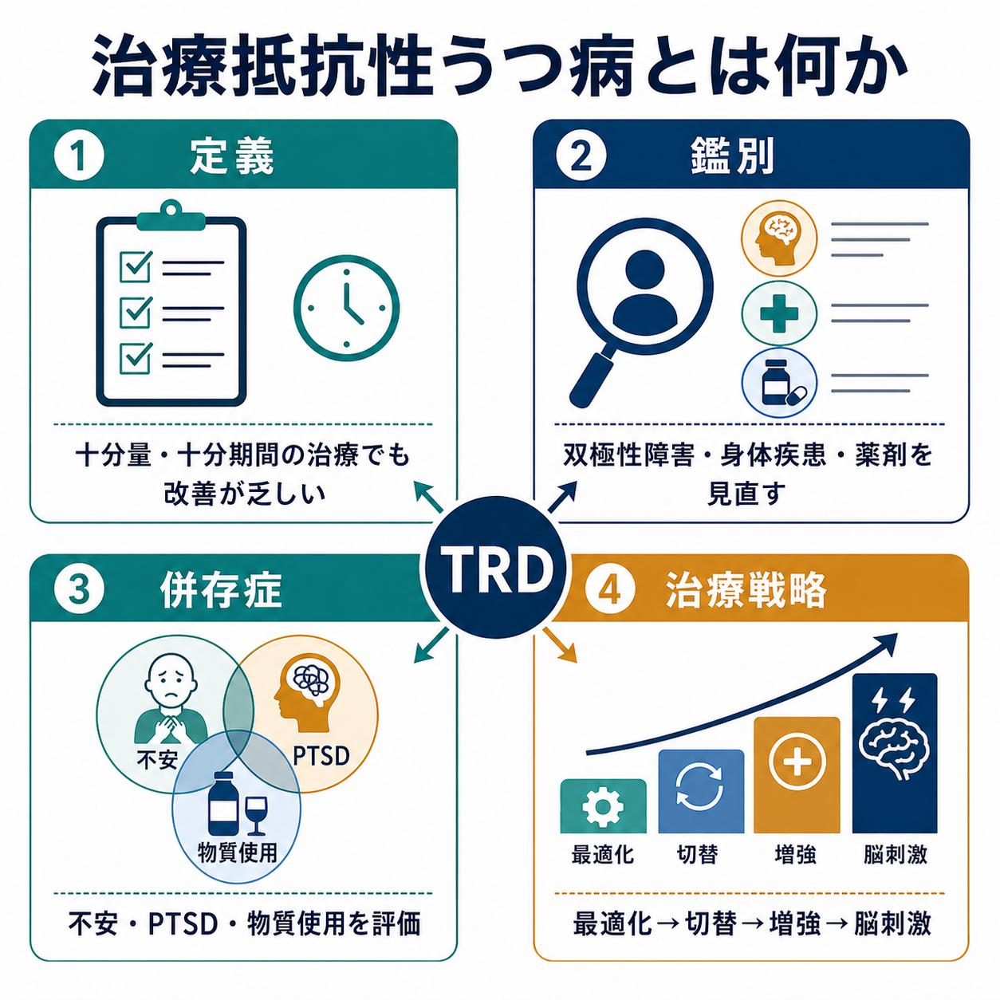
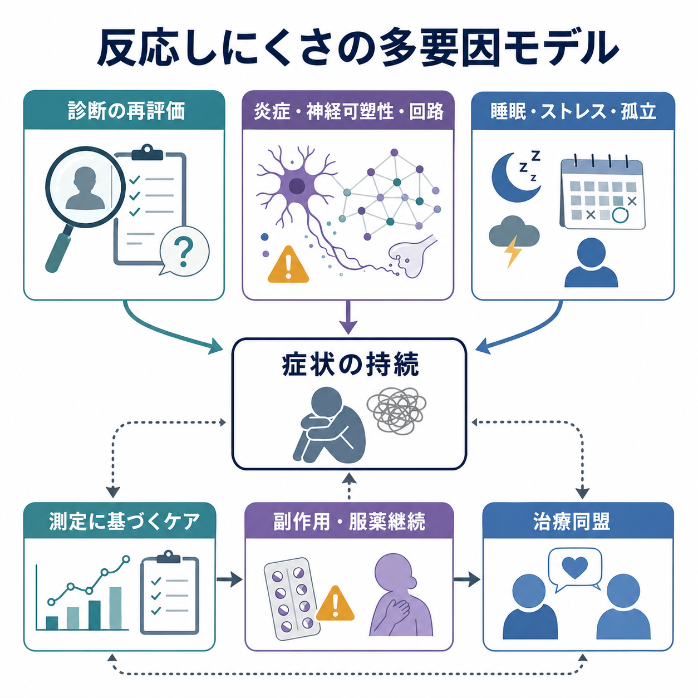

# 治療抵抗性うつ病とは何か

## 要点

- 治療抵抗性うつ病（treatment-resistant depression; TRD）は、一般に「十分量・十分期間の抗うつ薬治療を少なくとも2回行っても、反応が不十分なうつ病」を指すが、世界的に完全に統一された定義はない[1]。
- 「薬が効かない人」という固定的なラベルではなく、診断、治療量、治療期間、服薬継続、併存症、生活環境、測定方法を再点検するための臨床的サインとして扱う方が実用的である[1][2]。
- STAR*D 研究では、治療ステップが進むほど寛解率は下がり、再発率は上がる傾向が示された。したがって、早期から測定に基づくケアと治療選択の見直しが重要になる[3]。
- 治療戦略は、単純な「次の薬」探しではなく、最適化、切替、増強、心理療法、TMS、ECT、エスケタミンなどを、重症度・安全性・患者の希望・利用可能性に応じて組み合わせる[2][4][5]。

## この記事で答える問い

この記事では、[[うつ病とは何か]]を前提に、治療抵抗性うつ病を次の問いから整理する。

- どの時点で「治療抵抗性」と呼ぶのか。
- 本当にうつ病なのか、あるいは[[双極性障害とは何か]]、身体疾患、薬剤、物質使用、発達特性などが関与していないか。
- 不安症、PTSD、パーソナリティ特性、慢性疼痛、睡眠障害などの併存症は、どのように治療反応を悪く見せるのか。
- 薬物療法、心理療法、脳刺激療法、ケタミン関連治療をどう位置づけるのか。

## まず結論

治療抵抗性うつ病は、「うつ病の中に薬が効かない特殊型がある」というより、うつ病の診断・治療・生活背景・併存症・安全性を再評価する必要が高い状態である。多くの文献では、少なくとも2種類の抗うつ薬を、十分量・十分期間・十分な服薬継続のもとで試しても十分な改善が得られない場合を TRD と呼ぶ[1][2]。

ただし、この定義は薬物療法中心であり、心理療法、脳刺激療法、患者本人が重視する機能回復や生活の質を十分に含まない。そのため近年は「difficult-to-treat depression（DTD）」のように、治療不能ではなく、長期的・共同的・測定可能な治療計画を必要とする状態として捉える考え方も重視されている[2]。

## 背景

うつ病治療では、最初の治療で完全な寛解に至らないことは珍しくない。STAR*D 研究では、非精神病性の大うつ病外来患者に対して段階的な治療を行い、第1段階から第4段階までの QIDS-SR による寛解率が、それぞれ 36.8%、30.6%、13.7%、13.0% と報告された[3]。この結果は、治療を重ねれば誰でも同じ確率で改善するわけではなく、治療ステップが進むほど寛解が難しくなる集団が存在することを示している。

一方で、TRD は単一の疾患単位ではない。診断が異なる、治療が不十分だった、評価尺度が使われていなかった、薬剤副作用で十分量まで到達していない、併存症が治療反応を鈍らせている、といった「見かけ上の抵抗性」も含まれる[1]。したがって、TRD という言葉を使う時点で、まず「何に対して抵抗性なのか」を具体化する必要がある。

## 基本概念

### 定義

もっともよく使われる操作的定義は、現在のうつ病エピソードにおいて、少なくとも2回の抗うつ薬治療に十分な反応がない状態である[1][2]。ここでいう「十分」とは、少なくとも次の条件を確認することを意味する。

| 確認点 | 見落とすと起きること |
|---|---|
| 用量 | 実際には治療量に達していない |
| 期間 | 効果判定が早すぎる |
| 服薬継続 | 副作用、費用、信念、生活リズムにより継続できていない |
| 評価尺度 | 「少し良い」「変わらない」の主観だけで判定がぶれる |
| 治療目標 | 症状軽減、機能回復、再発予防が混同される |

この点で、TRD は[[治療抵抗性統合失調症とは何か]]のように特定薬剤への反応性で比較的明確に定義される概念よりも、定義の幅が広い。抗うつ薬だけを基準にするのか、心理療法や ECT まで含めるのか、部分反応をどう扱うのかによって、同じ患者でも分類が変わりうる[1]。

### 「抵抗性」と「難治性」

「抵抗性」という語は、患者本人が治療に抵抗しているかのような印象を与えることがある。しかし実際には、疾患の異質性、併存症、社会的ストレス、治療アクセス、医療者と患者の目標のずれなどが複合していることが多い[2]。そのため臨床的には、「治療不能」ではなく「治療計画を再設計する必要がある状態」と読む方がよい。

## 仕組み

TRD の「仕組み」は、ひとつの分子や脳部位だけでは説明できない。少なくとも次の層が重なる。

### 1. 診断の層

単極性の大うつ病として治療していても、実際には双極性障害、持続性抑うつ障害、物質使用、薬剤性抑うつ、甲状腺疾患、睡眠時無呼吸、慢性疼痛、神経疾患などが関与していることがある[2]。特に、抗うつ薬で躁転・混合状態・焦燥が目立つ場合や、若年発症、家族歴、周期性がある場合は、[[双極II型障害とは何か]]を含めた鑑別が重要になる。

### 2. 生物学的多様性の層

うつ病は、報酬系、ストレス応答、炎症、神経可塑性、睡眠・概日リズム、認知制御回路などの多様な経路が関わる症候群である。したがって、同じ「抑うつ気分」でも、薬理学的標的や心理社会的介入への反応は一様ではない[1][2]。この異質性が、標準的な抗うつ薬への反応のばらつきを生む。

### 3. 併存症と環境の層

CANMAT 2023 は、大うつ病では不安症、ADHD、物質使用、パーソナリティ障害などの精神科併存、さらに糖尿病、心血管疾患、がん、慢性疼痛などの身体疾患併存が多く、これらが治療を難しくすると整理している[2]。PTSD 関連症状が強い場合は、[[PTSDでは恐怖記憶ネットワークに何が起きているのか]]や[[扁桃体過活動は不安症やPTSDにどう関わるのか]]で扱う恐怖記憶・過覚醒の問題が、抑うつ症状の持続に寄与することがある。

## 図解

上の1枚目は、TRD を「定義」「鑑別」「併存症」「治療戦略」の4領域で見る概念地図である。2枚目は、反応しにくさを多要因モデルとして描いている。ポイントは、TRD を「抗うつ薬が効かない脳」と断定しないことである。診断の再評価、生物学的多様性、睡眠・ストレス・孤立、副作用・服薬継続、治療同盟が相互に影響し、症状の持続を作る。

## 臨床・研究との接続

### 測定に基づくケア

治療抵抗性を判断する前に、PHQ-9、QIDS、HAM-D、MADRS などの尺度で、症状の変化と機能回復を追う必要がある。VA/DoD 2022 ガイドラインは、大うつ病の管理を初期評価・治療と高度ケアのアルゴリズムとして整理し、臨床判断を置き換えるものではなく補助するものとして位置づけている[4]。測定は、機械的な点数管理ではなく、治療目標を患者と共有する道具である。

### 薬物療法の見直し

初期治療への反応が不十分な場合、治療量・期間・副作用・相互作用・アドヒアランスを確認したうえで、用量最適化、薬剤切替、増強療法を検討する[2][4]。増強療法のネットワークメタ解析では、アリピプラゾール、クエチアピン、リチウム、甲状腺ホルモンなどがプラセボより有効な選択肢として報告されている一方、忍容性や副作用による中止も重要な制約となる[6]。したがって、効果だけでなく、体重増加、代謝、錐体外路症状、鎮静、腎・甲状腺機能などの安全性評価が欠かせない。

### 心理療法と生活機能

TRD では、薬物療法の追加だけでなく、認知行動療法、行動活性化、対人関係療法、問題解決療法などの心理療法を組み合わせることがある。CANMAT 2023 は、初期から心理療法を考慮し、反応不十分時にも心理療法やニューロモデュレーションを選択肢に含めることを示している[2]。特に、回避、反芻、孤立、活動低下が症状を維持している場合、生活機能の回復を治療目標に入れることが重要である。

### 脳刺激療法とエスケタミン

反応不十分が続く場合、[[トランスクラニアル磁気刺激TMSは何をしているのか]]や[[TMSはうつ病治療でどの神経回路を狙っているのか]]で扱う反復経頭蓋磁気刺激、ECT、エスケタミンなどが検討される。NICE ガイドラインは、さらなる治療選択、慢性うつ病、精神病性うつ病、パーソナリティ障害併存などを含めて段階的に管理する枠組みを示している[5]。また、エスケタミン点鼻薬は米国 FDA ラベル上、2025年時点で成人 TRD に対して単剤または経口抗うつ薬併用での適応を持つが、鎮静、解離、呼吸抑制、乱用リスクなどのため医療者監督下・REMS による制限がある[7]。

ECT とケタミンの比較では、非精神病性 TRD を対象とした ELEKT-D 試験で、3週間時点の反応に関して静注ケタミンの ECT に対する非劣性が報告された。ただし、対象は非精神病性であり、長期的再発、安全性、利用可能性、精神病性うつ病や切迫した生命リスクへの適用は別に考える必要がある[8]。

## よくある誤解

### 誤解1: TRD は「一生治らないうつ病」である

TRD は予後不良と関連するが、治療不能を意味しない。診断の見直し、治療量の最適化、併存症への介入、心理療法、脳刺激療法などにより、改善の余地が残る[1][2]。

### 誤解2: 2種類の薬が効かなければ、すぐ特殊治療に進む

実際には、十分量・十分期間・服薬継続・副作用・相互作用・症状評価を確認する必要がある。見かけ上の治療抵抗性を除外せずに次の治療へ進むと、問題の核心を見逃す。

### 誤解3: 併存症は二次的な問題にすぎない

不安、PTSD、物質使用、慢性疼痛、睡眠障害、パーソナリティ特性は、治療反応そのものを変える。併存症を「ついで」に扱うのではなく、治療計画の中心に入れる必要がある[2]。

### 誤解4: 画像検査やバイオマーカーで簡単に判定できる

TRD の臨床判断は、現時点では単一の脳画像・血液検査で確定するものではない。研究では神経回路、炎症、神経可塑性などが検討されているが、個別診断を置き換える段階ではない[1]。

## 関連ノート

- [[うつ病とは何か]]
- [[メランコリー型うつ病とは何か]]
- [[双極性障害とは何か]]
- [[双極II型障害とは何か]]
- [[トランスクラニアル磁気刺激TMSは何をしているのか]]
- [[TMSはうつ病治療でどの神経回路を狙っているのか]]
- [[PTSDでは恐怖記憶ネットワークに何が起きているのか]]
- [[治療抵抗性統合失調症とは何か]]

## 理解チェック

1. 治療抵抗性うつ病の「2回の治療不成功」は、なぜ用量・期間・服薬継続の確認なしには判断できないのか。
2. 単極性うつ病として治療している人で、双極性障害を再評価すべき手がかりには何があるか。
3. 「薬剤切替」と「増強療法」は、どのような臨床状況で意味が異なるか。
4. TRD を「治療不能」ではなく「治療計画の再設計が必要な状態」と考える利点は何か。

## 関連ノート候補

- 治療抵抗性うつ病の測定に基づくケア
- うつ病における増強療法とは何か
- ECTはうつ病にどう効くのか
- エスケタミンは治療抵抗性うつ病にどう使われるのか
- うつ病と慢性疼痛の併存

## MOC更新候補

- `content/00_MOC/` 配下の精神医学・うつ病関連 MOC に、本記事へのリンクを追加する候補。
- 並列生成ジョブとの競合を避けるため、本タスクでは MOC ファイル自体は更新しない。

## 未解決問題

- TRD の定義は、抗うつ薬2回不成功を基準にすることが多いが、心理療法、脳刺激療法、機能回復、患者報告アウトカムをどこまで含めるかは統一されていない[1][2]。
- ケタミン・エスケタミン、TMS、ECT の最適な順序づけは、重症度、精神病症状、自殺リスク、アクセス、費用、副作用、患者希望によって変わる[2][5][8]。
- バイオマーカーや脳画像による層別化は有望だが、日常臨床で個別治療選択を確定するにはまだ限界がある[1]。

## 参考文献

[1] McIntyre, R. S., Alsuwaidan, M., Baune, B. T., et al. (2023). Treatment-resistant depression: definition, prevalence, detection, management, and investigational interventions. *World Psychiatry, 22*(3), 394-412. https://doi.org/10.1002/wps.21120

[2] Lam, R. W., Kennedy, S. H., Adams, C., et al. (2024). Canadian Network for Mood and Anxiety Treatments (CANMAT) 2023 Update on Clinical Guidelines for Management of Major Depressive Disorder in Adults. *The Canadian Journal of Psychiatry*. https://doi.org/10.1177/07067437241245384

[3] Rush, A. J., Trivedi, M. H., Wisniewski, S. R., et al. (2006). Acute and longer-term outcomes in depressed outpatients requiring one or several treatment steps: a STAR*D report. *American Journal of Psychiatry, 163*(11), 1905-1917. https://doi.org/10.1176/ajp.2006.163.11.1905

[4] Department of Veterans Affairs & Department of Defense. (2022). *VA/DoD Clinical Practice Guideline for the Management of Major Depressive Disorder*. https://www.healthquality.va.gov/guidelines/mh/mdd/

[5] National Institute for Health and Care Excellence. (2022). *Depression in adults: treatment and management. NICE guideline NG222*. https://www.ncbi.nlm.nih.gov/books/NBK583074/

[6] Zhou, X., Ravindran, A. V., Qin, B., et al. (2015). Comparative efficacy, acceptability, and tolerability of augmentation agents in treatment-resistant depression: systematic review and network meta-analysis. *Journal of Clinical Psychiatry, 76*(4), e487-e498. https://doi.org/10.4088/JCP.14r09204

[7] U.S. Food and Drug Administration. (2025). *SPRAVATO (esketamine) nasal spray: prescribing information*. https://www.accessdata.fda.gov/drugsatfda_docs/label/2025/211243s019lbl.pdf

[8] Anand, A., Mathew, S. J., Sanacora, G., et al. (2023). Ketamine versus ECT for nonpsychotic treatment-resistant major depression. *New England Journal of Medicine, 388*, 2315-2325. https://doi.org/10.1056/NEJMoa2302399
