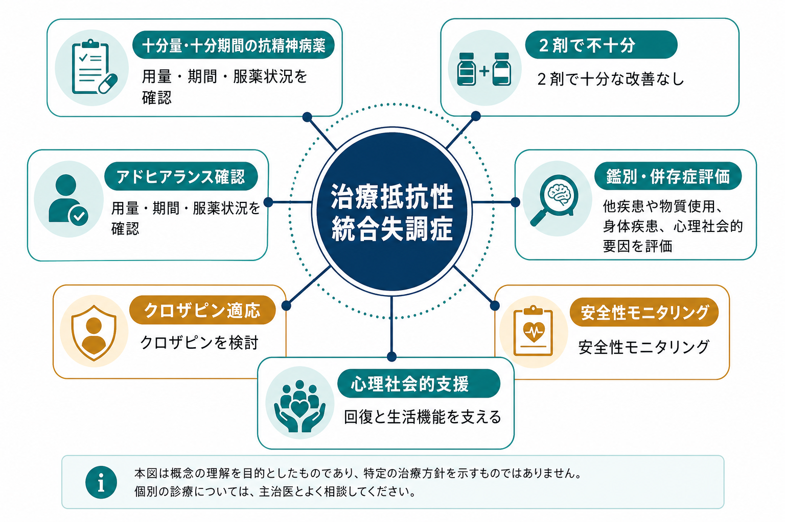
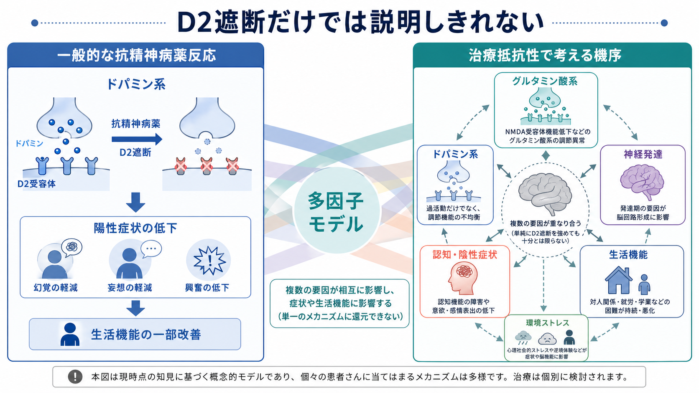
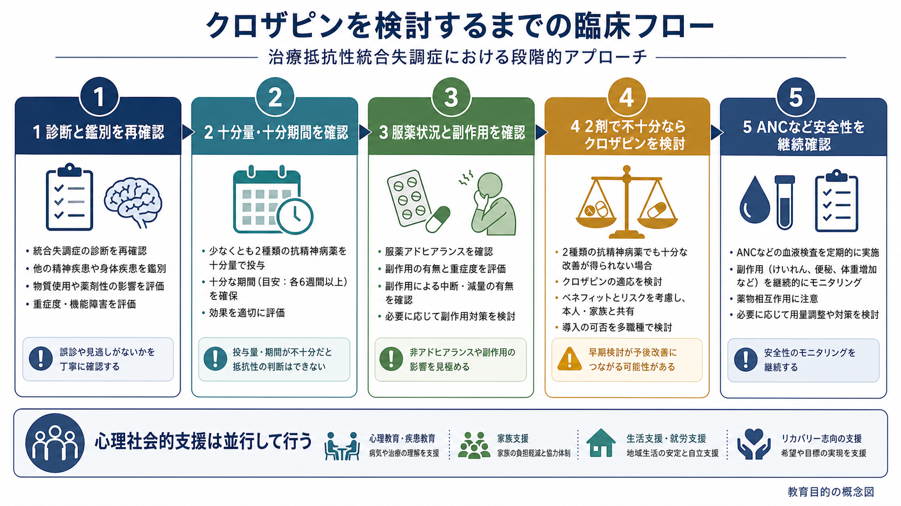

# 治療抵抗性統合失調症とは何か

## 要点

- 治療抵抗性統合失調症とは、[[統合失調症とは何か|統合失調症]]の診断が妥当で、十分量・十分期間の抗精神病薬治療を少なくとも2種類行っても、症状と生活機能の障害がなお臨床的に意味のある程度に残る状態を指す[1]。
- 「薬が効きにくい人」という印象語ではなく、診断、症状評価、機能障害、用量、期間、服薬状況、副作用による中断、物質使用や身体疾患の影響を確認したうえで使う概念である[1]。
- NICE は、少なくとも2種類の抗精神病薬に十分反応しない成人統合失調症ではクロザピンを提示することを質指標としている[2]。APA も治療抵抗性統合失調症ではクロザピンを推奨している[3]。
- クロザピンは有効性の根拠をもつ一方で、重度好中球減少、けいれん、心筋炎、代謝異常、便秘・腸管運動低下などのリスクがあり、ANCを含む安全性モニタリングが不可欠である[6][7]。
- 本記事は教育・研究目的の整理であり、個別の診断、服薬変更、クロザピン導入可否を判断するものではない。

## この記事で答える問い

1. 治療抵抗性統合失調症は、単に「重い統合失調症」と同じなのか。
2. どのような条件がそろうと、治療抵抗性と考えるのか。
3. なぜクロザピンが特別な位置づけをもつのか。
4. クロザピンを検討する前後に、何を確認する必要があるのか。
5. 治療抵抗性を考えるとき、どのような誤解を避けるべきか。

## まず結論

治療抵抗性統合失調症は、「統合失調症が重い」というだけでは定義できない。中心にあるのは、十分な抗精神病薬治療を試みたにもかかわらず、[[統合失調症の陽性症状とは何か|陽性症状]]、陰性症状、[[統合失調症の認知機能障害とは何か|認知機能障害]]、生活機能障害の一部が持続し、通常の薬物療法だけでは回復目標に届きにくいという臨床的状況である[1]。

したがって、治療抵抗性を判断するときは、次の二つを同時に考える必要がある。第一に、本当に十分な治療が行われたのか。第二に、残っている問題は抗精神病薬反応性の問題なのか、それとも診断の見直し、服薬継続の困難、副作用、物質使用、身体疾患、心理社会的要因、支援不足などで説明できる部分が大きいのかである[1][3]。

クロザピンは、この文脈で最も重要な薬剤である。古典的な二重盲検試験では、治療抵抗性患者においてクロザピンがクロルプロマジンより高い反応率を示し、その後のメタ解析やガイドラインでも標準的選択肢として扱われてきた[4][5]。ただし、クロザピンは「強い薬だから最後に使う薬」というより、「治療抵抗性が確認されたときに遅らせすぎないことが重要な薬」と理解したほうがよい。

## 背景

統合失調症の薬物療法では、多くの場合、ドパミンD2受容体遮断作用をもつ抗精神病薬が陽性症状の軽減に寄与する。しかし、すべての人が同じように反応するわけではない。初回エピソードから反応が乏しい人もいれば、いったん改善しても再燃を繰り返し、薬剤変更を経ても症状や機能障害が残る人もいる。[[初回エピソード精神病とは何か|初回エピソード精神病]]の段階から、十分な評価と早期介入が重要になるのはこのためである。

TRRIP ワーキンググループは、研究と臨床で治療抵抗性の定義がばらばらであることを問題にし、操作的な基準を提案した。最小要件としては、標準化尺度による症状評価、少なくとも中等度の機能障害、少なくとも2種類の抗精神病薬治療、十分な用量と期間、服薬状況の系統的確認などが重視される[1]。この枠組みは、治療抵抗性を「印象」ではなく「確認可能な臨床判断」に近づけるためのものといえる。

## 基本概念

### 十分な治療とは何か

「十分な治療」とは、単に薬が処方されたことではない。少なくとも、薬剤が実際に服用されていたか、用量が治療域に達していたか、十分な期間継続されたか、副作用で中断・減量されていなかったか、効果判定が症状と機能の両面で行われたかを確認する必要がある[1]。

TRRIP の議論では、過去の治療歴を患者本人、家族・支援者、診療録、処方・調剤記録などから確認し、可能なら前向きに治療反応を評価することが望ましいとされる[1]。これは、服薬が困難だった人を「薬が効かなかった」と誤分類しないためである。

### 何が残れば治療抵抗性なのか

治療抵抗性で問題になるのは、幻覚や妄想だけではない。[[幻覚とは何か|幻覚]]、[[妄想とは何か|妄想]]のような陽性症状が残る典型例は多いが、陰性症状、認知機能障害、社会参加や生活機能の障害も重要である[1]。

ただし、陰性症状や認知機能障害は、抗精神病薬のD2遮断を増やせば改善するとは限らない。鎮静、抑うつ、社会的孤立、慢性ストレス、睡眠障害、身体疾患、薬剤性の運動症状などが二次的に「意欲低下」や「動きにくさ」と見えることもある。ここでは[[薬剤性精神症状とは何か|薬剤性精神症状]]や身体合併症の評価も欠かせない。

### クロザピン適応との関係

NICE は、十分量の少なくとも2種類の抗精神病薬を順次使用しても改善しない統合失調症を、クロザピン提示の対象としている。そのうち少なくとも1剤は非クロザピンの第二世代抗精神病薬であることが望ましいとされる[2]。APA も治療抵抗性統合失調症にはクロザピンを推奨し、自殺リスクや攻撃性が問題になる場合にもクロザピンが検討される文脈を示している[3]。

ここで重要なのは、クロザピン適応は「ほかに何もできなくなった後の例外」ではなく、治療抵抗性が確認されたときの標準的な臨床選択肢だという点である。一方で、導入には血液検査、身体リスク評価、服薬継続体制、本人と家族への説明、多職種連携が必要になる[6][7]。

## 仕組み

治療抵抗性統合失調症の仕組みは、一つの神経伝達物質だけでは説明しにくい。一般的な抗精神病薬反応では、D2遮断を通じて陽性症状が軽減するという説明が有用である。しかし治療抵抗性では、D2遮断を十分に行っても症状が残るため、ドパミン系以外の要因や、症状領域ごとの反応性の違いを考える必要がある。

### ドパミン仮説だけでは足りない

抗精神病薬の多くはドパミンD2受容体遮断を共有しており、これは陽性症状の薬理学的説明として重要である。しかし、D2遮断を強めても改善しない症状があることは、統合失調症の病態がドパミン過活動だけでは尽くせないことを示している。認知機能障害、陰性症状、生活機能障害は、グルタミン酸系、GABA系、神経発達、神経回路、環境ストレスなどを含む多因子モデルで考えるほうが臨床的には扱いやすい。

### 「真の治療抵抗性」と「見かけの治療抵抗性」

治療抵抗性を考えるとき、まず分けたいのは「真の治療抵抗性」と「見かけの治療抵抗性」である。見かけの治療抵抗性には、診断の再検討が必要な場合、薬剤が十分量まで到達していない場合、服薬が継続できていない場合、副作用のために効果判定前に中断されている場合、物質使用や身体疾患が症状を増悪させている場合などが含まれる[1][3]。

この区別は、本人を責めるためのものではない。服薬継続が難しい背景には、副作用、病識の揺れ、認知機能障害、経済的問題、家族関係、通院アクセス、スティグマなどが重なることがある。治療抵抗性の評価は、薬効判定であると同時に、治療環境の評価でもある。

### クロザピンが特別な理由

クロザピンは、治療抵抗性統合失調症に対して歴史的に最も重要な根拠をもつ抗精神病薬である。Kane らの試験では、治療抵抗性患者においてクロザピンがクロルプロマジンより良好な反応を示し、以後のガイドライン形成に大きな影響を与えた[4]。Siskind らのメタ解析も、治療抵抗性に対するクロザピンの優位性を支持しつつ、反応が乏しい場合には漫然と続けず、一定期間で再評価する必要を示している[5]。

一方、ネットワークメタ解析では、盲検RCTだけを見るとクロザピンと一部の第二世代抗精神病薬の差が一貫しないという論点もある[8]。これは「クロザピンは効かない」という意味ではなく、治療抵抗性の定義、対象者の重症度、用量、試験デザイン、観察期間によって効果推定が変わりうるという意味で読むべきである。実臨床とガイドラインでは、クロザピンはなお治療抵抗性統合失調症の中心的選択肢である[2][3]。

## 図解

治療抵抗性統合失調症を考える流れは、次のように整理できる。まず診断と鑑別を確認し、次に十分量・十分期間の治療だったかを確認する。そのうえで服薬状況、副作用、身体疾患、物質使用、心理社会的要因を評価し、少なくとも2剤で十分な改善がなければクロザピンを検討する。導入後はANCなどの安全性を継続的に確認し、心理社会的支援を並行する。

## 臨床・研究との接続

### 評価の実務

臨床では、治療抵抗性の判断は一回の診察だけで完結しにくい。診療録、過去の処方歴、入院歴、長期注射製剤の使用歴、薬剤血中濃度が利用できる場合の情報、家族・支援者からの観察、症状尺度、生活機能評価を組み合わせる必要がある[1][3]。

特に、再燃を繰り返している場合には、薬剤が効かなかったのか、服薬が途切れやすかったのか、副作用によって治療継続が難しかったのかを分けて考える。これは[[精神科治療計画はどのように立てるのか|精神科治療計画]]の基本でもある。

### 安全性モニタリング

クロザピンでは、治療前のANC確認と治療中の定期的なANCモニタリングが重要である。DailyMed の米国添付文書情報では、一般集団では開始前ANCが少なくとも1500/μL、BENでは少なくとも1000/μLを基準とし、通常は開始後6か月は毎週、その後6か月は2週ごと、12か月以降は月1回のANC確認が示されている[7]。

また、米国FDAは2025年6月13日付でクロザピンREMSを削除したが、重度好中球減少のリスクがなくなったわけではない。FDAは、REMS参加やREMSへのANC報告は不要になった一方で、添付文書に沿ったANCモニタリングは継続すべきだとしている[6]。制度上の手続きが変わっても、安全性評価の臨床的重要性は残る。

安全性は血液だけではない。起立性低血圧、徐脈、失神、けいれん、心筋炎・心筋症、便秘・腸管運動低下、体重増加、糖脂質代謝異常、鎮静、流涎、薬物相互作用なども確認する必要がある[7]。そのため、[[身体合併症は精神科診療でなぜ重要なのか|身体合併症の評価]]と多職種連携が重要になる。

### 非クロザピン介入の位置づけ

クロザピンが使えない、本人が希望しない、または十分に反応しない場合には、非クロザピン介入や増強療法が検討されることがある。近年の系統的レビューでは、非クロザピン介入の研究は多数あるものの、対象、介入、アウトカムが不均質で、クロザピンに代わる標準治療として一括できるほど単純ではない[8]。

したがって、非クロザピン介入は「クロザピンを避けるための近道」としてではなく、クロザピンの適応、リスク、本人の価値観、併存症、支援体制、治療目標を踏まえて個別に位置づける必要がある。心理教育、家族支援、認知行動療法的支援、認知リメディエーション、就労・就学支援、地域生活支援は、薬物療法とは別枠ではなく、回復のために並行して設計される。

## よくある誤解

### 誤解1: 治療抵抗性とは、本人が治ろうとしていないという意味である

これは誤りである。治療抵抗性は、本人の努力不足を表す言葉ではない。薬理学的反応性、症状領域、認知機能、生活環境、副作用、支援体制が重なって生じる臨床概念である。むしろ、本人を責めずに治療条件を具体的に見直すための言葉として使うべきである。

### 誤解2: 2剤を試せば、すぐ治療抵抗性と決めてよい

2剤という数だけでは不十分である。用量、期間、服薬状況、効果判定、診断の妥当性が確認されていなければ、治療抵抗性とは判断しにくい[1]。薬剤名が2つ並んでいても、実際には少量・短期間・不規則服薬だった可能性がある。

### 誤解3: クロザピンは危険なので、できるだけ最後まで避けるべきである

クロザピンには重要なリスクがあるが、治療抵抗性統合失調症に対する有効性の根拠もある[2][4][5]。問題は、危険だから避けるか、効くから使うかの二分法ではない。適応があるか、本人が理解し同意できるか、安全性を監視できる体制があるか、ベネフィットとリスクが本人の目標に照らして妥当かを検討することである[3][7]。

### 誤解4: クロザピンを使えば心理社会的支援は不要になる

これも誤りである。クロザピンは症状軽減に寄与しうるが、生活機能、社会参加、家族関係、就労・就学、自己管理、身体健康の課題を単独で解決するわけではない。治療抵抗性であるほど、薬物療法と心理社会的支援を分けずに組み合わせる必要がある。

## 関連ノート

- [[統合失調症とは何か]]
- [[統合失調症の陽性症状とは何か]]
- [[統合失調症の認知機能障害とは何か]]
- [[初回エピソード精神病とは何か]]
- [[幻覚とは何か]]
- [[妄想とは何か]]
- [[薬剤性精神症状とは何か]]
- [[身体合併症は精神科診療でなぜ重要なのか]]
- [[精神科治療計画はどのように立てるのか]]

### MOC更新候補

- `content/00_MOC/MOC｜精神医学.md`
- `content/00_MOC/MOC｜臨床実践・治療.md`
- `content/00_MOC/MOC｜神経科学と精神疾患.md`

同時編集を避けるため、本ジョブではMOC本体は更新しない。

## 理解チェック

1. 治療抵抗性統合失調症を判断する前に、なぜ服薬状況と治療期間を確認する必要があるか。
2. 「2種類の抗精神病薬を使った」という情報だけでは、なぜ十分ではないか。
3. クロザピンが治療抵抗性統合失調症で特別な位置づけをもつ理由は何か。
4. クロザピン導入後にANCモニタリングが必要な理由は何か。
5. 治療抵抗性を考えるとき、心理社会的支援を並行する必要があるのはなぜか。

## 未解決問題

- 治療抵抗性を早期に予測できる臨床指標やバイオマーカーは、まだ十分に確立していない。
- クロザピン反応性を事前に見分ける方法、反応不十分例への最適な増強療法、陰性症状・認知機能障害への有効な介入は、今後も研究が必要である。
- クロザピンへのアクセス、モニタリング負担、地域差、スティグマ、本人の意思決定支援をどう改善するかは、臨床制度上の重要課題である。

## 参考文献

[1] Howes, O. D., McCutcheon, R., Agid, O., et al. (2017). Treatment-Resistant Schizophrenia: Treatment Response and Resistance in Psychosis (TRRIP) Working Group Consensus Guidelines on Diagnosis and Terminology. *American Journal of Psychiatry*, 174(3), 216-229. https://doi.org/10.1176/appi.ajp.2016.16050503

[2] National Institute for Health and Care Excellence. (2015). Quality statement 4: Treatment with clozapine. *Psychosis and schizophrenia in adults: Quality standard QS80*. https://www.nice.org.uk/guidance/qs80/chapter/Quality-statement-4-Treatment-with-clozapine

[3] Keepers, G. A., Fochtmann, L. J., Anzia, J. M., et al. (2020). The American Psychiatric Association Practice Guideline for the Treatment of Patients With Schizophrenia. *American Journal of Psychiatry*, 177(9), 868-872. https://doi.org/10.1176/appi.ajp.2020.177901

[4] Kane, J., Honigfeld, G., Singer, J., & Meltzer, H. (1988). Clozapine for the Treatment-Resistant Schizophrenic: A Double-blind Comparison With Chlorpromazine. *Archives of General Psychiatry*, 45(9), 789-796. https://doi.org/10.1001/archpsyc.1988.01800330013001

[5] Siskind, D., McCartney, L., Goldschlager, R., & Kisely, S. (2016). Clozapine v. first- and second-generation antipsychotics in treatment-refractory schizophrenia: Systematic review and meta-analysis. *British Journal of Psychiatry*, 209(5), 385-392. https://doi.org/10.1192/bjp.bp.115.177261

[6] U.S. Food and Drug Administration. (2025). FDA removes risk evaluation and mitigation strategy (REMS) program for the antipsychotic drug Clozapine. https://www.fda.gov/drugs/drug-safety-communications/fda-removes-risk-evaluation-and-mitigation-strategy-rems-program-antipsychotic-drug-clozapine

[7] DailyMed. (2025). Clozapine tablet: Prescribing information. National Library of Medicine. https://dailymed.nlm.nih.gov/dailymed/drugInfo.cfm?setid=d5c8a456-6f3c-4963-b321-4ed746f690e4

[8] Carr, R., Cannon, A., Finelli, V., et al. (2026). Non-Clozapine interventions in treatment-resistant schizophrenia: A systematic review and meta-analysis. *Molecular Psychiatry*, 31(1), 526-544. https://doi.org/10.1038/s41380-025-03255-y
