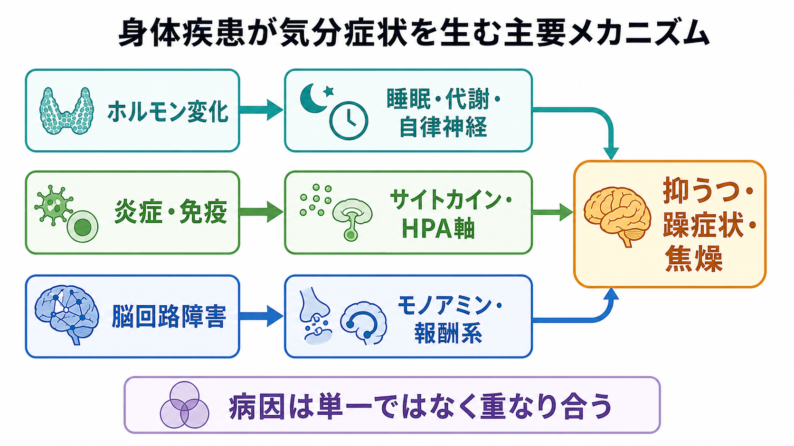

# 混合性特徴とは何か

## 要点

- 混合性特徴とは、ある気分エピソードの中に、うつ症状と躁・軽躁症状が同時に存在する状態を指す。DSM-5 以降は、従来の狭い「混合エピソード」より広く、うつ病エピソード、躁病エピソード、軽躁病エピソードに付けられる特定用語として整理された[1]。
- 臨床的に重要なのは、「気分が落ち込んでいるのに活動性・焦燥・衝動性が高い」「躁的に見えるのに絶望感や希死念慮が強い」といった、行動化しやすい組み合わせが起こりうる点である[5][6]。
- 自殺リスクは混合性特徴だけで決まるわけではない。抑うつ重症度、過去の自殺企図、物質使用、睡眠不足、焦燥、不安、支援資源などを同時に評価する必要がある[6][7]。
- 治療選択では、抗うつ薬単独を機械的に選ばないことが重要になる。双極性障害の可能性、過去の躁転、急速交代、現在の混合性特徴がある場合、抗うつ薬は慎重に扱い、気分安定薬や非定型抗精神病薬を含む選択肢を検討する文脈になる[3][4]。

## この記事で答える問い

1. 混合性特徴とは、通常の[[うつ病とは何か|うつ病]]や躁状態と何が違うのか。
2. なぜ混合性特徴は自殺リスク評価で見落としにくくする必要があるのか。
3. 抗うつ薬、気分安定薬、非定型抗精神病薬、心理社会的支援をどう考え分けるのか。
4. DSM-5 の定義にはどのような利点と限界があるのか。

## まず結論

混合性特徴は、「うつ」と「躁」を別々の箱に入れて考えるだけでは見落とされる気分状態である。たとえば、強い絶望感や希死念慮がありながら、睡眠欲求が減り、焦燥が高まり、考えが速くなり、衝動的な行動に向かいやすくなることがある。このとき危険なのは、苦痛を感じる力と、行動へ移す力が同時に存在する点である。

ただし、「混合性特徴があるから必ず自殺リスクが高い」と単純化してはいけない。長期縦断研究では、混合状態の危険性の多くは抑うつ症状そのものの重さで説明される可能性が示されており、混合性特徴はリスク評価の入口であって、単独の予測因子ではない[6][7]。臨床では、抑うつ重症度、過去の自殺企図、現在の計画性、衝動性、焦燥、睡眠、物質使用、家族や支援者との接点を組み合わせて見る。

## 背景

従来の診断体系では、「混合エピソード」は躁病エピソードと大うつ病エピソードの基準を同時に満たす、かなり狭い状態として扱われていた。DSM-5 ではこの考え方が改められ、主たる気分エピソードに、反対極性の症状が一定数加わる場合に「混合性特徴を伴う」と記述できるようになった[1]。

この変更の利点は、完全な躁病とうつ病が同時にそろわない患者でも、臨床的に重要な混合状態を記述しやすくなった点である。一方で、DSM-5 の混合性特徴は、焦燥、易刺激性、注意散漫のように、うつにも躁にも重なりうる症状を除外するため、実臨床で「混合うつ」と呼ばれてきた状態を十分拾えないという批判もある[2]。したがって、DSM-5 の特定用語は有用な共通言語だが、苦痛、焦燥、衝動性、睡眠の変化、生活機能の崩れを広く評価する姿勢が必要になる。

## 基本概念

### うつ優勢の混合性特徴

うつ優勢の場合、中心には抑うつ気分、興味・喜びの低下、疲労感、罪責感、希死念慮などがある。そのうえで、気分の高揚、誇大性、睡眠欲求の減少、多弁、観念奔逸、活動性の増加、危険な活動への関与など、躁・軽躁側の症状が加わる[1]。

臨床的には、本人が「落ち込んでいる」と訴えていても、内側では考えが止まらない、じっとしていられない、苛立ちが強い、睡眠が短いのに休めない、衝動的な判断をしやすい、といった形で現れることがある。DSM-5 の基準だけでは焦燥や易刺激性を数えないため、診断用語と臨床観察を混同しないことが重要である[2]。

### 躁・軽躁優勢の混合性特徴

躁・軽躁優勢の場合、中心には気分の高揚または易刺激性、活動性やエネルギーの増加がある。そこに、抑うつ気分、興味・喜びの低下、精神運動制止、疲労感、罪責感、死についての反復思考などが加わる[1]。外からは活動的に見えても、内面では絶望感や死にたい気持ちが強いことがあり、躁的な行動力と抑うつ的苦痛が組み合わさる。

### 双極性障害との関係

混合性特徴は、双極性障害に特有のものではない。大うつ病エピソードにも付けられる。ただし、うつ病相に軽躁的症状が混じる場合、双極スペクトラム、家族歴、若年発症、反復性、抗うつ薬による躁転、急速交代などを注意深く確認する必要がある[3]。この評価を飛ばすと、治療選択がうつ病単独の枠に固定され、薬剤選択や安全管理を誤りやすくなる。

## 仕組み

混合性特徴を単一の神経メカニズムで説明することはできない。実際には、気分の極性、覚醒水準、睡眠、報酬系、衝動制御、ストレス反応、物質使用、対人ストレスなどが重なって起こる症候群として考える方が実用的である。

自殺リスクとの関連で特に重要なのは、抑うつ的な苦痛と行動活性化が同時に存在しうる点である。抑うつだけが強いと、死にたい気持ちはあっても行動へ移すエネルギーが低いことがある。一方、混合性特徴では、焦燥、睡眠不足、衝動性、観念奔逸、活動性の上昇が加わり、短時間で危険な行動へ移る可能性が問題になる[5]。

ただし、この説明は「混合性特徴そのものが自殺行動を直接引き起こす」という意味ではない。双極性障害の縦断データでは、混合状態のリスクは抑うつ成分によってかなり説明される可能性が示されている[6][7]。したがって、臨床的には「混合性特徴があるか」だけでなく、「現在の抑うつがどれほど重いか」「計画性があるか」「過去に企図があるか」「睡眠不足や物質使用でブレーキが弱まっていないか」を同時に評価する。

## 図解

上の図は、混合性特徴を「反対極性の症状が同時にある状態」としてだけでなく、「リスク評価と治療選択を変える信号」として読むためのものである。1 枚目は、うつ症状と躁・軽躁症状の重なりが、リスク評価、治療選択、経過観察へつながることを示している。2 枚目は、抑うつの苦痛と焦燥・活動性が合流すると、希死念慮から行動への移行を慎重に見る必要があることを示している。

3 枚目は、うつ優勢の混合性特徴と躁・軽躁優勢の混合性特徴を分け、評価のチェックポイントを整理している。実際の臨床では、この図のどこに当てはまるかを機械的に決めるのではなく、主たるエピソード、反対極性の症状、双極性の手がかり、リスク要因、本人の希望を合わせて判断する。

## 臨床・研究との接続

### 自殺リスク評価

混合性特徴は、自殺リスク評価で「念のため詳しく見る」べきサインである。双極性障害の混合状態は高リスクとされてきたが、そのリスクが混合性そのものによるのか、抑うつ症状の重さによるのかは研究上も論点である[5][6][7]。2020 年のメタ解析では、躁・軽躁エピソードに混合性特徴を伴う場合、過去の自殺企図との関連が報告された一方、うつエピソードにおける混合性特徴では一貫した臨床相関が得られなかった[5]。

最近の若年者コホート研究では、13-25 歳の大うつ病エピソードに混合性特徴がある群で、6 か月追跡中の自殺企図リスク上昇が報告された[8]。ただし、地域、年齢層、診断構成、評価方法が異なるため、この知見をすべての成人や双極性障害へそのまま一般化することはできない。

臨床的には、次の項目をまとめて評価する。

- 現在の希死念慮、計画性、手段へのアクセス
- 過去の自殺企図、自傷、衝動的行動
- 抑うつ重症度、絶望感、罪責感
- 焦燥、易刺激性、観念奔逸、睡眠欲求の低下
- 物質使用、離脱、身体疾患、疼痛
- 家族・支援者との接点、安全を保てる環境

### 治療選択

治療では、まず主たるエピソードがうつ病相なのか、躁・軽躁相なのかを見立てる。次に、双極性障害の可能性、過去の躁転、急速交代、現在の混合性特徴、精神病症状、物質使用、妊娠・産後、身体疾患を確認する。

CANMAT/ISBD ガイドラインは、双極性うつ病で混合性特徴がある場合、抗うつ薬を避ける、または必要時も慎重に使うという ISBD タスクフォースの立場に同意している[3][4]。抗うつ薬単独は、双極 I 型うつ病では用いるべきでないとされる[3]。非定型抗精神病薬には、混合性特徴を伴う双極性うつ病や大うつ病エピソードに対して一定のエビデンスが報告されているが、薬剤ごとの差、適応、忍容性、副作用、本人の希望を踏まえる必要がある[3]。

心理社会的介入では、睡眠・覚醒リズムの安定、物質使用の評価、家族や支援者との安全計画、ストレス要因の整理、服薬アドヒアランス支援、早期警告サインの共有が重要になる。これは個別の治療指示ではなく、研究・教育目的の整理である。

### 研究上の論点

研究では、DSM-5 の混合性特徴が臨床現場の「混合うつ」をどれほど拾えるかが論点である。DSM-5 は操作的で比較可能性が高いが、焦燥や易刺激性を除外するため感度が下がる可能性がある[2]。また、自己記入尺度で混合性特徴を近似する場合、DSM-5 の症状構成と完全には一致しない。研究結果を読むときは、どの定義で混合性特徴を測ったのか、うつ優勢か躁優勢か、単極性か双極性かを確認する必要がある。

## よくある誤解

### 「うつと躁が半分ずつある状態である」

混合性特徴は、うつと躁が同じ量だけ混ざる状態ではない。主たる気分エピソードがあり、そこに反対極性の症状が加わると考える方が理解しやすい。うつ優勢と躁・軽躁優勢では、評価と治療の力点が変わる。

### 「元気そうなら自殺リスクは低い」

活動性があることは、必ずしも安全を意味しない。抑うつ的な苦痛、焦燥、睡眠不足、衝動性が同時にある場合、行動化の危険を丁寧に評価する必要がある[5][8]。

### 「抗うつ薬を増やせばよい」

混合性特徴や双極性障害の可能性がある場合、抗うつ薬は単純な第一選択とは限らない。特に双極 I 型うつ病では抗うつ薬単独は推奨されず、混合性特徴や急速交代がある場合は慎重さが求められる[3][4]。

### 「DSM-5 の基準を満たさなければ混合状態ではない」

DSM-5 の特定用語は共通言語として重要だが、臨床的な混合状態をすべて拾うわけではない。焦燥、易刺激性、注意散漫、睡眠不足、衝動性のような重なり症状は、診断基準上の扱いとは別に安全評価で重要になる[2]。

## 関連ノート

- [[うつ病とは何か]]
- 関連ノート候補: 双極性障害とは何か
- 関連ノート候補: 躁病エピソードとは何か
- 関連ノート候補: 軽躁病エピソードとは何か
- 関連ノート候補: 自殺リスク評価とは何か
- 関連ノート候補: 抗うつ薬による躁転とは何か
- 関連ノート候補: 気分安定薬とは何か

## 理解チェック

1. 混合性特徴は、主たる気分エピソードに何が加わる状態か。
2. うつ優勢の混合性特徴で、自殺リスク評価上とくに注意すべき組み合わせは何か。
3. 混合性特徴と自殺リスクの関係を、なぜ「混合性そのもの」だけで説明してはいけないのか。
4. 抗うつ薬単独を慎重に考えるべき状況を 2 つ挙げられるか。

## 参考文献

[1] American Psychiatric Association. (2013). *Mixed Features Specifier*. https://www.psychiatry.org/File%20Library/Psychiatrists/Practice/DSM/APA_DSM-5-Mixed-Features-Specifier.pdf

[2] Verdolini, N., Agius, M., Ferranti, L., Moretti, P., Piselli, M., & Quartesan, R. (2015). The State of the Art of the DSM-5 "with Mixed Features" Specifier. *The Scientific World Journal*, 2015, 757258. https://doi.org/10.1155/2015/757258

[3] Yatham, L. N., Kennedy, S. H., Parikh, S. V., Schaffer, A., Bond, D. J., Frey, B. N., et al. (2018). Canadian Network for Mood and Anxiety Treatments and International Society for Bipolar Disorders 2018 guidelines for the management of patients with bipolar disorder. *Bipolar Disorders*, 20(2), 97-170. https://pmc.ncbi.nlm.nih.gov/articles/PMC5947163/

[4] Pacchiarotti, I., Bond, D. J., Baldessarini, R. J., Nolen, W. A., Grunze, H., Licht, R. W., et al. (2013). The International Society for Bipolar Disorders task force report on antidepressant use in bipolar disorders. *American Journal of Psychiatry*, 170(11), 1249-1262. https://doi.org/10.1176/appi.ajp.2013.13020185

[5] Bartoli, F., Crocamo, C., & Carrà, G. (2020). Clinical correlates of DSM-5 mixed features in bipolar disorder: A meta-analysis. *Journal of Affective Disorders*, 276, 234-240. https://doi.org/10.1016/j.jad.2020.07.035

[6] Persons, J. E., Coryell, W. H., Solomon, D. A., et al. (2018). Mixed State and Suicide: Is the effect of mixed state on suicidal behavior more than the sum of its parts? *Bipolar Disorders*, 20(1), 35-41. https://doi.org/10.1111/bdi.12538

[7] Fiedorowicz, J. G., Persons, J. E., Assari, S., Ostacher, M. J., Zandi, P., Wang, P. W., et al. (2019). Depressive symptoms carry an increased risk for suicidal ideation and behavior in bipolar disorder without any additional contribution of mixed symptoms. *Journal of Affective Disorders*, 246, 775-782. https://doi.org/10.1016/j.jad.2018.12.057

[8] Lin, K., He, Y., Zhang, J., et al. (2026). Mixed features and suicide attempts in youth depression: a six-month follow-up study. *BMC Psychiatry*, 26, 134. https://doi.org/10.1186/s12888-026-07783-x

## 未解決問題

- DSM-5 の混合性特徴と、臨床現場で観察される焦燥・易刺激性を中心とした混合うつをどのように接続するか。
- 混合性特徴が自殺リスクを高める場合、その効果が抑うつ重症度、衝動性、睡眠不足、物質使用のどれを介するのか。
- うつ優勢の混合性特徴に対して、どの薬物療法・心理社会的介入・安全計画の組み合わせが、どの患者群で最も有効か。

## MOC更新候補

- `content/00_MOC/` 配下の精神医学、気分障害、双極性障害、自殺リスク関連 MOC に `[[混合性特徴とは何か]]` を追加する候補。
- 並列ジョブとの競合を避けるため、本タスクでは MOC ファイル自体は更新しない。
