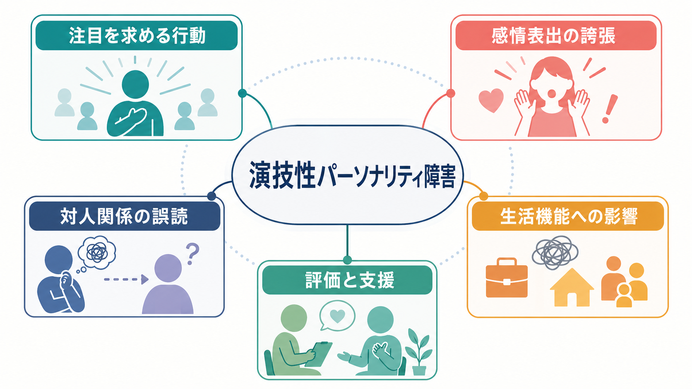
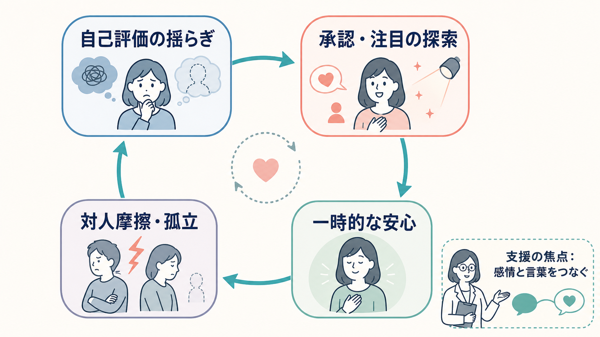
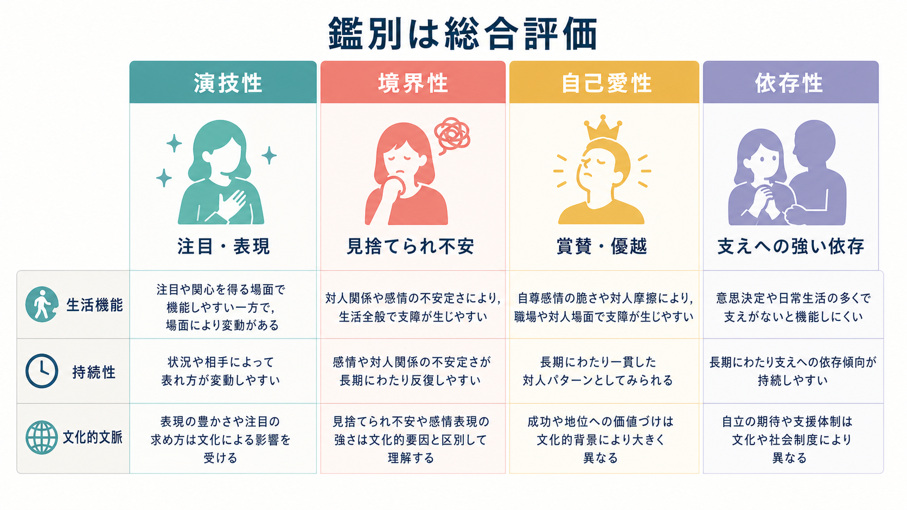

# 演技性パーソナリティ障害とは何か

## 要点

- 演技性パーソナリティ障害は、過度の情動性と注目を求める行動が、成人早期から複数の場面で持続し、対人関係や生活機能に影響する状態として記述される[1][2]。
- 中核は「目立つ人」や「感情表現が豊かな人」という性格評価ではない。問題になるのは、注目や承認を得るための対人方略が硬直し、関係の誤解、失望、衝突、孤立を反復しやすくなる点である[2][3]。
- DSM-5-TRではクラスターBのパーソナリティ障害として扱われる一方、ICD-11では個別の「演技性」というカテゴリを原則として立てず、パーソナリティ機能の重症度と特性領域で記述する方向へ移っている[1][4][5]。
- 診断・評価では、[[双極性障害とは何か|躁病・軽躁病]]、[[身体症状症とは何か]]、[[変換症とは何か]]、他のパーソナリティ病理、文化的な表現規範との鑑別が重要である[2][3]。
- 支援では、診断名をラベルとして貼るより、感情を言葉にする、対人場面の予測を点検する、短期的な注目獲得と長期的な関係維持のずれを扱う、といった[[ケースフォーミュレーションとは何か|ケースフォーミュレーション]]が実用的である[2][8]。

## この記事で答える問い

1. 演技性パーソナリティ障害は、単なる「目立ちたがり」と何が違うのか。
2. DSM-5-TRとICD-11では、この病態をどう位置づけるのか。
3. 注目を求める行動や感情表出の誇張は、どのような対人循環として理解できるのか。
4. 臨床・研究では、どのような鑑別と支援上の注意が必要なのか。

## まず結論

演技性パーソナリティ障害とは、注目や承認を得ることが対人関係の中心になりやすく、感情表出、外見、話し方、親密さの読み取りが過度に劇的または印象的になり、その結果として本人や周囲に苦痛・機能障害が生じるパターンである[1][2]。ただし、この説明は「芝居がかった人」「派手な人」を診断するためのものではない。

重要なのは、行動が一時的か、場面限定的か、文化的に期待される表現か、それとも成人早期から複数の文脈で反復し、仕事、学業、親密な関係、医療利用、自己評価の安定に影響しているかである[1][2]。したがって、診断名は出発点であって、本人の困りごとを説明し尽くすものではない。

## 背景

DSM-5-TRでは、演技性パーソナリティ障害は「過度の情動性と注目追求」の広範なパターンとして定義され、クラスターBに含められる[1]。クラスターBは、劇的・情動的・不安定に見えやすいパーソナリティ障害群を便宜的にまとめた分類であり、演技性、境界性、自己愛性、反社会性が含まれる。もっとも、クラスター分類の臨床的有用性には限界があり、実際の人は一つの箱にきれいに収まらない[2][5]。

ICD-11では、従来の個別カテゴリを大幅に縮小し、パーソナリティ障害をまず自己機能と対人機能の障害、重症度、持続性、文脈横断性で評価する。さらに、否定的感情、離隔、非社会性、脱抑制、強迫性などの特性領域を必要に応じて付記する[4][5]。この見方では、「演技性」という名前よりも、注目追求、情動の不安定さ、脱抑制、対人関係の近さの誤読が、どの程度の機能障害につながっているかが重視される。

疫学的には、パーソナリティ障害全体は地域住民にも一定程度みられる。地域住民研究のメタ分析では、任意のパーソナリティ障害の世界的な統合有病率は7.8%と推定されたが、研究方法や地域による異質性が大きく、個別診断ごとの推定には注意が必要である[6]。演技性パーソナリティ障害についても、古い研究や臨床標本に依存する部分が大きく、性差の推定には診断バイアスが混じりうる[2][3]。

## 基本概念

### 診断基準の骨格

DSM-5-TRに基づく説明では、成人早期に始まり、複数の文脈で現れる過度の情動性と注目追求が中心になる[1]。典型的には、注目の中心でないと不快、性的または挑発的に見える対人行動、急速に変化し浅く見える感情表出、外見による注目獲得、印象的だが詳細に乏しい話し方、劇的な自己表現、被暗示性、関係を実際より親密に捉える傾向などが評価される[1][2]。

ただし、これらをチェックリストのように自己診断へ使うのは危うい。たとえば、外見への関心、感情表現の豊かさ、親密な話し方は、文化、職業、世代、ジェンダー規範、トラウマ歴、発達特性、躁状態、薬物、ストレス状況によって大きく変わる。臨床評価では、[[MSEで外観と行動から何を観察するか|外観と行動]]や[[MSEで気分と感情をどう区別するか|気分と感情]]の観察だけでなく、長期の生活史と関係パターンを統合する必要がある[2][3]。

### 「注目を求める」とは何を意味するか

注目を求めること自体は病的ではない。人は誰でも、承認、所属、親密さ、評価を必要とする。問題になるのは、注目が得られない場面で強い不安や空虚感が生じ、短期的に反応を引き出す行動が優先され、長期的な信頼関係や役割遂行が損なわれる場合である[2][3]。

そのため、演技性パーソナリティ障害を理解するうえでは、「本人がわざと大げさにしている」と単純化しない方がよい。臨床的には、感情をうまく言葉にできない、相手の反応を過度に自己価値の手がかりにする、関係の親密さを早く見積もる、退屈や待機に弱い、という複数の過程が重なることがある[2][8]。

## 仕組み

演技性パーソナリティ障害に単一の原因モデルはない。遺伝、気質、発達環境、愛着経験、トラウマ、社会的学習、文化的な表現規範が複合的に関わる可能性が論じられるが、決定的な生物学的機序が確立しているわけではない[3]。したがって、「原因は親」「原因は性格」「原因は脳」と一つに固定する説明は避ける必要がある。

臨床的に使いやすい仮説は、対人フィードバックの循環として見ることである。自己評価が揺らぐと、承認や注目を通じて自分の価値を確かめようとする。劇的な表現、外見、親密な語り、感情の強い提示は、短期的には反応を引き出しやすい。しかし、相手が疲弊したり、境界を引いたり、本人の意図を誤解したりすると、対人摩擦や孤立が生じる。その結果、さらに自己評価が揺らぎ、再び注目探索が強まる、という循環が起こりうる[2][8]。

この循環は、本人の責任を追及するための図ではない。むしろ、支援の焦点を具体化するための図である。どの場面で自己評価が揺らぐのか、どの反応を「拒絶」や「愛情」と読みやすいのか、どの行動が短期的には役立つが長期的には関係を壊すのかを、本人と支援者が共同で検討するために使える。

## 図解

1枚目の図は、演技性パーソナリティ障害を「注目を求める行動」「感情表出の誇張」「対人関係の誤読」「生活機能への影響」「評価と支援」の5領域で整理している。診断名を中心に置くのではなく、生活上の困難へつながる複数の経路を見渡すための図である。

2枚目の図は、自己評価の揺らぎから承認・注目の探索、一時的な安心、対人摩擦・孤立へ進み、再び自己評価の揺らぎへ戻る循環を示している。支援では、この循環を止めるために、感情と言葉をつなぎ、行動の前に体験を整理することが重要になる。

3枚目の図は、演技性、境界性、自己愛性、依存性の違いを、診断の早見表ではなく[[鑑別診断とは何か|鑑別診断]]の観点として示している。実際の臨床では併存や重なりが多いため、単一の特徴だけで決めない。

## 臨床・研究との接続

### 評価の実際

演技性パーソナリティ障害を疑う場面でも、評価は横断面の印象だけで行わない。複数回の面接、生活史、家族・職場・学校での機能、併存症、身体疾患、物質使用、文化的文脈を統合する必要がある[2][3]。本人が「問題は周囲の理解不足だけだ」と感じている場合もあれば、周囲が「大げさ」と見なして本人の苦痛を過小評価している場合もある。

鑑別では、躁病・軽躁病が重要である。双極性障害では、気分の高揚または易怒性、活動性・エネルギーの増加、睡眠欲求の低下、観念奔逸、危険行動などがエピソード性に出現しうる。一方、演技性パーソナリティ障害では、対人関係と自己評価に関わる長期的なパターンとして現れやすい[2][3]。この区別は、未作成ノート候補「パーソナリティ障害と双極性障害はどう鑑別するのか」として展開できる。

また、身体症状症や変換症との重なりにも注意が必要である。身体症状や医療利用があるからといって、演技性と決めることはできない。実際の身体疾患、疼痛、解離、トラウマ、抑うつ、不安、医療不信が背景にあることもある。診断は、症状を疑うためではなく、苦痛と機能障害をより安全に理解するために使う。

### 研究上の論点

演技性パーソナリティ障害は、カテゴリとしての妥当性に議論がある。DSM-IV時代の臨床標本研究では、演技性パーソナリティ障害の有病率が低く、他のパーソナリティ障害との併存が高く、基準の内的一貫性にも限界があることが報告された[7]。このような知見は、ICD-11が個別カテゴリよりも重症度と特性領域を重視する方向に移った背景とも整合する[4][5]。

治療研究も限定的である。一般にパーソナリティ障害の支援では心理社会的治療が中心で、薬物療法は診断名そのものを治すというより、併存する抑うつ、不安、衝動性、睡眠問題などを慎重に扱う場合がある[2][3]。演技性パーソナリティ障害に特化したエビデンスは少ないが、明確化志向心理療法の自然istic研究では、治療関係やセッション内の変化過程が症状改善と関連することが示唆されている[8]。ただし、この結果をすぐに標準治療として一般化するには、研究デザインと対象集団の限界を考慮する必要がある。

## よくある誤解

### 誤解1: 「派手な人」「感情表現が大きい人」は演技性である

感情表現や外見のスタイルは、文化、職業、個人の価値観によって大きく異なる。診断で問題になるのは、表現の大きさそのものではなく、それが長期的・文脈横断的に機能障害や苦痛へつながっているかである[1][2]。

### 誤解2: 本人はいつも計算して周囲を操作している

一部の行動は周囲から操作的に見えることがある。しかし、本人の内側では不安、空虚感、承認への強い依存、感情を言葉にしにくい状態が関わっていることもある[2][8]。支援では、意図の断定よりも、行動がどのような機能を持っているかを検討する方が有用である。

### 誤解3: 女性に多い病気である

歴史的には女性に多いとされてきたが、診断バイアスや医療機関標本の影響が指摘されている。Merck Manualは、一般人口での推定有病率は2%未満で、女性と男性の有病率は同程度と説明している[2]。したがって、ジェンダー規範に基づいて診断を急ぐことは避ける。

### 誤解4: 診断名がつけば治療法は決まる

演技性パーソナリティ障害に特異的で強固な治療エビデンスは限られている[2][3]。実際には、本人が困っている場面、併存症、自傷・自殺リスク、物質使用、家族関係、職業機能、治療関係の安定性を見ながら、支援計画を組み立てる必要がある。

## 関連ノート

- [[DSMとICDは何が違うのか]]
- [[鑑別診断とは何か]]
- [[ケースフォーミュレーションとは何か]]
- [[MSEで外観と行動から何を観察するか]]
- [[MSEで気分と感情をどう区別するか]]
- [[双極性障害とは何か]]
- [[身体症状症とは何か]]
- [[変換症とは何か]]

### 関連ノート候補

- パーソナリティ障害群とは何か
- パーソナリティ機能の障害とは何か
- 境界性パーソナリティ障害とは何か
- 自己愛性パーソナリティ障害とは何か
- 依存性パーソナリティ障害とは何か
- パーソナリティ障害と双極性障害はどう鑑別するのか
- パーソナリティ障害と発達特性はどう鑑別するのか

### MOC更新候補

- `content/00_MOC/MOC｜精神医学.md`
- `content/00_MOC/MOC｜臨床心理学.md`
- `content/00_MOC/MOC｜心理療法.md`

## 理解チェック

1. 演技性パーソナリティ障害を「目立ちたがり」と同一視できない理由は何か。
2. DSM-5-TRのカテゴリ診断とICD-11の次元的診断では、どの点が異なるか。
3. 注目を求める行動が、短期的な安心と長期的な対人摩擦を同時に生むのはなぜか。
4. 躁病・軽躁病、身体症状症、他のパーソナリティ病理との鑑別で確認すべき情報は何か。
5. 支援において、感情表出を抑え込むことだけを目標にすると、どのような問題が起こりうるか。

## 参考文献

[1] American Psychiatric Association. (2022). *Diagnostic and Statistical Manual of Mental Disorders, Fifth Edition, Text Revision (DSM-5-TR).* American Psychiatric Association Publishing. https://doi.org/10.1176/appi.books.9780890425787

[2] Zimmerman, M. (2026). *Histrionic Personality Disorder (HPD).* Merck Manual Professional Edition. Reviewed/Revised Sept 2023; Modified Jan 2026. https://www.merckmanuals.com/professional/psychiatric-disorders/personality-disorders/histrionic-personality-disorder-hpd

[3] Torrico, T. J., French, J. H., Aslam, S. P., & Shrestha, S. (2024). *Histrionic Personality Disorder.* StatPearls. National Center for Biotechnology Information. https://www.ncbi.nlm.nih.gov/books/NBK542325/

[4] World Health Organization. (2024). *Clinical descriptions and diagnostic requirements for ICD-11 mental, behavioural and neurodevelopmental disorders.* World Health Organization. https://www.who.int/publications/i/item/9789240077263

[5] Clark, L. A., Corona-Espinosa, A., Khoo, S., Kotelnikova, Y., Levin-Aspenson, H. F., Serapio-García, G., & Watson, D. (2021). Preliminary scales for ICD-11 personality disorder: Self and interpersonal dysfunction plus five personality disorder trait domains. *Frontiers in Psychology, 12*, 668724. https://doi.org/10.3389/fpsyg.2021.668724

[6] Winsper, C., Bilgin, A., Thompson, A., Marwaha, S., Chanen, A. M., Singh, S. P., Wang, A., & Furtado, V. (2020). The prevalence of personality disorders in the community: A global systematic review and meta-analysis. *British Journal of Psychiatry, 216*(2), 69-78. https://doi.org/10.1192/bjp.2019.166

[7] Bakkevig, J. F., & Karterud, S. (2010). Is the Diagnostic and Statistical Manual of Mental Disorders, Fourth Edition, histrionic personality disorder category a valid construct? *Comprehensive Psychiatry, 51*(5), 462-470. https://doi.org/10.1016/j.comppsych.2009.11.009

[8] Babl, A., Gómez Penedo, J. M., Berger, T., Schneider, N., Sachse, R., & Kramer, U. (2023). Change processes in psychotherapy for patients presenting with histrionic personality disorder. *Clinical Psychology & Psychotherapy, 30*(1), 64-72. https://doi.org/10.1002/cpp.2769

## 未解決問題

- 演技性パーソナリティ障害を独立カテゴリとして残すべきか、ICD-11のように特性領域として記述する方が妥当か。
- 注目追求、情動表出、被暗示性、親密さの誤読は、同じ機序の表れなのか、異なる下位過程の集合なのか。
- どの心理療法要素が、演技性パーソナリティ病理に特異的に有効なのか。
- ジェンダー、文化、職業的表現規範による診断バイアスを、臨床評価でどこまで補正できるのか。
