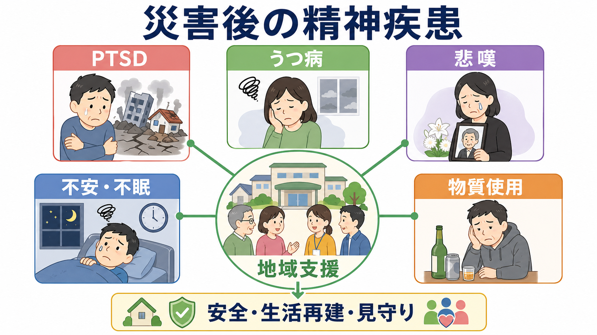
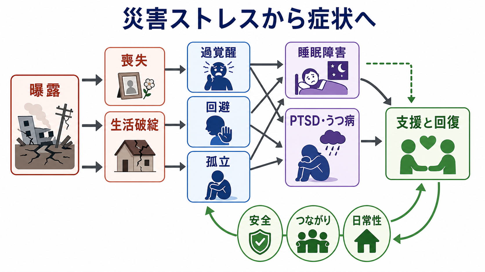
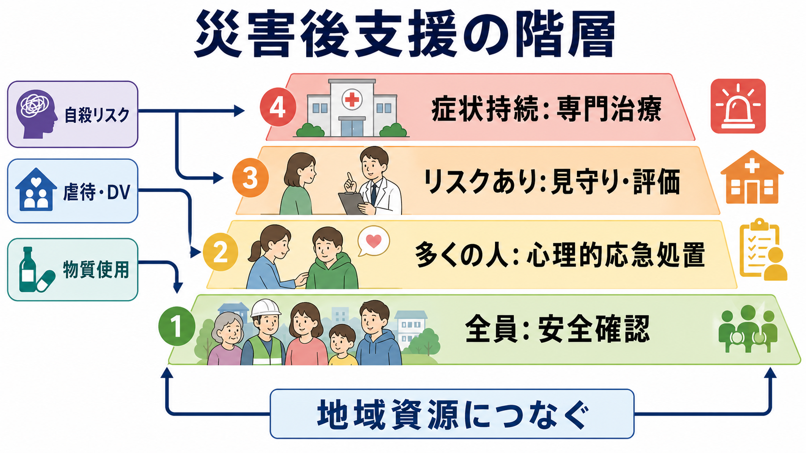

# 災害後に生じる精神疾患には何があるのか

## 要点

- 災害後には、[[PTSDとは何か|PTSD]]、[[うつ病とは何か|うつ病]]、[[複雑性悲嘆とは何か|複雑性悲嘆]]、[[不眠障害とは何か|不眠]]、[[全般不安症とは何か|不安症状]]、[[アルコール使用障害とは何か|アルコール使用障害]]などが問題になる。
- ただし、被災直後の不安、悲しみ、怒り、睡眠困難は多くの場合「異常な出来事への通常の反応」であり、すぐに疾患名へ置き換えない。
- 支援の中心は、診断名を早く付けることではなく、安全、生活再建、情報、つながり、必要時の専門治療を段階的につなぐことである。
- 自殺リスク、暴力・虐待、重い精神疾患、物質使用、服薬中断、孤立は早めに評価し、地域資源と医療へつなぐ。

## この記事で答える問い

災害後の精神的不調を、どこまで正常な苦痛として見守り、どこから精神疾患や専門支援の対象として考えるべきか。この記事では、個別診断ではなく教育・研究目的として、災害後に多い疾患群と地域支援の考え方を整理する。

## まず結論

災害後に生じる精神疾患は、単一の「災害トラウマ反応」ではない。生命の危険、目撃体験、喪失、避難生活、失業、地域の分断、医療中断が重なり、PTSD、うつ病、不安症状、不眠、悲嘆の遷延、物質使用、自殺リスク、既存疾患の悪化として現れる[1][2]。一方で、多くの人は一時的な苦痛を経験しながらも、家族・地域・生活基盤の回復に支えられて自然に改善する[1][5]。

したがって災害後支援では、全員を患者化するのではなく、全員に安全と情報を届け、困難が続く人を見守り、機能障害や危険が明らかな人を専門ケアへつなぐ「段階的ケア」が基本になる[2][3][4]。

## 背景

WHO は、緊急事態ではほぼすべての人が心理的苦痛を経験し、一部の人がうつ病、不安、PTSD、重い精神疾患、物質使用などへ移行すると整理している[1]。ここで重要なのは、災害の影響が「災害そのもの」だけで決まらない点である。家族の死亡、住居喪失、避難所の過密、生活資源の不足、差別、情報不足、支援体制の混乱も、精神健康を悪化させる独立した要因になる[1][2]。

災害後の研究レビューでも、重い心理的障害は被災者全員に起こるわけではない一方、PTSD、抑うつ、悲嘆、不安、身体化、物質使用、自殺念慮は一貫して報告されている[5][6]。災害精神医学では、個人の症状だけでなく、地域の結束、相互扶助、支援へのアクセス、医療継続性を同時に見る必要がある。

## 基本概念

### 急性ストレス反応とPTSD

災害直後には、過覚醒、ぼんやりする感じ、涙もろさ、怒り、悪夢、身体のこわばり、集中困難が起こりうる。これらは短期的には自然な反応であり、休息、安全確保、正確な情報、生活支援によって軽くなることが多い[3]。

PTSD は、生命の危険、重傷、性的暴力、死の目撃などの外傷体験の後に、侵入症状、回避、認知・気分の陰性変化、過覚醒が1か月を超えて続き、生活機能を損なう場合に考える[7]。災害では、津波・地震・火災などの直接曝露だけでなく、家族の死亡、救助活動での凄惨な体験、反復する報道接触も負荷になる。

### うつ病と適応障害

[[うつ病とは何か|うつ病]]は、抑うつ気分、興味・喜びの低下、睡眠や食欲の変化、罪責感、集中困難、希死念慮などが持続し、生活機能を損なう状態である。災害後には、喪失、将来不安、経済的困難、役割喪失、孤立が重なり、[[適応障害とは何か|適応障害]]やうつ病として現れることがある[1][4]。

PTSDとうつ病は併存しやすく、侵入記憶や過覚醒が疲弊を強め、抑うつが回避や社会的引きこもりを強める悪循環を作る。既存ノートでは [[PTSDとうつ病はどう併存するのか]] も参照できる。

### 悲嘆と遷延する悲嘆

災害では、突然死、遺体確認の困難、葬儀や別れの儀式の中断、家族分離が起こりやすい。悲嘆そのものは疾患ではないが、強い憧憬や故人への没頭、死の受け入れ困難、生活への再参加困難が長く続き、文化的・宗教的文脈を超えて機能障害をもたらす場合、遷延性悲嘆症や複雑性悲嘆を考える[8]。

うつ病との違いは、中心にある感情が「全般的な無価値感」だけでなく、故人・失われた生活・未完の別れへの持続的な没頭である点にある。関連する鑑別は [[複雑性悲嘆とは何か]] と [[喪失反応と大うつ病はどう違うのか]] が近い。

### 物質使用と依存症

災害後には、眠れない、考えたくない、寒さや不安をしのぎたいという理由で、アルコール、睡眠薬、鎮痛薬、ニコチン、違法薬物への依存が強まることがある[1][5]。既存の [[アルコール使用障害とは何か|アルコール使用障害]]、[[オピオイド使用障害とは何か|オピオイド使用障害]]、[[ニコチン使用障害とは何か|ニコチン使用障害]] が悪化する場合もある。

物質使用は短期的には苦痛を鈍らせるが、睡眠の質、抑うつ、不安、家庭内葛藤、自殺リスクを悪化させうる。避難所や仮設住宅では、物資配布、孤立対策、薬剤管理、依存症支援の連携が必要になる。

## 仕組み

災害後の症状は、外傷記憶だけで説明できない。少なくとも三つの層が重なる。

第一に、生命の危険や死傷の目撃は、恐怖記憶、過覚醒、回避を強める。これはPTSD症状の中心になりやすい[7]。第二に、家族・住居・職業・地域の喪失は、悲嘆、抑うつ、無力感を強める[5][6]。第三に、避難生活、情報不足、経済不安、社会的孤立は、睡眠障害、物質使用、家族内葛藤、既存疾患の悪化を長引かせる[1][2]。

このため、治療だけでなく、住まい、学校、職場、福祉、地域活動、プライマリケアを含む支援設計が症状の経過に影響する。社会的支援は、単なる「よい雰囲気」ではなく、回復の条件そのものとして扱う必要がある。関連して [[社会的支援は健康にどう影響するのか]] と [[地域連携は精神科診療で何を意味するのか]] が参照できる。

## 図解

災害後支援は、疾患別の専門治療だけでなく、支援の階層で考えると整理しやすい。

| 支援の層 | 主な対象 | 目的 | 例 |
|---|---|---|---|
| 全員への基本支援 | 被災地域全体 | 安全、情報、生活基盤を整える | 避難、食料、水、睡眠環境、正確な情報 |
| 心理的応急処置 | 急性の苦痛が強い人 | 落ち着ける、話を聴く、支援へつなぐ | PFA、家族再会、相談窓口 |
| 見守りと評価 | リスクがある人 | 悪化や孤立を早期に見つける | 高齢者、子ども、喪失体験、既往歴、物質使用 |
| 専門治療 | 症状が持続・重症な人 | PTSD、うつ病、物質使用、自殺リスクに対応 | 精神科、心理療法、薬物療法、依存症支援 |

## 臨床・研究との接続

IASC ガイドラインは、災害時の支援を保健医療だけに閉じず、保護、教育、食料、住居、水衛生、コミュニティ動員と統合することを重視する[2]。また、被災者全員がトラウマ化していると決めつけず、強い苦痛を抱える人にアクセス可能な支援を用意することが求められる[2]。

心理的応急処置（PFA）は、早期の専門的心理療法ではなく、安全を確認し、落ち着いて話を聴き、必要な資源へつなぐ実践である[3]。一方、単回の強制的な心理的デブリーフィングを一般集団へ一律に行うことは推奨されない[2]。

WHO/UNHCR の mhGAP-HIG は、専門家が不足する人道危機で、非専門医療者が急性ストレス、悲嘆、うつ病、PTSD、精神病、てんかん、知的障害、物質使用、自殺リスクを評価・管理するための実用的ガイドである[4]。これは、災害精神医療を専門病院だけで完結させず、一般医療、地域保健、福祉、学校、支援団体へ広げる発想と合う。

## よくある誤解

### 「被災者はみなPTSDになる」

誤りである。災害後に苦痛は広く生じるが、重い障害が全員に起こるわけではない。レビューでは、深刻な心理的障害は少数派であり、多くの人には回復やレジリエンスの軌道があると整理されている[5]。

### 「早く詳しく話してもらえば回復する」

安全や同意なしに体験を詳しく語らせることは、支援ではなく負担になりうる。PFA は、話すことを強制せず、本人のペースで聴き、現実的なニーズと支援先につなぐ[3]。

### 「悲嘆は治療対象にしてはいけない」

通常の悲嘆を疾患化してはいけないが、生活機能を大きく損なう悲嘆が長期に続く場合は支援対象になる[8]。大切なのは、文化的な喪の過程を尊重しつつ、自殺リスク、孤立、抑うつ、物質使用を見逃さないことである。

### 「専門職が来るまで地域には何もできない」

災害後の回復には、地域の情報共有、見守り、学校や職場の再開、孤立予防、生活再建が大きく関わる[1][2]。専門職は重要だが、地域資源と切り離された専門治療だけでは十分ではない。

## 関連ノート

- [[PTSDとは何か]]
- [[PTSDとうつ病はどう併存するのか]]
- [[うつ病とは何か]]
- [[複雑性悲嘆とは何か]]
- [[喪失反応と大うつ病はどう違うのか]]
- [[不眠障害とは何か]]
- [[全般不安症とは何か]]
- [[アルコール使用障害とは何か]]
- [[自殺関連行動障害とは何か]]
- [[自殺リスク評価では何を聞くべきか]]
- [[地域連携は精神科診療で何を意味するのか]]
- [[社会的支援は健康にどう影響するのか]]

## 理解チェック

1. 災害直後の不眠や不安を、すぐに精神疾患と呼ばない方がよい理由は何か。
2. PTSD、うつ病、複雑性悲嘆は、中心となる症状や時間経過がどのように異なるか。
3. 物質使用が災害後支援で重要な評価項目になるのはなぜか。
4. 心理的応急処置と専門的心理療法は何が違うか。
5. 地域支援が精神症状の回復に関わる経路を一つ説明できるか。

## 未解決問題

- 災害の種類、文化、地域資源によって、PTSD、うつ病、悲嘆、物質使用の相対的な比重がどう変わるか。
- SNS、報道接触、遠隔地からの二次的曝露が、災害後メンタルヘルスにどの程度影響するか。
- 被災地の長期的な人口移動、地域コミュニティの変化、経済復興が精神疾患の慢性化にどう関わるか。
- PFA や地域見守りを、過剰介入にならず、かつハイリスク者を取りこぼさない形で実装する方法。

## MOC更新候補

- `content/00_MOC/` 配下の精神医学、災害精神医学、地域支援に関する MOC へ追加候補。
- 並列ジョブとの衝突を避けるため、この作業では MOC 本体は更新しない。

## 参考文献

[1] World Health Organization. (2025). *Mental health in emergencies*. https://www.who.int/news-room/fact-sheets/detail/mental-health-in-emergencies

[2] Inter-Agency Standing Committee. (2007). *IASC Guidelines on Mental Health and Psychosocial Support in Emergency Settings*. https://www.who.int/publications-detail-redirect/iasc-guidelines-for-mental-health-and-psychosocial-support-in-emergency-settings

[3] World Health Organization, War Trauma Foundation, & World Vision International. (2011). *Psychological first aid: Guide for field workers*. https://www.who.int/mental_health/publications/guide_field_workers/en/

[4] World Health Organization & United Nations High Commissioner for Refugees. (2015). *mhGAP Humanitarian Intervention Guide: Clinical management of mental, neurological and substance use conditions in humanitarian emergencies*. https://www.who.int/southeastasia/publications/i/item/9789241548922

[5] Bonanno, G. A., Brewin, C. R., Kaniasty, K., & La Greca, A. M. (2010). Weighing the costs of disaster: Consequences, risks, and resilience in individuals, families, and communities. *Psychological Science in the Public Interest, 11*(1), 1-49. https://doi.org/10.1177/1529100610387086

[6] Goldmann, E., & Galea, S. (2014). Mental health consequences of disasters. *Annual Review of Public Health, 35*, 169-183. https://doi.org/10.1146/annurev-publhealth-032013-182435

[7] U.S. Department of Veterans Affairs, National Center for PTSD. (2026). *PTSD and DSM-5*. https://www.ptsd.va.gov/professional/treat/essentials/dsm5_ptsd.asp

[8] Prigerson, H. G., Boelen, P. A., Xu, J., Smith, K. V., & Maciejewski, P. K. (2021). Validation of the new DSM-5-TR criteria for prolonged grief disorder and the PG-13-Revised scale. *World Psychiatry, 20*(1), 96-106. https://pmc.ncbi.nlm.nih.gov/articles/PMC7801836/
