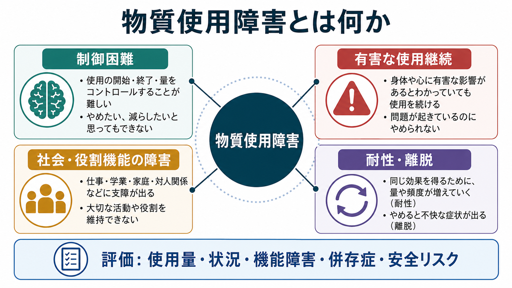
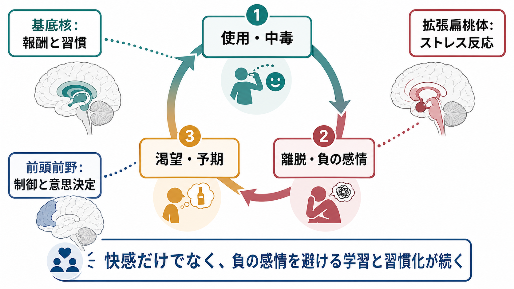

# 物質使用障害とは何か

## 要点

- 物質使用障害は、アルコール、ニコチン、大麻、オピオイド、鎮静薬、刺激薬などの使用が、本人の健康、生活、対人関係、役割機能に明らかな支障をもたらしても、使用の調整が難しくなる状態を指す。
- DSM-5-TRでは、制御困難、社会的障害、危険な使用、耐性・離脱などを含む11項目で重症度を評価する。ICD-11では、有害な使用パターン、依存、単回の有害使用、危険な使用などが整理されている[1][2]。
- 「意思が弱い」「道徳的に問題がある」という説明では不十分である。反復使用は[[報酬系とは何か|報酬系]]、ストレス反応、習慣学習、前頭前野による制御に影響し、渇望や再使用リスクを高める[3][4][5]。
- 治療と支援は、急性中毒や離脱の安全管理、併存する精神・身体疾患の評価、心理社会的支援、薬物療法、再発予防、家族・地域支援を組み合わせて考える[6][7]。
- 医療・支援の場では、診断名だけでなく、本人がどの物質を、どの状況で、何のために使っているのか、そして何を守りたいのかを丁寧に聞く必要がある。

## この記事で答える問い

1. 物質使用障害は、単なる「使いすぎ」や「依存」と何が違うのか。
2. なぜ、本人がやめたいと思っていても使用が続くことがあるのか。
3. 評価では、使用量だけでなく何を確認する必要があるのか。
4. 治療・支援では、何を組み合わせて考えるべきか。

## まず結論

物質使用障害は、物質そのものの薬理作用だけで決まる状態ではない。物質の作用、学習、ストレス、社会環境、精神疾患、身体疾患、生活上の困難が重なり、使用の開始・量・頻度・中止を自分の意図どおりに調整しにくくなった状態である。

DSM-5-TRの枠組みでは、物質使用障害は「制御困難」「社会的障害」「危険な使用」「薬理学的特徴」の4群に整理できる。たとえば、予定より多く使う、やめようとしてもうまくいかない、渇望が強い、仕事や学業や家庭で支障が出る、危険な状況でも使う、身体・精神の問題が悪化していると分かっていても続ける、耐性や離脱がある、といった所見である[1]。ICD-11でも、物質による障害は、依存だけでなく有害な使用パターンや単回の有害使用を含む広い臨床概念として扱われる[2]。

したがって、臨床的には「どの物質か」だけでなく、「どの程度、生活が狭まり、危険が増え、本人の価値や目標とずれているか」を評価することが重要になる。

## 背景

物質使用障害は、精神医学、神経科学、公衆衛生、司法、福祉、家族支援が交差する領域である。対象となる物質には、アルコール、ニコチン、大麻、オピオイド、鎮静薬・睡眠薬・抗不安薬、コカイン、アンフェタミン型刺激薬、幻覚薬、吸入剤などが含まれる。合法物質や処方薬でも、使用の文脈によっては重い障害をもたらしうる。

米国の2024年NSDUHでは、12歳以上の16.8%、約4,840万人が過去1年に物質使用障害の基準を満たしたと推定されている[8]。この数値をそのまま日本に外挿することはできないが、物質使用障害が一部の特殊な人だけの問題ではなく、医療、教育、労働、家族、地域支援にまたがる一般的な健康課題であることを示している。

一方で、物質使用障害はスティグマを受けやすい。本人の責任だけに還元すると、受診や相談が遅れ、[[スティグマとは何か|スティグマ]]が悪循環を強める。教育・研究目的で理解するときには、「責めるための診断」ではなく、「リスクを把握し、支援方針を立てるための作業仮説」として診断概念を用いるのが実際的である。

## 基本概念

### 物質使用、乱用、依存、物質使用障害

「物質使用」は、物質を使う行為そのものを指す。すべての使用が障害ではない。問題になるのは、使用によって健康被害、事故、対人関係の破綻、学業・仕事・家庭役割の障害、法的・経済的問題などが生じ、それでも使用が続く場合である。

DSM-IVでは「乱用」と「依存」が分かれていたが、DSM-5以降ではこれらを連続的な重症度をもつ「物質使用障害」として統合した。これは、症状数に応じて軽度・中等度・重度を評価し、本人の状態を二分法より柔軟に捉えるためである[1]。

### 中毒、離脱、耐性

[[中毒症状とは何か|中毒症状]]は、物質の急性作用によって意識、知覚、気分、行動、判断、身体状態が変化した状態である。[[離脱症状とは何か|離脱症状]]は、反復使用後に物質量が減少したときに生じる不快な身体・精神症状である。耐性は、同じ効果を得るためにより多い量が必要になる、または同じ量では効果が弱くなる現象である。

ただし、耐性や離脱があるだけで物質使用障害と決まるわけではない。医療上適切に処方された薬で身体依存が生じる場合もある。診断で重要なのは、制御困難、有害な結果、機能障害、危険な使用、渇望などを総合して見ることである[1]。

### 依存と嗜癖

日常語の「依存」は幅広く使われるが、臨床では慎重な区別が必要である。ICD-11の「依存」は、使用制御の障害、使用の優先度上昇、生理学的特徴などを含む診断概念である[2]。一方、嗜癖は、物質だけでなく行動にも拡張されることがある。この記事では、診断分類としての物質使用障害を中心に扱う。

## 仕組み

### 報酬から習慣へ

多くの依存性物質は、何らかの形で中脳辺縁系ドパミン系を含む報酬関連回路に影響する。最初は快感、緊張緩和、眠気の軽減、痛みの軽減、社会的不安の緩和などが使用を強化する。これは[[依存症は報酬学習の病態としてどう理解できるのか|報酬学習]]として理解できる。

反復使用が続くと、物質そのものだけでなく、場所、時間帯、人間関係、感情状態、道具、匂い、音などが手がかりとなり、渇望を引き起こしやすくなる。さらに、行動は「気持ちよいから使う」だけでなく、「使わないと不快だから使う」「考える前に習慣として使う」という形に移行する[4][5]。

### 三つの神経回路

KoobとVolkowの神経回路モデルでは、依存の過程は大きく三つの段階として整理される。第一に、使用・中毒の段階では、基底核を含む報酬・習慣回路が関与する。第二に、離脱・負の感情の段階では、拡張扁桃体やストレス系が関与し、不安、焦燥、気分不快が使用を再び促す。第三に、渇望・予期の段階では、前頭前野、海馬、扁桃体などが手がかり反応や意思決定に関与する[4]。

このモデルの重要点は、依存を「快感を追い求める問題」だけにしないことである。慢性化すると、快感の増大よりも、離脱や不快感を避ける負の強化、習慣化、自己制御の低下が中心になることがある。これは本人の主観としては、「使いたい」というより「使わないと落ち着かない」「使う以外の選択肢が見えない」に近い。

### 脳の病気モデルの利点と限界

脳の病気モデルは、物質使用障害を道徳的失敗ではなく、脳・行動・環境の相互作用として理解する助けになる[5]。これは治療可能性、再発予防、薬物療法、心理社会的支援を考えるうえで有用である。

しかし、脳の病気モデルだけで十分ではない。貧困、孤立、トラウマ、疼痛、精神疾患、住居不安定、職場環境、入手しやすさ、法律や文化も、使用パターンと回復可能性を左右する。したがって、神経回路の説明は、[[生物心理社会モデルとは何か|生物心理社会モデル]]の一部として位置づけるのがよい。

## 図解

### 評価と支援の流れ

物質使用障害の臨床では、早期発見、評価、介入、回復支援を分けて考えると整理しやすい。

| 段階 | 見ること | 目的 |
|---|---|---|
| 発見 | スクリーニング、[[物質使用歴はどのように聞くべきか|物質使用歴]]、家族や支援者からの情報 | 問題を見逃さず、相談しやすい入口を作る |
| 評価 | 使用物質、量、頻度、経路、重症度、身体疾患、[[併存症とは何か|併存症]]、自傷他害・事故・過量使用リスク | 緊急性と支援の優先順位を決める |
| 介入 | 動機づけ面接、認知行動療法、随伴性マネジメント、薬物療法、離脱管理、危機介入 | 使用を減らす、止める、害を減らす、安全を確保する |
| 回復支援 | [[再発予防計画とは何か|再発予防計画]]、生活支援、家族支援、ピアサポート、地域資源 | 長期的な生活再建と再発リスクの低減 |

## 臨床・研究との接続

### 評価では「量」だけを見ない

使用量は重要だが、量だけで重症度は決まらない。同じ量でも、身体状態、年齢、併用薬、使用経路、仕事、運転、妊娠、既往歴、併存症、社会的支援によってリスクは異なる。評価では、最後に使った日時、使用経路、入手経路、急性中毒、離脱、過量使用、注射使用、感染症リスク、処方薬の重複、家族への影響などを具体的に確認する。

とくに、[[精神科診断における除外診断とは何か|除外診断]]として、物質誘発性の気分症状、不安症状、精神病症状、せん妄、認知機能障害を考える必要がある。幻覚や妄想が目立つ場合には、[[物質誘発性精神病とは何か|物質誘発性精神病]]、一次性精神病性障害、気分障害、神経疾患、薬剤性症状を時間経過に沿って鑑別する。

### 介入は一つではない

NIDAは、物質使用障害が慢性的だが治療可能な障害であり、薬物療法、行動療法、カウンセリング、離脱症状や関連する健康問題への治療を組み合わせられると整理している[6]。NICEも、薬物使用の評価では生物学的検査だけに頼らず包括的評価の一部として使うこと、動機づけに焦点を当てた短時間介入、心理社会的介入、家族・支援者への配慮、オピオイド離脱管理ではメサドンやブプレノルフィンなどを検討することを示している[7]。

臨床的には、完全な断酒・断薬だけを唯一の入口にすると、支援につながる機会を失うことがある。本人の安全、過量使用予防、感染症予防、処方薬の整理、睡眠と疼痛への対応、住居や就労の安定、家族支援など、害を減らしながら回復可能性を広げる視点が必要である。

### 研究では多層モデルが重要になる

研究では、遺伝、発達、ストレス、トラウマ、神経回路、強化学習、社会的決定要因を統合する方向に進んでいる。たとえば、報酬予測誤差、遅延割引、習慣化、ストレス反応、内受容感覚、実行機能を測る研究は、なぜ一部の人で使用が固定化しやすいのかを説明する手がかりになる。

ただし、脳画像やバイオマーカーだけで個人の診断や予後を断定する段階にはない。現時点では、研究知見は臨床面接、生活史、物質使用歴、身体診察、検査、本人の価値や目標と組み合わせて解釈する必要がある。

## よくある誤解

### 「意思が弱いだけ」ではない

本人の選択や責任がまったくないという意味ではない。しかし、物質使用障害では、渇望、離脱、習慣化、ストレス反応、社会環境が意思決定を狭める。単純な叱責は、恥や孤立を強め、相談を遅らせることがある。

### 「耐性や離脱があれば必ず依存症」ではない

医療上適切な処方薬でも身体依存が生じることがある。診断では、制御困難、有害な結果、社会機能障害、危険な使用、渇望などを含めて総合判断する[1]。

### 「再使用したら治療失敗」ではない

再使用は重要なリスクサインだが、それだけで治療全体が失敗したとは限らない。慢性疾患の管理と同じく、再使用の前に何が起きたかを分析し、支援計画、環境調整、薬物療法、心理社会的介入を更新することが必要である[6]。

### 「薬物療法は別の依存に置き換えるだけ」ではない

オピオイド使用障害やアルコール使用障害では、有効性が示された薬物療法がある。薬物療法は、離脱や渇望を軽減し、過量使用や死亡リスクを下げ、生活再建を支える目的で用いられる。もちろん、適応、リスク、モニタリング、本人の希望を踏まえて判断する必要がある。

## 関連ノート

- [[物質使用歴はどのように聞くべきか]]
- [[中毒症状とは何か]]
- [[離脱症状とは何か]]
- [[物質誘発性精神病とは何か]]
- [[報酬系とは何か]]
- [[依存症は報酬学習の病態としてどう理解できるのか]]
- [[モチベーション面接は行動変容をどう支えるのか]]
- [[再発予防計画とは何か]]
- [[併存症とは何か]]
- [[スティグマとは何か]]

## MOC更新候補

- `content/00_MOC/` 配下の精神医学系MOCに「物質使用障害とは何か」を追加する候補。
- 物質使用・依存症・嗜癖に関するMOCがある場合は、この記事を総論ノートとして配置する候補。
- 各物質別ノートが整備されている場合は、アルコール、ニコチン、大麻、オピオイド、刺激薬、鎮静薬の各使用障害ノートから本記事へ戻す候補。

## 理解チェック

1. DSM-5-TRの物質使用障害を、制御困難、社会的障害、危険な使用、薬理学的特徴の4群に分けると、それぞれどのような所見が含まれるか。
2. 耐性や離脱があることと、物質使用障害の診断がつくことは、なぜ同じではないのか。
3. 依存のサイクルを「使用・中毒」「離脱・負の感情」「渇望・予期」に分けると、支援の焦点はどう変わるか。
4. 物質使用歴を聞くとき、使用量以外にどのような情報が安全評価に必要か。
5. 再使用を「治療失敗」とだけ見ると、どのような支援上の問題が起こりうるか。

## 限界と未解決問題

- 診断基準は臨床的整理に有用だが、物質の種類、文化、法制度、入手可能性、社会的スティグマによって、同じ症状でも意味が変わる。
- 脳画像や計算論的モデルは、渇望、習慣化、制御困難を説明する手がかりを与えるが、個人の診断や治療選択を単独で決める水準にはない。
- 物質使用障害の支援では、断酒・断薬、ハームリダクション、薬物療法、心理社会的支援、家族支援を、本人の目標と安全性に応じてどう組み合わせるかが実践上の課題である。

## 参考文献

[1] McNeely J, Hamilton LK, Whitley SD, et al. *Substance Use Screening, Risk Assessment, and Use Disorder Diagnosis in Adults*. Table 3: DSM-5-TR Criteria for Diagnosing and Classifying Substance Use Disorders. NCBI Bookshelf, 2024. https://www.ncbi.nlm.nih.gov/books/NBK565474/table/table-3/

[2] World Health Organization. Alcohol, Drugs and Addictive Behaviours: Terminology / ICD-11 diagnostic categories and terms. https://www.who.int/teams/mental-health-and-substance-use/alcohol-drugs-and-addictive-behaviours/terminology

[3] Substance Abuse and Mental Health Services Administration. What is Substance Use Disorder? Last updated 2023-06-06. https://www.samhsa.gov/substance-use/what-is-sud

[4] Koob GF, Volkow ND. Neurobiology of addiction: a neurocircuitry analysis. *The Lancet Psychiatry*. 2016;3(8):760-773. https://doi.org/10.1016/S2215-0366(16)00104-8

[5] Volkow ND, Koob GF, McLellan AT. Neurobiologic Advances from the Brain Disease Model of Addiction. *New England Journal of Medicine*. 2016;374:363-371. https://doi.org/10.1056/NEJMra1511480

[6] National Institute on Drug Abuse. Treatment. June 2025. https://nida.nih.gov/publications/drugfacts/treatment-approaches-drug-addiction

[7] National Institute for Health and Care Excellence. Drug misuse in over 16s: psychosocial interventions, CG51; Drug misuse in over 16s: opioid detoxification, CG52. https://www.nice.org.uk/guidance/cg51 and https://www.nice.org.uk/guidance/cg52

[8] Substance Abuse and Mental Health Services Administration. Key Substance Use and Mental Health Indicators in the United States: Results from the 2024 National Survey on Drug Use and Health. https://www.samhsa.gov/data/sites/default/files/reports/rpt56287/2024-nsduh-annual-national/2024-nsduh-annual-national-html-071425-edited/2024-nsduh-annual-national.htm
