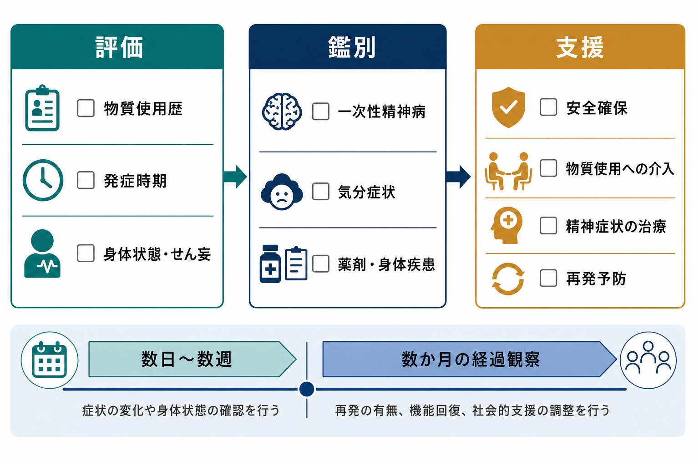

# 物質誘発性精神病とは何か

## 要点

- 物質誘発性精神病とは、アルコール、覚醒剤・メタンフェタミン、コカイン、大麻、幻覚薬、鎮静薬、処方薬、毒物などの使用・中毒・離脱と時間的に結びついて、主に[[統合失調症の陽性症状とは何か|幻覚]]や妄想が目立つ状態を指す[1][2]。
- 診断上の中心は「物質が原因らしいか」だけではなく、発症時期、使用量、離脱の有無、[[中毒症状とは何か|中毒]]や[[離脱症状とは何か|離脱症状]]として通常みられる範囲を超えているか、せん妄だけで説明できないか、一次性精神病が先に存在していないかを確認することである[1][2][3]。
- 症状は短期間で改善することが多いが、覚醒剤、コカイン、PCP、大麻などでは数週以上続くことがあり、長期的には[[統合失調症とは何か|統合失調症]]への移行が一定割合で報告されている[1][4][5]。
- 支援では、急性期の安全確保と精神症状への対応に加え、物質使用そのものへの介入、身体状態の評価、家族・生活支援、再発予防、数か月単位の経過観察が重要になる[3][6][7]。

## この記事で答える問い

1. 物質誘発性精神病は、単なる「酔い」や「薬物中毒」と何が違うのか。
2. 覚醒剤・大麻・アルコールでは、どのような仕組みで幻覚や妄想が生じやすくなるのか。
3. [[初回エピソード精神病とは何か|初回エピソード精神病]]や[[統合失調症とは何か|統合失調症]]と、どのように区別し、どのように経過をみるのか。
4. 研究・臨床・支援では、何を重視すべきか。

## まず結論

物質誘発性精神病は、「物質を使った人に精神病症状が出た」という広い観察ではなく、物質使用・離脱と幻覚や妄想の発症が時間的・生物学的に結びついており、かつ単純な中毒、離脱、せん妄、一次性精神病だけでは説明しにくい状態である。DSM-5-TR に基づく解説では、幻覚または妄想があり、それが物質中毒・離脱・薬剤曝露の最中または直後に現れ、物質自体がその症状を起こし得ること、せん妄中だけの症状ではないこと、臨床的苦痛や機能障害を伴うことが重視される[1][8]。ICD-11 でも、アルコールなど各物質の使用・離脱に続いて、通常の中毒・離脱に伴う知覚変化を超える精神病症状が出現し、一次性精神疾患ではよりよく説明できないことが強調される[2]。

ただし、現実の臨床では境界が明瞭とは限らない。物質は、もともとの脆弱性をもつ人の精神病を誘発・増悪することもあれば、一次性精神病の前駆期に本人が不安や不眠を和らげる目的で物質を使っていることもある。そのため、初回の診断名だけで固定せず、使用状況、症状の時間経過、家族・周囲からの情報、身体疾患、薬剤、尿検査などを組み合わせ、数日から数か月の経過で仮説を更新する必要がある[4][6]。

## 背景

精神病症状は、本人にとって現実感の揺らぎ、恐怖、混乱、孤立をもたらし、周囲にとっても対応が難しい。物質誘発性精神病では、ここに「物質使用」という要素が重なるため、本人の意思や人格の問題として単純化されやすい。しかし医学的には、物質が神経伝達、睡眠、ストレス反応、知覚処理、意味づけの過程に影響し、幻覚や妄想が出やすくなる状態として理解するほうが有用である。

関係する物質は幅広い。Merck Manual の専門家向け解説は、アルコール、アンフェタミン、ベンゾジアゼピン・睡眠薬、大麻・カンナビノイド、コカイン、幻覚薬、PCP、MDMA などに加え、抗コリン薬、抗うつ薬、抗パーキンソン病薬、副腎皮質ステロイド、抗菌薬、毒物なども原因になり得ると整理している[1]。したがって、違法薬物だけでなく、処方薬、市販薬、治療薬の変更、身体疾患、毒物曝露も含めて評価する必要がある。

## 基本概念

### 精神病症状として何が問題になるか

物質誘発性精神病で中心になるのは、主に幻覚と妄想である。幻覚は、実際には外界に対応する刺激がないのに、声が聞こえる、何かが見える、体に触れられる感じがするなどの知覚体験である。妄想は、反証があっても修正されにくい強い確信で、被害妄想、関係妄想、嫉妬妄想、誇大妄想などとして現れることがある。重症例では、思考のまとまりにくさ、興奮、混乱、睡眠障害、不安、攻撃性、自傷他害リスクが問題になる。

ただし、物質使用時の知覚変化がすべて精神病性障害を意味するわけではない。たとえば中毒時の一過性の知覚変化、離脱時の不眠や不安、せん妄に伴う変動性の意識障害は、物質誘発性精神病と重なる部分をもちながらも、評価の焦点が異なる。意識レベル、注意の保ちやすさ、見当識、発熱・脱水・感染・肝機能障害・頭部外傷などの身体要因は必ず確認されるべきである[7]。

### 一次性精神病との違い

一次性精神病とは、物質や身体疾患だけでは説明しにくい精神病性障害を指す。[[統合失調症とは何か]]、統合失調感情障害、気分障害に伴う精神病症状などが含まれる。物質誘発性精神病との鑑別では、少なくとも次の点が手がかりになる。

| 見る点 | 物質誘発性精神病を示唆する所見 | 一次性精神病を示唆する所見 |
|---|---|---|
| 時間関係 | 使用量増加、中毒、離脱、薬剤変更の直後に発症 | 物質使用より前から症状や機能低下がある |
| 経過 | 物質中止・離脱安定後に改善する | 十分な断薬・禁酒後も症状が持続する |
| 症状 | 幻覚・妄想が急に出る。睡眠不足や興奮を伴うことが多い | 陰性症状、認知機能低下、前駆期、慢性経過が目立つことがある |
| 情報源 | 使用歴、尿検査、家族情報、服薬歴と整合する | 物質と無関係な過去エピソード、家族歴、発達歴が目立つ |

この表は診断を機械的に決めるものではない。特に大麻や覚醒剤では、物質誘発性精神病と一次性精神病の境界が時間とともに変わることがあるため、初回評価では「仮の説明」と「安全な支援」を同時に進める姿勢が重要である[4][5]。

## 仕組み

### 共通する経路

物質誘発性精神病の仕組みは物質ごとに異なるが、共通して重要なのは、神経伝達の偏り、睡眠不足、ストレス反応、身体状態の悪化、個人の脆弱性が重なり、知覚や意味づけの誤りが増幅されるという点である。ドパミン系は、とくに覚醒剤やコカインによる精神病症状を理解するうえで中心的である。中脳辺縁系のドパミン活動が高まると、偶然の出来事や中立的刺激に過剰な意味が付与され、関係妄想や被害妄想につながりやすいと考えられる[6][8]。

一方で、ドパミンだけで説明できない部分も多い。大麻では THC が CB1 受容体を介して内因性カンナビノイド系に影響し、知覚、記憶、不安、報酬系、ドパミン系の調節に波及する。アルコール離脱では、慢性的な抑制性作用への適応のあとに、GABA 系低下とグルタミン酸系の相対的興奮が目立ち、振戦、不眠、自律神経症状、幻覚、せん妄リスクが高まる[4][7]。

### 覚醒剤・メタンフェタミン

覚醒剤関連精神病では、被害妄想、関係妄想、聴覚・視覚・体感幻覚、強い警戒心、不眠、興奮がしばしば問題になる。メタンフェタミン精神病のレビューでは、使用者のかなりの割合に精神病症状がみられ、急性症状は断薬で改善することが多い一方、再燃・遷延する例もあるとされる[6]。診断精度を上げるには、発症と使用の時間関係、尿検査などの客観的指標、家族・周囲からの情報、過去の精神病症状の有無を合わせてみる必要がある[6]。

治療・支援では、急性期の興奮や不眠に対する環境調整、必要に応じた抗精神病薬やベンゾジアゼピンの使用、身体合併症の評価が行われることがある。ただし長期的には、覚醒剤使用の再発予防が精神病症状の再発予防そのものになる。心理社会的介入、依存症治療、住居・就労・対人関係の支援が、単なる付随要素ではなく中核になる[6]。

### 大麻・カンナビノイド

大麻は「自然なものだから精神病とは関係ない」と誤解されやすい。しかし疫学研究では、大麻使用、とくに高頻度使用や高 THC 製品の使用は精神病リスクと関連する。EU-GEI の多施設症例対照研究では、毎日の大麻使用は非使用と比べて精神病性障害のオッズを高め、高 THC 製品を毎日使う場合にさらに高い関連が報告された[5]。これは個人診断にそのまま使える数字ではないが、公衆衛生上は重要なシグナルである。

大麻誘発性精神病は、急性の不安、被害感、現実感の変化、幻聴・幻視、混乱として現れることがある。高用量 THC、若年開始、頻回使用、遺伝的・発達的脆弱性、過去の精神病症状、睡眠不足、他物質併用が重なると、リスクは高まりやすい。合成カンナビノイドでは、成分や作用強度が不安定なため、より予測困難な精神症状や身体症状を呈することがある[4]。

### アルコール

アルコール関連精神病は、重い飲酒、急な減量・中止、離脱の文脈で起こることが多い。アルコール誘発性精神病では、典型的には聴覚幻覚や妄想が目立ち、せん妄振戦、ウェルニッケ脳症、コルサコフ症候群、認知症、肝性脳症などとの鑑別が重要になる[7]。ICD-11 では、アルコール中毒または離脱の最中・直後に精神病症状が生じ、通常の中毒・離脱で説明される範囲を超え、一次性精神疾患ではよりよく説明されない場合に位置づけられる[2]。

アルコール関連では、精神症状だけを見ていると危険である。脱水、電解質異常、低血糖、感染、頭部外傷、肝機能障害、けいれんリスク、チアミン欠乏を同時に評価する必要がある。離脱が背景にある場合、精神科的対応だけでなく、身体管理と依存症医療の接続が不可欠である[7]。

## 図解

3枚のインフォグラフィックは、物質誘発性精神病を次の順で読むための補助である。1枚目は概念地図で、物質使用・離脱、幻覚・妄想、せん妄との区別、一次性精神病との鑑別、再発予防を並べている。2枚目は神経機構の概略で、覚醒剤、大麻、アルコール離脱が異なる経路から知覚・意味づけの歪みに合流する流れを示している。3枚目は臨床評価の流れで、物質使用歴、発症時期、身体状態、鑑別、支援を分けて整理している。

## 臨床・研究との接続

### 評価の実務

評価では、物質の種類だけでなく、量、頻度、使用経路、最終使用時刻、増量・減量・中止、併用、処方薬・市販薬、身体疾患、睡眠、食事、脱水、外傷、自傷他害リスクを確認する。NICE の「精神病と併存する物質使用」指針は、精神病が疑われる人にはアルコール、処方薬、非処方薬、違法薬物の使用について日常的に尋ね、種類、量、頻度、パターン、経路、期間を確認し、必要に応じて家族・支援者からの情報も得ることを推奨している[3]。検査は有用な場合があるが、本人への説明と同意を含むケア計画の中で位置づける必要がある[3]。

急性期の目標は、診断名を急いで固定することではなく、安全確保、身体状態の評価、苦痛の軽減、物質使用の連鎖を止めることである。環境刺激を下げる、睡眠を回復する、脱水や低栄養を補正する、必要時に薬物療法を使う、家族や支援者と連携する、といった介入が組み合わされる。[[拒薬とは何か|服薬への抵抗]]がある場合も、物質使用や被害感、過去の強制的体験が背景にあることがあり、説明と信頼関係を欠いた対応は逆効果になり得る。

### 予後と経過観察

物質誘発性精神病は、一過性で終わる場合もあれば、再発・遷延・一次性精神病への移行につながる場合もある。Murrie らの系統的レビュー・メタ解析では、物質誘発性精神病から統合失調症への移行割合は全体で 25% と推定され、物質別には大麻で高く、幻覚薬、アンフェタミンが続き、アルコールや鎮静薬では相対的に低い推定が報告された[4]。この数字は研究集団・診断法・追跡期間に依存するが、「物質が原因ならもう大丈夫」と短絡しない理由になる。

経過観察でみるべき点は、症状が消えたかどうかだけではない。断薬・禁酒が続いているか、睡眠が戻っているか、不安や抑うつが残っていないか、再使用の引き金が何か、生活機能が戻っているか、家族や職場・学校との関係が修復されているかをみる。再使用後に同じ症状が再燃する場合、精神病への脆弱性が高い可能性があるため、より積極的な再発予防と早期介入が必要になる。

### 研究上の難しさ

研究では、「物質が精神病を起こす」のか、「精神病の前駆状態が物質使用を増やす」のか、「共通の脆弱性が両方を増やす」のかを分けるのが難しい。多くの研究は観察研究であり、因果推論には限界がある。さらに、使用量の自己申告、製品の THC 濃度、合成薬物の成分、併用薬、社会的ストレス、診断基準、追跡期間がばらつく。したがって、個人に対してはリスクを断定するより、「再使用で症状が再燃するか」「断薬後も症状が残るか」「生活機能が戻るか」を丁寧にみることが重要である。

## よくある誤解

### 誤解1: 物質誘発性なら軽い

軽いとは限らない。急性期には自傷他害、事故、脱水、けいれん、せん妄、身体合併症が問題になる。症状が一過性でも、本人にとっては強い恐怖体験となり、再発予防やトラウマ反応への支援が必要になることがある。

### 誤解2: 薬物をやめれば必ずすぐ治る

多くは改善するが、すべてがすぐ治るわけではない。覚醒剤、コカイン、PCP などでは症状が数週続くことがあり、大麻や覚醒剤関連の精神病では後に統合失調症診断へ移行する例も報告されている[1][4][6]。

### 誤解3: 大麻は精神病と関係しない

大麻使用と精神病リスクの関連は、多くの研究で示されている。特に高頻度使用や高 THC 製品ではリスクとの関連が強い[5]。ただし、これは「大麻を使った全員が精神病になる」という意味ではなく、個人の脆弱性、年齢、使用頻度、製品の強度、他物質併用、環境ストレスが重なるリスクとして理解する必要がある。

### 誤解4: 本人の意思が弱いだけである

物質使用には、依存、離脱、不安、睡眠障害、孤立、貧困、トラウマ、周囲の使用環境などが関係する。再発予防には叱責よりも、使用の引き金を具体化し、危険な場面を減らし、支援者とつながり、生活上の代替行動を作ることが有効である。

## 関連ノート

- [[初回エピソード精神病とは何か]]: 初回評価、鑑別、早期介入の入口として関連する。
- [[統合失調症とは何か]]: 一次性精神病との鑑別、移行リスク、長期支援を考える際の基礎。
- [[統合失調症の陽性症状とは何か]]: 幻覚・妄想・思考のまとまりにくさを理解するための関連ノート。
- [[中毒症状とは何か]]: 物質使用直後の可逆的な精神・身体変化との区別に役立つ。
- [[離脱症状とは何か]]: アルコール、鎮静薬、刺激薬などの離脱と精神症状の関係を整理する入口。
- [[拒薬とは何か]]: 急性期治療で服薬や支援をどう説明するかを考える関連ノート。

### MOC更新候補

- `content/00_MOC/` 配下の精神医学、精神病性障害、物質使用関連 MOC に追加候補。
- 並列編集を避けるため、本記事から MOC への直接更新は行わない。

## 理解チェック

1. 物質誘発性精神病を疑うとき、発症時期と物質使用歴以外に、なぜ意識障害や身体状態を確認する必要があるか。
2. 覚醒剤、大麻、アルコール離脱では、精神病症状に至る神経機構の重点がどのように異なるか。
3. 断薬・禁酒後に症状が改善しても、なぜ数か月単位の経過観察が必要になるか。
4. 「物質が原因だから本人の責任」と考えることは、支援上どのような問題を生むか。

## 未解決問題

- 物質誘発性精神病から一次性精神病へ移行する人を、初回エピソード時点でどこまで予測できるか。
- 大麻製品の THC 濃度、CBD 含有量、使用開始年齢、使用頻度が、精神病リスクにどのように相互作用するか。
- 覚醒剤関連精神病の再発予防に、どの心理社会的介入と薬物療法の組み合わせが最も有効か。
- 物質使用への介入と早期精神病介入を、地域の医療・福祉・司法・学校・職場支援の中でどう統合するか。

## 参考文献

[1] Keshavan MS. Substance- or Medication-Induced Psychotic Disorder. *Merck Manual Professional Edition*. Reviewed/Revised July 2025. https://www.merckmanuals.com/professional/psychiatric-disorders/schizophrenia-and-related-disorders/substance-or-medication-induced-psychotic-disorder

[2] World Health Organization. *ICD-11 for Mortality and Morbidity Statistics, 2026-01 release*. Alcohol-induced psychotic disorder and disorders due to substance use. https://icd.who.int/browse/2026-01/mms/en

[3] National Institute for Health and Care Excellence. *Psychosis with coexisting substance misuse: assessment and management in adults and young people*. NICE Clinical Guideline CG120, summary of recommendations. https://www.ncbi.nlm.nih.gov/books/NBK109785/

[4] Murrie B, Lappin J, Large M, Sara G. Transition of Substance-Induced, Brief, and Atypical Psychoses to Schizophrenia: A Systematic Review and Meta-analysis. *Schizophrenia Bulletin*. 2020;46(3):505-516. https://doi.org/10.1093/schbul/sbz102

[5] Di Forti M, Quattrone D, Freeman TP, et al. The contribution of cannabis use to variation in the incidence of psychotic disorder across Europe (EU-GEI): a multicentre case-control study. *The Lancet Psychiatry*. 2019;6(5):427-436. https://doi.org/10.1016/S2215-0366(19)30048-3

[6] Glasner-Edwards S, Mooney LJ. Methamphetamine Psychosis: Epidemiology and Management. *CNS Drugs*. 2014;28(12):1115-1126. https://doi.org/10.1007/s40263-014-0209-8

[7] Murray BP, Richards JR, Stankewicz HA, Aslam SP, Salen P. Alcohol-Related Psychosis. *StatPearls*. Updated March 9, 2025. https://www.ncbi.nlm.nih.gov/books/NBK459134/

[8] Fiorentini A, Cantù F, Crisanti C, Cereda G, Oldani L, Brambilla P. Substance-Induced Psychoses: An Updated Literature Review. *Frontiers in Psychiatry*. 2021;12:694863. https://doi.org/10.3389/fpsyt.2021.694863
