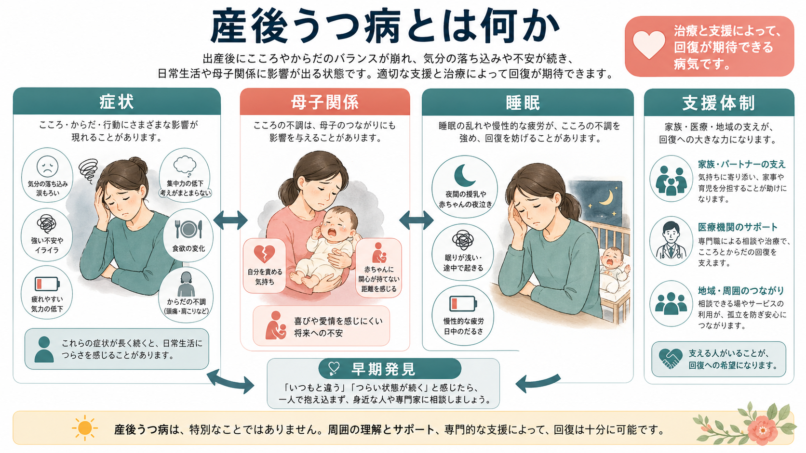
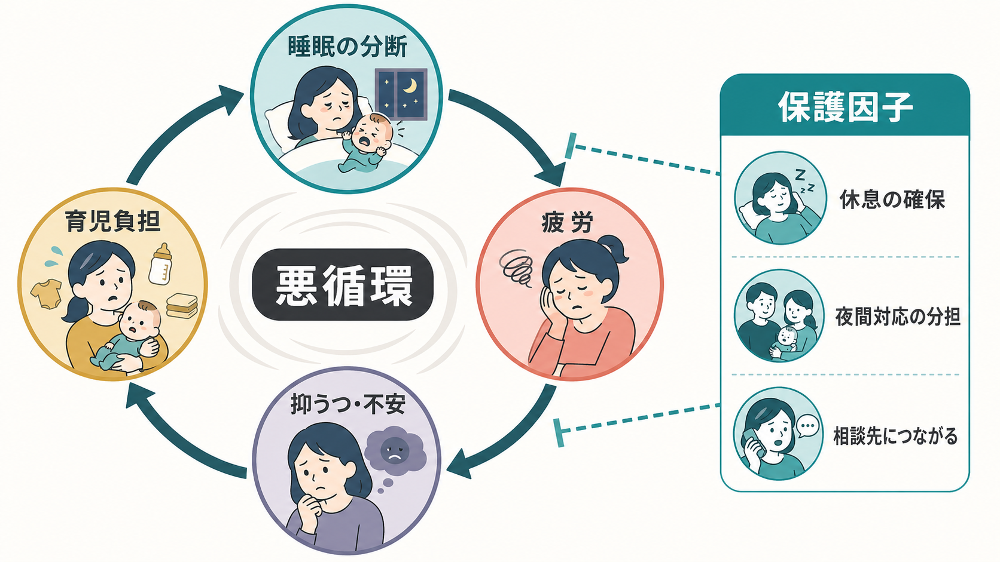
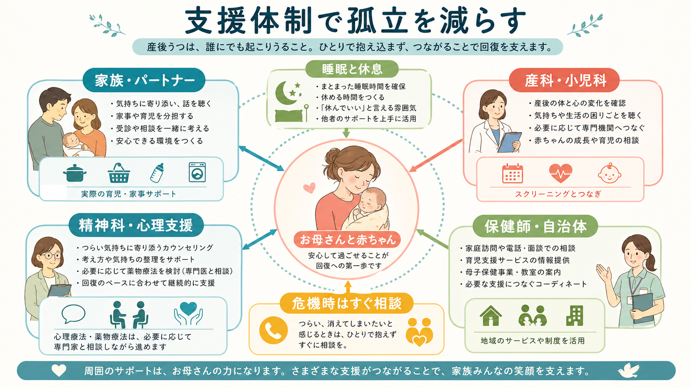

# 産後うつ病とは何か

## 要点

- 産後うつ病は、出産後の「一時的な落ち込み」だけではなく、気分・意欲・睡眠・身体感覚・自己評価・母子関係に影響する抑うつ状態である。診断上は大うつ病エピソードの周産期発症として扱われることが多いが、臨床的には出産後1年以内のメンタルヘルス問題として広く評価される[1][2]。
- 産後うつ病はまれな問題ではない。診断面接に基づくメタ解析では、産後1年以内の何らかの抑うつ状態は約12%、大うつ病は約7%と推定されている[3]。
- 重要なのは、母親個人の「弱さ」ではなく、睡眠の分断、疲労、ホルモン・身体回復、育児負担、孤立、経済・家族支援、既往歴などが重なって生じる状態として理解することである[1][4]。
- 母子関係への影響は、愛情がないという意味ではない。抑うつ、不安、疲労、罪悪感、報酬感の低下が、赤ちゃんへの応答や「つながれている感覚」を難しくすることがある[5]。
- 早期発見、睡眠と休息の確保、家族・地域・医療の支援、心理療法、必要に応じた薬物療法によって回復可能性がある[2][6][7]。

## この記事で答える問い

1. 産後うつ病は、いわゆる「マタニティブルーズ」と何が違うのか。
2. なぜ睡眠不足や疲労が、気分だけでなく母子関係にも影響するのか。
3. 支援体制は、症状の軽減や回復にどのように関わるのか。
4. 研究・臨床では、産後うつ病をどの範囲で評価すべきか。

## まず結論

産後うつ病は、出産後の生活変化に伴う自然な疲労や短期的な気分変動だけでは説明できない、持続的で機能障害を伴う抑うつ状態である。気分の落ち込みだけでなく、喜びを感じにくい、眠れないまたは眠っても疲れが取れない、食欲や集中力が変化する、赤ちゃんと距離を感じる、自分を責める、育児に強い不安を感じる、といった形で現れることがある[4]。

ただし、産後うつ病を「母親の愛情不足」とみなすのは誤りである。むしろ、赤ちゃんの世話が24時間化し、睡眠が分断され、身体回復と授乳・夜泣き・家事・仕事・家族関係が重なる時期に、脳・身体・対人環境が同時に負荷を受ける状態として理解した方がよい。[[情動と認知は分けられるのか]]で扱うように、気分は思考・注意・身体感覚・対人判断から切り離せない。産後うつ病では、その結びつきが育児場面で集中的に表面化する。

## 背景

出産後には、多くの人が涙もろさ、不安、疲労、気分の揺れを経験する。CDCは、いわゆる baby blues は通常数日で軽くなる一方、産後うつ病はより強く、長く続く状態として区別している[4]。この区別は重要である。短い気分変動をすべて病気として扱う必要はないが、「時間が経てば自然に治るはず」と考えて支援が遅れると、本人の苦痛、母子関係、家族全体の負担が長引くことがある。

ACOGは、妊娠中から産後にかけて、うつ・不安・双極性障害・自殺リスク・産後精神病を含むメンタルヘルス評価を標準化された尺度で行い、スクリーニングだけで終わらせず、診断評価、治療、フォローアップにつなげる体制を求めている[1]。NICEも、妊娠前後1年のメンタルヘルス問題について、早期認識、段階的介入、母親と乳児双方への配慮、家族・支援者を含むケアを重視している[7]。

## 基本概念

### 産後うつ病の中核

産後うつ病の中核は、抑うつ気分または興味・喜びの低下が続き、生活機能や育児機能に影響することである。症状には、強い不安、涙もろさ、怒りっぽさ、疲労、睡眠問題、食欲変化、集中困難、無価値感、過剰な罪悪感、赤ちゃんと距離を感じることなどが含まれる[4]。

診断分類だけを見ると、産後うつ病は「うつ病」の一型として見える。しかし実際には、育児という対人・身体・時間管理の環境に埋め込まれて現れる。したがって、評価では症状数だけでなく、睡眠、授乳、夜間対応、パートナーとの分担、家族支援、経済的負担、孤立、既往歴、身体疾患、希死念慮や自傷リスクを含めて確認する必要がある[1][7]。

### 母子関係との関係

産後うつ病で母子関係が難しくなることは、赤ちゃんを大切に思っていないという意味ではない。抑うつでは、報酬感、意欲、注意の柔軟性、自己評価、対人信号の読み取りが影響を受ける。赤ちゃんの泣き声や表情に応答したい気持ちはあっても、疲労と不安が強いと「自分はうまくできていない」「赤ちゃんに嫌われている」と解釈しやすくなる。

母親の心理的苦痛と母子ボンディング問題の関連を検討した系統的レビュー・メタ解析では、抑うつ、不安、ストレスがボンディングの困難と関連していた[5]。ここでいうボンディングは、[[共感は認知機能としてどう理解できるのか]]や[[社会的認知とは何か]]に近い、情動・注意・対人予測の複合的な働きとして考えられる。

## 仕組み

### 睡眠の分断と疲労の悪循環

産後うつ病の理解で特に重要なのが睡眠である。新生児期には夜間授乳、夜泣き、体調確認によって、睡眠時間だけでなく睡眠の連続性が崩れる。アクチグラフィ研究の系統的レビュー・メタ解析では、産後の夜間総睡眠時間が産後の心理機能、とくに産後うつと関連していた[6]。

睡眠不足は単に「疲れる」だけではない。注意の制御、情動調整、痛みへの耐性、否定的情報への偏り、対人反応の余裕を変える。疲労が強いと、赤ちゃんの泣き声を「耐えがたい刺激」として感じやすくなり、自分を責める思考も増えやすい。すると入眠がさらに難しくなり、翌日の育児負担が重く感じられる。

### 支援体制は「治療の外側」ではない

産後うつ病の支援では、心理療法や薬物療法だけでなく、休息を確保するための実務的支援が重要である。夜間対応の分担、家事の外部化、保健師や自治体サービスへの接続、産科・小児科・精神科の連携、授乳困難や身体痛への対応は、症状の背景にある負荷を減らす介入でもある。

ACOGの治療ガイドラインは、妊娠・授乳期の薬物療法を含む管理を、リスクとベネフィットを個別に評価しながら行うことを扱っている[2]。NICEは、軽症から重症までの段階に応じて、心理的介入、薬物療法、専門サービス、家族・支援者を含むケア計画を組み合わせることを推奨している[7]。つまり、支援体制は「治療に行くまでのつなぎ」ではなく、症状の維持因子に直接働きかける臨床的資源である。

## 図解

上の3枚の図は、産後うつ病を次の3層で整理している。

| 図 | 見るポイント | 本文での対応 |
|---|---|---|
| 全体像 | 症状、母子関係、睡眠、支援体制が相互に関わる | 「まず結論」「基本概念」 |
| 睡眠の悪循環 | 睡眠分断、疲労、抑うつ・不安、育児負担が循環する | 「睡眠の分断と疲労の悪循環」 |
| 支援体制 | 家族、医療、地域支援が孤立を減らす | 「支援体制は治療の外側ではない」 |

## 臨床・研究との接続

臨床では、産後うつ病を単独の症状名として見るだけでは不十分である。評価には、抑うつ症状、双極性障害の既往、産後精神病、自殺リスク、赤ちゃんへの危害不安、強迫的な侵入思考、PTSD、物質使用、身体疾患、睡眠、授乳、家庭内暴力、経済的困難を含める必要がある[1][7]。これは個別診断や治療指示ではなく、教育・研究上の整理である。実際の診断や治療方針は、本人の状況を踏まえた専門家の評価に基づく。

研究では、有病率の推定方法に注意が必要である。自己記入式尺度は早期発見に有用だが、診断面接とは一致しないことがある。診断面接に限定したメタ解析では、産後1年以内の抑うつ状態は約12.1%、大うつ病は約7.0%と推定され、スクリーニング尺度中心の推定より低めになる可能性が示された[3]。したがって、研究を読むときは「EPDSなどのスクリーニング陽性率」なのか、「診断面接による有病率」なのかを区別する必要がある。

介入研究では、母子関係に焦点を当てた心理療法も検討されている。母子心理療法のメタ解析では、短期的には抑うつ症状を小さく改善する可能性が示された一方、長期的な母親の気分、母子相互作用、乳児愛着への効果は一貫しなかった[8]。これは、母子関係支援が不要という意味ではなく、症状、睡眠、社会的支援、経済・家族環境を含めた複合的介入として評価する必要があることを示している。

## よくある誤解

### 誤解1: 産後うつ病は「母親になった自覚が足りない」から起こる

これは誤りである。産後うつ病は、抑うつ症状、睡眠分断、疲労、身体回復、既往歴、ストレス、支援不足などが重なって生じる。道徳的な評価ではなく、臨床的・社会的支援の対象として理解する必要がある[1][4]。

### 誤解2: 赤ちゃんをかわいいと思えない瞬間があるなら愛情がない

これも誤りである。疲労や抑うつが強いと、喜びや親密さを感じにくくなることがある。母子ボンディングの困難は、愛情の欠如ではなく、抑うつ・不安・睡眠不足・孤立が対人感情に影響しているサインとして捉える方がよい[5]。

### 誤解3: 産後うつ病は自然に我慢していれば治る

軽い気分変動は自然に軽くなることがあるが、強い抑うつ、不安、睡眠困難、希死念慮、育児への深刻な支障が続く場合は、早期に相談する必要がある。スクリーニングは、見つけるだけでなく、評価・治療・フォローアップにつながって初めて意味を持つ[1]。

## 関連ノート

- [[MOC｜精神医学]]
- [[MOC｜臨床実践・治療]]
- [[MOC｜発達・愛着・社会心理]]
- [[情動と認知は分けられるのか]]
- [[共感は認知機能としてどう理解できるのか]]
- [[社会的認知とは何か]]

### 関連ノート候補

- 周産期メンタルヘルスとは何か
- マタニティブルーズとは何か
- 母子ボンディングとは何か
- 産後の睡眠不足とメンタルヘルス
- EPDSとは何か

### MOC更新候補

- `content/00_MOC/MOC｜精神医学.md`
- `content/00_MOC/MOC｜臨床実践・治療.md`
- `content/00_MOC/MOC｜発達・愛着・社会心理.md`

## 理解チェック

1. 産後うつ病と一過性の baby blues を区別するうえで、持続期間と生活機能への影響がなぜ重要か。
2. 睡眠の分断は、気分だけでなく母子関係にどのような経路で影響しうるか。
3. 支援体制を「治療の外側」ではなく「症状の維持因子に働く介入」と考える理由は何か。
4. スクリーニング尺度による陽性率と、診断面接による有病率を混同すると、研究解釈にどのような問題が起こるか。

## 参考文献

[1] American College of Obstetricians and Gynecologists. (2023). *Screening and Diagnosis of Mental Health Conditions During Pregnancy and Postpartum: ACOG Clinical Practice Guideline No. 4*. https://www.acog.org/clinical/clinical-guidance/clinical-practice-guideline/articles/2023/06/screening-and-diagnosis-of-mental-health-conditions-during-pregnancy-and-postpartum

[2] American College of Obstetricians and Gynecologists. (2023). *Treatment and Management of Mental Health Conditions During Pregnancy and Postpartum: ACOG Clinical Practice Guideline No. 5*. *Obstetrics & Gynecology, 141*(6), 1262-1288. https://doi.org/10.1097/AOG.0000000000005202

[3] Bai, Y., Li, Q., Cheng, K. K., Caine, E. D., Tong, Y., Wu, X., & Gong, W. (2023). Prevalence of Postpartum Depression Based on Diagnostic Interviews: A Systematic Review and Meta-Analysis. *Depression Research and Treatment*, 2023, 8403222. https://doi.org/10.1155/2023/8403222

[4] Centers for Disease Control and Prevention. (2024). *Symptoms of Depression Among Women*. https://www.cdc.gov/reproductive-health/depression/index.html

[5] O'Dea, G. A., Youssef, G. J., Hagg, L. J., Francis, L. M., Spry, E. A., Rossen, L., Smith, I., Teague, S. J., Mansour, K., Booth, A., & Hutchinson, D. M. (2023). Associations between maternal psychological distress and mother-infant bonding: a systematic review and meta-analysis. *Archives of Women's Mental Health, 26*, 441-452. https://doi.org/10.1007/s00737-023-01332-1

[6] Sobol, M., Błachnio, A., Meisner, M., Szyszkowska, J., & Jankowski, K. S. (2024). Sleep, circadian activity patterns and postpartum depression: A systematic review and meta-analysis of actigraphy studies. *Journal of Sleep Research, 33*(4), e14116. https://doi.org/10.1111/jsr.14116

[7] National Institute for Health and Care Excellence. (2018). *Antenatal and postnatal mental health: clinical management and service guidance (NICE Clinical Guideline CG192)*. https://www.ncbi.nlm.nih.gov/books/n/nicecg192guid/

[8] Huang, R., Yang, D., Lei, B., Yan, C., Tian, Y., Huang, X., & Lei, J. (2020). The short- and long-term effectiveness of mother-infant psychotherapy on postpartum depression: A systematic review and meta-analysis. *Journal of Affective Disorders, 260*, 670-679. https://doi.org/10.1016/j.jad.2019.09.056

## 未解決問題

- 産後うつ病の症状改善と、母子ボンディング・乳児発達の長期的改善は、どの介入要素で最も強く結びつくのか。
- 睡眠支援、家事・育児支援、心理療法、薬物療法をどの順序・強度で組み合わせると、本人と家族にとって最も負担が少ないのか。
- 文化差、家族構造、育休制度、医療アクセスの違いは、有病率と支援ニーズにどのように影響するのか。
