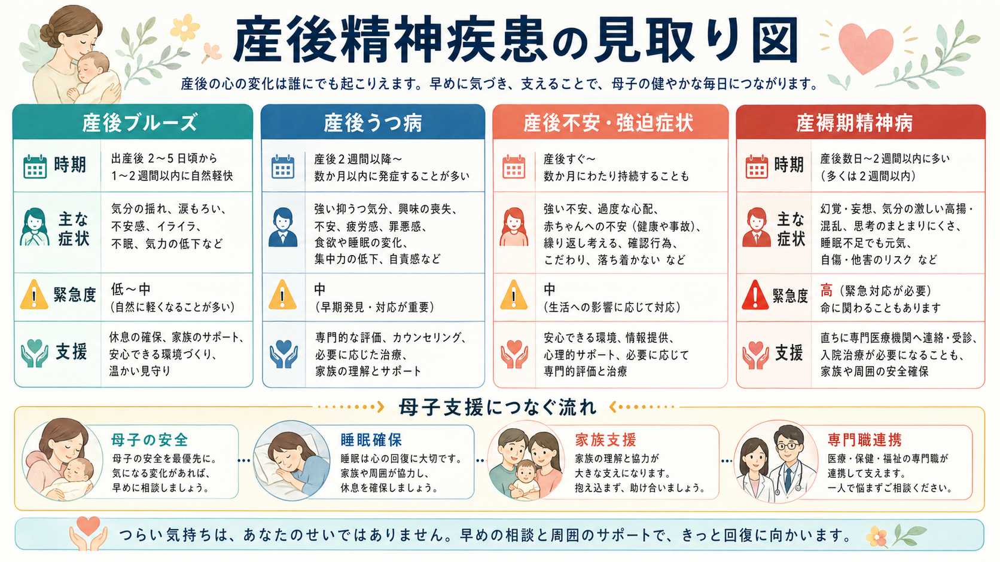
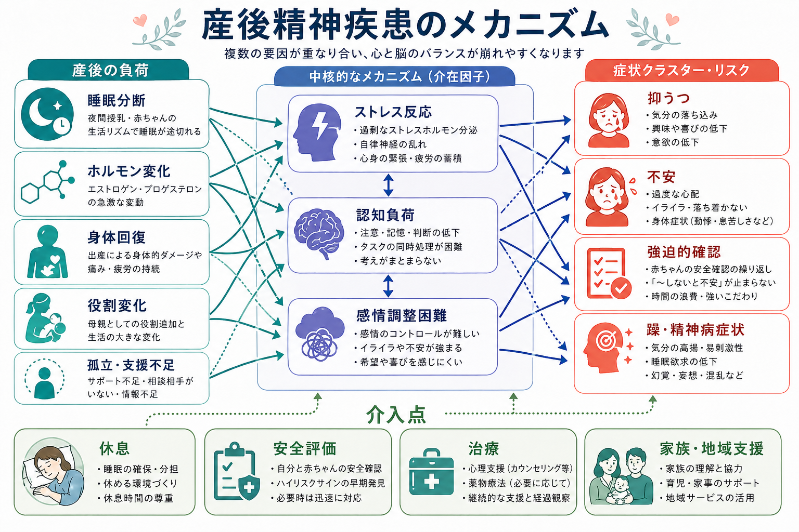
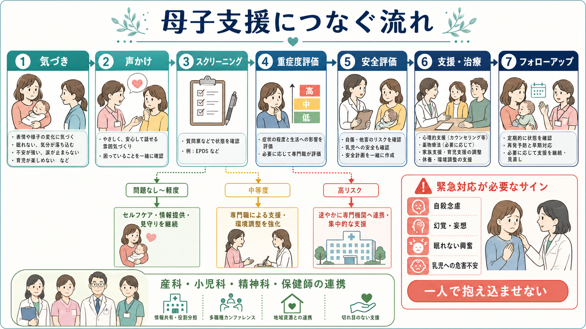

# 産後精神疾患には何があるのか

## 要点

- 産後の精神疾患は、単に「産後うつ」だけではなく、産後ブルーズ、[[産後うつ病とは何か|産後うつ病]]、産後の不安・強迫症状、[[産褥期精神病とは何か|産褥期精神病]]、既存の[[双極性障害とは何か|双極性障害]]や[[不安症群とは何か|不安症群]]の再燃を含む広い領域である[1][3]。
- 重要なのは、病名を急いで決めることではなく、発症時期、睡眠、抑うつ、不安、強迫的確認、躁状態、精神病症状、自殺念慮、乳児への危害不安を同時に評価することである[1][2]。
- 産褥期精神病は頻度は低いが、数日から数週で急速に悪化しうる精神科救急であり、自殺・乳児への危害リスクを含めて安全評価と専門医療への迅速な接続が必要になる[3][6]。
- 産後の不安や強迫症状は見逃されやすい。赤ちゃんの健康や事故への心配が強く、確認行為、侵入思考、回避、睡眠困難を伴う場合は、うつ病だけでなく不安症・強迫症状としても評価する[1][5]。
- 母子支援では、本人の症状だけでなく、睡眠確保、家族支援、授乳・育児負担、身体回復、経済的・社会的孤立、母子の安全をまとめて扱う[2][3]。

## この記事で答える問い

1. 産後に問題となる精神疾患・精神症状には何があるのか。
2. 産後ブルーズ、産後うつ病、産後不安、産褥期精神病はどう違うのか。
3. どのような症状を「緊急度が高いサイン」として扱うべきか。
4. 母子支援の視点では、症状評価に何を加えて見る必要があるのか。

## まず結論

産後精神疾患は、「母親の気分の問題」だけではなく、出産後の身体回復、睡眠分断、授乳・育児負担、ホルモン変化、社会的孤立、家族関係、既往歴が重なって生じるメンタルヘルス上の問題である。ACOG は、周産期のメンタルヘルス評価において、うつ、不安、双極性障害、自殺リスク、産後精神病を標準化された尺度や診察で評価し、スクリーニングだけで終わらせず、診断、治療、フォローアップにつなぐ体制を求めている[1][2]。

整理の軸は3つである。第一に、頻度が高いが一過性のことが多い産後ブルーズ。第二に、持続して生活機能や育児機能を損なう産後うつ病・不安症状。第三に、低頻度だが救急性が高い産褥期精神病である。産褥期精神病は、産後うつ病の重症版としてだけ理解すると危険であり、躁状態、混乱、妄想、幻覚、著しい不眠、判断力低下を伴う急性状態として扱う[3][6]。

## 背景

産後は、心理的にも生物学的にも負荷が集中する時期である。夜間授乳や乳児の睡眠リズムによって[[睡眠覚醒障害群とは何か|睡眠]]が分断され、出産後の疼痛や貧血、授乳、家事・育児の再編、パートナーや家族との役割調整が同時に起きる。これらは単独で病気を「引き起こす」とは限らないが、既往歴や孤立、トラウマ、経済的困難、乳児の健康問題と重なると、抑うつや不安の持続につながりやすい[1][2]。

産後うつ病の有病率は研究や地域で幅があるが、メタ分析ではおよそ14%程度と推定されている[4]。一方、産後の不安症も重要で、診断面接に基づく系統的レビューでは、産後女性の不安症の推定有病率は約8.5%と報告されている[5]。つまり、産後メンタルヘルスを「うつだけ」として見てしまうと、強い不安、パニック、強迫的確認、外出回避、過覚醒を見落とす。

NICE は、産後1年までを postnatal period として扱い、うつ病、不安症、摂食障害、物質使用、重症精神疾患を含めた評価と支援を推奨している[3]。この広い枠組みは、[[周産期メンタルヘルスの疾患には何があるのか|周産期メンタルヘルス]]を「妊娠・出産の付属問題」ではなく、本人、乳児、家族、地域支援を結ぶ臨床領域として見るために重要である。

## 基本概念

### 産後ブルーズ

産後ブルーズは、出産後数日から2週間以内にみられる一過性の気分変動である。涙もろさ、気分の揺れ、不安、いらだち、不眠、集中しにくさが目立つことがある。多くは自然に軽快するが、「自然に軽くなるはず」と決めつけると、産後うつ病や不安症状の初期像を見逃す。

見分けるポイントは、持続期間、重症度、生活機能、睡眠の崩れ、安全リスクである。2週間を超えて強い抑うつ、不安、希死念慮、育児不能感、赤ちゃんへの危害不安が続く場合は、産後ブルーズだけで説明しない。

### 産後うつ病

[[産後うつ病とは何か|産後うつ病]]では、抑うつ気分、興味・喜びの低下、疲労感、罪悪感、集中困難、食欲・睡眠の変化、自責感、希死念慮などが持続する。産後特有の形として、「母親なのにうまくできない」「赤ちゃんをかわいいと思えない」「周囲に迷惑をかけている」といった強い自責や孤立感が前景に出ることがある。

ただし、産後の疲労や睡眠不足と症状が重なりやすいため、単に「眠れていないから当然」と片づけない。気分、興味、思考内容、自殺リスク、母子関係、支援体制を合わせて見る必要がある[1][7]。

### 産後不安・強迫症状

産後には、[[不安症群とは何か|不安症状]]や[[強迫症とは何か|強迫症状]]が前景に出ることがある。赤ちゃんの呼吸や体温を何度も確認する、事故や感染を過度に恐れる、外出や入浴を避ける、侵入思考に苦しむ、眠りたいのに警戒が解けない、といった形で現れる。

乳児への危害に関する侵入思考は、本人が強い苦痛を感じ「そんなことをしたくない」と恐れている場合、強迫症状として理解されることがある。一方で、命令性の幻聴、妄想、現実検討の低下、強い興奮や混乱がある場合は産褥期精神病として緊急に評価する。この区別は、安全評価と支援方針に直結する[1][3]。

### 産褥期精神病

[[産褥期精神病とは何か|産褥期精神病]]は、出産後数日から数週に急性発症する重い精神状態である。幻覚、妄想、混乱、躁状態、抑うつ、著しい不眠、易刺激性、まとまりにくい行動、自殺や乳児への危害リスクを伴うことがある[3][6]。

頻度は低いが、急速に悪化しうるため、通常の外来フォローだけで様子を見る状態ではない。既往の双極性障害、過去の産褥期精神病、家族歴、睡眠遮断は重要なリスク情報である。本人を責めるためではなく、本人と乳児を守るために、家族、産科、小児科、精神科、地域保健の連携が必要になる。

| 領域 | 典型的な時期 | 主な特徴 | 支援上の注意 |
|---|---:|---|---|
| 産後ブルーズ | 産後数日から2週間以内 | 涙もろさ、気分の揺れ、不安、不眠 | 軽快を見守りつつ、持続・悪化を確認 |
| 産後うつ病 | 産後数週から数か月、または1年以内 | 抑うつ、興味低下、自責、育児困難、希死念慮 | スクリーニング、診断評価、心理・薬物・生活支援 |
| 産後不安・強迫症状 | 産後早期から数か月 | 過度な心配、確認、侵入思考、回避、過覚醒 | うつ病だけに還元せず、不安・強迫を評価 |
| 産褥期精神病 | 多くは産後数日から数週 | 幻覚、妄想、混乱、躁状態、著しい不眠 | 精神科救急として安全確保と専門医療へ接続 |

## 仕組み

産後精神疾患は、単一の原因で説明するよりも、複数の負荷が重なる状態として理解しやすい。睡眠分断、ホルモン変化、身体回復、授乳・育児負担、役割変化、孤立、既往歴が、ストレス反応、認知負荷、感情調整困難を介して症状を増幅する。

特に睡眠分断は重要である。産後の睡眠不足は、多くの人にとって避けにくい負荷だが、双極性障害スペクトラムの脆弱性がある人では、躁状態や精神病症状の誘発因子になりうる。双極性障害をもつ産後女性を対象とした研究では、周産期の睡眠障害と産後精神病との関連が検討されている[8]。

また、母子関係への影響は「愛情が足りない」という道徳的問題ではない。母親の心理的苦痛と母子ボンディング困難の関連を扱ったメタ分析では、産後1年以内の抑うつ、不安、ストレスとボンディング問題が関連していた[7]。ただし、心理的苦痛があるから必ずボンディング問題が起きるわけでも、ボンディング困難があるから母親が危険というわけでもない。支援の入口として丁寧に評価することが大切である。

## 図解

3枚の図は、同じ対象を異なる粒度で整理している。

| 図 | 見るポイント | 本文での対応 |
|---|---|---|
| 産後精神疾患の見取り図 | 産後ブルーズ、産後うつ病、産後不安・強迫症状、産褥期精神病の違い | 「基本概念」 |
| メカニズム図 | 睡眠、ホルモン、身体回復、孤立が重なる多因子モデル | 「仕組み」 |
| 母子支援フロー | 気づき、声かけ、スクリーニング、重症度評価、安全評価、支援・治療 | 「臨床・研究との接続」 |

## 臨床・研究との接続

臨床では、まず本人の苦痛を「よくあること」と過小評価しないことが重要である。ACOG は、妊娠中・産後のケアで、うつと不安の標準化されたスクリーニングを行い、陽性だった場合には評価、診断、治療、モニタリング、フォローアップにつなげる体制を求めている[1]。EPDS、PHQ-9、GAD-7 などは入口として有用だが、尺度だけで診断は完結しない。

評価では、次の観点をまとめて確認する。

- 気分: 抑うつ、喜びの低下、焦燥、易怒性
- 不安: 過度な心配、パニック、回避、身体症状
- 強迫: 侵入思考、確認行為、洗浄、事故へのこだわり
- 躁・精神病症状: 眠らなくても元気、観念奔逸、誇大性、幻覚、妄想、混乱
- 安全: [[自殺リスク評価では何を聞くべきか|自殺念慮]]、自傷、乳児への危害不安、家庭内暴力
- 環境: 睡眠確保、授乳負担、家族支援、孤立、経済的困難、身体合併症

治療・支援は、心理療法や薬物療法だけでは完結しない。NICE は、本人、乳児、家族、支援者を含めたケアを重視し、重症精神疾患や産後精神病では専門サービスへの迅速な接続を推奨している[3]。薬物療法については、授乳、既往歴、重症度、本人の希望、再発リスクを総合して判断する必要があり、個別の治療判断は専門家の評価に基づく[2]。

研究上は、産後うつ病、不安症、精神病症状、母子ボンディング、睡眠、社会的支援を別々に測るだけでなく、同じ家族システムの中でどう相互作用するかを見ることが課題である。特に、乳児の睡眠・授乳困難、母親の睡眠分断、抑うつ・不安、支援不足は循環しやすいため、単一症状よりも支援ネットワーク全体を測る視点が必要になる。

## よくある誤解

### 誤解1: 産後の気分の落ち込みは誰にでもあるので、治療対象ではない

産後ブルーズのような一過性の気分変動は多いが、持続する抑うつ、不安、睡眠困難、育児機能の低下、自殺念慮は支援対象である。スクリーニングは「病名を貼るため」ではなく、見逃されやすい苦痛を早く拾うために行う[1]。

### 誤解2: 産後うつ病だけ見ればよい

産後には不安症、強迫症状、PTSD、摂食障害、物質使用、双極性障害の再燃、産褥期精神病も問題になる[3]。不安や強迫症状は、赤ちゃんの安全確認として説明されやすく、本人も「母親なら当然」と思って隠すことがある。

### 誤解3: 赤ちゃんへの危害に関する考えがある人は、すべて危険である

侵入思考としての危害イメージは、強迫症状として出ることがある。その場合、本人は考えを恐れ、実行したくないと強く苦しむ。一方、妄想、幻聴、命令性、現実検討の低下、混乱、強い興奮がある場合は緊急度が高い。したがって、内容だけでなく、本人の苦痛、確信度、現実検討、安全計画を評価する[1][3]。

### 誤解4: 母親を休ませるだけで十分である

休息と睡眠確保は非常に重要だが、それだけで十分とは限らない。心理療法、薬物療法、家族支援、訪問支援、産科・小児科・精神科・保健師の連携が必要になる場合がある[2][3]。

## 関連ノート

- [[周産期メンタルヘルスの疾患には何があるのか]]
- [[産後うつ病とは何か]]
- [[産褥期精神病とは何か]]
- [[不安症群とは何か]]
- [[強迫症とは何か]]
- [[双極性障害とは何か]]
- [[睡眠覚醒障害群とは何か]]
- [[自殺リスク評価では何を聞くべきか]]
- [[精神科で多職種連携はなぜ重要なのか]]

作成候補:

- 母子関係とは何か
- 産後不安症状とは何か

## MOC更新候補

- `content/00_MOC/MOC_精神医学.md` がある場合は、周産期メンタルヘルスまたは疾患・症候群の項目に本記事を追加する。
- `content/00_MOC/MOC_臨床実践.md` がある場合は、母子支援、リスク評価、多職種連携の関連ノートとして追加する。
- 並列ジョブとの競合を避けるため、本ジョブでは MOC 本体は更新しない。

## 理解チェック

1. 産後ブルーズと産後うつ病を区別するとき、持続期間以外に何を見るべきか。
2. 産後不安・強迫症状が「母親として普通の心配」と見なされやすいのはなぜか。
3. 産褥期精神病で緊急対応が必要になるサインを3つ挙げよ。
4. 産後精神疾患の支援で、本人の症状評価に加えて睡眠・家族支援・安全評価を見る理由は何か。

## 未解決問題

- 日本の地域母子保健の文脈で、産後うつ病、不安症状、産褥期精神病をどのように連続的に拾うのが最も実装しやすいか。
- EPDS などの尺度陽性者を、診断評価、心理支援、薬物療法、訪問支援へどう効率よくつなぐか。
- 産後の睡眠分断を、家族・地域支援の介入点としてどこまで標準的に扱えるか。
- 母子ボンディング困難を、母親への非難ではなく支援ニーズとして評価する実践方法をどう広げるか。

## 参考文献

[1] American College of Obstetricians and Gynecologists. (2023). *Screening and Diagnosis of Mental Health Conditions During Pregnancy and Postpartum: ACOG Clinical Practice Guideline No. 4*. Obstetrics & Gynecology, 141(6), 1232-1261. https://www.acog.org/clinical/clinical-guidance/clinical-practice-guideline/articles/2023/06/screening-and-diagnosis-of-mental-health-conditions-during-pregnancy-and-postpartum

[2] American College of Obstetricians and Gynecologists. (2023). *Treatment and Management of Mental Health Conditions During Pregnancy and Postpartum: ACOG Clinical Practice Guideline No. 5*. Obstetrics & Gynecology, 141(6), 1262-1288. https://doi.org/10.1097/AOG.0000000000005202

[3] National Institute for Health and Care Excellence. (2014, updated 2020). *Antenatal and postnatal mental health: clinical management and service guidance (CG192)*. https://www.nice.org.uk/guidance/cg192

[4] Liu, X., Wang, S., & Wang, G. (2022). Prevalence and risk factors of postpartum depression in women: A systematic review and meta-analysis. *Journal of Clinical Nursing, 31*(19-20), 2665-2677. https://doi.org/10.1111/jocn.16121

[5] Goodman, J. H., Watson, G. R., & Stubbs, B. (2016). Anxiety disorders in postpartum women: A systematic review and meta-analysis. *Journal of Affective Disorders, 203*, 292-331. https://doi.org/10.1016/j.jad.2016.05.033

[6] Friedman, S. H., Reed, E., & Ross, N. E. (2023). Postpartum psychosis. *Current Psychiatry Reports, 25*, 65-72. https://doi.org/10.1007/s11920-022-01406-4

[7] O'Dea, G. A., Youssef, G. J., Hagg, L. J., Francis, L. M., Spry, E. A., Rossen, L., Smith, I., Teague, S. J., Mansour, K., Booth, A., Davies, S., Hutchinson, D., & Macdonald, J. A. (2023). Associations between maternal psychological distress and mother-infant bonding: A systematic review and meta-analysis. *Archives of Women's Mental Health, 26*, 441-452. https://doi.org/10.1007/s00737-023-01332-1

[8] Perry, A., Gordon-Smith, K., Lewis, K. J. S., Di Florio, A., Craddock, N., Jones, L., & Jones, I. (2024). Perinatal sleep disruption and postpartum psychosis in bipolar disorder: Findings from the UK BDRN Pregnancy Study. *Journal of Affective Disorders, 346*, 21-27. https://doi.org/10.1016/j.jad.2023.11.005
