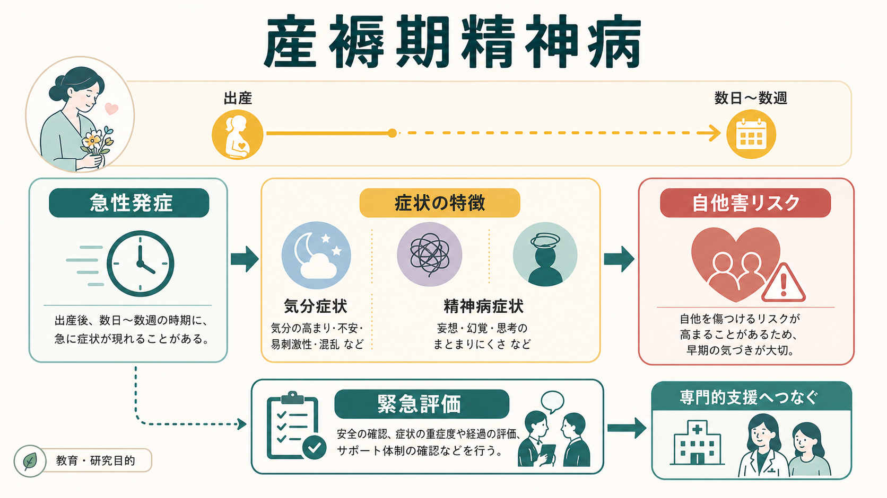
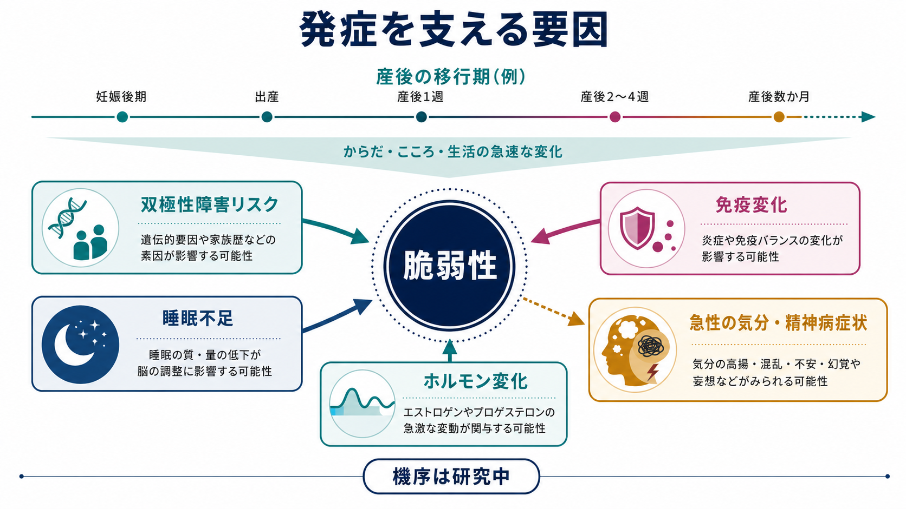
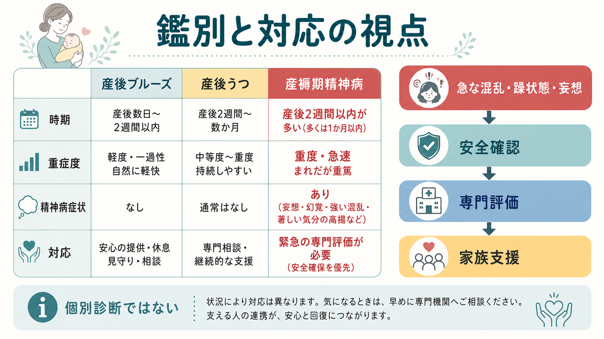

# 産褥期精神病とは何か

## 要点

- 産褥期精神病は、出産後の数日から数週に急性発症しやすい、まれだが重篤な精神病状態である。
- 中核は、[[躁状態とは何か|躁状態]]・抑うつ・混乱・[[妄想とは何か|妄想]]・[[幻覚とは何か|幻覚]]などが短期間に組み合わさる点にある。
- [[双極性障害は情動ネットワークの異常として説明できるのか|双極性障害]]との関連が強く、産褥期に初めて明らかになることもある。
- [[希死念慮とは何か|希死念慮]]、自傷、乳児への危害リスクを含む安全評価が重要で、NICE は幻覚・妄想・躁症状が産後に出た場合、専門サービスによる即時評価を推奨している [1]。
- 本稿は教育・研究目的の概説であり、個別の診断や治療指示ではない。

## この記事で答える問い

1. 産褥期精神病は、産後うつや産後ブルーズと何が違うのか。
2. なぜ気分障害、特に双極性障害スペクトラムと関連づけて理解されるのか。
3. なぜ「精神病症状があるか」だけでなく、自他害リスクと家族支援を同時に見る必要があるのか。

## まず結論

産褥期精神病は、出産後に起こる「精神病症状を伴う重い気分エピソード」として理解すると見通しがよい。幻覚や妄想だけでなく、気分の高揚、焦燥、易怒性、抑うつ、睡眠の著しい乱れ、意識の混乱、まとまりにくい行動が急速に変化するため、単なる「産後の疲れ」や「一時的な落ち込み」として扱うと危険である [2]。

頻度はおおむね 1,000 出産あたり 1-2 例とされ、まれではあるが、急性期には自殺や乳児への危害リスクが問題になりうるため、精神科救急に近い優先度で評価される [3], [4]。ただし、リスクを強調することは、母親を危険視することではない。むしろ、本人の判断力と安全を一時的に支え、母子と家族を守るための評価枠組みである。

## 背景

出産後は、睡眠、身体回復、授乳、家族役割、内分泌変化、免疫変化が短期間に重なる。多くの人では一過性の気分変動や不安として経過するが、少数では急激な精神状態の変化として現れる。NICE は産後 1 年を postnatal period として扱い、そのなかでも産褥期精神病は「非常に急速に重症化しうる」状態として区別している [1]。

臨床的に重要なのは、発症が「産後」という時間窓に強く結びつく点である。典型的には産後数日から数週に出現し、初産、既往の双極性障害、過去の産褥期精神病、家族歴などがリスク因子として挙げられる [2], [5]。一方で、過去に明らかな精神科入院歴がない人にも初発するため、既往歴だけで除外することはできない [4]。

## 基本概念

産褥期精神病は、DSM や ICD の単一診断名というより、産後という時期に急性発症した精神病性・気分性の症候群として扱われる。実際には、双極性障害、うつ病性エピソード、短期精神病性障害、せん妄、内分泌疾患、感染、物質使用などとの鑑別が必要になる [2], [6]。

観察されやすい症状は次の通りである。

| 領域 | 例 | 関連する既存ノート |
|---|---|---|
| 気分 | 高揚、易怒性、抑うつ、気分の急変 | [[気分とは何か]], [[気分不安定性とは何か]], [[抑うつ気分とは何か]] |
| 睡眠・活動性 | 眠らなくても動き続ける、極端な不眠、焦燥 | [[不眠とは何か]], [[躁状態とは何か]] |
| 思考・知覚 | 妄想、幻覚、混乱、思考のまとまりにくさ | [[妄想とは何か]], [[幻覚とは何か]], [[思考促迫とは何か]] |
| 安全 | 自傷、希死念慮、乳児への危害に関する懸念 | [[希死念慮とは何か]], [[自殺念慮と自殺企図は何が違うのか]], [[自殺リスク評価では何を聞くべきか]] |

産後ブルーズは多くの場合、産後数日から 2 週間以内の軽度・一過性の気分変動であり、精神病症状を伴わない。産後うつはより持続的な抑うつ、興味低下、罪責感、睡眠・食欲変化などを中心にする。産褥期精神病は、精神病症状、躁状態、強い混乱、急速な重症化が目立つ点で区別される [1], [5]。

## 仕組み

産褥期精神病の機序は単一原因では説明されない。現在の理解では、双極性障害への脆弱性、出産後の急速な内分泌変化、睡眠遮断、概日リズムの乱れ、免疫・炎症系の変化、心理社会的ストレスが重なり、急性の気分・精神病症状を引き起こすと考えられている [3], [5]。

特に睡眠は、単なる疲労の問題ではない。双極性障害では睡眠不足が躁状態や混合状態を誘発しうるため、産後の断続的睡眠は脆弱性を持つ人にとって大きな負荷になる。睡眠、ホルモン、免疫、情動制御の変化が互いに影響し合うため、「産後だから気分が揺れる」という一般論だけでは病態を見落としやすい [3], [7]。

## 図解

上の図は、産褥期精神病を「脆弱性」と「産後の急激な生物心理社会的変化」の相互作用として整理したものである。中心にあるのは、出産そのものが危険という考えではなく、特定の脆弱性をもつ人にとって、産後の睡眠遮断、ホルモン変化、免疫変化、役割変化が短期間に集中するという事実である。

次の図は、産後ブルーズ、産後うつ、産褥期精神病の違いと、臨床的対応の視点をまとめたものである。実際の評価では、症状名を機械的に当てはめるよりも、発症時期、急速な変化、精神病症状、睡眠、判断力、安全、支援体制を同時に見る。

## 臨床・研究との接続

臨床では、まず急性の安全評価が優先される。本人が自分や乳児を守れているか、強い妄想や命令性の幻聴がないか、希死念慮や自傷の計画がないか、家族が継続的に見守れるかを確認する。NICE は産後の幻覚、妄想、躁状態では専門サービスによる 4 時間以内の評価を求めており、これは「慎重すぎる対応」ではなく、急速な変動を前提にした安全確保である [1]。

治療研究では、急性期には入院環境、抗精神病薬、気分安定薬、必要時の電気けいれん療法などが検討される。2023 年の治療アルゴリズムでは、急性期管理と再発予防の両方でリチウムのエビデンスが比較的強いと整理されているが、授乳、腎機能、甲状腺機能、本人の希望、家族支援を含めた個別判断が必要である [6]。本稿では薬物選択の詳細は扱わない。

研究上の未解決問題は、誰が初発するかをどこまで予測できるかである。既往の双極性障害や過去の産褥期精神病は明確なリスクだが、過去歴のない人にも発症する。NICE も、ハイリスク者の同定と予防介入を研究課題として挙げている [1]。

## よくある誤解

**「産後うつの重い版である」**  
産褥期精神病は産後うつと重なる部分を持つが、精神病症状、躁状態、急速な混乱、自他害リスクを伴いやすい点で別に評価する必要がある [5]。

**「赤ちゃんを危険にさらす母親、という意味である」**  
そうではない。産褥期精神病では判断力と現実検討が一時的に大きく損なわれることがあるため、安全評価を行う。これは本人を責めるためではなく、本人・乳児・家族を守るための支援である。

**「精神病症状がなければ安心である」**  
精神病症状の有無は重要だが、それだけでは不十分である。[[せん妄とは何か|せん妄]]、甲状腺疾患、感染、薬物・物質、睡眠遮断、強い躁状態なども急性の混乱や危険行動につながるため、身体疾患と精神疾患の両面から評価する必要がある [2], [8]。

**「本人が病気だと自覚していれば軽い」**  
洞察は変動する。ある時点で説明できても、数時間から数日のうちに妄想、混乱、不眠、焦燥が強まることがある。急性期では、本人の訴えだけでなく、家族や助産師・産科スタッフからの情報も重要になる [6]。

## 関連ノート

- [[双極性障害は情動ネットワークの異常として説明できるのか]]
- [[躁状態とは何か]]
- [[軽躁状態とは何か]]
- [[不眠とは何か]]
- [[幻覚とは何か]]
- [[妄想とは何か]]
- [[せん妄とは何か]]
- [[希死念慮とは何か]]
- [[自殺リスク評価では何を聞くべきか]]
- [[初回エピソード精神病とは何か]]
- [[短期精神病性障害とは何か]]
- [[急性一過性精神病性障害とは何か]]

## MOC更新候補

- `content/00_MOC/` 配下の精神医学・周産期メンタルヘルス関連 MOC があれば、本記事を「疾患・症候群」および「周産期精神医学」の項目に追加する。
- 並列生成ジョブとの衝突を避けるため、本タスクでは MOC 本体は更新しない。

## 今後の作成候補

- 産後うつとは何か
- 周産期メンタルヘルスとは何か
- 産褥期精神病の再発予防
- 母子同室と精神科入院の倫理

## 理解チェック

1. 産褥期精神病を、産後ブルーズや産後うつと区別する臨床的特徴は何か。
2. なぜ双極性障害スペクトラムとの関連が重視されるのか。
3. 自他害リスクを確認することが、母親への偏見ではなく支援である理由は何か。
4. 産褥期精神病の機序を、単一原因ではなく複数要因の相互作用として説明するとどうなるか。

## 参考文献

[1] National Institute for Health and Care Excellence. *Antenatal and postnatal mental health: clinical management and service guidance* (NICE guideline CG192). 2014; updated 2020; last reviewed 2025. https://www.nice.org.uk/guidance/cg192

[2] American College of Obstetricians and Gynecologists. Screening and Diagnosis of Mental Health Conditions During Pregnancy and Postpartum: ACOG Clinical Practice Guideline No. 4. *Obstetrics & Gynecology*. 2023;141(6):1232-1261. https://doi.org/10.1097/AOG.0000000000005200

[3] Bergink V, Rasgon N, Wisner KL. Postpartum Psychosis: Madness, Mania, and Melancholia in Motherhood. *American Journal of Psychiatry*. 2016;173(12):1179-1188. https://doi.org/10.1176/appi.ajp.2016.16040454

[4] Friedman SH, Reed E, Ross NE. Postpartum Psychosis. *Current Psychiatry Reports*. 2023;25(2):65-72. https://doi.org/10.1007/s11920-022-01406-4

[5] Meltzer-Brody S, Howard LM, Bergink V, Vigod S, Jones I, Munk-Olsen T, et al. Postpartum psychiatric disorders. *Nature Reviews Disease Primers*. 2018;4:18022. https://doi.org/10.1038/nrdp.2018.22

[6] Jairaj C, Seneviratne G, Bergink V, Sommer IE, Dazzan P. Postpartum psychosis: A proposed treatment algorithm. *Journal of Psychopharmacology*. 2023;37(10):960-970. https://doi.org/10.1177/02698811231181573

[7] American College of Obstetricians and Gynecologists. Treatment and Management of Mental Health Conditions During Pregnancy and Postpartum: ACOG Clinical Practice Guideline No. 5. *Obstetrics & Gynecology*. 2023;141(6):1262-1288. https://doi.org/10.1097/AOG.0000000000005202

[8] Sit D, Rothschild AJ, Wisner KL. A Review of Postpartum Psychosis. *Journal of Women's Health*. 2006;15(4):352-368. https://doi.org/10.1089/jwh.2006.15.352

## 未解決問題

- 過去の精神科既往がない初発例を、妊娠中にどこまで予測できるか。
- 睡眠保護、家族支援、薬物予防をどのように組み合わせると、再発予防と母子関係の支援を両立できるか。
- 生物学的マーカー、心理社会的リスク、産科情報を統合した実用的な層別化モデルを作れるか。
