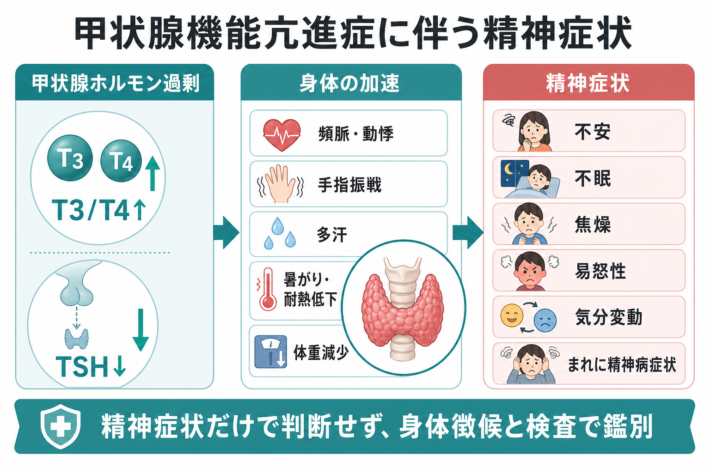
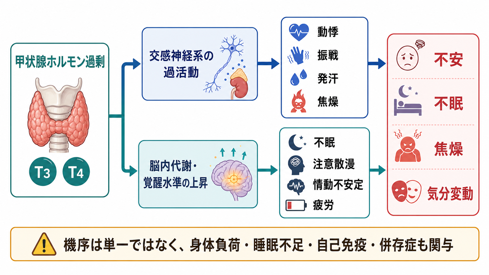
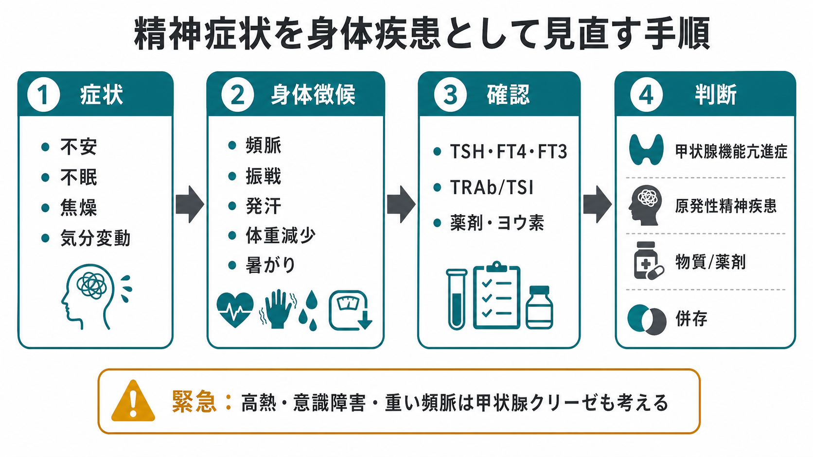

# 甲状腺機能亢進症に伴う精神症状とは何か

## 要点

- 甲状腺機能亢進症では、不安、不眠、焦燥、易怒性、気分変動、注意散漫、疲労感などが前景に出ることがある。精神症状だけを見ると、[[不安症群とは何か]]、[[不眠障害とは何か]]、[[うつ病とは何か]]、[[双極性障害とは何か]]と似て見える。
- 鑑別の手がかりは、「精神症状」だけでなく、頻脈、振戦、発汗、暑がり、体重減少、甲状腺腫、眼症状、下痢、月経変化などの身体徴候を同時に拾うことである[1][2][3]。
- 成人で甲状腺機能異常を疑うときは、まず TSH を測定し、TSH が低ければ FT4 と FT3 を同じ検体で確認する、という検査の流れが推奨されている[2]。
- 重い頻脈、高熱、意識障害、せん妄、精神病症状、心不全、消化器症状が重なる場合は、甲状腺クリーゼを含む緊急状態を考える[8]。
- 本記事は教育・研究目的の整理であり、個別の診断や治療指示ではない。実臨床では、身体所見、検査値、薬剤歴、併存疾患、精神科的評価を統合して判断する。

## この記事で答える問い

1. 甲状腺機能亢進症では、どのような精神症状が出るのか。
2. なぜ不安症、うつ病、双極性障害、不眠障害のように見えるのか。
3. 精神科・心理臨床の評価で、どの時点で甲状腺機能を疑うべきか。
4. どのような検査・身体徴候・赤旗を確認すべきか。

## まず結論

甲状腺機能亢進症に伴う精神症状は、「心の問題に身体症状が付随する」のではなく、「全身の代謝と覚醒水準が上がった状態が、精神症状としても現れる」と考えると理解しやすい。過剰な甲状腺ホルモン作用は、心拍、体温調節、筋肉、消化管、睡眠、情動調整に広く影響する。そのため、不安、焦燥、不眠、易怒性、気分変動、疲労感が、身体の加速感と一体になって出る[1][4]。

ただし、「不安があるから甲状腺機能亢進症」と短絡してはいけない。精神症状は非特異的であり、原発性の[[全般不安症とは何か]]や[[パニック症とは何か]]、物質・薬剤、睡眠不足、身体疾患、ストレス反応との重なりが多い。重要なのは、精神症状を起点にしても、身体徴候と甲状腺機能検査を見落とさないことである[2][4]。

## 背景

甲状腺機能亢進症は、甲状腺が過剰に甲状腺ホルモンを産生・分泌する状態である。甲状腺中毒症は、原因を問わず循環中の甲状腺ホルモン作用が過剰な状態を指す、より広い概念である[1][2]。代表的な原因には、バセドウ病、機能性結節、甲状腺炎、ヨウ素や甲状腺ホルモン製剤の影響などがある[1][3]。

精神医学的に重要なのは、甲状腺機能亢進症が「不安っぽい人」「眠れない人」「落ち着かない人」として最初に現れる場合がある点である。NIDDK は、神経過敏、易怒性、睡眠困難、疲労、手の震え、発汗、暑がり、頻脈、体重減少などを典型症状として挙げている[3]。Endotext も、過活動、不安、落ち着かなさ、気分障害、不眠を甲状腺機能亢進症の特徴として整理している[4]。

精神症状との関連は疫学研究でも示されている。デンマークの全国登録研究では、甲状腺機能亢進症の診断前後で、精神科診断による入院や抗精神病薬・抗うつ薬・抗不安薬の使用リスクが高かった[6]。また、系統的レビュー・メタ解析では、甲状腺機能亢進症の人は甲状腺機能正常者より臨床的うつ病のオッズが高いと報告されている[7]。ただし、これらは関連を示す研究であり、全ての精神症状が甲状腺ホルモンだけで説明できるという意味ではない。

## 基本概念

### 甲状腺機能亢進症と甲状腺中毒症

甲状腺機能亢進症は、甲状腺自体がホルモンを作りすぎる状態である。甲状腺中毒症は、甲状腺炎で蓄えられたホルモンが漏れ出る場合や、外因性の甲状腺ホルモン摂取も含む。治療方針が異なるため、ATA ガイドラインは、甲状腺中毒症の原因を評価することを重視している[1]。

### 精神症状は「単独」ではなく「束」で見る

甲状腺機能亢進症を疑う精神症状は、単独の不安ではなく、次のような束で現れやすい。

| 領域 | 見え方 | 鑑別上の意味 |
|---|---|---|
| 不安・焦燥 | そわそわする、じっとしていられない、内的緊張が強い | [[不安症群とは何か]]や[[カフェイン関連障害とは何か]]に似る |
| 睡眠 | 寝つけない、中途覚醒、眠っても疲れる | [[不眠障害とは何か]]と区別しにくい |
| 気分 | 易怒性、涙もろさ、気分変動、抑うつ | [[うつ病とは何か]]や[[双極性障害とは何か]]との鑑別が必要 |
| 認知 | 注意散漫、作業効率低下、落ち着きのなさ | ADHD 様に見えることがある |
| 重症例 | せん妄、精神病症状、著しい興奮 | 甲状腺クリーゼや身体疾患性精神症状を考える[8] |

### 高齢者では非典型的に見える

高齢者では、典型的な「活動性の上昇」よりも、食欲低下、引きこもり、抑うつ、認知症様の変化として見えることがある。NIDDK は、高齢者の甲状腺機能亢進症がうつ病や認知症と誤られることがあると説明している[3]。したがって、高齢者の新規発症の気分変化や認知変化では、[[認知症とは何か]]だけでなく内分泌疾患も鑑別に入れる。

## 仕組み

甲状腺ホルモンは、全身のエネルギー利用、心血管系、熱産生、筋肉、消化管、神経系の活動に影響する。甲状腺ホルモンが過剰になると、身体は「アクセルが踏まれた」状態に近づく。精神症状は、そのアクセルが脳と身体の両方にかかった結果として理解できる[3][4]。

第一に、交感神経系の反応性が高まり、動悸、振戦、発汗、焦燥、身体的不安感が強くなる。患者は「理由なく不安」と表現することがあるが、実際には頻脈や振戦などの身体信号が不安感を増幅している場合がある。

第二に、睡眠と覚醒のバランスが崩れる。不眠が続くと、情動調整、注意、衝動制御が低下し、不安、易怒性、抑うつ、気分変動がさらに強くなる。これは[[睡眠覚醒障害群とは何か]]や[[不眠障害とは何か]]の評価とも接続する。

第三に、バセドウ病では自己免疫、眼症状、外見変化、慢性疾患としての負担も精神症状に影響しうる。バセドウ病患者では不安・抑うつ症状が高い研究がある一方、甲状腺機能や自己抗体だけでは症状を十分に説明できない研究もある[5]。つまり、精神症状は「ホルモン値が高いから一対一で出る」のではなく、身体負荷、睡眠、自己免疫、生活機能、併存症が重なって生じる。

## 図解

精神科的な訴えから入った場合でも、次の順序で身体疾患として見直すと、見落としを減らしやすい。

1. 不安、不眠、焦燥、気分変動、注意散漫を確認する。
2. 頻脈、手指振戦、発汗、暑がり、体重減少、下痢、甲状腺腫、眼症状を確認する。
3. 薬剤歴を確認する。甲状腺ホルモン製剤、ヨウ素含有薬、造影剤、サプリメント、カフェイン、覚醒剤、ステロイドなどを含める。
4. TSH、FT4、FT3 を確認する。成人で二次性甲状腺機能異常が疑われない場合は、TSH から始め、TSH 低値なら FT4・FT3 を同じ検体で測る流れが NICE で示されている[2]。
5. 甲状腺中毒症が確認されたら、TRAb、シンチグラフィ、超音波などで原因を検討する。NICE は、成人の甲状腺中毒症で TRAb を測定し、陰性ならテクネチウムシンチグラフィを考慮することを推奨している[2]。

## 臨床・研究との接続

### 精神科初診での見落としやすい場面

初診で「最近ずっと不安」「眠れない」「イライラする」と訴える人が、同時に体重減少、手の震え、暑がり、動悸を語っていても、主訴が精神症状だと身体徴候が背景化しやすい。[[精神症状の横断的評価とは何か]]では、症状の横断面だけでなく、時間経過、身体疾患、薬剤、物質、睡眠、生活機能を同時に見る必要がある。

特に次の状況では、甲状腺機能を確認する価値が高い。

- 不安・不眠・焦燥が急に始まった。
- 動悸、振戦、発汗、暑がり、体重減少が同時期にある。
- 既存の不安症や気分障害としては身体症状が強すぎる。
- 高齢者で、抑うつ、無気力、認知症様変化が新たに出た。
- 産後、ヨウ素曝露、甲状腺疾患の既往、自己免疫疾患、甲状腺薬の使用がある。

### 原発性精神疾患との関係

甲状腺機能亢進症が見つかっても、精神症状を全て内分泌だけに還元しないことが重要である。原発性の[[パニック症とは何か]]や[[双極性障害とは何か]]が併存する場合もある。逆に、既存の精神疾患がある人では、甲状腺機能亢進症によって不眠、焦燥、易怒性、服薬アドヒアランス低下が悪化し、再燃のように見える場合がある。

### 治療で精神症状はどう変わるか

甲状腺機能亢進症の治療では、抗甲状腺薬、放射性ヨウ素、手術、原因別治療、症状緩和のためのβ遮断薬などが検討される[1][2]。甲状腺機能が改善すると、不安、動悸、不眠、疲労、生活の質は改善しやすいが、症状が残る人もいる[5][7]。残存する精神症状がある場合は、睡眠、慢性疾患ストレス、眼症状、併存する不安症・うつ病・双極性障害、物質使用を改めて評価する。

## よくある誤解

### 「不安があるなら、まず精神疾患でよい」

不安は精神疾患でも身体疾患でも起こる。頻脈、振戦、発汗、体重減少、暑がりを伴う不安では、甲状腺機能亢進症を含む身体疾患を考える。

### 「甲状腺機能亢進症なら必ず痩せて元気になる」

典型例では体重減少や過活動が目立つが、高齢者では無気力、抑うつ、食欲低下、認知症様変化として見えることがある[3]。体重減少がないから否定できるわけではない。

### 「甲状腺ホルモンが正常化すれば精神症状は必ず消える」

改善することは多いが、バセドウ病の慢性疾患負担、眼症状、睡眠障害、併存精神疾患、生活機能低下が残る場合がある[5][7]。検査値だけでなく、主観的苦痛と機能を追跡する。

### 「TSH だけ正常なら常に安心」

多くの成人では TSH が入口になるが、二次性甲状腺機能異常が疑われる場合、妊娠、小児、重症身体疾患、薬剤影響、ビオチン摂取などでは解釈に注意が必要である。NICE は、ビオチン摂取が検査結果を誤らせる可能性にも注意を促している[2]。

## 関連ノート

- [[内分泌疾患に伴う精神症状とは何か]]
- [[身体疾患による気分障害とは何か]]
- [[精神症状の横断的評価とは何か]]
- [[不安症群とは何か]]
- [[全般不安症とは何か]]
- [[パニック症とは何か]]
- [[不眠障害とは何か]]
- [[うつ病とは何か]]
- [[双極性障害とは何か]]
- [[身体症状症とは何か]]
- [[薬剤性精神病とは何か]]
- [[物質誘発性精神病とは何か]]
- [[カフェイン関連障害とは何か]]

## MOC更新候補

- `content/00_MOC/` 配下の精神医学・症候学・身体疾患性精神症状に関する MOC があれば、本記事へのリンク追加候補。
- 並列ジョブとの衝突を避けるため、本タスクでは MOC 本体は更新しない。

## 理解チェック

1. 不安、不眠、焦燥がある患者で、甲状腺機能亢進症を疑う身体徴候を 5 つ挙げられるか。
2. 甲状腺機能亢進症と甲状腺中毒症の違いを説明できるか。
3. TSH が低値だった場合、次に確認する検査を説明できるか。
4. 高齢者で甲状腺機能亢進症がうつ病や認知症様に見える理由を説明できるか。
5. 甲状腺クリーゼを疑う赤旗を挙げられるか。

## 未解決問題

- 甲状腺ホルモン過剰、自己免疫、睡眠障害、慢性疾患負担が、それぞれ精神症状にどの程度寄与するかは、個人差が大きく、単一のモデルでは説明しにくい。
- 甲状腺機能が正常化した後に残る不安・抑うつ・疲労を、どのように内分泌治療、心理社会的支援、精神科治療へ配分するかは、さらに実践的な研究が必要である。
- 精神科初診でどの範囲に甲状腺機能検査を行うべきかは、症状、年齢、身体徴候、既往、医療資源によって判断が分かれる。

## 参考文献

[1] Ross DS, Burch HB, Cooper DS, et al. (2016). 2016 American Thyroid Association Guidelines for Diagnosis and Management of Hyperthyroidism and Other Causes of Thyrotoxicosis. *Thyroid*, 26(10), 1343-1421. https://doi.org/10.1089/thy.2016.0229

[2] National Institute for Health and Care Excellence. (2023). *Thyroid disease: assessment and management* (NICE guideline NG145). https://www.nice.org.uk/guidance/ng145/chapter/recommendations

[3] National Institute of Diabetes and Digestive and Kidney Diseases. *Hyperthyroidism (Overactive Thyroid).* https://www.niddk.nih.gov/health-information/endocrine-diseases/hyperthyroidism

[4] Toro-Tobon D, Stan MN. (2024). *Graves' Disease and the Manifestations of Thyrotoxicosis.* Endotext, NCBI Bookshelf. https://www.ncbi.nlm.nih.gov/books/NBK285567/

[5] Bové KB, Watt T, Vogel A, et al. (2014). Anxiety and Depression Are More Prevalent in Patients with Graves' Disease than in Patients with Nodular Goitre. *European Thyroid Journal*, 3(3), 173-178. https://doi.org/10.1159/000365211

[6] Brandt F, Thvilum M, Almind D, et al. (2014). Hyperthyroidism and psychiatric morbidity: evidence from a Danish nationwide register study. *European Journal of Endocrinology*, 170(2), 341-348. https://doi.org/10.1530/EJE-13-0708

[7] Bode H, Ivens B, Bschor T, et al. (2022). Hyperthyroidism and clinical depression: a systematic review and meta-analysis. *Translational Psychiatry*, 12, 362. https://doi.org/10.1038/s41398-022-02121-7

[8] De Groot LJ, Bartalena L, Feingold KR. (2025). *Thyroid Storm.* Endotext, NCBI Bookshelf. https://www.ncbi.nlm.nih.gov/books/NBK278927/
