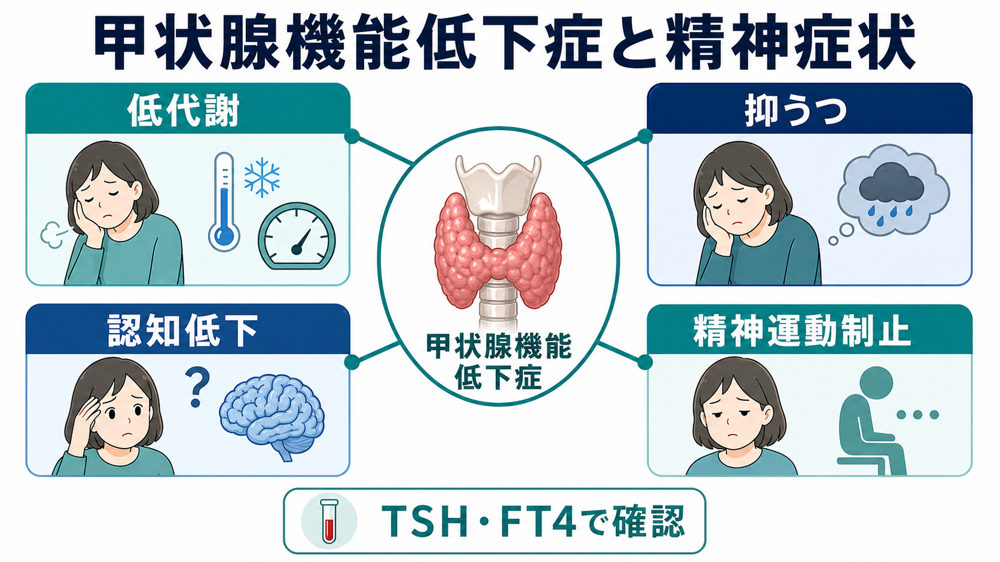
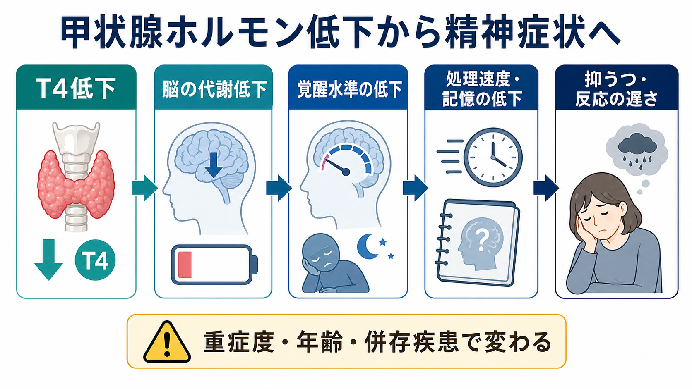
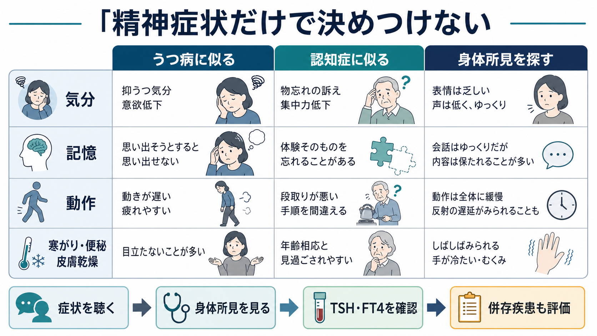

# 甲状腺機能低下症に伴う精神症状とは何か

## 要点

- 甲状腺機能低下症では、疲労、寒がり、便秘、体重増加、皮膚乾燥、徐脈などの身体症状に加えて、抑うつ気分、意欲低下、記憶・注意の低下、反応の遅さ、精神運動制止がみられることがある[1][2]。
- 精神症状は [[うつ病とは何か]] や [[アルツハイマー型認知症とは何か]] に似て見えることがあるが、TSH と遊離T4（FT4）を含む身体評価で、内分泌疾患としての背景を確認する必要がある[1][3]。
- 顕性甲状腺機能低下症では精神・認知症状が治療で改善しうる一方、サブクリニカル甲状腺機能低下症では症状との関連やレボチロキシン補充の利益は一貫せず、年齢、重症度、併存疾患を分けて考える[4][5][6]。
- 本記事は教育・研究目的の整理であり、個別の診断や治療指示ではない。疑わしい症状や急な意識変容、自殺念慮がある場合は、医療機関での評価が優先される。

## この記事で答える問い

1. 甲状腺機能低下症では、どのような精神症状が起こりうるのか。
2. 抑うつ、認知低下、精神運動制止を、一次性精神疾患とどう区別して考えるのか。
3. どの程度まで「甲状腺が原因」と言えるのか。
4. 臨床・研究では、どのような評価軸が重要になるのか。

## まず結論

甲状腺機能低下症に伴う精神症状は、「こころの症状」だけで独立して起こるというより、全身の代謝低下、脳の覚醒水準の低下、身体症状、睡眠、活動量低下、併存疾患が重なって現れる。典型的には、元気が出ない、動作や会話が遅い、集中できない、物忘れが増えた、表情や反応が乏しい、といった形で気づかれる[2][7]。

重要なのは、精神症状の見た目が [[メランコリー型うつ病とは何か]] や認知症に似ていても、甲状腺機能低下症では「身体疾患による精神症状」という層を評価に入れる点である。TSH 高値と FT4 低値があれば顕性甲状腺機能低下症を考え、TSH 高値で FT4 が基準範囲内ならサブクリニカル甲状腺機能低下症として、症状との関係を慎重に読む[1][3]。

## 背景

甲状腺ホルモンは、基礎代謝、体温調節、心血管系、消化管、筋、皮膚、神経系に広く関与する。成人の甲状腺機能低下症では、症状がゆっくり進み、疲労や気分の落ち込みが「加齢」「ストレス」「うつ」と見なされやすい[2][4]。そのため、精神科・プライマリケア・内科のいずれでも、身体所見と検査を組み合わせた鑑別が重要になる。

精神医学では、抑うつ症状や認知低下を見たとき、一次性の気分障害や神経認知障害だけでなく、内分泌疾患、薬剤、睡眠障害、神経疾患、感染症、栄養障害を含めて考える。甲状腺機能低下症は、その代表的な鑑別候補である[1][8]。

## 基本概念

### 顕性甲状腺機能低下症

顕性甲状腺機能低下症は、一般に TSH 高値と FT4 低値で定義される。原発性では甲状腺そのもののホルモン産生低下が中心で、橋本病、甲状腺手術後、放射性ヨウ素治療後、薬剤などが背景になりうる[1][2]。

精神症状としては、抑うつ気分、興味・意欲低下、眠気、集中困難、記憶低下、思考の遅さ、表情の乏しさ、反応の遅さが問題になる。重症例では、まれに幻覚・妄想などの精神病症状を伴うこともあり、古典的には「粘液水腫精神病」と呼ばれてきた[2][7]。

### サブクリニカル甲状腺機能低下症

サブクリニカル甲状腺機能低下症は、TSH が高い一方で FT4 が基準範囲内にある状態を指す。症状がある人もいれば、検査で偶然見つかる人もいる。抑うつや認知低下との関連は研究によって揺れがあり、特に高齢者ではレボチロキシン補充が症状改善に明確な利益を示さない場合がある[5][6]。

この区別は臨床的に重要である。顕性甲状腺機能低下症では身体疾患としての治療対象性が高い一方、サブクリニカルな検査異常だけで、すべての精神症状を甲状腺に帰すのは危険である。

## 仕組み

甲状腺ホルモンは脳に直接・間接に作用する。成人脳では、エネルギー代謝、神経伝達、髄鞘、シナプス機能、覚醒水準、気分調整に関与すると考えられている[4][7]。ただし、精神症状は単一経路で説明できるものではない。

まず、全身の代謝低下により疲れやすさ、眠気、寒がり、筋力低下、便秘が起こりやすくなる。これらは活動量を下げ、社会参加を減らし、結果として抑うつ気分や自己効力感の低下を強めることがある。

次に、脳内の覚醒水準や処理速度が下がると、反応が遅い、話し始めに時間がかかる、考えがまとまらない、記憶の検索に時間がかかるといった形で現れる。これは [[MoCAとは何か]] のような認知スクリーニングで拾われることもあるが、検査値だけで原因を確定できるわけではない。

さらに、重症例では精神運動制止が目立ち、うつ病の制止、認知症の進行、[[せん妄とは何か]] と紛らわしくなることがある。急性の注意変動や意識障害がある場合は、甲状腺だけでなく感染、薬剤、脱水、代謝異常なども同時に評価する必要がある。

## 図解

上の図は、T4 低下から脳の代謝低下、覚醒水準の低下、処理速度・記憶の低下、抑うつや反応の遅さへ至る流れを単純化して示している。実際には、年齢、発症速度、甲状腺機能低下の程度、自己免疫疾患、睡眠、薬剤、心血管疾患、認知症の併存により見え方が変わる[1][4]。

次の図は、臨床で重要な「精神症状だけで決めつけない」という視点である。抑うつに似る、認知症に似る、身体所見がある、という3方向から情報を集めると、一次性精神疾患と身体疾患に伴う精神症状を分けて考えやすくなる。

## 臨床・研究との接続

### 評価の流れ

臨床では、まず症状の時間経過を確認する。急に悪くなったのか、数か月から年単位で進んだのか、出産後・手術後・薬剤開始後・体重変化後に始まったのかを聞く。次に、抑うつ気分、意欲、睡眠、食欲、希死念慮、集中力、記憶、動作の遅さを整理する。

身体面では、寒がり、便秘、皮膚乾燥、むくみ、嗄声、脱毛、月経変化、徐脈、腱反射弛緩相の遅延などを確認する。検査としては TSH と FT4 が中核で、状況に応じて甲状腺自己抗体、貧血、ビタミンB12、肝腎機能、電解質、炎症、薬剤歴も検討される[1][3]。

### 精神医学的な読み方

甲状腺機能低下症に伴う精神症状は、[[うつ病とは何か]] と同じ症候名で語られても、背景モデルが異なる。気分障害としての抑うつエピソード、身体疾患に伴う抑うつ症状、慢性身体症状への心理的反応、認知症やせん妄の併存を分けて考える必要がある。

「TSH が少し高いから抑うつの原因はすべて甲状腺」とも、「抑うつが主だから身体疾患は関係ない」とも言えない。研究では、顕性とサブクリニカル、若年者と高齢者、自己免疫の有無、症状評価尺度、治療前後の変化を分けることが重要である[5][6][7]。

### 治療反応をどう読むか

顕性甲状腺機能低下症では、甲状腺ホルモン補充により身体症状とともに精神・認知症状が改善することがある[1][2]。ただし、改善には時間がかかることがあり、長く続いた症状や併存するうつ病・認知症・睡眠障害が残ることもある。

一方、サブクリニカル甲状腺機能低下症では、抑うつや生活の質への治療効果は一貫しない。高齢者を対象にした TRUST 試験では、レボチロキシンは甲状腺検査値を改善したが、甲状腺関連症状や疲労感の改善はプラセボを上回らなかった[6]。したがって、治療の有無は検査値だけでなく、年齢、TSH の程度、症状、心血管リスク、妊娠可能性、本人の希望を含めた判断になる[1][3]。

## よくある誤解

### 誤解1：甲状腺機能低下症なら必ずうつになる

必ずではない。甲状腺機能低下症で抑うつ様症状は起こりうるが、症状の出方は個人差が大きい。疲労や眠気が前景に出る人もいれば、検査異常があっても精神症状が目立たない人もいる[2][5]。

### 誤解2：抑うつがあるなら甲状腺ホルモンを補えばよい

顕性甲状腺機能低下症では補充療法が標準的に検討されるが、抑うつ症状だけを理由に甲状腺ホルモンを使うわけではない。特にサブクリニカル例では利益とリスクのバランスを慎重に見る必要がある[1][6]。

### 誤解3：認知症に見えるなら不可逆である

甲状腺機能低下症に伴う認知低下は改善しうる場合があるため、可逆的・修正可能な要因として評価する価値がある[7]。ただし、高齢者では [[アルツハイマー型認知症とは何か]] などの神経変性疾患が併存していることもあり、改善しない部分をすべて甲状腺のせいにしないことも重要である。

### 誤解4：精神症状が強いなら精神科だけで完結する

精神症状が強いほど、身体疾患、薬剤、睡眠、栄養、神経疾患、生活背景を同時に評価する必要がある。甲状腺機能低下症は、精神科と内科の境界で見落としやすい代表例である。

## 関連ノート

- [[うつ病とは何か]]
- [[メランコリー型うつ病とは何か]]
- [[アルツハイマー型認知症とは何か]]
- [[せん妄とは何か]]
- [[せん妄と認知症はどう違うのか]]
- [[MoCAとは何か]]

### MOC更新候補

- `content/00_MOC/MOC｜精神医学.md`
- `content/00_MOC/MOC｜症候学.md`
- `content/00_MOC/MOC｜臨床実践・治療.md`

### 今後の作成候補

- 甲状腺機能亢進症に伴う精神症状とは何か
- 内分泌疾患とうつ病の鑑別
- 粘液水腫精神病とは何か
- 身体疾患に伴う精神症状の見立て

## 理解チェック

1. 甲状腺機能低下症に伴う抑うつ様症状では、どのような身体症状を一緒に確認するべきか。
2. 顕性甲状腺機能低下症とサブクリニカル甲状腺機能低下症は、TSH と FT4 でどう区別されるか。
3. 認知症に似た症状があるとき、甲状腺機能低下症を「可逆的要因」として評価する意味は何か。
4. TSH 軽度高値だけで、精神症状の原因を甲状腺に断定してはいけないのはなぜか。

## 未解決問題

- どの程度のサブクリニカル甲状腺機能低下症が、どの年齢層で抑うつや認知症状に臨床的意味を持つのか。
- 甲状腺自己免疫と気分・認知症状の関連は、ホルモン値とは独立してどの程度重要なのか。
- 精神症状の改善を予測する因子として、TSH、FT4、抗体、炎症、睡眠、身体活動をどう統合すべきか。

## 参考文献

[1] Garber, J. R., Cobin, R. H., Gharib, H., et al. (2012). Clinical Practice Guidelines for Hypothyroidism in Adults: Cosponsored by the American Association of Clinical Endocrinologists and the American Thyroid Association. *Thyroid*, 22(12), 1200-1235. https://doi.org/10.1089/thy.2012.0205

[2] Chaker, L., Bianco, A. C., Jonklaas, J., & Peeters, R. P. (2017). Hypothyroidism. *The Lancet*, 390(10101), 1550-1562. https://doi.org/10.1016/S0140-6736(17)30703-1

[3] National Institute for Health and Care Excellence. (2019, updated). *Thyroid disease: assessment and management (NG145)*. https://www.nice.org.uk/guidance/ng145

[4] Feingold, K. R., Anawalt, B., Blackman, M. R., et al. (Eds.). *Endotext: Adult Hypothyroidism*. NCBI Bookshelf. https://www.ncbi.nlm.nih.gov/books/NBK285561/

[5] Loh, H. H., Lim, L. L., Yee, A., & Loh, H. S. (2019). Association between subclinical hypothyroidism and depression: an updated systematic review and meta-analysis. *BMC Psychiatry*, 19, 12. https://doi.org/10.1186/s12888-018-2006-2

[6] Stott, D. J., Rodondi, N., Kearney, P. M., et al. (2017). Thyroid Hormone Therapy for Older Adults with Subclinical Hypothyroidism. *New England Journal of Medicine*, 376, 2534-2544. https://doi.org/10.1056/NEJMoa1603825

[7] Samuels, M. H. (2014). Psychiatric and cognitive manifestations of hypothyroidism. *Current Opinion in Endocrinology, Diabetes and Obesity*, 21(5), 377-383. https://doi.org/10.1097/MED.0000000000000089

[8] American Thyroid Association. (n.d.). *Hypothyroidism*. https://www.thyroid.org/hypothyroidism/
