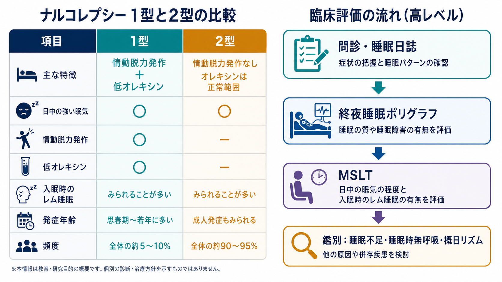
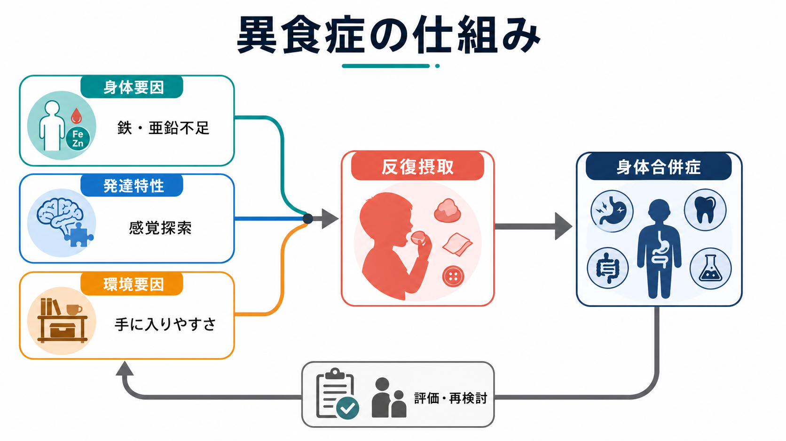
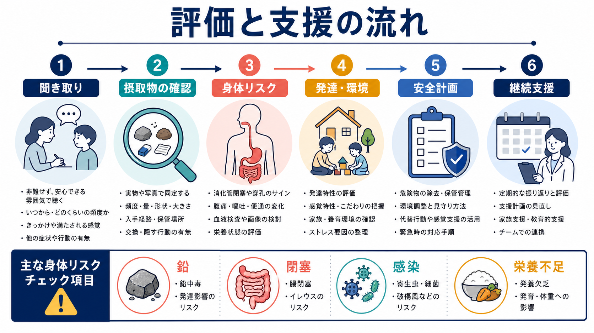

# 異食症とは何か

## 要点

- 異食症は、土、紙、髪、氷、粘土、塗料片など、栄養価のない非食品・非栄養物を反復して摂取する行動が中心となる摂食・食行動の問題である[1][3]。
- 診断では「何を食べたか」だけでなく、少なくとも約1か月持続しているか、発達水準に照らして不適切か、文化的・宗教的・地域的慣習で説明されないかを確認する[1][2][3]。
- 乳幼児の口入れ行動、文化的に共有された土食、病気を装うための摂取、自傷目的の嚥下は、異食症と同じように扱ってはいけない[3][4]。
- 身体リスクは摂取物で大きく変わる。鉛中毒、腸閉塞、寄生虫・感染、歯や消化管の損傷、鉄・亜鉛などの欠乏、電解質異常を評価する[3][4]。
- 支援では、叱責や単純な禁止だけでなく、身体合併症の確認、栄養評価、発達特性・環境要因の把握、安全計画、行動支援を組み合わせる[4][8]。

## この記事で答える問い

1. 異食症は、乳幼児の口入れや偏食と何が違うのか。
2. なぜ非栄養物を食べる行動が起こり、続くことがあるのか。
3. どのような身体リスクを優先して確認すべきか。
4. 臨床・研究では、どのように評価と支援を組み立てるのか。

## まず結論

異食症は「変わったものを食べる癖」ではなく、発達、身体状態、感覚特性、環境、文化、併存する精神・神経発達症を合わせて読む必要がある行動症候群である。DSM-5-TRでは、非栄養・非食品物質の持続的摂取、発達水準との不一致、文化的に支持される慣習ではないこと、他の精神疾患や身体疾患の文脈で生じる場合にも個別の臨床的注意を要するほど重いことが重視される[1][3]。ICD-11の臨床記述でも、摂食・食行動の障害として、発達水準と文化的文脈を踏まえた臨床判断が必要になる[2]。

したがって評価の入口は、「本人を責める」ことではない。まず、何を、どのくらい、どこで、いつから、どのような状況で摂取しているのかを確認し、鉛、閉塞、感染、栄養欠乏などの危険を下げる。そのうえで、[[鑑別診断とは何か|鑑別診断]]、発達史、家庭・学校・施設環境、感覚探索、ストレス、妊娠や鉄欠乏などの身体要因を統合して考える。

## 背景

異食行動は、歴史的にも文化的にも多様である。土や粘土を食べる geophagia、氷を食べる pagophagia、でんぷんを食べる amylophagia など、対象物によって呼び分けられることがある[4]。ただし、対象物の名前を付けるだけでは臨床的な理解にはならない。重要なのは、その行動が発達的に予期される範囲を超えているか、安全や生活機能にどの程度影響しているか、文化的文脈で説明できるかである[1][3]。

乳幼児は探索の一部として物を口に入れる。Merck Manual は、2歳未満の子どもでは非食品物質の口入れや摂取が発達上みられうるため、通常は異食症とは診断しないと整理している[3]。この点は、[[発達精神病理学とは何か]]の視点と相性がよい。つまり、同じ行動でも、年齢、発達水準、環境、持続性、危険性によって意味が変わる。

異食症は、単独でみられることもあるが、自閉スペクトラム症、知的発達症、統合失調症、強迫症、抜毛症、妊娠、鉄欠乏性貧血などと関連して報告される[3][4][5][6]。ただし、関連があることは単一原因を意味しない。鉄欠乏があるから必ず異食が起こるわけでも、異食があるから必ず鉄欠乏が原因であるわけでもない。

## 基本概念

### 診断で見る軸

異食症を考えるときは、次の4軸で整理すると混乱しにくい。

| 軸 | 確認すること | 注意点 |
|---|---|---|
| 行動 | 非栄養・非食品物質の反復摂取があるか | 口に入れるだけか、嚥下しているかを分ける |
| 時間 | 約1か月以上続くか | 一回の事故や好奇心だけで診断しない |
| 発達 | 年齢・発達水準に照らして不適切か | 2歳未満の口入れ行動と区別する |
| 文脈 | 文化的慣習・宗教的実践・地域的習慣か | 価値判断ではなく、共有された実践かを確認する |

DSM-5-TRとICD-11はいずれも、行動そのものだけでなく、発達水準と文化的文脈を含めて判断する点を重視する[1][2]。これは[[DSMとICDは何が違うのか|DSMとICD]]を使うときの一般的な注意点でもある。診断名は観察された行動を整理する道具であり、本人の性格や意志の弱さを表すラベルではない。

### 何を摂取するのか

報告される対象物は、土、粘土、紙、チョーク、髪、糸、布、氷、でんぷん、塗料片、灰、石鹸、コーヒーかす、卵殻など幅広い[4]。臨床的には「非食品かどうか」だけでなく、次の情報が重要になる。

- 毒性: 鉛、ヒ素、水銀、農薬、洗剤などを含む可能性。
- 物理的危険: 鋭利物、磁石、電池、長い髪や糸、硬い塊。
- 感染リスク: 土、便、汚染された水、動物由来物。
- 栄養・代謝: 氷食と鉄欠乏、粘土摂取と鉄・亜鉛吸収阻害、電解質異常。
- アクセス: 家庭、園・学校、施設、屋外、職場で手に入りやすいか。

## 仕組み

異食症には単一のメカニズムを仮定しにくい。むしろ、身体要因、発達特性、学習、環境、文化、ストレスが重なって、反復摂取が維持されると考える方が実用的である[4][7]。

### 身体要因

鉄欠乏性貧血と異食、特に氷食との関連は古くから報告されている。Borgna-Pignatti と Zanella は、鉄欠乏の臨床表現として異食が現れることがあり、鉄補充で改善する例がある一方、原因機序はなお十分には説明されていないと整理している[6]。したがって、鉄・亜鉛などの検査は重要だが、「不足している栄養素を身体が本能的に探している」と単純化しすぎない方がよい。

### 発達特性と感覚探索

自閉スペクトラム症や知的発達症では、感覚探索、反復行動、危険認識の難しさ、環境内の物へのアクセス、コミュニケーション困難が異食行動に関わることがある。Fields らの Pediatrics 研究は、30-68か月の子どもを対象に、異食が自閉スペクトラム症や他の発達障害のある集団で一般集団対照より多くみられることを報告した[5]。この知見は、異食症を[[摂食障害群とは何か|摂食障害群]]だけでなく、発達支援と安全設計の問題として読む必要を示している。

### 学習と環境

異食行動は、摂取物の感触、口腔刺激、注意を得ること、退屈の低減、不安の調整、アクセスしやすさによって維持される場合がある。たとえば、土や紙が常に手に届く、監視が難しい、代替行動がない、摂取後に強い反応が返ってくる、といった環境は行動を維持しうる。行動支援では、単に叱るよりも、摂取物へのアクセスを減らし、安全な代替刺激を用意し、望ましい行動を強化する方針が検討される[8]。

## 図解

異食症の評価は、本人の話だけでなく、家族・支援者からの情報、実際の環境、摂取物、身体症状を合わせて進める。特に小児や発達障害のある人では、本人が摂取内容や量を正確に説明できないことがある。

上の図の要点は、次の順序である。

1. 聞き取り: いつ、どこで、何を、どれくらい、誰が見たか。
2. 摂取物の確認: 実物、写真、包装、場所、混入物を確認する。
3. 身体リスク: 鉛、閉塞、感染、栄養不足、電解質異常を考える。
4. 発達・環境: 年齢、発達水準、感覚特性、生活場面、アクセスをみる。
5. 安全計画: 危険物を減らし、監視と代替行動を具体化する。
6. 継続支援: 栄養、医療、心理・行動支援、家族支援をつなぐ。

## 臨床・研究との接続

### 身体評価

異食症で最初に外してはいけないのは、身体合併症である。Merck Manual と StatPearls は、摂取物に応じて、鉄欠乏、亜鉛欠乏、鉛中毒、腸閉塞、寄生虫感染、消化管穿孔、電解質異常などを評価する必要があると述べている[3][4]。塗料片や古い建物の粉じん、土、チョークなどでは鉛曝露を考える。腹痛、便秘、嘔吐、発熱、体重減少、意識変容、けいれん、血便がある場合は、精神医学的説明に寄せすぎず、身体疾患としての緊急性を評価する。

### 鑑別診断

異食症と似て見える行動には、次のようなものがある。

| 状態 | 異食症との違い |
|---|---|
| 乳幼児の口入れ | 発達上よくみられ、持続性・危険性・年齢で判断する |
| 偏食・選択的摂食 | 食品の種類や食感への選好が中心で、非食品摂取とは限らない |
| 自傷目的の嚥下 | 苦痛や自傷意図、安全確保が中心課題になる |
| 作為症・詐病 | 病者役割や外的利得の文脈を評価する |
| 強迫症関連行動 | 汚染恐怖、儀式、侵入思考との関係をみる |
| 精神病性障害 | 妄想、幻覚、命令体験、解体した行動との関係をみる |

このような鑑別は、[[精神症状の横断的評価とは何か]]や[[強迫症とは何か]]と接続する。異食症という診断名が付いても、併存症や身体疾患を見落とさないことが重要である。

### 支援

支援は、危険を下げるための環境調整と、行動が維持される条件を変える介入を組み合わせる。Moline らのシステマティックレビューでは、小児・青年の異食に対する行動介入研究は主に症例研究であり、質の高い試験は限られるものの、随伴性強化や弁別訓練を含む組み合わせ介入を、より制限の少ない手続きから始めることが推奨されている[8]。発達障害や知的発達症がある場合は、本人の理解水準に合わせた視覚的手がかり、代替行動、保護者・支援者の一貫した対応が必要になる。

薬物療法は異食症そのものに対する標準治療ではない。鉄欠乏や亜鉛欠乏が確認されれば補充を行い、鉛中毒、閉塞、感染などは身体医学的に治療する[3][4]。精神症状や神経発達症が併存する場合は、それぞれの評価と支援を別に組み立てる。

## よくある誤解

### 誤解1: 異食症は「変な癖」なので放っておいてよい

短期で自然に消えることもあるが、摂取物によっては鉛中毒、腸閉塞、感染、歯や消化管の損傷につながる[3][4]。行動が目立たない場合でも、古い塗料、土、便、鋭利物、磁石、電池などが関わると危険は高い。

### 誤解2: 非食品を食べるなら、必ず精神疾患である

2歳未満の探索的口入れや、文化的・宗教的に共有された実践は、異食症とは区別して考える[1][3]。一方で、文化的慣習がある場合でも、本人に苦痛や身体リスクがあるなら、非難ではなく安全と健康の観点から評価する。

### 誤解3: 鉄を補えば必ず治る

鉄欠乏と異食には関連があるが、全例を説明できるわけではない[4][6]。栄養評価は重要だが、発達特性、感覚探索、環境、ストレス、併存症、学習された行動も合わせて見る必要がある。

### 誤解4: 叱ればやめられる

叱責は隠れて摂取する行動を増やし、報告を遅らせることがある。安全確保、アクセス制限、代替行動、望ましい行動の強化、家族・支援者の一貫した対応を具体化する方が実用的である[8]。

## 関連ノート

- [[摂食障害群とは何か]]
- [[摂食障害は脳の報酬系や身体感覚とどう関わるのか]]
- [[DSMとICDは何が違うのか]]
- [[鑑別診断とは何か]]
- [[精神症状の横断的評価とは何か]]
- [[発達精神病理学とは何か]]
- [[強迫症とは何か]]
- [[身体症状症とは何か]]

### 関連ノート候補

- 自閉スペクトラム症とは何か
- 知的発達症とは何か
- 鉄欠乏性貧血と精神症状
- 小児の鉛中毒と発達リスク
- 感覚探索とは何か
- 行動支援における機能分析とは何か

### MOC更新候補

- `content/00_MOC/` 配下の精神医学、摂食障害、発達精神病理学、小児精神医学関連 MOC に本記事へのリンクを追加する候補。
- 並列ジョブとの競合を避けるため、このタスクでは MOC ファイルは更新しない。

## 理解チェック

1. 異食症を、単なる「非食品を食べた経験」ではなく臨床的問題として考えるために必要な4つの軸は何か。
2. 2歳未満の口入れ行動と異食症を区別する理由は何か。
3. 土、塗料片、氷、髪を摂取する場合、それぞれどのような身体リスクを考えるか。
4. 鉄欠乏と異食の関係を、単純な因果として断定しにくいのはなぜか。
5. 叱責中心の対応ではなく、環境調整と行動支援が必要になる理由は何か。

## 参考文献

[1] American Psychiatric Association. (2022). *Diagnostic and Statistical Manual of Mental Disorders, Fifth Edition, Text Revision (DSM-5-TR).* American Psychiatric Association Publishing. https://doi.org/10.1176/appi.books.9780890425787

[2] World Health Organization. (2024). *Clinical descriptions and diagnostic requirements for ICD-11 mental, behavioural and neurodevelopmental disorders (CDDR).* https://www.who.int/publications/i/item/9789240077263

[3] Attia, E., & Walsh, B. T. (2025). *Pica.* Merck Manual Professional Edition. https://www.merckmanuals.com/professional/psychiatric-disorders/feeding-and-eating-disorders/pica

[4] Al Nasser, Y., Muco, E., & Alsaad, A. J. (2023). *Pica.* StatPearls. NCBI Bookshelf. https://www.ncbi.nlm.nih.gov/books/NBK532242/

[5] Fields, V. L., Soke, G. N., Reynolds, A., Tian, L. H., Wiggins, L., Maenner, M., DiGuiseppi, C., Kral, T. V. E., Hightshoe, K., & Schieve, L. A. (2021). Pica, autism, and other disabilities. *Pediatrics, 147*(2), e20200462. https://doi.org/10.1542/peds.2020-0462

[6] Borgna-Pignatti, C., & Zanella, S. (2016). Pica as a manifestation of iron deficiency. *Expert Review of Hematology, 9*(11), 1075-1080. https://doi.org/10.1080/17474086.2016.1245136

[7] Schnitzler, E. (2022). The neurology and psychopathology of pica. *Current Neurology and Neuroscience Reports, 22*(8), 531-536. https://doi.org/10.1007/s11910-022-01218-2

[8] Moline, R., Hou, S., Chevrier, J., & Thomassin, K. (2021). A systematic review of the effectiveness of behavioural treatments for pica in youths. *Clinical Psychology & Psychotherapy, 28*(1), 39-55. https://doi.org/10.1002/cpp.2491

## 未解決問題

- 異食症を、栄養欠乏、感覚探索、強迫性、発達特性、環境アクセスのどの水準で分類すると、支援選択に最も役立つのか。
- 鉄欠乏と氷食の関係は、欲求、口腔刺激、認知機能、疲労感のどの経路で説明できるのか。
- 発達障害のある小児・成人で、家庭・学校・施設に一般化しやすい低侵襲の行動支援をどう設計するか。
- 文化的実践と医療的リスク評価を、価値判断やスティグマなしにどう両立させるか。
