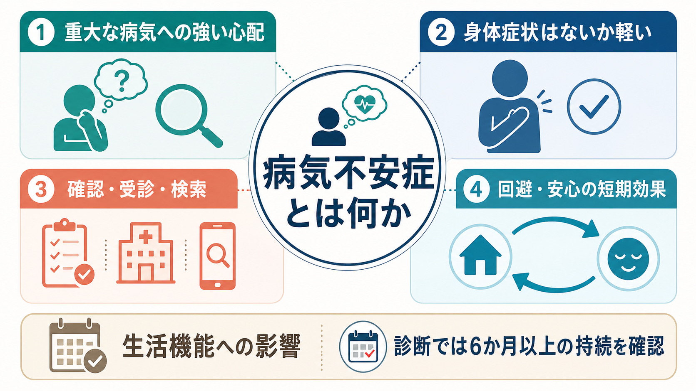
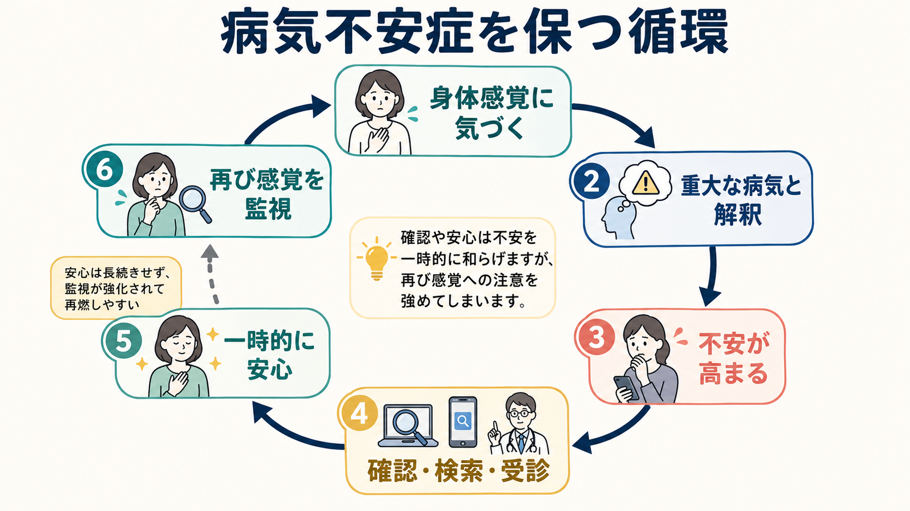
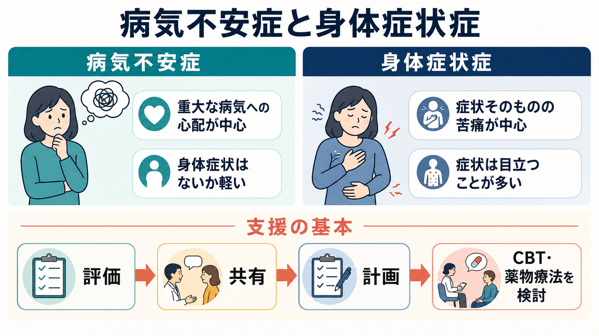

# 病気不安症とは何か

## 要点

- 病気不安症は、重大な病気にかかっている、またはこれから発症するという心配が中心になる病態である。
- 身体症状はないか、あっても軽いことが多く、苦痛の焦点は「症状そのもの」よりも「それが重大な病気を意味するのではないか」という解釈にある[1]。
- 確認、インターネット検索、反復受診、または受診回避は、不安を短期的に下げても、長期的には身体監視と病気解釈を強めうる[2][3]。
- 支援では、医学的評価を軽視せず、過剰検査を増やしすぎず、継続的な治療関係と認知行動療法を軸に考える[1][5]。

## この記事で答える問い

この記事では、病気不安症を「心配しすぎ」と片づけず、どのような診断概念で、どのような認知・行動の循環で維持され、臨床や研究では何が問題になるのかを整理する。個別の診断や治療指示ではなく、教育・研究目的の概説として読む。

## まず結論

病気不安症は、身体に重大な異常があるという確信だけではなく、「重大な病気だったらどうしよう」という持続的な警戒が生活を支配していく状態である。DSM-5-TR 系の説明では、重大な病気へのとらわれ、身体症状がないか軽いこと、健康への強い不安、反復確認または不適応な回避、6か月以上の持続、他の精神疾患でよりよく説明されないことが重視される[1]。ICD-11 では「Hypochondriasis」に病気不安症が含まれ、反復的な健康関連行動または健康関連の回避を伴う病態として整理されている[7]。

したがって、病気不安症の中心は「検査で何もないのに訴える人」という見方ではない。中心にあるのは、身体感覚、医学情報、不確実性を重大な病気の兆候として読み取りやすくなり、その不安を下げるための確認や回避が、かえって心配を長持ちさせる循環である[2][3]。

## 背景

かつて「心気症」や「ヒポコンドリア」と呼ばれていた領域は、DSM-5 以降、病気不安症と身体症状症に再編された。身体症状が目立ち、その症状への苦痛や生活障害が中心であれば身体症状症に近く、身体症状がないか軽いにもかかわらず重大な病気への心配が中心であれば病気不安症に近い[4]。

この区別は、病気の有無を単純に二分するためではない。実際の身体疾患がある場合でも、疾患の医学的リスクに比べて健康不安が過剰で、確認や回避が生活機能を損なっていれば、病気不安症的な理解が臨床的に有用になることがある[1][2]。

## 基本概念

病気不安症では、次のような特徴が組み合わさる。

| 観点 | 内容 |
|---|---|
| 心配の焦点 | がん、心疾患、神経疾患など、重大で進行性または生命に関わる病気への心配 |
| 身体症状 | ない、または軽い。症状そのものより、症状の意味づけが問題になりやすい |
| 行動 | 身体チェック、検索、反復受診、検査要求、安心確認、または受診・検査の回避 |
| 経過 | 慢性的または変動性で、心配する病気の種類が途中で変わることもある |
| 鑑別 | [[パニック症とは何か]]、[[全般不安症とは何か]]、[[強迫症とは何か]]、[[身体型妄想性障害とは何か]]、身体症状症など |

重要なのは、「病気ではないことを証明すれば解決する」とは限らない点である。検査や説明で一時的に安心しても、新しい感覚や情報に触れると「見落としではないか」「別の病気ではないか」という疑念が再燃することがある[3]。

## 仕組み

病気不安症を理解するうえで中心になるのは、身体感覚の過監視と破局的解釈である。動悸、胃腸の音、皮膚の変化、疲労感のようなありふれた感覚が、「重大な病気の初期徴候かもしれない」と解釈されると、不安が高まる。不安が高まると注意はさらに身体へ向き、感覚の検出感度が上がる。ここで検索、確認、受診、家族への reassurance seeking が入ると、短期的には安心するが、「確認しないと危ない」という学習も強まりやすい[2][3]。

この循環は、[[不安症群とは何か]]に広く見られる安全行動の問題と重なる。ただし、病気不安症では不安の対象が「社会的評価」や「漠然とした将来」ではなく、身体と病気の意味づけに強く結びつく。[[パニック症とは何か]]では発作中の身体感覚が「死ぬ・倒れる」と解釈されやすいが、病気不安症では発作状況に限らず、病気の可能性を繰り返し検討し続ける点が前景化する。

## 図解

病気不安症と近い病態は、症状の量だけで機械的に分けられるわけではない。実際の臨床では、身体症状症、強迫症、全般不安症、パニック症、うつ病、身体疾患、妄想性障害との重なりを慎重にみる必要がある[1][4]。

## 臨床・研究との接続

臨床では、最初に必要な医学的評価を行い、危険な身体疾患を見落とさないことが前提になる。そのうえで、評価が繰り返されるほど不安が長期化する場合には、単発の安心説明よりも、継続的な担当者、あらかじめ合意した受診計画、身体感覚への注意の向け方、検索や確認行動の扱いを整理するほうが有用になりやすい[1][3]。

治療研究では、健康不安に対する認知行動療法の効果が比較的よく検討されている。2017年の系統的レビュー・メタ解析では、健康不安に対するCBTが対照条件より大きな改善を示し、フォローアップでも効果が維持される傾向が報告された[5]。2019年のレビューでは、19件のRCTを含む解析で中等度から大きな効果が示され、インターネット支援型CBTも対面CBTと同程度の効果を示しうるとされた[6]。薬物療法では、セロトニン再取り込み阻害薬が役立つ場合があるが、治療関係、心理教育、CBT的介入との組み合わせで考える必要がある[1][3]。

研究上の論点は、病気不安症と身体症状症の境界、健康不安の次元的評価、医療利用や医療費への影響、インターネット検索による不安増幅、身体疾患を持つ人の適切な健康警戒との区別である。診断名だけでなく、どの認知、どの安全行動、どの回避が生活障害に結びついているかを見ることが重要になる。

## よくある誤解

**誤解1: 「本当は何も困っていない」**  
病気不安症では、心配の対象が医学的に確認されないことがあっても、不安、時間の消費、対人関係や仕事への影響は現実の苦痛である[2]。

**誤解2: 「検査を増やせば必ず安心する」**  
必要な検査は重要だが、反復的な確認が不安の維持要因になることがある。安心は短期的に効いても、次の疑念を生みやすい[3]。

**誤解3: 「病気不安症なら身体疾患はない」**  
身体疾患がある人にも過剰な健康不安は起こりうる。問題は疾患の有無だけではなく、医学的リスクに対して心配と行動がどの程度過剰で、生活機能を損なっているかである[1]。

**誤解4: 「インターネット検索は常に悪い」**  
情報そのものが悪いのではない。問題は、不確実性を下げるための反復検索が、かえって不安と身体監視を強めるパターンになる場合である。

## 関連ノート

- [[不安症群とは何か]]
- [[全般不安症とは何か]]
- [[パニック症とは何か]]
- [[社交不安症とは何か]]
- [[強迫症とは何か]]
- [[強迫観念とは何か]]
- [[強迫行為とは何か]]
- [[身体化とは何か]]
- [[身体症状症は脳の予測処理で説明できるのか]]
- [[DSMとICDは何が違うのか]]

MOC更新候補: `content/00_MOC/` 配下の精神医学、疾患・症候群、不安症群、身体症状関連のMOCに追加候補。並列ジョブとの衝突を避けるため、本記事ではMOC本体は更新しない。

## 理解チェック

1. 病気不安症では、身体症状そのものと病気への意味づけのどちらが中心になりやすいか。
2. 安心確認や反復検索は、なぜ短期的には役立っても長期的には問題になりうるのか。
3. 病気不安症、身体症状症、パニック症、強迫症を鑑別するとき、どの焦点の違いを見るとよいか。
4. 身体疾患が実際にある人に、病気不安症的な理解が役立つのはどのような場合か。

## 未解決問題

- 病気不安症と身体症状症の境界は、カテゴリー診断よりも健康不安の重症度次元として扱うほうがよいのか。
- 医学的に妥当な警戒と過剰な健康不安を、慢性疾患・家族歴・医療不信の文脈でどう区別するか。
- インターネット検索、医療AI、ウェアラブルデータが健康不安を悪化させる条件と、逆に支援に使える条件は何か。
- CBT、インターネット支援型CBT、ACT、薬物療法を、どの患者特性に応じて選ぶべきか。

## 参考文献

[1] MSD Manual Professional Edition. “Illness Anxiety Disorder.” Reviewed/Revised Jul 2024. https://www.msdmanuals.com/professional/psychiatric-disorders/somatic-symptom-and-related-disorders/illness-anxiety-disorder

[2] French, J. H., & Hameed, S. (2023). “Illness Anxiety Disorder.” *StatPearls*. NCBI Bookshelf. https://www.ncbi.nlm.nih.gov/books/NBK554399/

[3] Scarella, T. M., Boland, R. J., & Barsky, A. J. (2019). Illness Anxiety Disorder: Psychopathology, Epidemiology, Clinical Characteristics, and Treatment. *Psychosomatic Medicine*, 81(5), 398-407. https://doi.org/10.1097/PSY.0000000000000691

[4] Newby, J. M., Hobbs, M. J., Mahoney, A. E. J., Wong, S. K., & Andrews, G. (2017). DSM-5 illness anxiety disorder and somatic symptom disorder: Comorbidity, correlates, and overlap with DSM-IV hypochondriasis. *Journal of Psychosomatic Research*, 101, 31-37. https://doi.org/10.1016/j.jpsychores.2017.07.010

[5] Cooper, K., Gregory, J. D., Walker, I., Lambe, S., & Salkovskis, P. M. (2017). Cognitive Behaviour Therapy for Health Anxiety: A Systematic Review and Meta-Analysis. *Behavioural and Cognitive Psychotherapy*, 45(2), 110-123. https://doi.org/10.1017/S1352465816000527

[6] Axelsson, E., & Hedman-Lagerlöf, E. (2019). Cognitive behavior therapy for health anxiety: systematic review and meta-analysis of clinical efficacy and health economic outcomes. *Expert Review of Pharmacoeconomics & Outcomes Research*, 19(6), 663-676. https://doi.org/10.1080/14737167.2019.1703182

[7] World Health Organization. ICD-11 MMS, 6B23 Hypochondriasis. https://icd.who.int/browse/2025-01/mms/en#675329566
