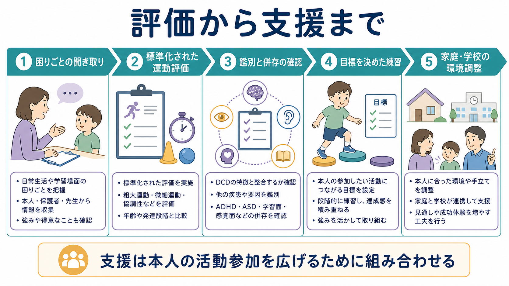

# 発達性協調運動症とは何か

## 要点

- 発達性協調運動症（developmental coordination disorder: DCD）は、年齢や学習機会から期待される水準に比べて、運動技能の獲得と遂行が明らかに難しく、日常生活・学業・遊び・余暇参加に支障をもたらす神経発達症である[1][2]。
- 中心にあるのは「運動が下手」という性格特徴ではなく、書字、はさみや箸、ボタン、着替え、体育、球技、自転車、道具操作など、目的に沿って身体を協調させる課題で困難が続くことである[1][3]。
- 評価では、本人・家族・学校からの生活情報、標準化された運動検査、発達歴、知的発達・視覚・神経疾患・筋骨格疾患などの鑑別、[[ADHDとは何か]]や[[自閉スペクトラム症とは何か]]などの併存を組み合わせて見る[1][4]。
- 支援の基本は、本人が参加したい具体的活動を決め、課題指向型の練習、環境調整、道具の工夫、家庭・学校との連携を組み合わせることである。個別診断や治療指示ではなく、教育・研究目的の概説として読む必要がある[1][5]。



## この記事で答える問い

1. 発達性協調運動症は、単なる「不器用」と何が違うのか。
2. どのような生活場面で困りごとが生じやすいのか。
3. 評価では、運動検査だけでなく何を確認する必要があるのか。
4. 予測制御、内部モデル、感覚運動統合、運動学習は、DCDの理解にどう関わるのか。
5. 臨床・教育・研究では、どのような支援と未解決問題があるのか。

## まず結論

発達性協調運動症は、「努力不足」「運動嫌い」「親のしつけ」の問題ではない。脳・身体・環境・学習経験が関わる[[発達障害群とは何か|神経発達症]]の一つであり、運動技能の獲得や遂行が生活上の参加を制限するところに臨床的な意味がある[1][2]。

たとえば、文字を書くのが遅く疲れやすい、定規やコンパスを扱いにくい、ボタンやひも結びに時間がかかる、給食でこぼしやすい、体育でボールや跳び箱が難しい、集団遊びに入りにくい、といった困りごとが続く場合がある。重要なのは、子どもを「できない子」と見ることではなく、どの活動で、どの動作要素が、どの環境条件で難しくなるのかを分けて見ることである[1][3]。

## 背景

DCDは国際疾病分類ICD-11では「発達性運動協調障害」として神経発達症群に位置づけられ、粗大運動・微細運動・協調運動の発達が期待水準より低く、生活機能を妨げ、神経疾患や知的発達だけでは説明できない状態として整理される[2]。DSM系の診断概念でも、運動技能の獲得・遂行、日常生活への影響、発達早期からの存在、他疾患による説明の除外が重視される[1][3]。

有病率は定義、年齢、評価法、カットオフによって変わるが、国際臨床推奨では学齢期児童の約5-6%が目安として扱われる[1]。ただし、標準化検査だけで機械的に決めると、生活上の困りごとや文化・教育環境の違いを見落とす。逆に、生活上の困りごとだけで決めると、練習機会の不足、視覚・筋骨格・神経疾患、知的発達、注意、感覚過敏、情緒的要因を混同しやすい。

このためDCDは、[[神経発達の異常は精神疾患にどう関わるのか]]、[[実行機能は子どもでどのように発達するのか]]、[[小脳回路は予測と誤差学習にどう関わるのか]]、[[運動ネットワークは随意運動をどう生み出すのか]]と接続して理解すると見通しがよい。

## 基本概念

### 何が難しいのか

DCDで難しくなりやすいのは、単一の筋力や反射ではなく、目的に合わせて複数の身体部位、視覚、姿勢、タイミング、力加減をまとめることである。代表的には、次のような場面で気づかれる[1][3]。

| 領域 | 例 | 見落とされやすい影響 |
|---|---|---|
| 粗大運動 | 走る、跳ぶ、ボールを捕る、階段、自転車 | 体育や遊びからの回避、けがへの不安 |
| 微細運動 | 書字、はさみ、箸、ボタン、ひも結び | 学習速度の低下、疲労、自己評価の低下 |
| 姿勢・バランス | 座位保持、片足立ち、身体の向きの調整 | 授業中の疲れ、道具操作の不安定さ |
| 運動計画 | 初めての動作、複数手順の動作 | 「わかっているのにできない」と見られる |
| 活動参加 | 体育、休み時間、クラブ活動、家庭内役割 | 友人関係や参加機会の制限 |

### 「不器用」と診断概念の違い

誰でも得意不得意はある。DCDとして考えるのは、運動技能の困難が発達段階と学習機会を考えても目立ち、それが生活・学業・余暇参加を持続的に妨げる場合である[1][2]。したがって、診断名そのものよりも、「どの活動に参加できなくなっているか」「本人の努力がどこで空回りしているか」「環境を変えるとどれだけ改善するか」が重要になる。

### 併存と鑑別

DCDは単独で現れることもあるが、[[ADHDとは何か]]、[[自閉スペクトラム症とは何か]]、[[発達性言語症とは何か]]、[[知的発達症とは何か]]、学習面の困難、不安、抑うつ、低い自己評価と重なることがある[1][4]。注意が続かないために運動課題が乱れるのか、運動計画そのものが難しいのか、感覚過敏や失敗不安が回避を強めているのかを分けて見る必要がある。

また、脳性麻痺、筋疾患、末梢神経疾患、視覚障害、関節可動域の問題、薬剤、後天的な神経疾患などが疑われる場合は、DCDだけで説明しない。臨床では、発達歴、神経学的所見、視覚・聴覚、学校での観察、家庭での動作、必要に応じた医学的評価を組み合わせる[1][3]。

## 仕組み

DCDの機序は一つの原因に還元できない。研究では、運動計画、予測制御、内部モデル、感覚運動統合、視覚運動制御、実行機能、運動学習が重なって検討されている[6][7]。

### 予測制御と内部モデル

私たちは身体を動かすとき、動かしてから結果を待つだけではなく、「この力で動かすと、このくらい手が進むはずだ」という予測を使う。この予測と実際の感覚フィードバックを比べ、誤差を使って次の動きを調整する。これは[[フィードバックは学習をどう促進するのか]]や[[学習とは何か]]とも関係する。

DCDでは、こうした予測的な制御や内部モデルの利用が弱い可能性が議論されている[6][7]。たとえば、ボールを捕るときには、見えているボール位置だけでなく、次の位置を予測して手を出す必要がある。書字では、鉛筆の摩擦、筆圧、手首の角度、次の文字の形を同時に調整する。予測が不安定だと、動きが遅くなる、力加減が過剰になる、視覚に頼りすぎる、手順がぎこちなくなることがある。

### 感覚運動統合

運動は、筋肉だけでなく、視覚、前庭感覚、固有感覚、触覚、聴覚、姿勢制御と結びついている。DCDでは、感覚情報を運動計画に結びつける過程、あるいは運動結果を次の修正に使う過程がうまく働きにくい可能性がある[6][7]。

ただし、これは「感覚が悪い」と単純化できる話ではない。同じ子どもでも、静かな場面ではできるが、騒がしい体育館では難しい、ゆっくりならできるが時間制限があると崩れる、見本を見た直後はできるが手順が増えると難しい、といった状況依存性がある。評価では、動作そのものと環境条件を一緒に見る必要がある。

### 運動学習

DCDの支援では、抽象的な筋力訓練だけでなく、本人が実際に困っている活動を練習対象にする課題指向型アプローチが重視される[1][5]。たとえば「手先を鍛える」ではなく、「給食でこぼさず運ぶ」「板書を写す負担を減らす」「体育のボール課題に参加する」など、活動単位で目標を置く。

運動学習では、成功しやすい課題設定、明確な目標、フィードバック、反復、段階づけ、環境調整が重要である。失敗体験ばかりが続くと、本人は課題を避け、練習機会が減り、さらに差が広がる。したがって、支援は「頑張らせる」よりも、成功可能な練習条件を作ることから始まる。

## 図解

### 図1: 評価から支援まで

上の図は、DCDを「困りごとの聞き取り」「標準化された運動評価」「鑑別と併存の確認」「目標を決めた練習」「家庭・学校の環境調整」という流れで見るための図である。DCDの評価は、運動検査だけで完結するものではなく、本人が参加したい活動と、生活環境の制約を同時に扱う必要がある[1][5]。

### 図解案: 全体像の概念地図

画像生成時にDCD以外の疾患画像が混入したため、本文には存在しない画像リンクを入れない。再生成する場合は、次のプロンプトを使う。

```text
発達性協調運動症（DCD）の日本語インフォグラフィック。白背景、横長16:9。中央に「発達性協調運動症（DCD）」、周囲に「運動の不器用さ」「日常生活への影響」「学業・遊びへの影響」「評価と支援」の4領域。小ラベルは「書字」「道具操作」「着替え」「食事」「体育」「課題指向型練習」「環境調整」。ADHD、ASD、認知症、パーキンソン病、チック症、反抗挑発症、むずむず脚症候群は描かない。
```

### 図解案: 運動学習メカニズム

```text
発達性協調運動症（DCD）と運動学習の循環を示す日本語インフォグラフィック。白背景、横長16:9。円環の4ノードを「目標」「運動計画」「実行」「感覚フィードバック」とし、矢印でつなぐ。側注に「関与が考えられる要素：予測制御、内部モデル、感覚運動統合」。下部に「単一原因ではなく、複数の過程が重なって動きにくさが生じる」。DCD以外の疾患名を入れない。
```

## 臨床・研究との接続

### 評価

国際臨床推奨では、DCDの評価において、標準化された運動検査、日常生活への影響、医学的・発達的な鑑別、併存症の把握を組み合わせることが推奨される[1]。よく使われる尺度には、Movement Assessment Battery for Children-2（MABC-2）のような直接検査、Developmental Coordination Disorder Questionnaire（DCDQ）のような保護者質問紙がある[1][8]。

ただし、尺度は判断を助ける道具であって、生活を代替するものではない。たとえば、MABC-2の点数が低くても、本人が参加したい活動にほとんど支障がなければ支援目標は限定的かもしれない。逆に、検査場面では目立たなくても、学校の時間制限や道具の種類によって強い困難が出ることもある。

### 支援

支援では、本人の活動参加を中心に置く。国際臨床推奨や介入研究では、課題指向型介入、CO-OP（Cognitive Orientation to daily Occupational Performance）を含む認知的・課題指向型アプローチ、家庭・学校との連携、環境調整が重視される[1][5]。

具体例としては、書字量を減らす、タブレットやプリントを使う、道具を持ちやすくする、体育でルールや課題を調整する、手順を視覚化する、成功しやすい小目標に分ける、時間制限を緩める、本人が参加したい活動から練習目標を決める、などがある。これは甘やかしではなく、参加と学習機会を確保するための合理的な調整である。

### 研究

研究上の焦点は、DCDを単一の障害としてではなく、複数の経路をもつ異質な状態として捉える方向にある。運動予測、感覚運動統合、実行機能、視覚空間処理、姿勢制御、併存症、生活参加、心理的影響を統合する必要がある[6][7]。また、介入研究では、どの子どもに、どの課題、どの頻度、どのフィードバック、どの環境調整が最も合うのかを明らかにすることが課題である[5]。

## よくある誤解

### 「練習すれば自然に治る」

練習は重要だが、ただ反復すればよいわけではない。難しすぎる課題を反復すると、失敗体験と回避が増える。効果的な支援では、本人に意味のある活動を選び、難易度を調整し、成功経験とフィードバックを設計する[1][5]。

### 「運動だけの問題で、学業とは関係ない」

DCDは学業にも影響する。書字、図形、定規・コンパス、実験器具、工作、体育、移動、提出物の速度など、多くの学習活動は運動技能に依存している。運動の困難があると、内容理解はできていても、出力の遅さや疲労によって能力が低く見積もられることがある[1][3]。

### 「本人が不注意だからできない」

注意の問題が併存することはあるが、DCDは注意不足だけでは説明できない。[[ADHDとは何か]]と重なる場合でも、注意、運動計画、姿勢、視覚運動制御、失敗不安を分けて評価する必要がある[1][4]。

### 「診断名がつけば支援は決まる」

診断名は出発点であって、支援計画そのものではない。同じDCDでも、困る活動、得意な感覚手がかり、疲れやすさ、学校環境、本人の目標は異なる。支援は診断名ではなく、活動参加と環境条件から組み立てる。

## 関連ノート

- [[発達障害群とは何か]]
- [[ADHDとは何か]]
- [[自閉スペクトラム症とは何か]]
- [[発達性言語症とは何か]]
- [[知的発達症とは何か]]
- [[神経発達の異常は精神疾患にどう関わるのか]]
- [[運動ネットワークは随意運動をどう生み出すのか]]
- [[小脳回路は予測と誤差学習にどう関わるのか]]
- [[実行機能は子どもでどのように発達するのか]]
- [[フィードバックは学習をどう促進するのか]]

MOC更新候補: [[MOC｜発達・愛着・社会心理]]、[[MOC｜認知機能]]

## 理解チェック

1. DCDを「単なる不器用」と区別するとき、生活・学業・参加への影響を見る理由は何か。
2. 書字が遅い子どもを評価するとき、運動技能以外に確認すべき要因は何か。
3. 予測制御や内部モデルの弱さは、ボール操作や書字のどの部分に影響しうるか。
4. 課題指向型支援が、一般的な筋力訓練だけよりも生活参加に結びつきやすいのはなぜか。
5. DCDとADHD、ASD、学習面の困難が重なる場合、評価上どのような混同が起こりうるか。

## 未解決問題

- DCDの下位タイプを、運動課題、感覚運動統合、実行機能、視覚空間処理、併存症からどう分けるべきか。
- どの介入要素が、どの年齢・困難プロフィール・生活環境に最も合うのか。
- 標準化検査の点数と、本人が実際に感じる活動参加の困難をどう統合するか。
- 学校現場で、合理的配慮と運動学習機会をどのように両立するか。

## 参考文献

[1] Blank, R., Barnett, A. L., Cairney, J., Green, D., Kirby, A., Polatajko, H., Rosenblum, S., Smits-Engelsman, B., Sugden, D., Wilson, P., & Vinçon, S. (2019). International clinical practice recommendations on the definition, diagnosis, assessment, intervention, and psychosocial aspects of developmental coordination disorder. *Developmental Medicine & Child Neurology, 61*(3), 242-285. https://doi.org/10.1111/dmcn.14132

[2] World Health Organization. (2025). ICD-11 for Mortality and Morbidity Statistics: Developmental motor coordination disorder. https://icd.who.int/browse/2025-01/mms/en

[3] MedlinePlus Medical Encyclopedia. Developmental coordination disorder. U.S. National Library of Medicine. https://medlineplus.gov/ency/article/001533.htm

[4] Kirby, A., & Sugden, D. (2007). Children with developmental coordination disorders. *Journal of the Royal Society of Medicine, 100*(4), 182-186. https://doi.org/10.1177/014107680710011414

[5] Miyahara, M., Hillier, S. L., Pridham, L., & Nakagawa, S. (2017). Task-oriented interventions for children with developmental co-ordination disorder. *Cochrane Database of Systematic Reviews*, CD010914. https://doi.org/10.1002/14651858.CD010914.pub2

[6] Wilson, P. H., Ruddock, S., Smits-Engelsman, B., Polatajko, H., & Blank, R. (2013). Understanding performance deficits in developmental coordination disorder: A meta-analysis of recent research. *Developmental Medicine & Child Neurology, 55*(3), 217-228. https://doi.org/10.1111/j.1469-8749.2012.04436.x

[7] Adams, I. L. J., Lust, J. M., Wilson, P. H., & Steenbergen, B. (2014). Compromised motor control in children with DCD: A deficit in the internal model? A systematic review. *Neuroscience & Biobehavioral Reviews, 47*, 225-244. https://doi.org/10.1016/j.neubiorev.2014.08.011

[8] Wilson, B. N., Crawford, S. G., Green, D., Roberts, G., Aylott, A., & Kaplan, B. J. (2009). Psychometric properties of the revised Developmental Coordination Disorder Questionnaire. *Physical & Occupational Therapy in Pediatrics, 29*(2), 182-202. https://doi.org/10.1080/01942630902784761
