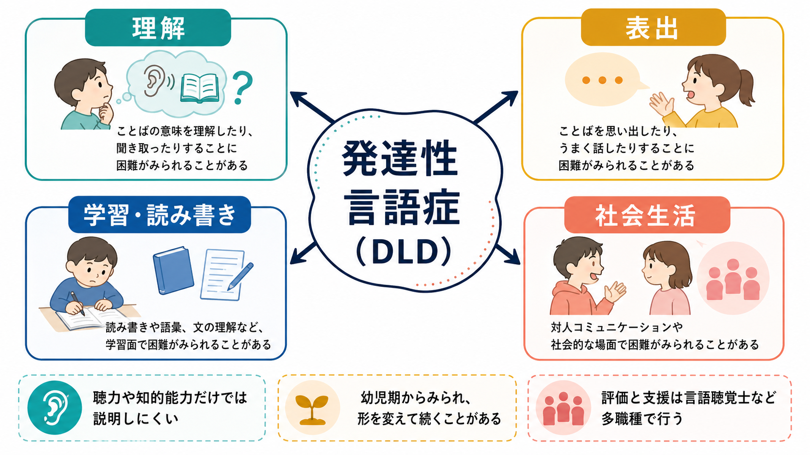
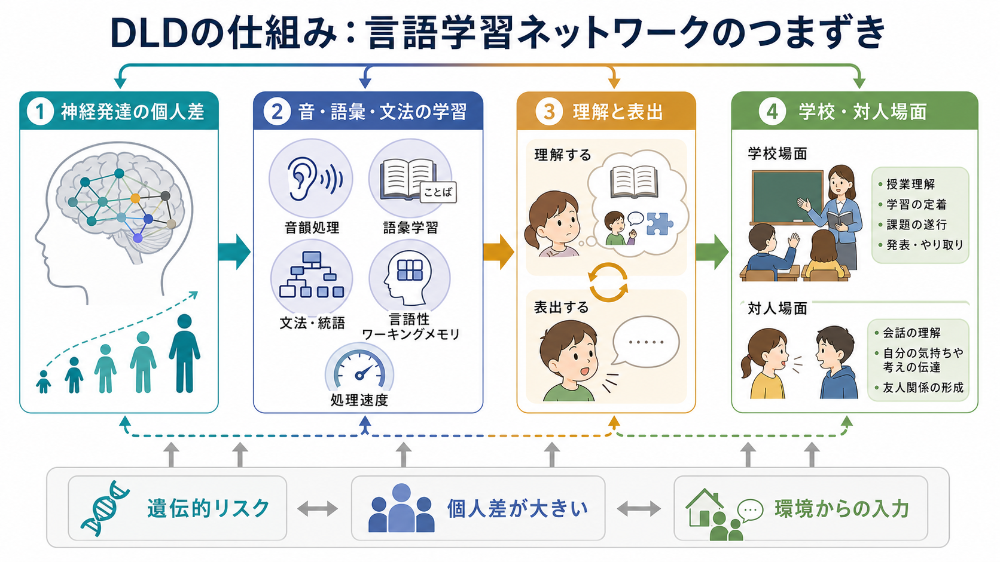

# 発達性言語症とは何か

## 要点

- 発達性言語症（developmental language disorder; DLD）は、発達期からみられる言語の理解・表出・使用の持続的な困難であり、聴覚障害、知的障害、脳損傷、[[ASDは脳ネットワークの違いとして理解できるのか|自閉スペクトラム症]]などだけでは説明しにくい場合に用いられる概念である[1][2]。
- 困難は「話す」だけでなく、聞いて理解する、語彙を増やす、文法を使う、物語を組み立てる、読み書きや授業理解に参加する、といった広い言語活動に及ぶ[3]。
- 原因は単一ではなく、遺伝的リスク、神経発達、音韻処理、語彙・文法学習、言語性ワーキングメモリ、環境からの言語入力が相互作用する多因子モデルで考えるのが妥当である[3][6]。
- 二言語環境そのものはDLDの原因ではない。多言語児でもDLDは起こりうるが、評価ではすべての使用言語、生活歴、教育環境を含めて判断する必要がある[3]。
- 本記事は教育・研究目的の整理であり、個別の診断や治療指示ではない。心配がある場合は医療機関、発達相談、言語聴覚士などによる評価につなげる。

## この記事で答える問い

1. 発達性言語症は、単なる「ことばの遅れ」と何が違うのか。
2. どのような症状が、家庭・学校・対人場面で見えやすいのか。
3. 脳や認知の仕組みとして、どこまで分かっているのか。
4. 評価と支援では、何を見落とさないことが重要なのか。

## まず結論

発達性言語症は、子どもの言語発達が年齢相応の期待より明らかに低く、日常のコミュニケーション、学習、社会参加に影響する状態である[1][2]。かつては「特異的言語障害」「言語発達遅滞」などの名称が用いられたが、CATALISE コンセンサス以後は、既知の生物医学的原因だけでは説明できない発達期の言語障害をDLDと呼ぶ整理が広く使われている[2]。

重要なのは、DLDを「知能は普通なのに言語だけが遅れる障害」と狭く捉えすぎないことである。CATALISE は、非言語性能力と言語能力の大きな乖離をDLDの必須条件にしないこと、ADHDなど他の神経発達症と併存しうること、リスク因子があってもDLDの診断を妨げないことを整理した[2]。この見方は、[[発達障害群とは何か]]や[[限局性学習症とは何か]]と同じく、カテゴリ名よりも「生活のどの場面で何に困るか」を重視する臨床観に近い。

## 背景

言語発達は、語音を聞き分ける、語と意味を結びつける、文法を抽出する、相手の意図を推測する、物語や説明を構成する、といった複数の学習過程から成る。これは[[言語発達はどのように進むのか]]や[[学習とは何か]]で扱うような、経験依存的な神経発達の一部である。

DLDは珍しい状態ではない。NIDCDは、幼稚園児のおよそ14人に1人に影響する一般的な発達障害の一つとしてDLDを説明している[3]。英国の人口ベース研究でも、言語障害の有病率は約7.6%と推定され、非言語性能力で強く除外すると支援対象が狭まりすぎることが示された[5]。

このため、DLDは精神医学、言語聴覚療法、教育、発達心理学、認知神経科学が交差するテーマである。診断分類としては[[DSMとICDは何が違うのか]]の枠組みに関わり、学校場面では読解、作文、授業理解、友人関係、自己評価に影響しうる。

## 基本概念

ICD-11では、発達性言語症は、発達期に始まる言語の獲得・理解・産出・使用の持続的な困難であり、年齢から期待される水準より明らかに低く、コミュニケーションを有意に制限する状態として整理される[1]。除外すべきものとして、聴覚障害、神経疾患、脳損傷、感染後の影響、自閉スペクトラム症などが挙げられる[1]。

ただし「除外」とは、現実の子どもを単純に一つの箱へ入れることではない。DLDはADHD、読字困難、発達性協調運動症、不安や抑うつ、社会的困難と併存しうる[2][3]。そのため臨床では、言語評価だけでなく、聴力、発達歴、教育歴、家庭で使う言語、認知機能、読み書き、情緒・行動、参加状況を合わせて見る。

DLDでみられやすい困難には、次のようなものがある。

| 領域 | 例 | 生活上の見え方 |
|---|---|---|
| 音韻 | 音の系列を覚えにくい、似た音を区別しにくい | 新しい語を覚えにくい、読み書きにつまずく |
| 語彙 | 語の意味を広げにくい、適切な語が出にくい | 「あれ」「それ」が多い、説明が曖昧になる |
| 文法・統語 | 助詞、語順、複文の理解が難しい | 指示を誤解する、長い文を避ける |
| 語用・談話 | 物語の順序、相手に合わせた説明が難しい | 会話が飛ぶ、発表や作文が苦手になる |
| 学習参加 | 説明文、文章題、板書、作文で負荷が高い | 努力不足や不注意と誤解される |

## 仕組み

DLDの仕組みは、単一の「言語中枢の障害」では説明しきれない。研究上は、音韻処理、統語処理、手続き学習、ワーキングメモリ、処理速度、語彙学習などの複数要因が検討されてきた[6][7]。

近年の神経画像研究の系統的レビュー・メタ解析では、構造的研究において大脳基底核、とくに前方線条体に比較的一貫した異常が報告された[6]。これは、言語が単なる「単語を覚える機能」ではなく、系列、規則、予測、運動・認知制御を含む学習ネットワークに支えられていることを示唆する。ただし、この知見は個別診断に使える脳画像マーカーを意味しない。現時点では、研究レベルの群差として理解するのが適切である[6]。

認知面では、短い音列を保持して操作する言語性ワーキングメモリ、語の音と意味を結びつける語彙学習、助詞や語順から関係を読み取る統語処理が重要になる。これらの負荷が高いと、授業中の口頭指示、読解、作文、文章題、友人とのやりとりが連鎖的に難しくなる。[[読字は脳内でどのように処理されるのか]]や[[認知機能検査は何を測っているのか]]と接続して考えると、DLDは「言語だけ」の問題というより、言語を媒介にした学習と参加の問題として見えてくる。

## 図解

上の2枚の図は、DLDを「理解」「表出」「学習・読み書き」「社会生活」の4領域と、言語学習ネットワークのつまずきとして整理したものである。ポイントは、DLDを語彙数や発音の問題だけに還元しないことにある。

評価と支援の流れでは、次のように生活場面と専門的評価を往復させる。

## 臨床・研究との接続

臨床では、まず「聞こえ」「発達歴」「家庭・学校での困りごと」「使用言語」「読み書き」「併存する神経発達症」を確認する。標準化された言語検査だけでなく、保護者・教師からの情報、会話や物語産出の観察、授業参加の様子を組み合わせる必要がある[3]。

支援は、本人が生活の中で参加しやすくなることを目標にする。言語聴覚療法では、音韻、語彙、文法、物語、会話の技能を標的にすることがある。2021年の系統的レビューでは、就学前から小学校低学年のDLD児に対する介入研究を検討し、音韻、形態・統語、物語推論などで一定の効果が報告される一方、語彙や理解面では証拠が限られる領域もあると整理している[8]。したがって、「早く訓練すれば必ず治る」というより、標的、頻度、場面、本人の負荷、学校・家庭との連携を調整しながら、機能的な改善を追う必要がある。

研究面では、DLDは[[神経発達の異常は精神疾患にどう関わるのか]]、手続き学習、言語性ワーキングメモリ、読み書き、社会参加の研究と接続する。長期的には、読字・書字、学業達成、自己効力感、情緒面への影響も検討される。これは、DLDを小児期だけの「ことばの遅れ」として終わらせず、青年期・成人期の学習と生活にどう波及するかを見る必要があることを意味する[3][6]。

## よくある誤解

**「話せているならDLDではない」**  
日常会話が成立していても、長い説明文、複文、抽象語、物語、授業の口頭指示、作文で困難が目立つことがある。DLDは表出だけでなく理解にも及びうる。

**「二言語環境が原因でことばが遅れる」**  
複数言語に触れること自体はDLDの原因ではない[3]。多言語児の評価では、片方の言語だけを見て能力を判断せず、使用頻度、曝露歴、家庭・学校の言語環境を含めて考える。

**「知能検査が平均なら支援は不要」**  
DLDは非言語性能力との乖離を必須条件にしない[2]。知的能力が平均域でも、言語を介する授業、読解、文章題、対人場面で大きな困難が起こりうる。

**「努力不足、不注意、反抗で指示に従わない」**  
指示を理解できない、語を保持できない、複数ステップを処理しきれないために、結果として行動上の問題に見えることがある[3]。行動だけでなく、言語理解の負荷を評価することが重要である。

## 関連ノート

- [[発達障害群とは何か]]
- [[限局性学習症とは何か]]
- [[言語発達はどのように進むのか]]
- [[発達とは何か]]
- [[学習とは何か]]
- [[読字は脳内でどのように処理されるのか]]
- [[認知機能検査は何を測っているのか]]
- [[DSMとICDは何が違うのか]]

MOC更新候補: `content/00_MOC/MOC｜発達・愛着・社会心理.md`, `content/00_MOC/MOC｜認知科学・心理学.md`, `content/00_MOC/MOC｜精神医学.md`。並列ジョブとの競合を避けるため、本記事ではMOC本体を更新しない。

## 理解チェック

1. DLDを「発音が悪いこと」だけで説明すると、どのような困難を見落とすか。
2. 非言語性知能との乖離をDLDの必須条件にしないことには、どのような臨床的意味があるか。
3. 二言語環境の子どもを評価するとき、なぜ一つの言語だけで判断してはいけないのか。
4. DLDの支援目標を「検査点の改善」だけでなく「生活参加」に置くと、評価項目はどう変わるか。

## 未解決問題

- DLDの神経基盤は群レベルでは手がかりが増えているが、個別診断に使えるバイオマーカーはまだ確立していない。
- 介入研究は領域ごとに証拠量が異なり、理解面、語用面、青年期・成人期への支援についてはさらなる研究が必要である。
- 多言語環境、文化差、教育制度の違いを踏まえた評価・支援方法は、今後も精緻化が必要である。

## 参考文献

[1] World Health Organization. ICD-11 MMS: 6A01.2 Developmental language disorder. https://icd.who.int/browse/2025-01/mms/en#862918022

[2] Bishop, D. V. M., Snowling, M. J., Thompson, P. A., Greenhalgh, T., & CATALISE-2 consortium. (2017). Phase 2 of CATALISE: a multinational and multidisciplinary Delphi consensus study of problems with language development: Terminology. *Journal of Child Psychology and Psychiatry, 58*(10), 1068-1080. https://doi.org/10.1111/jcpp.12721

[3] National Institute on Deafness and Other Communication Disorders. Developmental Language Disorder. https://www.nidcd.nih.gov/health/developmental-language-disorder

[4] Bishop, D. V. M., Snowling, M. J., Thompson, P. A., Greenhalgh, T., & CATALISE consortium. (2016). CATALISE: A multinational and multidisciplinary Delphi consensus study. Identifying language impairments in children. *PLOS ONE, 11*(7), e0158753. https://doi.org/10.1371/journal.pone.0158753

[5] Norbury, C. F., Gooch, D., Wray, C., Baird, G., Charman, T., Simonoff, E., Vamvakas, G., & Pickles, A. (2016). The impact of nonverbal ability on prevalence and clinical presentation of language disorder: evidence from a population study. *Journal of Child Psychology and Psychiatry, 57*(11), 1247-1257. https://doi.org/10.1111/jcpp.12573

[6] Ullman, M. T., Clark, G. M., Pullman, M. Y., Lovelett, J. T., Pierpont, E. I., Jiang, X., & Turkeltaub, P. E. (2024). The neuroanatomy of developmental language disorder: a systematic review and meta-analysis. *Nature Human Behaviour, 8*, 962-975. https://doi.org/10.1038/s41562-024-01843-6

[7] Ullman, M. T., Earle, F. S., Walenski, M., & Janacsek, K. (2020). The neurocognition of developmental disorders of language. *Annual Review of Psychology, 71*, 389-417. https://doi.org/10.1146/annurev-psych-122216-011555

[8] Rinaldi, S., Caselli, M. C., Cofelice, V., D'Amico, S., De Cagno, A. G., Della Corte, G., Di Martino, M. V., Di Costanzo, B., Levorato, M. C., Penge, R., Rossetto, T., Sansavini, A., Vecchi, S., Zoccolotti, P., & Vicari, S. (2021). Efficacy of the treatment of developmental language disorder: A systematic review. *Brain Sciences, 11*(3), 407. https://doi.org/10.3390/brainsci11030407
