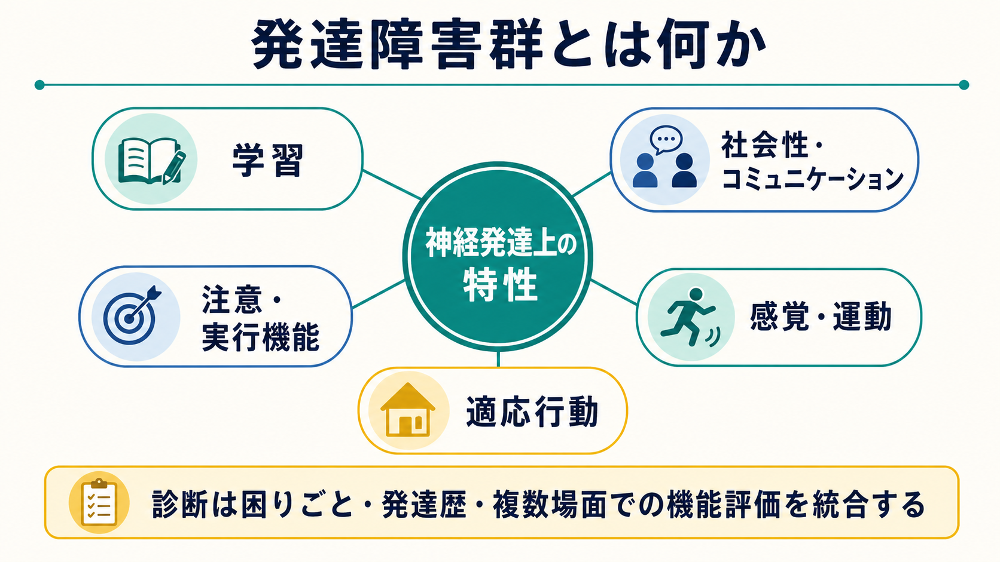
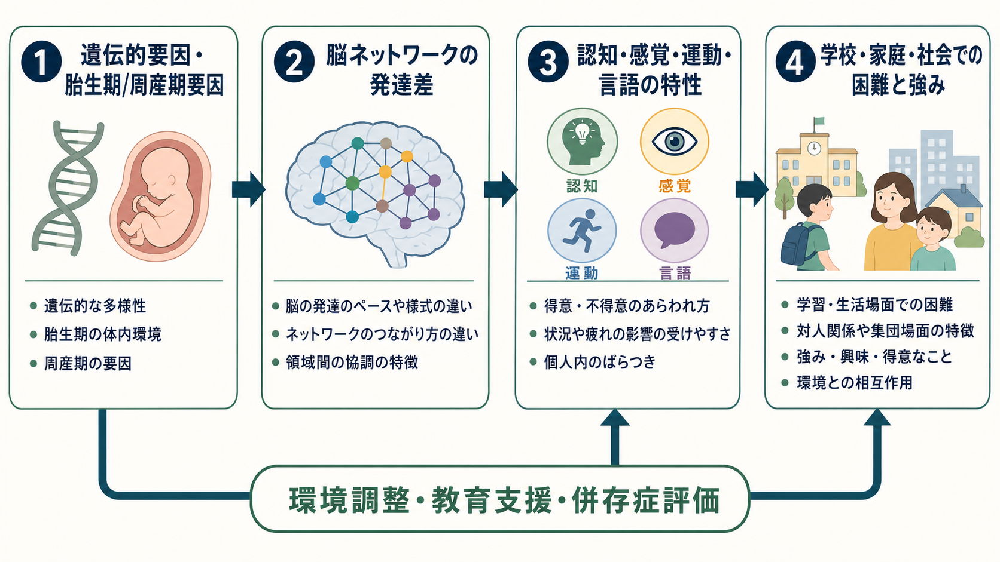
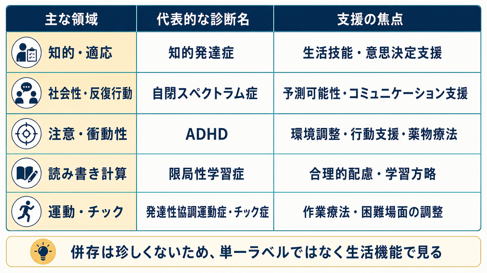

# 発達障害群とは何か

## 要点

- 発達障害群、より国際分類に近い表現では神経発達症群とは、発達期に始まり、認知、学習、言語、社会的コミュニケーション、注意、運動、適応行動に持続的な困難を生じうる疾患群である[1][2]。
- DSM-5-TR では、知的発達症、コミュニケーション症群、自閉スペクトラム症、ADHD、限局性学習症、運動症群、その他の神経発達症がこの領域に含まれる[1]。
- 単一の「脳の欠陥」ではなく、遺伝的脆弱性、胎生期・周産期要因、神経回路発達、環境要求、教育・家庭・社会の支援が相互作用して生活上の困難と強みを形づくる[3][4]。
- 診断はラベルを貼る作業ではなく、発達歴、複数場面での機能、併存症、本人の困りごと、支援可能性を統合して理解する臨床的プロセスである[5][6]。
- 本記事は教育・研究目的の概説であり、個別の診断や治療指示ではない。

## この記事で答える問い

1. 発達障害群とは、どのような疾患群をまとめた概念なのか。
2. 自閉スペクトラム症、ADHD、限局性学習症、知的発達症などは、何が共通し、何が異なるのか。
3. 「生まれつきだから変わらない」「努力不足である」といった理解は、なぜ不十分なのか。
4. 臨床・教育・研究では、発達障害群をどのように評価し、支援につなげるのか。

## まず結論

発達障害群とは、発達期に現れる神経発達上の特性が、学習、社会的コミュニケーション、注意・実行機能、運動、適応行動などの領域で困難を生じる疾患群である。中心にあるのは「本人の性格が悪い」「家庭のしつけだけが原因である」という説明ではなく、発達過程で形成される脳・認知・行動の個人差と、周囲の環境要求とのずれである[1][3]。

ただし、神経発達上の特性があることと、臨床診断が必要であることは同じではない。診断では、症状や特性が発達水準に照らして持続的であり、家庭、学校、職場、対人関係など複数の文脈で機能低下や苦痛に結びついているかを確認する[1][6]。この点で、発達障害群は「能力の単純な高低」ではなく、環境との相互作用のなかで現れる生活機能の問題として理解する必要がある。

## 背景

精神医学の分類では、かつて「幼児期・小児期・青年期に通常初めて診断される障害」として扱われていた領域が、DSM-5 以降は「神経発達症群」として整理された。DSM-5-TR は、この群を発達期に始まり、個人的、社会的、学業的、職業的機能を損なう発達上の欠陥として説明する[1]。ICD-11 でも、知的発達症、自閉スペクトラム症、発達性学習症、発達性協調運動症、ADHD、常同運動症、チック症群などが神経発達症群の近接領域として整理されている[2]。

この分類の利点は、個別診断の違いを保ちながら、発達期から始まる困難、併存の多さ、生涯にわたる支援ニーズを同時に見やすくする点にある。Thapar らは、神経発達症を単に小児期の問題としてではなく、成人期にも形を変えて持続しうる発達的・次元的な特徴として捉える必要を論じている[3]。たとえば ADHD の不注意は、子どもでは忘れ物や着席困難として目立ち、成人では時間管理、仕事の段取り、感情調整の困難として表面化することがある[7]。

この視点は、[[発達とは何か]]、[[発達精神病理学とは何か]]、[[神経発達の異常は精神疾患にどう関わるのか]]とも接続する。発達障害群を理解するには、診断名だけでなく、発達過程、環境要求、可塑性、支援による二次的困難の予防を同時に考える必要がある。

## 基本概念

### 主な診断群

| 診断群 | 中心となる困難 | 評価で見るポイント |
|---|---|---|
| 知的発達症 | 知的機能と適応行動の困難 | 概念的・社会的・実用的適応、日常生活支援の必要度 |
| コミュニケーション症群 | 言語、発話、社会的コミュニケーションの困難 | 言語理解・表出、会話の相互性、発話の流暢性 |
| 自閉スペクトラム症 | 社会的コミュニケーションの困難と限定的・反復的行動 | 対人相互性、感覚特性、こだわり、環境変化への反応 |
| ADHD | 不注意、多動性、衝動性 | 複数場面での持続性、学業・家庭・対人機能、併存症 |
| 限局性学習症 | 読み、書き、計算など特定学習技能の困難 | 知的能力や教育機会では説明しにくい学習技能の偏り |
| 運動症群 | 協調運動、常同運動、チックなどの困難 | 発達性協調運動、チックの頻度、生活上の支障 |

DSM-5-TR の神経発達症群は、これらを同じ箱に押し込めるための分類ではない。むしろ、異なる診断名の背後に、発達期発症、認知・行動機能の偏り、併存の多さ、環境調整の重要性という共通軸があることを示す枠組みである[1][3]。

### 特性と障害を分けて考える

発達障害群を理解するときは、「特性」と「障害」を分けて考えるとよい。たとえば、細部に強く注意が向く、特定領域への興味が深い、発想が速い、感覚刺激に敏感である、といった特徴は、それ自体が常に障害とは限らない。しかし、学校の一斉指示、曖昧な対人ルール、長時間の座位、読み書き中心の評価、騒音の多い環境などと組み合わさると、学習・社会性・行動調整の困難として現れる。

この見方は、障害を本人の内部だけに閉じ込めない。本人側の認知・神経発達上の特徴と、環境側の要求・支援・合理的配慮の組み合わせで生活機能を評価する。したがって、診断名は支援を考える入口であって、本人の能力や将来を一語で決めるものではない。

## 仕組み

発達障害群の機序は単一ではない。多くの研究は、遺伝的要因が重要である一方で、胎生期・周産期要因、早期発達環境、社会的文脈、教育制度などが重なって発現や困難の形を変えることを示している[3][4]。近年のメタ分析では、神経発達症どうし、また破壊的・衝動制御・行為関連の問題とのあいだに遺伝的・環境的な重なりがあることも報告されている[4]。

ここで重要なのは、遺伝的要因を「運命」と誤解しないことである。遺伝的寄与は、環境調整や教育支援が無意味であることを意味しない。むしろ、神経発達上の特性がどの場面で困難になりやすいかを理解することで、予測可能性を高める、課題を分割する、感覚刺激を調整する、視覚的手がかりを使う、学習評価を柔軟にする、といった具体的支援が設計しやすくなる。

神経科学的には、発達期の脳ではシナプス形成、刈り込み、髄鞘化、長距離ネットワークの成熟、実行機能や社会認知を支える回路の発達が長い時間をかけて進む。ASD のレビューでは、社会的コミュニケーション、反復行動、感覚特性を中核としつつ、神経画像、遺伝、発達心理、介入研究が多面的に関連することが整理されている[5]。ADHD では、注意制御、報酬処理、実行機能、前頭線条体系などの観点から理解されることが多く、[[ADHDは前頭線条体回路の障害として説明できるのか]]とも接続する。

## 図解

上の図は、主な診断群と支援の焦点を対応づけたものである。実際の臨床では、表のどれか一つにきれいに収まるとは限らない。ASD と ADHD、ADHD と限局性学習症、知的発達症と言語・運動の困難など、併存は珍しくない[3][4][6]。そのため、診断名だけで支援を決めるのではなく、読み書き、対人理解、感覚処理、睡眠、情動調整、家庭・学校・職場の要求を分けて評価することが重要である。

## 臨床・研究との接続

臨床評価では、本人の現在の症状だけでなく、発達歴、乳幼児期の言語・運動・社会性、学校での学習経過、家庭での生活技能、対人関係、睡眠、感覚過敏、身体疾患、併存する不安・抑うつ・チック・学習困難などを確認する。ADHD の AAP ガイドラインは、診断にあたり DSM 基準を満たすこと、複数場面での症状と機能障害を確認すること、保護者や教師など複数情報源から情報を得ること、併存症を評価することを推奨している[6]。CDC も、ADHD には単一の検査があるわけではなく、睡眠障害、不安、抑うつ、学習障害など類似症状を示す状態を鑑別する必要があると説明している[7]。

ASD については、NIMH が、社会的コミュニケーション・相互作用の困難、限定的・反復的行動、学習・行動・学校や仕事での機能への影響を診断上の中心として説明している[8]。重要なのは、ASD が「対人関係に関心がない」という単純な意味ではないことである。関心の持ち方、表現の仕方、感覚刺激の処理、予測しにくい状況への負荷が、多数派の環境設計と合わないときに困難が強くなる。

研究では、発達障害群はカテゴリ診断だけでなく、注意、言語、社会認知、感覚処理、運動協調、報酬感受性、実行機能などの次元としても扱われる。[[実行機能は子どもでどのように発達するのか]]、[[言語発達はどのように進むのか]]、[[心の理論はどのように発達するのか]]のような発達心理学・認知科学の観点は、診断横断的な理解を助ける。

## よくある誤解

### 「発達障害は親の育て方で決まる」

これは不正確である。家庭環境や教育環境は困難の現れ方や二次的問題に影響するが、発達障害群の中核を親の育て方だけで説明することはできない。遺伝的・神経発達的要因と環境要求の相互作用として考える方が、本人と家族を責めず、具体的支援につながりやすい[3][4]。

### 「診断がつけば、支援は自動的に決まる」

診断名は重要な手がかりだが、支援計画そのものではない。同じ ADHD でも、不注意が中心の人、多動・衝動性が目立つ人、学習障害や不安を併存する人では支援が異なる。ASD でも、言語能力、知的能力、感覚特性、日常生活技能、本人の希望によって必要な支援は変わる[5][6]。

### 「大人になれば自然に治る」

発達障害群の特徴は、年齢とともに見え方が変わる。子どもの多動は成人期に内的な落ち着かなさや時間管理の困難として現れることがあり、ASD の困難も学校、大学、職場、親密な関係など環境要求の変化で再び目立つことがある[3][7]。一方で、経験、環境調整、支援技術、自己理解により、困難を軽減し強みを活かせる場面も増える。

### 「発達障害は能力が低いという意味である」

これも誤解である。発達障害群は能力の一方向の低さではなく、機能の凹凸、状況依存性、環境要求とのミスマッチを含む。知的発達症では知的機能と適応行動の評価が中心になるが、ASD、ADHD、限局性学習症では、知的能力が平均以上でも生活上の困難が大きいことがある[1][2]。

## 関連ノート

- [[神経発達の異常は精神疾患にどう関わるのか]]
- [[ADHDは前頭線条体回路の障害として説明できるのか]]
- [[発達とは何か]]
- [[発達精神病理学とは何か]]
- [[実行機能は子どもでどのように発達するのか]]
- [[言語発達はどのように進むのか]]
- [[心の理論はどのように発達するのか]]
- [[養育環境は発達にどう影響するのか]]

### MOC 更新候補

- `content/00_MOC/MOC｜精神医学.md`
- `content/00_MOC/MOC｜発達・愛着・社会心理.md`
- `content/00_MOC/MOC｜神経科学と精神疾患.md`

## 理解チェック

1. 発達障害群に共通する「発達期発症」とは、何を意味するか。
2. 特性があることと、臨床診断が必要であることは、どのように区別できるか。
3. ASD と ADHD が併存しうることは、評価や支援にどのような影響を与えるか。
4. 「本人の努力不足」と考えるより、「環境要求とのミスマッチ」と考える方が有用な理由は何か。
5. 診断名だけでなく生活機能を評価するには、どのような情報源が必要か。

## 参考文献

[1] American Psychiatric Association. (2022). *Diagnostic and Statistical Manual of Mental Disorders, Fifth Edition, Text Revision (DSM-5-TR)*. American Psychiatric Association Publishing. https://doi.org/10.1176/appi.books.9780890425787

[2] World Health Organization. (2025). *ICD-11 for Mortality and Morbidity Statistics: Neurodevelopmental disorders*. https://icd.who.int/browse/2025-01/mms/en

[3] Thapar, A., Cooper, M., & Rutter, M. (2017). Neurodevelopmental disorders. *The Lancet Psychiatry, 4*(4), 339-346. https://doi.org/10.1016/S2215-0366(16)30376-5

[4] Gidziela, A., Ahmadzadeh, Y. I., Michelini, G., et al. (2023). A meta-analysis of genetic effects associated with neurodevelopmental disorders and co-occurring conditions. *Nature Human Behaviour, 7*, 642-656. https://doi.org/10.1038/s41562-023-01530-y

[5] Lord, C., Brugha, T. S., Charman, T., et al. (2020). Autism spectrum disorder. *Nature Reviews Disease Primers, 6*, 5. https://doi.org/10.1038/s41572-019-0138-4

[6] Wolraich, M. L., Hagan, J. F., Allan, C., et al. (2019). Clinical practice guideline for the diagnosis, evaluation, and treatment of attention-deficit/hyperactivity disorder in children and adolescents. *Pediatrics, 144*(4), e20192528. https://doi.org/10.1542/peds.2019-2528

[7] Centers for Disease Control and Prevention. (2024). *Diagnosing ADHD*. https://www.cdc.gov/adhd/diagnosis/index.html

[8] National Institute of Mental Health. (n.d.). *Autism Spectrum Disorder*. https://www.nimh.nih.gov/health/publications/autism-spectrum-disorder

## 未解決問題

- 診断カテゴリを超えて、注意、社会認知、感覚処理、運動、言語、学習をどのように次元的に評価するか。
- 発達障害群の強みや適応的側面を、臨床研究・教育支援のアウトカムにどう組み込むか。
- 成人期、高齢期の発達障害群を、就労、家族関係、身体疾患、二次的精神症状とあわせてどう評価するか。
- 遺伝・神経画像・認知課題などの研究知見を、個別支援に過剰一般化せず接続する方法は何か。
