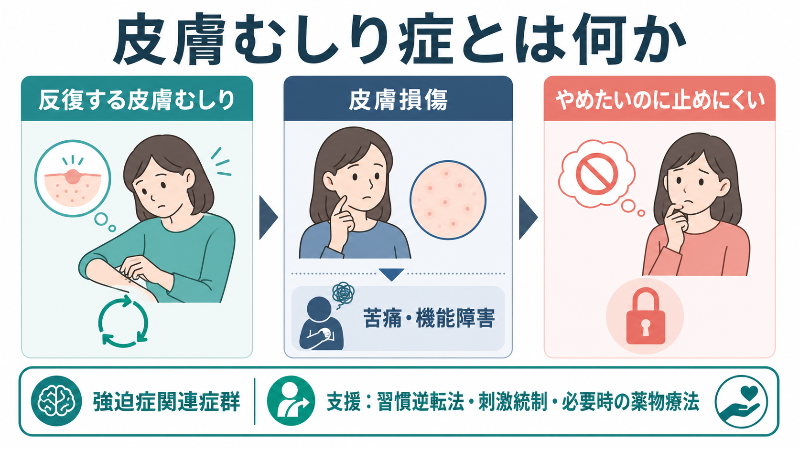
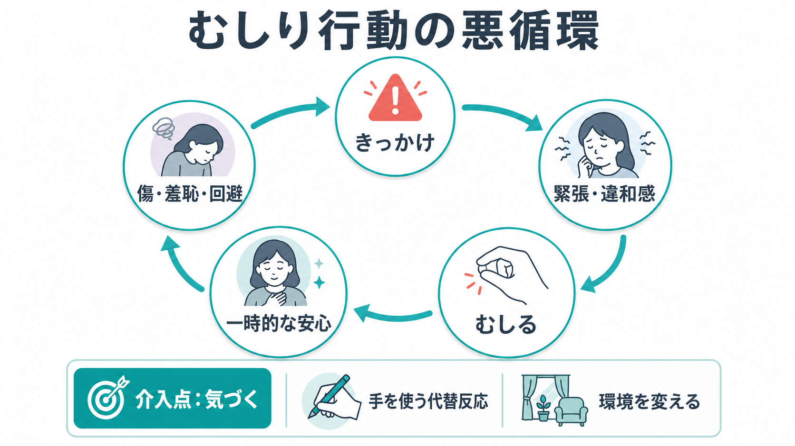

# 皮膚むしり症とは何か

## 要点

- 皮膚むしり症は、皮膚を繰り返しむしる・ひっかく・つぶす行動が、皮膚損傷、苦痛、社会生活や学業・仕事への支障につながる疾患である[1][2]。
- DSM-5-TR では強迫症および関連症群に、ICD-11 では身体集中反復行動症群に位置づけられる[1][2]。
- 行動は「意志が弱いから」ではなく、違和感・緊張・退屈・不安・一時的な安心・羞恥や回避が組み合わさった悪循環として理解するほうが臨床的に有用である[3][4]。
- 支援では、まず皮膚疾患、物質、身体醜形症、精神病症状、自傷行動などを鑑別し、そのうえで習慣逆転法、刺激統制、認知行動療法、必要に応じた薬物療法を検討する[3][5][6]。
- この記事は教育・研究目的の概説であり、個別の診断や治療指示ではない。強い感染、出血、疼痛、希死念慮、自傷他害リスクがある場合は、医療機関での評価が優先される。

## この記事で答える問い

1. 皮膚むしり症は、単なる癖や美容上の問題と何が違うのか。
2. なぜ「やめたい」と思っても、むしり行動が続きやすいのか。
3. 臨床では、何と鑑別し、どのような支援につなげるのか。

## まず結論

皮膚むしり症の中心は、皮膚をむしる行動そのものだけではなく、「やめようとしても減らせない」「皮膚損傷が起こる」「苦痛や生活機能障害が生じる」という組み合わせである[1][2]。そのため、軽い癖、ニキビを一度つぶす行為、皮膚疾患による掻破、身体醜形症で外見上の欠陥を修正しようとする行動、非自殺性自傷とは区別して考える必要がある[3]。

治療的には、本人を責めて抑え込むよりも、行動が起きる時間・場所・感覚・感情・道具・皮膚状態を具体的に観察し、悪循環のどこに介入できるかを探す。よく研究されている心理的介入は習慣逆転法を中心とする認知行動療法であり、薬物療法では N-アセチルシステインやメマンチンなどグルタミン酸系に関わる薬剤の試験結果が報告されている。ただし、薬物療法の位置づけは症状、併存症、既存治療、地域の承認状況によって慎重に判断される[5][6][7]。

## 背景

皮膚むしり症は英語で excoriation disorder または skin-picking disorder と呼ばれる。古くは dermatillomania、pathological skin picking、neurotic excoriation などの名称でも扱われてきたが、現在の診断分類では、皮膚を対象にした身体集中反復行動の一つとして整理される[2][8]。

有病率は研究ごとに幅がある。一般人口を対象とした系統的レビュー・メタ解析では、皮膚むしり症の推定有病率は約 3.45% とされ、女性でやや多い傾向が報告されている[4]。ただし、調査方法、診断基準、オンライン調査か面接調査かによって推定値は変動する。重要なのは、「珍しい問題だから見逃してよい」のではなく、恥ずかしさや隠蔽のために相談されにくい問題として臨床面接に組み込むことである。

既存ノートでは、分類の位置づけは [[DSMとICDは何が違うのか]]、関連症群としては [[強迫症とは何か]]、行動の観察は [[MSEで外観と行動から何を観察するか]] と接続して読むと理解しやすい。

## 基本概念

DSM-5-TR の臨床基準では、皮膚を繰り返しむしって皮膚損傷を生じること、むしり行動を減らす・やめる試みが反復していること、その行動が臨床的に意味のある苦痛または機能障害をもたらすことが中心になる[1][3]。さらに、物質や身体疾患によるものではなく、他の精神疾患でよりよく説明されないことも確認する[3]。

ICD-11 では、皮膚むしり症は身体集中反復行動症群の一つであり、顔、腕、手などを含む複数部位に起こりうる。短いエピソードが一日に散在する場合も、長く続くエピソードとして起こる場合もある[2]。

ここでの「皮膚損傷」は、重症の外傷だけを意味しない。赤み、かさぶた、出血、瘢痕、感染、疼痛、化粧や衣服で隠す必要、受診や対人場面の回避などを含めて評価する。本人が「大したことではない」と言っていても、時間、隠蔽、回避、自己嫌悪が生活を狭めている場合がある。

## 仕組み

皮膚むしり症を理解するうえで有用なのは、単一の原因ではなく、行動ループとして見ることである。きっかけには、皮膚の凹凸、ニキビ、かさぶた、毛穴、乾燥、かゆみ、鏡を見る場面、勉強や仕事中の退屈、緊張、不安、疲労などがある。むしった直後には「取れた」「すっきりした」「不快感が減った」という短期的な報酬が生じうるが、その後に傷、痛み、感染不安、恥ずかしさ、外出回避が続き、さらに緊張や自己注目が高まる[3][8]。

この悪循環は、[[強迫行為とは何か]] と似た「不快感を下げるための反復行動」として理解できる面がある。一方で、皮膚むしり症では明確な強迫観念が前景に出ないことも多く、半自動的に手が伸びる、気づいたら長時間続いている、感覚的な違和感を整えようとする、といった身体感覚・習慣性の側面も強い[3][8]。

神経科学的には、報酬処理、習慣学習、反応抑制、感覚運動処理、前頭-線条体回路などが研究対象になる。ただし、現時点では「この脳部位が原因」と断定できる段階ではない。トリコチロマニアと皮膚むしり症を含む身体集中反復行動の研究では、症状サブタイプや報酬処理に関する知見が蓄積しつつあるが、臨床で個別診断に直接使えるバイオマーカーはまだ限られる[8]。回路モデルは、[[強迫症では皮質線条体視床回路に何が起きているのか]] や [[報酬系の異常はうつ病をどう説明するのか]] と接続して理解できる。

## 図解

図1は、皮膚むしり症の全体像を、反復行動、皮膚損傷、止めにくさ、苦痛・機能障害、支援の入口としてまとめている。診断名を貼ることよりも、「どの行動が、どの損傷と苦痛につながっているか」を具体化することが出発点になる。

図2は、きっかけから一時的な安心、傷・羞恥・回避へ進む悪循環を示している。介入では、悪循環を根性で止めるのではなく、気づき、代替反応、環境調整を入れられる場所を増やす。

図3は、評価・鑑別・支援・研究課題の接続を整理している。皮膚むしり症は皮膚科、精神科、心理療法、家族支援が交差しやすいテーマであり、単一職種だけで抱え込まないほうがよい場合がある。

## 臨床・研究との接続

評価では、頻度、持続時間、部位、使う道具、皮膚損傷の程度、感染徴候、隠蔽行動、回避、苦痛、生活機能、これまでの中止努力を聞く。自動的に起こるのか、意識的に行うのか、むしる前後にどのような感覚や感情があるのかも重要である[3]。

鑑別では、まず皮膚疾患による痒みや掻破、薬物・物質による蟻走感や掻破、神経疾患、感染症を考える。精神医学的には、身体醜形症、精神病症状に伴う皮膚への確信、強迫症、摂食障害、自傷行動、発達特性やチック関連症状との関係を整理する[2][3]。希死念慮や自傷意図が疑われる場合は、皮膚むしり症だけに狭めず、[[自傷と自殺企図はどう違うのか]] や [[自殺リスク評価では何を聞くべきか]] の観点で安全評価を行う。

心理療法では、習慣逆転法が中核になる。典型的には、むしり行動に気づく訓練、きっかけの記録、手を握る・別の物を持つ・座り方を変えるなどの拮抗反応、鏡・ピンセット・照明・一人時間などの刺激統制、家族や周囲の関わり方の調整を行う[5]。これは単なる禁止ではなく、行動が始まる前後の条件を再設計する方法である。

薬物療法では、SSRI やクロミプラミンが使われることがあるが、エビデンスは一貫して強いとはいえない。N-アセチルシステインのランダム化比較試験では、12週間で症状尺度の改善がプラセボより大きく、終了時に「かなり改善または非常に改善」と評価された割合も高かった[6]。メマンチンの二重盲検試験では、トリコチロマニアまたは皮膚むしり症の成人を対象に、プラセボより症状と機能の改善が報告された[7]。ただし、これらは個別の自己判断による服用を勧める根拠ではなく、併存症、相互作用、副作用、地域の承認状況を含めて医師と検討する対象である。

研究上の課題は、長期効果、再発予防、青年期への介入、併存症をもつ人への適用、皮膚科との連携、神経機構と治療反応の対応である。特に、恥ずかしさや隠蔽のために研究参加者が偏りやすく、一般人口の実態をどこまで反映しているかには注意が必要である[4][8]。

## よくある誤解

### 誤解1: ただの癖なので、放っておけばよい

癖として軽く済む場合もあるが、皮膚損傷、感染、瘢痕、苦痛、回避、学業・仕事への支障がある場合は疾患として評価する価値がある[1][3]。問題の大きさは、傷の見た目だけでなく、費やす時間や生活の狭まりでも判断する。

### 誤解2: 意志が弱いから止められない

皮膚むしり症では、行動の前後に感覚的不快感、緊張、退屈、不安、一時的な安心が絡む。本人を叱責しても悪循環が強まることがある。支援では、責任追及よりも、きっかけを見つけ、行動の代替を作り、環境を調整する[5]。

### 誤解3: 美容や皮膚科の問題だけである

皮膚科的評価は重要だが、それだけで終わらない場合がある。皮膚損傷への処置と同時に、反復行動、苦痛、回避、併存する不安・抑うつ・強迫症状を評価する必要がある[3][8]。

### 誤解4: 自傷と同じ意味である

皮膚むしり症では、死にたい、罰したい、苦痛を身体化したいという意図が中心でないことが多い。一方で、皮膚を傷つける行動である以上、自傷意図や希死念慮が併存していないかは別に確認する必要がある。分類を急がず、意図、前後の感情、損傷の程度、安全性を分けて聞く。

## 関連ノート

- [[強迫症とは何か]]
- [[強迫行為とは何か]]
- [[強迫観念とは何か]]
- [[DSMとICDは何が違うのか]]
- [[MSEで外観と行動から何を観察するか]]
- [[MSEで思考内容をどう評価するか]]
- [[自傷と自殺企図はどう違うのか]]
- [[強迫症では皮質線条体視床回路に何が起きているのか]]

今後の作成候補: 「身体集中反復行動症群とは何か」「習慣逆転法とは何か」「身体醜形症とは何か」「トリコチロマニアとは何か」「皮膚科と精神科の連携をどう考えるか」。

MOC更新候補: 「MOC 精神医学」「MOC 臨床心理」「MOC 強迫症関連症群」。並列ジョブとの競合を避けるため、本稿では MOC 本体は更新しない。

## 理解チェック

1. 皮膚むしり症を、単なる皮膚の癖ではなく疾患として評価する基準は何か。
2. 「むしる前」「むしっている最中」「むしった後」に分けると、どのような悪循環が見えるか。
3. 身体醜形症、皮膚疾患、自傷行動とは、どの点を確認して区別するか。
4. 習慣逆転法で扱う「気づき」「代替反応」「刺激統制」は、それぞれ何を変える介入か。
5. 薬物療法の研究結果を、自己判断での服用指示として読んではいけない理由は何か。

## 参考文献

[1] American Psychiatric Association. (2022). *Diagnostic and Statistical Manual of Mental Disorders, Fifth Edition, Text Revision (DSM-5-TR).* American Psychiatric Association Publishing. https://doi.org/10.1176/appi.books.9780890425787

[2] World Health Organization. (2025). *ICD-11 for Mortality and Morbidity Statistics: 6B25.1 Excoriation disorder.* https://icd.who.int/browse/2025-01/mms/en#726494117

[3] Phillips, K. A., Stein, D. J., & Zimmerman, M. (2026). *Excoriation (Skin-Picking) Disorder.* Merck Manual Professional Edition. https://www.merckmanuals.com/professional/psychiatric-disorders/obsessive-compulsive-and-related-disorders/excoriation-skin-picking-disorder

[4] Farhat, L. C., Reid, M., Bloch, M. H., & Olfson, E. (2023). Prevalence and gender distribution of excoriation (skin-picking) disorder: A systematic review and meta-analysis. *Journal of Psychiatric Research, 161*, 125-134. https://doi.org/10.1016/j.jpsychires.2023.03.034

[5] Lee, M. T., Mpavaenda, D. N., & Fineberg, N. A. (2019). Habit reversal therapy in obsessive compulsive related disorders: A systematic review of the evidence and CONSORT evaluation of randomized controlled trials. *Frontiers in Behavioral Neuroscience, 13*, 79. https://doi.org/10.3389/fnbeh.2019.00079

[6] Grant, J. E., Chamberlain, S. R., Redden, S. A., Leppink, E. W., Odlaug, B. L., & Kim, S. W. (2016). N-acetylcysteine in the treatment of excoriation disorder: A randomized clinical trial. *JAMA Psychiatry, 73*(5), 490-496. https://doi.org/10.1001/jamapsychiatry.2016.0060

[7] Grant, J. E., Chesivoir, E., Valle, S., Ehsan, D., & Chamberlain, S. R. (2023). Double-blind placebo-controlled study of memantine in trichotillomania and skin-picking disorder. *American Journal of Psychiatry, 180*(5), 348-356. https://doi.org/10.1176/appi.ajp.20220737

[8] Grant, J. E., & Chamberlain, S. R. (2021). Trichotillomania and skin-picking disorder: An update. *Focus, 19*(4), 405-412. https://doi.org/10.1176/appi.focus.20210013

## 未解決問題

- 青年期・高齢期・発達特性をもつ人で、皮膚むしり症の経過や有効な支援はどう変わるか。
- 習慣逆転法、刺激統制、薬物療法、皮膚科的ケアをどの順序・組み合わせで使うと長期再発を減らせるか。
- 報酬処理、感覚運動処理、前頭-線条体回路の指標は、治療反応の予測に使えるか。

## 更新ログ

- 2026-04-28: 初稿作成。診断分類、悪循環、鑑別、支援、研究課題を整理し、画像3枚を追加。
