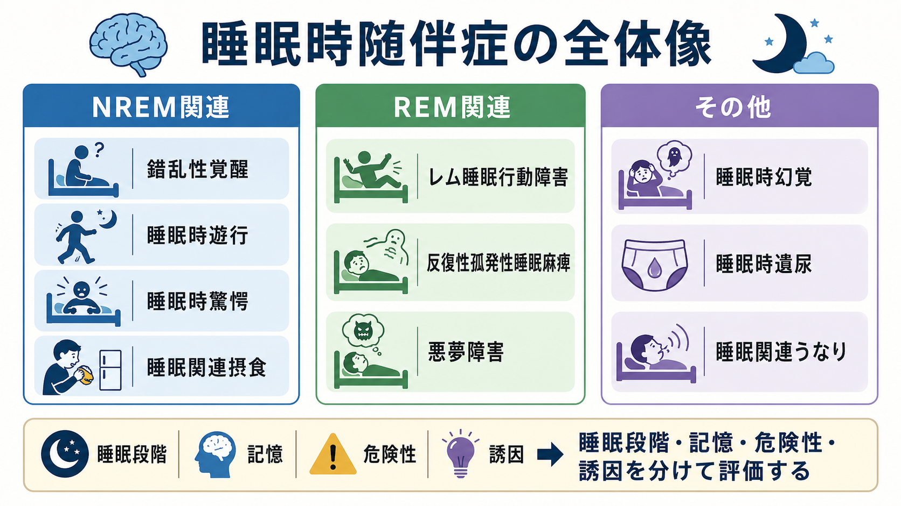
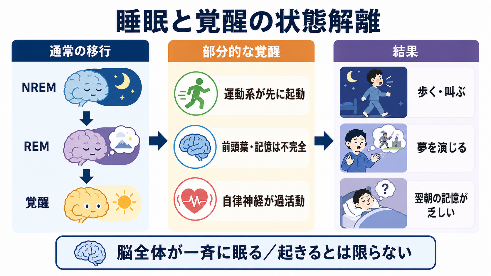
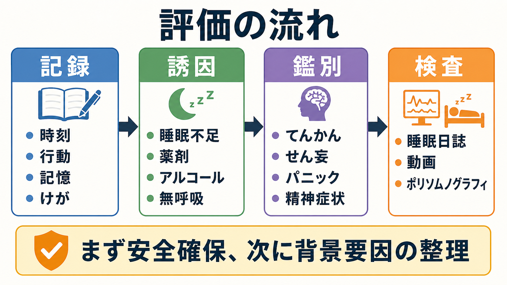

# 睡眠時随伴症とは何か

## 要点

- 睡眠時随伴症は、睡眠中、入眠時、覚醒への移行時に生じる異常な行動、運動、感情、自律神経反応、知覚体験をまとめる疾患群である[1][2]。
- 臨床的には、NREM関連、REM関連、その他の睡眠時随伴症に分けると理解しやすい[1][3]。
- 中心概念は「睡眠か覚醒か」の二分法ではなく、運動、記憶、情動、自律神経、夢見、前頭葉機能がずれて立ち上がる状態解離である[2][4]。
- 問診では、発生時刻、睡眠段階の推定、行動の複雑さ、記憶、夢内容、けが、同室者情報、薬剤、アルコール、睡眠不足、睡眠時無呼吸、神経疾患を確認する[2][3]。
- 成人発症、外傷性行動、高齢発症のレム睡眠行動障害、日中の神経症状、てんかんやせん妄が疑われる場合は、専門的評価が重要になる[5][6]。

## この記事で答える問い

1. 睡眠時随伴症は、寝ぼけ、悪夢、てんかん、精神症状と何が違うのか。
2. NREM関連、REM関連、その他の睡眠時随伴症はどのように整理できるのか。
3. 「睡眠と覚醒の状態解離」は、異常行動や記憶の乏しさをどう説明するのか。
4. 臨床・研究では、どの情報を集めると安全評価と鑑別に役立つのか。

## まず結論

睡眠時随伴症は「眠っている人が変なことをする」という単一の現象ではない。むしろ、睡眠段階、覚醒水準、筋緊張、夢見、記憶、情動、自律神経反応の組み合わせが崩れたときに現れる複数の病態である。ICSD-3-TR では睡眠障害の主要カテゴリの一つとして parasomnias が置かれ、睡眠関連呼吸障害、過眠症、概日リズム睡眠覚醒障害、睡眠関連運動障害などとは分けて扱われる[1]。

典型的には、NREM関連睡眠時随伴症は夜の前半、深いNREM睡眠からの不完全な覚醒として起こりやすく、本人の記憶は乏しい。錯乱性覚醒、睡眠時遊行、睡眠時驚愕などが代表である[2][3]。一方、REM関連睡眠時随伴症は夢見やREM睡眠の筋緊張抑制と関係し、悪夢障害、反復性孤発性睡眠麻痺、レム睡眠行動障害などが含まれる[2][5]。同じ「夜間の異常行動」でも、起こる睡眠段階と背景メカニズムが違うため、評価と対応も異なる。

## 背景

[[睡眠覚醒障害群とは何か]]の中で、睡眠時随伴症は「睡眠の量やタイミング」だけでなく「睡眠中に何が起きるか」を扱う領域である。[[不眠障害とは何か]]が入眠困難、睡眠維持困難、早朝覚醒、日中機能障害を中心に考えるのに対し、睡眠時随伴症では、眠っている間の行動、発声、恐怖反応、夢内容、身体感覚、排尿、摂食などが焦点になる。

重要なのは、睡眠時随伴症が必ずしも「精神的な問題の表れ」ではないという点である。小児のNREM関連睡眠時随伴症は発達とともに軽快することが多く、成人でも睡眠不足、発熱、ストレス、アルコール、睡眠時無呼吸、薬剤などによって誘発されることがある[2][3]。ただし、けが、転落、同室者への危険、頻回化、成人後の新規発症、高齢発症、神経症状を伴う場合は、背景疾患の評価が必要になる[3][5]。

## 基本概念

### NREM関連睡眠時随伴症

NREM関連睡眠時随伴症は、深いNREM睡眠から覚醒へ移る過程が不完全なときに生じる。代表例は錯乱性覚醒、睡眠時遊行、睡眠時驚愕であり、睡眠関連摂食障害や睡眠関連性的行動も近接する病態として論じられる[2][3]。

この群では、目を開ける、座る、歩く、叫ぶ、物を動かすなど、外からは覚醒しているように見える行動が起こる。しかし本人の状況理解は不完全で、翌朝の記憶が乏しいことが多い。発生しやすいのは夜の前半で、睡眠不足、睡眠の分断、ストレス、発熱、アルコール、鎮静薬、睡眠時無呼吸、周期性四肢運動などが誘因になる[2][3]。

### REM関連睡眠時随伴症

REM関連睡眠時随伴症では、夢見、REM睡眠中の筋緊張抑制、覚醒への移行が中心になる。悪夢障害では、不快な夢から覚醒し、夢内容を比較的はっきり思い出せることが多い[7]。反復性孤発性睡眠麻痺では、入眠時または覚醒時に意識があるのに身体を動かせない体験が起こる[2]。

レム睡眠行動障害では、本来REM睡眠中に抑制されるはずの筋活動が残り、夢の内容に沿った発声や運動が起こる。殴る、蹴る、飛び起きる、転落するなど、本人や同室者の外傷につながることがある[5]。特に中高年以降に生じる孤発性レム睡眠行動障害は、パーキンソン病、レビー小体型認知症、多系統萎縮症などのシヌクレイノパチーの前駆状態として研究されている[6]。関連する詳細は [[レム睡眠行動障害とは何か]] が参考になる。

### その他の睡眠時随伴症

その他の睡眠時随伴症には、睡眠時遺尿、睡眠関連幻覚、睡眠関連うなりなどが含まれる[1][2]。ここでは「睡眠中に起きる」という共通点はあっても、発生する睡眠段階、年齢、背景疾患、治療方針は異なる。したがって、名称だけでまとめて判断せず、発生時刻、意識、記憶、随伴症状、生活上の支障を分けて記述する必要がある。

## 仕組み

### 状態解離として理解する

睡眠時随伴症を理解する鍵は、睡眠と覚醒を単純なオン・オフとして見ないことである。脳の各システムは、同時に完全に眠り、同時に完全に起きるわけではない。運動系が先に立ち上がる、前頭葉による状況判断が不十分である、夢見が強く残る、自律神経反応が過活動になる、といった部分的なずれが起こる[2][4]。

NREM関連睡眠時随伴症では、深い睡眠からの不完全な覚醒が中心である。脳の一部は行動を出せる程度に起動しているが、状況を理解し、記憶として統合する機能は十分に働いていない。そのため、歩く、叫ぶ、物を扱うなどの行動が出ても、本人は夢とも現実ともつかない状態にあり、翌朝の記憶が乏しい[2][3]。

REM関連睡眠時随伴症では、夢見と筋緊張抑制の関係が重要になる。通常のREM睡眠では、鮮明な夢と骨格筋の弛緩が組み合わさる。レム睡眠行動障害ではこの筋緊張抑制が不十分となり、夢を演じるような行動が出る[5]。一方、睡眠麻痺では、覚醒意識が戻っているのにREM睡眠由来の筋緊張抑制が残るため、「起きているのに動けない」という体験になる[2]。

### 誘因と脆弱性

睡眠時随伴症は、素因と誘因の組み合わせで現れる。NREM関連では、深い睡眠からの覚醒を乱す要因、つまり睡眠不足、睡眠の分断、発熱、騒音、ストレス、アルコール、睡眠時無呼吸、むずむず脚症候群、薬剤などが重要である[2][3]。REM関連では、抗うつ薬などの薬剤、ナルコレプシー、神経変性疾患、PTSDに関連した悪夢など、病態ごとの背景を確認する[5][7]。

この見方は、[[精神科診察で睡眠をどう評価するか]]とも接続する。症状名を早く決めるより、出来事の時系列、睡眠環境、生活リズム、薬剤、物質使用、身体疾患、神経症状、同室者の観察を統合する方が、安全評価と鑑別に役立つ。

## 図解

3枚の図は、この記事の読み方に対応している。

1. 1枚目は、睡眠時随伴症をNREM関連、REM関連、その他に分ける概念地図である。
2. 2枚目は、睡眠と覚醒の状態解離を、運動系、前頭葉・記憶、自律神経のずれとして示している。
3. 3枚目は、臨床・研究で確認する情報を、記録、誘因、鑑別、検査の流れに整理している。

## 臨床・研究との接続

### 問診で確認すること

睡眠時随伴症の評価では、本人の語りだけでなく、同室者、家族、動画記録、睡眠日誌が重要になる。確認すべき情報は、発生時刻、睡眠から何時間後か、行動の内容、声かけへの反応、目の開き方、夢内容の記憶、翌朝の記憶、けが、転落、暴力性、頻度、薬剤、アルコール、睡眠不足、発熱、ストレス、日中眠気である[2][3]。

NREM関連は夜の前半に多く、本人の記憶が乏しい傾向がある。REM関連は夜の後半に目立ちやすく、悪夢や夢演技行動では夢内容の記憶が比較的残ることがある[2][3]。ただし時刻だけで診断できるわけではなく、睡眠時無呼吸、てんかん、パニック発作、せん妄、物質・薬剤、神経疾患との鑑別が必要である。

### 検査が必要になる場合

外傷性行動、成人以降の新規発症、頻回で生活機能を損なう症状、てんかんが疑われる発作様イベント、睡眠時無呼吸が疑われるいびきや無呼吸、レム睡眠行動障害が疑われる夢演技行動では、ビデオ付きポリソムノグラフィが有用になる[3][5]。特にレム睡眠行動障害では、REM睡眠中の筋緊張抑制消失を客観的に確認し、周期性四肢運動、睡眠時無呼吸、てんかん、他の睡眠時随伴症を鑑別する意義がある[5][6]。

### 対応の原則

第一の対応は安全確保である。寝室の危険物を減らす、床に近い寝具にする、窓や階段へのアクセスを避ける、同室者への危険を減らすなど、環境調整が先行する[5]。次に、睡眠不足、アルコール、睡眠時無呼吸、薬剤、ストレスなど、誘因になりうる要因を評価する[2][3]。

治療は病態ごとに異なる。NREM関連睡眠時随伴症では、睡眠衛生、睡眠不足の是正、睡眠を分断する疾患の治療、予定覚醒、心理的介入などが検討されるが、エビデンスは疾患ごとに限界がある[8]。悪夢障害では、イメージリハーサル療法などの心理的介入が重視される[7]。レム睡眠行動障害では、安全対策を基本に、メラトニンやクロナゼパムなどが条件付きで推奨されるが、年齢、転倒リスク、認知機能、併存疾患に応じた個別判断が必要である[5]。

本記事は教育・研究目的の整理であり、個別の診断や治療指示ではない。外傷、窒息、転落、意識障害、発作、急な性格・認知変化、日中の神経症状を伴う場合は、睡眠医学、精神科、神経内科などの専門的評価が必要になる。

## よくある誤解

### 「寝ぼけなら放っておけばよい」

小児期の軽いNREM関連睡眠時随伴症は自然に軽快することがある。しかし、危険行動、外傷、同室者への危険、頻回化、成人発症、薬剤や睡眠時無呼吸の関与が疑われる場合は、放置せず評価する必要がある[3][8]。

### 「悪夢と睡眠時驚愕は同じ」

悪夢障害では、怖い夢から覚醒し、夢内容を思い出せることが多い。睡眠時驚愕では、強い恐怖表情、叫び、自律神経反応が目立つが、本人の覚醒は不完全で、翌朝の記憶は乏しいことが多い[2][7]。両者は似て見えても、睡眠段階と意識状態が異なる。

### 「夜中に暴れるなら精神症状である」

夜間の異常行動は、精神症状だけで説明できない。レム睡眠行動障害、てんかん、睡眠時無呼吸、薬剤、アルコール、せん妄、神経変性疾患などが関係する場合がある[3][5]。鑑別では [[せん妄とは何か]]、[[ナルコレプシーとは何か]]、[[睡眠障害とは何か]] との接続が重要になる。

## 関連ノート

- [[睡眠覚醒障害群とは何か]]
- [[睡眠障害とは何か]]
- [[不眠障害とは何か]]
- [[ナルコレプシーとは何か]]
- [[レム睡眠行動障害とは何か]]
- [[睡眠中の意識はどう理解できるのか]]
- [[精神科診察で睡眠をどう評価するか]]
- [[せん妄とは何か]]

MOC更新候補: `content/00_MOC/` 配下の精神医学、睡眠、症候学に関するMOCへ追加する候補。並列ジョブとの衝突を避けるため、本記事ではMOC本体は更新しない。

今後の作成候補:

- 睡眠時遊行とは何か
- 睡眠時驚愕とは何か
- 悪夢障害とは何か
- 睡眠麻痺とは何か
- 睡眠関連摂食障害とは何か

## 理解チェック

1. 睡眠時随伴症を評価するとき、なぜ「寝ているか起きているか」だけでは不十分なのか。
2. NREM関連睡眠時随伴症で、翌朝の記憶が乏しいことが多い理由は何か。
3. レム睡眠行動障害で、安全確保が最初に重視されるのはなぜか。
4. 夜間の異常行動を見たとき、てんかん、せん妄、睡眠時無呼吸、薬剤を鑑別に入れる理由は何か。

## 参考文献

[1] American Academy of Sleep Medicine. *International Classification of Sleep Disorders, Third Edition, Text Revision (ICSD-3-TR).* AASM, 2023. https://shop.aasm.org/products/icsd-3-text-revision-print

[2] Howell MJ. Parasomnias: an updated review. *Neurotherapeutics.* 2012;9(4):753-775. https://doi.org/10.1007/s13311-012-0143-8

[3] Bollu PC, Goyal MK, Thakkar MM, Sahota P. Sleep Medicine: Parasomnias. *Missouri Medicine.* 2018;115(2):169-175. https://pmc.ncbi.nlm.nih.gov/articles/PMC6139852/

[4] Fleetham JA, Fleming JAE. Parasomnias. *CMAJ.* 2014;186(8):E273-E280. https://doi.org/10.1503/cmaj.120808

[5] Howell M, Avidan AY, Foldvary-Schaefer N, et al. Management of REM sleep behavior disorder: an American Academy of Sleep Medicine clinical practice guideline. *Journal of Clinical Sleep Medicine.* 2023;19(4):759-768. https://doi.org/10.5664/jcsm.10424

[6] Neilson LE, Khattab YI, Lim MM. REM Sleep Behavior Disorder as a Prodromal Synucleinopathy: Updates on Clinical and Laboratory Biomarkers, and Implications for Neuroprotective Trials. *Current Neurology and Neuroscience Reports.* 2025;25(1):73. https://doi.org/10.1007/s11910-025-01452-4

[7] Morgenthaler TI, Auerbach S, Casey KR, et al. Position Paper for the Treatment of Nightmare Disorder in Adults: An American Academy of Sleep Medicine Position Paper. *Journal of Clinical Sleep Medicine.* 2018;14(6):1041-1055. https://doi.org/10.5664/jcsm.7178

[8] Mundt JM, Schuiling MD, Warlick C, et al. Behavioral and psychological treatments for NREM parasomnias: A systematic review. *Sleep Medicine.* 2023;111:36-53. https://doi.org/10.1016/j.sleep.2023.09.004

## 未解決問題

- NREM関連睡眠時随伴症の治療研究は、症例報告や小規模研究に偏りやすく、標準化された介入研究がまだ少ない。
- レム睡眠行動障害はシヌクレイノパチーの前駆状態として重要だが、個人レベルでの発症予測、告知、予防介入には未解決の倫理的・臨床的問題が残る。
- 動画、家庭用センサー、ウェアラブル、ポリソムノグラフィをどう組み合わせると、日常環境での安全評価と研究指標を両立できるかは今後の課題である。
