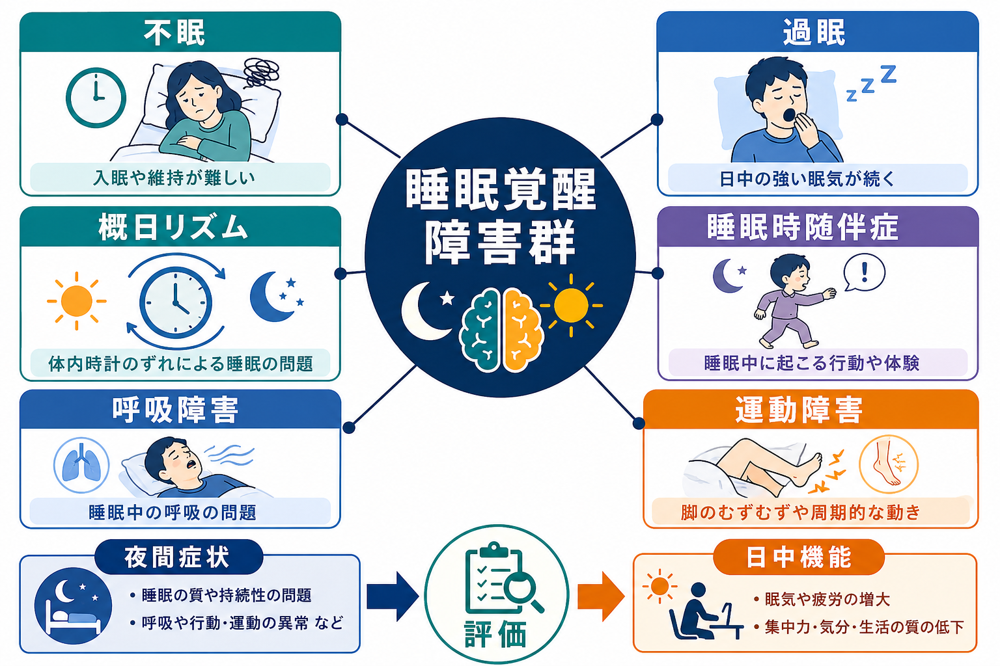
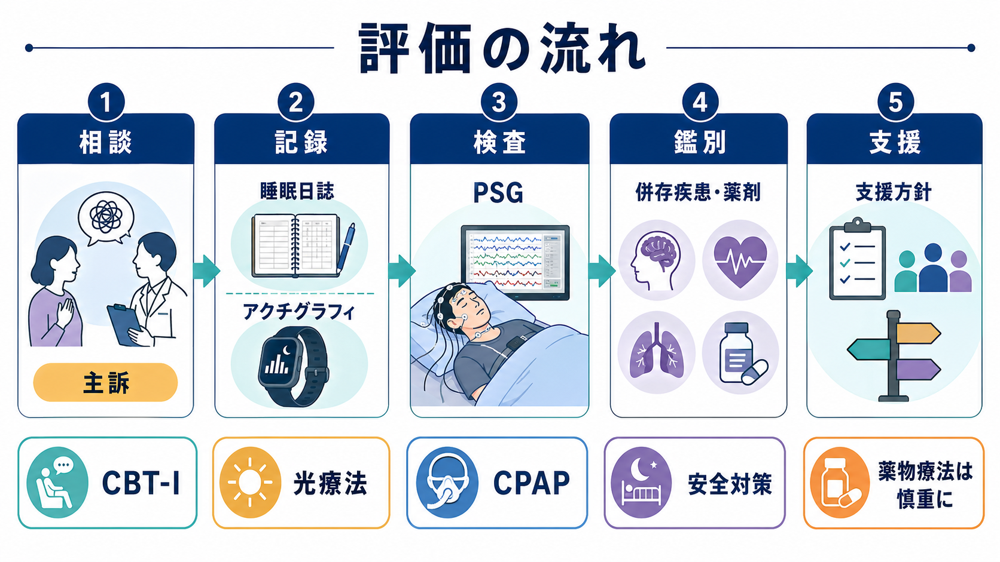

# 睡眠覚醒障害群とは何か

## 要点

- 睡眠覚醒障害群は、「眠れない」「眠すぎる」「眠る時刻がずれる」「睡眠中に異常な行動や体験が出る」「睡眠中の呼吸・運動が睡眠を乱す」といった問題をまとめて扱う診断領域である[1][2]。
- DSM-5-TR では不眠障害、過眠障害、ナルコレプシー、呼吸関連睡眠障害、概日リズム睡眠覚醒障害、睡眠時随伴症、レストレスレッグス症候群、物質・医薬品誘発性睡眠障害などが扱われる[2]。
- AASM の ICSD-3-TR では、不眠症群、睡眠関連呼吸障害、中枢性過眠症群、概日リズム睡眠覚醒障害群、睡眠時随伴症群、睡眠関連運動障害群など、睡眠医学寄りの分類で整理される[1]。
- 睡眠覚醒は、睡眠圧の蓄積と解消、概日リズム、覚醒系・睡眠系の神経調節が組み合わさって成立する。どこがずれるかにより、症状の見え方が変わる[3]。
- 本稿は教育・研究目的の整理であり、個別の診断や治療指示ではない。強い日中眠気、睡眠中の危険行動、呼吸停止の疑い、急な睡眠発作、希死念慮などがある場合は専門的評価が必要である。

## この記事で答える問い

1. 睡眠覚醒障害群は、単なる「睡眠不足」と何が違うのか。
2. 不眠、過眠、概日リズム障害、睡眠時随伴症はどのように区別されるのか。
3. 睡眠圧、体内時計、覚醒系はどのように症状とつながるのか。
4. 臨床・研究では、睡眠の問題をどのように評価し、どのような支援につなげるのか。

## まず結論

睡眠覚醒障害群とは、睡眠の量だけでなく、質、タイミング、安定性、睡眠中の行動、睡眠を妨げる身体機能まで含めて評価するための枠組みである。重要なのは、「眠れないから不眠」「眠いから過眠」と早く名前を付けることではない。主訴が夜間にあるのか、日中にあるのか、体内時計のずれがあるのか、睡眠中の呼吸・運動・行動の異常があるのか、身体疾患・精神疾患・薬剤・生活リズムが関与しているのかを順に見ることである[1][2]。

## 背景

睡眠は、脳が停止する時間ではない。記憶、情動調整、代謝、免疫、内分泌、注意、運動制御などと深く関係する能動的な生理状態である。そのため、睡眠の問題は「夜に困る」だけでなく、日中の眠気、集中困難、抑うつ・不安、事故リスク、学校・仕事・対人機能の低下として現れる。

精神医学では、睡眠症状は多くの精神疾患に伴う横断的症状でもある。たとえば[[うつ病とは何か]]では早朝覚醒や過眠、[[双極性障害とは何か]]では睡眠欲求の低下、[[PTSDとは何か]]では悪夢や過覚醒、[[不安症群とは何か]]では入眠困難が問題になることがある。一方で、睡眠覚醒障害群は、精神疾患の「付随症状」としてだけでなく、睡眠そのものの調節異常として評価する必要がある。

## 基本概念

### 不眠障害

不眠障害は、十分な睡眠機会があるにもかかわらず、入眠困難、睡眠維持困難、早朝覚醒、睡眠の質への不満が続き、日中機能に支障をきたす状態である[2][4]。単なる短時間睡眠ではなく、「眠る機会があるのに眠れない」「眠れないことへの心配や行動が不眠を維持する」という点が重要である。詳しくは[[不眠障害とは何か]]と[[不眠とは何か]]につながる。

### 過眠と中枢性過眠症群

過眠は、夜間睡眠が長い、または十分に寝ているように見えても日中の強い眠気が続く状態を指す。ナルコレプシー、特発性過眠症、反復性過眠症などでは、覚醒を保つ神経機構の問題が中心になることがある[6]。ただし、日中の眠気は睡眠不足、睡眠時無呼吸、概日リズムのずれ、薬剤、うつ病、身体疾患でも生じるため、原因を急いで一つに決めない。

### 概日リズム睡眠覚醒障害

概日リズム睡眠覚醒障害は、睡眠そのものの能力というより、「眠くなる時刻」と「社会的に眠るべき時刻」がずれる問題である[5]。睡眠相後退、睡眠相前進、不規則睡眠覚醒リズム、非24時間睡眠覚醒リズム、交代勤務、時差ぼけなどが代表例である。既存ノートでは[[概日リズム睡眠覚醒障害とは何か]]、[[概日リズムの乱れは精神疾患にどう関わるのか]]が近い。

### 睡眠時随伴症

睡眠時随伴症は、睡眠中または睡眠と覚醒の移行期に、異常な行動、体験、自律神経反応が出る状態である[7]。NREM 睡眠からの錯乱性覚醒、睡眠時遊行、夜驚、REM 睡眠行動障害、悪夢などが含まれる。REM 睡眠行動障害は、夢の内容に一致した行動化や安全確保、神経変性疾患との関連という点で特に重要であり、[[レム睡眠行動障害とは何か]]と接続する。

### 呼吸障害と運動障害

睡眠関連呼吸障害では、閉塞性睡眠時無呼吸などにより睡眠が断片化し、低酸素、日中眠気、循環器リスク、認知・気分への影響が問題になる[8]。睡眠関連運動障害では、レストレスレッグス症候群や周期性四肢運動などにより、入眠困難や睡眠維持困難が起こる。どちらも本人が「不眠」と訴えることがあるため、夜間の観察や検査が重要になる。

## 仕組み

睡眠覚醒を理解する最小モデルは、二過程モデルである。ひとつは、起きている時間が長いほど睡眠圧が高まり、眠ると下がる恒常性過程である。もうひとつは、約24時間周期で眠気と覚醒しやすさを変動させる概日過程である[3]。この二つが整っていると、夜に眠くなり、朝から日中に覚醒しやすくなる。

しかし実際の睡眠覚醒は、それだけではない。光は網膜から視交叉上核へ入力し、メラトニン分泌や体温リズムを介して体内時計を調整する。覚醒系にはオレキシン、モノアミン、ヒスタミン、アセチルコリンなどが関わり、睡眠系とのバランスで状態が切り替わる。過眠、ナルコレプシー、概日リズム障害、REM 睡眠行動障害は、それぞれ異なるレベルの調節不全として理解できる。

不眠では、睡眠圧があっても過覚醒、条件づけ、心配、長すぎる床上時間、昼寝、カフェイン、痛み、精神症状などが睡眠を妨げることがある。概日リズム障害では、眠る力が失われたというより、眠気の出る時刻がずれる。睡眠時無呼吸や周期性四肢運動では、眠っているつもりでも睡眠が細切れになる。したがって評価では、本人の主観、日誌、客観指標、生活スケジュール、身体疾患、薬剤を合わせて見る。

## 図解

評価の基本は、診断名から始めるのではなく、主訴の形を分けることである。

| 入り口 | 代表的な問い | 関連する障害群 |
|---|---|---|
| 眠れない | 入眠、維持、早朝覚醒、睡眠の質のどれが問題か | 不眠障害、概日リズム障害、呼吸・運動障害、精神疾患 |
| 眠すぎる | 睡眠不足ではないか、睡眠が断片化していないか | 中枢性過眠症群、睡眠時無呼吸、概日リズム障害 |
| 時刻がずれる | 休日と平日、光曝露、交代勤務、時差はどうか | 概日リズム睡眠覚醒障害 |
| 睡眠中に行動が出る | 夢の内容、覚醒後の記憶、安全リスクはどうか | 睡眠時随伴症、REM 睡眠行動障害 |
| いびき・脚のむずむず | 呼吸停止、むずむず感、周期的な動きはあるか | 睡眠関連呼吸障害、睡眠関連運動障害 |

## 臨床・研究との接続

臨床評価では、睡眠日誌、質問紙、面接、家族・同居者からの情報、アクチグラフィ、ポリソムノグラフィ、反復睡眠潜時検査などを目的に応じて使い分ける。閉塞性睡眠時無呼吸が疑われる場合には、睡眠検査の適応を検討する[8]。中枢性過眠症群では、夜間睡眠の評価と日中眠気の客観評価が重要になる[6]。

治療・支援は障害群によって異なる。不眠障害では、慢性不眠に対する認知行動療法、特に CBT-I が重要な選択肢として推奨される[4]。概日リズム睡眠覚醒障害では、光曝露、メラトニン、睡眠スケジュール、学校・勤務調整など、体内時計と社会的時間の再調整が焦点になる[5]。睡眠時無呼吸では CPAP などの呼吸管理、REM 睡眠行動障害や睡眠時遊行では寝室環境の安全確保が重要になる[7][8]。

研究では、睡眠覚醒障害群は精神疾患の併存症としてだけでなく、神経回路、概日生物学、免疫・代謝、認知機能、事故リスク、デジタルフェノタイピングの観点から扱われる。[[睡眠障害は脳機能にどのような影響を与えるのか]]、[[睡眠中の意識はどう理解できるのか]]、[[精神症状の横断的評価とは何か]]と組み合わせると、症候学と神経科学の橋渡しとして理解しやすい。

## よくある誤解

### 「寝る時間が短い人は不眠障害である」

短時間睡眠と不眠障害は同じではない。不眠障害では、眠る機会があるにもかかわらず眠れないこと、睡眠への不満、日中機能への影響が問題になる[2][4]。

### 「昼間眠いなら過眠症である」

日中眠気は、睡眠不足、概日リズムのずれ、睡眠時無呼吸、薬剤、身体疾患、精神疾患でも起こる。中枢性過眠症群と判断する前に、睡眠の量・質・タイミングを確認する必要がある[6]。

### 「概日リズム障害は生活習慣の甘えである」

概日リズムは、光、視交叉上核、メラトニン、体温、社会的時刻などで調整される生物学的システムである[5]。生活習慣は重要だが、本人の意思だけに還元すると評価を誤る。

### 「睡眠中の行動は夢見が悪いだけである」

睡眠時随伴症では、睡眠段階、覚醒の混在、REM 睡眠の筋緊張低下の障害、安全リスク、神経疾患との関連を評価する必要がある[7]。特に転倒、暴力的な動き、同居者のけががある場合は注意が必要である。

## 関連ノート

- [[睡眠障害とは何か]]
- [[不眠障害とは何か]]
- [[不眠とは何か]]
- [[概日リズム睡眠覚醒障害とは何か]]
- [[レム睡眠行動障害とは何か]]
- [[概日リズムの乱れは精神疾患にどう関わるのか]]
- [[睡眠障害は脳機能にどのような影響を与えるのか]]
- [[睡眠中の意識はどう理解できるのか]]
- [[精神症状の横断的評価とは何か]]
- [[DSMとICDは何が違うのか]]

## MOC更新候補

- `content/00_MOC/MOC｜精神医学.md` が存在する場合、疾患・症候群または睡眠医学の項目に本記事を追加する。
- `content/00_MOC/MOC｜神経科学と精神疾患.md` では、睡眠・概日リズム・精神疾患の接続項目として追加候補になる。
- 並列ジョブとの衝突を避けるため、本タスクでは MOC 本体は更新しない。

## 理解チェック

1. 不眠障害と短時間睡眠を分けるとき、どのような点を確認するか。
2. 日中眠気を見たとき、中枢性過眠症群以外に何を鑑別する必要があるか。
3. 概日リズム睡眠覚醒障害では、睡眠の「量」より何のずれが中心になるか。
4. 睡眠時随伴症で、安全確保が重要になるのはなぜか。
5. 睡眠日誌、アクチグラフィ、PSG は、それぞれどのような情報を補うか。

## 未解決問題

- 睡眠症状が精神疾患の原因、結果、維持因子のどれとして働くかを個人ごとに判定する方法はまだ十分に確立していない。
- ウェアラブルデバイスの睡眠指標は研究・セルフモニタリングには有用だが、診断を単独で置き換えるものではない。
- 光、運動、食事時刻、社会的時刻、薬剤をどのように組み合わせると最も効果的かは、障害群や生活環境によって異なる。
- 睡眠覚醒障害群を、DSM/ICD の診断単位、ICSD の睡眠医学的分類、RDoC 的な次元モデルの間でどう橋渡しするかは今後の課題である。

## 参考文献

[1] American Academy of Sleep Medicine. *International Classification of Sleep Disorders, Third Edition, Text Revision (ICSD-3-TR).* https://aasm.org/clinical-resources/international-classification-sleep-disorders/

[2] American Psychiatric Association. (2022). *Diagnostic and Statistical Manual of Mental Disorders, Fifth Edition, Text Revision (DSM-5-TR).* https://doi.org/10.1176/appi.books.9780890425787

[3] Borbely, A. A., Daan, S., Wirz-Justice, A., & Deboer, T. (2016). The two-process model of sleep regulation: A reappraisal. *Journal of Sleep Research, 25*(2), 131-143. https://doi.org/10.1111/jsr.12371

[4] Edinger, J. D., Arnedt, J. T., Bertisch, S. M., et al. (2021). Behavioral and psychological treatments for chronic insomnia disorder in adults: An American Academy of Sleep Medicine clinical practice guideline. *Journal of Clinical Sleep Medicine, 17*(2), 255-262. https://doi.org/10.5664/jcsm.8986

[5] Auger, R. R., Burgess, H. J., Emens, J. S., Deriy, L. V., Thomas, S. M., & Sharkey, K. M. (2015). Clinical practice guideline for the treatment of intrinsic circadian rhythm sleep-wake disorders. *Journal of Clinical Sleep Medicine, 11*(10), 1199-1236. https://doi.org/10.5664/jcsm.5100

[6] Maski, K., Trotti, L. M., Kotagal, S., et al. (2021). Treatment of central disorders of hypersomnolence: An American Academy of Sleep Medicine clinical practice guideline. *Journal of Clinical Sleep Medicine, 17*(9), 1881-1893. https://doi.org/10.5664/jcsm.9328

[7] Howell, M. J. (2012). Parasomnias: An updated review. *Neurotherapeutics, 9*(4), 753-775. https://doi.org/10.1007/s13311-012-0143-8

[8] Kapur, V. K., Auckley, D. H., Chowdhuri, S., et al. (2017). Clinical practice guideline for diagnostic testing for adult obstructive sleep apnea. *Journal of Clinical Sleep Medicine, 13*(3), 479-504. https://doi.org/10.5664/jcsm.6506
