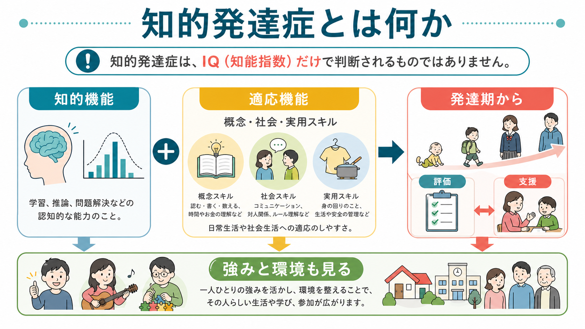
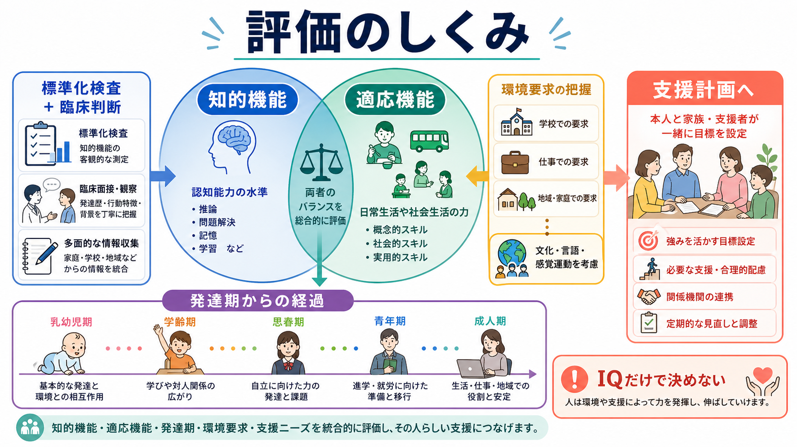
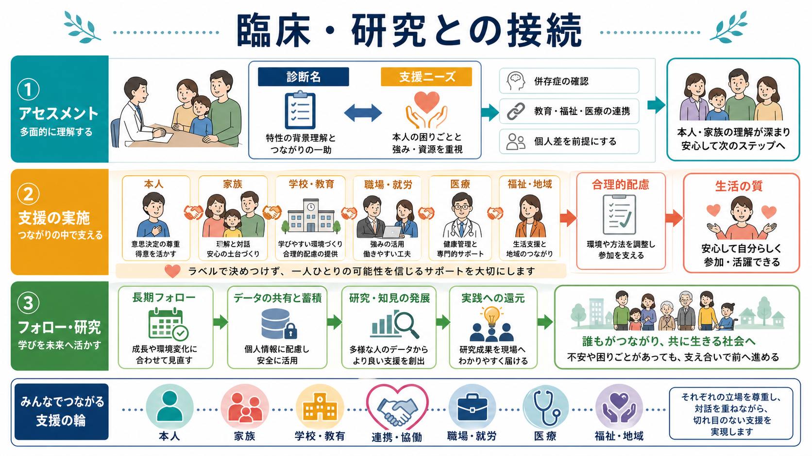

# 知的発達症とは何か

## 要点

- 知的発達症は、知的機能と適応機能の両方に有意な制限があり、それが発達期からみられる状態である[1][2]。
- 診断は IQ だけでは決まらない。概念的スキル、社会的スキル、実用的スキルを含む日常生活上の適応を、標準化検査と臨床判断で総合する[1][3]。
- 原因は単一ではなく、遺伝・染色体、胎児期・周産期、感染、代謝、外傷、環境要因などが関わり、原因が明確でない例も多い[4][7]。
- 支援の焦点は「欠けている能力の分類」ではなく、本人の強み、環境要求、合理的配慮、教育・福祉・医療の連携を通じて生活参加を広げることである[3][6]。

## この記事で答える問い

1. 知的発達症は、どのような状態として定義されるのか。
2. なぜ IQ だけでなく適応機能を見る必要があるのか。
3. 臨床評価、支援、研究では何が重要になるのか。

## まず結論

知的発達症は、「知能が低い」という単純なラベルではない。中心にあるのは、推理、問題解決、学習などの知的機能の制限と、日常生活・対人関係・安全管理・学業や仕事などに必要な適応機能の制限が、発達期から一貫して生活上の支援ニーズとして現れることである[1][2]。

そのため評価では、検査得点、発達歴、家庭・学校・職場での実際の機能、文化・言語、感覚運動、併存症、環境要求を合わせて見る。[[DSMとICDは何が違うのか|DSMとICD]] は分類の道具だが、分類名だけで支援は決まらない。診断名は、本人に合った学び方、意思決定支援、生活技能支援、環境調整、権利擁護につなげるための入口として使う必要がある。

## 背景

DSM-5-TR では intellectual disability、括弧つきで intellectual developmental disorder という表現が用いられる。日本語では「知的発達症」「知的能力障害」などの訳語が使われることがある。ICD-11 では neurodevelopmental disorders の中に「disorders of intellectual development」が置かれ、病因の異なる複数の状態を含む発達期発症の障害群として整理される[1][2]。

歴史的には、知的障害は IQ の閾値を中心に理解されがちだった。しかし現代の診断体系では、知的機能の測定だけでなく、本人が実際の環境の中でどのような支援を必要とするかが重視される。AAIDD も、知的機能と適応行動の有意な制限、発達期からの起源、文化・言語・感覚運動の考慮、強みと支援ニーズの把握を強調している[3]。

疫学的には、人口ベース研究のメタ解析で知的障害の有病率はおよそ 10.37/1000、つまり約 1% と推定されている。ただし推定値は、年齢、国・地域、調査方法、診断基準、標準化検査の利用可能性によって大きく変わる[5]。

## 基本概念

### 知的機能

知的機能とは、学習、推理、問題解決、抽象化、計画、判断、経験からの学習などに関わる一般的な認知能力である[1][3]。標準化された知能検査は重要な情報を与えるが、検査得点はその日の体調、言語、文化、教育機会、感覚・運動機能、不安、注意、検査への慣れにも影響される。

### 適応機能

適応機能とは、日常生活で学習され実行されるスキルのまとまりである。AAIDD は、適応行動を概念的スキル、社会的スキル、実用的スキルに分けて説明する[3]。

| 領域 | 内容の例 | 評価で見ること |
|---|---|---|
| 概念的スキル | 言語、読み書き、数、時間、お金、自己管理 | 学業だけでなく、予定理解や意思決定に使えるか |
| 社会的スキル | 対人関係、責任、ルール理解、だまされやすさ、社会的判断 | 年齢・文化に照らして安全に関係を作れるか |
| 実用的スキル | 身辺自立、健康、安全、移動、家事、職業、金銭管理 | 家庭・学校・職場・地域でどの支援が必要か |

### 発達期からの起源

知的発達症は、成人後に認知機能が低下する認知症や脳損傷とは区別される。ICD-11 でも、発達期に始まることが中核条件とされる[2]。ただし、軽度の場合は学齢期後半、青年期、成人期になってから支援ニーズが明確になることもある。

## 仕組み

知的発達症の「仕組み」は単一の脳部位や単一遺伝子で説明できるものではない。むしろ、脳発達、遺伝、胎児期・周産期のリスク、代謝・感染、感覚運動、教育機会、家庭・地域環境が重なり、学習と適応の発達軌道に影響する状態として理解するのがよい[4][7]。

CDC は、発達障害の原因として、遺伝、妊娠中の健康・行動、出産時合併症、妊娠中または乳幼児期早期の感染、鉛などの環境毒性、低出生体重、早産などを挙げる。また、知的障害の既知の原因には、胎児性アルコールスペクトラム症、ダウン症候群や脆弱 X 症候群などの遺伝・染色体条件、妊娠中感染などが含まれる[7]。

重要なのは、原因がわかったとしても、それだけで本人の現在の生活機能や将来の支援が決まるわけではないことである。同じ病因でも発達軌道は多様であり、支援、教育、健康状態、併存症、社会的環境によって日常生活上の困難は変わる[2][4]。この見方は、[[発達精神病理学とは何か|発達精神病理学]] の「発達軌道と環境の相互作用を見る」という発想と近い。

## 図解

1枚目は、知的発達症を「知的機能」「適応機能」「発達期からの経過」「強みと環境」の関係として整理した。2枚目は、標準化検査、臨床面接、生活場面の情報を統合し、支援計画へつなげる評価の流れを示した。3枚目は、診断名と支援ニーズを区別しながら、本人・家族・学校・職場・医療・福祉が連携する全体像を示している。

## 臨床・研究との接続

### 評価は多面的に行う

臨床評価では、知能検査、適応行動尺度、発達歴、教育歴、医学的評価、家族や学校・職場からの情報を組み合わせる。感覚障害、運動障害、言語の違い、文化的背景、トラウマ、睡眠、てんかん、抑うつ、不安、[[ADHDとは何か|ADHD]]、[[ASDは脳ネットワークの違いとして理解できるのか|自閉スペクトラム症]] などが評価結果に影響するため、[[鑑別診断とは何か|鑑別診断]] と併存症評価が重要である[2][4]。

### 支援は生活機能を中心に組み立てる

支援では、本人が理解しやすい情報提示、選択肢を具体化した意思決定支援、生活技能の練習、学校や職場での合理的配慮、家族支援、地域資源の調整が中心になる。NICE は、困難行動を単なる問題行動としてではなく、 unmet need、つまり満たされていないニーズや環境との相互作用のサインとして理解し、本人・家族・支援者との協働、詳細な評価、心理社会的・環境的介入を重視している[6]。

### 研究では異質性を扱う

研究上は、知的発達症を一つの平均的な集団として扱うだけでは不十分である。病因、重症度、適応機能、言語、感覚運動、併存症、社会的支援、教育歴が大きく異なるため、サブタイプ、発達縦断、生活の質、参加、家族・地域との相互作用を含めた研究設計が必要になる[4][5]。

## よくある誤解

### IQ が低ければ自動的に知的発達症である

誤りである。IQ は重要な情報だが、診断には適応機能の制限と発達期からの起源が必要である。さらに検査が妥当か、文化・言語・感覚運動・教育機会がどう影響しているかを考える必要がある[1][2][3]。

### 知的発達症は学習できない状態である

誤りである。学習の速度、抽象度、般化のしにくさに支援が必要なことはあるが、多くの人は適切な教育、反復、視覚的手がかり、生活場面に結びついた練習によって技能を獲得する。支援の目標は、同年齢の平均に近づけることだけではなく、本人の生活参加と意思決定を広げることである[3][6]。

### 知的発達症と限局性学習症は同じである

異なる。[[限局性学習症とは何か|限局性学習症]] は、知的機能全体の制限ではなく、読み、書き、算数など特定の学習領域に持続的な困難がある状態である。知的発達症では、より全般的な知的機能と適応機能の制限が中心になる。ただし、学習上の困難が重なることはあるため、実際の評価では個別に確認する。

### 支援は子どもの時期だけ考えればよい

不十分である。知的発達症は発達期に始まるが、支援ニーズは成人期、高齢期まで変化しながら続く。進学、就労、対人関係、住まい、金銭管理、医療アクセス、加齢に伴う健康問題など、ライフステージごとの再評価が必要である[2][4]。

## 関連ノート

- [[DSMとICDは何が違うのか]]
- [[発達精神病理学とは何か]]
- [[ADHDとは何か]]
- [[ASDは脳ネットワークの違いとして理解できるのか]]
- [[限局性学習症とは何か]]
- [[鑑別診断とは何か]]

## 理解チェック

1. 知的発達症の診断で、知的機能だけでなく適応機能を見る理由は何か。
2. 適応機能の「概念的」「社会的」「実用的」スキルには、それぞれどのような例があるか。
3. IQ だけで診断や支援計画を決めると、どのような問題が起こりうるか。
4. 困難行動を「問題」ではなく「満たされていないニーズのサイン」と見ると、支援方針はどう変わるか。

## 関連ノート候補

- 知能検査とは何か
- 適応行動尺度とは何か
- 意思決定支援とは何か
- 合理的配慮とは何か
- ダウン症候群とは何か
- 脆弱X症候群とは何か

## MOC更新候補

- `content/00_MOC/MOC｜精神医学.md`
- `content/00_MOC/MOC｜発達・愛着・社会心理.md`
- `content/00_MOC/MOC｜臨床心理学.md`

## 未解決問題

- 知的発達症の多様な病因と生活機能を、支援計画にどう個別化して反映できるか。
- 標準化検査が文化・言語・感覚運動の違いを十分に扱えない場合、どのような臨床判断が妥当か。
- 成人期・高齢期の知的発達症における健康格差、医療アクセス、意思決定支援をどう改善できるか。
- 本人の主観的な生活の質と、家族・支援者が観察する機能評価をどう統合するか。

## 参考文献

[1] American Psychiatric Association. (2022). *Diagnostic and Statistical Manual of Mental Disorders, Fifth Edition, Text Revision (DSM-5-TR)*. American Psychiatric Association Publishing. https://doi.org/10.1176/appi.books.9780890425787

[2] World Health Organization. (2026). *ICD-11 for Mortality and Morbidity Statistics: 6A00 Disorders of intellectual development*. https://icd.who.int/browse/2026-01/mms/en#605267007

[3] American Association on Intellectual and Developmental Disabilities. (2026). *Defining Criteria for Intellectual Disability*. https://www.aaidd.org/intellectual-disability/definition

[4] Patel, D. R., Cabral, M. D., Ho, A., & Merrick, J. (2020). A clinical primer on intellectual disability. *Translational Pediatrics, 9*(Suppl 1), S23-S35. https://doi.org/10.21037/tp.2020.02.02

[5] Maulik, P. K., Mascarenhas, M. N., Mathers, C. D., Dua, T., & Saxena, S. (2011). Prevalence of intellectual disability: A meta-analysis of population-based studies. *Research in Developmental Disabilities, 32*(2), 419-436. https://doi.org/10.1016/j.ridd.2010.12.018

[6] National Institute for Health and Care Excellence. (2015). *Challenging behaviour and learning disabilities: prevention and interventions for people with learning disabilities whose behaviour challenges* (NICE guideline NG11). https://www.nice.org.uk/guidance/ng11

[7] Centers for Disease Control and Prevention. (2026). *Developmental Disability Basics*. https://www.cdc.gov/child-development/about/developmental-disability-basics.html
