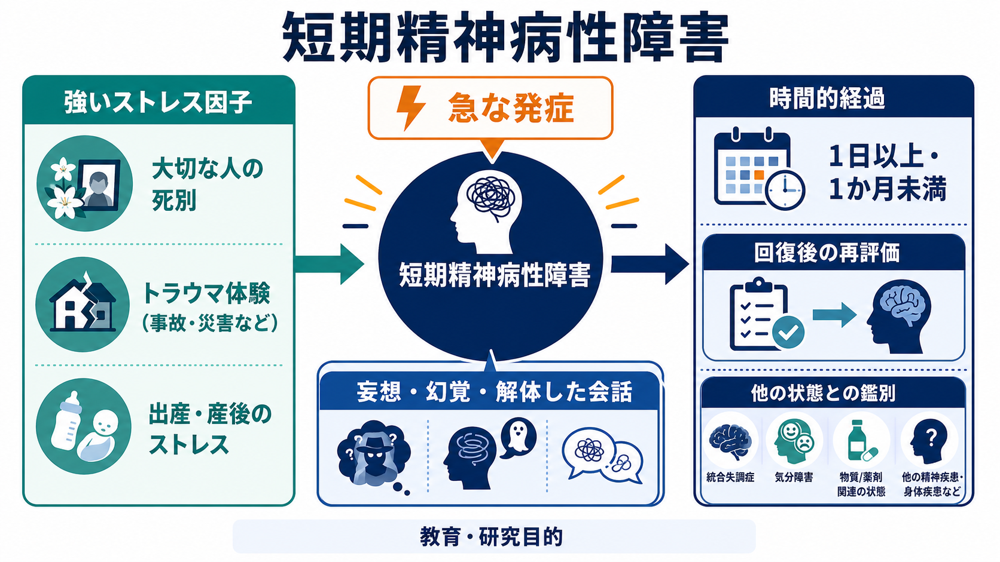
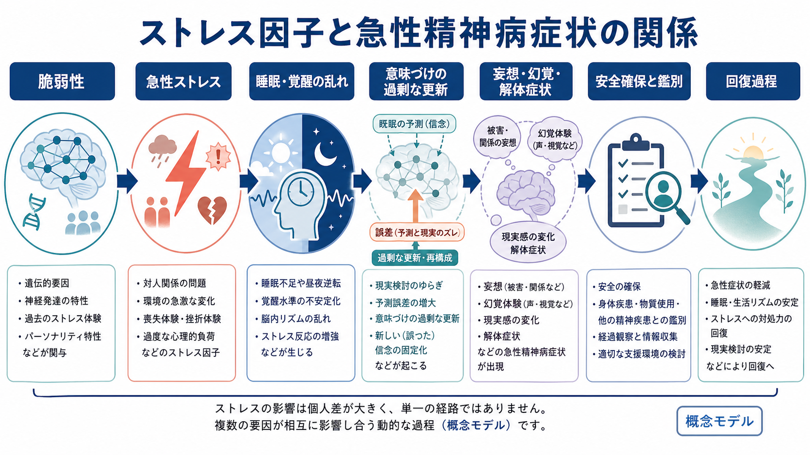
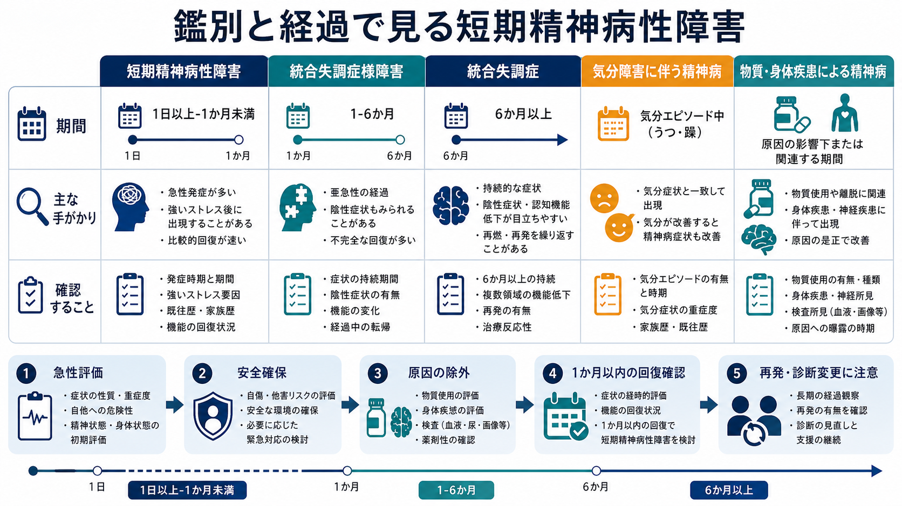

# 短期精神病性障害とは何か

## 要点

- 短期精神病性障害は、[[妄想とは何か]]、[[幻覚とは何か]]、解体した会話、著しく解体した行動または[[カタトニアとは何か]]が急に出現し、1日以上1か月未満で、病前の機能水準へ戻ることを要する診断概念である[1]。
- 「短い精神病」そのものではなく、物質、身体疾患、[[せん妄とは何か]]、気分エピソードに伴う精神病、より長く続く統合失調症スペクトラムの病態を除外しながら、経過で確認する診断である[2][3]。
- 強いストレス因子の後に起こる場合は、DSM 系では「顕著なストレス因子を伴う」短期精神病性障害、伝統的には短期反応性精神病と呼ばれる[1][2]。
- ICD-11 の「急性一過性精神病性障害」は近い概念だが、最大重症度に2週間以内で達すること、症状が急速に変動すること、エピソードが3か月を超えないことを重視するため、DSM の短期精神病性障害と完全には一致しない[4]。
- 多くは回復しうるが、再発や後の診断変更があるため、「治ったら終わり」ではなく経過観察と再評価が重要である[5]。

## この記事で答える問い

短期精神病性障害は、「一時的に精神病症状が出る病気」とだけ理解すると誤解しやすい。この記事では、何が短期精神病性障害を定義するのか、ストレス因子はどのように関わるのか、どの病態と鑑別するのか、そして研究上どこまで分かっていて何が未解決なのかを整理する。

## まず結論

短期精神病性障害の中核は、症状の種類よりも「急性発症」「短い持続」「回復」「他の原因では説明しにくい」という経過の組み合わせにある。症状だけを見ると、[[被害妄想とは何か]]、[[関係妄想とは何か]]、[[幻聴とは何か]]、[[滅裂思考とは何か]]、興奮、昏迷などが統合失調症スペクトラムや気分障害、物質関連、身体疾患でも起こりうるため、初診時に完全な確定診断を置くことは難しい[2][3]。

臨床的には、急性期の安全確保、身体・物質・気分症状の評価、文化的文脈の確認、1か月以内の回復確認、そして再発や診断変更への注意を分けて考える必要がある。この記事は教育・研究目的の解説であり、個別の診断や治療指示ではない。

## 背景

精神病症状とは、現実検討の変化を伴う [[妄想とは何か]]、[[幻覚とは何か]]、解体した思考・会話、著しく解体した行動、緊張病性の運動症状などを指す。短期精神病性障害は、これらの症状が急に出現し、短期間で収束する一群を記述する診断である[1][2]。

この概念が重要なのは、精神病症状の初発時点では、長期の統合失調症スペクトラム障害、気分障害に伴う精神病、物質誘発性精神病、身体疾患による精神病、[[せん妄とは何か]]を、症状だけで直ちに分けられないからである。短期精神病性障害は、発症時の断面像ではなく、その後の時間経過と回復を含めて理解する必要がある[3]。

## 基本概念

DSM-5-TR では、短期精神病性障害は統合失調症スペクトラムおよび他の精神病性障害群に含まれる。診断上は、妄想、幻覚、解体した会話、著しく解体した行動または緊張病性行動のうち少なくとも1つがあり、少なくとも1つは妄想・幻覚・解体した会話のいずれかであることが求められる[1]。

期間は1日以上1か月未満で、最終的には病前の機能水準へ戻る必要がある。このため、同じ精神病症状でも、1か月を超えれば短期精神病性障害から外れ、統合失調症様障害や統合失調症など別の診断枠組みを検討することになる[2][3]。

また、DSM では次の指定が重要である[1][3]。

| 指定 | 意味 |
|---|---|
| 顕著なストレス因子を伴う | ほとんどの人にとって著しくストレスフルと考えられる出来事の後に発症する |
| 顕著なストレス因子を伴わない | 明確な強いストレス因子が同定されない |
| 産後発症 | 産後の一定期間に精神病症状が出現する |
| カタトニアを伴う | 緊張病性の運動症状が前景に出る |

ただし、ストレス因子があることは「心理的に説明できるから軽い」という意味ではない。強いストレス、睡眠不足、喪失、移住、災害、出産などは発症の文脈を理解する手がかりにはなるが、症状の重症度や安全性評価を軽視する理由にはならない。

## 仕組み

短期精神病性障害に固有の単一メカニズムは確立していない。現時点では、脆弱性、急性ストレス、睡眠・覚醒リズムの乱れ、ドパミン系を含むサリエンス処理、予測誤差処理、認知的評価の偏りが重なって、短時間に精神病症状が形成されるという多因子モデルで考えるのが妥当である[3][7][8]。

[[ストレス脆弱性モデルとは何か]]の観点では、もともとの生物学的・心理社会的脆弱性に、急性ストレスや睡眠不足が重なると、通常なら無視される刺激や内的体験に過剰な意味が与えられやすくなる。[[ドパミン仮説は統合失調症をどこまで説明できるのか]]で扱われる「異常なサリエンス」の仮説は、無関係な出来事が「自分に関係している」「何かの合図である」と感じられる過程を説明する候補である[7][8]。

ただし、この説明は短期精神病性障害だけを説明する専用モデルではない。統合失調症、臨床的高リスク状態、薬物誘発性精神病、気分障害に伴う精神病とも部分的に重なる。したがって、短期精神病性障害を「ストレスでドパミンが乱れる病気」と単純化するのではなく、急性発症と回復を含む臨床経過を説明する作業仮説として扱うべきである。

## 図解

短期精神病性障害を図式化すると、次のような流れになる。

| 段階 | 見るべき点 | 記事内の関連概念 |
|---|---|---|
| 急な発症 | 非精神病状態から明らかな精神病状態への急変 | 急性発症、1日以上 |
| 症状の確認 | 妄想、幻覚、解体した会話、解体行動、カタトニア | [[妄想とは何か]]、[[幻覚とは何か]]、[[カタトニアとは何か]] |
| 文脈の確認 | 喪失、災害、移住、出産、睡眠不足、対人ストレス | [[ストレス脆弱性モデルとは何か]] |
| 鑑別 | せん妄、物質、身体疾患、気分障害、長期化する精神病 | [[せん妄とは何か]]、[[DSMとICDは何が違うのか]] |
| 経過の確認 | 1か月未満で病前水準へ戻るか | 再評価、診断変更 |

## 臨床・研究との接続

臨床では、まず安全性と鑑別が優先される。NICE の精神病・統合失調症ガイドラインは、精神病症状をもつ人の評価では、精神症状だけでなく、自傷他害リスク、アルコール・薬物、処方薬、身体疾患、身体診察、心理社会的背景、発達歴、生活機能を含む多面的評価を推奨している[6]。これは短期精神病性障害に限らず、急性精神病を扱う際の基本である。

研究上は、短期精神病性障害、ICD の急性一過性精神病性障害、超高リスク状態での短い精神病エピソードなど、似た構成概念が複数あることが問題になる。Fusar-Poli らのメタ解析は、短い精神病エピソード群は寛解した初発統合失調症より長期予後が良い傾向を示す一方、BPD、ATPD、BLIPS、BIPS の間では予後差が明確ではなく、診断概念間の整合性が研究上の課題だと論じている[5]。

## よくある誤解

**誤解1: 1か月未満なら軽い。**  
期間が短いことと急性期の危険性は別である。精神病症状は短期間でも本人や周囲の安全、生活機能、身体状態に大きく影響しうる。

**誤解2: ストレス因子があれば心理的反応なので精神病ではない。**  
強いストレスの後に発症しても、妄想、幻覚、解体症状が明確であれば精神病症状として評価される。ストレス因子は原因を単純に決めるものではなく、発症の文脈を理解する情報である[1][2]。

**誤解3: 回復したら診断は固定される。**  
短期精神病性障害は回復を要件に含むが、再発や後の診断変更がありうる。1回の急性エピソードの後も、症状の再燃、気分症状、物質使用、身体疾患、認知機能、生活機能を時間をかけて見る必要がある[3][5]。

**誤解4: ICD-11 の急性一過性精神病性障害と同じである。**  
近縁概念ではあるが、ICD-11 では2週間以内に最大重症度へ達する急性発症、症状の急速な変動、3か月以内の持続という枠組みがあり、DSM の1か月未満という基準とは一致しない[4]。

## 関連ノート

- [[妄想とは何か]]
- [[幻覚とは何か]]
- [[幻聴とは何か]]
- [[滅裂思考とは何か]]
- [[カタトニアとは何か]]
- [[せん妄とは何か]]
- [[ストレス脆弱性モデルとは何か]]
- [[DSMとICDは何が違うのか]]
- [[ドパミン仮説は統合失調症をどこまで説明できるのか]]
- [[妄想は予測誤差処理の異常として説明できるのか]]

MOC 更新候補: `MOC｜精神医学.md`、`MOC｜症候学.md`、`MOC｜総論・診断・面接.md`

## 理解チェック

1. 短期精神病性障害で「1日以上1か月未満」という期間基準は、どの鑑別に役立つか。
2. 顕著なストレス因子を伴う場合でも、なぜ物質・身体疾患・せん妄の除外が必要なのか。
3. ICD-11 の急性一過性精神病性障害と DSM の短期精神病性障害は、どの点で似ていて、どの点で異なるか。
4. 「異常なサリエンス」仮説は、妄想や幻覚のどの側面を説明しようとするモデルか。

## 未解決問題

- 短期精神病性障害と、後に統合失調症スペクトラム障害や気分障害へ診断変更される症例を、初期段階でどこまで区別できるか。
- 強いストレス因子、睡眠障害、産後、物質使用、文化的背景がどのように相互作用して短期の精神病エピソードを生むのか。
- DSM の短期精神病性障害、ICD-11 の急性一過性精神病性障害、臨床的高リスク研究における短い精神病エピソードを、研究上どのように対応づけるべきか。

## 参考文献

[1] American Psychiatric Association. (2022). *Diagnostic and Statistical Manual of Mental Disorders, Fifth Edition, Text Revision (DSM-5-TR)*. American Psychiatric Association Publishing. https://doi.org/10.1176/appi.books.9780890425787

[2] Keshavan, M. S. (2025). Brief Psychotic Disorder. *Merck Manual Professional Edition*. https://www.merckmanuals.com/professional/psychiatric-disorders/schizophrenia-and-related-disorders/brief-psychotic-disorder

[3] Stephen, A., & Lui, F. (2023). Brief Psychotic Disorder. In *StatPearls*. StatPearls Publishing. https://www.ncbi.nlm.nih.gov/books/NBK539912/

[4] World Health Organization. (2026). ICD-11 MMS: 6A23 Acute and transient psychotic disorder. https://icd.who.int/browse/2026-01/mms/en#284410555

[5] Fusar-Poli, P., Cappucciati, M., Bonoldi, I., Hui, L. M. C., Rutigliano, G., Stahl, D. R., Borgwardt, S., Politi, P., Mishara, A. L., Lawrie, S. M., Carpenter, W. T. Jr., & McGuire, P. (2016). Prognosis of Brief Psychotic Episodes: A Meta-analysis. *JAMA Psychiatry, 73*(3), 211-220. https://doi.org/10.1001/jamapsychiatry.2015.2313

[6] National Institute for Health and Care Excellence. (2014, updated 2014; reviewed 2025). *Psychosis and schizophrenia in adults: prevention and management* (CG178). https://www.nice.org.uk/guidance/cg178

[7] Howes, O. D., & Nour, M. M. (2016). Dopamine and the aberrant salience hypothesis of schizophrenia. *World Psychiatry, 15*(1), 3-4. https://doi.org/10.1002/wps.20276

[8] Howes, O. D., Hird, E. J., Adams, R. A., Corlett, P. R., & McGuire, P. (2020). Aberrant Salience, Information Processing, and Dopaminergic Signaling in People at Clinical High Risk for Psychosis. *Biological Psychiatry, 88*(4), 304-314. https://doi.org/10.1016/j.biopsych.2020.03.012
