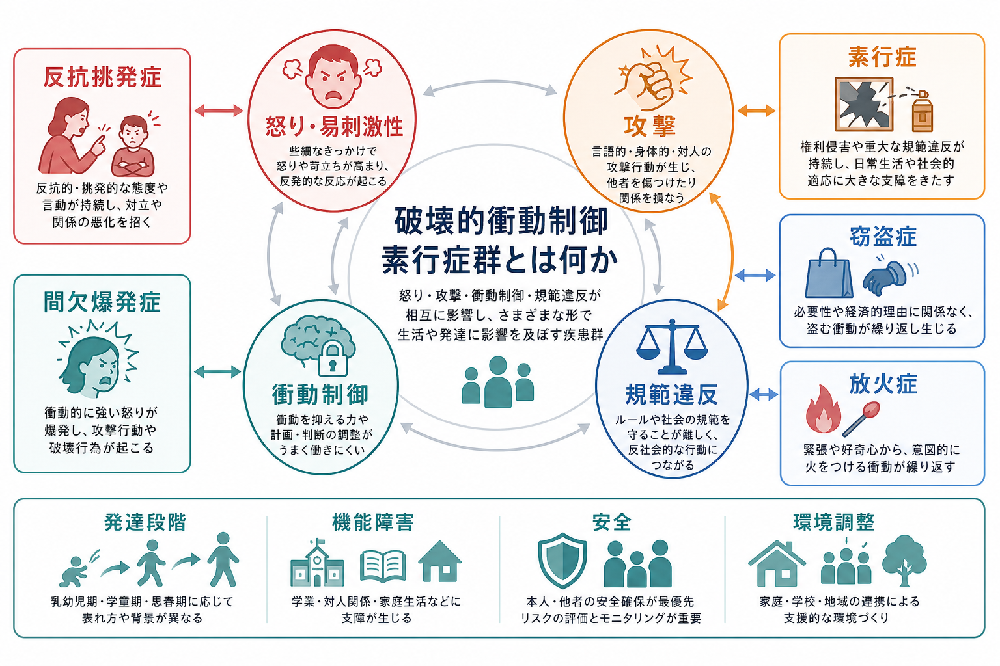
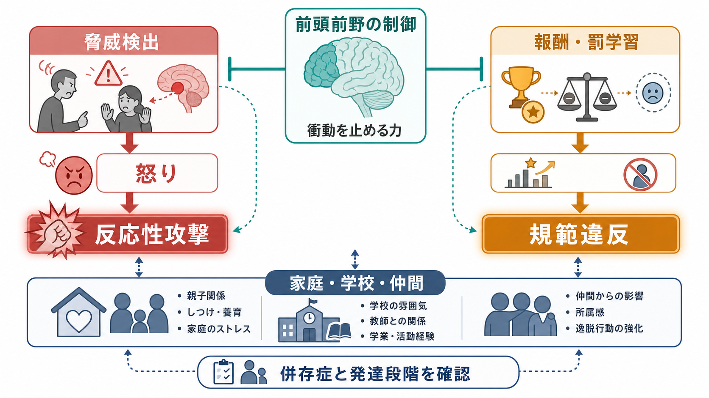
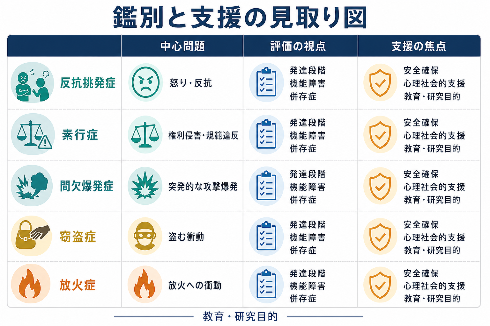

# 破壊的衝動制御素行症群とは何か

## 要点

- 破壊的衝動制御素行症群は、怒り、攻撃、衝動制御の困難、規範違反、他者の権利侵害が前景に出る疾患群である。
- DSM-5-TRでは、[[反抗挑発症とは何か]]、[[素行症とは何か]]、[[間欠爆発症とは何か]]、[[窃盗症とは何か]]、[[放火症とは何か]]、反社会性パーソナリティ障害などが同じ章に置かれる[1]。
- ICD-11では「破壊的行動症または非社会的行動症群」に近いまとまりとして、反抗挑発症や素行・反社会的行動症が整理される[2]。
- 評価では、症状名よりも、発達段階、持続性、複数場面での再現性、機能障害、併存症、安全リスク、家庭・学校・仲間関係の文脈を同時に見る[3][4]。
- 支援は「罰を強める」ことではなく、安全確保、関係性の再構築、親・養育者支援、学校支援、心理社会的介入、併存症への対応を組み合わせる[4][5]。

## この記事で答える問い

この記事では、破壊的衝動制御素行症群を「乱暴な子」「反抗的な人」という道徳的ラベルではなく、感情制御、行動制御、社会的学習、発達環境の相互作用として理解する。中心の問いは次の3つである。

1. どの疾患がこの群に含まれ、何が共通しているのか。
2. 怒り・攻撃・規範違反は、どのような心理・神経・環境要因で維持されるのか。
3. 臨床や研究では、診断名だけでなく何を評価すべきか。

## まず結論

破壊的衝動制御素行症群は、「困った行動の一覧」ではなく、外に向かって表れる情動・行動制御の問題を扱う分類である。共通するのは、本人の苦痛だけでなく、他者、家庭、学校、地域社会にも影響が及ぶ点である。したがって、診断や支援では、本人の内的状態、他者への影響、危険性、環境との相互作用を分けて評価する必要がある[3][4]。

ただし、この分類に含まれる疾患は一枚岩ではない。[[反抗挑発症とは何か]]では怒りや反抗、[[素行症とは何か]]では権利侵害や重大な規範違反、[[間欠爆発症とは何か]]では突発的で不釣り合いな攻撃爆発、[[窃盗症とは何か]]や[[放火症とは何か]]では特定行為への衝動制御困難が中心になる[1]。同じ「攻撃」でも、脅威に反応して爆発する反応性攻撃と、目的達成のために使われる道具的攻撃では、背景メカニズムも支援の焦点も異なる[6][7]。

## 背景

この疾患群が重要なのは、症状が本人の中だけで完結しにくいからである。怒りの爆発、反抗、暴力、盗み、放火、重大な規則違反は、家族、同級生、教師、地域社会に現実の被害や不安を生む。そのため、臨床では本人の診断だけでなく、被害を受ける人の安全、虐待・搾取の有無、学校や福祉との連携、法的・倫理的問題まで含めて扱う[4]。

一方で、この領域はスティグマを生みやすい。行動だけを見ると「性格が悪い」「親のしつけが悪い」と短絡されやすいが、研究上は、発達特性、情動調整、報酬・罰学習、家庭環境、トラウマ、貧困、仲間関係、併存する[[ADHDとは何か]]や[[自閉スペクトラム症とは何か]]などが複雑に関与する[3][4][6]。教育・研究目的でこの群を学ぶときは、責任追及ではなく、リスクと保護因子を分けて見る視点が要になる。

## 基本概念

### 何が共通しているのか

DSM-5-TRのこの章は、感情と行動の自己制御の問題が、他者の権利侵害、社会規範との衝突、攻撃、破壊、盗み、放火などとして現れる疾患群をまとめている[1]。共通点は、内面の不安や抑うつが主に自分の内側へ向かうというより、行動として外部に表れやすい点である。

しかし、共通点だけでまとめると粗くなる。[[反抗挑発症とは何か]]では、怒りっぽさ、口論、挑発、執念深さが中心であり、重大な権利侵害までは必須ではない。[[素行症とは何か]]では、人や動物への攻撃、所有物の破壊、虚偽や窃盗、重大な規則違反が反復する。[[間欠爆発症とは何か]]では、計画的な利益獲得よりも、衝動的で不釣り合いな攻撃爆発が中心である。[[窃盗症とは何か]]と[[放火症とは何か]]では、それぞれ盗む衝動、火をつける衝動への抵抗困難が主題となる[1]。

### DSMとICDの違い

DSM-5-TRは「破壊的・衝動制御・素行症群」という章を設け、反社会性パーソナリティ障害もこの章で扱う[1]。一方、ICD-11では、子ども・青年期の反抗挑発症や素行・反社会的行動症を「破壊的行動症または非社会的行動症群」として整理する[2]。名称や配置は違っても、臨床上の核は、発達段階を踏まえて、怒り、攻撃、規範違反、機能障害、安全リスクを評価する点にある。

## 仕組み

この群を理解するには、少なくとも3つの経路を分けるとよい。

1. 脅威・怒り経路  
   相手の行動を敵意として受け取りやすい、拒否や罰に過敏に反応する、感情が高ぶったあとに止まりにくい、といった経路である。この場合、攻撃は「反応性攻撃」として生じやすい[6][7]。

2. 報酬・罰学習経路  
   短期的な利益や興奮が強く、長期的な損失や他者の苦痛から学びにくい場合、規範違反や道具的攻撃が維持されやすい。素行症、とくに「向社会的情動の限局」指定を伴う場合には、共感、罪悪感、罰学習、価値判断の偏りが研究対象になっている[6]。

3. 実行機能・環境経路  
   衝動を止める、別の行動を選ぶ、遅延報酬を待つ、相手の視点を読む、といった機能は、家庭・学校・仲間関係の中で学習される。[[ADHDとは何か]]、学習困難、言語の問題、睡眠不足、虐待、物質使用、家庭内葛藤があると、同じ症状でも維持要因が変わる[3][4]。

神経科学的には、扁桃体を含む脅威処理、線条体や腹内側前頭前野を含む報酬・罰学習、前頭前野による行動制御がよく議論される[6]。ただし、これは「脳の異常だけで説明できる」という意味ではない。脳、行動、家庭、学校、社会的経験は相互に影響し合うため、評価も支援も多層的である必要がある。

## 図解

次の図は、疾患名ごとの焦点を比較するための見取り図である。診断名は出発点にすぎず、実際には「何が、どの場面で、どの程度、誰にどんな影響を与えているか」を評価する。

| 疾患・状態 | 中心になりやすい問題 | 評価で見る点 |
|---|---|---|
| [[反抗挑発症とは何か]] | 怒り、反抗、挑発、執念深さ | 家庭・学校での持続性、相手がきょうだいだけでないか、機能障害 |
| [[素行症とは何か]] | 攻撃、破壊、虚偽、窃盗、重大な規則違反 | 他者の権利侵害、安全リスク、発症年齢、向社会的情動 |
| [[間欠爆発症とは何か]] | 急激で不釣り合いな攻撃爆発 | 計画性の有無、物質・医学的要因、躁状態や精神病症状との鑑別 |
| [[窃盗症とは何か]] | 必要性や金銭目的だけでは説明しにくい盗む衝動 | 反復性、緊張と解放感、素行症や反社会性との違い |
| [[放火症とは何か]] | 火への関心と放火衝動 | 意図、動機、安全リスク、精神病症状・物質使用・犯罪目的との鑑別 |

## 臨床・研究との接続

評価では、最初に安全を確認する。本人や他者への危害、虐待、搾取、自傷、放火、武器、物質使用、家庭内暴力がある場合、診断名の精密化よりも安全計画と多職種連携が優先される[4]。

次に、症状を「頻度」「持続期間」「場面」「発達段階」「機能障害」に分解する。たとえば幼児期のかんしゃくは珍しくないが、年齢から見て過度で、家庭・学校・仲間関係に支障があり、複数場面で持続するなら評価の意味が変わる。NICEは、素行症が疑われる子ども・若者では、家庭・学校・仲間での機能、養育の質、併存する精神・身体疾患、ADHDや自閉スペクトラム症、学習困難、物質使用などを包括的に評価することを推奨している[4]。

支援では、年少児の反抗挑発症・素行症リスクに対して、親訓練や養育者支援が重要な位置を占める。Cochraneレビューでは、3から12歳の早期発症の行為問題に対する行動療法的・認知行動療法的な集団親プログラムが、短期的には子どもの行為問題、親のメンタルヘルス、肯定的養育スキルを改善することが示されている[5]。ただし、効果は平均的な傾向であり、個別の治療方針は専門家による評価に基づく。

研究面では、診断名だけでなく、反応性攻撃、道具的攻撃、向社会的情動の限局、慢性的易刺激性、報酬感受性、罰感受性、実行機能、トラウマ歴、家庭環境などの次元で測る方向が重要である[3][6]。これは、同じ「素行症」という診断でも、支援に反応しやすい経路が異なる可能性があるからである。

## よくある誤解

### 「反抗挑発症は、単なる反抗期である」

反抗や口答えは発達過程でよく見られる。しかし診断で問題になるのは、年齢・文化・文脈から見て過度で、持続し、家庭・学校・対人関係に支障を生むパターンである[1][3]。

### 「素行症は、将来必ず反社会性パーソナリティ障害になる」

素行症は成人期の[[反社会性パーソナリティ障害とは何か]]のリスク因子になりうるが、すべてがその経過をたどるわけではない。発症年齢、向社会的情動、併存症、環境、介入へのアクセスによって経過は異なる[6]。

### 「攻撃行動はすべて同じメカニズムで起こる」

反応性攻撃は脅威やフラストレーションへの爆発的反応として、道具的攻撃は目的達成の手段として理解されることが多い[7]。この違いを無視すると、怒りの調整が必要なケースと、報酬・罰学習や共感・規範学習が焦点になるケースを混同しやすい。

### 「厳罰化すれば改善する」

安全確保は不可欠だが、罰だけでは維持要因を変えにくい。親訓練、学校での問題解決学習、心理社会的支援、併存症治療、生活環境の安定化を組み合わせる必要がある[4][5]。

## 関連ノート

- [[反抗挑発症とは何か]]
- [[素行症とは何か]]
- [[間欠爆発症とは何か]]
- [[窃盗症とは何か]]
- [[放火症とは何か]]
- [[ADHDとは何か]]
- [[自閉スペクトラム症とは何か]]
- [[反社会性パーソナリティ障害とは何か]]
- [[双極性障害とは何か]]
- [[PTSDとは何か]]

MOC更新候補: `content/00_MOC/` 配下の精神医学・児童精神医学・疾患群関連MOCがある場合に、本記事へのリンクを追加する。

## 理解チェック

1. 反抗挑発症と素行症は、どちらも対人摩擦を生むが、どの点で重症度や焦点が異なるか。
2. 同じ攻撃行動でも、反応性攻撃と道具的攻撃を分けると、評価や支援の見方はどう変わるか。
3. 診断名を付ける前に、安全、併存症、家庭・学校環境を確認する理由は何か。
4. 親訓練や学校支援は、本人を責めるためではなく、どのような学習環境を作るために行われるのか。

## 参考文献

[1] American Psychiatric Association. (2022). *Diagnostic and Statistical Manual of Mental Disorders, Fifth Edition, Text Revision (DSM-5-TR)*. American Psychiatric Association Publishing. https://doi.org/10.1176/appi.books.9780890425787

[2] World Health Organization. (2025). *ICD-11 for Mortality and Morbidity Statistics: 2025-01 release*. https://icd.who.int/browse/2025-01/mms/en

[3] Burke, J. D., Butler, E. J., Shaughnessy, S., Karlovich, A. R., & Evans, S. C. (2024). Evidence-Based Assessment of DSM-5 Disruptive, Impulse Control, and Conduct Disorders. *Assessment, 31*(1). https://doi.org/10.1177/10731911231188739

[4] National Institute for Health and Care Excellence. (2013, updated 2017; reviewed 2025). *Antisocial behaviour and conduct disorders in children and young people: recognition and management* (CG158). https://www.nice.org.uk/guidance/cg158

[5] Furlong, M., McGilloway, S., Bywater, T., Hutchings, J., Smith, S. M., & Donnelly, M. (2012). Behavioural and cognitive-behavioural group-based parenting programmes for early-onset conduct problems in children aged 3 to 12 years. *Cochrane Database of Systematic Reviews*, CD008225. https://doi.org/10.1002/14651858.CD008225.pub2

[6] Blair, R. J. R., Leibenluft, E., & Pine, D. S. (2014). Conduct disorder and callous-unemotional traits in youth. *New England Journal of Medicine, 371*(23), 2207-2216. https://doi.org/10.1056/NEJMra1315612

[7] Blair, R. J. R. (2001). Neurocognitive models of aggression, the antisocial personality disorders, and psychopathy. *Journal of Neurology, Neurosurgery & Psychiatry, 71*(6), 727-731. https://doi.org/10.1136/jnnp.71.6.727

## 未解決問題

- DSMとICDで章立てや用語が異なるため、日本語記事内でどの訳語を標準表記にするかは継続的に整理が必要である。
- 向社会的情動の限局、慢性的易刺激性、反応性攻撃、道具的攻撃を、日常臨床でどの程度安定して測定できるかは今後の課題である。
- 脳画像や認知課題の知見は有用だが、現時点では個人の診断や治療選択を単独で決める検査として扱うべきではない。
