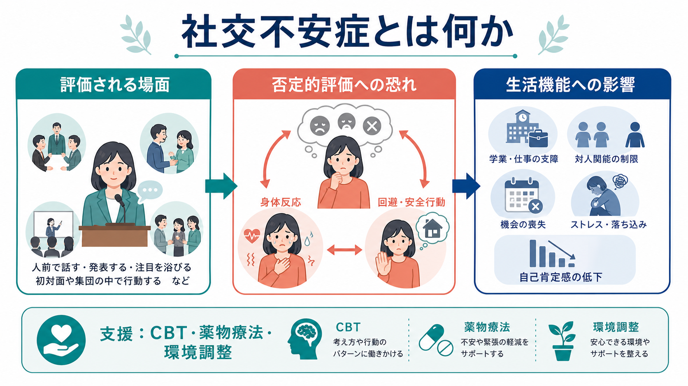

# 社交不安症とは何か

## 要点

- 社交不安症は、人前で話す、初対面の人と会う、会議や授業で発言する、食事や作業を見られるなど、他者から評価されうる場面への強い恐れと回避を中心とする[[不安とは何か|不安症]]である。
- 中心にあるのは「恥をかくかもしれない」「変に見られるかもしれない」「拒絶されるかもしれない」という否定的評価への恐れであり、単なる内向性や性格傾向とは区別される[1][2]。
- 恐れている場面を避けるほど短期的には楽になるが、長期的には「避けないと危険だった」という学習が残り、[[回避行動とは何か|回避行動]]と安全行動が症状を維持しやすい[5]。
- 研究上は、認知行動モデル、恐怖回路、自己注目、社会的評価処理をつなぐ疾患として理解される[5][6]。
- 臨床では、個別診断や治療指示ではなく、症状の持続、苦痛、生活機能への影響、併存症、本人の価値や環境を含めて評価する必要がある[2][3]。

## この記事で答える問い

1. 社交不安症は「恥ずかしがり」や「人見知り」と何が違うのか。
2. なぜ不安な場面を避けるほど、不安が続きやすくなるのか。
3. 認知行動療法や薬物療法は、どの維持因子に働きかけるのか。
4. 神経科学・心理学研究では、社交不安症をどのように捉えるのか。

## まず結論

社交不安症は、社会的場面そのものよりも、「その場面で自分が否定的に評価される」という予測に強く反応する病態である。本人は失敗、震え、赤面、沈黙、視線、声の震えなどを過大に監視し、それがさらに不安を高める。回避や安全行動は一時的に不安を下げるが、実際には「恐れていた結果が起きないかもしれない」という学習機会を減らすため、長期的には症状を固定しやすい[5]。

## 背景

社交不安症は、かつて「社会恐怖」や「社交恐怖」と呼ばれていた概念を含む。現在の診断体系では、他者から観察・評価される可能性のある社会的場面に対する持続的な恐れ、回避、または強い苦痛が、本人の生活機能を損なう場合に問題となる[3]。米国の疫学データでは、成人の過去1年有病率は約7.1%、生涯有病率は約12.1%と報告されており、まれな困りごとではない[4]。

発症は小児期から青年期に始まることが多い。青年期は、同年代からの評価、所属、自己像が急速に重要になる時期であり、社交不安は学業、友人関係、進路選択に影響しやすい[5]。また、[[うつ病とは何か|うつ病]]、物質使用、他の不安症との併存が問題になることもあるため、「人前が苦手」という表面だけでなく、持続期間、苦痛、回避の広がり、生活上の損失を見ていく必要がある[8]。

## 基本概念

社交不安症の中核は、社会的場面での否定的評価への恐れである。典型的には、人前で話す、授業や会議で発言する、初対面の人と会う、店員に質問する、食事や書字を見られる、電話をかけるなどの場面で不安が高まる[1]。身体反応として、赤面、発汗、震え、動悸、声の震え、胃部不快、頭が真っ白になる感覚が出ることもある[1]。

診断上は、恐れが文化的文脈から見て過度であり、通常6か月以上持続し、社会的・職業的・学業的機能を妨げ、物質や身体疾患、他の精神疾患だけでは説明しきれないことが重視される[3]。したがって、社交不安症は「緊張しやすい人」全般を病気と呼ぶ概念ではない。病態として扱うかどうかは、苦痛と機能障害の大きさを含めて判断される。

## 仕組み

認知行動モデルでは、社交不安症は次のような悪循環として説明される[5]。

1. 社会的場面に入る前から、「失敗する」「変に思われる」と予測する。
2. 場面に入ると、相手や状況よりも、自分の表情、声、震え、赤面に注意が向く。
3. 身体感覚や不安感を「他人から見て明らかにおかしい証拠」と解釈する。
4. 視線を避ける、話す量を減らす、原稿を過剰に読む、目立たない席を選ぶなどの安全行動をとる。
5. その場はしのげても、「安全行動をしたから大丈夫だった」と学習され、次の場面でも不安が残る。

この悪循環は、[[予期不安とは何か|予期不安]]、自己注目、否定的自己イメージ、事後反すう、[[回避学習とは何か|回避学習]]が互いに補強する過程として理解できる。社交不安症の人は、他者の反応を直接観察するよりも、自分の内側の不安感を手がかりに「相手からどう見えたか」を推論しやすい。ここで[[メタ認知とは何か|メタ認知]]の偏りや[[認知バイアスとは何か|認知バイアス]]が関与する。

神経科学的には、社交不安症を単一部位の異常として見るよりも、社会的評価、脅威検出、身体感覚、注意制御、情動制御を担うネットワークの偏りとして見る方が近い。神経画像研究のメタ解析では、扁桃体、島皮質、前部帯状皮質、前頭前野などを含む恐怖・情動制御回路の過活動や結合変化が報告されている[6]。これは[[扁桃体過活動は不安症やPTSDにどう関わるのか|扁桃体過活動]]や[[前頭前野は情動制御にどう関わるのか|前頭前野による情動制御]]の研究と接続できる。

## 図解

上の2枚の図は、社交不安症を「評価場面、否定的評価への恐れ、身体反応、回避・安全行動、生活機能への影響」という流れで整理している。重要なのは、回避や安全行動が本人の弱さではなく、不安を下げるための合理的な対処として始まりうる点である。ただし、その対処が固定化すると、恐れている予測を検証する機会が減り、不安が維持される。

## 臨床・研究との接続

臨床では、社交不安症を「緊張をなくすべき状態」とだけ見ると狭すぎる。目標は不安をゼロにすることではなく、本人が重要だと思う学業、仕事、対人関係、生活上の行動を、不安があっても回復していくことである。NICE は、成人の社交不安症に対して、障害特異的な個人認知行動療法を中心的選択肢として位置づけている[2]。ネットワークメタ解析でも、心理療法、薬物療法、自助介入の効果が比較され、個人CBTや一部薬物療法に有効性が示されている[7]。

薬物療法では SSRI や SNRI が用いられることがあり、パフォーマンス場面に限局した身体症状にはβ遮断薬が検討されることもある[1][2]。ただし、薬物選択は併存症、身体疾患、年齢、妊娠可能性、副作用、本人の希望によって変わるため、この記事は個別の服薬判断を代替しない。

研究面では、社交不安症は[[社会的認知とは何か|社会的認知]]、自己像、情動制御、注意制御、発達、文化差を結ぶテーマである。特に、青年期の仲間関係、自閉スペクトラム症との鑑別・併存、ひきこもり、オンライン交流、職場での評価ストレスなどは、今後の応用的研究と臨床実践で重要になる。

## よくある誤解

**誤解1: 社交不安症は性格の問題である。**  
内向性や慎重さは性格特性であり、それ自体は病気ではない。社交不安症では、否定的評価への恐れと回避が持続し、本人の望む活動を妨げる点が問題になる[1][3]。

**誤解2: 人前に出せば自然に治る。**  
単なる暴露ではなく、恐れている予測、安全行動、注意の向き、事後反すうを扱う必要がある。無理な場面曝露は、かえって失敗経験として記憶されることがある。

**誤解3: 社交不安症は大人だけの問題である。**  
発症は青年期に多く、学校生活や友人関係に影響しやすい[5]。子どもや青年では、泣く、固まる、話せない、登校や発表を避けるといった形で現れることもある。

**誤解4: 不安があるなら能力が低い。**  
社交不安は能力の欠如を意味しない。むしろ「失敗してはいけない」「相手に悪く見られてはいけない」という基準が高く、自己監視が強すぎるために実力を出しにくくなる場合がある。

## 関連ノート

- [[不安とは何か]]
- [[予期不安とは何か]]
- [[回避行動とは何か]]
- [[回避学習とは何か]]
- [[恐怖条件づけとは何か]]
- [[認知バイアスとは何か]]
- [[社会的認知とは何か]]
- [[扁桃体過活動は不安症やPTSDにどう関わるのか]]
- [[前頭前野は情動制御にどう関わるのか]]
- [[うつ病とは何か]]
- [[DSMとICDは何が違うのか]]

MOC更新候補: [[MOC｜精神医学]], [[MOC｜臨床実践・治療]], [[MOC｜認知科学・心理学]], [[MOC｜神経科学と精神疾患]]

## 理解チェック

1. 社交不安症を「人見知り」と区別するうえで、苦痛と生活機能への影響はなぜ重要か。
2. 安全行動は短期的には役立つのに、長期的にはなぜ症状を維持しうるのか。
3. 自己注目が強いと、相手の実際の反応を観察しにくくなるのはなぜか。
4. 社交不安症の神経科学的研究を、単一部位ではなくネットワークとして読む利点は何か。

## 未解決問題

- 社交不安症と自閉スペクトラム症、回避性パーソナリティ、うつ病、ひきこもりをどのように実践的に鑑別・併存評価するか。
- オンライン会議、SNS、リモート学習など、現代的な評価場面が社交不安の維持にどう関わるか。
- 青年期の早期介入で、どの認知・行動・家族・学校要因を優先して扱うべきか。
- 神経画像研究の知見を、個別の治療選択や予後予測にどこまで使えるか。

## 参考文献

[1] National Institute of Mental Health. *Social Anxiety Disorder: What You Need to Know*. https://www.nimh.nih.gov/health/publications/social-anxiety-disorder-more-than-just-shyness

[2] National Institute for Health and Care Excellence. *Social anxiety disorder: recognition, assessment and treatment* (NICE Clinical Guideline CG159). Published 2013; last reviewed 2024. https://www.nice.org.uk/guidance/cg159

[3] Rose, G. M., & Tadi, P. (2022). *Social Anxiety Disorder*. StatPearls, NCBI Bookshelf. https://www.ncbi.nlm.nih.gov/books/NBK555890/

[4] National Institute of Mental Health. *Social Anxiety Disorder: Statistics*. https://www.nimh.nih.gov/health/statistics/social-anxiety-disorder

[5] Leigh, E., & Clark, D. M. (2018). Understanding Social Anxiety Disorder in Adolescents and Improving Treatment Outcomes: Applying the Cognitive Model of Clark and Wells (1995). *Clinical Child and Family Psychology Review, 21*, 388-414. https://doi.org/10.1007/s10567-018-0258-5

[6] Brühl, A. B., Delsignore, A., Komossa, K., & Weidt, S. (2014). Neuroimaging in social anxiety disorder: A meta-analytic review resulting in a new neurofunctional model. *Neuroscience & Biobehavioral Reviews, 47*, 260-280. https://doi.org/10.1016/j.neubiorev.2014.08.003

[7] Mayo-Wilson, E., Dias, S., Mavranezouli, I., Kew, K., Clark, D. M., Ades, A. E., & Pilling, S. (2014). Psychological and pharmacological interventions for social anxiety disorder in adults: A systematic review and network meta-analysis. *The Lancet Psychiatry, 1*(5), 368-376. https://doi.org/10.1016/S2215-0366(14)70329-3

[8] Stein, M. B., & Stein, D. J. (2008). Social anxiety disorder. *The Lancet, 371*(9618), 1115-1125. https://doi.org/10.1016/S0140-6736(08)60488-2
