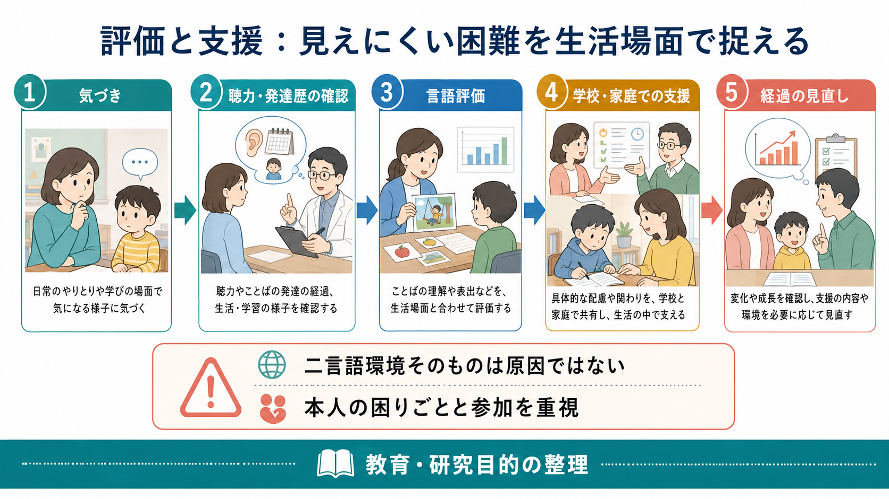
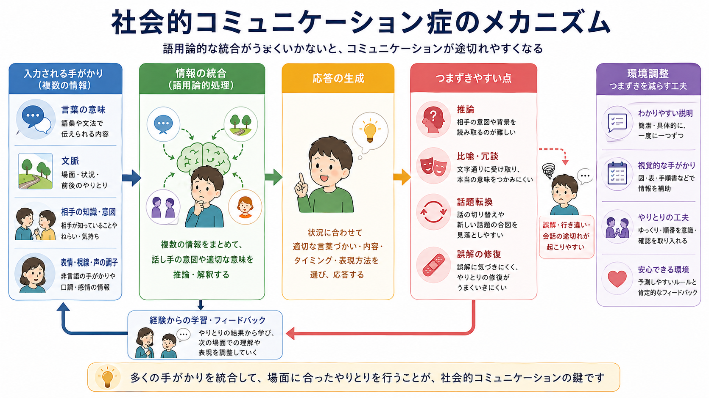
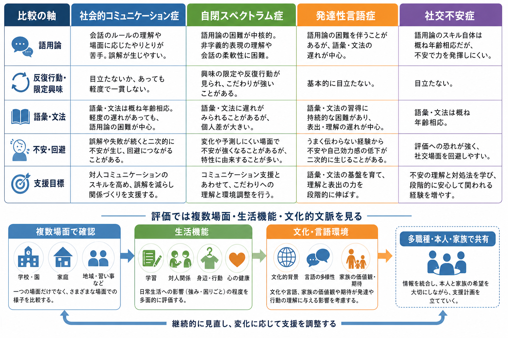

# 社会的コミュニケーション症とは何か

## 要点

- 社会的コミュニケーション症は、語彙や文法そのものよりも、言葉と非言語的手がかりを社会的文脈に合わせて使う「語用論」の困難を中心に理解される神経発達症である[1][2]。
- 典型的には、あいさつ・情報共有、相手や場面に応じた話し方の調整、会話の順番、話題維持、誤解の修復、比喩・冗談・曖昧表現・暗黙の意味の理解に困難が出やすい[1][2]。
- 自閉スペクトラム症でも社会的コミュニケーション困難は中核的にみられるが、DSM-5系では、限定された反復行動・興味・感覚特性が診断上重要であり、それらがASDを十分に説明する場合、社会的コミュニケーション症とは併記しない[1][3][4]。
- 評価では、検査場面だけでなく、家庭、学校、職場、友人関係など複数場面での参加困難、本人の困りごと、文化・言語環境、併存症を確認する[2][3]。
- 支援は「普通の話し方へ矯正する」ことではなく、本人の目的、環境、関係性に合わせて、誤解を減らし、参加しやすい手がかりとやりとりの方法を増やすことを目指す[2][6][7]。

## この記事で答える問い

1. 社会的コミュニケーション症は、単なる「会話が苦手」と何が違うのか。
2. 語用論的コミュニケーションとは、どのような能力を指すのか。
3. ASD、発達性言語症、社交不安症とはどう見分けるのか。
4. 評価と支援では、どのような点に注意すべきか。

## まず結論

社会的コミュニケーション症は、言葉を知っているか、文法を組み立てられるかだけでは説明しにくいコミュニケーション困難である。中心にあるのは、相手が何を知っているか、いまの場面で何を期待されているか、表情・視線・声の調子が何を示しているか、冗談や比喩がどのような意図で使われているかを統合し、適切なタイミングで応答する難しさである[1][2]。

ただし、この診断名は「空気が読めない人」という日常語のラベルではない。DSM-5系では、発達早期からの持続性、生活機能への影響、他の疾患や知的発達、語彙・文法の問題だけでは説明できないことを慎重に確認する必要がある[1][3]。臨床的には、[[鑑別診断とは何か]]、[[併存症とは何か]]、[[精神科で生活機能をどう評価するか]]と切り離せない。

## 背景

社会的コミュニケーション症は、DSM-5で導入された比較的新しい診断カテゴリである。以前から、語用論的言語障害、pragmatic language impairment、semantic-pragmatic disorder などの用語で、文法や語彙だけでは捉えられない会話・談話・非言語的やりとりの困難が議論されてきた[3][4][8]。

この診断が導入された背景には、ASD、言語症、ADHD、知的発達症、脳損傷、聴覚障害、不安症など、さまざまな状態で社会的コミュニケーション困難がみられる一方で、「反復行動や限定興味は目立たないが、語用論的な困難が生活上大きい」群をどう記述するかという問題があった[3][4]。

一方で、主要レビューは、この診断カテゴリには未解決の問題も多いと指摘している。特に、評価尺度の妥当性、ASDや発達性言語症との境界、文化差、年齢による期待水準の違い、成人例の把握は簡単ではない[3][4]。したがって、社会的コミュニケーション症は便利なラベルとして使うよりも、「どの場面で、どの語用論的操作が、どの程度生活参加を妨げているか」を記述する入口として使うのが実用的である。

## 基本概念

### 語用論

語用論とは、言葉を社会的文脈の中でどう使うかに関わる領域である。たとえば、「寒いね」という発話は、単なる温度の報告ではなく、窓を閉めてほしい、上着を貸してほしい、場を和ませたい、共感を求めたい、といった意味を持ちうる。語用論では、発話の文字通りの意味だけでなく、相手、場面、目的、前後の文脈、非言語的手がかりを合わせて解釈する[2]。

社会的コミュニケーション症で問題になりやすいのは、単語の意味を知らないことだけではない。相手がすでに知っている情報をどこまで説明するか、話題をいつ変えるか、相手が困惑したときに言い換えるか、冗談や皮肉を文字通りに受け取らないかといった、会話の運用面である[1][2]。

### 診断概念としての位置づけ

DSM-5-TRでは、社会的（語用論的）コミュニケーション症は神経発達症群に置かれる。中核は、社会的目的での言語・非言語コミュニケーション使用の持続的困難であり、発達早期から存在し、社会参加、学業、職業などの機能に影響することが求められる[1]。

ICD-11では、DSMの社会的コミュニケーション症と完全に同じカテゴリではなく、発達性言語症の下位分類として「主に語用論的言語の障害を伴う発達性言語症」が置かれている[5]。この違いは、[[DSMとICDは何が違うのか]]で扱うように、分類体系が同じ現象を異なる枠組みで整理することを示している。

### ASDとの関係

ASDでは、社会的コミュニケーションの困難に加えて、限定された反復行動、興味の強い偏り、感覚過敏・鈍麻、同一性へのこだわりなどが診断上重要になる[1][4]。社会的コミュニケーション症では、反復行動や限定興味がASDを満たすほどには明確でないことが前提になる。

ただし実際の評価では、境界は単純ではない。反復行動が幼少期には目立っていたが現在は薄い場合、本人や家族が気づいていない場合、文化や環境によって見え方が変わる場合がある。したがって、[[自閉スペクトラム症とは何か]]、[[発達障害群とは何か]]、[[発達歴は成人精神科でもなぜ重要なのか]]と接続して理解する必要がある。

## 仕組み

社会的コミュニケーションは、次のような複数の処理が重なって成り立つ。

| 処理 | 例 | 困難があると起こりやすいこと |
|---|---|---|
| 言語内容の理解 | 単語、文、話の筋を理解する | 話の要点や前提を取り違える |
| 文脈推論 | 場面、相手、前後関係を読む | 文字通りに受け取りやすい |
| 非言語手がかり | 表情、視線、声の調子、間 | 相手の困惑や冗談の合図に気づきにくい |
| 会話制御 | 順番、話題維持、話題転換 | 一方的に話す、急に話題が変わる |
| 修復 | 誤解に気づき、言い換える | 誤解が続き、人間関係の摩擦が増える |

このため、社会的コミュニケーション症は「社会性だけの問題」でも「言語だけの問題」でもない。[[言語理解はどのように行われるのか]]、[[社会的認知とは何か]]、[[心の理論とは何か]]、[[共同注意とは何か]]が重なる領域として理解すると見通しがよい。

図のように、会話では「言葉の意味」「文脈」「相手の知識・意図」「表情・視線・声の調子」が同時に入力される。語用論的統合がうまくいかないと、発話の意図を推論しにくくなり、比喩・冗談、話題転換、誤解の修復でつまずきやすい。ここで重要なのは、本人が努力していないという説明にしないことである。多くの場合、暗黙の手がかりを明示する、話題の切り替えを予告する、視覚的な情報を併用する、誤解を責めずに修復するなど、環境側の調整も有効な支援になる[2][6]。

## 図解

上の1枚目は、社会的コミュニケーション症を「気づき、評価、支援・研究」の流れで示している。診断名だけを見るのではなく、聴力、発達歴、語彙・文法、生活場面、本人と家族の困りごとを合わせて確認する。

2枚目は、語用論的な情報統合の流れである。発話そのもの、相手の知識、表情や声の調子、前後の文脈がまとまって初めて、場面に合った応答が可能になる。

3枚目は、近接する診断や状態との比較である。実際の臨床では、ひとつの診断名だけで説明しきれないことが多く、発達性言語症、ASD、ADHD、不安症、知的発達症、聴覚の問題、文化・言語環境を合わせて検討する[2][3][4]。

## 臨床・研究との接続

### 評価

評価では、標準化検査だけで社会的コミュニケーション症を判断するのは難しい。ASHAは、社会的コミュニケーション評価では、本人、家族、教師、職場、支援者など複数情報源から、自然場面のやりとり、活動参加、環境要因、生活の質を含めて見ることを重視している[2]。

具体的には、聴力評価、発達歴、言語理解・表出、語彙・文法、談話理解、推論、比喩・冗談理解、会話サンプル、親・教師評定、学校や職場での実際の困難を組み合わせる。Bishopの Children's Communication Checklist 系の研究は、標準的な言語検査では拾いにくい語用論的困難を評定で把握する必要性を早くから示していた[8]。

### 鑑別

ASDとの鑑別では、現在の社会的困難だけでなく、幼少期からの反復行動、限定興味、感覚特性、同一性へのこだわりを確認する[1][3][4]。発達性言語症との鑑別では、語彙、文法、音韻、語想起、読解など、構造的言語能力の問題が中心かどうかを見る。社交不安症では、語用論的スキル自体は年齢相応でも、評価への恐れや不安によって力を発揮しにくい場合がある。

このため、「社会的コミュニケーションが苦手」という訴えだけで診断名を決めるのは危険である。[[社交不安症とは何か]]、[[発達性言語症とは何か]]、[[知的発達症とは何か]]、[[ADHDとは何か]]、[[自閉スペクトラム症とは何か]]などとの重なりを丁寧に見る必要がある。

### 支援

支援研究は、社会的コミュニケーション症そのものに限定した大規模研究がまだ多くない。Adamsらの Social Communication Intervention Project は、語用論的・社会的コミュニケーション問題をもつ学齢期児を対象に、言語聴覚療法のランダム化比較試験を行い、一定の改善と評価上の課題を示した[6]。また、ASD児の語用論的言語介入に関する系統的レビューでは、子どもと親を能動的に含む介入が効果に関わる可能性が示される一方、長期効果や新しい文脈への般化には不確実性が残る[7]。

実践上は、本人の話し方を一方的に矯正するより、やりとりの目的を明確にする、暗黙のルールを言語化する、会話の順番や話題転換を視覚化する、誤解が起きたときの修復手順を共有する、学校・家庭・職場の期待を調整する、といった支援が重要になる[2][6][7]。これは[[心理教育とは何か]]、環境調整、[[精神科で多職種連携はなぜ重要なのか]]とも関係する。

## よくある誤解

**誤解1: 社会的コミュニケーション症は、性格が内向的なだけである。**  
内向性や一人を好むこと自体は障害ではない。問題になるのは、発達早期から持続する語用論的コミュニケーションの困難が、学業、仕事、友人関係、生活参加に明確な影響を与えている場合である[1][2]。

**誤解2: 語彙や文法が保たれていれば、言語の問題ではない。**  
語彙・文法が比較的保たれていても、会話の順番、話題維持、比喩、冗談、暗黙の意味、相手に合わせた説明で困難が生じることがある[2][8]。

**誤解3: ASDでなければ社会的コミュニケーション困難は軽い。**  
ASDを満たさなくても、社会的コミュニケーション困難が学業、就労、対人関係に大きな負担を与えることがある[2][3]。診断名の強弱ではなく、生活機能への影響を見る必要がある。

**誤解4: 支援は会話マナーを教え込むことだけである。**  
有効な支援は、本人の目的と環境を含めて設計する。相手側が説明を具体化する、会話の期待を明示する、誤解を修復しやすい関係を作ることも支援の一部である[2][6]。

## 関連ノート

- 神経発達症
- [[発達障害群とは何か]]
- [[自閉スペクトラム症とは何か]]
- [[発達性言語症とは何か]]
- [[社交不安症とは何か]]
- [[社会的認知とは何か]]
- [[心の理論とは何か]]
- [[共同注意とは何か]]
- [[言語理解はどのように行われるのか]]
- [[DSMとICDは何が違うのか]]
- [[精神科で生活機能をどう評価するか]]
- [[鑑別診断とは何か]]

## MOC更新候補

- `content/00_MOC/MOC｜精神医学.md`: 神経発達症、疾患・症候群、鑑別診断の項目に追加候補。
- `content/00_MOC/MOC｜発達・愛着・社会心理.md`: 言語発達、社会的認知、共同注意の周辺項目に追加候補。
- `content/00_MOC/MOC｜認知機能.md`: 語用論、言語理解、社会的認知の関連項目に追加候補。

## 理解チェック

1. 社会的コミュニケーション症でいう「語用論」とは何か。
2. 社会的コミュニケーション症とASDの鑑別で、限定された反復行動・興味を確認する理由は何か。
3. 語彙・文法が比較的保たれていても、会話で困難が生じるのはなぜか。
4. 評価で家庭・学校・職場など複数場面を見る必要があるのはなぜか。
5. 支援を「本人への会話マナー教育」だけにしないためには、どのような環境調整が考えられるか。

## 未解決問題

- 社会的コミュニケーション症が、ASDや発達性言語症からどの程度独立した診断単位なのかは、今も議論がある[3][4]。
- 標準化検査は、自然な会話の動的な文脈を十分に再現しにくい。生態学的妥当性の高い評価方法が必要である[2][3]。
- 文化、家庭内の会話規範、二言語環境、オンラインコミュニケーションが語用論的困難の評価にどう影響するかは、さらに整理が必要である[2]。
- 介入研究では、学んだスキルが家庭、学校、職場、友人関係にどの程度般化するか、長期的にどのような成果につながるかが重要な課題である[6][7]。

## 参考文献

[1] American Psychiatric Association. (2022). *Diagnostic and Statistical Manual of Mental Disorders, Fifth Edition, Text Revision (DSM-5-TR).* American Psychiatric Association Publishing. https://doi.org/10.1176/appi.books.9780890425787

[2] American Speech-Language-Hearing Association. (n.d.). *Social Communication Disorder.* ASHA Practice Portal. https://www.asha.org/practice-portal/clinical-topics/social-communication-disorder/

[3] Norbury, C. F. (2014). Practitioner review: Social (pragmatic) communication disorder conceptualization, evidence and clinical implications. *Journal of Child Psychology and Psychiatry, 55*(3), 204-216. https://doi.org/10.1111/jcpp.12154

[4] Swineford, L. B., Thurm, A., Baird, G., Wetherby, A. M., & Swedo, S. (2014). Social (pragmatic) communication disorder: A research review of this new DSM-5 diagnostic category. *Journal of Neurodevelopmental Disorders, 6*, 41. https://doi.org/10.1186/1866-1955-6-41

[5] World Health Organization. (2025). *ICD-11 for Mortality and Morbidity Statistics: 6A01.22 Developmental language disorder with impairment of mainly pragmatic language.* https://icd.who.int/browse/2025-01/mms/en#854708918

[6] Adams, C., Lockton, E., Freed, J., Gaile, J., Earl, G., McBean, K., Nash, M., Green, J., Vail, A., & Law, J. (2012). The Social Communication Intervention Project: A randomized controlled trial of the effectiveness of speech and language therapy for school-age children who have pragmatic and social communication problems with or without autism spectrum disorder. *International Journal of Language & Communication Disorders, 47*(3), 233-244. https://doi.org/10.1111/j.1460-6984.2011.00146.x

[7] Parsons, L., Cordier, R., Munro, N., Joosten, A., & Speyer, R. (2017). A systematic review of pragmatic language interventions for children with autism spectrum disorder. *PLOS ONE, 12*(4), e0172242. https://doi.org/10.1371/journal.pone.0172242

[8] Bishop, D. V. M., & Baird, G. (2001). Parent and teacher report of pragmatic aspects of communication: Use of the Children's Communication Checklist in a clinical setting. *Developmental Medicine & Child Neurology, 43*(12), 809-818. https://doi.org/10.1017/S0012162201001475
