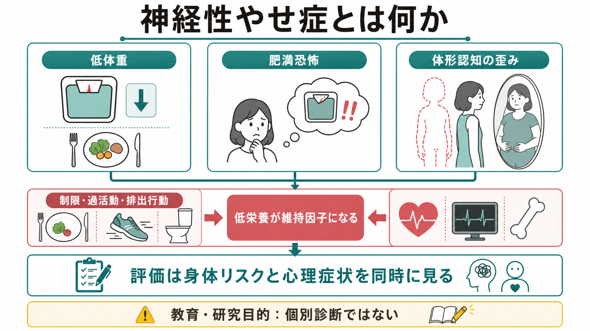
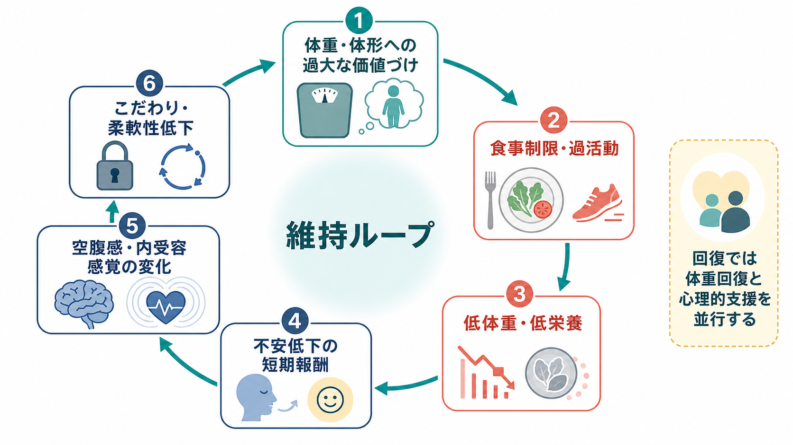
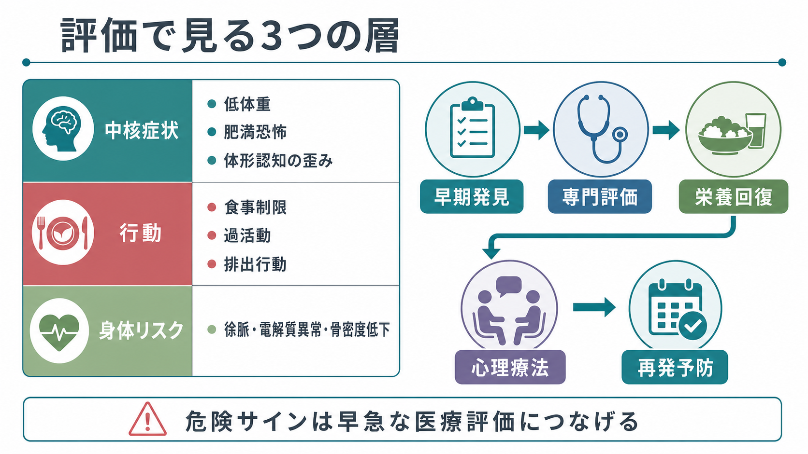

# 神経性やせ症とは何か

## 要点

- 神経性やせ症は、単なる「食欲不振」ではなく、著しい低体重、体重増加への恐怖または体重増加を妨げる行動、体重・体形の体験や自己評価の歪みが組み合わさる[[DSMとICDは何が違うのか|摂食障害]]である[1]。
- 症状の中心には、食事制限、過活動、排出行動などによって低体重が維持される行動パターンがある。ICD-11では、成人のBMI 18.5未満や小児・青年のBMI-for-age 5パーセンタイル未満が低体重の目安として示されるが、発達軌道や急速な体重減少も重要である[2]。
- 低栄養は身体合併症だけでなく、こだわり、柔軟性低下、不安、身体感覚の読み取りの変化を通じて症状の維持因子にもなる[3][6]。
- 死亡リスクは摂食障害の中でも高く、医学的合併症と自殺の両方を評価する必要がある[7]。

## この記事で答える問い

1. 神経性やせ症は、どのような特徴で定義されるのか。
2. 低体重、肥満恐怖、体形認知の歪みは、どのように結びつくのか。
3. なぜ本人の「意志の問題」として理解すると不十分なのか。
4. 臨床評価や研究では、何を同時に見なければならないのか。

## まず結論

神経性やせ症は、低体重という身体状態と、体重・体形への過大な価値づけ、体重増加への恐怖、食事制限や過活動などの行動が相互に強化し合う疾患である。重要なのは、「やせているか」だけでなく、低体重を維持する行動、体重・体形が自己評価をどれほど支配しているか、低栄養による身体リスクと心理症状がどれほど進んでいるかを同時に見ることである[1][4]。

## 背景

神経性やせ症は、思春期から若年成人期に発症しやすいが、年齢・性別・体型だけで判断できる疾患ではない。診断では、体重の絶対値だけでなく、年齢、性別、発達段階、身体疾患、成長曲線、急速な体重減少を含めて評価する[1][2]。

名称上の「anorexia」は食欲低下を連想させるが、実際には多くの場合、空腹がないから食べないのではない。むしろ、食べること、体重が増えること、体形が変わることへの不安や、低体重を維持する行動パターンが前景に出る。したがって、[[精神症状の横断的評価とは何か|横断的評価]]では、食行動、身体状態、自己評価、不安、強迫的傾向、抑うつ、自傷・自殺リスクを分けて確認する必要がある[4]。

## 基本概念

### 中核症状

神経性やせ症の中核は、次の3点に整理できる。

| 層 | 見るポイント | 補足 |
|---|---|---|
| 低体重 | 必要量に比べた摂取制限により、年齢・性別・発達段階からみて著しく低い体重になる | 小児・青年では「体重が減ったか」だけでなく、期待される成長や体重増加が止まることも重要 |
| 肥満恐怖・体重増加回避 | 体重増加への強い恐怖、または体重増加を妨げる持続的行動 | 本人が恐怖を明言しない場合でも、行動として現れることがある |
| 体形認知の歪み | 体重・体形の体験の歪み、自己評価への過大な影響、低体重の深刻さの認識困難 | [[身体型妄想性障害とは何か]]とは重なる部分があるが、体脂肪・体重への関心が中心になる点が重要 |

DSM-5-TRに基づく解説では、食事制限による著しい低体重、体重増加への恐怖または体重増加を妨げる行動、体重・体形の体験の障害または低体重の深刻さの認識困難が臨床的な軸になる[1]。ICD-11でも、著しい低体重と、正常体重への回復を妨げる行動、体重・体形が自己評価の中心になることが重視される[2]。

### 下位パターン

行動面では、制限型と過食・排出型に分けて考えると理解しやすい。制限型では、食事制限、断食、過活動が中心になる。過食・排出型では、低体重の文脈で、[[過食とは何か|過食]]や自己誘発性嘔吐、下剤・利尿薬の誤用などが加わる。どちらも「食べる量」だけでなく、体重増加を防ぐための行動全体として評価する。

## 仕組み

### 1. 低栄養は結果であると同時に維持因子になる

神経性やせ症では、低体重は単なる結果ではない。低栄養は、集中困難、抑うつ、不安、易刺激性、こだわりの強まり、柔軟性の低下を通じて、食事や体形への関心をさらに狭める。身体的には徐脈、低血圧、電解質異常、骨密度低下、消化管症状、内分泌変化などが問題になる[3][4]。

このため、症状を心理だけで説明することも、身体だけで説明することも不十分である。身体リスクを下げるための栄養回復と、体重・体形への過大な価値づけや不安への心理的支援は並行して考える必要がある[4]。

### 2. 食事制限は「習慣化」する

神経性やせ症の食事制限は、最初は体重減少や安心感を得るための目標志向的行動として始まっても、反復されるうちに刺激と反応が強く結びついた習慣として固定される可能性がある。Walshは、神経性やせ症の持続性を、食事制限が強固な不適応的習慣になる過程として説明している[5]。

この見方は、「本人が理解すればすぐ変えられる」という単純な説明を避ける助けになる。恐怖や価値づけを認知的に扱うだけでなく、食事場面、食品選択、運動、体重確認、回避行動といった反復行動を具体的に扱う必要がある。

### 3. 内受容感覚と報酬処理の変化

近年の研究では、空腹・満腹、胃腸感覚、心拍、身体の内部状態を感じ取る[[MOC｜意識・自己・身体性|内受容感覚]]が神経性やせ症の病態に関わる可能性が議論されている。内受容感覚の乱れは、空腹や満腹の読み取り、身体像、情動認識、食物刺激への予測誤差に影響しうる[6]。

また、遺伝研究では、神経性やせ症が精神医学的リスクだけでなく、身体活動、代謝、脂質、血糖、体格関連形質とも遺伝的に相関することが示され、単なる「やせ願望」ではなく、精神・代謝の両面をもつ疾患として再概念化する必要が提案されている[8]。

## 図解

上の1枚目は、低体重・肥満恐怖・体形認知の歪みを中核に、制限、過活動、排出行動、身体リスク評価をつないだ概念地図である。2枚目は、体重・体形への過大な価値づけから、食事制限、低栄養、不安低下の短期報酬、内受容感覚の変化、こだわりの固定化へ進む維持ループを示している。

3枚目は、評価の層を整理するための図である。臨床では、中核症状、行動、身体リスクを分けて見たうえで、早期発見、専門評価、栄養回復、心理療法、再発予防へつなぐ。

## 臨床・研究との接続

### 臨床評価で重要なこと

NICEガイドラインは、摂食障害が疑われる場合には、身体健康、低栄養や代償行動の影響、うつ・不安・自傷・強迫症状、物質使用、緊急対応の必要性を評価することを推奨している[4]。神経性やせ症では、体重やBMIだけでなく、徐脈、低血圧、低体温、脱水、電解質異常、急速な体重減少、自殺リスクを含めた医学的評価が欠かせない。

治療については、成人では摂食障害焦点化認知行動療法、MANTRA、専門的支持的臨床管理などが検討され、小児・青年では家族を含む治療が重視される。いずれの場合も、体重回復は心理的・身体的・生活機能の変化を支える重要な目標である[4]。ただし、本記事は教育・研究目的の整理であり、個別の診断や治療方針は専門家による評価に基づく。

### 研究上の論点

研究では、次の問いが重要になる。

- 低栄養による状態依存的な脳・認知変化と、発症前からある脆弱性をどう区別するか。
- 体形認知の歪みは、視覚的身体像、自己評価、内受容感覚、社会的比較のどの層で生じるのか。
- 食事制限や過活動は、報酬、習慣、強迫性、不安低減のどの機構で維持されるのか。
- 代謝関連の遺伝的要因は、食行動、活動性、体重回復、再発リスクとどう関係するのか。

これらは、[[強迫症とは何か]]、[[不安症群とは何か]]、[[うつ病とは何か]]、[[気分障害における自殺リスクとは何か]]との横断的理解にもつながる。

## よくある誤解

### 誤解1：「食べれば治る」

体重回復は重要だが、それだけで体重・体形への過大な価値づけや食事場面の恐怖が消えるとは限らない。逆に、心理的支援だけで身体リスクを放置することも危険である。身体評価、栄養回復、心理的支援、家族・生活環境の調整を組み合わせて考える必要がある[4]。

### 誤解2：「本人の美意識やわがままの問題」

神経性やせ症では、低体重であっても体重増加への恐怖や体形認知の歪みが強く、低体重の深刻さを認識しにくいことがある[1]。さらに、食事制限が習慣化し、低栄養が認知・情動を狭めるため、単純な説得だけでは変化しにくい。

### 誤解3：「やせていなければ問題ない」

ICD-11では、回復期で体重が正常範囲に戻った状態も分類される[2]。また、急速な体重減少、成長曲線からの逸脱、排出行動、電解質異常、自殺リスクは、体重だけでは捉えられない。体重が正常域に見えても、摂食障害の評価が必要な場合がある。

### 誤解4：「神経性やせ症は女性だけの疾患」

女性に多いことは確かだが、男性や多様な性別の人にも生じる。男性では筋肉量、体脂肪、運動、競技、身体イメージへの関心が異なる形で現れることがあり、固定観念によって発見が遅れることがある。

## 関連ノート

- [[DSMとICDは何が違うのか]]
- [[精神症状の横断的評価とは何か]]
- [[過食とは何か]]
- [[不安症群とは何か]]
- [[強迫症とは何か]]
- [[うつ病とは何か]]
- [[大うつ病性障害とは何か]]
- [[気分障害における自殺リスクとは何か]]
- [[身体型妄想性障害とは何か]]

## MOC更新候補

- [[MOC｜精神医学]]
- [[MOC｜症候学]]
- [[MOC｜臨床実践・治療]]
- [[MOC｜意識・自己・身体性]]

## 理解チェック

1. 神経性やせ症の中核症状を、低体重、肥満恐怖、体形認知の歪みの3点から説明できるか。
2. なぜ低栄養は「結果」であるだけでなく「維持因子」でもあるのか。
3. 食事制限が習慣化するという説明は、本人への責任帰属をどのように避ける助けになるか。
4. 体重やBMI以外に、どのような身体リスクと心理リスクを評価すべきか。

## 未解決問題

- 体重回復後にも残る認知・内受容感覚・報酬処理の変化が、どこまで発症前脆弱性で、どこまで低栄養の影響なのかは十分に分離できていない。
- 代謝関連の遺伝的相関が、実際の治療反応や再発リスクにどう関わるかは、今後の縦断研究が必要である。
- 男性、非西洋圏、低体重が目立ちにくい人、併存症をもつ人での見逃しを減らす評価法が課題である。

## 参考文献

[1] Attia, E., & Walsh, B. T. (2025). *Anorexia Nervosa*. Merck Manual Professional Edition. https://www.merckmanuals.com/professional/psychiatric-disorders/feeding-and-eating-disorders/anorexia-nervosa

[2] World Health Organization. (2025). *ICD-11 for Mortality and Morbidity Statistics: 6B80 Anorexia Nervosa*. https://icd.who.int/browse/2025-01/mms/en#263852475

[3] Treasure, J., Zipfel, S., Micali, N., Wade, T., Stice, E., Claudino, A., Schmidt, U., Frank, G. K., Bulik, C. M., & Wentz, E. (2015). Anorexia nervosa. *Nature Reviews Disease Primers*, 1, 15074. https://doi.org/10.1038/nrdp.2015.74

[4] National Institute for Health and Care Excellence. (2020). *Eating disorders: recognition and treatment* (NICE guideline NG69). https://www.nice.org.uk/guidance/ng69

[5] Walsh, B. T. (2013). The enigmatic persistence of anorexia nervosa. *American Journal of Psychiatry*, 170(5), 477-484. https://doi.org/10.1176/appi.ajp.2012.12081074

[6] Jacquemot, A. M. M. C., & Park, R. (2020). The role of interoception in the pathogenesis and treatment of anorexia nervosa: a narrative review. *Frontiers in Psychiatry*, 11, 281. https://doi.org/10.3389/fpsyt.2020.00281

[7] Arcelus, J., Mitchell, A. J., Wales, J., & Nielsen, S. (2011). Mortality rates in patients with anorexia nervosa and other eating disorders: a meta-analysis of 36 studies. *Archives of General Psychiatry*, 68(7), 724-731. https://doi.org/10.1001/archgenpsychiatry.2011.74

[8] Watson, H. J., Yilmaz, Z., Thornton, L. M., Hübel, C., Coleman, J. R. I., Gaspar, H. A., Bryois, J., Hinney, A., Leppä, V. M., Mattheisen, M., et al. (2019). Genome-wide association study identifies eight risk loci and implicates metabo-psychiatric origins for anorexia nervosa. *Nature Genetics*, 51, 1207-1214. https://doi.org/10.1038/s41588-019-0439-2
