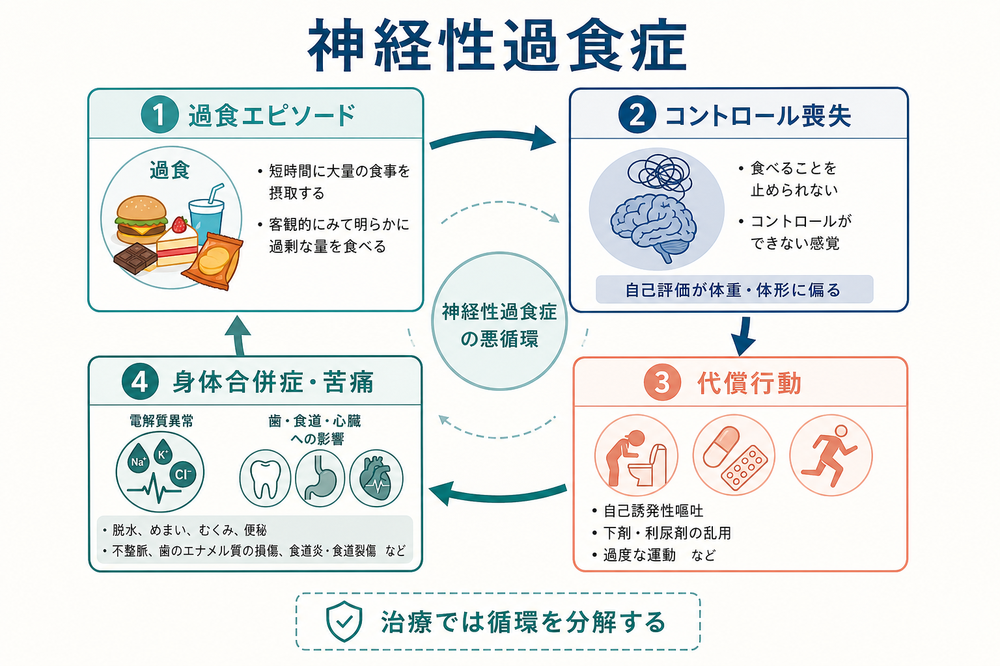
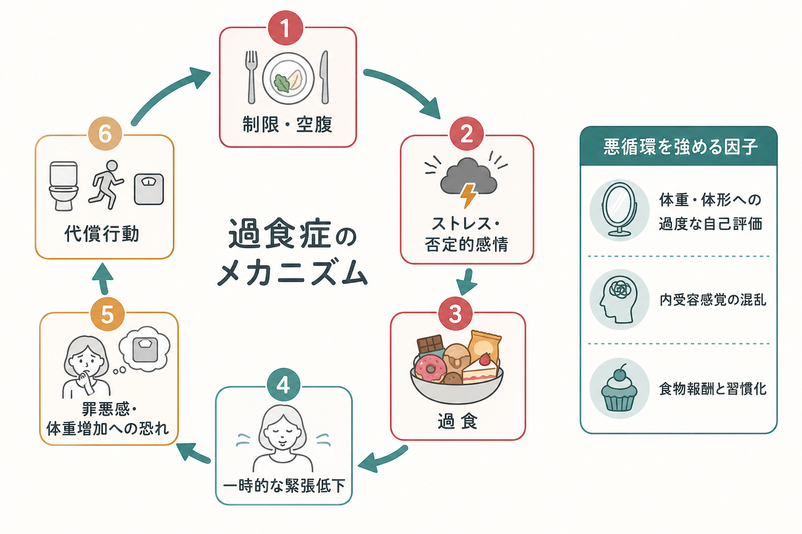
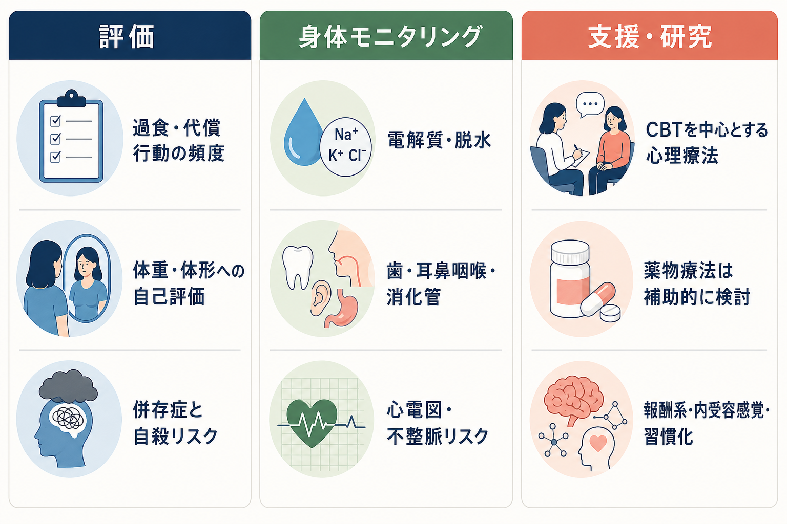

# 神経性過食症とは何か

## 要点

- 神経性過食症は、反復する過食エピソードと、体重増加を防ごうとする代償行動が組み合わさる摂食障害である。
- 過食では、単に食事量が多いだけでなく、「止められない」「コントロールできない」という主観的体験が重要になる[1][2]。
- 代償行動には、自己誘発性嘔吐、下剤・利尿薬などの乱用、絶食、過度な運動などが含まれる[1][2]。
- 体重や体形が自己評価を強く左右することが、症状の維持に関わる[1][3]。
- 身体合併症として、脱水、低カリウム血症などの電解質異常、酸塩基平衡異常、歯のエナメル質障害、食道炎、不整脈リスクなどが問題になる[4][5]。
- 治療研究では、摂食障害に焦点化した認知行動療法、ガイド付きセルフヘルプ、家族療法、必要に応じた薬物療法の併用などが検討されているが、個別の適応は専門的評価に基づく[6][7][8]。

## この記事で答える問い

1. 神経性過食症は、単なる「食べすぎ」や「意志の弱さ」と何が違うのか。
2. 過食と代償行動は、どのような悪循環として維持されるのか。
3. 身体合併症として、何を見落としてはいけないのか。
4. 臨床・研究では、どのような評価と支援が重視されるのか。

## まず結論

神経性過食症は、「たくさん食べる人」の診断名ではない。中核にあるのは、反復する過食、食べることへのコントロール喪失、体重増加を防ぐための代償行動、そして体重・体形への自己評価の偏りである。DSM-5-TR では、過食と不適切な代償行動が平均して少なくとも週1回、3か月続くことが基準に含まれる[1]。ICD-11 でも、反復する過食、代償行動、体重・体形への強いとらわれ、苦痛または機能障害が重視される[2]。

重要なのは、神経性過食症では体重だけを見ても危険度が分からないことである。低体重でない場合でも、嘔吐、下剤乱用、利尿薬乱用、絶食、過度な運動によって、電解質異常、脱水、歯・食道・胃腸・心臓への影響が生じうる[4][5]。したがって、臨床的には心理症状と身体状態を同時に評価する必要がある。

## 背景

摂食障害は、食事量や体重だけの問題ではなく、身体健康、心理社会的機能、対人関係、学業・就労、自己評価に広く影響する疾患群である。Lancet の総説は、摂食障害を「身体健康を損ない、心理社会的機能を大きく妨げる精神疾患」として整理し、体重・体形・食行動への態度が発症と維持に重要であると述べている[3]。

神経性過食症は、神経性やせ症や過食性障害と重なる部分をもつ。神経性やせ症の過食・排出型では低体重が中心的な診断要件になる一方、神経性過食症では著しい低体重を必須としない。過食性障害では反復する過食が中心だが、神経性過食症のような規則的な代償行動は診断の中核ではない[1][2]。分類の違いについては [[DSMとICDは何が違うのか]] と接続できる。

## 基本概念

### 過食エピソード

神経性過食症の過食は、単に「いつもより多く食べた」という意味ではない。診断分類では、限定された時間内に、同じ状況の多くの人より明らかに多い量を食べること、そしてその間に食べることを止められない、量や種類をコントロールできないという感覚を伴うことが重視される[1][2]。

ただし、本人にとっての苦痛は、客観的な量だけで決まらない。食後の罪悪感、体重増加への恐れ、秘密にしたい感覚、自己評価の低下が強い場合、過食エピソードは次の制限や代償行動を引き起こしやすくなる。

### 代償行動

代償行動とは、体重増加を避ける目的で行われる行動である。代表例は自己誘発性嘔吐だが、それだけではない。下剤・利尿薬・その他薬剤の乱用、絶食、過度な運動も含まれる[1][2]。

代償行動は短期的には「取り戻せた」「安心した」という感覚を生むことがある。しかし、その安心が次の厳しい食事制限や体重確認を強め、空腹、ストレス、反動的な過食を生むことがある。この短期的軽減と長期的悪化のずれが、症状を固定化しやすい。

### 自己評価の偏り

神経性過食症では、体重や体形が自己評価に過度に影響する。これは「外見を気にする」程度の話ではなく、体重・体形の変化が、自分の価値、安心感、生活上の選択に強く結びつく状態である[1][3]。

この点は、[[摂食障害は脳の報酬系や身体感覚とどう関わるのか]] で扱う食物報酬、身体イメージ、前頭制御の問題とつながる。食物は報酬であると同時に、不安、罪悪感、身体変化への恐れを引き起こす刺激にもなりうる。

## 仕組み

神経性過食症を理解するには、「過食」と「代償行動」を別々の症状として並べるだけでは足りない。多くの場合、制限、空腹、否定的感情、食物刺激、過食、一時的な緊張低下、罪悪感、体重増加への恐れ、代償行動が循環する。

### 制限と反動

厳しい食事制限は、短期的には体重や食事を「制御できている」感覚を与える。しかし、生理的な空腹、注意の食物への偏り、疲労、気分の不安定化が強まると、過食エピソードが起こりやすくなる。過食後に代償行動が起こると、再び「次はもっと制限しなければならない」というルールが強まり、循環が続く。

### 感情調整としての過食

過食は、快楽だけで説明できない。強い不安、怒り、孤独、疲労、自己嫌悪があるとき、食べることが一時的に緊張を下げる場合がある。その直後に罪悪感や体重増加への恐れが強まると、代償行動が起こりやすくなる。ここでは [[前頭前野は情動制御にどう関わるのか]] で扱うトップダウン制御や、[[報酬系の異常はうつ病をどう説明するのか]] で扱う報酬・動機づけの観点が参考になる。

### 内受容感覚と身体イメージ

神経性過食症では、空腹、満腹、胃の張り、吐き気、心拍、不安などの身体信号が、体重増加への恐れや自己評価と結びつきやすい。身体の内部状態をどう感じ、どう解釈するかという問題は [[内受容感覚とは何か]] と接続する。

たとえば、食後の胃部膨満感を「危険な体重増加の兆候」と解釈すると、不安が高まり、排出行動や過度な確認行動が起こりやすくなる。これは単なる知識不足ではなく、身体感覚、予測、感情、行動が組み合わさった悪循環として理解する必要がある。

## 図解

| 図 | 内容 |
|---|---|
| 図1 | 神経性過食症の全体像。過食、コントロール喪失、代償行動、身体合併症・苦痛を一つの循環として整理した。 |
| 図2 | 制限、否定的感情、過食、一時的な緊張低下、罪悪感、代償行動が循環する維持メカニズム。 |
| 図3 | 評価、身体モニタリング、支援・研究の接点。過食・代償行動の頻度だけでなく、電解質、脱水、歯・消化管、心電図、併存症を含めて見る。 |

## 身体合併症

神経性過食症の身体合併症は、代償行動の種類と頻度に大きく左右される。Mehler と Rylander のレビューは、自己誘発性嘔吐と下剤乱用が多くの身体合併症に関わることを整理している[4]。また、身体合併症の治療レビューは、摂食障害行動の中止と専門的ケアによって可逆的になりうる合併症も多い一方、深刻な転帰を取りうる合併症があることを強調している[5]。

| 領域 | 起こりうる問題 | なぜ重要か |
|---|---|---|
| 水分・電解質 | 脱水、低カリウム血症、低ナトリウム血症、酸塩基平衡異常 | 倦怠感、筋力低下、不整脈、意識障害などにつながりうる |
| 心血管 | 動悸、不整脈リスク、心電図異常 | 低カリウム血症や脱水と組み合わさると危険が増える |
| 歯・口腔 | エナメル質障害、齲歯、唾液腺腫脹 | 嘔吐による胃酸暴露が関与する |
| 消化管 | 逆流、食道炎、胃腸症状、便秘、下剤依存 | 排出行動や食行動の乱れが慢性化しうる |
| 腎・代謝 | 腎機能への負荷、浮腫、代謝性アルカローシスなど | 代償行動の継続で身体管理が複雑になる |

ここでの記述は教育・研究目的の整理であり、個別の検査や治療を指示するものではない。嘔吐、下剤・利尿薬乱用、失神、胸痛、動悸、強い脱水、自傷・希死念慮がある場合は、摂食障害だけでなく身体救急と安全評価の問題として扱う必要がある。自傷や自殺リスクについては [[自傷と自殺企図はどう違うのか]]、[[自殺リスク評価では何を聞くべきか]] と接続できる。

## 臨床・研究との接続

### 評価

NICE は、摂食障害が疑われる場合、体重や BMI だけに頼らず、食行動、代償行動、身体合併症、併存する精神疾患、アルコール・物質使用、自傷・自殺リスクを含めて評価することを重視している[6]。APA の診療ガイドラインも、初期評価で身長・体重歴、食行動、食品レパートリー、体重制御行動、併存する身体・精神疾患を確認することを推奨している[8]。

神経性過食症の評価では、過食と代償行動の頻度だけでなく、どのような状況で起こるかを聞くことが重要である。具体的には、食事制限、空腹、体重確認、鏡確認、対人ストレス、睡眠不足、月経周期、飲酒、孤立、SNS や身体比較の影響などが、症状の前後にどう関わるかを整理する。

### 支援

NICE は、成人の神経性過食症に対して、神経性過食症に焦点化したガイド付きセルフヘルプを検討し、それが不適切または十分でない場合に摂食障害焦点化 CBT を検討するとしている[6]。児童青年では、家族を巻き込んだ神経性過食症焦点化家族療法が推奨される[6]。

Cochrane レビューでは、神経性過食症や関連する過食症状に対する心理療法、とくに CBT-BN の有効性が支持される一方、研究の質やサンプルサイズには限界があるとされる[7]。薬物療法では、SSRI が検討されることがあるが、NICE は薬物療法を単独治療として提供しないよう述べている[6]。APA のガイドライン要約では、成人の神経性過食症に対し、摂食障害焦点化 CBT とセロトニン再取り込み阻害薬を組み合わせる方針が示されている[8]。いずれも個別の治療指示ではなく、症状、身体状態、併存症、本人の希望、利用可能な支援資源を踏まえて検討される選択肢である。

### 研究

研究的には、神経性過食症は報酬学習、衝動性、習慣化、情動調整、内受容感覚、身体イメージ、社会文化的要因が交差する病態として扱われる。単一の原因で説明するより、どの人のどの症状が、どの維持因子によって続いているのかを分解する方が臨床的に有用である。

## よくある誤解

### 誤解1: 神経性過食症は「食べすぎ」の別名である

神経性過食症では、食べる量だけでなく、コントロール喪失、反復性、代償行動、体重・体形への自己評価の偏りが重要である[1][2]。したがって、外から見える食事量だけで判断できない。

### 誤解2: 体重が標準範囲なら身体リスクは低い

体重が標準範囲でも、嘔吐、下剤・利尿薬乱用、脱水、低カリウム血症、不整脈、歯や食道の障害が起こりうる[4][5]。神経性過食症では、体重だけで安全性を判断しない。

### 誤解3: 代償行動は「食べた分を帳消しにする」合理的な方法である

代償行動は身体リスクを増やすだけでなく、短期的な安心を通じて症状の悪循環を強めることがある。嘔吐や下剤使用は、摂取エネルギーや身体変化を単純に相殺する安全な方法ではない[4][5]。

### 誤解4: 意志が強ければ治る

神経性過食症は、自己制御の弱さだけで説明できない。制限、空腹、報酬、情動調整、身体感覚、自己評価、習慣化、対人環境が相互に関わる。本人を責める説明は、支援への接続を妨げやすい。

## 関連ノート

- [[摂食障害は脳の報酬系や身体感覚とどう関わるのか]]
- [[内受容感覚とは何か]]
- [[前頭前野は情動制御にどう関わるのか]]
- [[報酬系の異常はうつ病をどう説明するのか]]
- [[DSMとICDは何が違うのか]]
- [[自傷と自殺企図はどう違うのか]]
- [[自殺リスク評価では何を聞くべきか]]

今後の作成候補: 摂食障害とは何か、過食性障害とは何か、神経性やせ症とは何か、摂食障害の認知行動療法とは何か、摂食障害の身体合併症、過食と情動調整、体重・体形への過大評価とは何か。

MOC 更新候補: `content/00_MOC/` 配下の精神医学、摂食障害、臨床心理学・認知行動療法、神経科学と精神疾患関連 MOC。並列生成ジョブとの競合を避けるため、本記事では MOC 本体を更新しない。

## 理解チェック

1. 神経性過食症の「過食」は、単なる食事量の多さと何が違うか。
2. 代償行動にはどのような行動が含まれ、なぜ症状維持に関わるのか。
3. 体重が標準範囲でも確認すべき身体合併症には何があるか。
4. 神経性過食症を「意志の問題」と説明すると、何を見落とすか。
5. 研究上、報酬系、内受容感覚、習慣化の観点はどのように役立つか。

## 参考文献

[1] American Psychiatric Association. (2022). *Diagnostic and Statistical Manual of Mental Disorders, Fifth Edition, Text Revision (DSM-5-TR).* American Psychiatric Association Publishing. https://doi.org/10.1176/appi.books.9780890425787

[2] World Health Organization. (2026). *ICD-11 for Mortality and Morbidity Statistics: 6B81 Bulimia Nervosa.* https://icd.who.int/browse/2026-01/mms/en#509381842

[3] Treasure, J., Duarte, T. A., & Schmidt, U. (2020). Eating disorders. *The Lancet, 395*(10227), 899-911. https://doi.org/10.1016/S0140-6736(20)30059-3

[4] Mehler, P. S., & Rylander, M. (2015). Bulimia Nervosa - medical complications. *Journal of Eating Disorders, 3*, 12. https://doi.org/10.1186/s40337-015-0044-4

[5] Mehler, P. S., Krantz, M. J., & Sachs, K. V. (2015). Treatments of medical complications of anorexia nervosa and bulimia nervosa. *Journal of Eating Disorders, 3*, 15. https://doi.org/10.1186/s40337-015-0041-7

[6] National Institute for Health and Care Excellence. (2017, updated 2020). *Eating disorders: recognition and treatment (NICE guideline NG69).* https://www.nice.org.uk/guidance/ng69/chapter/recommendations

[7] Hay, P. P. J., Bacaltchuk, J., Stefano, S., & Kashyap, P. (2022). Psychological treatments for bulimia nervosa and binging. *Cochrane Database of Systematic Reviews*, CD000562. https://doi.org/10.1002/14651858.CD000562.pub3

[8] American Psychiatric Association. (2023). *Treatment of Patients with Eating Disorders: Guideline Summary.* Guideline Central. https://www.guidelinecentral.com/guideline/1971974/

## 未解決問題

- 神経性過食症の報酬系・内受容感覚の変化は、発症前の脆弱性、症状の結果、回復過程のどれをどの程度反映しているのか。
- 代償行動の種類によって、身体合併症と心理的維持因子はどのように異なるのか。
- CBT、家族療法、薬物療法、デジタル介入を、個人の症状パターンに合わせてどう組み合わせるべきか。
- 男性、性的マイノリティ、スポーツ選手、糖尿病をもつ人など、見落とされやすい集団で評価と支援をどう改善するか。
