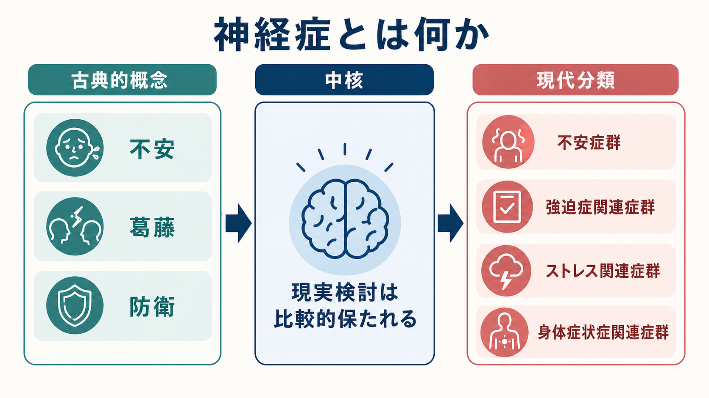
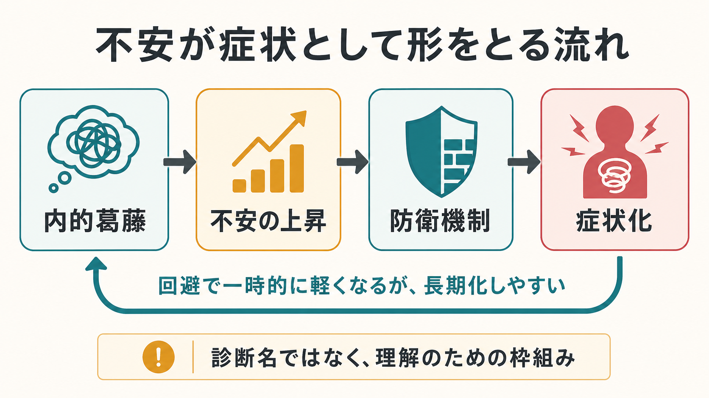
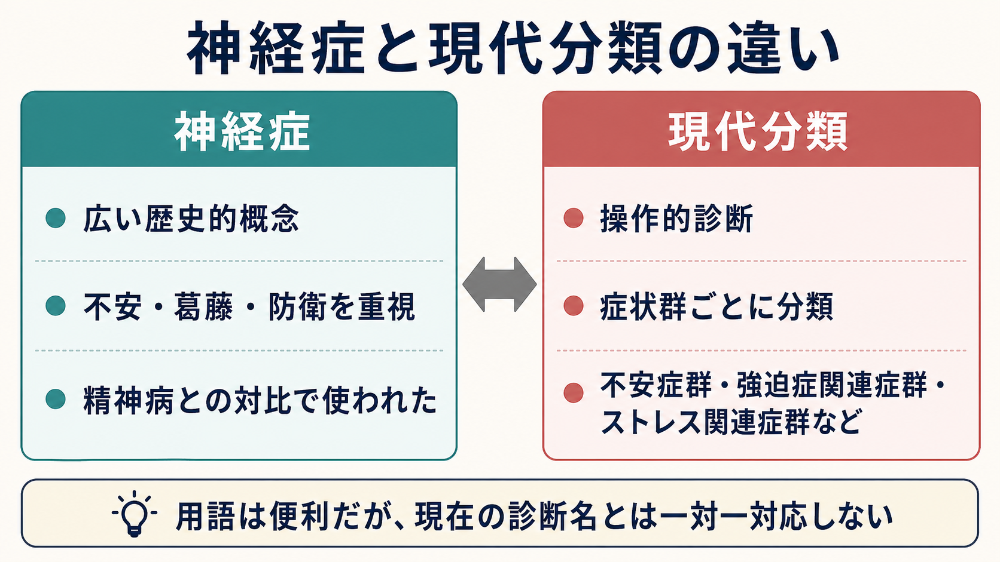

# 神経症とは何か

## 要点

- 神経症は、現在のDSM-5-TRやICD-11の正式な大分類というより、不安、葛藤、防衛、回避、身体化、対人困難をまとめて理解するための歴史的・臨床的な概念である。
- 古典的には、精神病と対比され、現実検討が比較的保たれたまま強い苦痛や機能低下が生じる状態を指してきた。
- ICD-10の「神経症性、ストレス関連、身体表現性障害」に近い領域は、ICD-11では[[不安症群とは何か|不安症群]]、[[強迫症とは何か|強迫症関連症群]]、[[PTSDとは何か|ストレス関連症群]]、解離症群、身体的苦痛・身体的体験の障害群などへ再編された[1][2]。
- したがって「神経症」という語は、診断名としてではなく、現代分類を横断する理解のレンズとして使うと誤解が少ない。

## この記事で答える問い

このノートでは、次の問いに答える。

1. 神経症は何を指していた概念なのか。
2. DSM-5-TRやICD-11では、神経症に相当する領域はどう扱われるのか。
3. 不安、葛藤、防衛、症状化という説明は、現在でもどのように使えるのか。
4. 「神経症」「精神病」「神経症傾向」を混同しないためには何を見ればよいのか。

## まず結論

神経症とは、単一の病気ではなく、「不安や内的葛藤を背景に、回避、強迫、身体症状、解離、対人困難などが生じるが、現実検討は大きく崩れない」という古典的なまとめ方である。現在の診断実務では、[[DSMとICDは何が違うのか|DSMやICD]]の操作的診断を用いて、[[全般不安症とは何か]]、[[パニック症とは何か]]、[[強迫症とは何か]]、[[PTSDとは何か]]、[[変換症とは何か]]、[[身体症状症とは何か]]などに分けて評価する。

ただし、神経症概念が完全に無意味になったわけではない。症状名だけでは見えにくい「何が不安を高め、どのような防衛や回避で一時的にしのぎ、その結果どの症状が維持されるのか」を考えるときには、今も臨床的な仮説形成の言葉として役立つ[5][6]。

## 背景

「神経症」は、もともと神経の病気という広い語として使われ、その後、精神分析や精神力動の文脈で「葛藤、不安、防衛に関係する非精神病性の苦痛」として意味づけられてきた。20世紀後半の診断分類では、原因論を診断名に入れることへの批判、診断者間信頼性の問題、研究で使いやすい操作的基準への移行が重なり、DSM-III以降、神経症という包括カテゴリーは後景に退いた[4][5]。

DSM-5-TRは、神経症という大分類を置かず、不安症群、強迫症および関連症群、心的外傷およびストレス因関連症群、身体症状症および関連症群、解離症群などを別々の章として扱う[3]。ICD-11も同様に、ICD-10のF40-F48に相当する広い領域を複数の診断群へ分け、臨床的有用性、国際的適用可能性、ライフスパンや文化差への配慮を重視して再編した[1][2]。

## 基本概念

### 神経症を構成する四つの視点

神経症を理解する最小セットは、次の四つである。

| 視点 | 内容 | 現代分類で近い問い |
|---|---|---|
| 不安 | 危険予測、失敗予測、見捨てられ不安、身体感覚への恐怖など | 不安症群、パニック症、社交不安症 |
| 葛藤 | したいこと、すべきこと、恐れていることが両立しない | うつ、不安、対人困難、パーソナリティ機能 |
| 防衛 | つらい感情や欲求を意識しにくくする自動的な心の働き | 精神力動的評価、心理療法のケースフォーミュレーション |
| 症状化 | 回避、強迫、身体症状、解離、反復的な対人パターンとして現れる | DSM-5-TR / ICD-11の各症状群 |

この枠組みは、神経症を「本人の気の持ちよう」とみなすものではない。むしろ、症状は生物学的脆弱性、学習、予測、ストレス、対人環境、身体状態が相互作用して生じるものとして見る必要がある[7][8]。

### 精神病との古典的な対比

古典的な区別では、神経症は精神病と対比された。神経症では強い苦痛があっても、現実検討、つまり「自分の考えや不安が現実とどの程度対応しているか」を見直す力が比較的保たれやすい。一方、精神病性障害では妄想、幻覚、思考のまとまりにくさなどにより、現実検討が大きく障害されることがある。

ただし、この二分法は粗い。現代の精神医学では、現実検討、病識、機能障害、持続期間、リスク、併存症、物質・身体疾患の影響を具体的に評価する。神経症か精神病かという一語で臨床判断を済ませることはできない。

## 仕組み

神経症的な症状は、しばしば次の循環として理解できる。

1. 生物学的脆弱性、気質、過去経験、現在のストレスが重なる。
2. ある状況や身体感覚が「危険」「失敗」「拒絶」「制御不能」と予測される。
3. 不安が高まり、回避、確認、抑圧、知性化、反動形成、身体化などの防衛や対処が起きる。
4. 短期的には不安が下がるため、その対処が強化される。
5. 長期的には経験の修正が起きにくくなり、症状と生活機能低下が維持される。

防衛機制研究では、防衛は単なる「悪い癖」ではなく、内的葛藤や外的ストレスから心的均衡を守る自動的な調整として扱われる。成熟した防衛は感情と思考を統合しやすいが、未成熟な防衛に強く依存すると、対人関係や症状の持続に関係しやすい。神経症的防衛はその中間に位置づけられ、抑圧、反動形成、置き換え、知性化などを通じて、つらい感情や欲求を部分的に意識から遠ざける[6]。

## 図解

上の図は、神経症と現代分類の関係を単純化している。重要なのは、神経症という古い語が、現在の診断名と一対一対応しない点である。たとえば、古典的に「不安神経症」と呼ばれたものは、現在では全般不安症、パニック症、広場恐怖症、社交不安症、身体症状症、抑うつ状態などへ分かれることがある。

## 臨床・研究との接続

臨床では、まずDSM-5-TRやICD-11に基づいて現在の症状群、重症度、持続期間、機能障害、リスク、併存症を評価する。神経症という語だけで診断したり、治療方針を決めたりするのは不十分である[1][3]。

一方で、治療的理解では「診断名の横断性」が重要になる。同じ不安症群でも、主に身体感覚への恐怖で維持される人、対人評価への恐怖で維持される人、確認行為で維持される人、喪失や外傷体験の影響が強い人では、介入の焦点が異なる。トランス診断的な不安モデルは、個別診断を越えて不安、回避、安全行動、感情調整を扱う考え方を発展させてきた[8]。

研究の側では、神経症そのものよりも、内在化スペクトラム、神経症傾向、否定的情動性、感情調整、防衛機制、予測処理などの次元的構成概念として検討されることが多い。たとえば神経症傾向は、不安症や抑うつをまたぐ内在化因子と強く関連することが示されている[7]。この意味で、神経症概念は「古い診断名」から「横断的な脆弱性と維持過程を考える入口」へ役割を変えたといえる。

## よくある誤解

### 「神経症」は現在も正式診断名なのか

一般的なDSM-5-TRやICD-11の診断実務では、神経症を大分類名として使わない。診断書や研究では、具体的な診断名、重症度、機能障害、併存症を記述する方が正確である。

### 「ノイローゼ」は軽い悩みという意味か

日常語の「ノイローゼ」は、しばしば軽いストレスや心配を指す。しかし古典的な神経症概念は、苦痛や機能障害を伴う精神医学的問題を含んでいた。軽い悩みと精神疾患を同じ語で曖昧に扱うと、必要な支援を遅らせることがある。

### 神経症は本人の性格の弱さなのか

そうではない。神経症的な症状は、気質、学習、身体状態、ストレス、対人関係、社会環境が重なって生じる。本人の努力不足とみなすより、症状がどのように維持されているかを具体的に見る方が臨床的に有用である。

### 神経症傾向と神経症は同じか

同じではない。神経症傾向は、否定的情動を経験しやすいパーソナリティ特性を指すことが多い。一方、神経症は歴史的な診断概念である。ただし、神経症傾向は不安や抑うつなどの内在化問題と関連するため、両者は研究上つながる部分がある[7]。

## 関連ノート

- [[DSMとICDは何が違うのか]]
- [[不安症群とは何か]]
- [[全般不安症とは何か]]
- [[パニック症とは何か]]
- [[強迫症とは何か]]
- [[PTSDとは何か]]
- [[適応障害とは何か]]
- [[変換症とは何か]]
- [[身体症状症とは何か]]
- [[不安症とうつ病はどう併存するのか]]
- [[パーソナリティ障害群とは何か]]
- [[RDoCは精神疾患研究をどう変えたのか]]

## 理解チェック

1. 神経症が現在のDSM-5-TRやICD-11の正式な大分類として使われにくい理由は何か。
2. 「不安」「葛藤」「防衛」「症状化」という見方は、診断名の代わりではなく何のために使えるか。
3. 神経症と精神病を古典的に分けるとき、現実検討はどのような意味を持つか。
4. 「神経症傾向」と「神経症」はどの点で異なるか。

## 関連ノート候補

- 今後の作成候補: 「防衛機制とは何か」「精神力動的ケースフォーミュレーションとは何か」「内在化スペクトラムとは何か」「神経症傾向とは何か」
- MOC更新候補: `content/00_MOC/MOC精神医学.md`、`content/00_MOC/MOC心理学.md`

## 参考文献

[1] World Health Organization. (2024). *Clinical descriptions and diagnostic requirements for ICD-11 mental, behavioural and neurodevelopmental disorders*. WHO. https://www.who.int/publications/i/item/9789240077263

[2] Reed, G. M., First, M. B., Kogan, C. S., et al. (2019). Innovations and changes in the ICD-11 classification of mental, behavioural and neurodevelopmental disorders. *World Psychiatry, 18*(1), 3-19. https://doi.org/10.1002/wps.20611

[3] American Psychiatric Association. (2022). *Diagnostic and Statistical Manual of Mental Disorders* (5th ed., text rev.; DSM-5-TR). American Psychiatric Association Publishing. https://doi.org/10.1176/appi.books.9780890425787

[4] Blashfield, R. K., Keeley, J. W., Flanagan, E. H., & Miles, S. R. (2014). The cycle of classification: DSM-I through DSM-5. *Annual Review of Clinical Psychology, 10*, 25-51. https://doi.org/10.1146/annurev-clinpsy-032813-153639

[5] Sims, A. C. P. (1985). Neurotic illness: Conserving a threatened concept. *British Journal of Clinical Pharmacology, 19*(Suppl 1), 9S-15S. https://doi.org/10.1111/j.1365-2125.1985.tb02736.x

[6] Di Giuseppe, M., Perry, J. C., Conversano, C., Gelo, O. C. G., Gennaro, A., & Lingiardi, V. (2021). The hierarchy of defense mechanisms: Assessing defensive functioning with the Defense Mechanisms Rating Scales Q-sort. *Frontiers in Psychology, 12*, 718440. https://doi.org/10.3389/fpsyg.2021.718440

[7] Griffith, J. W., Zinbarg, R. E., Craske, M. G., et al. (2010). Neuroticism as a common dimension in the internalizing disorders. *Psychological Medicine, 40*(7), 1125-1136. https://doi.org/10.1017/S0033291709991449

[8] Norton, P. J., & Paulus, D. J. (2017). Transdiagnostic models of anxiety disorder: Theoretical and empirical underpinnings. *Clinical Psychology Review, 56*, 122-137. https://doi.org/10.1016/j.cpr.2017.03.004
