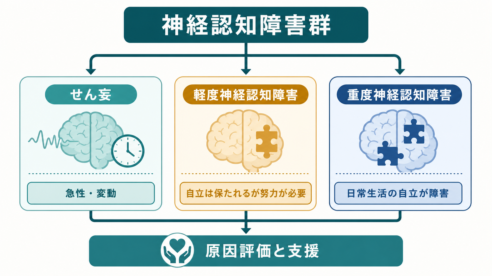
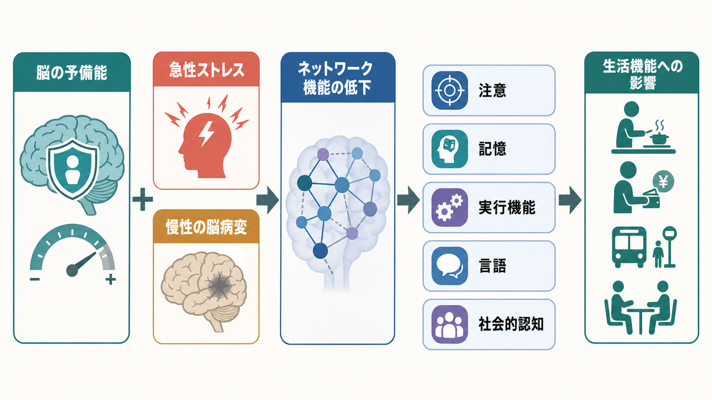
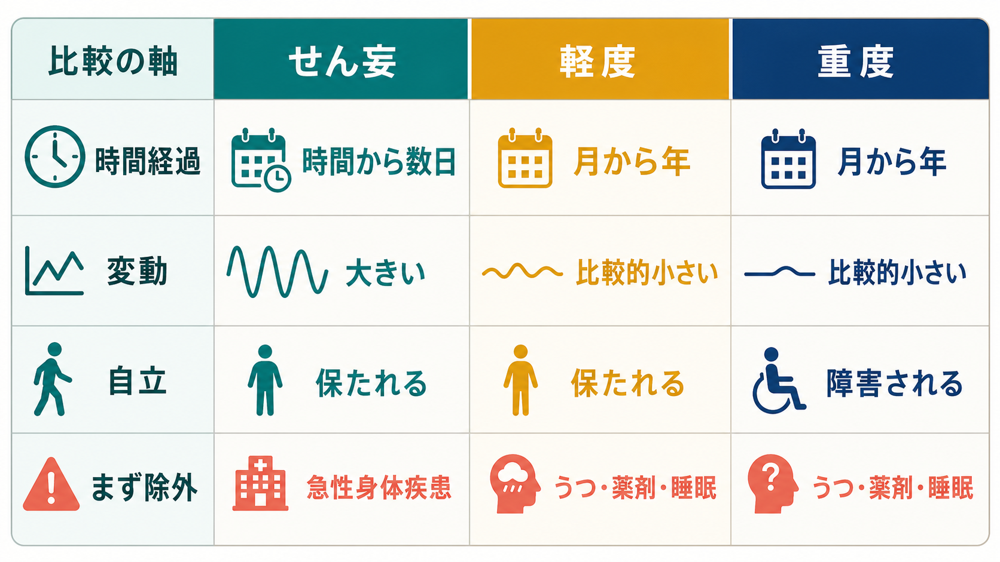

# 神経認知障害群とは何か

## 要点

- 神経認知障害群は、注意、記憶、実行機能、言語、知覚運動、社会的認知などの[[認知機能]]の低下を主徴とする疾患群である。
- DSM-5 系では大きく、急性・変動性の**せん妄**、自立がおおむね保たれる**軽度神経認知障害**、自立した日常生活が障害される**重度神経認知障害**に分けて考える[1]。
- 「認知症」は重度神経認知障害にかなり重なるが、神経認知障害群という枠組みは、軽度段階や原因別分類も含めて認知機能低下を扱う。
- 臨床では、認知機能の点数だけでなく、時間経過、意識・注意の変動、生活機能、薬剤・身体疾患・うつ病・睡眠などの可逆的要因を合わせて評価する[2][3]。

## この記事で答える問い

- 神経認知障害群は、認知症や軽度認知障害とどう違うのか。
- せん妄、軽度神経認知障害、重度神経認知障害は何を軸に区別するのか。
- 認知機能低下は、脳ネットワークや生活機能とどのようにつながるのか。
- 研究・臨床では、何を測り、何を除外し、どこに介入するのか。

## まず結論

神経認知障害群は、「脳の病変や身体状態の変化に伴って、以前より認知機能が低下し、その程度や時間経過によって生活への影響が変わる状態」を整理するための診断カテゴリーである。中心は、もの忘れだけではない。注意を保てない、計画できない、言葉が出にくい、視空間を扱いにくい、相手の意図を読み取りにくい、といった多様な認知ドメインが対象になる[1][2]。

最初に見るべき分岐は、**急性で変動するか**である。数時間から数日で出現し、注意や覚醒が大きく揺れるなら、まずせん妄を疑う。月から年の単位で進む低下で、日常生活の自立が保たれるなら軽度、金銭管理・服薬管理・移動・家事などの自立が障害されるなら重度神経認知障害として考える[2][3]。

## 背景

従来の「認知症」という語は、一般には記憶障害を中心に理解されやすい。しかし臨床的には、記憶以外の認知機能が前景に出る病態も多い。前頭側頭型認知症では行動や言語、レビー小体型認知症では注意の変動や幻視、血管性認知症では実行機能や処理速度の低下が目立つことがある。したがって、認知症を「もの忘れの病気」とだけ考えると、評価の入口を狭めてしまう。

DSM-5 以降の神経認知障害群という名称は、認知機能低下を単一の疾患名ではなく、**重症度**と**原因**の組み合わせとして扱う。原因には、アルツハイマー病、血管性病変、レビー小体病、前頭側頭葉変性症、外傷性脳損傷、物質・薬剤、HIV、プリオン病、パーキンソン病、ハンチントン病、複数病因などが含まれる[1]。この見方は、[[DSMとICDは何が違うのか]]で扱う診断分類の考え方とも接続する。

公衆衛生上も重要である。WHO は、認知症を記憶・思考・日常活動に影響する複数疾患の総称として位置づけ、2021年時点で世界に約5700万人が認知症とともに生活していると報告している[4]。一方で、すべての認知機能低下が不可逆的な神経変性とは限らない。せん妄、薬剤、感染、脱水、内分泌異常、睡眠障害、うつ病などは、評価と介入の優先順位を変える。

## 基本概念

### 1. せん妄

せん妄は、注意と意識・覚醒の障害が短期間に出現し、日内または時間単位で変動する状態である[2][5]。高齢者、認知症のある人、重い身体疾患、手術後、ICU、脱水、感染、薬剤変更などで起こりやすい。重要なのは、せん妄を「急に認知症が進んだ」と誤認しないことである。せん妄は原因検索と身体管理の優先度が高い。

### 2. 軽度神経認知障害

軽度神経認知障害は、以前の水準から認知機能が低下しているが、日常生活の基本的な自立は保たれている状態である。ただし、ミスを減らすためにメモ、家族の確認、作業時間の延長などの代償が必要になる[1]。アルツハイマー病研究でいう軽度認知障害、MCI と重なる部分があるが、MCI が主に高齢期・認知症前段階の研究概念として発展したのに対し、軽度神経認知障害は原因や年齢をより広く含む診断概念である[6]。

### 3. 重度神経認知障害

重度神経認知障害は、認知機能低下が日常生活の自立を妨げる段階である。これは一般に「認知症」と呼ばれる状態に近い。たとえば、金銭管理、服薬管理、買い物、交通機関の利用、料理、予定管理、対人判断などで、本人だけでは安全に行うことが難しくなる[2][7]。

### 4. 認知ドメイン

神経認知障害群で評価する認知ドメインは、[[認知機能検査は何を測っているのか]]や[[認知機能低下はどのように評価するのか]]と深く関係する。

| ドメイン | 例 | 生活上の現れ |
|---|---|---|
| 複雑性注意 | 持続注意、分配注意、処理速度 | 会話を追えない、手順が途中で抜ける |
| 実行機能 | 計画、抑制、柔軟な切り替え | 家事や金銭管理が混乱する |
| 学習と記憶 | 新しい情報の保持、想起 | 同じ質問を繰り返す、予定を忘れる |
| 言語 | 呼称、理解、流暢性 | 言葉が出ない、話の理解が難しい |
| 知覚運動 | 視空間、構成、操作 | 道に迷う、物の位置関係を誤る |
| 社会的認知 | 表情・意図・規範の理解 | 対人判断が変わる、配慮が難しくなる |

## 仕組み

認知機能低下は、単一の「記憶中枢」が壊れるだけでは説明できない。多くの場合、脳内の複数領域を結ぶ[[脳内ネットワークとは何か|脳内ネットワーク]]の効率、同期、予備能が変化する。アルツハイマー病では海馬・側頭頭頂領域を含む記憶ネットワークが、血管性病変では前頭葉皮質下回路や白質ネットワークが、レビー小体病では注意・覚醒・視覚処理に関わるネットワークが影響を受けやすい。

この流れを単純化すると、次のようになる。

1. 加齢、神経変性、血管病変、外傷、炎症、薬剤、代謝異常などが脳の予備能を下げる。
2. 感染、脱水、手術、睡眠不足、薬剤変更などの急性ストレスが加わると、注意・覚醒系が破綻し、せん妄として表れることがある[5]。
3. 慢性的な神経変性や血管性変化が進むと、記憶、実行機能、言語、社会的認知などのドメインに持続的な低下が出る。
4. 低下が代償可能な範囲なら軽度、独立した生活の維持を妨げるなら重度として評価される。

神経伝達物質も関与する。たとえば、アセチルコリン系は注意や記憶に関わり、せん妄やアルツハイマー病の理解で重要である。詳細は[[アセチルコリンは注意や記憶にどう関わるのか]]および[[アセチルコリン系は認知症とどう関わるのか]]に接続できる。

## 図解

次の比較は、臨床で最初に整理する軸を示す。実際の診断では、この表だけで決めるのではなく、本人・家族からの病歴、身体診察、認知機能評価、生活機能評価、薬剤確認、検査所見を合わせる。

| 観点 | せん妄 | 軽度神経認知障害 | 重度神経認知障害 |
|---|---|---|---|
| 時間経過 | 数時間から数日 | 月から年 | 月から年 |
| 変動 | 大きい | 比較的小さい | 比較的小さいが病型により変動あり |
| 中心症状 | 注意・覚醒の障害 | 認知機能低下と代償 | 認知機能低下と自立障害 |
| 生活機能 | 急に崩れる | 基本的自立は保たれる | 自立した日常生活が障害される |
| まず考えること | 急性身体疾患、薬剤、中毒、離脱 | 原因評価、進行リスク、支援 | 原因評価、安全、ケア、意思決定支援 |

## 臨床・研究との接続

臨床では、神経認知障害群の評価は「検査点数を出すこと」だけではない。[[MSEで認知機能をどう評価するか|精神状態診察]]では、意識水準、注意、見当識、記憶、言語、思考、気分、知覚、病識を観察する。スクリーニング検査として MMSE や MoCA が使われることがあるが、教育歴、文化、感覚障害、疲労、うつ、不安、睡眠不足の影響を受けるため、点数だけで生活上の困難を決めつけない。

原因評価では、せん妄の除外が先に来る。急性変化がある場合は、感染、脱水、低酸素、電解質異常、低血糖、肝腎機能、疼痛、便秘、尿閉、薬剤、アルコール・物質、睡眠環境などを確認する[2][5]。慢性経過では、神経変性疾患、脳血管障害、正常圧水頭症、甲状腺機能、ビタミンB12欠乏、うつ病、睡眠時無呼吸、薬剤性などを整理する。

研究では、臨床症候だけでなく、バイオマーカー、脳画像、神経心理検査、生活機能尺度、介護者報告が組み合わされる。アルツハイマー病では、NIA-AA の診断枠組みが、臨床症状と病態特異的バイオマーカーを分けて考える方向を示してきた[6][7]。ただし、バイオマーカー陽性がただちに本人の生活機能や支援ニーズを決定するわけではない。

予防と支援の観点では、認知症リスクは個人だけの問題ではない。Lancet Commission は、教育、聴力、血圧、喫煙、肥満、うつ、身体活動、糖尿病、アルコール、頭部外傷、大気汚染、社会的孤立、脂質、視力など、ライフコースを通じた修正可能な要因を整理している[8]。これは「認知症を完全に防げる」という意味ではなく、発症を遅らせたり、障害を軽くしたり、暮らしの質を支える余地があるという意味で読むべきである。

## よくある誤解

### 誤解1: 認知症は老化だから仕方ない

加齢は最大級のリスク因子だが、認知症は通常の老化そのものではない。WHO も、認知症は生物学的加齢から期待される範囲を超える認知機能低下を伴う症候群として説明している[4]。

### 誤解2: もの忘れがなければ神経認知障害ではない

記憶以外の低下が前景に出ることがある。実行機能、注意、言語、視空間、社会的認知の低下は、本人よりも家族や職場が先に気づく場合がある。

### 誤解3: 検査点数が正常なら困っていない

高学歴、職業経験、代償方略がある人では、短いスクリーニング検査で低下が見えにくいことがある。逆に、低教育歴、言語・聴覚・視覚の問題、不安や疲労で点数が低く出ることもある。[[認知機能検査は何を測っているのか]]で扱うように、検査は生活機能と病歴の中で解釈する。

### 誤解4: せん妄は精神科だけの問題である

せん妄は脳の急性機能不全として現れるが、背景には感染、脱水、薬剤、臓器不全、疼痛、環境変化などがある。精神症状として見えても、まず身体疾患と薬剤を確認する必要がある[5]。

## 関連ノート

- [[認知機能低下はどのように評価するのか]]
- [[認知機能検査は何を測っているのか]]
- [[認知機能障害とは何か]]
- [[MSEで認知機能をどう評価するか]]
- [[DSMとICDは何が違うのか]]
- [[アルツハイマー病では脳内で何が起きているのか]]
- [[アセチルコリン系は認知症とどう関わるのか]]
- [[脳内ネットワークとは何か]]
- [[睡眠障害は脳機能にどのような影響を与えるのか]]
- [[うつ病とは何か]]

### MOC 更新候補

- [[MOC｜精神医学]]
- [[MOC｜認知機能]]
- [[MOC｜神経科学と精神疾患]]

### 今後の作成候補

- せん妄とは何か
- 軽度神経認知障害とは何か
- 重度神経認知障害とは何か
- レビー小体型認知症とは何か
- 血管性認知症とは何か
- 前頭側頭型認知症とは何か

## 理解チェック

1. せん妄と重度神経認知障害を区別するとき、最初に見るべき時間経過と注意の特徴は何か。
2. 軽度神経認知障害と重度神経認知障害を分ける中心的な軸は、検査点数だけでなく何か。
3. 認知機能低下を評価するとき、薬剤、睡眠、うつ、身体疾患を確認する理由は何か。
4. 「認知症はもの忘れである」という説明では見落としやすい認知ドメインを3つ挙げられるか。

## 参考文献

[1] American Psychiatric Association. *Mild Neurocognitive Disorder*. DSM-5 fact sheet. https://www.psychiatry.org/File%20Library/Psychiatrists/Practice/DSM/APA_DSM-5-Mild-Neurocognitive-Disorder.pdf

[2] Huang J. Dementia (Major Neurocognitive Disorder). *MSD Manual Professional Edition*. Reviewed/Revised Feb 2025, Modified Jan 2026. https://www.msdmanuals.com/professional/neurologic-disorders/delirium-and-dementia/dementia

[3] Huang J. Overview of Delirium and Dementia. *MSD Manual Professional Edition*. Modified Feb 2025. https://www.msdmanuals.com/professional/neurologic-disorders/delirium-and-dementia/overview-of-delirium-and-dementia

[4] World Health Organization. Dementia fact sheet. 31 March 2025. https://www.who.int/news-room/fact-sheets/detail/dementia

[5] Inouye SK, Westendorp RGJ, Saczynski JS. Delirium in elderly people. *Lancet*. 2014;383(9920):911-922. https://doi.org/10.1016/S0140-6736(13)60688-1

[6] Albert MS, DeKosky ST, Dickson D, et al. The diagnosis of mild cognitive impairment due to Alzheimer's disease: recommendations from the National Institute on Aging-Alzheimer's Association workgroups on diagnostic guidelines for Alzheimer's disease. *Alzheimer's & Dementia*. 2011;7(3):270-279. https://doi.org/10.1016/j.jalz.2011.03.008

[7] McKhann GM, Knopman DS, Chertkow H, et al. The diagnosis of dementia due to Alzheimer's disease: recommendations from the National Institute on Aging-Alzheimer's Association workgroups on diagnostic guidelines for Alzheimer's disease. *Alzheimer's & Dementia*. 2011;7(3):263-269. https://doi.org/10.1016/j.jalz.2011.03.005

[8] Livingston G, Huntley J, Liu KY, et al. Dementia prevention, intervention, and care: 2024 report of the Lancet standing Commission. *Lancet*. 2024;404(10452):572-628. https://doi.org/10.1016/S0140-6736(24)01296-0

## 未解決問題

- 神経認知障害の原因別分類を、臨床でどこまで病理学的に同定できるか。
- バイオマーカー陽性の前臨床段階を、本人の権利・不安・保険・就労とどう調整するか。
- 軽度段階での介入が、生活機能、介護負担、本人の意味ある活動をどの程度変えるか。
- 文化・教育歴・言語差を踏まえた認知機能評価を、地域臨床でどう標準化するか。

