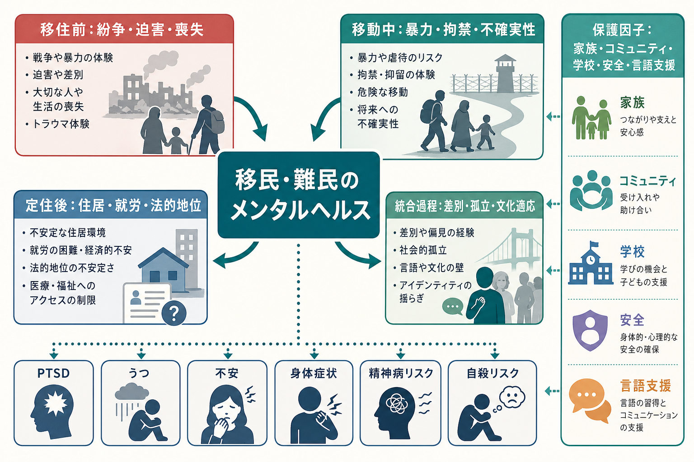
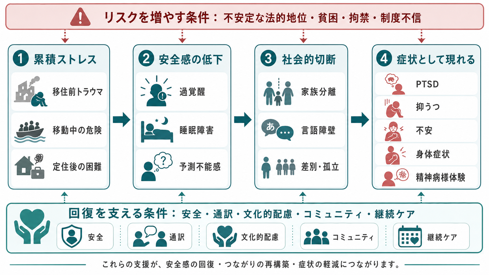
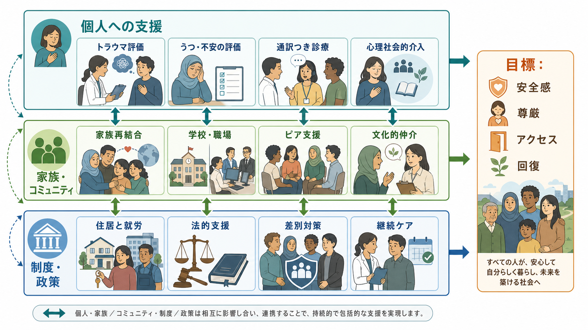

# 移民・難民のメンタルヘルス問題とは何か

## 要点

- 移民・難民のメンタルヘルス問題は、「移動したこと」そのものではなく、移住前の暴力や喪失、移動中の危険、定住後の貧困・法的地位の不安定さ・差別・言語障壁が重なって生じる。
- 典型的には [[PTSDとは何か|PTSD]]、[[うつ病とは何か|うつ病]]、[[不安症群とは何か|不安症]]、身体症状、睡眠障害、悲嘆、物質使用、自殺リスク、場合によっては精神病様体験や [[初回エピソード精神病とは何か|精神病]] リスクが問題になる。
- 支援では、症状だけでなく、安全、住居、就労、法的支援、通訳、文化的配慮、家族・コミュニティとのつながりを同時に扱う必要がある。
- 臨床では「文化差を病理化しない」「トラウマだけに還元しない」「支援制度への不信や沈黙を抵抗と決めつけない」ことが重要である。

## この記事で答える問い

この記事では、移民・難民のメンタルヘルス問題を、精神疾患名の一覧ではなく、移住過程に沿ったリスクと保護因子の組み合わせとして整理する。特に、トラウマ、文化適応、差別、言語障壁、社会的孤立が、どのように症状、受診行動、支援アクセスに影響するのかを扱う。

## まず結論

移民・難民のメンタルヘルス問題とは、移住前・移動中・定住後・統合過程にまたがる累積的ストレスが、心理的安全感、身体反応、社会的つながり、制度アクセスを揺さぶることで生じる精神保健上の困難である。WHO は、逆境を経験した移民・難民では、うつ、不安、PTSD、自殺、精神病などのリスクが高まりうる一方で、多くの人は地域社会に貢献し、適切な支援によって回復と適応が可能であると整理している [1]。

重要なのは、移民・難民を「脆弱な人々」と一括りにすることではない。移住の理由、法的地位、家族分離、言語、宗教、ジェンダー、年齢、教育、滞在国の政策によってリスクは大きく異なる。したがって、評価と支援は、個人の症状と社会的条件の両方を見る必要がある [2]。

## 背景

世界的な移動人口は増加しており、WHO は 2026 年時点の概説で、世界で約 8 人に 1 人が移動の途上または移動経験をもつと説明している [3]。移民には、就労、教育、家族再結合など比較的選択性の高い移動もあれば、戦争、迫害、災害、貧困、暴力から逃れるための非自発的移動もある。難民や庇護希望者は、特に移住前後の逆境が重なりやすい。

精神医学的には、難民・庇護希望者では PTSD と抑うつの有病率が高く、臨床面接に基づくメタ解析では成人難民・庇護希望者の PTSD は約 31%、うつ病も約 31.5% と推定された [4]。ただし、推定値には大きな異質性があり、出身地域、滞在国、サンプリング、診断方法、通訳の有無、滞在期間によって変わる。したがって、数字は「全員に当てはまる率」ではなく、支援体制を設計するための目安として読むべきである。

## 基本概念

### 移民・難民・庇護希望者

「移民」は、国境を越えるか国内で居住地を移す人々を広く含む概念である。「難民」は、迫害、紛争、暴力などにより帰国できない、または帰国を望めない人を指す法的・国際保護上の概念である。「庇護希望者」は、保護を求めて申請中の人を指す。実際の臨床では、法的区分は支援アクセス、就労、住居、家族再結合、強制送還への恐怖に直結するため、単なる背景情報ではない [2]。

### 移住前・移動中・定住後・統合過程

移民・難民のメンタルヘルスは、次の 4 段階で見ると理解しやすい。

| 段階 | 主なストレス | 典型的な影響 |
|---|---|---|
| 移住前 | 戦争、迫害、拷問、性暴力、貧困、教育機会の喪失、家族の死別 | [[急性ストレス障害とは何か|急性ストレス反応]]、PTSD、悲嘆、抑うつ |
| 移動中 | 危険な移動、拘禁、搾取、密航、医療・食料・安全の欠如 | 過覚醒、睡眠障害、不信、身体症状 |
| 定住後 | 住居不安、失業、法的地位の不安定さ、医療アクセス不足 | 抑うつ、不安、慢性ストレス、家族葛藤 |
| 統合過程 | 差別、孤立、文化適応、言語障壁、アイデンティティの揺らぎ | 自尊感情の低下、孤立、受診遅延、精神病リスクの増加 |

ポスト移住ストレスのレビューでは、難民・庇護希望者の精神症状は過去のトラウマだけでなく、定住後の生活困難、社会的孤立、家族分離、就労・法的問題とも関連することが示されている [5]。

## 仕組み

### 1. 累積ストレスと安全感の低下

暴力や迫害を経験した後に、移動中の危険や定住後の不安定さが続くと、身体は「危険が終わっていない」状態に置かれやすい。これは過覚醒、悪夢、睡眠障害、易怒性、集中困難、身体痛として現れることがある。[[複雑性PTSDとは何か|複雑性PTSD]] に近い対人不信、感情調整困難、自己評価の低下が前景に出る場合もある。

### 2. 文化適応とアイデンティティの負荷

文化適応は、単に滞在国の言語や習慣に慣れることではない。家族内で世代差が生じる、宗教的実践が維持しにくい、職業的地位が下がる、出身国での資格が認められない、子どもが親より早く言語を習得して家族内役割が変わる、といった変化を含む。これらは [[適応障害とは何か|適応障害]]、抑うつ、不安、家族葛藤の背景になりうる。

### 3. 差別・孤立・社会的敗北

人種差別、排外主義、宗教差別、制度的差別は、心理的ストレスであるだけでなく、住居、就労、教育、医療へのアクセスを狭める。庇護希望者を対象にした系統的レビューでは、就労条件、社会ネットワーク、経済階層、住居、医療、コミュニティ、移民制度など、定住後の社会環境要因が精神健康と関連することが整理されている [6]。

精神病についても、移民とその子どもでは非感情性精神病や感情性精神病の発症リスクが高いことを示す発症率研究のメタ解析があり、社会的排除が病因的役割をもつ可能性が議論されている [7]。これは「移民であることが精神病を生む」という単純な意味ではなく、差別、孤立、低い社会的地位、地域での少数派性、慢性的脅威感が重なるとリスクが高まりうる、という社会疫学的な見方である。

### 4. 言語障壁と受診アクセス

言語障壁は、症状の説明、服薬理解、心理療法、同意、守秘への信頼を直接左右する。通訳がいない診療では、過去の暴力体験、希死念慮、家庭内暴力、宗教的・文化的意味づけが十分に聞き取れないことがある。一方で、同じコミュニティの通訳を使うと守秘への不安が生じる場合もある。したがって、訓練された医療通訳、文化的仲介者、文書翻訳、やさしい言語での説明が必要になる [2]。

## 図解

上の 2 枚の図は、移民・難民のメンタルヘルスを「トラウマだけ」ではなく、移住過程全体の累積ストレスとして見るための概念図である。特に重要なのは、リスク因子と保護因子が同じ時点で同時に働くことである。たとえば、住居が不安定でも学校や宗教コミュニティが支えになる場合があり、逆に法的地位が安定していても差別や孤立が強ければ症状が長引くことがある。

## 臨床・研究との接続

### 評価

臨床評価では、診断面接に加えて、次の点を確認する。

| 評価領域 | 確認したいこと |
|---|---|
| 安全 | 現在の暴力、搾取、住居不安、強制送還への恐怖、自殺リスク |
| トラウマ | 戦争、迫害、拘禁、拷問、性暴力、家族喪失。ただし詳細聴取は段階的に行う |
| 症状 | PTSD、抑うつ、不安、睡眠、身体症状、解離、物質使用、精神病様体験 |
| 生活基盤 | 住居、食事、就労、学校、法的支援、医療保険、移動手段 |
| 言語と文化 | 希望言語、通訳の必要性、宗教・文化的実践、説明モデル |
| 支援資源 | 家族、同郷コミュニティ、学校、職場、NPO、行政、医療機関 |

希死念慮や [[自殺関連行動障害とは何か|自殺関連行動]] がある場合、法的・社会的支援の欠如を「精神科だけで解決できる問題」として扱わないことが重要である。安全確保、危機介入、住居・法的支援、家族・コミュニティ支援を組み合わせる。

### 介入

心理社会的介入のメタ解析では、庇護希望者・難民に対する心理社会的介入は、待機リストや通常ケアと比べて一部の症状改善に有効である可能性が示されている [8]。ただし、介入効果は文脈依存であり、言語、文化、法的地位、継続性、生活基盤が整っていないと、症状への介入だけでは十分に機能しにくい。

実践上は、次の順序で考えるとよい。

1. 安全と基本ニーズを確認する。
2. 通訳と説明の方法を整える。
3. 本人の文化的説明モデルを聞く。
4. PTSD、うつ、不安、身体症状、精神病症状、自殺リスクを評価する。
5. 心理教育、睡眠支援、問題解決支援、トラウマ焦点化治療、薬物療法、家族・コミュニティ支援を必要に応じて組み合わせる。
6. 法的支援、住居、就労、学校、福祉サービスと連携する。

### 研究

研究では、対象集団の異質性が大きな課題である。難民、庇護希望者、移民労働者、留学生、国内避難民を同じ集団として扱うと、リスク推定や介入効果がぼやける。また、言語、診断尺度、通訳の使用、文化的妥当性、サンプリングの偏り、非正規滞在者の不可視化が結果を左右する [2],[4]。

## よくある誤解

### 誤解1：移民・難民はみなトラウマを抱えている

多くの難民が深刻な逆境を経験する一方で、全員が PTSD やうつ病になるわけではない。家族、信仰、教育、仕事、地域コミュニティ、本人の対処能力は保護因子になる。トラウマを前提にしすぎると、本人の強みや現在の生活課題を見落とす。

### 誤解2：文化の違いだから治療対象ではない

文化は症状表現や助けの求め方に影響するが、苦痛や機能低下がある場合に支援を不要にする理由にはならない。身体症状、睡眠障害、怒り、沈黙、宗教的語りなどは、文化的意味を尊重しつつ、精神医学的評価の入口にもなる。

### 誤解3：言語が通じれば問題は解決する

通訳は重要だが、通訳だけで制度不信、差別経験、法的地位の不安、医療費、移動手段、守秘への不安が解消されるわけではない。言語支援は、文化的安全性と制度アクセスを支える一部である。

### 誤解4：移民・難民の問題は精神科だけの問題である

精神科診療は重要だが、住居、法的支援、就労、教育、差別対策、地域参加が改善しないと、症状は再燃しやすい。移民・難民のメンタルヘルスは、臨床精神医学と公衆衛生、福祉、教育、法制度の接点にある。

## 関連ノート

- [[PTSDとは何か]]
- [[複雑性PTSDとは何か]]
- [[急性ストレス障害とは何か]]
- [[うつ病とは何か]]
- [[不安症群とは何か]]
- [[適応障害とは何か]]
- [[初回エピソード精神病とは何か]]
- [[自殺関連行動障害とは何か]]

### MOC更新候補

- `content/00_MOC/` 配下の精神医学、トラウマ、臨床実践、公衆衛生系 MOC に追加候補。
- 並列ジョブとの競合を避けるため、本ジョブでは MOC ファイル自体は更新しない。

### 今後の作成候補

- 移民・難民のメンタルヘルス支援における医療通訳とは何か
- 文化的定式化面接とは何か
- 難民支援における心理社会的支援とは何か
- 移住後ストレスとは何か
- 差別と精神病リスクはどう関係するのか

## 理解チェック

1. 移民・難民の精神症状を、移住前トラウマだけで説明すると何を見落とすか。
2. 言語障壁は、診断、同意、心理療法、守秘への信頼にどのように影響するか。
3. PTSD、うつ、不安、身体症状、精神病様体験を評価するとき、同時に確認すべき生活・制度上の条件は何か。
4. 「文化差」と「治療が必要な苦痛・機能低下」をどう区別し、どう両立して扱うか。

## 参考文献

[1] World Health Organization. (2025). *Refugee and migrant mental health*. https://www.who.int/news-room/fact-sheets/detail/refugee-and-migrant-mental-health

[2] World Health Organization. (2023). *Mental health of refugees and migrants: risk and protective factors and access to care*. Global Evidence Review on Health and Migration series. https://iris.who.int/handle/10665/373279

[3] World Health Organization. (2026). *Refugee and migrant health*. https://www.who.int/news-room/fact-sheets/detail/refugee-and-migrant-health

[4] Blackmore, R., Boyle, J. A., Fazel, M., Ranasinha, S., Gray, K. M., Fitzgerald, G., Misso, M., & Gibson-Helm, M. (2020). The prevalence of mental illness in refugees and asylum seekers: A systematic review and meta-analysis. *PLOS Medicine, 17*(9), e1003337. https://doi.org/10.1371/journal.pmed.1003337

[5] Li, S. S. Y., Liddell, B. J., & Nickerson, A. (2016). The relationship between post-migration stress and psychological disorders in refugees and asylum seekers. *Current Psychiatry Reports, 18*(9), 82. https://doi.org/10.1007/s11920-016-0723-0

[6] Jannesari, S., Hatch, S., Prina, M., & Oram, S. (2020). Post-migration social-environmental factors associated with mental health problems among asylum seekers: A systematic review. *Journal of Immigrant and Minority Health, 22*, 1055-1064. https://doi.org/10.1007/s10903-020-01025-2

[7] Selten, J.-P., van der Ven, E., & Termorshuizen, F. (2020). Migration and psychosis: A meta-analysis of incidence studies. *Psychological Medicine, 50*(2), 303-313. https://doi.org/10.1017/S0033291719000035

[8] Turrini, G., Purgato, M., Acarturk, C., Anttila, M., Au, T., Ballette, F., Bird, M., Carswell, K., Churchill, R., Cuijpers, P., et al. (2019). Efficacy and acceptability of psychosocial interventions in asylum seekers and refugees: Systematic review and meta-analysis. *Epidemiology and Psychiatric Sciences, 28*(4), 376-388. https://doi.org/10.1017/S2045796019000027

## 未解決問題

- 文化的に妥当な診断尺度と、複数言語での測定等価性をどう確保するか。
- 非正規滞在者、拘禁経験者、LGBTIQ+ 難民、障害のある移民、無伴奏未成年者など、調査から漏れやすい集団をどう含めるか。
- トラウマ焦点化治療、地域支援、法的支援、住居・就労支援をどのように統合したときに、長期的な回復に最も寄与するか。
