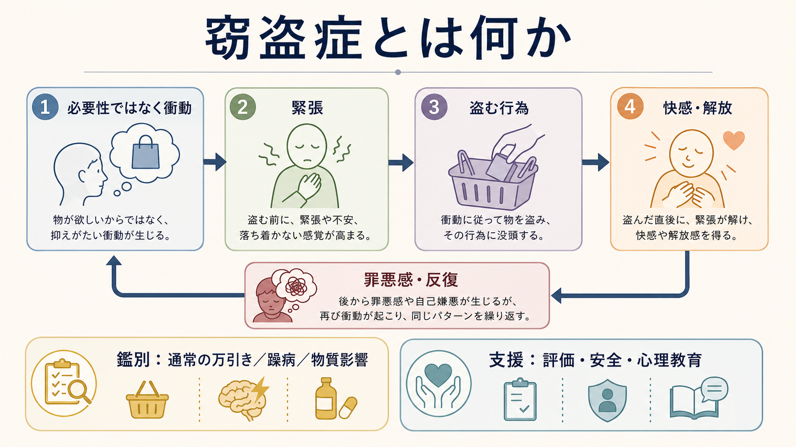
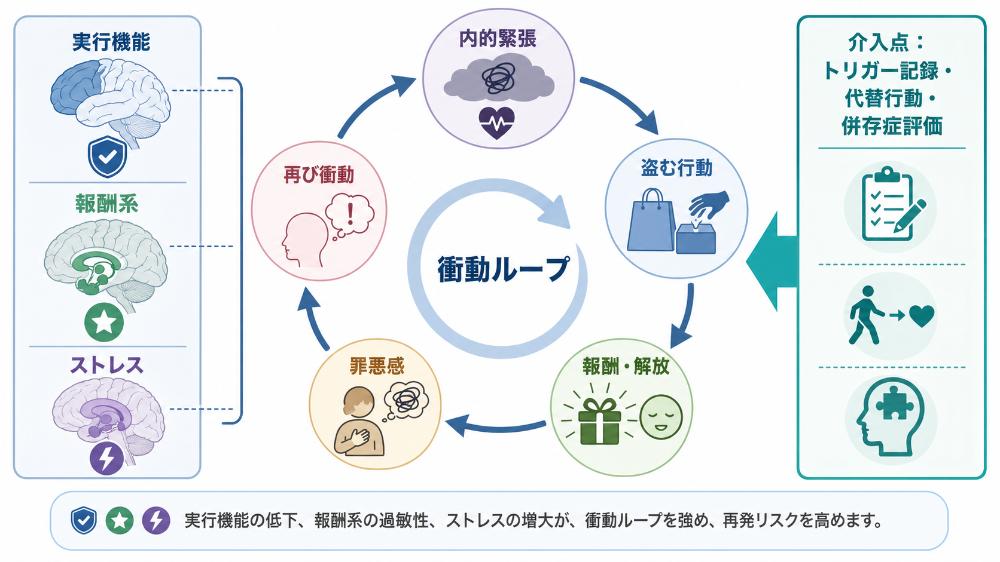
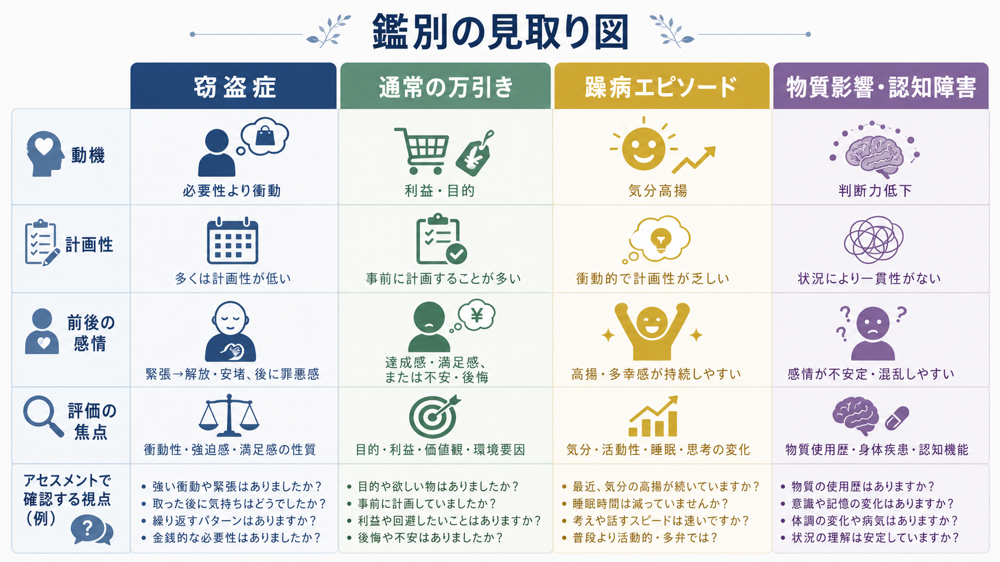

# 窃盗症とは何か

## 要点

- 窃盗症（kleptomania）は、金銭的利益や実用上の必要性ではなく、強い衝動に駆られて物を盗む行動が反復する疾患である。DSM-5-TR では「破壊的・衝動制御・素行症群」に、ICD-11 では衝動制御症群の一つに位置づけられる[1][2]。
- 典型的には、盗む前に緊張や情動的高まりが増し、盗む最中から直後に快感・興奮・解放感・満足感が生じ、その後に罪悪感や後悔が続く。この「緊張から解放へ」の循環が反復を支える[1][2]。
- 診断では、通常の万引き、利益目的の窃盗、[[躁病エピソードとは何か]]、物質 intoxication、[[物質使用障害とは何か]]、認知障害、妄想・幻覚、素行症や反社会性パーソナリティの文脈を丁寧に鑑別する必要がある[1][2]。
- 窃盗症は比較的まれで、隠されやすく、本人が窃盗症そのものを主訴に受診しないことも多い。臨床例では[[うつ病とは何か]]、不安症、[[摂食障害群とは何か]]、物質使用、他の衝動制御症状との併存が報告されている[3][4]。
- 研究上は、[[強迫症とは何か]]に近い反復・緊張低減の側面、[[ギャンブル障害とは何か]]や物質使用に近い報酬・渇望の側面、気分障害との関連を併せ持つ異質な病態として理解される[4][5][6]。
- 本記事は教育・研究目的の概説であり、個別の診断や治療指示ではない。法的・安全上の問題を伴う場合や本人・周囲の生活に支障がある場合は、専門職による評価が必要である。

## この記事で答える問い

1. 窃盗症は「盗み癖」や「通常の万引き」と何が違うのか。
2. なぜ「必要でもない物」を盗む行動が反復するのか。
3. 診断・評価ではどのような鑑別と併存を考えるのか。
4. 強迫症、行動嗜癖、気分障害、物質使用障害とはどう接続するのか。
5. 研究と臨床では、どこまでが確立し、どこからが未解決なのか。

## まず結論

窃盗症を理解するうえで重要なのは、「盗んだ物が欲しかったから盗む」という単純な説明から離れることである。窃盗症では、物の価値や必要性よりも、盗む前の緊張、抑えがたい衝動、盗んだ瞬間の快感・解放、そしてその後の罪悪感や後悔が中心になる[1][2]。

この特徴のため、窃盗症は道徳的非難だけで捉えると理解を誤る。一方で、疾患概念として理解することは、行為の社会的・法的結果を免除するという意味ではない。臨床的には、本人の苦痛、衝動制御、併存症、安全、再発リスク、家族や職場への影響、法的状況を分けて評価する必要がある。

## 背景

窃盗症は長く知られてきたが、研究蓄積は多くない。理由の一つは、本人が恥や逮捕への恐れから行動を隠しやすく、窃盗症そのものではなく、抑うつ、不安、摂食症状、物質使用、対人問題などを主訴に受診しやすいことである[3]。

DSM-5-TR では、窃盗症は破壊的・衝動制御・素行症群に分類される。ICD-11 でも、窃盗症は「明らかな動機がないのに盗む強い衝動を制御できない」状態として整理され、盗む前の緊張、行為中・直後の快感や解放、他の精神・行動障害や物質 intoxication ではよりよく説明されないことが重視される[1][2]。詳しい分類体系の違いは [[DSMとICDは何が違うのか]] と接続して理解できる。

疫学的には、一般人口での厳密な有病率を推定する大規模研究は乏しい。ある大学生調査では基準を満たす者が 0.38% と報告され、比較的まれ、または隠されやすい可能性が示されている[5]。一方、米国 NESARC では「万引き経験」そのものは生涯 11.3% と報告されており、万引き経験と窃盗症診断は同じではない[5]。

## 基本概念

### 診断概念の核

窃盗症の核は、反復する窃盗行為ではなく、「必要性や金銭的価値によらない衝動制御の失敗」である。診断概念では、盗む物が本人にとって必要ではない、または金銭的価値を得る目的ではないこと、盗む前に緊張が高まること、行為中または直後に快感・満足・解放があることが重視される[1][2]。

このため、窃盗症では盗品が使われず、隠され、捨てられ、返されることもある。焦点は「物を得ること」より「衝動に従う行為そのもの」に置かれる。

### 通常の万引きとの違い

通常の万引きでは、欲しい物を得る、代金を払いたくない、仲間内での承認を得る、反抗を示す、利益を得るなど、比較的明確な目的があることが多い。窃盗症では、目的よりも衝動、緊張、解放、後悔のサイクルが中心になる[1][2]。

ただし、実際の臨床や司法場面では両者の境界は簡単ではない。本人の説明だけで判断せず、行動の反復性、計画性、盗品の扱い、前後の情動、併存症、認知機能、物質使用、気分エピソードを総合して評価する。

### 強迫症・行動嗜癖との位置関係

窃盗症には、[[強迫症とは何か]]に近い「侵入的な衝動」「緊張低減のための反復行動」がある。一方で、[[ギャンブル障害とは何か]]や物質使用障害に近い「渇望」「報酬」「再発」「家族歴・併存の重なり」も報告されている[4][6]。このため、窃盗症を単一のモデルで説明するより、強迫スペクトラム、衝動制御、行動嗜癖、気分調整の重なりとして捉えるほうが実態に近い。

## 仕組み

### 衝動ループ

窃盗症の典型的な循環は、次のように整理できる。

| 段階 | 何が起こるか | 臨床的に見る点 |
|---|---|---|
| トリガー | 店舗、特定の商品、孤独、ストレス、怒り、空虚感などで衝動が起こる | 場所・時間・感情・対人状況 |
| 内的緊張 | 盗む前に緊張、不安、身体的高まりが増す | 「抑えたいのに抑えにくい」感覚 |
| 盗む行動 | 衝動に従って盗む | 計画性、盗品の価値、同伴者、危険認識 |
| 報酬・解放 | 快感、興奮、安堵、緊張低下が生じる | 何が強化されているか |
| 罪悪感・後悔 | 恥、自己嫌悪、恐怖が生じる | 抑うつ、自傷念慮、孤立 |
| 再発準備 | ストレスや秘密保持が次の衝動を強める | [[再発予防計画とは何か]]との接続 |

この循環では、盗む行為が短期的には緊張を下げるため、長期的には問題を悪化させても再び選ばれやすくなる。これは強迫行為の負の強化、または行動嗜癖における報酬・渇望の学習と重なる部分がある[4][6]。

### 実行機能と報酬系

少数例の神経心理学的研究では、窃盗症において実行機能、抑制、認知的衝動性、意思決定の問題が示唆されている[5]。ただし、研究規模は小さく、特定の脳部位や単一の神経機構で説明できる段階ではない。

臨床的には、「衝動を感じた後に一呼吸置く」「店舗に入る前に計画を立てる」「盗む代わりの行動を選ぶ」「支援者に連絡する」といった実行機能を補う手続きが重要になる。これは本人の意志が弱いという説明ではなく、衝動が高まる場面で選択肢を狭めないための環境調整である。

### 併存症がループを強める

窃盗症では、抑うつ、不安、摂食障害、物質使用、他の衝動制御症状、パーソナリティ特性との関連が報告されている[3][4]。たとえば、気分の落ち込みや空虚感が強いときに衝動が増す、物質使用により判断力が低下する、摂食症状や買い物行動と同じ情動調整パターンを共有する、といった経路が考えられる。

そのため、窃盗行動だけを切り離して見ると、再発の条件を見落としやすい。[[双極性障害とは何か]]、[[うつ病とは何か]]、[[不安症群とは何か]]、[[摂食障害群とは何か]]、[[物質使用障害とは何か]]との鑑別・併存評価が必要になる。

## 図解

| 図 | 読み方 |
|---|---|
| 図1 | 窃盗症を「必要性ではなく衝動」「緊張」「盗む行為」「快感・解放」「罪悪感・反復」「鑑別」「支援」の全体像として見る |
| 図2 | 衝動ループと、実行機能・報酬系・ストレスがどこで関与しうるかを見る |
| 図3 | 窃盗症、通常の万引き、躁病エピソード、物質影響・認知障害を、動機・計画性・前後の感情・評価焦点で比べる |

## 臨床・研究との接続

### 評価では何を見るか

評価では、まず「何を盗んだか」だけでなく、「盗む前に何が起きたか」「盗む最中に何を感じたか」「盗んだ後にどうなったか」を時系列で確認する。特に、緊張、衝動、快感・解放、罪悪感、隠蔽、反復、法的問題、家族や職場への影響を分けて聴くことが重要である[3][8]。

同時に、気分エピソード、幻覚・妄想、物質使用、認知機能、発達歴、外傷体験、摂食症状、自傷リスク、借金や生活困窮、家庭内葛藤を評価する。窃盗症は本人の恥と秘密保持によって見えにくくなるため、責める面接よりも、行動連鎖を具体的に理解する面接が有用である。

### 鑑別

鑑別で特に重要なのは、盗みがどの文脈で起こっているかである。

| 鑑別対象 | 窃盗症との違いで見る点 |
|---|---|
| 通常の万引き・利益目的の窃盗 | 目的、計画性、盗品の利用、金銭的利益、仲間関係 |
| [[躁病エピソードとは何か]] | 気分高揚、睡眠欲求低下、多弁、活動性亢進、浪費、誇大的思考 |
| 物質 intoxication・[[物質使用障害とは何か]] | 使用直後か、判断力低下が物質で説明できるか、離脱や渇望 |
| 認知障害・神経疾患 | 記憶、判断力、人格変化、前頭側頭型認知症などの可能性 |
| 妄想・幻覚 | 命令性幻聴、被害妄想、奇異な信念に従った行動か |
| 素行症・反社会性パーソナリティ特性 | 反復する規範違反、攻撃性、欺瞞、他者の権利侵害の広がり |

ICD-11 では、素行・反社会的行動の文脈や躁病エピソードの文脈で盗みが起こる場合、窃盗症を別に診断しないという整理が示されている[2]。これは「盗んだ」という行為だけで疾患名を付けないための重要な注意点である。

### 支援と治療研究

窃盗症に対する治療研究は限られている。心理的介入では、衝動のトリガー記録、刺激統制、代替行動、問題解決、再発予防、恥への対処、家族支援などが臨床的に用いられる。これは [[心理教育とは何か]] や [[再発予防計画とは何か]] と接続して理解できる。

薬物療法では、SSRI、気分安定薬、抗てんかん薬、オピオイド拮抗薬などが検討されてきたが、十分に確立した標準治療があるとは言いにくい[6]。小規模な二重盲検プラセボ対照試験では、ナルトレキソンが窃盗衝動と行動の軽減に有効であったと報告されているが、対象者数は 25 名と小さく、一般化には慎重さが必要である[7]。薬物療法の適否は併存症、身体疾患、相互作用、法的・安全上の状況を含め、専門職が個別に判断する領域である。

### 研究上の課題

窃盗症研究の大きな課題は、サンプル数の少なさ、受診者バイアス、司法・臨床・一般人口での定義の違いである。万引き経験の研究をそのまま窃盗症の有病率に読み替えることはできない。今後は、行動嗜癖、強迫スペクトラム、気分調整、実行機能、報酬系、ストレス反応を統合する研究が必要である[4][5][6]。

## よくある誤解

### 誤解1: 窃盗症は単なる「盗み癖」である

窃盗症は、盗む行動があるだけで診断されるものではない。必要性や金銭的価値では説明しにくい衝動、盗む前の緊張、行為中・直後の解放、反復、苦痛や機能障害、鑑別診断を含めて判断する[1][2]。

### 誤解2: 診断名があれば責任は問われない

疾患として理解することと、社会的・法的結果がなくなることは別である。臨床的理解は、再発予防、安全確保、併存症治療、生活再建、支援につなげるための枠組みである。

### 誤解3: 欲しい物を盗むなら窃盗症ではない

窃盗症では「物がまったく欲しくない」場合もあるが、実際には欲しさ、緊張、衝動、快感、罪悪感が混在することもある。重要なのは、行為全体が利益や実用性だけで説明できるか、衝動制御の失敗と反復が中心かを丁寧に見ることである。

### 誤解4: 強迫症か依存症のどちらかに分類すれば十分である

窃盗症は、強迫症に似た緊張低減の側面と、行動嗜癖に似た報酬・渇望の側面を併せ持つ。どちらか一方に固定すると、個々の患者で重要な併存症や介入点を見落としやすい[4][6]。

## 関連ノート

- [[強迫症とは何か]]
- [[ギャンブル障害とは何か]]
- [[物質使用障害とは何か]]
- [[双極性障害とは何か]]
- [[躁病エピソードとは何か]]
- [[うつ病とは何か]]
- [[不安症群とは何か]]
- [[摂食障害群とは何か]]
- [[ためこみ症とは何か]]
- [[抜毛症とは何か]]
- [[皮膚むしり症とは何か]]
- [[心理教育とは何か]]
- [[再発予防計画とは何か]]
- [[DSMとICDは何が違うのか]]

## MOC更新候補

- `content/00_MOC/` 配下の精神医学系 MOC に、疾患・症候群ノートとして `[[窃盗症とは何か]]` を追加する候補。
- 衝動制御症、行動嗜癖、強迫スペクトラム、物質使用障害の関連ノート群から本記事へリンクする候補。
- 並列生成ジョブとの衝突を避けるため、本作業では MOC 本体は更新しない。

## 理解チェック

1. 窃盗症では、盗む物の価値や必要性よりも、どのような前後の心理過程が重要になるか。
2. 通常の万引き、躁病エピソード、物質影響による盗みと、窃盗症を区別する観点は何か。
3. 窃盗症を強迫症モデルだけ、または行動嗜癖モデルだけで説明すると、どのような限界があるか。
4. 本人が窃盗症を主訴にしない場合、どのような併存症や生活上の問題から気づける可能性があるか。
5. 支援を考えるとき、責めることよりも行動連鎖を理解することがなぜ重要か。

## 限界と未解決問題

- 窃盗症の一般人口有病率、自然経過、性差、発症年齢、文化差については、まだ十分な大規模研究が少ない。
- 薬物療法の研究は小規模であり、特定の薬剤を一般的な標準治療として断定できる段階ではない。
- 強迫症、行動嗜癖、気分障害、物質使用障害との境界は、分類上も臨床上も重なりが大きい。
- 法的文脈での診断使用には、臨床的評価と司法的判断を混同しない慎重さが必要である。

## 参考文献

[1] American Psychiatric Association. *Diagnostic and Statistical Manual of Mental Disorders, Fifth Edition, Text Revision (DSM-5-TR)*. American Psychiatric Association Publishing, 2022. https://doi.org/10.1176/appi.books.9780890425787

[2] World Health Organization. *ICD-11 for Mortality and Morbidity Statistics*, 2026-01 release, 6C71 Kleptomania. https://icd.who.int/browse/2026-01/mms/en

[3] Aboujaoude E, Gamel N, Koran LM. Overview of Kleptomania and Phenomenological Description of 40 Patients. *Primary Care Companion to The Journal of Clinical Psychiatry*. 2004;6(6):244-247. https://doi.org/10.4088/pcc.v06n0605

[4] Grant JE, Odlaug BL, Kim SW. Kleptomania: clinical characteristics and relationship to substance use disorders. *The American Journal of Drug and Alcohol Abuse*. 2010;36(5):291-295. https://doi.org/10.3109/00952991003721100

[5] Grant JE, Chamberlain SR. Symptom Severity and Its Clinical Correlates in Kleptomania. *Annals of Clinical Psychiatry*. 2018;30(2):97-101. https://pmc.ncbi.nlm.nih.gov/articles/PMC5935224/

[6] Grant JE. Understanding and treating kleptomania: new models and new treatments. *Israel Journal of Psychiatry and Related Sciences*. 2006;43(2):81-87. https://pubmed.ncbi.nlm.nih.gov/16910369/

[7] Grant JE, Kim SW, Odlaug BL. A double-blind, placebo-controlled study of the opiate antagonist, naltrexone, in the treatment of kleptomania. *Biological Psychiatry*. 2009;65(7):600-606. https://doi.org/10.1016/j.biopsych.2008.11.022

[8] Fariba KA, Gokarakonda SB. Impulse Control Disorders. *StatPearls*. Updated 2023 Aug 14. Treasure Island (FL): StatPearls Publishing; 2026 Jan-. https://www.ncbi.nlm.nih.gov/books/NBK562279/
