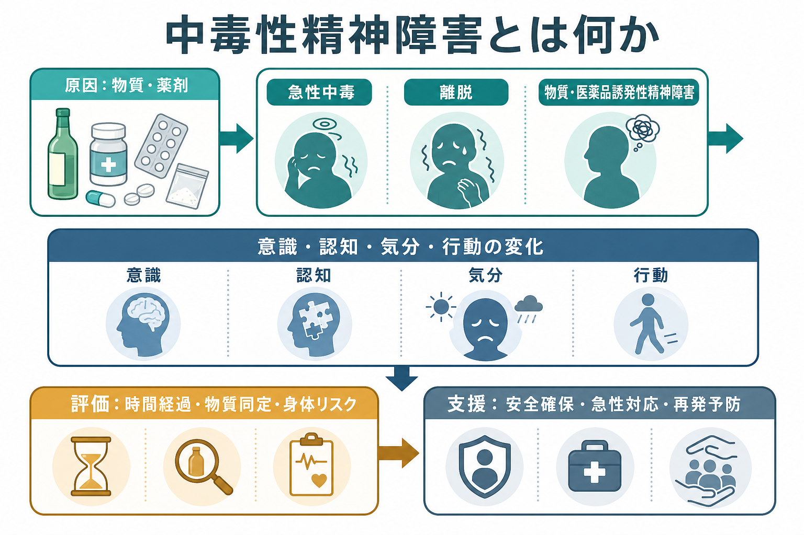
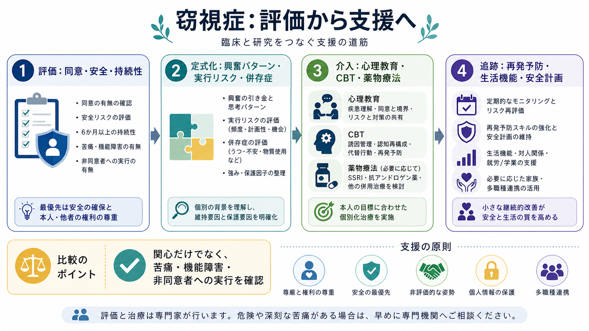

# 窃視症とは何か

## 要点

- 窃視症は、同意していない人が裸でいる、脱衣している、または性的活動をしている場面を覗くことに、反復的で強い性的興奮が結びつく病態である。
- ただし、性的関心や空想があるだけで直ちに診断されるわけではない。DSM-5-TRでは、少なくとも6か月以上の反復性、18歳以上、非同意者への実行、または本人の著しい苦痛・機能障害が重要になる[1]。
- ICD-11では、窃視症はパラフィリア症群の一つであり、英語名は voyeuristic disorder、コードは6D31である[2][3]。
- 臨床では、ラベル付けよりも、同意、安全、被害防止、本人の苦痛、生活機能、併存症、再発予防を丁寧に評価する。

## この記事で答える問い

1. 窃視症は、単なる「覗き趣味」や性的関心とどう違うのか。
2. DSM-5-TRとICD-11では、どのような点が診断の中心になるのか。
3. 窃視行動はどのような学習・報酬過程で維持されうるのか。
4. 臨床・研究では、どのように評価し支援につなげるのか。

## まず結論

窃視症は、同意のない他者を性的対象として観察する行為と性的興奮が結びつき、それが実行されたり、本人の苦痛や生活機能の障害をもたらしたりする場合に問題となる[[操作的診断とは何か|操作的診断]]上のカテゴリーである。重要なのは、性的関心そのものを一律に病理化することではなく、非同意者を巻き込む行為、被害の可能性、本人の制御困難、生活上の支障を区別することにある[1][2]。

## 背景

窃視症は、DSM-5-TRでは paraphilic disorders の中に位置づけられる。パラフィリア的な性的関心は、それだけで精神疾患とは限らない。臨床的に問題となるのは、その関心や衝動が著しい苦痛・機能障害を生む場合、または同意できない他者に向けて実行される場合である[1][7]。

ICD-11でも同じ方向の整理が進められ、同意しない人や同意できない人を対象にするパターンと、単独行動または同意する成人間の行動を区別する枠組みが採用された[2]。日本語のICD-11代表語案では、voyeuristic disorder は「窃視症」と訳されている[3]。

## 基本概念

### 診断で見る中心点

DSM-5-TRに基づく解説では、窃視症の診断には、裸、脱衣、性的活動中の「気づいていない人」を観察することによる反復的で強い性的興奮、その持続、非同意者への実行、または著しい苦痛・機能障害が含まれる。さらに18歳未満には正式診断しないとされる[1]。これは、[[精神科診断は何のためにあるのか|精神科診断]]が道徳的非難のためではなく、評価と支援のための枠組みであることを示している。

### 同意が境界線になる

窃視症を考えるときの中心は「同意」である。相手が観察されることを知らない、または同意していない場合、本人の性的興奮の有無とは別に、相手のプライバシーと安全が侵害される。したがって臨床では、本人の苦痛だけでなく、他者への害やリスクを同時に評価する必要がある。これは[[インフォームドコンセントは精神科でどう行うのか|インフォームドコンセント]]や[[同意能力の評価はどのように行うのか|同意能力]]の論点とも接続する。

### 関心と障害を分ける

性的な好奇心、空想、成人同士の合意に基づくロールプレイ、公開された性的コンテンツの視聴は、窃視症の診断と同じではない。診断上の焦点は、非同意者を対象にした実行、制御困難、本人の苦痛、仕事・学業・対人関係などの機能障害である[1][2]。

## 仕組み

窃視行動は、単一の原因で説明できるものではない。臨床的には、性的興奮の条件づけ、緊張や孤立からの一時的逃避、実行後の報酬感、罪悪感や不安、再び高まる衝動というループとして理解すると整理しやすい。衝動性、ストレス、社会的孤立、他のパラフィリア関心、物質使用、気分・不安症状などが関与する場合もある[4][7]。

このループでは、行動の直後に得られる一時的な興奮や緊張低下が、長期的には行動を強化することがある。したがって支援では、単に「やめる」と決意するだけでなく、誘因の把握、環境調整、代替行動、認知の修正、再発予防計画を組み合わせる必要がある。これは[[ケースフォーミュレーションとは何か|ケースフォーミュレーション]]や[[再発予防計画とは何か|再発予防計画]]の具体的応用である。

## 図解

3枚の図は、概念地図、維持メカニズム、臨床・研究との接続を示している。いずれも教育・研究目的の概念図であり、個別の診断や治療方針を示すものではない。

## 臨床・研究との接続

### 評価

評価では、行為の有無だけでなく、いつから、どの程度反復しているか、どのような誘因で高まるか、非同意者を巻き込んだか、法的・職業的・家族的影響があるかを確認する。あわせて、自殺リスク、他害リスク、物質使用、気分症状、不安症状、強迫症状、発達特性、他のパラフィリア関心などの[[併存症とは何か|併存症]]を評価する。

### 心理社会的支援

支援の基本は、被害防止と本人の治療参加を両立させることである。心理教育、動機づけ、誘因管理、認知行動療法的介入、再発予防、社会的支援の調整が用いられる。治療関係では、行為を正当化しない一方で、本人を人格全体として断罪しない姿勢が重要になる。これは[[心理教育とは何か|心理教育]]の臨床的な使い方でもある。

### 薬物療法

薬物療法は、症例の重症度、リスク、併存症、本人の同意、身体的安全性を踏まえて慎重に検討される。WFSBPのガイドラインは、成人男性のパラフィリア症群における薬物療法を段階的に整理し、心理社会的介入と切り離さずに考える必要を強調している[5]。SSRIは衝動性や反復的な性的思考の軽減を期待して用いられることがあるが、エビデンスは診断横断的で限界がある。重症例では抗アンドロゲン薬やGnRH作動薬が検討される場合があるが、副作用、可逆性、骨代謝、肝機能、内分泌への影響、十分な説明と同意が不可欠である[5][6]。

### 研究

代表的なスウェーデン全国調査では、一般人口の中にも窃視的行動を少なくとも一度報告する人が一定数いることが示された。ただし、このような疫学研究は「行動経験」や「興奮経験」を測るものであり、臨床診断としての窃視症の有病率をそのまま示すものではない[4]。研究では、非同意行動、苦痛、機能障害、再犯リスク、治療反応を分けて測定する必要がある。

## よくある誤解

### 「覗きたい気持ちがあれば全員が窃視症である」

そうではない。診断では、反復性、持続性、非同意者への実行、苦痛、機能障害、年齢などを総合して判断する[1][2]。

### 「犯罪かどうかだけが臨床上の問題である」

法的評価と臨床評価は重なる部分があるが同一ではない。臨床では、本人の苦痛、制御困難、併存症、生活機能、被害防止、治療参加可能性を評価する。

### 「本人が困っていなければ問題ではない」

非同意者への実行がある場合、本人の主観的苦痛が乏しくても、他者への害と安全確保が中心課題になる[1][2]。

### 「薬だけで解決できる」

薬物療法が役立つ場合はあるが、単独で十分とは限らない。誘因管理、認知行動療法、再発予防、生活機能の回復、安全計画を含む包括的支援が必要である[5][6]。

## 関連ノート

- [[DSMとICDは何が違うのか]]
- [[操作的診断とは何か]]
- [[精神科診断は何のためにあるのか]]
- [[インフォームドコンセントは精神科でどう行うのか]]
- [[同意能力の評価はどのように行うのか]]
- [[ケースフォーミュレーションとは何か]]
- [[再発予防計画とは何か]]
- [[心理教育とは何か]]
- [[併存症とは何か]]
- [[衝動性とは何か]]

## MOC更新候補

- [[MOC｜精神医学]]
- 今後の統合ジョブで「パラフィリア症群」「性と精神医学」「司法精神医学」に関するMOCが作られる場合、本記事を候補に入れる。

## 理解チェック

1. 窃視症の診断で、単なる性的関心と臨床的障害を分ける基準は何か。
2. 同意のない他者を対象にした行為が、なぜ診断・支援の中心になるのか。
3. 維持メカニズムを「誘因、興奮、実行、一時的報酬、学習の強化」として見ると、どの介入点が見えるか。
4. 薬物療法を検討するとき、なぜ説明と同意、身体的モニタリングが重要なのか。

## 未解決問題

- 窃視症に特化した大規模治療研究は限られており、多くの知見はパラフィリア症群全体や司法臨床の研究から外挿されている。
- 自己申告研究では、羞恥、法的懸念、記憶バイアスにより実態把握が難しい。
- デジタル機器やオンライン環境における非同意撮影・共有を、従来の窃視症概念とどう接続して評価するかは継続的な課題である。

## 参考文献

[1] Brown, G. R. (2026). *Voyeuristic Disorder*. Merck Manual Professional Edition. https://www.merckmanuals.com/professional/psychiatric-disorders/paraphilias-and-paraphilic-disorders/voyeuristic-disorder

[2] World Health Organization. (2025). *ICD-11 for Mortality and Morbidity Statistics: 6D31 Voyeuristic disorder*. https://icd.who.int/browse/2025-01/mms/en#1832861162

[3] 厚生労働省. (2025). *ICD-11（2023年1月版）の代表語の和訳案の確定について*. https://www.mhlw.go.jp/content/10701000/001501598.pdf

[4] Långström, N., & Seto, M. C. (2006). Exhibitionistic and voyeuristic behavior in a Swedish national population survey. *Archives of Sexual Behavior, 35*(4), 427-435. https://doi.org/10.1007/s10508-006-9042-6

[5] Thibaut, F., Cosyns, P., Fedoroff, J. P., Briken, P., Goethals, K., & Bradford, J. M. W. (2020). The World Federation of Societies of Biological Psychiatry (WFSBP) 2020 guidelines for the pharmacological treatment of paraphilic disorders. *The World Journal of Biological Psychiatry, 21*(6), 412-490. https://doi.org/10.1080/15622975.2020.1744723

[6] Culos, C., Di Grazia, M., & Meneguzzo, P. (2024). Pharmacological interventions in paraphilic disorders: Systematic review and insights. *Journal of Clinical Medicine, 13*(6), 1524. https://doi.org/10.3390/jcm13061524

[7] Thakur, M. R., Yadav, R., & Bhanwar, R. S. (2025). Narrative review of paraphilias: An Indian perspective. *Indian Journal of Psychological Medicine*. https://doi.org/10.1177/02537176241256885
