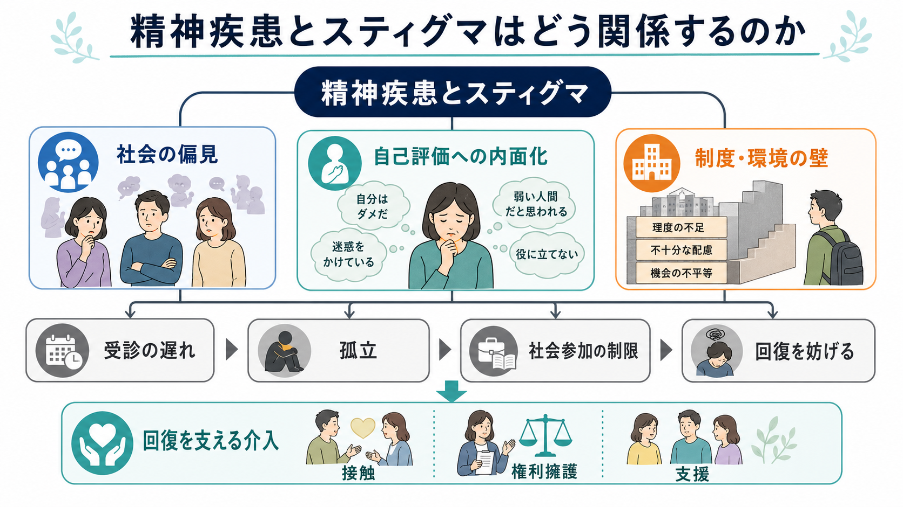
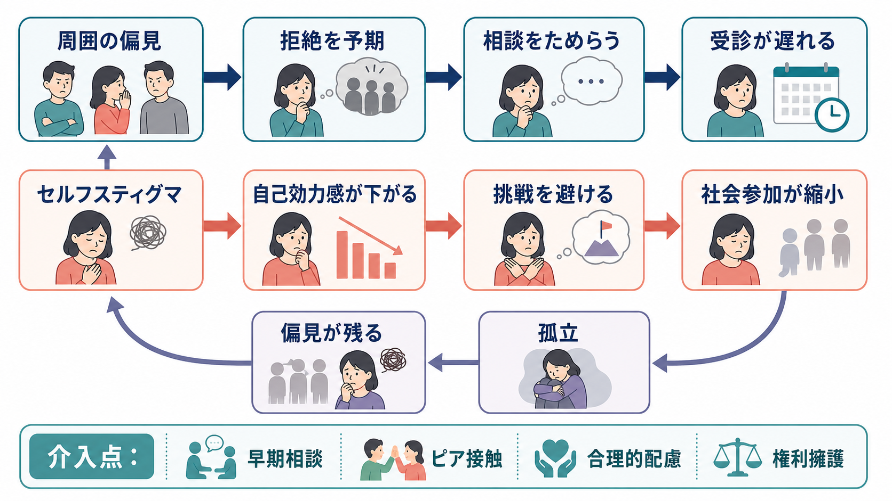
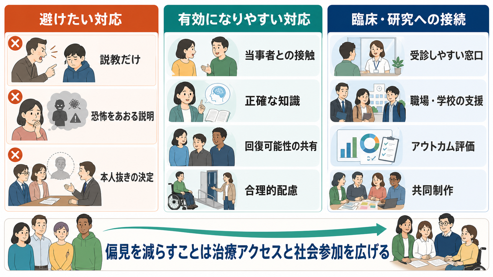

# 精神疾患とスティグマはどう関係するのか

## 要点

- 精神疾患に関するスティグマは、単なる「誤解」ではなく、ラベル化、ステレオタイプ、分離、地位低下、差別が権力関係の中で結びつく社会的過程である[1]。
- 影響は、受診の遅れ、治療中断、自己評価の低下、孤立、就労・学業・住居・人間関係への参加制限として現れる[2][3]。
- セルフスティグマは「周囲がそう見るから、自分もそうだと思う」過程で、自己効力感や希望を弱め、挑戦の回避を強める[4]。
- 有効な対策は、知識提供だけでなく、当事者との対等な接触、権利擁護、合理的配慮、医療・福祉制度の設計変更を含む[5][6]。
- 臨床では、診断名を伝えること自体よりも、その説明が「人生を狭めるラベル」になるか「支援を選ぶための作業仮説」になるかが重要である。

## この記事で答える問い

1. 精神疾患に関するスティグマは、どのような仕組みで生じるのか。
2. なぜスティグマは、相談や受診を遅らせるのか。
3. セルフスティグマは、自己評価と行動選択をどう変えるのか。
4. 社会参加や回復を支えるには、どの水準に介入する必要があるのか。

## まず結論

精神疾患とスティグマの関係は、「精神疾患があるから偏見が生じる」という一方向の関係ではない。社会が精神疾患に否定的な意味を与え、その意味が対人関係、制度、本人の自己理解に入り込むことで、症状そのものとは別の困難が作られる。つまりスティグマは、病気の外側にある社会的反応でありながら、受診、治療継続、自己評価、社会参加を通じて、病気の経過にも影響する。

この点を区別しないと、「本人が気にしすぎている」「正しい知識を教えればよい」「診断名を隠せばよい」といった単純化に流れやすい。実際には、スティグマは [[スティグマとは何か]]、[[偏見と差別は何が違うのか]]、[[精神疾患とは何か]]、[[精神科におけるスティグマをどう扱うか]] と接続する、心理・社会・制度の複合的な問題である。

## 背景

精神疾患は、症状による苦痛だけでなく、周囲からどう見られるかによっても生活上の困難が変わる。たとえば、うつ病の人が「怠けている」と見なされる、統合失調症の人が「危険」と見なされる、依存症の人が「意志が弱い」と見なされる、といった反応は、本人の実際の状態や回復可能性を狭く解釈する。

Corrigan と Watson は、精神疾患に関するスティグマを、公的スティグマとセルフスティグマに分けて整理した[2]。公的スティグマは、社会や周囲の人が精神疾患をもつ人に向けるステレオタイプ、偏見、差別である。セルフスティグマは、本人がその否定的な見方を自分に向けてしまう過程である。両者は分離しているのではなく、周囲の反応が本人の自己評価に入り込み、本人の回避行動がさらに孤立を強める、という循環を作る。

WHO の World Mental Health Report も、スティグマと差別を、精神保健サービスへのアクセス、人権、地域生活、社会参加を妨げる主要な課題として位置づけている[6]。ここで重要なのは、スティグマを「態度の問題」だけでなく、「アクセスの問題」「権利の問題」「環境の問題」として扱うことである。

## 基本概念

### 公的スティグマ

公的スティグマとは、社会の側が精神疾患をもつ人に向ける否定的な信念、感情、行動である。たとえば「精神疾患のある人は予測できない」「雇うのは不安だ」「家族に知られると困る」といった見方が、対人距離、採用判断、学校や職場での扱いに影響する。

この水準では、単なる知識不足だけでなく、メディア表象、過去の制度、職場文化、家族内の価値観、医療者自身の態度も関わる。したがって、スティグマ対策は啓発ポスターだけでは完結しない。雇用、教育、医療アクセス、地域支援の設計にまで及ぶ。

### セルフスティグマ

セルフスティグマとは、社会にある否定的な見方を本人が内面化し、「自分は価値が低い」「迷惑をかけるだけだ」「挑戦しても失敗する」と考えるようになる過程である。Corrigan と Rao は、セルフスティグマを、気づき、同意、自己適用、自己評価の低下という段階で整理している[7]。

ここで重要なのは、セルフスティグマは本人の性格の弱さではないという点である。繰り返し否定的に扱われ、開示したことで不利益を受け、支援を求めた経験が傷つくものであれば、本人が将来の拒絶を予期するのは合理的な防衛でもある。

### 構造的スティグマ

構造的スティグマとは、法律、制度、組織運営、医療資源配分、保険、雇用慣行、学校制度などに埋め込まれた不利益である。たとえば、精神医療にアクセスしにくい地域、診断名の開示が不利に働く職場、合理的配慮を求めにくい学校、身体疾患に比べて精神疾患が軽視される医療資源配分などが含まれる。

構造的スティグマは、明確な悪意がなくても起こる。むしろ、制度が「標準的な人」を前提に設計されていると、支援を必要とする人ほど参加しにくくなる。

## 仕組み

スティグマの中心的な仕組みは、外からの偏見が本人の行動選択に入り込み、本人の生活機会を狭めることである。

### 1. 受診行動への影響

精神的不調があっても、「精神科に行ったら弱い人と思われる」「診断名がつくと仕事に響く」「家族に知られたくない」と感じると、相談や受診は遅れやすい。Clement らの系統的レビューは、メンタルヘルス関連スティグマが援助要請の障壁になることを、量的研究と質的研究の両面から整理している[3]。

ここで起こるのは、単なる情報不足ではない。本人は支援の存在を知っていても、相談した後に失うものを予期する。失職、評価低下、家族内の緊張、友人関係の変化、医療者に軽く扱われる不安などが、受診行動の前に立ちはだかる。

### 2. 自己評価への影響

セルフスティグマが強まると、本人は「回復しても社会に戻れない」「自分には役割がない」と感じやすくなる。Livingston と Boyd の系統的レビュー・メタ分析は、内面化されたスティグマが、希望、自己効力感、エンパワメント、社会的支援、症状や生活上の困難と関連することを示している[4]。

この影響は、症状の重さだけでは説明できない。たとえば同じ症状の程度でも、「周囲に相談できる」「失敗しても戻れる場所がある」「診断名が人生全体を決めるわけではない」と感じられる人と、「知られたら終わりだ」と感じる人では、行動の幅が変わる。

### 3. 社会参加への影響

スティグマは、就労、学業、住居、親密な関係、地域活動への参加を狭める。本人が参加を避ける場合もあれば、周囲が機会を与えない場合もある。前者だけを見ると「本人の意欲が低い」と誤解されやすいが、実際には拒絶の予期、過去の差別経験、配慮を求める難しさが背景にあることが多い。

この点は [[精神医学における回復とは何か]] とも関係する。回復は、症状が完全に消えることだけではない。役割、関係、希望、選択肢を取り戻す過程でもある。スティグマが強い環境では、症状が改善しても社会的回復が遅れることがある。

## 図解

3枚の図は、同じ問題を異なる水準で整理している。

1枚目は、スティグマを「社会の偏見」「自己評価への内面化」「制度・環境の壁」の3層として示している。2枚目は、偏見が受診遅れと社会参加の縮小につながる循環を示している。3枚目は、避けたい対応と有効になりやすい対応を比較し、臨床・研究・制度設計に接続している。

## 臨床・研究との接続

### 臨床面接での接続

臨床では、スティグマを「本人が気にしていること」として扱うだけでは足りない。次のように、具体的な生活文脈として聞く必要がある。

- 「この不調について、誰に知られるのが一番心配ですか」
- 「相談すると、どのような不利益が起きると感じていますか」
- 「診断名や通院について、職場・学校・家族にどこまで伝えたいですか」
- 「これまで相談したことで、傷ついた経験はありますか」
- 「支援を受けても、自分らしさや役割が失われない形にするには何が必要ですか」

これは診断や治療の補助ではなく、治療参加そのものを支える作業である。[[社会的支援は健康にどう影響するのか]] が示すように、支援は症状の外側にある付属物ではなく、経過を左右する条件である。

### 研究での接続

研究では、スティグマを単一の態度尺度だけで測ると、重要な部分を取り落とす。少なくとも、公的スティグマ、セルフスティグマ、構造的スティグマ、差別経験、社会的支援、受診行動、生活機能を区別して測る必要がある。

また、介入研究では「知識が増えたか」だけでなく、行動が変わったか、サービス利用が改善したか、本人の希望や自己効力感が回復したか、就労・学業・地域参加が広がったかを評価する必要がある。Mehta らの系統的レビューは、反スティグマ介入の中長期効果を検討し、接触を含む介入の重要性を示している[8]。

### 介入の方向

反スティグマ介入は、複数の水準で考えると整理しやすい。

| 水準 | 主な問題 | 介入の例 |
|---|---|---|
| 個人 | セルフスティグマ、低い自己効力感、相談へのためらい | 心理教育、ナラティブの再構成、ピアサポート、共同意思決定 |
| 対人関係 | 家族・友人・同僚の偏見、開示不安 | 安全な接触、家族支援、職場・学校での説明設計 |
| 医療 | 医療者の無自覚な偏見、説明不足、権威的関係 | 患者中心の説明、回復志向支援、権利擁護、診療環境の改善 |
| 制度 | 不十分な配慮、雇用・教育・住居の不利益 | 合理的配慮、差別禁止、地域精神医療、アクセスしやすい相談窓口 |

## よくある誤解

### 誤解1: 正しい知識を広めればスティグマは消える

知識提供は必要だが、それだけでは不十分である。精神疾患に関する知識をもっていても、距離を置く、採用を避ける、本人抜きで決める、といった行動は残りうる。知識、感情、行動、制度のそれぞれに働きかける必要がある。

### 誤解2: 診断名を使わなければスティグマは避けられる

診断名が傷つける形で使われることはある。しかし診断名は、支援、制度利用、治療計画、自己理解に役立つこともある。問題は診断名そのものではなく、それが「その人全体を決めるラベル」として使われるか、「支援を組み立てるための仮説」として使われるかである。

### 誤解3: 本人が強くなればよい

本人の対処力やレジリエンスは重要だが、スティグマは社会的条件の問題でもある。周囲の拒絶、制度の壁、医療アクセスの悪さが残ったまま本人だけに変化を求めると、責任を本人に押し戻してしまう。

### 誤解4: 精神疾患への偏見は特殊な人だけがもつ

偏見は、明確な悪意のある人だけがもつものではない。医療者、家族、支援者、研究者も、文化的ステレオタイプや制度的慣行の影響を受ける。だからこそ、個人の善意に頼るだけでなく、説明、記録、採用、配慮、研究参加の手続きを点検する必要がある。

## 関連ノート

### 既存ノート

- [[スティグマとは何か]]
- [[偏見と差別は何が違うのか]]
- [[精神疾患とは何か]]
- [[精神科におけるスティグマをどう扱うか]]
- [[精神医学における回復とは何か]]
- [[社会的支援は健康にどう影響するのか]]

### 関連ノート候補

- 精神疾患とセルフスティグマはどう関係するのか
- 構造的スティグマとは何か
- 精神疾患と社会参加はどう関係するのか
- 精神疾患の開示支援とは何か
- 反スティグマ介入とは何か

### MOC更新候補

- `content/00_MOC/` 配下の精神医学、社会心理学、地域精神医療関連MOCに、本記事へのリンクを追加する候補。
- 並列ジョブとの競合を避けるため、本記事作成時点ではMOC本体は更新しない。

## 理解チェック

1. 公的スティグマ、セルフスティグマ、構造的スティグマの違いを、それぞれ1文で説明できるか。
2. スティグマが受診を遅らせる理由を、「知識不足」以外の観点から説明できるか。
3. セルフスティグマが自己効力感と社会参加に与える影響を説明できるか。
4. 反スティグマ介入で、知識提供だけでは不十分な理由を説明できるか。
5. 臨床面接で、診断名や通院への開示不安をどのように聞くか、具体的な質問を作れるか。

## 未解決問題

- 反スティグマ介入の短期的な態度変化が、長期的な差別行動の減少や制度変更にどこまでつながるかは、対象集団と文脈ごとの検討が必要である。
- 日本の学校、職場、医療機関、地域支援で、どの構造的スティグマが最も大きな障壁になっているかを測る研究はさらに必要である。
- デジタル相談、AIチャット、匿名コミュニティは、相談の敷居を下げる一方で、新しい監視やラベル化のリスクも持つ可能性がある。

## 参考文献

[1] Link, B. G., & Phelan, J. C. (2001). Conceptualizing stigma. *Annual Review of Sociology, 27*, 363-385. https://doi.org/10.1146/annurev.soc.27.1.363

[2] Corrigan, P. W., & Watson, A. C. (2002). Understanding the impact of stigma on people with mental illness. *World Psychiatry, 1*(1), 16-20. https://pmc.ncbi.nlm.nih.gov/articles/PMC1489832/

[3] Clement, S., Schauman, O., Graham, T., Maggioni, F., Evans-Lacko, S., Bezborodovs, N., Morgan, C., Rüsch, N., Brown, J. S. L., & Thornicroft, G. (2015). What is the impact of mental health-related stigma on help-seeking? A systematic review of quantitative and qualitative studies. *Psychological Medicine, 45*(1), 11-27. https://doi.org/10.1017/S0033291714000129

[4] Livingston, J. D., & Boyd, J. E. (2010). Correlates and consequences of internalized stigma for people living with mental illness: A systematic review and meta-analysis. *Social Science & Medicine, 71*(12), 2150-2161. https://doi.org/10.1016/j.socscimed.2010.09.030

[5] Thornicroft, G., Sunkel, C., Alikhon Aliev, A., Baker, S., Brohan, E., El Chammay, R., Davies, K., et al. (2022). The Lancet Commission on ending stigma and discrimination in mental health. *The Lancet, 400*(10361), 1438-1480. https://doi.org/10.1016/S0140-6736(22)01470-2

[6] World Health Organization. (2022). *World mental health report: Transforming mental health for all*. WHO. https://www.who.int/teams/mental-health-and-substance-use/world-mental-health-report

[7] Corrigan, P. W., & Rao, D. (2012). On the self-stigma of mental illness: Stages, disclosure, and strategies for change. *The Canadian Journal of Psychiatry, 57*(8), 464-469. https://doi.org/10.1177/070674371205700804

[8] Mehta, N., Clement, S., Marcus, E., Stona, A.-C., Bezborodovs, N., Evans-Lacko, S., Palacios, J., Docherty, M., Barley, E., Rose, D., Koschorke, M., Shidhaye, R., Henderson, C., & Thornicroft, G. (2015). Evidence for effective interventions to reduce mental health-related stigma and discrimination in the medium and long term: Systematic review. *The British Journal of Psychiatry, 207*(5), 377-384. https://doi.org/10.1192/bjp.bp.114.151944
