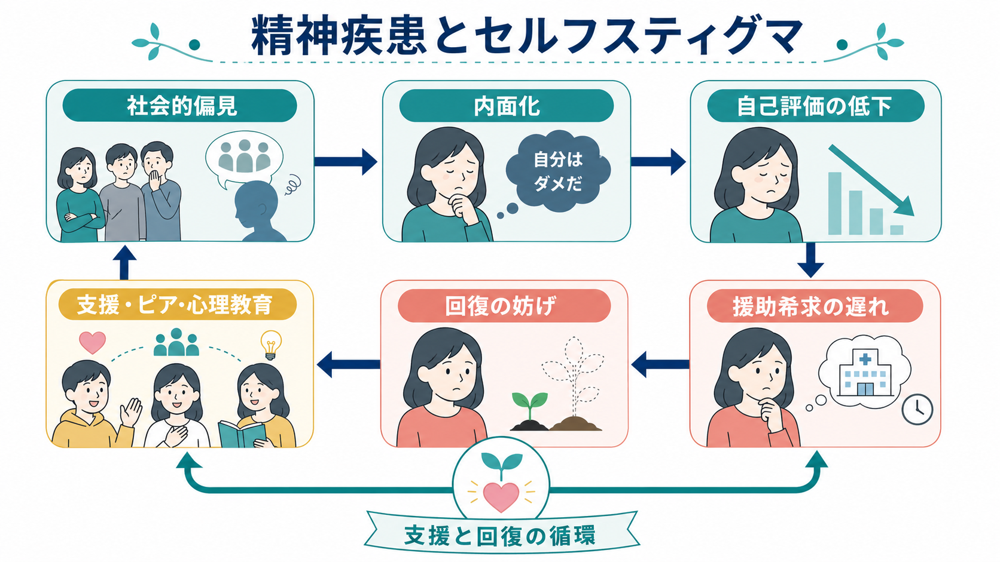
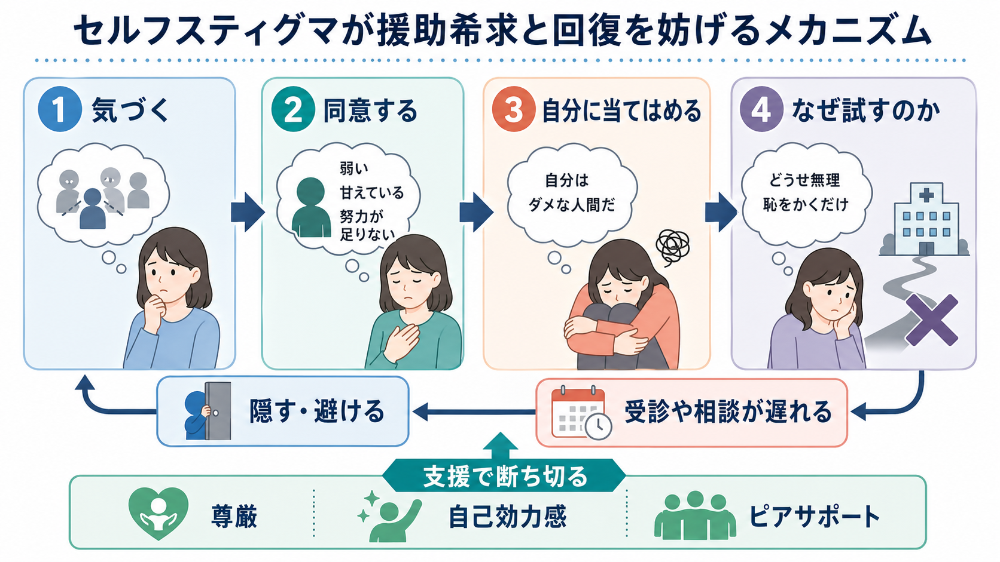
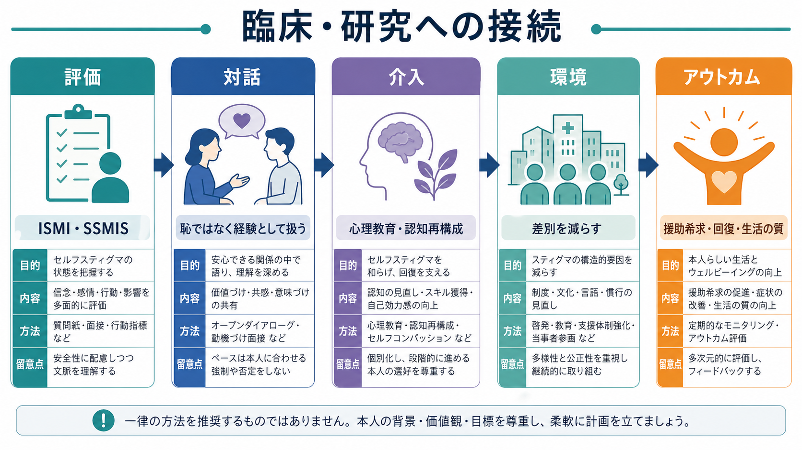

# 精神疾患とセルフスティグマはどう関係するのか

## 要点

- セルフスティグマとは、精神疾患に対する社会的な否定的ステレオタイプを、当事者が「自分にも当てはまる」と受け入れてしまう過程である[1][2]。
- 典型的には、社会的偏見に気づく、同意する、自分に当てはめる、自己評価や自己効力感が下がる、という段階で進む[2]。
- 内面化されたスティグマは、希望、自己効力感、エンパワメント、社会的支援、回復感の低下と関連し、症状や生活上の困難とも結びつく[3]。
- スティグマは「相談したら弱いと思われる」「診断名を知られたら不利益を受ける」という予期を通じて、受診や相談の遅れにも関係する[4]。
- 対応は、本人の考え方を変えさせるだけでは不十分で、差別的な環境、医療者の態度、制度、開示をめぐる安全性も同時に扱う必要がある[5]。

## この記事で答える問い

1. 精神疾患に関するセルフスティグマは、どのように生じるのか。
2. セルフスティグマは、なぜ援助希求や回復を妨げるのか。
3. 臨床や研究では、どのように評価し、支援につなげるのか。

## まず結論

精神疾患とセルフスティグマの関係は、「病気があるから自動的に自信が下がる」という単純な関係ではない。社会の中にある偏見、診断名への恐れ、家族・職場・学校・医療の反応、過去の差別経験が、本人の自己理解に入り込み、「自分には価値がない」「挑戦しても無駄だ」「助けを求めるとさらに傷つく」という予期を作る。これが援助希求を遅らせ、治療参加や社会参加を狭め、回復の機会を減らす。

したがって、セルフスティグマへの支援は、単に「前向きに考えよう」と促すことではない。本人の尊厳を守る説明、診断名と人格を切り分ける対話、安全な開示判断、ピアサポート、心理教育、認知再構成、差別を減らす環境調整を組み合わせる必要がある[5][6][7]。

## 背景

[[スティグマとは何か]]でいうスティグマは、ラベル化、ステレオタイプ化、分離、地位低下、差別が、権力関係の中で結びつく過程である[8]。精神疾患の場合、「危険」「弱い」「予測できない」「努力不足」といったステレオタイプが、診療、雇用、教育、家族関係、地域参加に影響する。

[[精神疾患とスティグマはどう関係するのか]]が扱う広い問題のうち、セルフスティグマはとくに「社会の見方が本人の自己理解に入り込む」部分である。外側の差別がなくなっていない環境では、本人が慎重になること自体は合理的な防衛でもある。しかし、その防衛が「どうせ無理」「知られたら終わり」「相談する価値がない」という固定化した信念になると、回復や生活再建の選択肢を狭める。

## 基本概念

### 公的スティグマ

公的スティグマは、社会一般が精神疾患をもつ人に向けるステレオタイプ、偏見、差別である。たとえば、「精神疾患のある人は働けない」「家族に知られると恥ずかしい」「治療を受ける人は弱い」といった見方が、周囲の態度や制度に反映される。

### セルフスティグマ

セルフスティグマは、公的スティグマを本人が内面化し、自分自身に向ける過程である。Corrigan と Rao は、セルフスティグマを、気づき、同意、自己適用、自己評価の低下という段階で説明している[2]。重要なのは、これは本人の「性格の弱さ」ではなく、社会的なメッセージを繰り返し受けた結果として生じる学習された自己理解だという点である。

### 内面化されたスティグマの測定

研究では、Internalized Stigma of Mental Illness Scale（ISMI）などが使われる。ISMI は疎外感、ステレオタイプへの同意、差別経験、社会的引きこもり、スティグマ抵抗を測る尺度として開発された[1]。Self-Stigma of Mental Illness Scale（SSMIS）系の尺度も、ステレオタイプへの気づきから自己適用までの段階を評価するために用いられる[2]。

## 仕組み

### 1. 社会的偏見に気づく

本人は、メディア、家族、学校、職場、医療現場、SNS などを通じて、精神疾患に関する否定的な語りを知る。「知られたら避けられる」「仕事を任せてもらえない」「危険だと思われる」といった予期が形成される。

### 2. ステレオタイプに同意する

次に、その見方を「世の中ではそう見られる」だけでなく、「たしかにそうかもしれない」と受け入れることがある。この段階では、診断名や通院歴が、本人の能力や人間性全体を説明するラベルのように感じられやすい。

### 3. 自分に当てはめる

「精神疾患のある人は弱い」という一般化が、「自分は弱い」「自分は迷惑をかける」「自分には役割がない」という自己評価に変わる。ここで自己効力感が下がると、治療、学業、就労、対人関係、社会参加への挑戦が減りやすい[3]。

### 4. 援助希求と回復が妨げられる

セルフスティグマが強いと、相談する前に「どうせ理解されない」「診断名が記録に残る」「助けを求めたら評価が下がる」と予測しやすい。メンタルヘルス関連スティグマが援助希求の障壁になることは、量的研究と質的研究を含む系統的レビューでも整理されている[4]。

## 図解

上の図では、セルフスティグマを「気づく、同意する、自分に当てはめる、挑戦の意味を失う」という流れとして示した。下の図は、臨床・研究でこの問題を扱うときの接続を示している。評価尺度で状態を把握し、対話で恥や自己責任化をほどき、心理教育・認知再構成・ピアサポートを通じて自己効力感を回復し、同時に差別や不利益を減らす環境調整につなげる。

## 臨床・研究との接続

### 臨床での見立て

臨床では、セルフスティグマを「本人が悲観的である」とだけ見ない。次のような問いで、本人がどのような社会的リスクを予期しているかを確認する。

| 観点 | 確認したいこと |
|---|---|
| 診断名 | 診断名を知ることで助かった点と、傷ついた点は何か |
| 開示 | 家族、職場、学校、友人にどこまで伝えたいか |
| 援助希求 | 相談や受診をためらわせる具体的な不利益は何か |
| 自己評価 | 「自分には無理」と感じる場面はどこか |
| 環境 | 実際に差別や不利益を受けている場面はないか |

この評価は、診断や治療指示ではなく、教育・研究目的の整理である。個別の症状や治療方針は、本人の状況を知る専門家との相談が必要である。

### 介入の考え方

Narrative Enhancement and Cognitive Therapy（NECT）は、内面化されたスティグマを扱う集団介入として、物語の再構成、心理教育、認知的再検討を組み合わせる。ランダム化比較試験では、通常治療に比べてセルフスティグマの低下や自尊感情の改善が報告されている[6]。

Honest, Open, Proud（HOP）は、精神疾患の開示を一律に勧めるのではなく、開示する場合としない場合の利点・リスクを整理し、自分に合う判断を支えるピア主導のプログラムである。概念レビューとメタ分析では、スティグマの影響を減らす支援として検討されている[7]。

### 研究での注意点

セルフスティグマ研究では、尺度得点だけでなく、差別経験、社会的支援、症状、生活の質、援助希求、就労・学業参加、文化的背景を併せて見る必要がある。内面化されたスティグマは重要な要因だが、それだけを原因として扱うと、制度や環境の責任を本人に戻してしまう危険がある。

## よくある誤解

### 誤解1: セルフスティグマは本人の思い込みにすぎない

実際には、本人の内面だけでなく、周囲の反応、過去の差別経験、医療者の態度、雇用や教育の制度が関係する。本人が不利益を予期するのは、現実のリスクに基づくこともある。

### 誤解2: 診断名を隠せばセルフスティグマは避けられる

開示しない選択が本人を守る場合はある。しかし、隠すことが長期化すると、相談先が狭まり、孤立や治療中断につながることもある。重要なのは、本人が安全に選べること、開示しても不利益を受けにくい環境を作ることである。

### 誤解3: 正しい知識を教えれば十分である

知識は必要だが、それだけでは十分ではない。接触、ピアサポート、権利擁護、制度改善、医療者教育、メディア表象の改善など、複数の水準で取り組む必要がある[5]。

### 誤解4: セルフスティグマを減らすことは、症状を否認することではない

セルフスティグマを減らすとは、症状や困難をなかったことにすることではない。困難を認めながらも、それを本人の価値や将来可能性の否定に結びつけないようにすることである。

## 関連ノート

### 既存ノート

- [[スティグマとは何か]]
- [[精神疾患とスティグマはどう関係するのか]]
- [[精神疾患は脳の病気なのか]]
- [[精神疾患の次元的理解とは何か]]
- [[うつ病とは何か]]
- [[双極性障害とは何か]]
- [[PTSDとは何か]]
- [[LGBTQ関連メンタルヘルスとは何か]]

### 今後の作成候補

- セルフスティグマ尺度とは何か
- 精神疾患の開示支援とは何か
- ピアサポートは回復にどう関わるのか
- 精神疾患と援助希求はどう関係するのか

### MOC 更新候補

- `content/00_MOC/MOC｜神経科学と精神疾患.md`
- 精神医学、社会心理学、地域精神保健に関する MOC への追加候補

## 理解チェック

1. 公的スティグマとセルフスティグマの違いを、一文で説明できるか。
2. 「気づく、同意する、自分に当てはめる、自己評価が下がる」という段階を、具体例で説明できるか。
3. セルフスティグマが援助希求を遅らせる理由を、知識不足以外の観点から説明できるか。
4. セルフスティグマへの支援で、本人への心理教育だけでは不十分な理由を説明できるか。
5. 開示支援で「開示すべき」と一律に言えない理由を説明できるか。

## 未解決問題

- セルフスティグマ介入の効果が、長期的な就労、学業、対人関係、生活の質にどこまで波及するかは、さらに検討が必要である。
- 日本の学校、職場、家族文化、医療制度の中で、どの要因がセルフスティグマを強めるのかを測定する研究が必要である。
- デジタル相談、匿名コミュニティ、AI チャットが、援助希求を促すのか、それとも新しいラベル化や監視不安を生むのかは慎重に検討する必要がある。

## 参考文献

[1] Ritsher, J. B., Otilingam, P. G., & Grajales, M. (2003). Internalized stigma of mental illness: Psychometric properties of a new measure. *Psychiatry Research, 121*(1), 31-49. https://doi.org/10.1016/j.psychres.2003.08.008

[2] Corrigan, P. W., & Rao, D. (2012). On the self-stigma of mental illness: Stages, disclosure, and strategies for change. *The Canadian Journal of Psychiatry, 57*(8), 464-469. https://doi.org/10.1177/070674371205700804

[3] Livingston, J. D., & Boyd, J. E. (2010). Correlates and consequences of internalized stigma for people living with mental illness: A systematic review and meta-analysis. *Social Science & Medicine, 71*(12), 2150-2161. https://doi.org/10.1016/j.socscimed.2010.09.030

[4] Clement, S., Schauman, O., Graham, T., Maggioni, F., Evans-Lacko, S., Bezborodovs, N., Morgan, C., Rüsch, N., Brown, J. S. L., & Thornicroft, G. (2015). What is the impact of mental health-related stigma on help-seeking? A systematic review of quantitative and qualitative studies. *Psychological Medicine, 45*(1), 11-27. https://doi.org/10.1017/S0033291714000129

[5] Thornicroft, G., Sunkel, C., Alikhon Aliev, A., Baker, S., Brohan, E., El Chammay, R., Davies, K., et al. (2022). The Lancet Commission on ending stigma and discrimination in mental health. *The Lancet, 400*(10361), 1438-1480. https://doi.org/10.1016/S0140-6736(22)01470-2

[6] Hansson, L., Lexén, A., & Holmén, J. (2017). The effectiveness of narrative enhancement and cognitive therapy: A randomized controlled study of a self-stigma intervention. *Social Psychiatry and Psychiatric Epidemiology, 52*, 1415-1423. https://doi.org/10.1007/s00127-017-1385-x

[7] Rüsch, N., & Kösters, M. (2021). Honest, Open, Proud to support disclosure decisions and to decrease stigma's impact among people with mental illness: Conceptual review and meta-analysis of program efficacy. *Social Psychiatry and Psychiatric Epidemiology, 56*, 1513-1526. https://doi.org/10.1007/s00127-021-02076-y

[8] Link, B. G., & Phelan, J. C. (2001). Conceptualizing stigma. *Annual Review of Sociology, 27*, 363-385. https://doi.org/10.1146/annurev.soc.27.1.363
