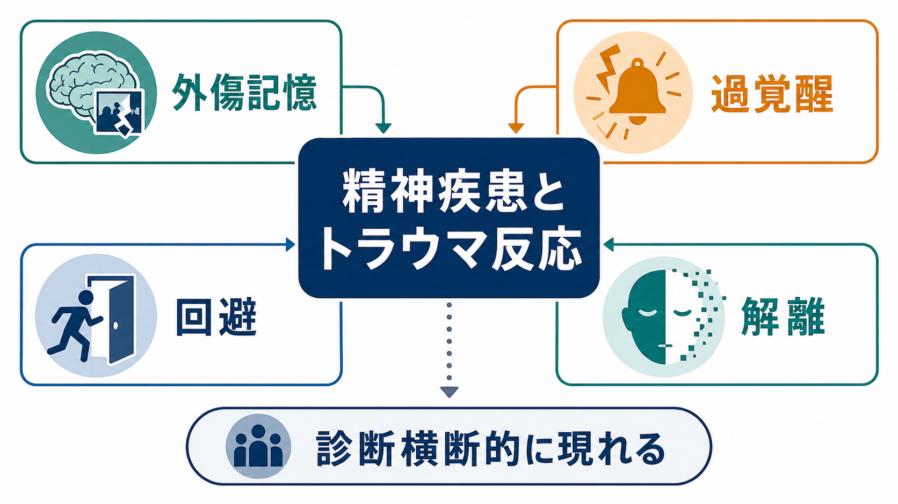
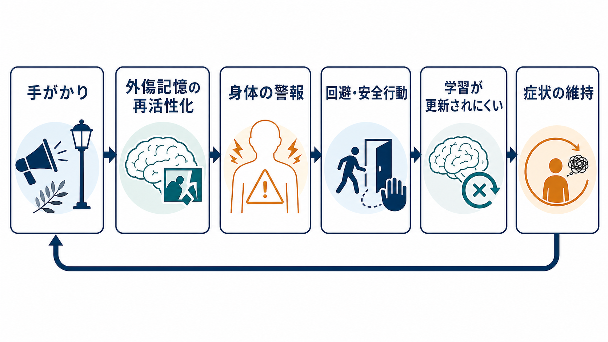
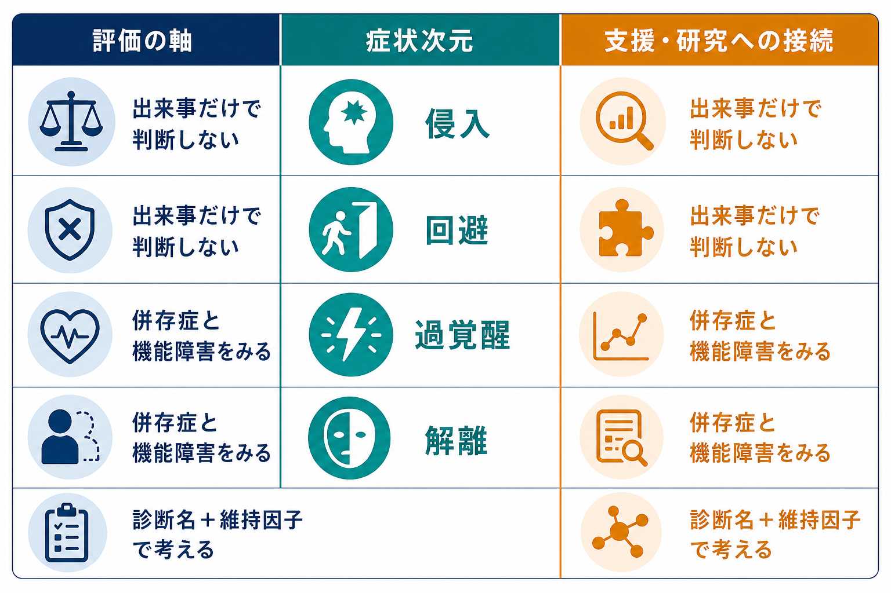

# 精神疾患とトラウマ反応はどう関係するのか

## 要点

- トラウマ反応は [[PTSDとは何か|PTSD]] だけに閉じた症状ではない。外傷記憶、過覚醒、回避、解離、罪悪感、対人不信、睡眠障害、物質使用などが、[[うつ病とは何か|うつ病]]、[[不安症群とは何か|不安症群]]、[[統合失調症とは何か|統合失調症]]、[[物質使用障害とは何か|物質使用障害]]、[[解離症群とは何か|解離症群]]と重なって現れることがある。
- PTSDの診断基準は、侵入症状、回避、認知・気分の陰性変化、覚醒・反応性の変化を中心に整理されるが、同じ反応次元は他の診断名の中にも部分症状として入り込む[1][2][3]。
- 仕組みとしては、危険を示す手がかりが外傷記憶を再活性化し、身体の警報、回避、安全行動、学習更新の不足を通じて症状を維持する、という循環で理解しやすい[4][5]。
- 解離は「現実から切り離される」ように感じる防衛的反応として理解できる一方、記憶統合、感情調整、対人関係、治療同盟を難しくすることがある[6]。
- 臨床・研究では、診断名だけでなく「どのトラウマ反応が、どの場面で、何によって維持されているか」を評価することが重要である[7][8]。

## この記事で答える問い

1. トラウマ反応は、なぜPTSD以外の精神疾患にも現れるのか。
2. 外傷記憶、過覚醒、回避、解離はどのように互いを維持するのか。
3. 「トラウマが原因」と単純化せずに、診断横断的な症状をどう整理すればよいのか。
4. 臨床・研究では、診断名と維持因子をどのように分けて考えるべきか。

## まず結論

精神疾患とトラウマ反応の関係は、「ある出来事があったから、ある診断になる」という一対一対応ではない。より実用的には、トラウマを「過去の危険が現在の知覚・記憶・身体反応・対人予測を変えるプロセス」として見る。すると、同じ人の中でPTSD症状、抑うつ、不安、物質使用、解離、怒り、睡眠障害、対人不信が重なりやすい理由を説明しやすくなる。

たとえば、ある音や匂いが外傷記憶の断片を呼び起こすと、本人は「いま危険が迫っている」ように感じる。身体は緊張し、眠れず、周囲を警戒し、関係や場所を避ける。回避は短期的には苦痛を下げるが、長期的には「安全な現在」を学び直す機会を減らす。ここに抑うつ、不安、物質使用、解離、対人問題が重なると、症状は診断名をまたいで広がる。

## 背景

DSM-5-TRではPTSDは「外傷およびストレス因関連症群」に位置づけられ、外傷曝露の後に侵入症状、回避、認知・気分の陰性変化、覚醒・反応性の変化が持続し、苦痛や機能障害を生じる状態として整理される[1][3]。ICD-11ではPTSDを「再体験、回避、現在の脅威感」の3中核で定義し、複雑性PTSDではこれに感情調整、自己概念、対人関係の障害が加わる[2]。

ただし、現実の臨床像は分類体系ほどきれいに分かれない。[[PTSDとうつ病はどう併存するのか]]で扱うように、外傷記憶、睡眠障害、罪悪感、無価値感、活動低下は抑うつ症状と重なる。[[パニック症とは何か|パニック症]]や全般不安では過覚醒や身体感覚への警戒が前景化しやすい。[[解離症群とは何か|解離症群]]では、意識・記憶・自己感の連続性が揺らぐ。したがって、トラウマ反応は「PTSDかどうか」だけでなく、複数診断を横断する症状次元として扱う必要がある。

## 基本概念

### 外傷記憶

外傷記憶は、通常の自伝的記憶のように「過去の出来事」として語れる場合もあれば、感覚、身体反応、断片的イメージ、悪夢、フラッシュバックとして現在に割り込む場合もある。Brewinらの二重表象理論では、外傷体験は文脈化された記憶と、感覚・身体に近い記憶表象のずれとして説明される[4]。この見方では、本人が「思い出そう」としていなくても、手がかりが反応を起こすことを理解しやすい。

### 過覚醒

過覚醒は、身体と注意が危険探索モードに入り続ける状態である。驚きやすい、眠れない、緊張が抜けない、怒りやすい、集中しにくい、周囲を警戒する、といった形で現れる。PTSD研究では扁桃体、海馬、前頭前野、HPA軸などの関与が議論されるが、単一の脳部位が原因というより、脅威検出、文脈記憶、感情調整、身体ストレス反応のネットワークとして考えるのが妥当である[5]。関連して、[[扁桃体過活動は不安症やPTSDにどう関わるのか]]、[[海馬萎縮はストレスやうつ病と関係するのか]]、[[HPA軸は精神疾患にどう関わるのか]]も参照できる。

### 回避

回避は、つらい記憶、感情、場所、人、会話、身体感覚を避ける反応である。短期的には苦痛を下げるため合理的に見える。しかし、回避が長く続くと、安全な場面でも危険予測が修正されず、生活範囲、社会的支援、報酬経験が狭まる。このため、回避はPTSDだけでなく、抑うつ、不安、物質使用、対人関係の困難を維持する共通因子になりうる。

### 解離

解離は、圧倒的な苦痛から距離を取るために、意識、記憶、身体感覚、自己感、現実感が切り離されるように感じられる反応である。PTSDには解離症状を伴うサブタイプがあり、解離は感情の過剰な活性化を抑える方向に働くことがある一方で、記憶統合や対人関係を難しくすることもある[6]。[[解離症と精神病性障害はどう鑑別するのか]]のように、現実検討、記憶の空白、幻聴様体験、ストレスとの時間関係を丁寧に見る必要がある。

## 仕組み

トラウマ反応の維持は、次の循環で整理できる。

1. 手がかりが入る。音、匂い、表情、ニュース、身体感覚、季節、場所などが、過去の危険と結びついていることがある。
2. 外傷記憶が再活性化する。本人には断片的な映像、身体感覚、悪夢、恐怖、恥、怒りとして体験される。
3. 身体の警報が鳴る。心拍、筋緊張、過呼吸、胃腸症状、睡眠障害、過剰な警戒が出る。
4. 回避や安全行動が増える。苦痛を下げるために人、場所、会話、感情、身体感覚、記憶への接触を避ける。
5. 学習が更新されにくくなる。「今は安全である」「助けを求めてもよい」「記憶は現在の危険ではない」と学び直す機会が減る。
6. 症状が維持される。過覚醒、抑うつ、解離、物質使用、対人不信が絡み、診断横断的な症状ネットワークになる。

この循環は、トラウマ反応を本人の意思の弱さとして説明しないために重要である。反応は、危険を検出し、生き延びるために形成された学習として理解できる。ただし、現在の環境が安全になっても同じ反応が続くと、生活や関係を損ない、精神疾患の症状として問題になる。

## 図解

下の図は、臨床・研究で見るべき軸をまとめたものである。ポイントは、出来事の有無だけで判断せず、症状次元、併存症、機能障害、維持因子を分けて見ることである。

| 見る軸 | 具体例 | 誤解しやすい点 |
|---|---|---|
| 出来事 | 暴力、事故、災害、虐待、喪失、医療外傷など | 出来事の「客観的な大きさ」だけで反応は決まらない |
| 症状次元 | 侵入、回避、過覚醒、解離、罪悪感、対人不信 | 診断名が違っても同じ反応次元が出る |
| 時間経過 | 急性反応、慢性化、再燃、遅発性の悪化 | 時間だけで重症度は決まらない |
| 併存症 | うつ病、不安症、物質使用、精神病症状、身体症状 | 「一次」「二次」と単純に分けにくい |
| 維持因子 | 回避、孤立、睡眠不足、身体疾患、社会的危険、支援不足 | 本人の努力不足として扱うと見落としが増える |

## 臨床・研究との接続

臨床では、トラウマ反応を確認することは、本人に過去の体験を無理に語らせることではない。まず現在の安全性、自傷・自殺リスク、暴力や搾取への曝露、睡眠、物質使用、身体疾患、社会的支援を確認する必要がある。NICEのPTSDガイドラインも、心理・身体・社会的ニーズやリスクを含めた包括的評価を重視している[8]。

研究では、診断カテゴリーだけでなく、脅威、剥奪、喪失、予測不能性といった経験の次元を分けて検討する流れがある。McLaughlinらは、児童期逆境を一枚岩のリスクではなく、脅威と剥奪などの次元として扱うことで、神経発達と精神病理の経路をより精密に理解できると論じている[7]。これは成人のトラウマ反応にも示唆的であり、「トラウマ歴あり／なし」だけではなく、どの経験がどの反応次元に結びついているかを見る視点につながる。

支援では、診断名と維持因子を分けて考えると混乱が減る。たとえば、[[不安症とうつ病はどう併存するのか]]、[[PTSDとうつ病はどう併存するのか]]、[[パーソナリティ障害と複雑性PTSDはどう関係するのか]]のような併存・鑑別では、外傷記憶、回避、解離、感情調整、対人関係、自己概念、機能障害を別々に見たほうが、単に診断名を増やすよりも理解しやすい。

## よくある誤解

### 誤解1: トラウマ反応があるなら必ずPTSDである

PTSDはトラウマ反応を代表する診断だが、すべてのトラウマ反応がPTSDの基準を満たすわけではない。抑うつ、不安、物質使用、解離、身体症状、対人問題として前景化することもある。重要なのは、診断名を急ぐことではなく、症状のまとまり、持続、機能障害、リスクを評価することである。

### 誤解2: トラウマ反応は過去の記憶だけの問題である

外傷記憶は中心的だが、問題は記憶だけではない。現在の身体反応、睡眠、社会的安全、対人関係、経済状況、物質使用、慢性疼痛、差別や暴力への継続曝露が症状を維持することがある。過去だけを見ると、現在変えられる維持因子を見落としやすい。

### 誤解3: 回避は悪い行動なので、すぐやめるべきである

回避は短期的には苦痛を下げる防衛反応であり、本人にとって意味がある。問題は、回避が生活を狭め、安全学習を妨げるほど固定化したときである。教育・研究目的でいえば、回避を責めるより、どの苦痛を避けているのか、短期的利益と長期的コストは何かを分けて見るほうが有用である。

### 誤解4: 解離は特殊でまれな現象である

解離は、重度の解離症だけでなく、PTSD、複雑性PTSD、境界性パーソナリティ障害、精神病性障害との鑑別場面でも問題になる。ぼんやりする、現実感が薄い、身体が自分のものではない、記憶が抜ける、といった体験は、本人が言語化しにくいことも多い。評価では、体験の質、時間経過、ストレスとの関係、現実検討、機能障害を確認する必要がある[6]。

## 関連ノート

- [[PTSDとは何か]]
- [[トラウマ関連障害群とは何か]]
- [[複雑性PTSDとは何か]]
- [[PTSDとうつ病はどう併存するのか]]
- [[解離症群とは何か]]
- [[解離症と精神病性障害はどう鑑別するのか]]
- [[不安症群とは何か]]
- [[パニック症とは何か]]
- [[物質使用障害とは何か]]
- [[境界性パーソナリティ障害とは何か]]
- [[HPA軸は精神疾患にどう関わるのか]]
- [[PTSDでは恐怖記憶ネットワークに何が起きているのか]]

MOC更新候補: `content/00_MOC/` 配下の精神医学、トラウマ関連、症候群、神経科学と精神疾患に関するMOC。並列生成ジョブとの競合を避けるため、本記事ではMOC本体を更新しない。

## 理解チェック

1. PTSDの診断名と、侵入・回避・過覚醒・解離という症状次元を分けて説明できるか。
2. 回避が短期的には苦痛を下げ、長期的には学習更新を妨げる理由を説明できるか。
3. トラウマ反応がうつ病、不安症、物質使用、精神病症状と重なりうる理由を、単純な「原因と結果」ではなく維持因子の観点から説明できるか。
4. 解離を、特殊な診断名ではなく、意識・記憶・自己感・現実感の連続性の問題として説明できるか。
5. 臨床・研究で「出来事だけで判断しない」ことがなぜ重要か説明できるか。

## 未解決問題

- 外傷記憶、過覚醒、解離、抑うつ、物質使用をつなぐ個人内ネットワークを、臨床でどこまで実用的に測定できるか。
- 脅威、剥奪、喪失、社会的孤立、差別などの経験次元を、文化差を踏まえてどのように評価するか。
- 解離を伴う症例で、安定化、対人支援、トラウマ焦点化介入をどの順序で組み合わせるのが最適か。
- バイオマーカーやデジタル指標を、個別診断ではなく維持因子の把握にどこまで使えるか。

## 参考文献

[1] American Psychiatric Association. (2022). *Diagnostic and Statistical Manual of Mental Disorders, Fifth Edition, Text Revision (DSM-5-TR)*. American Psychiatric Association Publishing. https://doi.org/10.1176/appi.books.9780890425787

[2] World Health Organization. (2025). *ICD-11 for Mortality and Morbidity Statistics: 6B40 Post traumatic stress disorder; 6B41 Complex post traumatic stress disorder*. https://icd.who.int/browse/2025-01/mms/en#2070699808

[3] National Center for PTSD. (2025). *PTSD and DSM-5*. U.S. Department of Veterans Affairs. https://www.ptsd.va.gov/professional/treat/essentials/dsm5_ptsd.asp

[4] Brewin, C. R., Gregory, J. D., Lipton, M., & Burgess, N. (2010). Intrusive images in psychological disorders: Characteristics, neural mechanisms, and treatment implications. *Psychological Review, 117*(1), 210-232. https://doi.org/10.1037/a0018113

[5] Yehuda, R., Hoge, C. W., McFarlane, A. C., Vermetten, E., Lanius, R. A., Nievergelt, C. M., Hobfoll, S. E., Koenen, K. C., Neylan, T. C., & Hyman, S. E. (2015). Post-traumatic stress disorder. *Nature Reviews Disease Primers, 1*, 15057. https://doi.org/10.1038/nrdp.2015.57

[6] Lanius, R. A., Brand, B., Vermetten, E., Frewen, P. A., & Spiegel, D. (2012). The dissociative subtype of posttraumatic stress disorder: Rationale, clinical and neurobiological evidence, and implications. *Depression and Anxiety, 29*(8), 701-708. https://doi.org/10.1002/da.21889

[7] McLaughlin, K. A., Sheridan, M. A., & Lambert, H. K. (2014). Childhood adversity and neural development: Deprivation and threat as distinct dimensions of early experience. *Current Directions in Psychological Science, 23*(4), 268-274. https://doi.org/10.1177/0963721414546811

[8] National Institute for Health and Care Excellence. (2018, last reviewed 2025). *Post-traumatic stress disorder* (NICE guideline NG116). https://www.nice.org.uk/guidance/ng116
